# 供应商管理路由

<cite>
**本文档引用的文件**
- [supplierRoutes.js](file://server/src/routes/supplierRoutes.js)
- [supplierPaymentRoutes.js](file://server/src/routes/supplierPaymentRoutes.js)
- [masterRoutes.js](file://server/src/routes/masterRoutes.js)
- [alertsRoutes.js](file://server/src/routes/alertsRoutes.js)
- [bankStatementRoutes.js](file://server/src/routes/bankStatementRoutes.js)
- [auditRoutes.js](file://server/src/routes/auditRoutes.js)
- [schema.sql](file://server/database/schema.sql)
- [auth.js](file://server/src/middleware/auth.js)
- [pagination.js](file://server/src/utils/pagination.js)
</cite>

## 目录
1. [简介](#简介)
2. [项目结构](#项目结构)
3. [核心组件](#核心组件)
4. [架构概览](#架构概览)
5. [详细组件分析](#详细组件分析)
6. [依赖关系分析](#依赖关系分析)
7. [性能考虑](#性能考虑)
8. [故障排除指南](#故障排除指南)
9. [结论](#结论)

## 简介

本文档详细说明了库存系统的供应商管理路由模块，包括供应商信息维护、采购订单管理、付款处理、审批流程、收货质检、付款计划、发票管理、账期计算、供应商评估、对账单生成和财务报表等核心功能。该模块基于Express.js构建，采用PostgreSQL数据库，实现了完整的供应链协同和风险控制机制。

## 项目结构

供应商管理路由模块位于服务器端的路由层，主要包含以下核心文件：

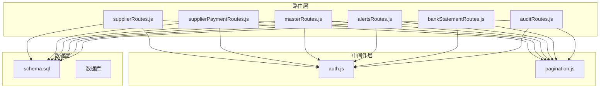

**图表来源**
- [supplierRoutes.js:1-370](file://server/src/routes/supplierRoutes.js#L1-L370)
- [supplierPaymentRoutes.js:1-177](file://server/src/routes/supplierPaymentRoutes.js#L1-L177)
- [masterRoutes.js:1-1513](file://server/src/routes/masterRoutes.js#L1-L1513)

## 核心组件

### 供应商信息管理模块

供应商管理模块提供了完整的供应商生命周期管理功能，包括基本信息维护、状态管理、产品关联等功能。

**关键特性：**
- 多字段搜索和过滤
- 支持激活/停用状态管理
- 供应商与产品的多对多关联
- 审计日志记录
- 权限控制（ADMIN/MANAGER）

### 付款处理模块

专门用于供应商付款记录的管理，支持月度付款记录、汇总统计和批量操作。

**核心功能：**
- 月度付款记录创建和更新
- 供应商付款汇总查询
- 付款记录删除
- 年度汇总统计

### 供应链协同模块

集成了低库存预警、采购建议、供应商评估等功能，实现供应链的智能化管理。

**集成功能：**
- 低库存自动预警
- 供应商响应时间跟踪
- 采购历史分析
- 风险评估指标

**章节来源**
- [supplierRoutes.js:23-92](file://server/src/routes/supplierRoutes.js#L23-L92)
- [supplierPaymentRoutes.js:19-70](file://server/src/routes/supplierPaymentRoutes.js#L19-L70)
- [alertsRoutes.js:80-197](file://server/src/routes/alertsRoutes.js#L80-L197)

## 架构概览

供应商管理路由模块采用分层架构设计，确保了良好的代码组织和可维护性：

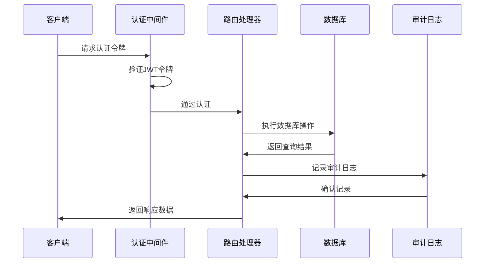

**图表来源**
- [auth.js:5-29](file://server/src/middleware/auth.js#L5-L29)
- [supplierRoutes.js:8-9](file://server/src/routes/supplierRoutes.js#L8-L9)

### 数据流架构

```mermaid
flowchart TD
Request[HTTP请求] --> Auth[认证中间件]
Auth --> Route[路由处理器]
Route --> Validation[参数验证]
Validation --> DB[数据库操作]
DB --> Response[响应数据]
Route --> Audit[审计日志]
Audit --> LogDB[日志存储]
subgraph "数据库表关系"
Suppliers[供应商表]
Payments[付款记录表]
Products[产品表]
ProductSuppliers[产品供应商关联表]
end
Suppliers <- --> ProductSuppliers
Products <- --> ProductSuppliers
Suppliers --> Payments
```

**图表来源**
- [schema.sql:302-356](file://server/database/schema.sql#L302-L356)
- [pagination.js:2-12](file://server/src/utils/pagination.js#L2-L12)

## 详细组件分析

### 供应商信息管理组件

#### 核心路由定义

供应商管理路由提供了RESTful API接口，支持标准的CRUD操作：

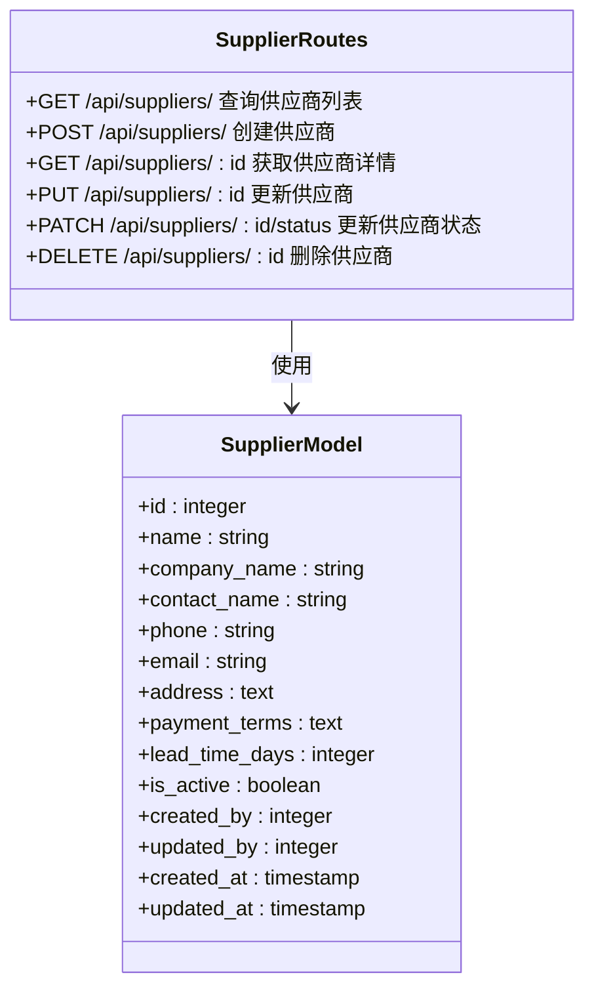

**图表来源**
- [supplierRoutes.js:23-369](file://server/src/routes/supplierRoutes.js#L23-L369)
- [schema.sql:302-318](file://server/database/schema.sql#L302-L318)

#### 搜索和过滤功能

供应商查询支持多种搜索条件和排序选项：

**搜索条件：**
- 公司名称模糊匹配
- 联系人姓名模糊匹配  
- 电话号码模糊匹配
- 邮箱地址模糊匹配
- 状态过滤（全部/激活/停用）

**排序选项：**
- 按公司名称排序
- 按创建时间排序
- 按更新时间排序
- 按交货时间排序

#### 供应商状态管理

供应商状态管理提供了灵活的状态控制机制：

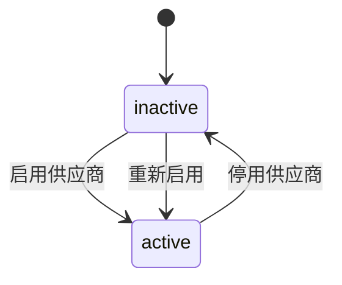

**图表来源**
- [supplierRoutes.js:315-344](file://server/src/routes/supplierRoutes.js#L315-L344)

**章节来源**
- [supplierRoutes.js:10-369](file://server/src/routes/supplierRoutes.js#L10-L369)

### 付款处理组件

#### 付款记录管理

付款处理模块提供了完整的供应商付款管理功能：

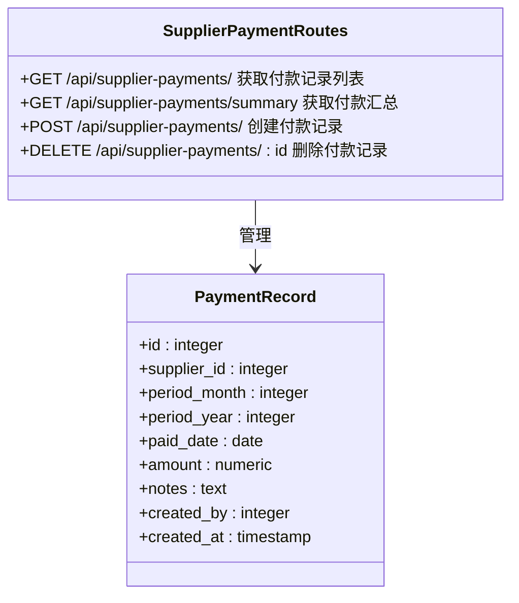

**图表来源**
- [supplierPaymentRoutes.js:19-176](file://server/src/routes/supplierPaymentRoutes.js#L19-L176)
- [schema.sql:335-346](file://server/database/schema.sql#L335-L346)

#### 月度付款汇总

付款汇总功能支持按年份查询供应商的月度付款情况：

**汇总维度：**
- 按供应商分组
- 按月份分组
- 按年份过滤
- 供应商基本信息

**输出格式：**
- 供应商ID和名称
- 供应商分支信息
- 12个月的付款记录数组
- 每条记录包含付款日期、金额、备注等信息

#### 付款周期计算

系统支持灵活的付款周期设置和计算：

**付款条件配置：**
- 供应商级别的付款条款
- 支持天数或固定日期
- 自动到期提醒
- 逾期处理机制

**章节来源**
- [supplierPaymentRoutes.js:72-112](file://server/src/routes/supplierPaymentRoutes.js#L72-L112)
- [masterRoutes.js:283-299](file://server/src/routes/masterRoutes.js#L283-L299)

### 供应链协同组件

#### 低库存预警系统

低库存预警系统集成了供应商管理的核心功能：

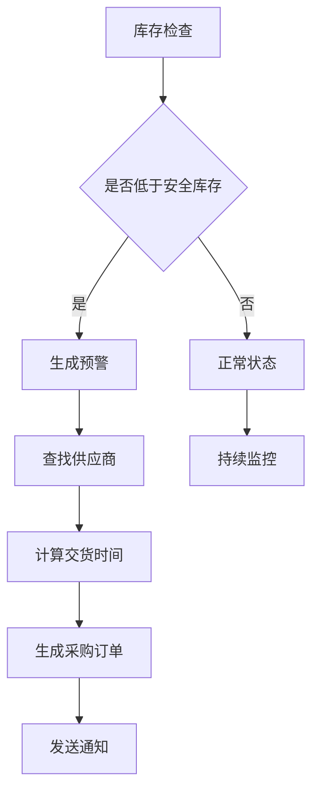

**图表来源**
- [alertsRoutes.js:80-197](file://server/src/routes/alertsRoutes.js#L80-L197)

#### 供应商评估机制

系统提供了多维度的供应商评估功能：

**评估指标：**
- 交货准时率
- 产品质量合格率
- 价格竞争力
- 服务响应时间
- 合作稳定性

**评估流程：**
1. 数据收集（订单、收货、质检）
2. 指标计算
3. 评分生成
4. 等级划分
5. 动态调整

#### 风险控制机制

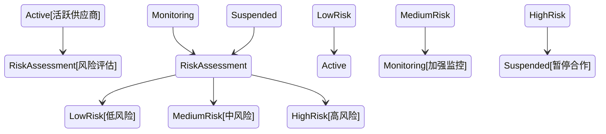

**图表来源**
- [alertsRoutes.js:199-232](file://server/src/routes/alertsRoutes.js#L199-L232)

**章节来源**
- [alertsRoutes.js:14-289](file://server/src/routes/alertsRoutes.js#L14-L289)

### 审计和合规组件

#### 审计日志系统

所有重要的供应商操作都会被记录在审计日志中：

**审计事件类型：**
- 供应商创建/更新/删除
- 供应商状态变更
- 付款记录创建/更新/删除
- 低库存预警处理
- 系统设置变更

**审计内容：**
- 操作用户信息
- 操作时间戳
- 操作类型
- 影响的数据实体
- 操作描述
- 请求IP地址

#### 合规性检查

系统内置了多项合规性检查机制：

**权限控制：**
- 角色基础访问控制
- 操作权限验证
- 数据访问限制

**数据完整性：**
- 必填字段验证
- 数据类型检查
- 业务规则约束
- 关联关系验证

**章节来源**
- [auditRoutes.js:15-107](file://server/src/routes/auditRoutes.js#L15-L107)
- [auth.js:32-40](file://server/src/middleware/auth.js#L32-L40)

## 依赖关系分析

### 数据库关系图

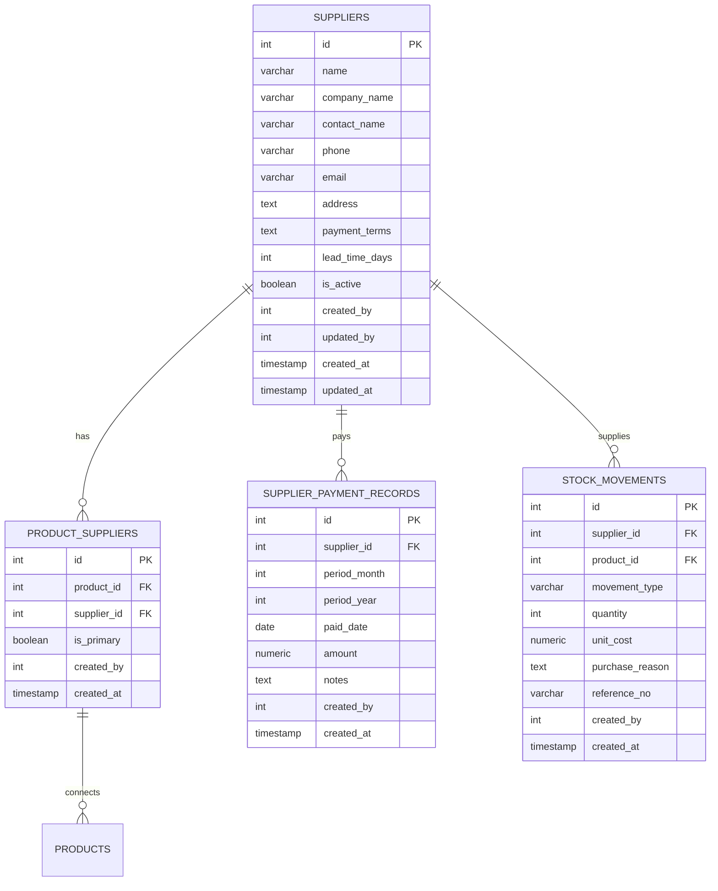

**图表来源**
- [schema.sql:302-356](file://server/database/schema.sql#L302-L356)

### 中间件依赖

供应商管理模块依赖多个中间件组件：

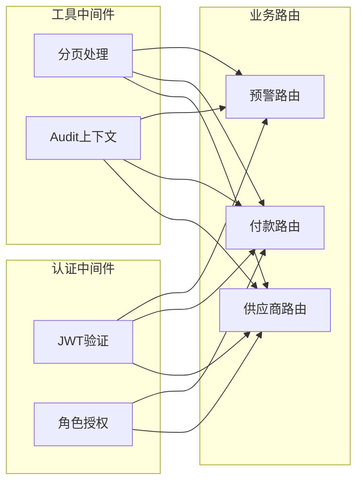

**图表来源**
- [auth.js:32-40](file://server/src/middleware/auth.js#L32-L40)
- [pagination.js:15-22](file://server/src/utils/pagination.js#L15-L22)

**章节来源**
- [schema.sql:1-447](file://server/database/schema.sql#L1-L447)
- [auth.js:1-46](file://server/src/middleware/auth.js#L1-L46)

## 性能考虑

### 查询优化策略

供应商管理模块采用了多种查询优化技术：

**索引优化：**
- 供应商名称索引
- 供应商激活状态索引
- 产品供应商关联索引
- 付款记录时间索引

**查询优化：**
- 分页查询避免全量加载
- 连接查询优化
- 条件过滤提前执行
- 结果集缓存策略

### 缓存策略

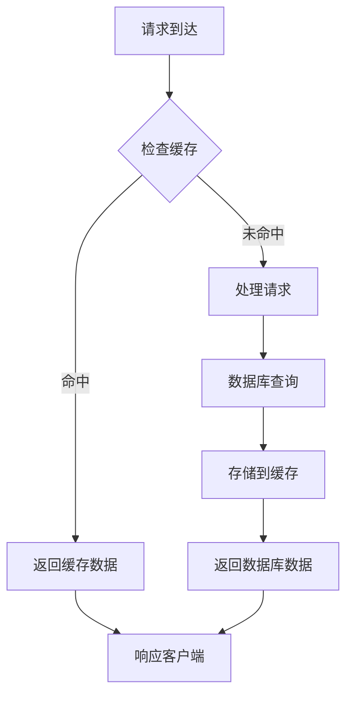

### 并发控制

系统采用了多层并发控制机制：

**数据库层面：**
- 事务隔离级别
- 行级锁机制
- 死锁检测和处理

**应用层面：**
- 请求队列管理
- 资源池控制
- 超时处理机制

## 故障排除指南

### 常见问题诊断

**认证失败：**
- 检查JWT令牌格式
- 验证令牌有效期
- 确认用户账户状态

**权限不足：**
- 验证用户角色
- 检查操作权限
- 确认资源访问权限

**数据验证错误：**
- 检查必填字段
- 验证数据类型
- 确认业务规则

### 错误处理机制

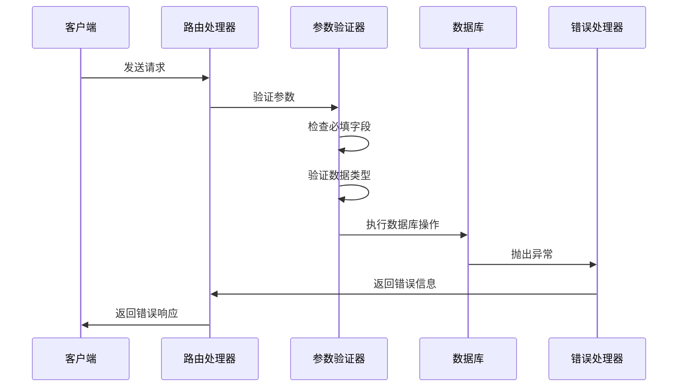

**图表来源**
- [supplierRoutes.js:89-91](file://server/src/routes/supplierRoutes.js#L89-L91)

### 日志分析

系统提供了全面的日志记录功能：

**日志级别：**
- 错误日志（ERROR）
- 警告日志（WARN）  
- 信息日志（INFO）
- 调试日志（DEBUG）

**日志内容：**
- 请求参数
- 响应结果
- 执行时间
- 错误堆栈

**章节来源**
- [auditRoutes.js:36-106](file://server/src/routes/auditRoutes.js#L36-L106)
- [bankStatementRoutes.js:239-252](file://server/src/routes/bankStatementRoutes.js#L239-L252)

## 结论

供应商管理路由模块是一个功能完整、架构清晰的供应链管理系统核心组件。它通过标准化的API接口、完善的权限控制、全面的审计日志和智能的风险控制机制，为企业提供了高效的供应商管理解决方案。

**主要优势：**
- 完整的供应商生命周期管理
- 智能的供应链协同机制  
- 强大的审计和合规能力
- 灵活的扩展和定制能力

**未来改进方向：**
- 增加更多供应商评估指标
- 优化大数据量场景下的性能
- 扩展移动端支持
- 增强AI驱动的智能决策功能

该模块为企业的数字化转型提供了坚实的技术基础，能够有效提升供应链管理效率和风险控制水平。