# 供应商采购历史追踪

<cite>
**本文档引用的文件**
- [supplierRoutes.js](file://server/src/routes/supplierRoutes.js)
- [inventoryRoutes.js](file://server/src/routes/inventoryRoutes.js)
- [reportRoutes.js](file://server/src/routes/reportRoutes.js)
- [schema.sql](file://server/database/schema.sql)
- [inventoryService.js](file://server/src/utils/inventoryService.js)
- [pagination.js](file://server/src/utils/pagination.js)
- [auth.js](file://server/src/middleware/auth.js)
- [SupplierDetailPage.vue](file://web/src/pages/SupplierDetailPage.vue)
- [seed.sql](file://server/database/seed.sql)
</cite>

## 目录
1. [简介](#简介)
2. [项目结构](#项目结构)
3. [核心组件](#核心组件)
4. [架构概览](#架构概览)
5. [详细组件分析](#详细组件分析)
6. [依赖关系分析](#依赖关系分析)
7. [性能考虑](#性能考虑)
8. [故障排除指南](#故障排除指南)
9. [结论](#结论)

## 简介

供应商采购历史追踪功能是库存管理系统中的重要组成部分，专门用于跟踪和分析供应商的采购活动。该功能通过监控入库操作的历史记录，提供完整的采购历史视图，包括最近采购记录查询、采购金额统计、采购频次分析等核心功能。

本功能基于PostgreSQL数据库设计，利用stock_movements表中的IN类型操作来记录所有采购入库活动，并通过多表关联查询提供丰富的统计数据和趋势分析。

## 项目结构

库存管理系统采用前后端分离架构，主要分为以下层次：

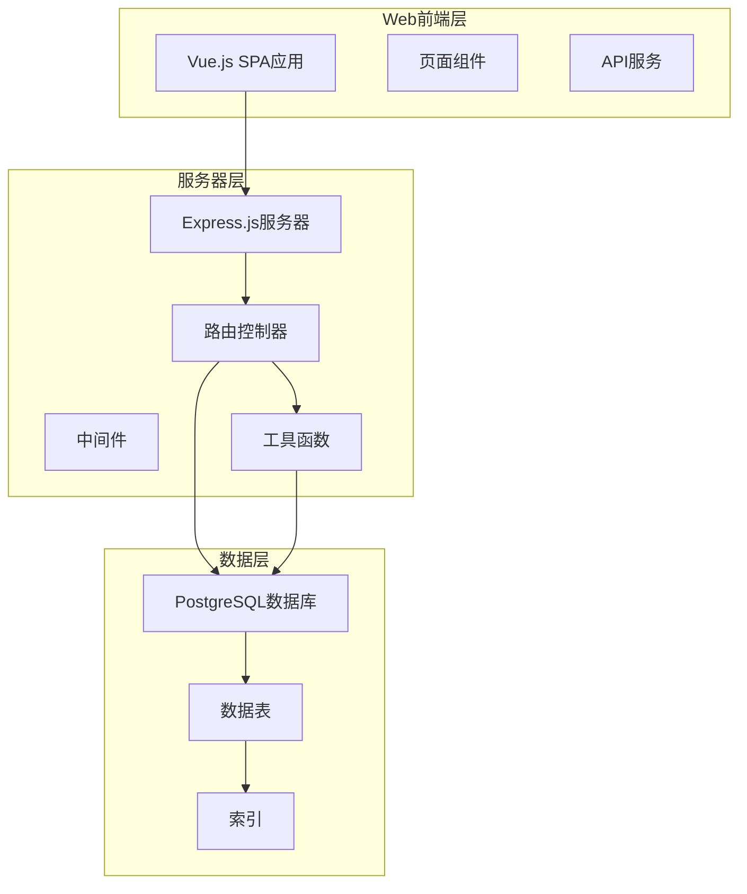

**图表来源**
- [supplierRoutes.js:1-370](file://server/src/routes/supplierRoutes.js#L1-L370)
- [inventoryRoutes.js:1-493](file://server/src/routes/inventoryRoutes.js#L1-L493)
- [schema.sql:1-447](file://server/database/schema.sql#L1-L447)

**章节来源**
- [supplierRoutes.js:1-370](file://server/src/routes/supplierRoutes.js#L1-L370)
- [inventoryRoutes.js:1-493](file://server/src/routes/inventoryRoutes.js#L1-L493)
- [schema.sql:1-447](file://server/database/schema.sql#L1-L447)

## 核心组件

### 数据模型设计

系统的核心数据模型围绕供应商、产品、仓库和库存移动展开：

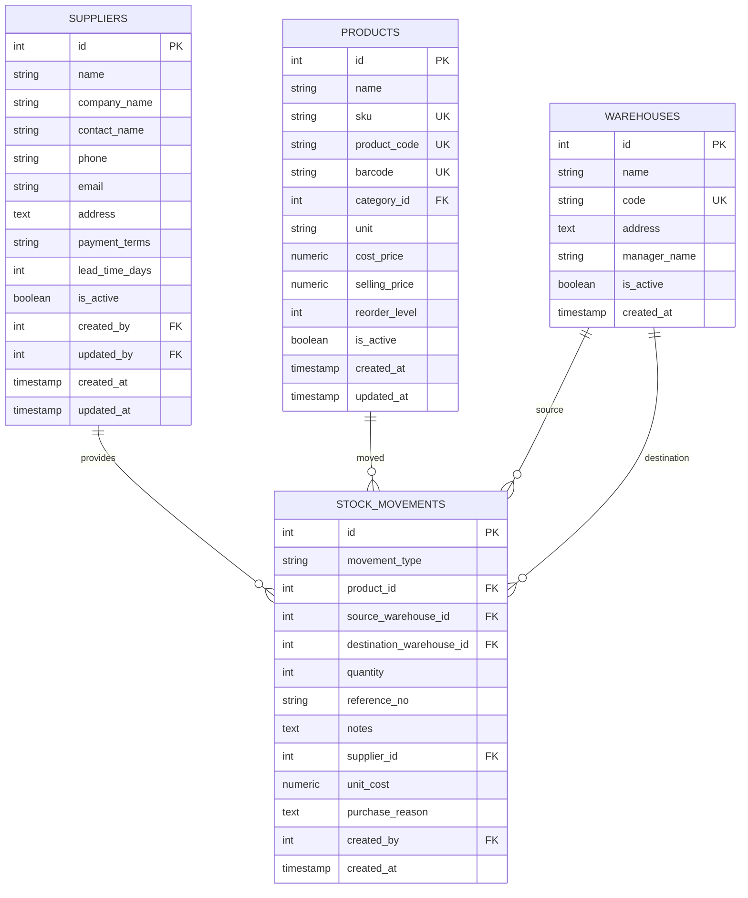

**图表来源**
- [schema.sql:302-366](file://server/database/schema.sql#L302-L366)

### 关键业务流程

系统通过以下核心流程实现供应商采购历史追踪：

1. **入库操作处理**: 当发生采购入库时，系统自动创建stock_movements记录
2. **历史数据查询**: 通过供应商ID过滤IN类型的库存移动记录
3. **统计数据聚合**: 计算采购金额、频次和时间分布
4. **趋势分析**: 提供月度和季度采购趋势分析

**章节来源**
- [schema.sql:237-248](file://server/database/schema.sql#L237-L248)
- [inventoryRoutes.js:229-403](file://server/src/routes/inventoryRoutes.js#L229-L403)

## 架构概览

### 系统架构设计

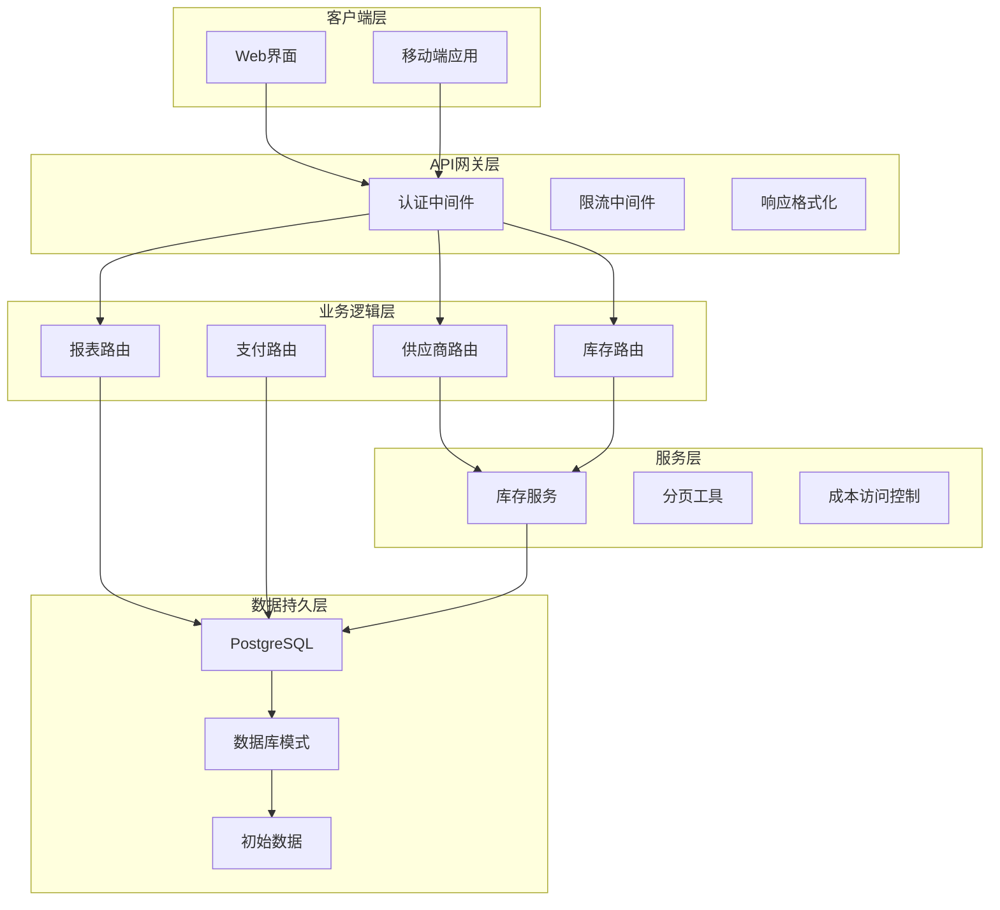

**图表来源**
- [auth.js:1-46](file://server/src/middleware/auth.js#L1-L46)
- [supplierRoutes.js:1-370](file://server/src/routes/supplierRoutes.js#L1-L370)
- [inventoryRoutes.js:1-493](file://server/src/routes/inventoryRoutes.js#L1-L493)
- [reportRoutes.js:1-252](file://server/src/routes/reportRoutes.js#L1-L252)

### 数据流架构

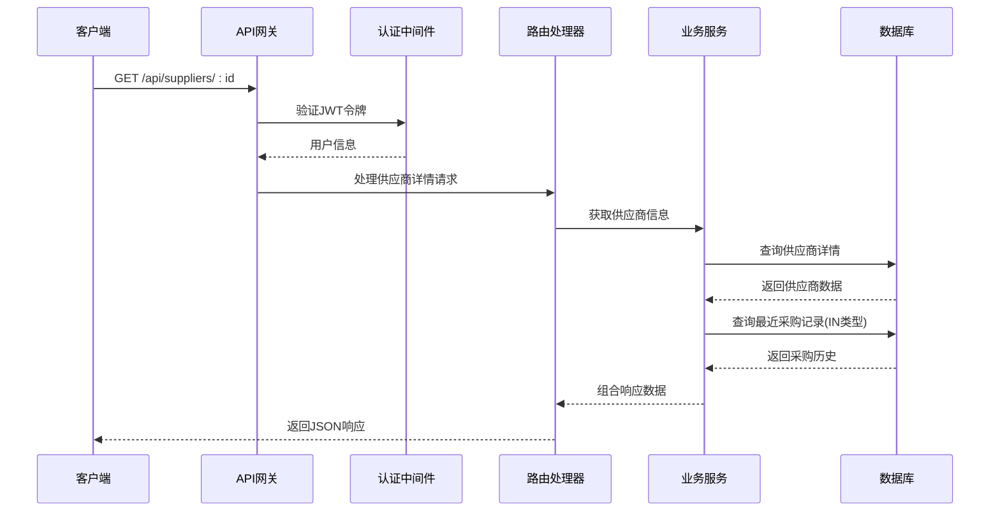

**图表来源**
- [supplierRoutes.js:171-232](file://server/src/routes/supplierRoutes.js#L171-L232)
- [auth.js:5-29](file://server/src/middleware/auth.js#L5-L29)

## 详细组件分析

### 供应商路由组件

供应商路由组件负责处理所有与供应商相关的请求，特别是采购历史追踪功能：

#### 供应商详情查询

供应商详情查询接口提供了三个核心数据集：
- 供应商基本信息
- 关联的产品列表
- 最近10条采购记录

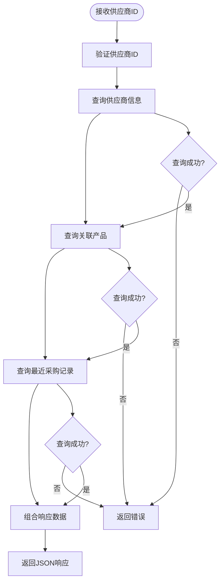

**图表来源**
- [supplierRoutes.js:171-232](file://server/src/routes/supplierRoutes.js#L171-L232)

#### 最近采购记录查询

最近采购记录查询专门针对IN类型的库存移动进行过滤：

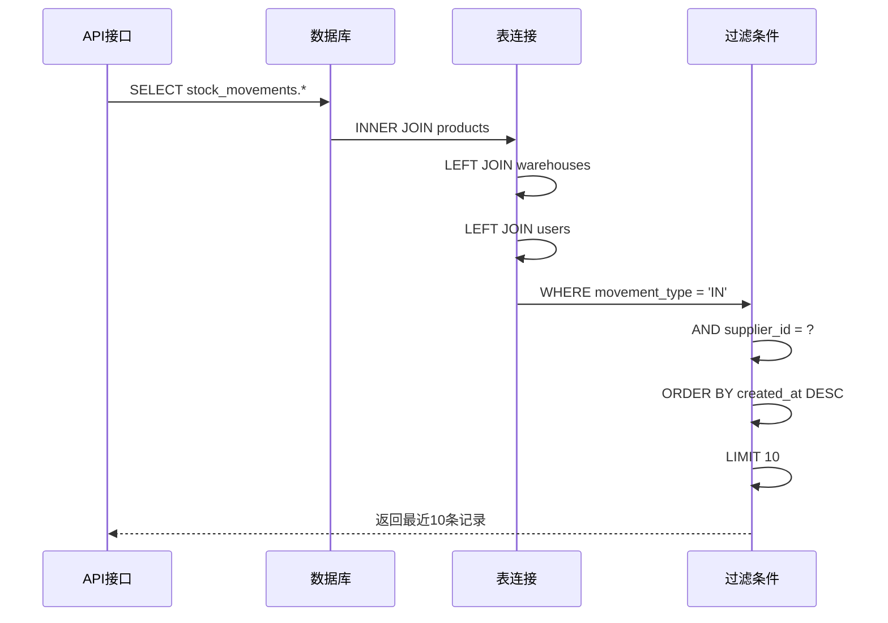

**图表来源**
- [supplierRoutes.js:193-217](file://server/src/routes/supplierRoutes.js#L193-L217)

**章节来源**
- [supplierRoutes.js:171-232](file://server/src/routes/supplierRoutes.js#L171-L232)

### 库存移动处理组件

库存移动处理组件负责管理所有库存操作，包括采购入库、出库和转移：

#### 入库操作处理逻辑

当执行采购入库操作时，系统需要处理以下关键步骤：

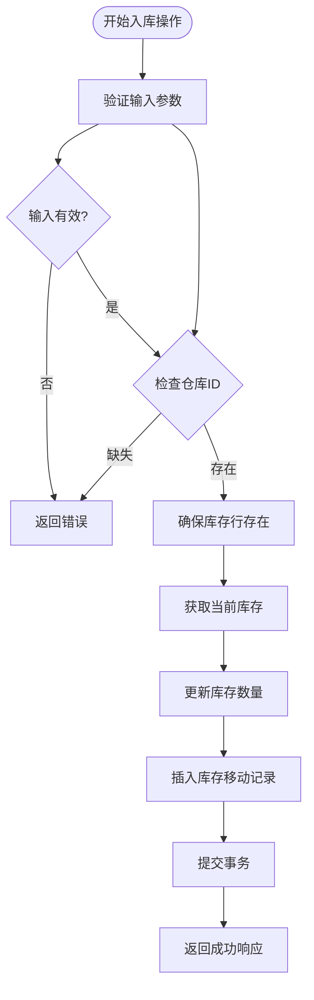

**图表来源**
- [inventoryRoutes.js:229-290](file://server/src/routes/inventoryRoutes.js#L229-L290)

#### IN类型操作的特殊处理

IN类型操作在stock_movements表中有特殊的字段要求：

| 字段名 | 必需性 | 描述 |
|--------|--------|------|
| movement_type | 必需 | 固定值'IN' |
| product_id | 必需 | 关联产品ID |
| destination_warehouse_id | 必需 | 目标仓库ID |
| quantity | 必需 | 入库数量 |
| supplier_id | 可选 | 供应商ID（用于采购） |
| unit_cost | 可选 | 单价（用于采购） |
| purchase_reason | 可选 | 采购原因 |

**章节来源**
- [inventoryRoutes.js:229-403](file://server/src/routes/inventoryRoutes.js#L229-L403)
- [schema.sql:358-366](file://server/database/schema.sql#L358-L366)

### 报表路由组件

报表路由组件提供更全面的采购历史分析功能：

#### 时间范围筛选

报表系统支持灵活的时间范围筛选：

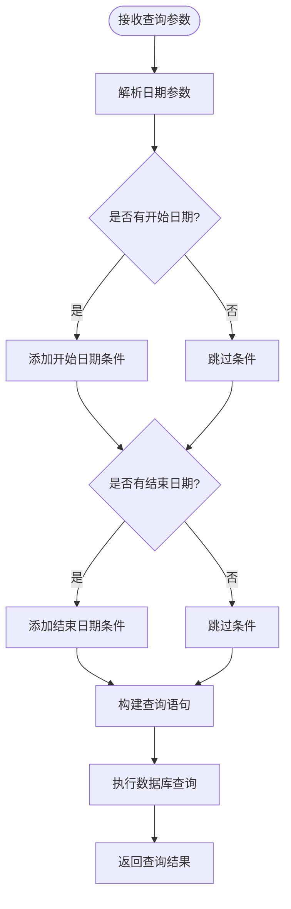

**图表来源**
- [reportRoutes.js:130-249](file://server/src/routes/reportRoutes.js#L130-L249)

**章节来源**
- [reportRoutes.js:130-249](file://server/src/routes/reportRoutes.js#L130-L249)

### 前端展示组件

前端使用Vue.js构建供应商详情页面，专门展示采购历史信息：

#### 供应商详情页面布局

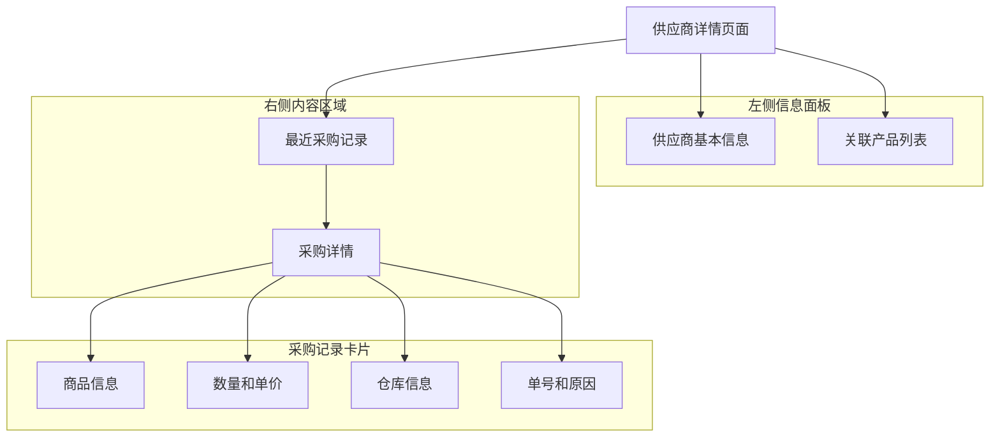

**图表来源**
- [SupplierDetailPage.vue:103-201](file://web/src/pages/SupplierDetailPage.vue#L103-L201)

**章节来源**
- [SupplierDetailPage.vue:1-207](file://web/src/pages/SupplierDetailPage.vue#L1-L207)

## 依赖关系分析

### 数据库依赖关系

系统中的关键表之间存在以下依赖关系：

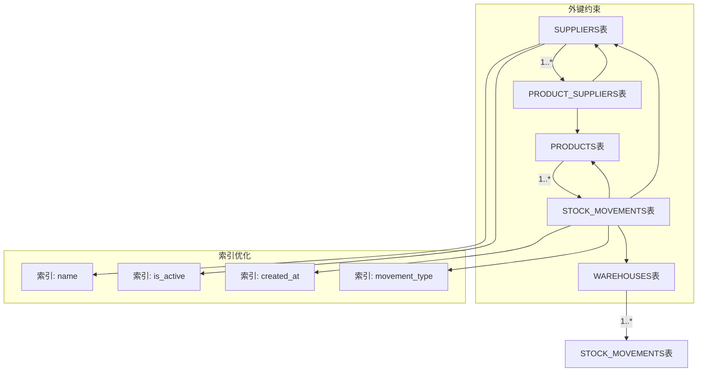

**图表来源**
- [schema.sql:434-447](file://server/database/schema.sql#L434-L447)

### 业务逻辑依赖

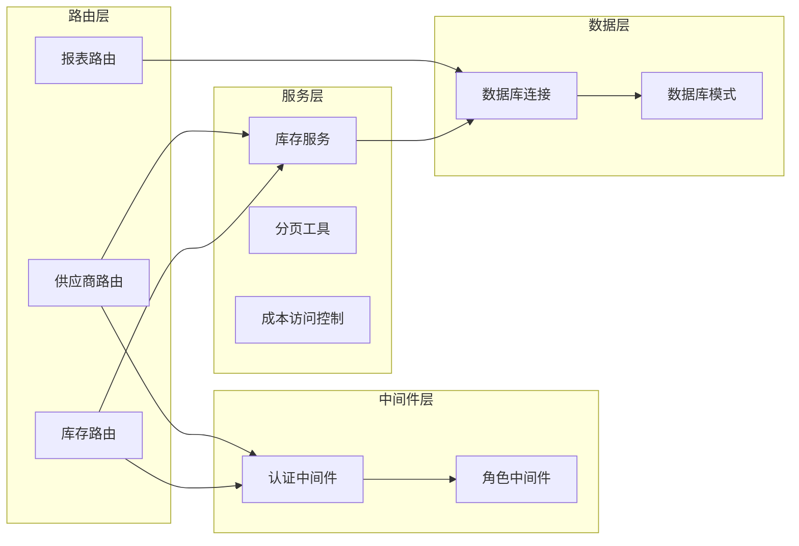

**图表来源**
- [auth.js:32-40](file://server/src/middleware/auth.js#L32-L40)
- [pagination.js:1-28](file://server/src/utils/pagination.js#L1-L28)

**章节来源**
- [schema.sql:1-447](file://server/database/schema.sql#L1-L447)
- [auth.js:1-46](file://server/src/middleware/auth.js#L1-L46)

## 性能考虑

### 查询优化策略

系统采用了多种查询优化策略来确保性能：

1. **索引优化**: 在常用查询字段上建立索引
2. **分页机制**: 使用LIMIT和OFFSET限制结果集大小
3. **并行查询**: 对于复杂查询使用Promise.all并行执行
4. **条件过滤**: 在数据库层面进行数据过滤

### 缓存策略

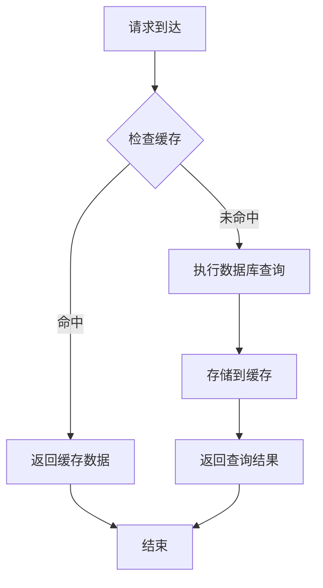

### 性能监控指标

系统应监控以下关键性能指标：
- 查询响应时间
- 并发连接数
- 数据库锁等待时间
- 缓存命中率

## 故障排除指南

### 常见问题及解决方案

#### 1. 供应商采购历史为空

**可能原因**:
- 供应商没有关联任何产品
- 数据库中没有IN类型的库存移动记录
- 供应商状态为非激活

**解决方法**:
- 检查供应商与产品的关联关系
- 验证库存移动记录是否正确创建
- 确认供应商状态为激活

#### 2. 采购金额统计不准确

**可能原因**:
- unit_cost字段为空或为NULL
- 重复的采购记录
- 货币汇率问题

**解决方法**:
- 确保入库操作时正确设置unit_cost
- 检查重复记录的去重逻辑
- 实施统一的货币处理机制

#### 3. 查询性能问题

**可能原因**:
- 缺少必要的数据库索引
- 查询条件过于复杂
- 数据量过大导致查询缓慢

**解决方法**:
- 添加适当的数据库索引
- 优化查询条件和WHERE子句
- 实施分页和结果集限制

**章节来源**
- [supplierRoutes.js:220-231](file://server/src/routes/supplierRoutes.js#L220-L231)
- [inventoryRoutes.js:243-286](file://server/src/routes/inventoryRoutes.js#L243-L286)

## 结论

供应商采购历史追踪功能通过精心设计的数据模型和业务逻辑，为库存管理系统提供了完整的供应商采购活动监控能力。该功能的主要优势包括：

1. **实时性**: 基于IN类型库存移动的实时记录
2. **完整性**: 提供从供应商、产品到仓库的全链路追踪
3. **可扩展性**: 支持灵活的时间范围筛选和统计分析
4. **用户体验**: 通过直观的前端界面展示复杂的采购历史数据

通过合理的数据库设计、高效的查询优化和完善的错误处理机制，该功能能够满足企业级库存管理的需求，为采购决策提供可靠的数据支持。

未来可以考虑的功能增强包括：
- 更详细的采购趋势分析
- 供应商绩效评估指标
- 自动化的采购建议生成
- 多维度的数据可视化展示