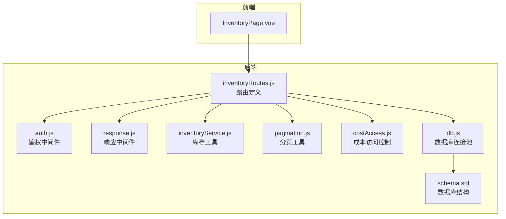
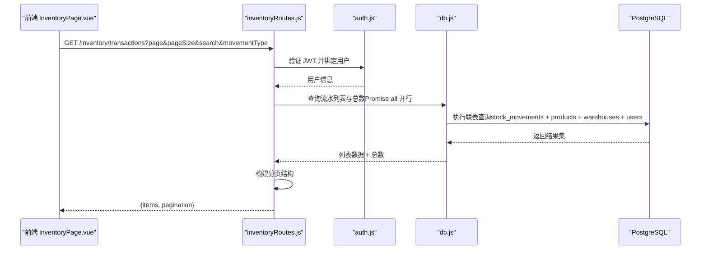
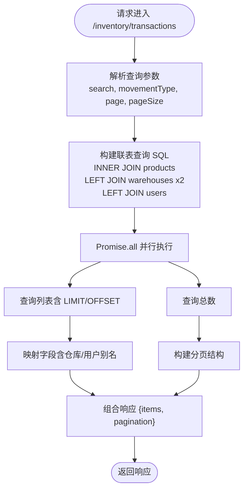
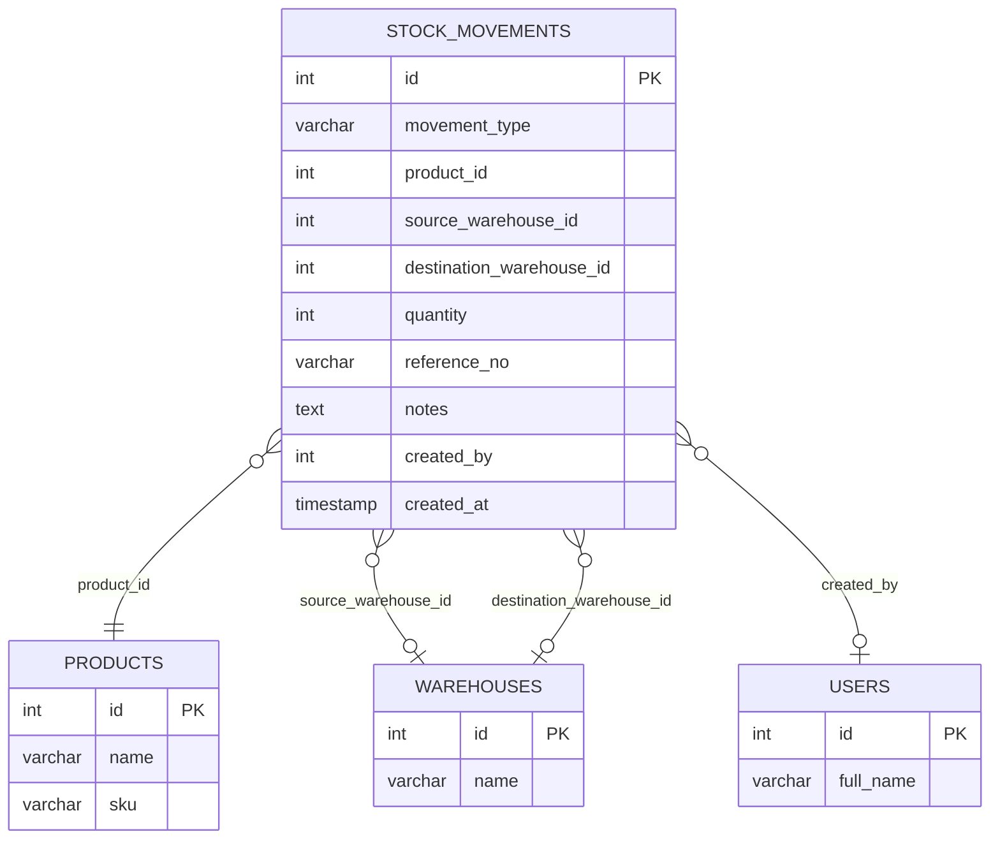
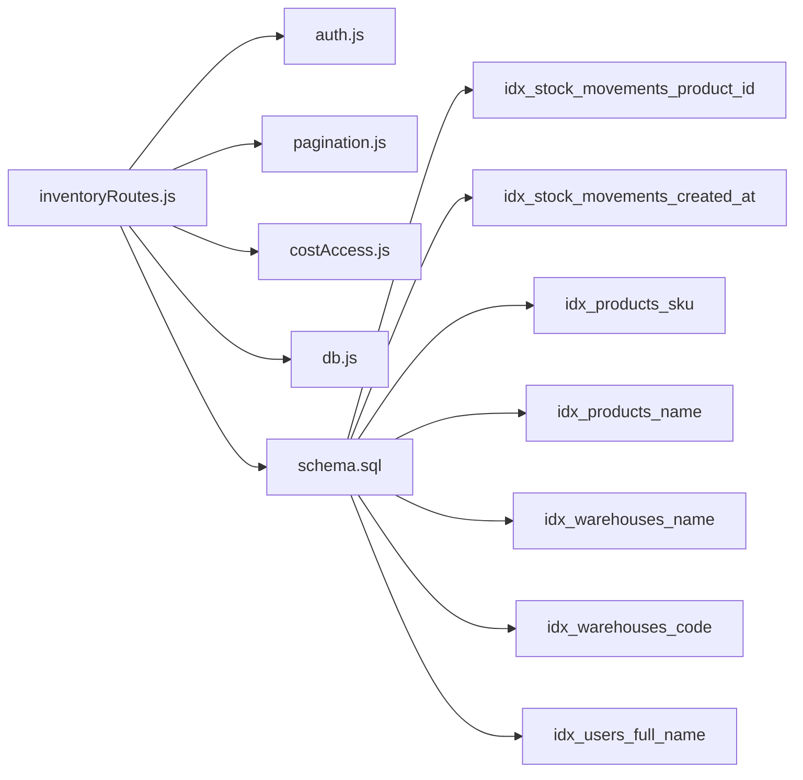

# 交易流水路由

<cite>
**本文引用的文件**
- [server/src/routes/inventoryRoutes.js](file://server/src/routes/inventoryRoutes.js)
- [server/src/utils/inventoryService.js](file://server/src/utils/inventoryService.js)
- [server/src/utils/pagination.js](file://server/src/utils/pagination.js)
- [server/src/utils/costAccess.js](file://server/src/utils/costAccess.js)
- [server/src/middleware/auth.js](file://server/src/middleware/auth.js)
- [server/src/config/db.js](file://server/src/config/db.js)
- [server/database/schema.sql](file://server/database/schema.sql)
- [web/src/pages/InventoryPage.vue](file://web/src/pages/InventoryPage.vue)
- [postman/inventory_system_backend.postman_collection.json](file://postman/inventory_system_backend.postman_collection.json)
</cite>

## 目录
1. [简介](#简介)
2. [项目结构](#项目结构)
3. [核心组件](#核心组件)
4. [架构概览](#架构概览)
5. [详细组件分析](#详细组件分析)
6. [依赖关系分析](#依赖关系分析)
7. [性能考虑](#性能考虑)
8. [故障排查指南](#故障排查指南)
9. [结论](#结论)
10. [附录](#附录)

## 简介
本文件针对交易流水路由进行深入技术文档化，重点覆盖以下内容：
- GET /api/inventory/transactions 接口的完整实现与行为
- 库存流水查询、类型筛选（IN/OUT/TRANSFER）与分页机制
- 联表查询的复杂性与性能优化策略
- 不同移动类型的业务含义与数据结构差异
- 搜索功能对产品名称、SKU、参考号、仓库名称与操作员的模糊匹配实现
- 查询性能优化与索引设计建议

该接口服务于库存管理系统的“最近流水”展示，支持前端表格按需渲染当前页数据，并提供灵活的搜索与筛选能力。

## 项目结构
后端采用 Express + PostgreSQL 的典型分层架构：
- 路由层：定义 REST API，解析查询参数与请求体
- 中间件层：鉴权、授权、响应格式化等
- 工具层：通用服务（库存、分页、成本访问控制）
- 数据层：数据库连接池与 SQL 定义
- 前端：Vue 单页应用，通过 API 获取数据并驱动 UI

图表来源
- [server/src/routes/inventoryRoutes.js:154-227](file://server/src/routes/inventoryRoutes.js#L154-L227)
- [server/src/middleware/auth.js:1-46](file://server/src/middleware/auth.js#L1-L46)
- [server/src/utils/inventoryService.js:1-45](file://server/src/utils/inventoryService.js#L1-L45)
- [server/src/utils/pagination.js:1-28](file://server/src/utils/pagination.js#L1-L28)
- [server/src/utils/costAccess.js:1-32](file://server/src/utils/costAccess.js#L1-L32)
- [server/src/config/db.js:1-25](file://server/src/config/db.js#L1-L25)
- [server/database/schema.sql:237-248](file://server/database/schema.sql#L237-L248)

章节来源
- [server/src/routes/inventoryRoutes.js:154-227](file://server/src/routes/inventoryRoutes.js#L154-L227)
- [server/database/schema.sql:237-248](file://server/database/schema.sql#L237-L248)

## 核心组件
- 交易流水路由：提供 GET /api/inventory/transactions，支持搜索、类型筛选与分页
- 分页工具：统一处理分页参数与构建分页响应结构
- 鉴权中间件：确保请求携带有效 JWT 并绑定用户信息
- 成本访问控制：基于特殊头部令牌控制敏感字段可见性
- 数据库连接池：封装连接与查询执行，支持 SSL 连接策略

章节来源
- [server/src/routes/inventoryRoutes.js:154-227](file://server/src/routes/inventoryRoutes.js#L154-L227)
- [server/src/utils/pagination.js:1-28](file://server/src/utils/pagination.js#L1-L28)
- [server/src/middleware/auth.js:1-46](file://server/src/middleware/auth.js#L1-L46)
- [server/src/utils/costAccess.js:1-32](file://server/src/utils/costAccess.js#L1-L32)
- [server/src/config/db.js:1-25](file://server/src/config/db.js#L1-L25)

## 架构概览
交易流水查询的端到端流程如下：

图表来源
- [server/src/routes/inventoryRoutes.js:154-227](file://server/src/routes/inventoryRoutes.js#L154-L227)
- [server/src/middleware/auth.js:5-29](file://server/src/middleware/auth.js#L5-L29)
- [server/src/config/db.js:21-24](file://server/src/config/db.js#L21-L24)

## 详细组件分析

### GET /api/inventory/transactions 实现细节
- 请求参数
  - search：模糊搜索关键词
  - movementType：流水类型筛选，可选值为 all、IN、OUT、TRANSFER
  - page、pageSize：分页参数
- 处理逻辑
  - 使用 Promise.all 并行执行两个查询：列表查询与总数统计
  - 列表查询包含 LIMIT/OFFSET 以支持分页
  - 总数查询用于构建分页元数据
- 返回结构
  - items：当前页流水记录数组
  - pagination：包含 total、page、pageSize、totalPages 的分页信息

图表来源
- [server/src/routes/inventoryRoutes.js:154-227](file://server/src/routes/inventoryRoutes.js#L154-L227)

章节来源
- [server/src/routes/inventoryRoutes.js:154-227](file://server/src/routes/inventoryRoutes.js#L154-L227)

### 搜索功能与模糊匹配
- 模糊匹配规则
  - 对产品名称、SKU、参考号、移动类型、源/目的仓库名称、创建人姓名进行 ILIKE 匹配
  - 关键词前后添加通配符 %，支持前缀/中缀/后缀匹配
- 参数处理
  - 将 search 参数标准化为 %search% 形式，便于 SQL LIKE/ILIKE 使用
- 性能考量
  - ILIKE 全字段扫描在大数据量下代价较高，建议配合索引与查询限制

章节来源
- [server/src/routes/inventoryRoutes.js:180-189](file://server/src/routes/inventoryRoutes.js#L180-L189)
- [server/src/routes/inventoryRoutes.js:204-214](file://server/src/routes/inventoryRoutes.js#L204-L214)

### 类型筛选（IN/OUT/TRANSFER）
- movementType 支持 all 或具体类型
- 当 movementType = 'all' 时不进行类型过滤
- 当传入具体类型时，WHERE 条件精确匹配该类型
- 业务含义
  - IN：入库，增加可用库存
  - OUT：出库，减少可用库存
  - TRANSFER：调拨，源仓减少、目的仓增加

章节来源
- [server/src/routes/inventoryRoutes.js:190](file://server/src/routes/inventoryRoutes.js#L190)
- [server/database/schema.sql:239](file://server/database/schema.sql#L239)

### 分页机制
- 分页参数
  - page 默认 1，最小为 1
  - pageSize 默认 10，范围 1-100
  - offset = (page - 1) × pageSize
- 响应结构
  - total：总数
  - page、pageSize、totalPages：分页元数据
- 并行查询
  - 列表查询与总数查询并行执行，降低往返延迟

章节来源
- [server/src/utils/pagination.js:2-12](file://server/src/utils/pagination.js#L2-L12)
- [server/src/utils/pagination.js:15-22](file://server/src/utils/pagination.js#L15-L22)
- [server/src/routes/inventoryRoutes.js:160-161](file://server/src/routes/inventoryRoutes.js#L160-L161)
- [server/src/routes/inventoryRoutes.js:196-197](file://server/src/routes/inventoryRoutes.js#L196-L197)

### 联表查询复杂性与数据结构
- 表关联
  - stock_movements 主表
  - products：产品名称、SKU
  - warehouses（别名）：源仓与目的仓名称
  - users：创建人姓名
- 字段映射
  - movement_type、quantity、reference_no、notes、created_at
  - product_name、sku
  - source_warehouse_name、destination_warehouse_name
  - created_by_name
- 复杂性来源
  - 三表联结（含两次 LEFT JOIN 仓库表）
  - 动态 WHERE 条件（搜索与类型筛选）
  - 两套 SQL（列表 + 总数）几乎一致，维护成本高

图表来源
- [server/database/schema.sql:237-248](file://server/database/schema.sql#L237-L248)
- [server/database/schema.sql:32-54](file://server/database/schema.sql#L32-L54)
- [server/database/schema.sql:22-30](file://server/database/schema.sql#L22-L30)
- [server/database/schema.sql:2-11](file://server/database/schema.sql#L2-L11)

章节来源
- [server/database/schema.sql:237-248](file://server/database/schema.sql#L237-L248)
- [server/src/routes/inventoryRoutes.js:175-179](file://server/src/routes/inventoryRoutes.js#L175-L179)
- [server/src/routes/inventoryRoutes.js:200-203](file://server/src/routes/inventoryRoutes.js#L200-L203)

### 不同移动类型的业务含义与数据结构差异
- IN（入库）
  - 必填：warehouseId、quantity
  - 可选：referenceNo、notes、supplierId、unitCost、purchaseReason
  - 结果：stock_levels 增加数量；stock_movements 记录 IN
- OUT（出库）
  - 必填：warehouseId、quantity
  - 结果：stock_levels 减少数量；stock_movements 记录 OUT
- TRANSFER（调拨）
  - 必填：sourceWarehouseId、destinationWarehouseId、quantity
  - 结果：源仓减少、目的仓增加；stock_movements 记录 TRANSFER
- 数据结构差异
  - IN/OUT 仅涉及一个仓库字段（destination_warehouse_id 或 source_warehouse_id）
  - TRANSFER 涉及两个仓库字段
  - IN 可能包含供应商与单价信息

章节来源
- [server/src/routes/inventoryRoutes.js:229-403](file://server/src/routes/inventoryRoutes.js#L229-L403)
- [server/database/schema.sql:237-248](file://server/database/schema.sql#L237-L248)

### 前端交互与示例
- 前端通过 InventoryPage.vue 同步加载库存与流水
- 交易流水查询示例（Postman）
  - GET /inventory/transactions?search=&movementType=all&page=1&pageSize=8
- 前端参数映射
  - search 映射到 transactionSearch
  - movementType 映射到 transactionFilters.movementType
  - page/pageSize 映射到 transactionPagination

章节来源
- [web/src/pages/InventoryPage.vue:131-138](file://web/src/pages/InventoryPage.vue#L131-L138)
- [postman/inventory_system_backend.postman_collection.json:258-271](file://postman/inventory_system_backend.postman_collection.json#L258-L271)

## 依赖关系分析
- 路由依赖
  - 鉴权中间件：确保请求合法性
  - 分页工具：统一参数与响应结构
  - 成本访问控制：影响敏感字段可见性
  - 数据库连接池：提供查询执行能力
- 数据库依赖
  - stock_movements：主表
  - products、warehouses、users：联结表
- 索引依赖
  - stock_movements.product_id、created_at：查询与排序关键字段
  - products.sku、products.name：搜索匹配字段
  - warehouses.name、warehouses.code：仓库匹配字段
  - users.full_name：操作员匹配字段

图表来源
- [server/src/routes/inventoryRoutes.js:154-227](file://server/src/routes/inventoryRoutes.js#L154-L227)
- [server/database/schema.sql:417-418](file://server/database/schema.sql#L417-L418)
- [server/database/schema.sql:410-411](file://server/database/schema.sql#L410-L411)
- [server/database/schema.sql:416](file://server/database/schema.sql#L416)
- [server/database/schema.sql:431](file://server/database/schema.sql#L431)
- [server/database/schema.sql:433](file://server/database/schema.sql#L433)

章节来源
- [server/src/routes/inventoryRoutes.js:154-227](file://server/src/routes/inventoryRoutes.js#L154-L227)
- [server/database/schema.sql:410-447](file://server/database/schema.sql#L410-L447)

## 性能考虑
- 查询复杂度
  - 三表联结（stock_movements + products + warehouses + users）
  - 动态 WHERE 条件（ILIKE 多字段），可能触发全表扫描
- 并行查询策略
  - 列表查询与总数查询并行执行，显著降低延迟
- 索引建议
  - stock_movements.created_at：按时间倒序排序，建议建立索引
  - stock_movements.product_id：按产品过滤，建议建立索引
  - products.sku/name：搜索匹配字段，建议建立索引
  - warehouses.name/code：仓库匹配字段，建议建立索引
  - users.full_name：操作员匹配字段，建议建立索引
- 查询优化建议
  - 限制默认 pageSize，避免一次性返回过多数据
  - 对高频搜索字段建立 GIN/BTree 索引
  - 在高并发场景下考虑缓存近期流水（如 Redis）
  - 对 ILIKE 使用前缀匹配（%term）优于中缀匹配（%term%）以利用索引
- 数据库连接
  - 使用连接池，合理设置超时与 SSL 策略

章节来源
- [server/src/routes/inventoryRoutes.js:160-161](file://server/src/routes/inventoryRoutes.js#L160-L161)
- [server/src/routes/inventoryRoutes.js:196-197](file://server/src/routes/inventoryRoutes.js#L196-L197)
- [server/src/config/db.js:13-19](file://server/src/config/db.js#L13-L19)
- [server/database/schema.sql:417-418](file://server/database/schema.sql#L417-L418)
- [server/database/schema.sql:410-411](file://server/database/schema.sql#L410-L411)
- [server/database/schema.sql:416](file://server/database/schema.sql#L416)
- [server/database/schema.sql:431](file://server/database/schema.sql#L431)
- [server/database/schema.sql:433](file://server/database/schema.sql#L433)

## 故障排查指南
- 常见错误与原因
  - 未携带 Authorization 头或令牌无效：鉴权中间件返回 401
  - 无权限执行操作：授权中间件返回 403
  - 查询失败：数据库连接异常或 SQL 执行错误，返回 500
  - 业务校验失败：如库存不足、仓库相同等，返回 400
- 错误处理流程
  - 鉴权失败：直接返回 401
  - 授权失败：直接返回 403
  - 业务异常：捕获错误并返回 400
  - 数据库异常：捕获错误并返回 500
- 建议的日志与监控
  - 记录请求参数与响应状态
  - 监控慢查询与错误率
  - 对高频搜索关键词进行统计分析

章节来源
- [server/src/middleware/auth.js:5-29](file://server/src/middleware/auth.js#L5-L29)
- [server/src/routes/inventoryRoutes.js:224-226](file://server/src/routes/inventoryRoutes.js#L224-L226)
- [server/src/routes/inventoryRoutes.js:397-400](file://server/src/routes/inventoryRoutes.js#L397-L400)

## 结论
GET /api/inventory/transactions 接口通过并行查询与合理的分页策略，在保证功能完整性的同时兼顾了性能与可维护性。其联表查询与多字段模糊匹配为前端提供了强大的检索能力，但同时也对数据库索引与查询优化提出了更高要求。建议结合高频字段建立索引、限制默认分页大小，并在高并发场景下引入缓存与慢查询监控，以持续优化用户体验与系统稳定性。

## 附录
- 接口定义与示例
  - GET /api/inventory/transactions
    - 查询参数：search、movementType、page、pageSize
    - 示例：参见 Postman 集合中的 /inventory/transactions 请求
- 前端调用示例
  - 前端通过 InventoryPage.vue 的 loadInventoryPage 方法发起请求
  - 参数映射：search -> transactionSearch，movementType -> transactionFilters.movementType

章节来源
- [postman/inventory_system_backend.postman_collection.json:258-271](file://postman/inventory_system_backend.postman_collection.json#L258-L271)
- [web/src/pages/InventoryPage.vue:131-138](file://web/src/pages/InventoryPage.vue#L131-L138)