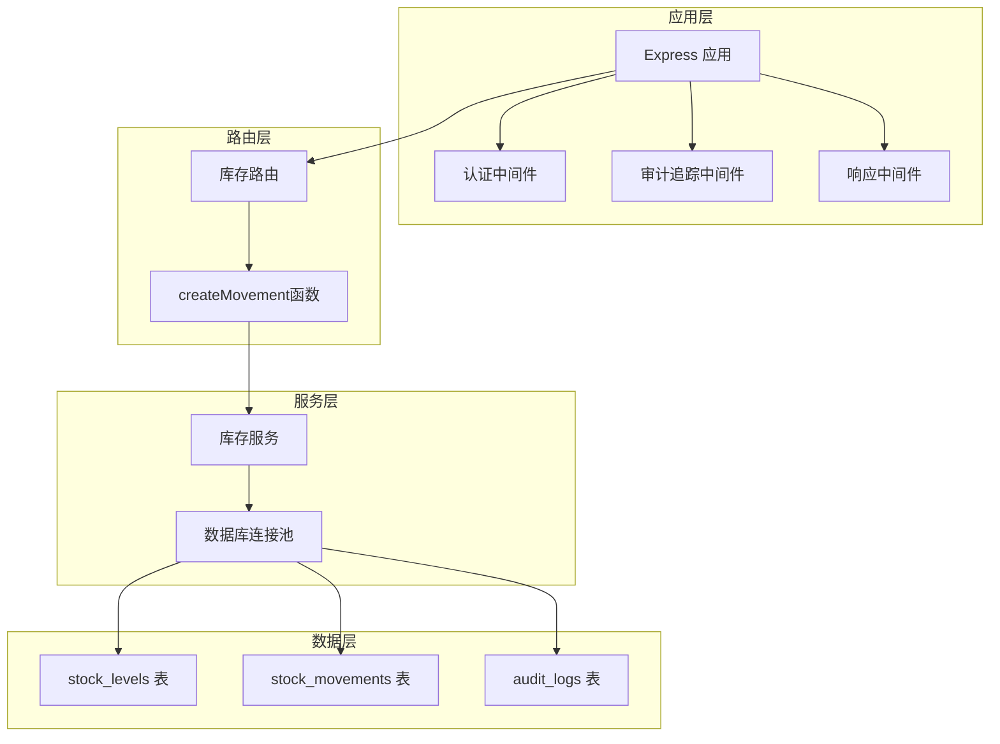
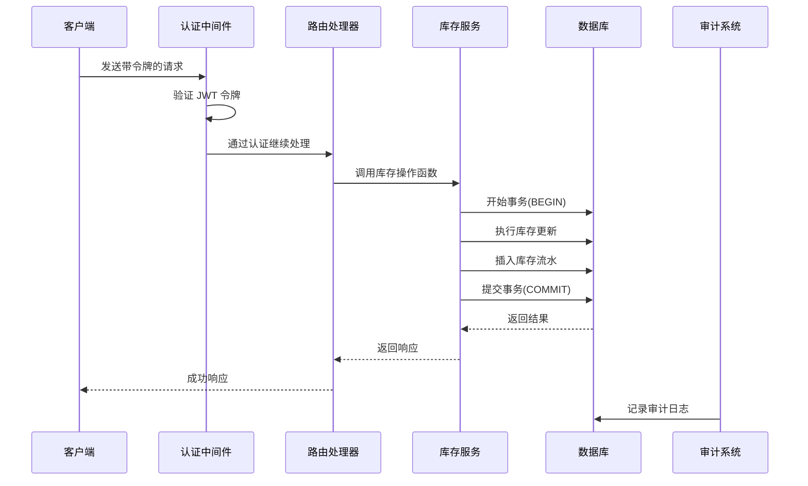
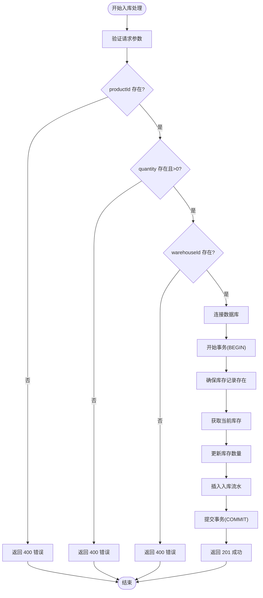
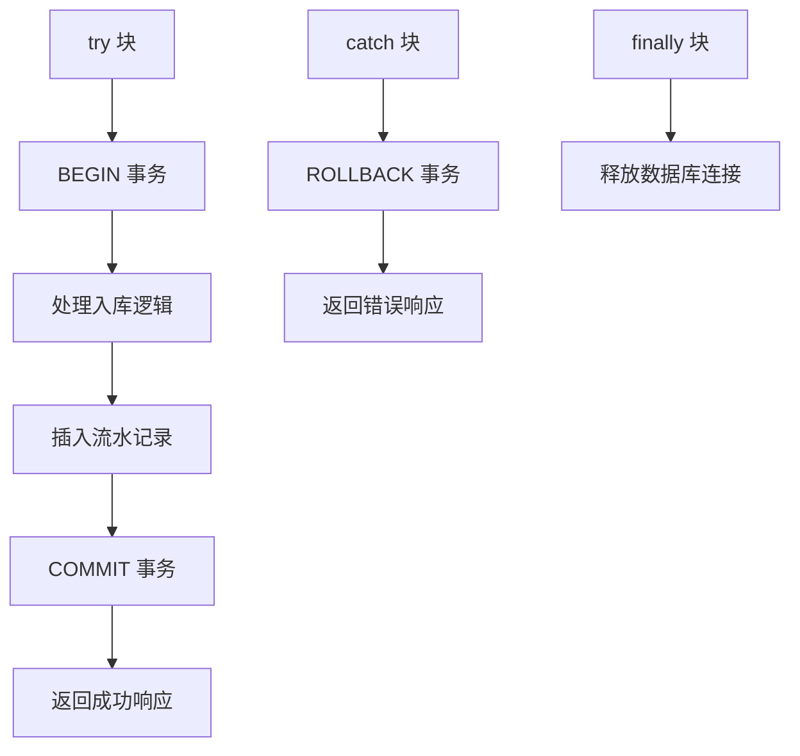
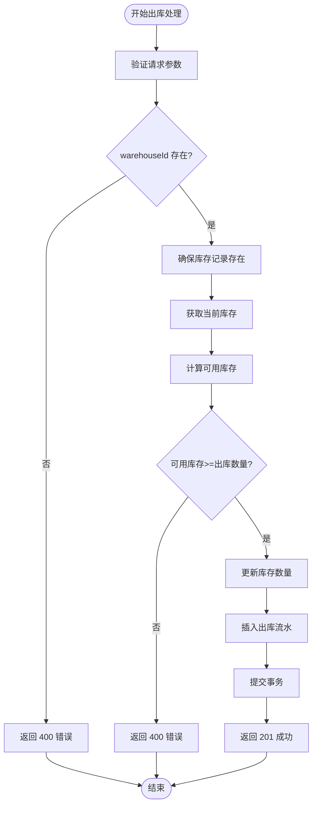
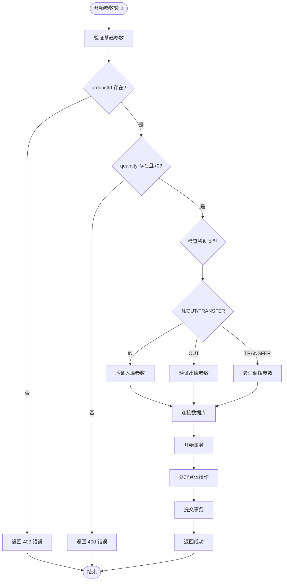
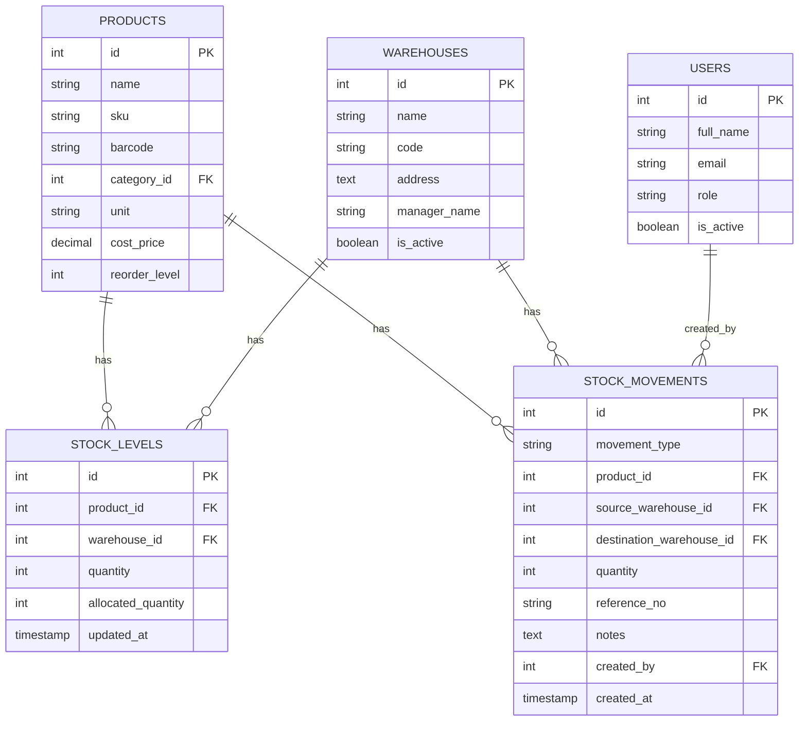
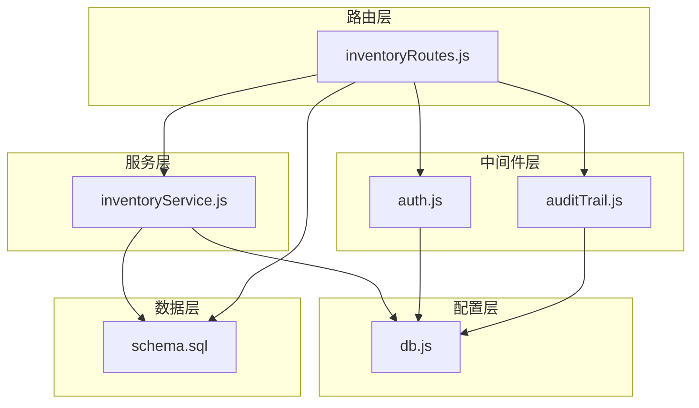

# 出入库操作路由

<cite>
**本文档引用的文件**
- [server/src/routes/inventoryRoutes.js](file://server/src/routes/inventoryRoutes.js)
- [server/src/utils/inventoryService.js](file://server/src/utils/inventoryService.js)
- [server/src/middleware/auth.js](file://server/src/middleware/auth.js)
- [server/src/middleware/auditTrail.js](file://server/src/middleware/auditTrail.js)
- [server/src/config/db.js](file://server/src/config/db.js)
- [server/database/schema.sql](file://server/database/schema.sql)
- [server/database/seed.sql](file://server/database/seed.sql)
- [server/src/utils/auditLog.js](file://server/src/utils/auditLog.js)
- [server/src/app.js](file://server/src/app.js)
- [server/src/server.js](file://server/src/server.js)
</cite>

## 目录
1. [简介](#简介)
2. [项目结构](#项目结构)
3. [核心组件](#核心组件)
4. [架构概览](#架构概览)
5. [详细组件分析](#详细组件分析)
6. [依赖关系分析](#依赖关系分析)
7. [性能考虑](#性能考虑)
8. [故障排除指南](#故障排除指南)
9. [结论](#结论)

## 简介

本文档详细说明了库存系统中的出入库操作路由实现，重点涵盖以下接口：
- POST /api/inventory/stock-in（入库）
- POST /api/inventory/stock-out（出库）

文档深入解释了库存变更的事务处理机制，包括 BEGIN/COMMIT/ROLLBACK 的使用；库存验证逻辑，包括可用库存检查和并发控制；createMovement 函数的通用处理流程和参数验证；错误处理策略和数据一致性保证机制；以及权限控制和操作审计要求。

## 项目结构

库存路由模块位于 server/src/routes/inventoryRoutes.js 文件中，采用 Express.js 框架构建，遵循模块化设计原则。该模块集成了认证中间件、授权中间件、审计追踪中间件，并通过统一的数据库连接池进行数据操作。

**图表来源**
- [server/src/app.js:26-56](file://server/src/app.js#L26-L56)
- [server/src/routes/inventoryRoutes.js:1-493](file://server/src/routes/inventoryRoutes.js#L1-L493)
- [server/src/config/db.js:13-24](file://server/src/config/db.js#L13-L24)

**章节来源**
- [server/src/app.js:26-56](file://server/src/app.js#L26-L56)
- [server/src/routes/inventoryRoutes.js:1-493](file://server/src/routes/inventoryRoutes.js#L1-L493)

## 核心组件

### 认证与授权中间件

系统采用基于 JWT 的认证机制，所有库存路由都必须通过 authenticateToken 中间件验证。授权中间件 authorizeRoles 根据用户角色限制访问权限，确保只有具备相应权限的用户才能执行库存操作。

### 数据库连接管理

使用 PostgreSQL 连接池 pool 进行数据库操作，支持 SSL 连接配置和超时控制。数据库连接在应用启动时进行健康检查，确保服务可用性。

### 审计追踪系统

集成统一的审计追踪中间件，自动记录所有成功的 POST/PUT/PATCH/DELETE 操作，包括操作者信息、实体类型、方法、路径和请求体等元数据。

**章节来源**
- [server/src/middleware/auth.js:5-45](file://server/src/middleware/auth.js#L5-L45)
- [server/src/config/db.js:13-24](file://server/src/config/db.js#L13-L24)
- [server/src/middleware/auditTrail.js:47-84](file://server/src/middleware/auditTrail.js#L47-L84)

## 架构概览

库存操作路由采用三层架构设计：路由层负责请求处理和参数验证，服务层封装业务逻辑，数据层处理数据库操作。事务处理确保数据一致性，审计系统提供完整的操作记录。

**图表来源**
- [server/src/routes/inventoryRoutes.js:229-403](file://server/src/routes/inventoryRoutes.js#L229-L403)
- [server/src/utils/inventoryService.js:2-38](file://server/src/utils/inventoryService.js#L2-L38)
- [server/src/middleware/auditTrail.js:47-79](file://server/src/middleware/auditTrail.js#L47-L79)

## 详细组件分析

### POST /api/inventory/stock-in 入库接口

入库操作专门用于增加库存数量，涉及复杂的事务处理和库存验证逻辑。

#### 请求参数验证

**图表来源**
- [server/src/routes/inventoryRoutes.js:229-290](file://server/src/routes/inventoryRoutes.js#L229-L290)

#### 事务处理机制

入库操作采用严格的事务控制：
1. **BEGIN**: 开启数据库事务
2. **ensureStockRow**: 确保产品在指定仓库的库存记录存在
3. **getStockQuantity**: 获取当前库存数量和已分配数量
4. **updateStock**: 更新库存数量（增加入库数量）
5. **INSERT INTO stock_movements**: 记录入库流水
6. **COMMIT**: 提交事务，确保数据一致性

#### 库存验证逻辑

系统通过以下步骤确保库存数据的准确性：
- 使用 `ensureStockRow` 确保库存记录存在，不存在则自动创建默认记录
- 通过 `getStockQuantity` 获取实时库存状态
- 自动计算可用库存：可用库存 = 实际库存 - 已分配库存

#### 错误处理策略

**图表来源**
- [server/src/routes/inventoryRoutes.js:238-402](file://server/src/routes/inventoryRoutes.js#L238-L402)

**章节来源**
- [server/src/routes/inventoryRoutes.js:405-407](file://server/src/routes/inventoryRoutes.js#L405-L407)
- [server/src/routes/inventoryRoutes.js:229-290](file://server/src/routes/inventoryRoutes.js#L229-L290)

### POST /api/inventory/stock-out 出库接口

出库操作需要更严格的库存验证，确保不会出现负库存的情况。

#### 出库验证流程

**图表来源**
- [server/src/routes/inventoryRoutes.js:292-332](file://server/src/routes/inventoryRoutes.js#L292-L332)

#### 并发控制机制

系统通过以下方式保证并发安全性：
- **事务隔离**: 使用数据库事务确保操作的原子性
- **库存锁定**: 在事务期间锁定相关库存记录
- **实时验证**: 每次操作前重新查询库存状态
- **异常回滚**: 任何错误都会自动回滚事务

#### 权限控制

出库接口仅允许以下角色访问：
- ADMIN（管理员）
- MANAGER（仓库经理）
- STAFF（仓库员工）

**章节来源**
- [server/src/routes/inventoryRoutes.js:409-411](file://server/src/routes/inventoryRoutes.js#L409-L411)
- [server/src/routes/inventoryRoutes.js:292-332](file://server/src/routes/inventoryRoutes.js#L292-L332)

### createMovement 通用处理函数

createMovement 是库存操作的核心函数，支持三种操作类型：IN（入库）、OUT（出库）、TRANSFER（调拨）。

#### 参数验证规则

**图表来源**
- [server/src/routes/inventoryRoutes.js:229-403](file://server/src/routes/inventoryRoutes.js#L229-L403)

#### 通用处理流程

1. **参数验证**: 验证 productId、quantity 和其他必需参数
2. **数据库连接**: 获取连接池连接
3. **事务开始**: 执行 BEGIN
4. **库存操作**: 根据移动类型执行相应的库存操作
5. **流水记录**: 插入对应的库存流水记录
6. **事务提交**: 执行 COMMIT
7. **连接释放**: 释放数据库连接

**章节来源**
- [server/src/routes/inventoryRoutes.js:229-403](file://server/src/routes/inventoryRoutes.js#L229-L403)

## 依赖关系分析

### 数据模型关系

**图表来源**
- [server/database/schema.sql:125-248](file://server/database/schema.sql#L125-L248)

### 组件依赖关系

**图表来源**
- [server/src/routes/inventoryRoutes.js:1-8](file://server/src/routes/inventoryRoutes.js#L1-L8)
- [server/src/utils/inventoryService.js:1-45](file://server/src/utils/inventoryService.js#L1-L45)
- [server/src/middleware/auth.js:1-46](file://server/src/middleware/auth.js#L1-L46)
- [server/src/middleware/auditTrail.js:1-84](file://server/src/middleware/auditTrail.js#L1-L84)

**章节来源**
- [server/src/routes/inventoryRoutes.js:1-8](file://server/src/routes/inventoryRoutes.js#L1-L8)
- [server/src/utils/inventoryService.js:1-45](file://server/src/utils/inventoryService.js#L1-L45)

## 性能考虑

### 数据库优化

1. **索引优化**: stock_levels 表对 product_id 和 warehouse_id 建有唯一索引，确保库存查询效率
2. **批量查询**: 库存总览接口使用 Promise.all 并行查询，减少响应时间
3. **连接池管理**: 使用连接池复用数据库连接，避免频繁建立连接的开销

### 缓存策略

虽然当前实现未使用应用层缓存，但可以通过以下方式优化：
- 对常用查询结果进行短期缓存
- 使用 Redis 缓存热点库存数据
- 实现缓存失效策略，确保数据一致性

### 并发处理

系统通过数据库事务和锁机制保证并发安全性：
- 事务隔离级别确保操作原子性
- 数据库锁防止并发修改冲突
- 异常回滚机制保证数据完整性

## 故障排除指南

### 常见错误及解决方案

#### 认证失败
- **症状**: 返回 401 状态码
- **原因**: 令牌缺失或过期
- **解决**: 重新登录获取有效令牌

#### 权限不足
- **症状**: 返回 403 状态码
- **原因**: 用户角色不满足操作要求
- **解决**: 使用具有相应权限的账户

#### 库存不足
- **症状**: 返回 400 状态码，消息为 "Not enough stock for stock out"
- **原因**: 可用库存小于请求数量
- **解决**: 检查实际库存或调整出库数量

#### 数据库连接问题
- **症状**: 应用启动失败或操作超时
- **原因**: 数据库连接池配置不当
- **解决**: 检查 DATABASE_URL 环境变量和网络连接

### 审计日志分析

系统会自动记录所有成功的库存操作，可通过审计日志追踪：
- 操作者身份验证
- 操作时间戳
- 操作详情和影响范围
- 系统状态变化

**章节来源**
- [server/src/middleware/auditTrail.js:47-84](file://server/src/middleware/auditTrail.js#L47-L84)
- [server/src/utils/auditLog.js:1-38](file://server/src/utils/auditLog.js#L1-L38)

## 结论

库存出入库操作路由实现了完整的事务处理机制，确保数据一致性和操作安全性。通过严格的参数验证、库存检查和并发控制，系统能够可靠地处理各种库存操作场景。审计系统的集成提供了完整的操作追踪能力，为合规性和故障排查提供了有力支持。

主要优势包括：
- **数据一致性**: 通过事务处理保证操作原子性
- **安全性**: 多层认证和授权机制
- **可追溯性**: 完整的审计日志记录
- **扩展性**: 模块化设计便于功能扩展
- **性能**: 优化的数据库查询和连接管理

建议的后续改进方向：
- 实现应用层缓存机制
- 添加库存预警通知功能
- 增强操作审计的详细程度
- 实现批量操作支持
- 添加操作回滚功能