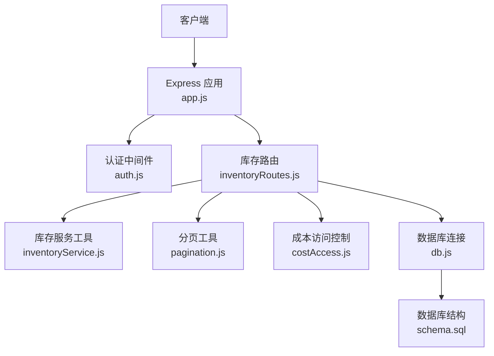
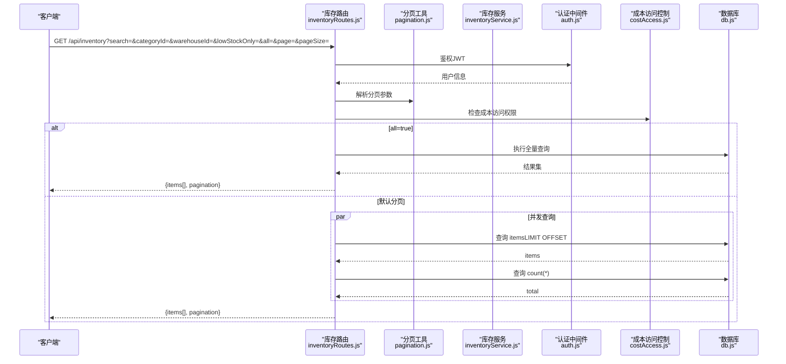
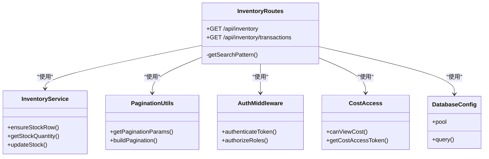

# 库存总览路由

<cite>
**本文档引用的文件**
- [inventoryRoutes.js](file://server/src/routes/inventoryRoutes.js)
- [inventoryService.js](file://server/src/utils/inventoryService.js)
- [pagination.js](file://server/src/utils/pagination.js)
- [auth.js](file://server/src/middleware/auth.js)
- [costAccess.js](file://server/src/utils/costAccess.js)
- [db.js](file://server/src/config/db.js)
- [schema.sql](file://server/database/schema.sql)
- [app.js](file://server/src/app.js)
- [response.js](file://server/src/middleware/response.js)
- [integration.test.js](file://server/test/integration.test.js)
- [POSTMAN_BACKEND_GUIDE.md](file://POSTMAN_BACKEND_GUIDE.md)
</cite>

## 目录
1. [简介](#简介)
2. [项目结构](#项目结构)
3. [核心组件](#核心组件)
4. [架构概览](#架构概览)
5. [详细组件分析](#详细组件分析)
6. [依赖关系分析](#依赖关系分析)
7. [性能考量](#性能考量)
8. [故障排查指南](#故障排查指南)
9. [结论](#结论)
10. [附录](#附录)

## 简介
本文档面向库存总览路由（GET /api/inventory）的实现进行深入解析，涵盖以下关键点：
- 分页、搜索、分类筛选、仓库筛选与低库存筛选的完整流程
- SQL 查询优化策略（全文搜索模式匹配与索引使用）
- 可用库存计算公式：可用库存 = 实际库存 - 已分配库存
- 成本价格访问控制机制与数据安全考虑
- 性能优化建议与大数据量场景的最佳实践

## 项目结构
该路由位于后端服务的路由层，通过 Express 应用统一挂载，并由认证中间件保护。其数据来源为 PostgreSQL 数据库，涉及库存、产品、仓库与分类等核心表。

图表来源
- [app.js:40-55](file://server/src/app.js#L40-L55)
- [inventoryRoutes.js:1-151](file://server/src/routes/inventoryRoutes.js#L1-L151)
- [auth.js:1-46](file://server/src/middleware/auth.js#L1-L46)
- [pagination.js:1-28](file://server/src/utils/pagination.js#L1-L28)
- [inventoryService.js:1-45](file://server/src/utils/inventoryService.js#L1-L45)
- [costAccess.js:1-32](file://server/src/utils/costAccess.js#L1-L32)
- [db.js:1-25](file://server/src/config/db.js#L1-L25)
- [schema.sql:125-133](file://server/database/schema.sql#L125-L133)

章节来源
- [app.js:40-55](file://server/src/app.js#L40-L55)
- [inventoryRoutes.js:10-151](file://server/src/routes/inventoryRoutes.js#L10-L151)

## 核心组件
- 路由控制器：负责解析查询参数、构建 SQL 条件、并发执行查询与分页封装
- 库存服务工具：封装库存行确保、查询与更新逻辑，保证事务一致性
- 分页工具：统一分页参数与分页结构
- 认证与授权：基于 JWT 的用户认证与角色授权
- 成本访问控制：基于自定义头部的成本价格访问令牌验证
- 数据库连接：基于 pg 的连接池与查询封装

章节来源
- [inventoryRoutes.js:17-151](file://server/src/routes/inventoryRoutes.js#L17-L151)
- [inventoryService.js:1-45](file://server/src/utils/inventoryService.js#L1-L45)
- [pagination.js:1-28](file://server/src/utils/pagination.js#L1-L28)
- [auth.js:1-46](file://server/src/middleware/auth.js#L1-L46)
- [costAccess.js:1-32](file://server/src/utils/costAccess.js#L1-L32)
- [db.js:1-25](file://server/src/config/db.js#L1-L25)

## 架构概览
库存总览路由采用“查询参数驱动 + 并发查询 + 安全脱敏”的设计，支持两种加载模式：
- 全量加载（all=true）：一次性返回所有数据，适用于小规模或导出场景
- 分页加载（默认）：并发执行数据查询与总数统计，提升大数据量下的响应速度

图表来源
- [inventoryRoutes.js:17-151](file://server/src/routes/inventoryRoutes.js#L17-L151)
- [pagination.js:2-12](file://server/src/utils/pagination.js#L2-L12)
- [auth.js:5-29](file://server/src/middleware/auth.js#L5-L29)
- [costAccess.js:25-27](file://server/src/utils/costAccess.js#L25-L27)
- [db.js:21-24](file://server/src/config/db.js#L21-L24)

## 详细组件分析

### 路由参数与筛选逻辑
- 查询参数
  - search：支持多字段模糊匹配（产品名称、SKU、条码、分类名、仓库名、仓库编码）
  - categoryId：按分类 ID 过滤
  - warehouseId：按仓库 ID 过滤
  - lowStockOnly：仅显示低于安全库存的可用库存
  - all：是否全量加载（true 时忽略分页）
  - page/pageSize：分页参数（默认最小 1，最大 100）
- SQL 条件构建
  - 多字段 ILIKE 模糊匹配，使用通配符包裹
  - 分类与仓库 ID 使用 IS NULL 或相等条件
  - 低库存筛选通过可用库存（实际库存 - 已分配库存）与产品安全库存比较
- 成本价格脱敏
  - 仅在具备成本访问令牌时才返回成本价格字段

章节来源
- [inventoryRoutes.js:17-151](file://server/src/routes/inventoryRoutes.js#L17-L151)
- [pagination.js:2-12](file://server/src/utils/pagination.js#L2-L12)
- [costAccess.js:25-27](file://server/src/utils/costAccess.js#L25-L27)

### SQL 查询优化策略
- 全文搜索模式匹配
  - 使用 ILIKE 与通配符 %，便于前端输入即查
  - 将搜索词预处理为 %search%，减少重复拼接
- 索引使用
  - stock_levels 表：product_id、warehouse_id（唯一组合索引），用于 JOIN 与过滤
  - products 表：category_id、product_code（唯一）、名称/SKU/条码等常用查询字段
  - warehouses 表：名称与编码
  - stock_movements 表：created_at（倒序）等用于流水查询
- 并发查询
  - 分页场景下同时执行数据查询与总数统计，降低总等待时间
- 可用库存计算
  - 使用 GREATEST(stock_levels.quantity - stock_levels.allocated_quantity, 0)，避免负值

章节来源
- [inventoryRoutes.js:46-139](file://server/src/routes/inventoryRoutes.js#L46-L139)
- [schema.sql:410-447](file://server/database/schema.sql#L410-L447)

### 可用库存计算公式
- 公式：可用库存 = MAX(实际库存 - 已分配库存, 0)
- 作用：确保可用库存不为负数，避免超卖风险
- 在路由中通过 SQL 函数表达式直接计算并返回

章节来源
- [inventoryRoutes.js:35](file://server/src/routes/inventoryRoutes.js#L35)
- [inventoryRoutes.js:85](file://server/src/routes/inventoryRoutes.js#L85)

### 成本价格访问控制机制与数据安全
- 访问令牌生成与验证
  - 通过独立的解锁接口生成具有特定用途的 JWT
  - 后续请求需携带自定义头部 x-cost-access-token
  - 服务端校验令牌用途与签发用户 ID，仅允许 ADMIN/MANAGER 角色
- 数据脱敏
  - 未满足访问条件时，成本价格字段被置空返回
- 安全边界
  - 路由层统一鉴权（JWT）与成本访问令牌双重校验
  - 中间件对错误响应进行标准化包装，避免泄露内部细节

章节来源
- [costAccess.js:5-27](file://server/src/utils/costAccess.js#L5-L27)
- [inventoryRoutes.js:23](file://server/src/routes/inventoryRoutes.js#L23)
- [inventoryRoutes.js:70](file://server/src/routes/inventoryRoutes.js#L70)
- [auth.js:5-29](file://server/src/middleware/auth.js#L5-L29)

### 错误处理与响应格式
- 统一响应中间件
  - 对非 2xx 响应自动包装为失败结构，包含请求 ID
  - 成功响应包含 data 与请求 ID，便于追踪
- 路由级错误捕获
  - 数据库查询异常统一转换为 500 响应
- 审计与健康检查
  - 应用级审计中间件记录请求路径与方法
  - 提供 /api/health 健康检查端点

章节来源
- [response.js:3-57](file://server/src/middleware/response.js#L3-L57)
- [inventoryRoutes.js:148-150](file://server/src/routes/inventoryRoutes.js#L148-L150)
- [app.js:36-38](file://server/src/app.js#L36-L38)

## 依赖关系分析

图表来源
- [inventoryRoutes.js:1-151](file://server/src/routes/inventoryRoutes.js#L1-L151)
- [inventoryService.js:1-45](file://server/src/utils/inventoryService.js#L1-L45)
- [pagination.js:1-28](file://server/src/utils/pagination.js#L1-L28)
- [auth.js:1-46](file://server/src/middleware/auth.js#L1-L46)
- [costAccess.js:1-32](file://server/src/utils/costAccess.js#L1-L32)
- [db.js:1-25](file://server/src/config/db.js#L1-L25)

## 性能考量
- 查询优化
  - 使用 ILIKE 与通配符时注意索引选择性；对高频搜索字段建立合适索引
  - 低库存筛选通过函数表达式计算，建议在高基数场景下评估是否需要物化列或派生表
- 并发与分页
  - 分页场景下并发执行数据查询与总数统计，显著降低首屏延迟
  - 限制每页最大条数（默认 100），防止大页码导致的资源消耗
- 缓存策略
  - 对静态维度（如分类、仓库）可引入短期缓存，减少 JOIN 开销
  - 对热点查询结果可考虑应用层缓存（需配合失效策略）
- 大数据量最佳实践
  - 使用复合索引覆盖常见过滤字段（如 category_id、warehouse_id）
  - 分页时尽量使用基于游标或基于主键的高效分页方案（视业务需求）
  - 控制返回字段数量，避免不必要的大字段传输
  - 对全量导出场景使用 all=true，但需注意内存与网络带宽占用

## 故障排查指南
- 认证失败
  - 确认 Authorization 头部携带有效 JWT
  - 检查用户状态是否激活
- 成本价格为空
  - 确认已通过解锁接口获取成本访问令牌
  - 确认请求头包含 x-cost-access-token
  - 确认当前用户角色为 ADMIN 或 MANAGER
- 查询无结果或结果异常
  - 检查搜索词是否正确（大小写不敏感，但需包含有效字符）
  - 确认 categoryId 与 warehouseId 是否存在且有效
  - 低库存筛选仅在 lowStockOnly=true 时生效
- 性能问题
  - 检查数据库索引是否存在
  - 适当调整 page 与 pageSize
  - 对全量导出使用 all=true，避免分页带来的多次往返

章节来源
- [auth.js:9-29](file://server/src/middleware/auth.js#L9-L29)
- [costAccess.js:5-27](file://server/src/utils/costAccess.js#L5-L27)
- [inventoryRoutes.js:17-151](file://server/src/routes/inventoryRoutes.js#L17-L151)
- [schema.sql:410-447](file://server/database/schema.sql#L410-L447)

## 结论
库存总览路由通过“参数驱动 + 并发查询 + 成本脱敏”的设计，在保证安全性的同时提供了良好的性能与可扩展性。结合合理的索引策略与分页控制，可在大数据量场景下保持稳定响应。建议在生产环境中持续监控查询计划与慢查询日志，进一步优化热点路径。

## 附录
- 接口定义
  - 方法：GET
  - 路径：/api/inventory
  - 查询参数：
    - search：字符串，支持多字段模糊匹配
    - categoryId：整数，分类 ID
    - warehouseId：整数，仓库 ID
    - lowStockOnly：布尔，是否仅显示低库存
    - all：布尔，是否全量加载
    - page：整数，默认 1，最小 1
    - pageSize：整数，默认 10，最小 1，最大 100
  - 响应字段：
    - items[]：包含库存详情、产品信息、仓库信息、可用库存等
    - pagination：包含 total、page、pageSize、totalPages
- 示例请求
  - GET /api/inventory?page=1&pageSize=20&search=ABC&categoryId=1&warehouseId=1&lowStockOnly=true
- 成本访问令牌
  - 通过独立接口获取，随后在请求头中携带 x-cost-access-token

章节来源
- [inventoryRoutes.js:17-151](file://server/src/routes/inventoryRoutes.js#L17-L151)
- [POSTMAN_BACKEND_GUIDE.md:1-68](file://POSTMAN_BACKEND_GUIDE.md#L1-L68)