# 库存管理路由

<cite>
**本文档引用的文件**
- [inventoryRoutes.js](file://server/src/routes/inventoryRoutes.js)
- [inventoryService.js](file://server/src/utils/inventoryService.js)
- [alertsRoutes.js](file://server/src/routes/alertsRoutes.js)
- [stockCountRoutes.js](file://server/src/routes/stockCountRoutes.js)
- [reportRoutes.js](file://server/src/routes/reportRoutes.js)
- [auth.js](file://server/src/middleware/auth.js)
- [response.js](file://server/src/middleware/response.js)
- [pagination.js](file://server/src/utils/pagination.js)
- [costAccess.js](file://server/src/utils/costAccess.js)
- [schema.sql](file://server/database/schema.sql)
- [POSTMAN_BACKEND_GUIDE.md](file://POSTMAN_BACKEND_GUIDE.md)
</cite>

## 目录
1. [简介](#简介)
2. [项目结构](#项目结构)
3. [核心组件](#核心组件)
4. [架构概览](#架构概览)
5. [详细组件分析](#详细组件分析)
6. [依赖关系分析](#依赖关系分析)
7. [性能考虑](#性能考虑)
8. [故障排除指南](#故障排除指南)
9. [结论](#结论)

## 简介

库存管理系统是企业资源规划系统中的核心模块，负责管理商品在各个仓库中的实时库存状态。本系统提供了完整的库存生命周期管理功能，包括入库、出库、调拨、盘点等核心业务操作，以及库存预警、报表统计等功能。

该系统采用现代化的Web架构，基于Node.js和Express框架构建，使用PostgreSQL作为数据库存储，通过RESTful API提供服务。系统设计注重数据一致性、并发控制和性能优化，确保在高并发场景下的稳定运行。

## 项目结构

库存管理路由模块位于服务器端的路由层，采用模块化设计，每个功能模块都有独立的路由文件和工具函数。

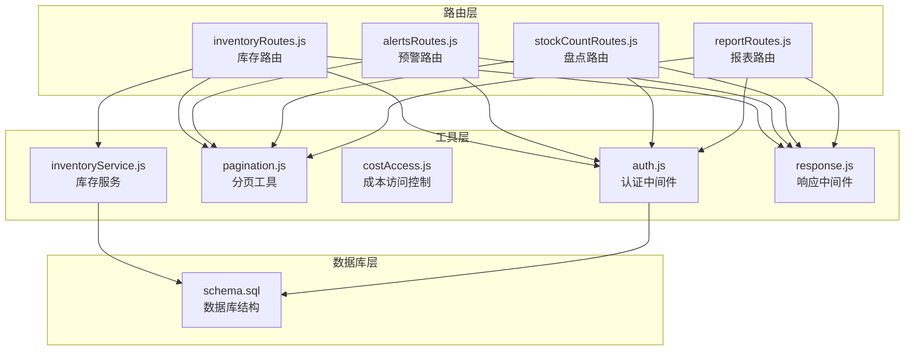

**图表来源**
- [inventoryRoutes.js:1-493](file://server/src/routes/inventoryRoutes.js#L1-L493)
- [alertsRoutes.js:1-290](file://server/src/routes/alertsRoutes.js#L1-L290)
- [stockCountRoutes.js:1-434](file://server/src/routes/stockCountRoutes.js#L1-L434)
- [reportRoutes.js:1-252](file://server/src/routes/reportRoutes.js#L1-L252)

**章节来源**
- [inventoryRoutes.js:1-493](file://server/src/routes/inventoryRoutes.js#L1-L493)
- [schema.sql:1-447](file://server/database/schema.sql#L1-L447)

## 核心组件

### 库存路由模块 (inventoryRoutes.js)

库存路由模块是整个库存管理系统的中枢，提供了所有库存操作的HTTP接口。该模块实现了统一的认证中间件，确保只有授权用户才能访问库存功能。

主要特性：
- 完整的库存操作接口（入库、出库、调拨）
- 实时库存查询和统计
- 交易流水记录
- 分配/释放库存功能
- 成本价格保护机制

### 库存服务工具 (inventoryService.js)

库存服务封装了所有库存操作的底层逻辑，提供了原子性的库存变更能力。

核心功能：
- 确保存货行存在性
- 获取当前库存数量
- 更新库存状态
- 事务性库存操作

### 预警路由模块 (alertsRoutes.js)

预警路由模块专门处理库存预警相关的业务逻辑，包括低库存提醒的创建、更新和批量处理。

关键特性：
- 自动检测低于安全库存的商品
- 支持多状态的预警管理
- 负责人分配和状态跟踪
- 详细的预警统计信息

### 盘点路由模块 (stockCountRoutes.js)

盘点路由模块实现了完整的库存盘点流程，从创建盘点单到应用盘点结果的全过程管理。

主要流程：
- 创建盘点单并初始化所有商品
- 盘点过程中的数量录入
- 完成盘点并计算差异
- 应用盘点结果并生成调整流水

### 报表路由模块 (reportRoutes.js)

报表路由模块提供各种库存相关的报表查询功能，支持复杂的筛选条件和分页机制。

功能包括：
- 当前库存报表
- 库存流水报表
- 时间范围查询
- 关键词搜索过滤

**章节来源**
- [inventoryRoutes.js:1-493](file://server/src/routes/inventoryRoutes.js#L1-L493)
- [inventoryService.js:1-45](file://server/src/utils/inventoryService.js#L1-L45)
- [alertsRoutes.js:1-290](file://server/src/routes/alertsRoutes.js#L1-L290)
- [stockCountRoutes.js:1-434](file://server/src/routes/stockCountRoutes.js#L1-L434)
- [reportRoutes.js:1-252](file://server/src/routes/reportRoutes.js#L1-L252)

## 架构概览

系统采用分层架构设计，确保关注点分离和代码的可维护性。

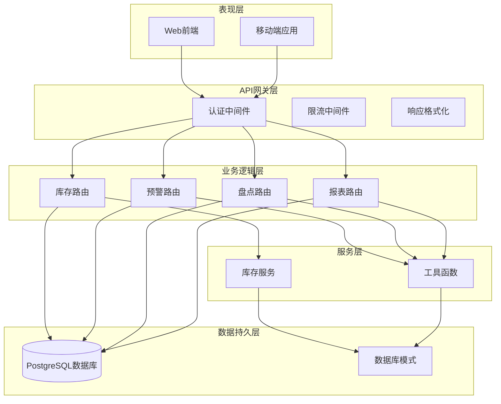

**图表来源**
- [auth.js:1-46](file://server/src/middleware/auth.js#L1-L46)
- [response.js:1-62](file://server/src/middleware/response.js#L1-L62)
- [inventoryRoutes.js:1-493](file://server/src/routes/inventoryRoutes.js#L1-L493)
- [alertsRoutes.js:1-290](file://server/src/routes/alertsRoutes.js#L1-L290)
- [stockCountRoutes.js:1-434](file://server/src/routes/stockCountRoutes.js#L1-L434)
- [reportRoutes.js:1-252](file://server/src/routes/reportRoutes.js#L1-L252)

## 详细组件分析

### 库存操作接口详解

#### 入库操作 (Stock In)

入库操作是库存管理系统中最频繁的操作之一，需要确保数据的准确性和一致性。

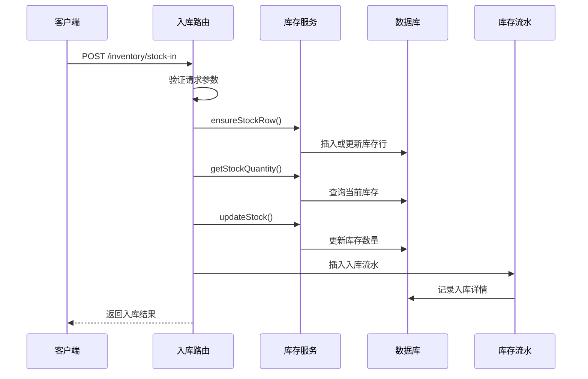

**图表来源**
- [inventoryRoutes.js:229-403](file://server/src/routes/inventoryRoutes.js#L229-L403)
- [inventoryService.js:1-45](file://server/src/utils/inventoryService.js#L1-L45)

入库操作的关键业务逻辑：
1. **参数验证**：确保产品ID、仓库ID和数量的有效性
2. **库存行检查**：确保库存记录存在，不存在则自动创建
3. **库存更新**：原子性地增加库存数量
4. **流水记录**：记录详细的入库信息
5. **事务保证**：使用数据库事务确保操作的原子性

#### 出库操作 (Stock Out)

出库操作需要严格的库存检查，防止超卖情况的发生。

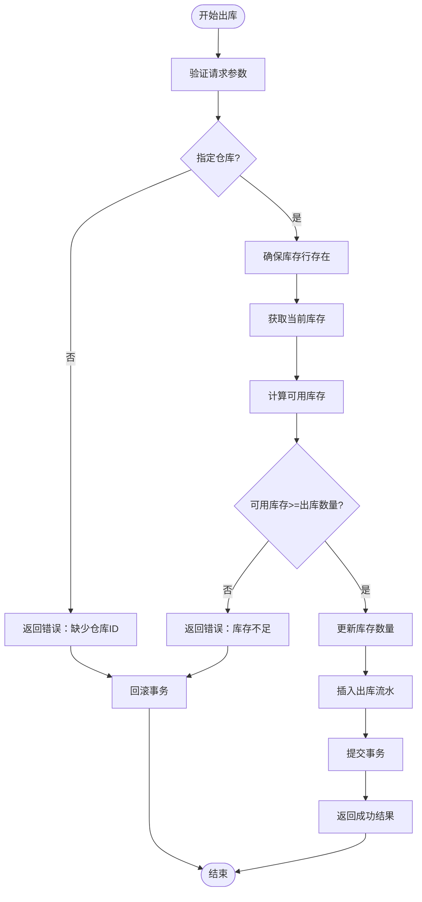

**图表来源**
- [inventoryRoutes.js:229-403](file://server/src/routes/inventoryRoutes.js#L229-L403)

出库操作的安全机制：
1. **可用库存计算**：`可用库存 = 总库存 - 已分配库存`
2. **实时检查**：每次出库都进行库存实时验证
3. **负数保护**：防止库存变为负数
4. **事务回滚**：任何失败都会回滚所有更改

#### 调拨操作 (Transfer)

调拨操作涉及两个仓库之间的库存转移，需要同时更新源仓库和目标仓库的库存。

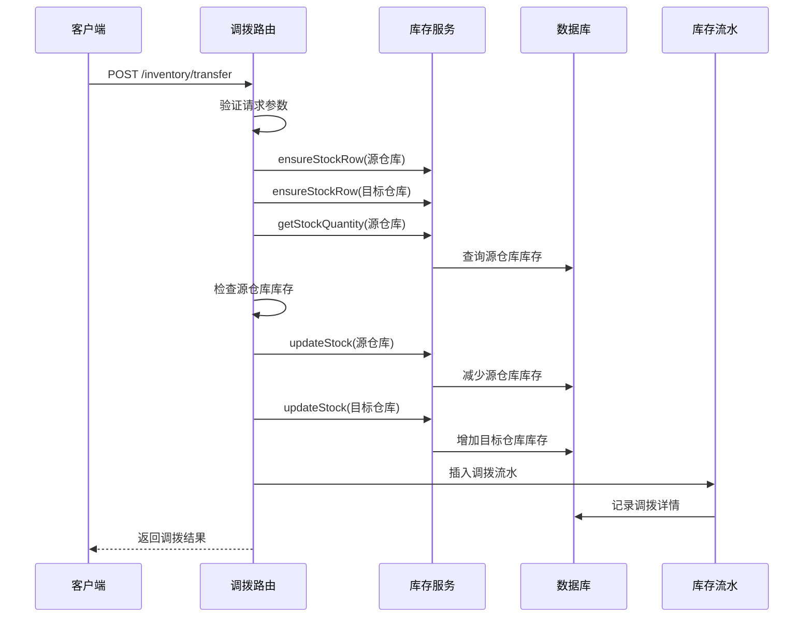

**图表来源**
- [inventoryRoutes.js:229-403](file://server/src/routes/inventoryRoutes.js#L229-L403)
- [inventoryService.js:1-45](file://server/src/utils/inventoryService.js#L1-L45)

调拨操作的特殊要求：
1. **仓库验证**：源仓库和目标仓库必须不同
2. **双仓库库存**：同时确保两个仓库的库存行存在
3. **原子性**：源仓库扣减和目标仓库增加必须同时成功
4. **流水记录**：记录详细的调拨信息

#### 库存分配与释放 (Allocate)

分配功能允许将库存预留给特定订单，防止重复销售。

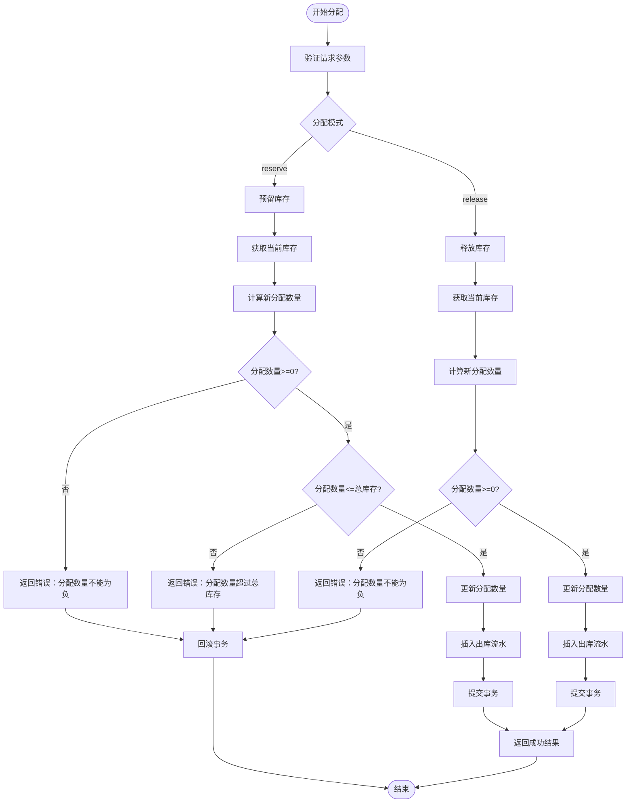

**图表来源**
- [inventoryRoutes.js:417-490](file://server/src/routes/inventoryRoutes.js#L417-L490)

分配功能的业务规则：
1. **预留模式**：增加已分配数量，减少可用库存
2. **释放模式**：减少已分配数量，增加可用库存
3. **边界检查**：确保分配数量不为负且不超过总库存
4. **实时反映**：分配状态实时影响可用库存计算

### 库存查询与统计

#### 库存总览查询

库存总览接口支持复杂的查询条件和高性能的分页机制。

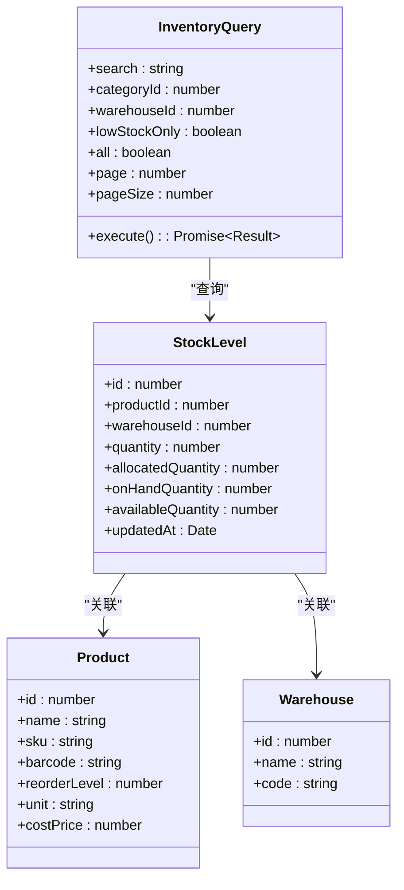

**图表来源**
- [inventoryRoutes.js:17-151](file://server/src/routes/inventoryRoutes.js#L17-L151)

查询接口的性能优化：
1. **索引优化**：数据库层面建立了多个复合索引
2. **延迟加载**：支持全量加载和分页加载两种模式
3. **成本价格保护**：敏感数据的访问控制
4. **高级筛选**：支持多维度的复杂查询条件

#### 交易流水查询

交易流水接口提供完整的库存变动历史记录。

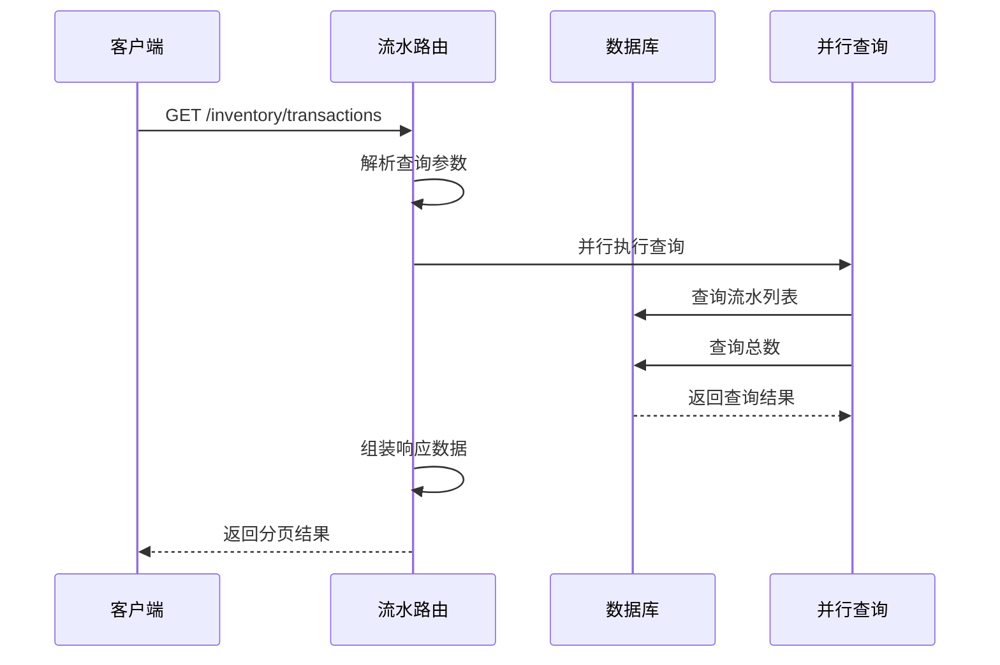

**图表来源**
- [inventoryRoutes.js:154-227](file://server/src/routes/inventoryRoutes.js#L154-L227)

流水记录的完整性：
1. **类型区分**：入库、出库、调拨三种类型
2. **详细信息**：包含产品、仓库、操作员等完整信息
3. **时间排序**：按创建时间倒序排列
4. **搜索支持**：支持多种关键词的模糊搜索

### 库存预警系统

#### 低库存预警

低库存预警系统能够自动检测低于安全库存的商品，并提供相应的管理功能。

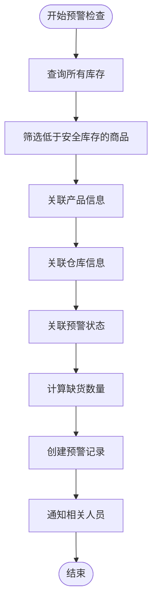

**图表来源**
- [alertsRoutes.js:80-197](file://server/src/routes/alertsRoutes.js#L80-L197)

预警系统的智能化特性：
1. **自动检测**：基于`quantity <= reorder_level`的条件自动触发
2. **状态管理**：支持OPEN、READ、IGNORED三种状态
3. **负责人分配**：支持管理员指派具体负责人
4. **批量处理**：支持批量更新预警状态
5. **统计分析**：提供详细的预警统计信息

#### 预警状态管理

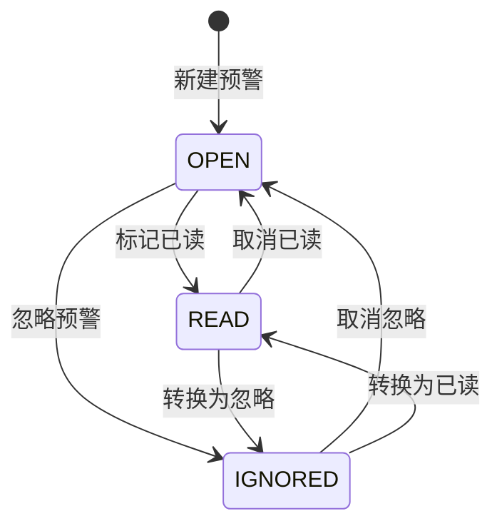

**图表来源**
- [alertsRoutes.js:199-232](file://server/src/routes/alertsRoutes.js#L199-L232)

### 盘点管理系统

#### 盘点流程

盘点系统实现了完整的库存盘点生命周期管理。

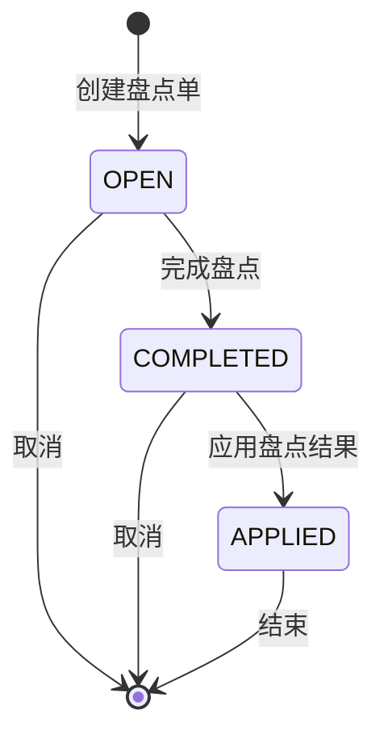

**图表来源**
- [stockCountRoutes.js:273-431](file://server/src/routes/stockCountRoutes.js#L273-L431)

盘点流程的严格控制：
1. **状态验证**：每个操作都验证当前状态
2. **并发控制**：使用FOR UPDATE防止并发修改
3. **差异计算**：自动计算期望数量与实际数量的差异
4. **自动调整**：根据差异自动生成入库或出库流水

#### 盘点应用机制

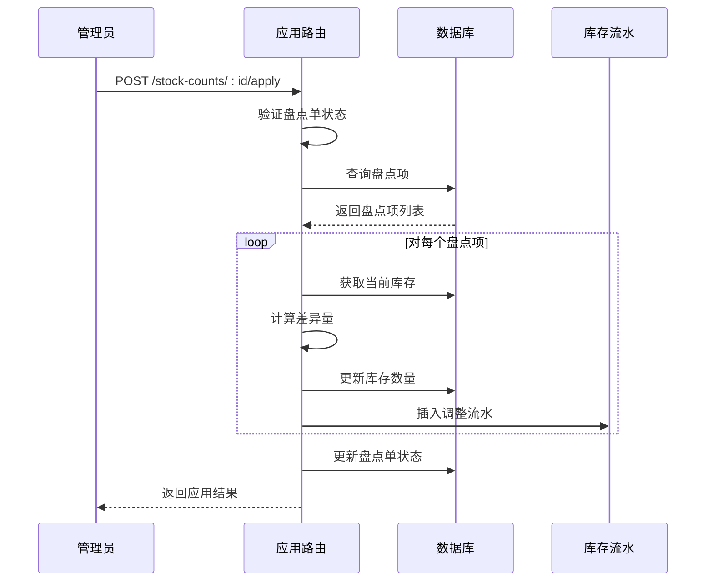

**图表来源**
- [stockCountRoutes.js:326-431](file://server/src/routes/stockCountRoutes.js#L326-L431)

### 报表统计功能

#### 库存报表

库存报表提供了全面的库存统计信息，支持导出功能。

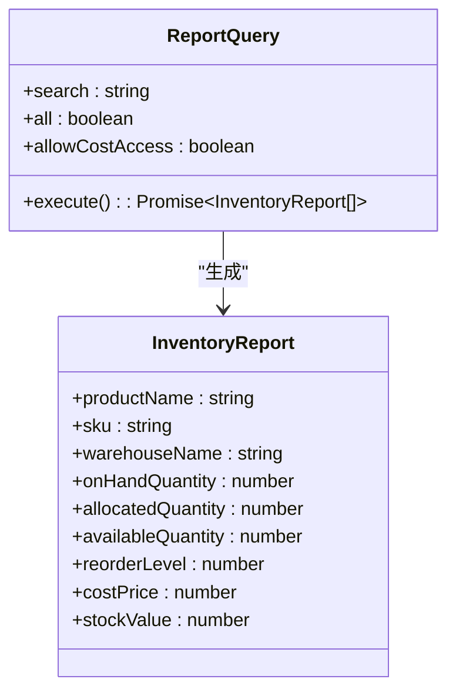

**图表来源**
- [reportRoutes.js:16-127](file://server/src/routes/reportRoutes.js#L16-L127)

报表功能的特点：
1. **成本价格保护**：通过专门的访问令牌控制成本价格的可见性
2. **灵活查询**：支持关键词搜索和分页
3. **全量导出**：支持一次性导出所有数据
4. **价值计算**：自动计算库存总价值

#### 流水报表

流水报表提供了详细的库存变动历史，支持时间范围查询。

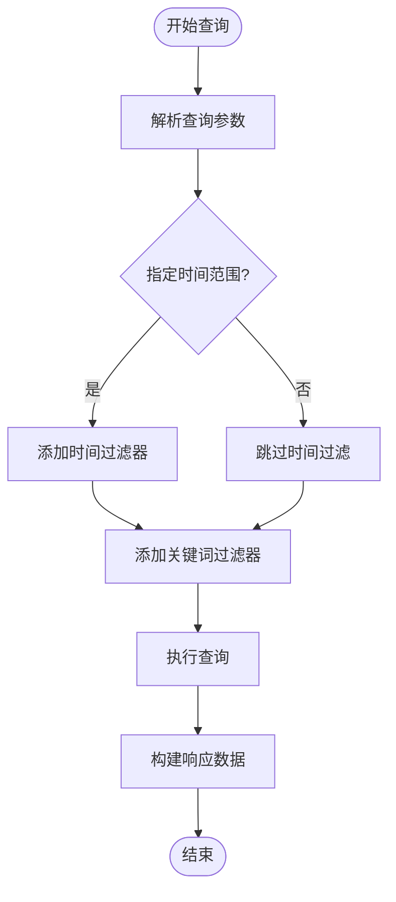

**图表来源**
- [reportRoutes.js:130-249](file://server/src/routes/reportRoutes.js#L130-L249)

**章节来源**
- [inventoryRoutes.js:1-493](file://server/src/routes/inventoryRoutes.js#L1-L493)
- [inventoryService.js:1-45](file://server/src/utils/inventoryService.js#L1-L45)
- [alertsRoutes.js:1-290](file://server/src/routes/alertsRoutes.js#L1-L290)
- [stockCountRoutes.js:1-434](file://server/src/routes/stockCountRoutes.js#L1-L434)
- [reportRoutes.js:1-252](file://server/src/routes/reportRoutes.js#L1-L252)

## 依赖关系分析

系统各组件之间的依赖关系清晰明确，遵循单一职责原则。

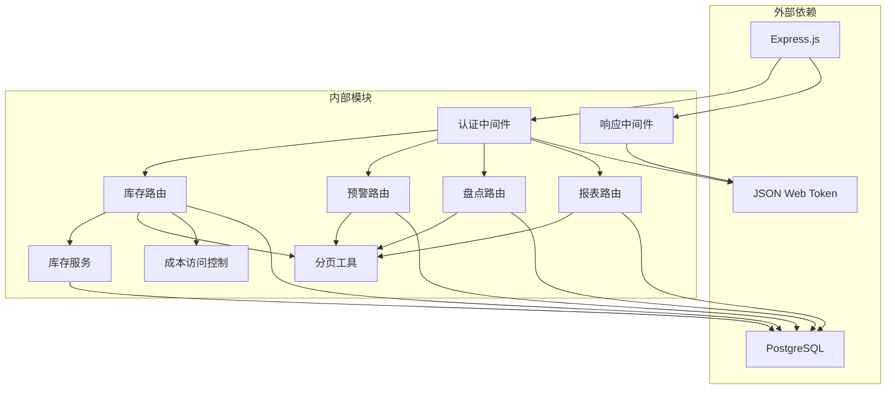

**图表来源**
- [auth.js:1-46](file://server/src/middleware/auth.js#L1-L46)
- [response.js:1-62](file://server/src/middleware/response.js#L1-L62)
- [inventoryRoutes.js:1-493](file://server/src/routes/inventoryRoutes.js#L1-L493)
- [alertsRoutes.js:1-290](file://server/src/routes/alertsRoutes.js#L1-L290)
- [stockCountRoutes.js:1-434](file://server/src/routes/stockCountRoutes.js#L1-L434)
- [reportRoutes.js:1-252](file://server/src/routes/reportRoutes.js#L1-L252)

**章节来源**
- [auth.js:1-46](file://server/src/middleware/auth.js#L1-L46)
- [response.js:1-62](file://server/src/middleware/response.js#L1-L62)
- [pagination.js:1-28](file://server/src/utils/pagination.js#L1-L28)
- [costAccess.js:1-32](file://server/src/utils/costAccess.js#L1-L32)

## 性能考虑

### 数据库优化

系统在数据库层面进行了多项优化以确保高性能：

1. **索引策略**：
   - `stock_levels`表的复合索引优化库存查询
   - `stock_movements`表的时间索引支持流水查询
   - 多个业务相关表的二级索引提升查询效率

2. **查询优化**：
   - 使用`EXISTS`子查询避免不必要的连接
   - 采用`LIMIT/OFFSET`实现高效的分页
   - 并行查询优化提升响应速度

3. **事务优化**：
   - 将多个查询合并为单个事务减少往返次数
   - 使用`FOR UPDATE`实现行级锁定避免并发问题

### 缓存策略

虽然当前实现主要依赖数据库查询，但系统设计支持缓存扩展：

1. **热点数据缓存**：常用查询结果可以缓存
2. **配置数据缓存**：系统配置和用户权限信息
3. **会话数据缓存**：用户认证信息和权限缓存

### 并发控制

系统采用了多层次的并发控制机制：

1. **数据库层面**：
   - 事务隔离级别确保数据一致性
   - 行级锁防止并发修改冲突
   - 原子性操作保证操作完整性

2. **应用层面**：
   - 请求队列管理避免过载
   - 错误重试机制提升可靠性
   - 超时控制防止长时间阻塞

**章节来源**
- [schema.sql:410-447](file://server/database/schema.sql#L410-L447)
- [inventoryRoutes.js:76-139](file://server/src/routes/inventoryRoutes.js#L76-L139)
- [stockCountRoutes.js:279-323](file://server/src/routes/stockCountRoutes.js#L279-L323)

## 故障排除指南

### 常见错误及解决方案

#### 认证相关错误

| 错误代码 | 错误信息 | 可能原因 | 解决方案 |
|---------|---------|---------|---------|
| 401 | Authentication token is required | 缺少认证头 | 确保请求包含有效的Authorization头 |
| 401 | Invalid or expired token | 令牌过期或无效 | 重新登录获取新令牌 |
| 403 | You do not have permission to do this action | 权限不足 | 检查用户角色是否具有相应权限 |

#### 库存操作错误

| 错误代码 | 错误信息 | 可能原因 | 解决方案 |
|---------|---------|---------|---------|
| 400 | Not enough stock for stock out | 库存不足 | 检查可用库存数量 |
| 400 | Source and destination warehouses must be different | 仓库相同 | 确保源仓库和目标仓库不同 |
| 400 | Allocated quantity cannot be negative | 分配数量为负 | 检查释放数量是否超过已分配数量 |

#### 数据库相关错误

| 错误代码 | 错误信息 | 可能原因 | 解决方案 |
|---------|---------|---------|---------|
| 500 | Failed to fetch inventory | 数据库查询失败 | 检查数据库连接和查询语句 |
| 500 | Failed to create stock count | 盘点创建失败 | 检查仓库是否有活动商品 |
| 500 | Failed to apply stock count | 盘点应用失败 | 检查盘点状态和并发控制 |

### 调试技巧

1. **启用详细日志**：在开发环境中启用详细的请求和响应日志
2. **使用Postman测试**：通过Postman集合文件测试所有API端点
3. **监控数据库性能**：使用数据库监控工具观察查询性能
4. **检查事务状态**：确保所有事务正确提交或回滚

### 性能监控

建议实施以下监控指标：

1. **响应时间**：监控各API端点的平均响应时间
2. **错误率**：跟踪各端点的错误发生频率
3. **数据库负载**：监控数据库连接数和查询执行时间
4. **并发用户数**：跟踪同时在线用户的数量

**章节来源**
- [auth.js:5-29](file://server/src/middleware/auth.js#L5-L29)
- [response.js:14-54](file://server/src/middleware/response.js#L14-L54)
- [inventoryRoutes.js:234-402](file://server/src/routes/inventoryRoutes.js#L234-L402)
- [stockCountRoutes.js:110-163](file://server/src/routes/stockCountRoutes.js#L110-L163)

## 结论

库存管理路由模块是一个设计精良、功能完整的库存管理系统。该系统通过以下特点确保了高质量的服务：

### 核心优势

1. **完整的业务覆盖**：涵盖了库存管理的所有核心业务场景
2. **强一致性的保证**：通过事务和并发控制确保数据准确性
3. **灵活的权限管理**：基于角色的细粒度权限控制
4. **高性能的设计**：优化的数据库查询和分页机制
5. **完善的监控体系**：全面的日志记录和错误处理

### 技术亮点

1. **模块化设计**：清晰的职责分离和依赖关系
2. **安全性考虑**：多重认证和授权机制
3. **可扩展性**：良好的架构设计支持未来功能扩展
4. **用户体验**：友好的API设计和详细的错误信息

### 改进建议

1. **缓存优化**：引入适当的缓存机制提升性能
2. **异步处理**：对于耗时操作考虑异步处理
3. **监控增强**：增加更详细的性能监控指标
4. **文档完善**：补充更多的API文档和示例

该系统为企业的库存管理提供了坚实的技术基础，能够满足大多数企业的库存管理需求，并为未来的业务发展提供了良好的扩展空间。