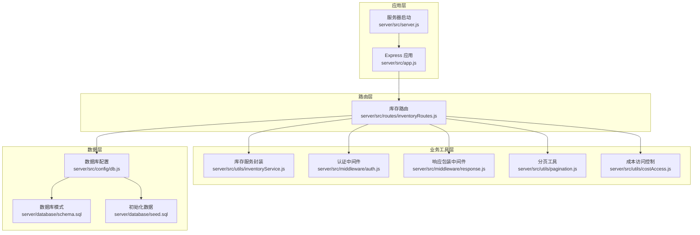
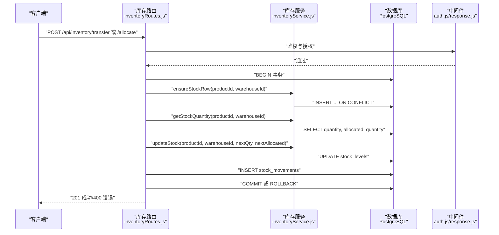
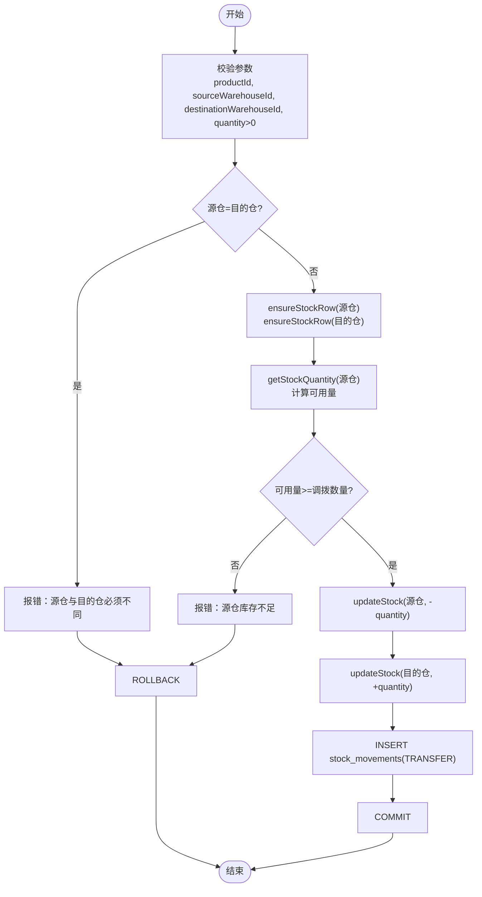
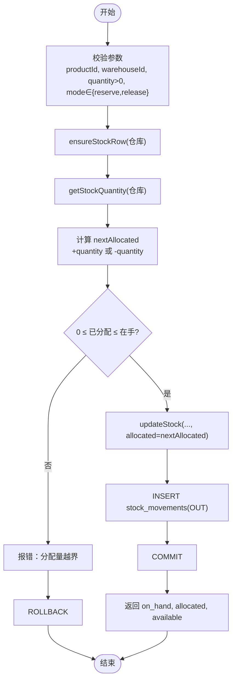
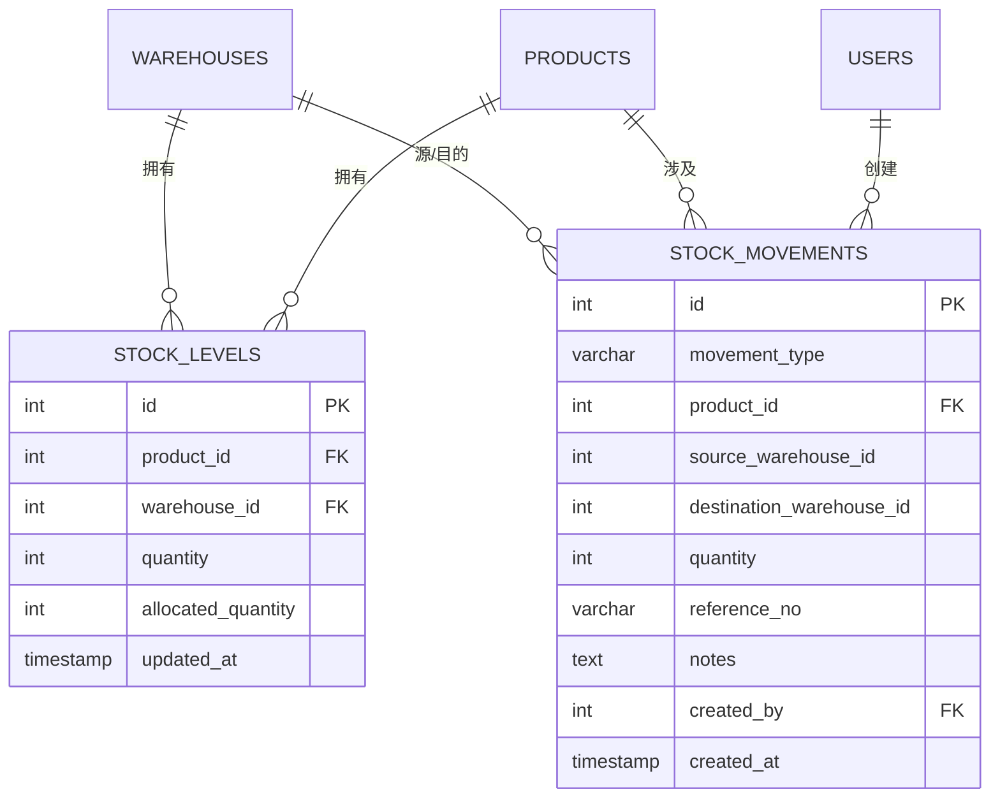
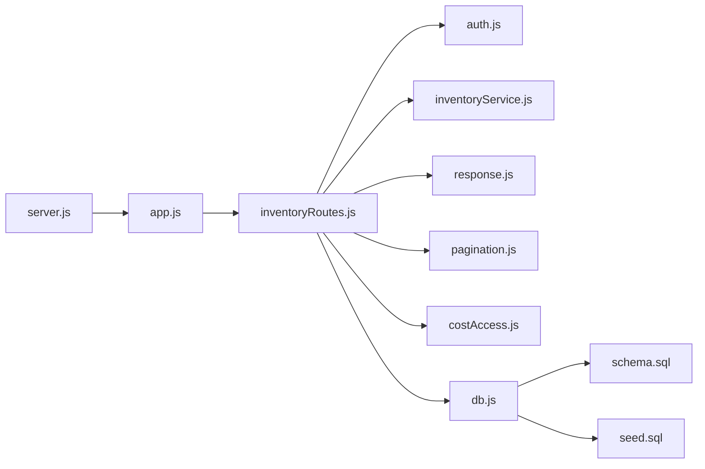

# 调拨与分配路由

<cite>
**本文引用的文件**
- [server/src/routes/inventoryRoutes.js](file://server/src/routes/inventoryRoutes.js)
- [server/src/utils/inventoryService.js](file://server/src/utils/inventoryService.js)
- [server/src/middleware/auth.js](file://server/src/middleware/auth.js)
- [server/src/config/db.js](file://server/src/config/db.js)
- [server/database/schema.sql](file://server/database/schema.sql)
- [server/database/seed.sql](file://server/database/seed.sql)
- [server/src/app.js](file://server/src/app.js)
- [server/src/server.js](file://server/src/server.js)
- [server/src/middleware/response.js](file://server/src/middleware/response.js)
- [server/src/utils/costAccess.js](file://server/src/utils/costAccess.js)
- [server/src/utils/pagination.js](file://server/src/utils/pagination.js)
</cite>

## 目录
1. [简介](#简介)
2. [项目结构](#项目结构)
3. [核心组件](#核心组件)
4. [架构概览](#架构概览)
5. [详细组件分析](#详细组件分析)
6. [依赖关系分析](#依赖关系分析)
7. [性能考虑](#性能考虑)
8. [故障排查指南](#故障排查指南)
9. [结论](#结论)

## 简介
本文件针对库存系统的“调拨”与“分配”两类核心业务流程进行深入技术文档化，重点覆盖以下内容：
- POST /api/inventory/transfer 跨仓库调拨的实现细节与并发一致性保障
- POST /api/inventory/allocate 订单预留与库存释放的机制与业务规则
- 权限控制差异（调拨需要更高权限）
- 并发场景下的数据一致性与性能优化策略
- 数据模型与关键约束对业务流程的支持

## 项目结构
后端采用 Express + PostgreSQL 的典型 Node.js 架构，路由集中在 server/src/routes 下，业务逻辑封装在 server/src/utils 中，数据库连接池与查询封装在 server/src/config/db.js，数据库结构定义在 server/database/schema.sql，初始化数据在 server/database/seed.sql。

图表来源
- [server/src/app.js:1-67](file://server/src/app.js#L1-L67)
- [server/src/server.js:1-28](file://server/src/server.js#L1-L28)
- [server/src/routes/inventoryRoutes.js:1-493](file://server/src/routes/inventoryRoutes.js#L1-L493)
- [server/src/utils/inventoryService.js:1-45](file://server/src/utils/inventoryService.js#L1-L45)
- [server/src/middleware/auth.js:1-46](file://server/src/middleware/auth.js#L1-L46)
- [server/src/middleware/response.js:1-62](file://server/src/middleware/response.js#L1-L62)
- [server/src/utils/pagination.js:1-28](file://server/src/utils/pagination.js#L1-L28)
- [server/src/utils/costAccess.js:1-32](file://server/src/utils/costAccess.js#L1-L32)
- [server/src/config/db.js:1-25](file://server/src/config/db.js#L1-L25)
- [server/database/schema.sql:1-447](file://server/database/schema.sql#L1-L447)
- [server/database/seed.sql:1-114](file://server/database/seed.sql#L1-L114)

章节来源
- [server/src/app.js:1-67](file://server/src/app.js#L1-L67)
- [server/src/server.js:1-28](file://server/src/server.js#L1-L28)
- [server/src/routes/inventoryRoutes.js:1-493](file://server/src/routes/inventoryRoutes.js#L1-L493)

## 核心组件
- 路由层：集中处理库存相关 API，包含调拨与分配两个核心接口，以及通用的库存移动创建函数。
- 工具层：封装库存行确保、查询与更新，统一事务边界，避免重复代码。
- 中间件层：认证与授权、响应包装、审计日志等。
- 数据层：PostgreSQL 连接池、表结构与索引、初始数据。

章节来源
- [server/src/routes/inventoryRoutes.js:1-493](file://server/src/routes/inventoryRoutes.js#L1-L493)
- [server/src/utils/inventoryService.js:1-45](file://server/src/utils/inventoryService.js#L1-L45)
- [server/src/middleware/auth.js:1-46](file://server/src/middleware/auth.js#L1-L46)
- [server/src/middleware/response.js:1-62](file://server/src/middleware/response.js#L1-L62)
- [server/src/config/db.js:1-25](file://server/src/config/db.js#L1-L25)
- [server/database/schema.sql:1-447](file://server/database/schema.sql#L1-L447)
- [server/database/seed.sql:1-114](file://server/database/seed.sql#L1-L114)

## 架构概览
调拨与分配均通过统一的库存移动创建函数实现，该函数负责：
- 参数校验与业务规则检查
- 开启数据库事务，确保原子性
- 调用库存工具层完成库存行存在性保证与数量更新
- 写入库存流水记录
- 提交或回滚事务

图表来源
- [server/src/routes/inventoryRoutes.js:229-403](file://server/src/routes/inventoryRoutes.js#L229-L403)
- [server/src/utils/inventoryService.js:1-45](file://server/src/utils/inventoryService.js#L1-L45)
- [server/src/middleware/auth.js:1-46](file://server/src/middleware/auth.js#L1-L46)
- [server/src/middleware/response.js:1-62](file://server/src/middleware/response.js#L1-L62)

## 详细组件分析

### 调拨接口：POST /api/inventory/transfer
- 接口路径与权限
  - 路径：/api/inventory/transfer
  - 权限：仅 ADMIN、MANAGER 可调用
- 请求体字段
  - productId：目标产品 ID
  - sourceWarehouseId：源仓库 ID
  - destinationWarehouseId：目的仓库 ID
  - quantity：调拨数量
  - referenceNo、notes：可选单据号与备注
- 处理流程
  - 校验必填参数与数量正数
  - 校验源仓库与目的仓库不同
  - 确保源仓与目的仓库存行存在
  - 检查源仓可用库存（已分配量扣除后）是否满足调拨数量
  - 同步更新源仓扣减与目的仓增加
  - 写入 TRANSFER 类型的库存流水
  - 事务提交或回滚
- 关键约束与数据一致性
  - 使用事务包裹库存更新与流水写入，保证原子性
  - 通过库存行唯一约束避免并发下重复插入
  - 通过库存可用量计算避免超卖

图表来源
- [server/src/routes/inventoryRoutes.js:334-396](file://server/src/routes/inventoryRoutes.js#L334-L396)
- [server/src/utils/inventoryService.js:12-38](file://server/src/utils/inventoryService.js#L12-L38)

章节来源
- [server/src/routes/inventoryRoutes.js:413-415](file://server/src/routes/inventoryRoutes.js#L413-L415)
- [server/src/routes/inventoryRoutes.js:334-396](file://server/src/routes/inventoryRoutes.js#L334-L396)
- [server/src/utils/inventoryService.js:12-38](file://server/src/utils/inventoryService.js#L12-L38)

### 分配接口：POST /api/inventory/allocate
- 接口路径与权限
  - 路径：/api/inventory/allocate
  - 权限：ADMIN、MANAGER、STAFF 可调用
- 请求体字段
  - productId、warehouseId、quantity：产品、仓库与数量
  - mode：reserve（预留）或 release（释放）
  - referenceNo、notes：可选单据号与备注
- 处理流程
  - 校验必填参数与数量正数，mode 为 reserve 或 release
  - 确保存在库存行
  - 计算下一个已分配量（+/- quantity），并校验非负与不超过在手量
  - 更新库存行的已分配量
  - 写入 OUT 类型的库存流水（注意：分配操作在库存流水中的类型为 OUT）
  - 返回包含当前在手量、已分配量与可用量的响应
- 业务规则
  - 已分配量不可为负
  - 已分配量不可超过在手量
  - 预留与释放均视为出库动作（库存减少），但不改变在手总量，仅调整已分配量

图表来源
- [server/src/routes/inventoryRoutes.js:417-490](file://server/src/routes/inventoryRoutes.js#L417-L490)
- [server/src/utils/inventoryService.js:12-38](file://server/src/utils/inventoryService.js#L12-L38)

章节来源
- [server/src/routes/inventoryRoutes.js:417-490](file://server/src/routes/inventoryRoutes.js#L417-L490)
- [server/src/utils/inventoryService.js:12-38](file://server/src/utils/inventoryService.js#L12-L38)

### 权限控制与业务规则
- 权限差异
  - 调拨：仅 ADMIN、MANAGER 可执行
  - 分配：ADMIN、MANAGER、STAFF 可执行
- 业务规则
  - 调拨：源仓与目的仓必须不同；源仓可用量需足够
  - 分配：已分配量非负且不超过在手量
- 安全与审计
  - 所有接口均通过认证中间件校验 JWT，并在响应中注入 x-request-id
  - 审计日志中间件记录用户行为

章节来源
- [server/src/middleware/auth.js:1-46](file://server/src/middleware/auth.js#L1-L46)
- [server/src/middleware/response.js:1-62](file://server/src/middleware/response.js#L1-L62)
- [server/src/routes/inventoryRoutes.js:405-415](file://server/src/routes/inventoryRoutes.js#L405-L415)
- [server/src/routes/inventoryRoutes.js:417-490](file://server/src/routes/inventoryRoutes.js#L417-L490)

### 数据模型与约束
- stock_levels 表
  - 唯一约束：(product_id, warehouse_id)
  - 数量与已分配量均为非负整数
- stock_movements 表
  - movement_type 限定为 'IN' | 'OUT' | 'TRANSFER'
  - quantity 必须大于 0
  - 关联产品、仓库与用户
- 初始化数据
  - 包含管理员、经理、员工等角色用户
  - 包含主仓与分仓
  - 为示例产品初始化库存行

图表来源
- [server/database/schema.sql:125-133](file://server/database/schema.sql#L125-L133)
- [server/database/schema.sql:237-248](file://server/database/schema.sql#L237-L248)

章节来源
- [server/database/schema.sql:125-133](file://server/database/schema.sql#L125-L133)
- [server/database/schema.sql:237-248](file://server/database/schema.sql#L237-L248)
- [server/database/seed.sql:1-114](file://server/database/seed.sql#L1-114)

## 依赖关系分析
- 路由依赖
  - inventoryRoutes 依赖 auth 中间件进行鉴权与授权
  - 依赖 inventoryService 封装库存行、查询与更新
  - 依赖 response 中间件统一响应格式
  - 依赖 pagination 工具处理分页
  - 依赖 costAccess 控制成本字段可见性
- 数据库依赖
  - db.js 提供连接池与 query 封装
  - schema.sql 定义表结构与约束
  - seed.sql 提供测试数据
- 应用启动
  - app.js 注册所有路由与中间件
  - server.js 启动服务并校验数据库连通性

图表来源
- [server/src/routes/inventoryRoutes.js:1-493](file://server/src/routes/inventoryRoutes.js#L1-L493)
- [server/src/middleware/auth.js:1-46](file://server/src/middleware/auth.js#L1-L46)
- [server/src/utils/inventoryService.js:1-45](file://server/src/utils/inventoryService.js#L1-L45)
- [server/src/middleware/response.js:1-62](file://server/src/middleware/response.js#L1-L62)
- [server/src/utils/pagination.js:1-28](file://server/src/utils/pagination.js#L1-L28)
- [server/src/utils/costAccess.js:1-32](file://server/src/utils/costAccess.js#L1-L32)
- [server/src/config/db.js:1-25](file://server/src/config/db.js#L1-L25)
- [server/database/schema.sql:1-447](file://server/database/schema.sql#L1-L447)
- [server/database/seed.sql:1-114](file://server/database/seed.sql#L1-L114)
- [server/src/app.js:1-67](file://server/src/app.js#L1-L67)
- [server/src/server.js:1-28](file://server/src/server.js#L1-L28)

章节来源
- [server/src/routes/inventoryRoutes.js:1-493](file://server/src/routes/inventoryRoutes.js#L1-L493)
- [server/src/app.js:1-67](file://server/src/app.js#L1-L67)
- [server/src/server.js:1-28](file://server/src/server.js#L1-L28)

## 性能考虑
- 查询性能
  - 库存总览与流水列表使用分页工具与 LIMIT/OFFSET，避免一次性加载大量数据
  - 对常用查询字段建立索引（如 stock_levels(product_id, warehouse_id)，stock_movements(product_id, created_at)）
- 事务与锁
  - 调拨与分配均在单个事务内完成，减少并发冲突
  - ensureStockRow 使用 ON CONFLICT 避免重复插入
- 连接池与超时
  - db.js 提供连接池与 SSL 自适应配置
  - server.js 在启动阶段检测数据库连通性并设置超时
- 响应与可观测性
  - response.js 统一响应结构，便于前端处理与日志追踪
  - auditTrail 中间件记录用户行为，辅助问题定位

章节来源
- [server/src/utils/pagination.js:1-28](file://server/src/utils/pagination.js#L1-L28)
- [server/src/middleware/response.js:1-62](file://server/src/middleware/response.js#L1-L62)
- [server/src/config/db.js:1-25](file://server/src/config/db.js#L1-L25)
- [server/src/server.js:1-28](file://server/src/server.js#L1-L28)
- [server/database/schema.sql:410-447](file://server/database/schema.sql#L410-L447)

## 故障排查指南
- 常见错误与原因
  - 缺少认证令牌或令牌无效：401
  - 角色无权限：403
  - 调拨源仓与目的仓相同：400
  - 源仓可用量不足：400
  - 分配量越界（负或超过在手）：400
  - 数据库连接失败或超时：500
- 排查步骤
  - 检查请求头 Authorization 是否携带有效 JWT
  - 确认用户角色是否满足接口权限要求
  - 核对 productId、warehouseId、quantity 等参数
  - 查看响应中的 x-request-id，结合后端日志定位问题
  - 检查数据库连接字符串与网络连通性
- 相关实现参考
  - 认证与授权：[server/src/middleware/auth.js:1-46](file://server/src/middleware/auth.js#L1-L46)
  - 统一响应包装：[server/src/middleware/response.js:1-62](file://server/src/middleware/response.js#L1-L62)
  - 数据库连接与超时：[server/src/config/db.js:1-25](file://server/src/config/db.js#L1-L25), [server/src/server.js:1-28](file://server/src/server.js#L1-L28)
  - 调拨与分配业务规则：[server/src/routes/inventoryRoutes.js:334-396](file://server/src/routes/inventoryRoutes.js#L334-L396), [server/src/routes/inventoryRoutes.js:417-490](file://server/src/routes/inventoryRoutes.js#L417-L490)

章节来源
- [server/src/middleware/auth.js:1-46](file://server/src/middleware/auth.js#L1-L46)
- [server/src/middleware/response.js:1-62](file://server/src/middleware/response.js#L1-L62)
- [server/src/config/db.js:1-25](file://server/src/config/db.js#L1-L25)
- [server/src/server.js:1-28](file://server/src/server.js#L1-L28)
- [server/src/routes/inventoryRoutes.js:334-396](file://server/src/routes/inventoryRoutes.js#L334-L396)
- [server/src/routes/inventoryRoutes.js:417-490](file://server/src/routes/inventoryRoutes.js#L417-L490)

## 结论
- 调拨与分配通过统一的库存移动创建函数实现，具备清晰的参数校验、业务规则与事务保障
- 调拨需要更高权限，体现了对跨仓库操作的严格管控
- 分配机制通过“已分配量”的调整实现订单预留与释放，不改变在手总量，仅影响可用量
- 数据模型与索引设计为高并发场景提供了基础支撑，配合事务与连接池进一步保障一致性与性能
- 建议在生产环境中持续监控数据库连接池使用情况与慢查询，结合审计日志完善异常追踪