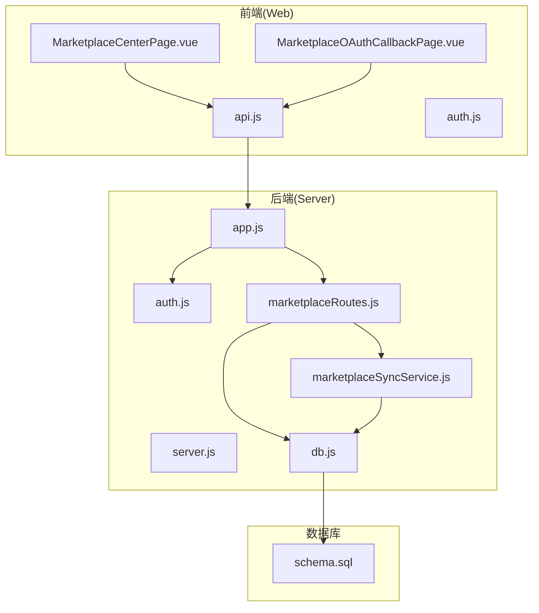
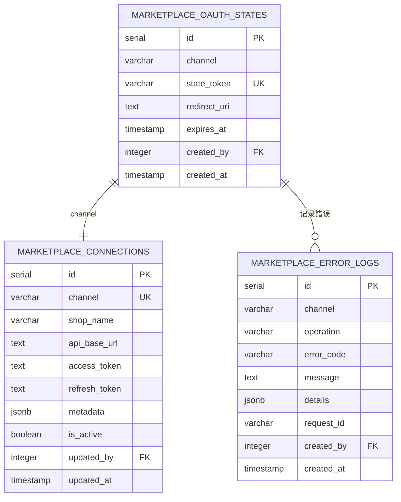
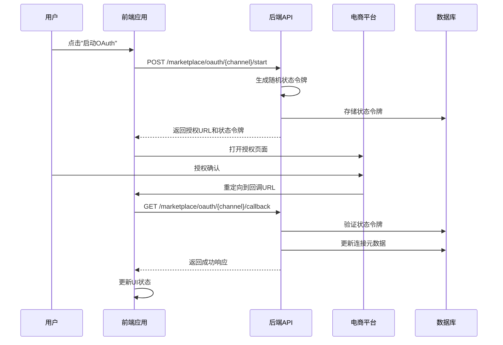
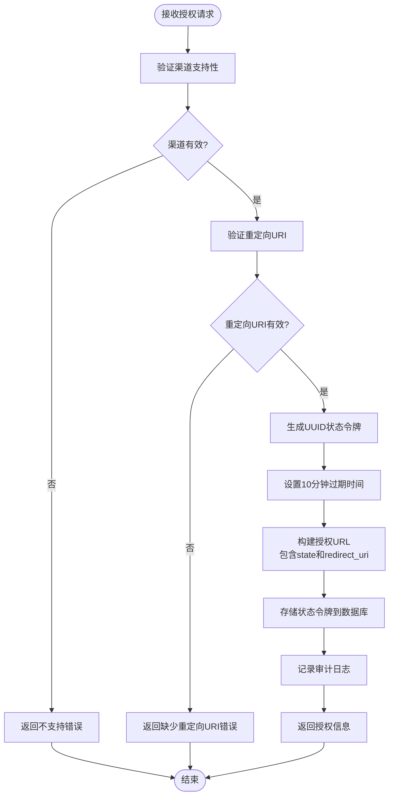
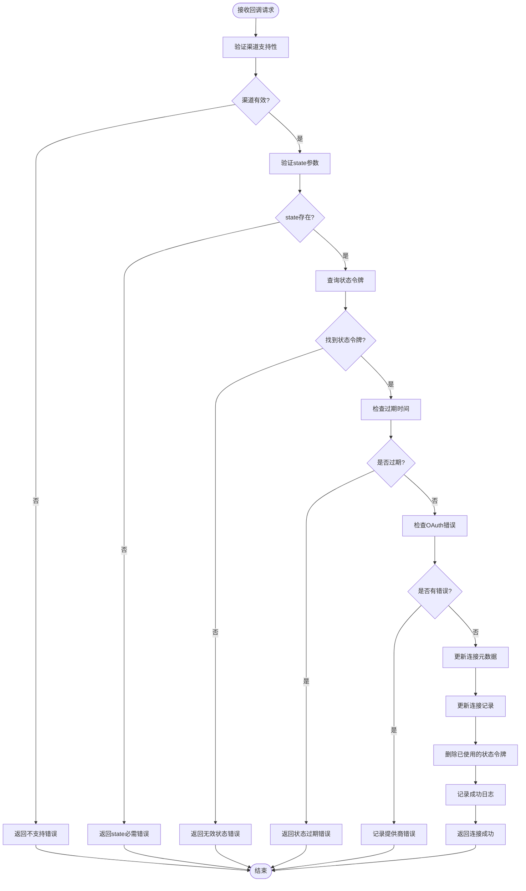
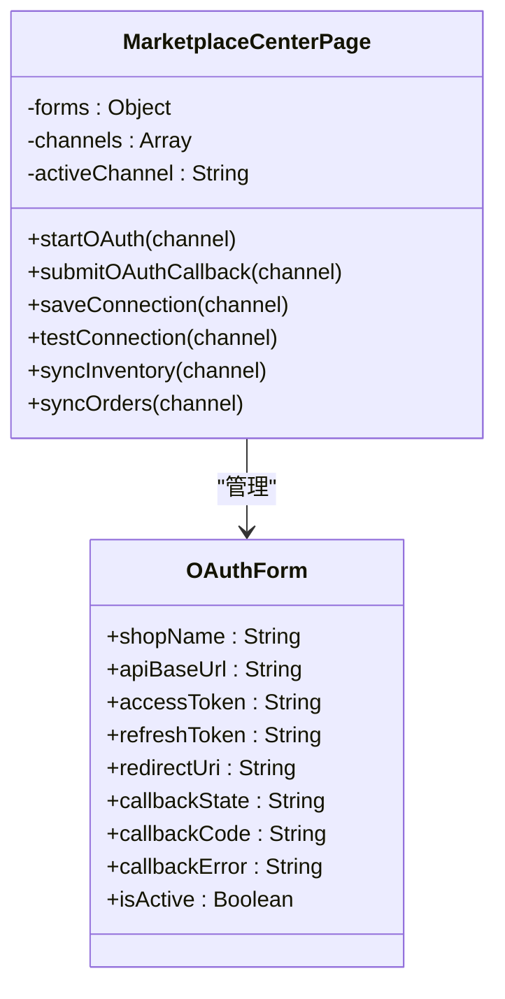
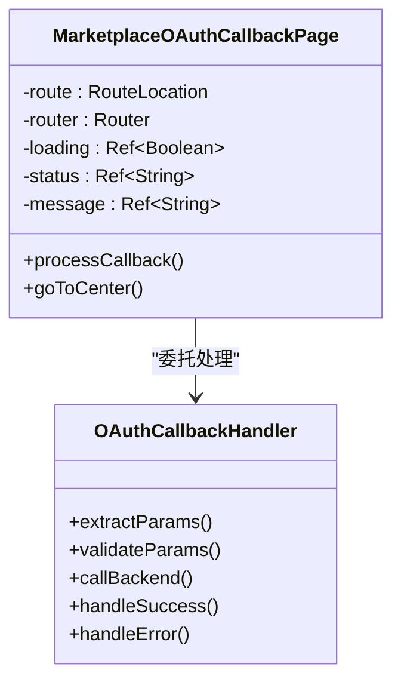
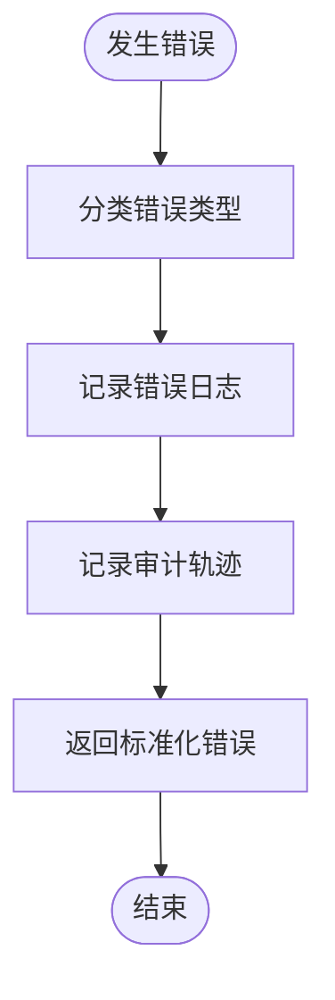
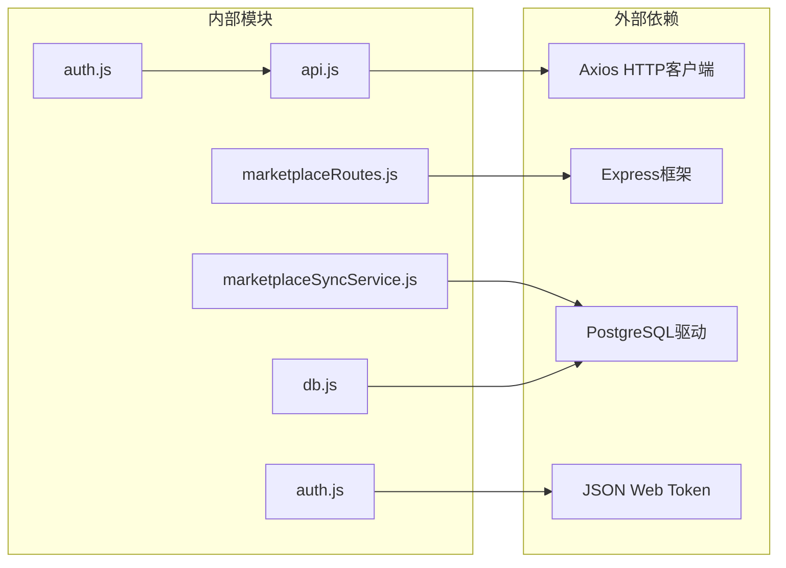

# OAuth认证流程

<cite>
**本文档引用的文件**
- [server.js](file://server/src/server.js)
- [app.js](file://server/src/app.js)
- [db.js](file://server/src/config/db.js)
- [auth.js](file://server/src/middleware/auth.js)
- [authRoutes.js](file://server/src/routes/authRoutes.js)
- [marketplaceRoutes.js](file://server/src/routes/marketplaceRoutes.js)
- [marketplaceSyncService.js](file://server/src/services/marketplaceSyncService.js)
- [schema.sql](file://server/database/schema.sql)
- [api.js](file://web/src/services/api.js)
- [auth.js](file://web/src/stores/auth.js)
- [MarketplaceCenterPage.vue](file://web/src/pages/MarketplaceCenterPage.vue)
- [MarketplaceOAuthCallbackPage.vue](file://web/src/pages/MarketplaceOAuthCallbackPage.vue)
</cite>

## 目录
1. [简介](#简介)
2. [项目结构](#项目结构)
3. [核心组件](#核心组件)
4. [架构概览](#架构概览)
5. [详细组件分析](#详细组件分析)
6. [依赖关系分析](#依赖关系分析)
7. [性能考虑](#性能考虑)
8. [故障排除指南](#故障排除指南)
9. [结论](#结论)

## 简介

本文件详细说明了电商平台OAuth 2.0授权码流程的完整实现，包括授权URL生成、状态令牌管理、回调处理、错误处理以及安全机制。系统支持Shopee、Lazada和TikTok三个电商平台的OAuth集成，通过状态令牌防止CSRF攻击，通过过期时间确保安全性，并提供完整的错误处理和调试功能。

## 项目结构

该项目采用前后端分离架构，后端使用Node.js + Express提供RESTful API，前端使用Vue.js构建用户界面。

**图表来源**
- [app.js:1-67](file://server/src/app.js#L1-L67)
- [server.js:1-28](file://server/src/server.js#L1-L28)
- [marketplaceRoutes.js:1-641](file://server/src/routes/marketplaceRoutes.js#L1-L641)

**章节来源**
- [app.js:1-67](file://server/src/app.js#L1-L67)
- [server.js:1-28](file://server/src/server.js#L1-L28)

## 核心组件

### OAuth状态管理表

系统使用专用的状态令牌表来管理OAuth流程中的状态参数：

**图表来源**
- [schema.sql:160-202](file://server/database/schema.sql#L160-L202)

### 认证中间件

系统实现了基于JWT的认证中间件，确保只有经过身份验证的用户才能访问OAuth相关功能。

**章节来源**
- [auth.js:1-46](file://server/src/middleware/auth.js#L1-L46)
- [authRoutes.js:1-72](file://server/src/routes/authRoutes.js#L1-L72)

## 架构概览

OAuth认证流程遵循标准的授权码流程，但增加了额外的安全层：

**图表来源**
- [marketplaceRoutes.js:204-269](file://server/src/routes/marketplaceRoutes.js#L204-L269)
- [marketplaceRoutes.js:271-375](file://server/src/routes/marketplaceRoutes.js#L271-L375)

## 详细组件分析

### 授权开始流程

授权开始流程负责生成状态令牌并构建授权URL：

**图表来源**
- [marketplaceRoutes.js:204-269](file://server/src/routes/marketplaceRoutes.js#L204-L269)

**章节来源**
- [marketplaceRoutes.js:204-269](file://server/src/routes/marketplaceRoutes.js#L204-L269)

### 回调处理流程

回调处理流程验证状态令牌并完成OAuth流程：

**图表来源**
- [marketplaceRoutes.js:271-375](file://server/src/routes/marketplaceRoutes.js#L271-L375)

**章节来源**
- [marketplaceRoutes.js:271-375](file://server/src/routes/marketplaceRoutes.js#L271-L375)

### 前端OAuth处理

前端提供了两个关键页面来处理OAuth流程：

#### 授权中心页面

**图表来源**
- [MarketplaceCenterPage.vue:170-216](file://web/src/pages/MarketplaceCenterPage.vue#L170-L216)

#### OAuth回调页面

**图表来源**
- [MarketplaceOAuthCallbackPage.vue:19-48](file://web/src/pages/MarketplaceOAuthCallbackPage.vue#L19-L48)

**章节来源**
- [MarketplaceCenterPage.vue:170-216](file://web/src/pages/MarketplaceCenterPage.vue#L170-L216)
- [MarketplaceOAuthCallbackPage.vue:1-81](file://web/src/pages/MarketplaceOAuthCallbackPage.vue#L1-L81)

### 安全机制

系统实现了多层安全防护：

#### 状态令牌安全

1. **随机性保证**：使用`randomUUID()`生成不可预测的状态令牌
2. **一次性使用**：令牌使用后立即从数据库删除
3. **时间限制**：10分钟有效期，防止长期有效令牌被滥用
4. **唯一性约束**：数据库层面确保状态令牌的唯一性

#### CSRF防护

通过验证回调中的state参数与存储的状态令牌匹配，防止跨站请求伪造攻击。

#### 错误处理

系统提供详细的错误分类和日志记录：

**图表来源**
- [marketplaceRoutes.js:20-45](file://server/src/routes/marketplaceRoutes.js#L20-L45)

**章节来源**
- [marketplaceRoutes.js:20-45](file://server/src/routes/marketplaceRoutes.js#L20-L45)

## 依赖关系分析

**图表来源**
- [api.js:1-45](file://web/src/services/api.js#L1-L45)
- [marketplaceRoutes.js:1-13](file://server/src/routes/marketplaceRoutes.js#L1-L13)
- [marketplaceSyncService.js:1-146](file://server/src/services/marketplaceSyncService.js#L1-L146)

**章节来源**
- [api.js:1-45](file://web/src/services/api.js#L1-L45)
- [marketplaceRoutes.js:1-13](file://server/src/routes/marketplaceRoutes.js#L1-L13)

## 性能考虑

### 速率限制

系统对OAuth操作实施了速率限制，防止滥用：

- OAuth启动：每分钟最多20次请求
- 同步操作：每分钟最多12次请求

### 数据库优化

- 状态令牌表使用唯一索引确保查询效率
- 连接记录使用JSONB字段存储动态元数据
- 审计日志和错误日志分离存储

### 缓存策略

前端使用localStorage缓存认证状态，减少重复登录的需要。

## 故障排除指南

### 常见问题及解决方案

#### 授权URL无法打开

**症状**：点击"启动OAuth"后无反应或弹窗被拦截

**排查步骤**：
1. 检查浏览器弹窗拦截设置
2. 验证重定向URI配置是否正确
3. 确认网络连接正常

**解决方案**：
- 允许弹窗或手动复制授权URL
- 在应用设置中添加正确的重定向URI
- 检查防火墙设置

#### 状态令牌验证失败

**症状**：回调时显示"无效状态"或"状态过期"

**排查步骤**：
1. 检查浏览器是否启用了Cookie
2. 验证重定向URI是否完全匹配
3. 确认时间同步设置正确

**解决方案**：
- 清除浏览器缓存和Cookie
- 使用相同的浏览器窗口完成整个流程
- 检查系统时间设置

#### 权限不足错误

**症状**：返回"您没有权限执行此操作"

**排查步骤**：
1. 检查用户角色是否为ADMIN或MANAGER
2. 验证JWT令牌有效性
3. 确认用户账户状态正常

**解决方案**：
- 联系管理员提升权限
- 重新登录获取新令牌
- 检查账户激活状态

#### 数据库连接问题

**症状**：OAuth流程中断或超时

**排查步骤**：
1. 检查数据库连接字符串
2. 验证网络连通性
3. 确认数据库服务运行状态

**解决方案**：
- 检查DATABASE_URL环境变量
- 验证防火墙规则
- 重启数据库服务

### 调试技巧

#### 后端调试

1. **启用详细日志**：设置`NODE_ENV=development`
2. **检查审计日志**：查看`marketplace_error_logs`表
3. **监控数据库**：使用`EXPLAIN ANALYZE`分析慢查询

#### 前端调试

1. **浏览器开发者工具**：监控网络请求和响应
2. **Vue DevTools**：检查状态管理和组件状态
3. **本地存储检查**：验证localStorage中的认证信息

#### 环境配置

确保以下环境变量正确设置：
- `JWT_SECRET`：JWT密钥
- `DATABASE_URL`：数据库连接字符串
- 各电商平台的API密钥和端点

**章节来源**
- [marketplaceRoutes.js:20-45](file://server/src/routes/marketplaceRoutes.js#L20-L45)
- [schema.sql:160-202](file://server/database/schema.sql#L160-L202)

## 结论

本OAuth认证流程实现了完整的授权码流程，具有以下特点：

1. **安全性**：通过状态令牌、过期时间和CSRF防护确保流程安全
2. **可靠性**：完善的错误处理和日志记录机制
3. **可扩展性**：支持多个电商平台的OAuth集成
4. **易用性**：提供直观的用户界面和清晰的错误提示

系统通过前后端协作，为电商平台的OAuth集成提供了完整的解决方案，能够满足企业级应用的安全性和可靠性要求。