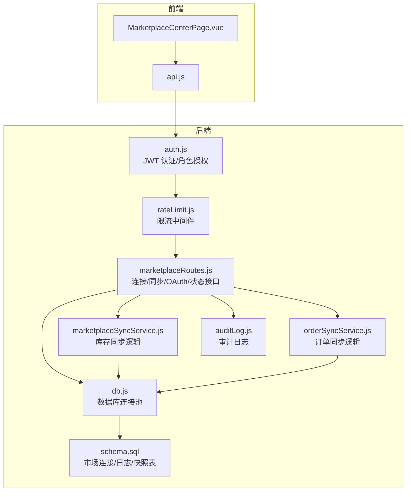
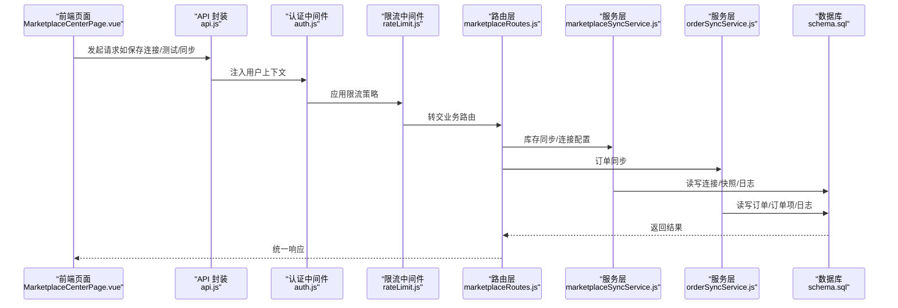
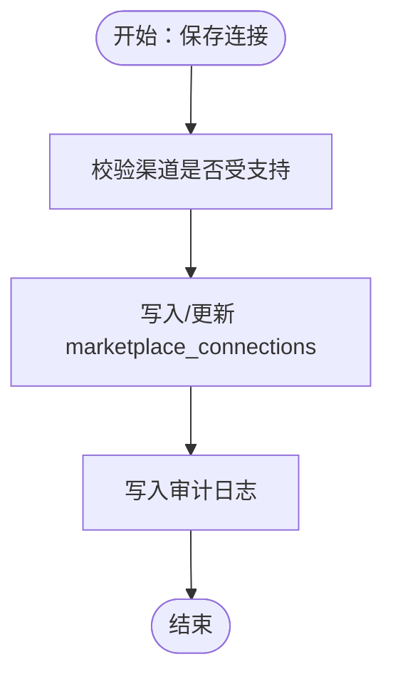
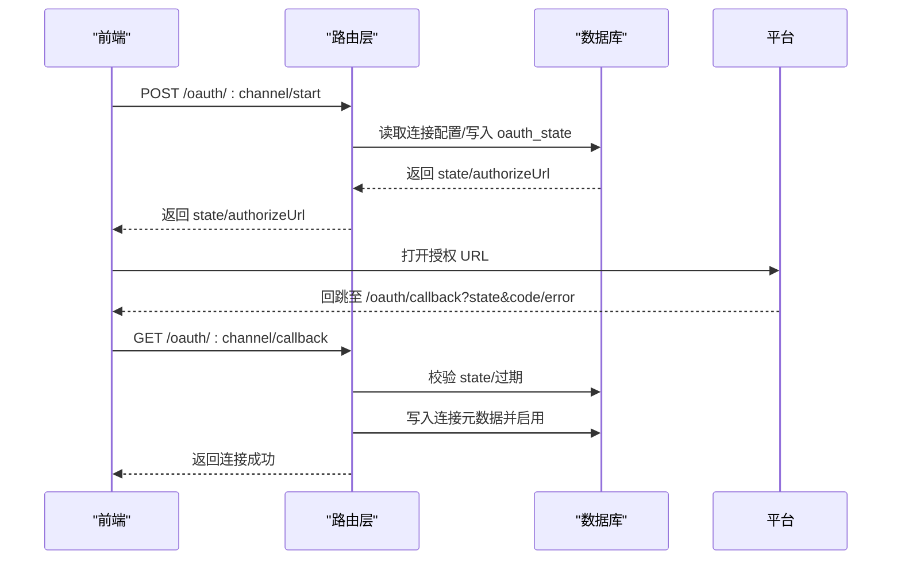
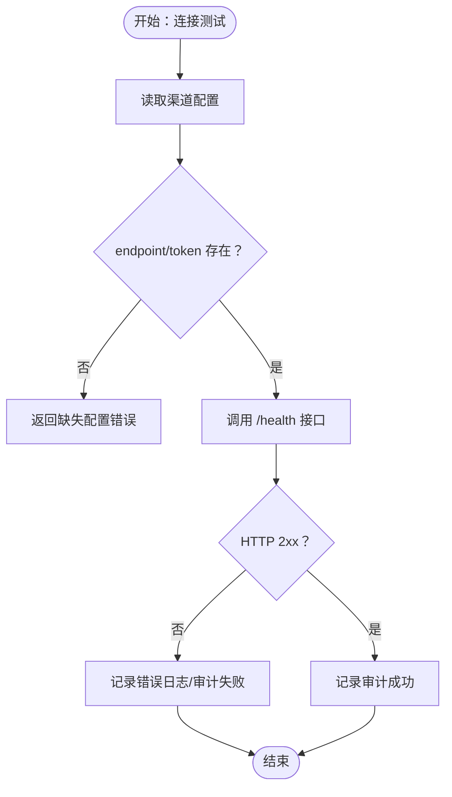
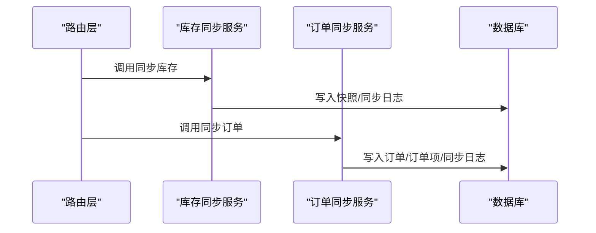
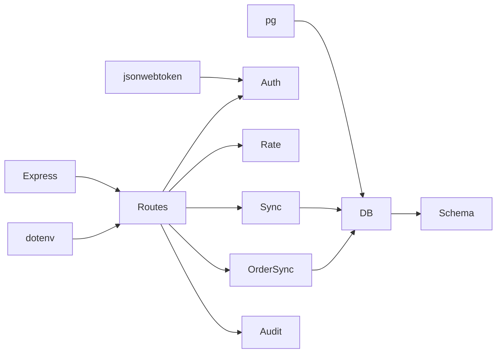

# 平台连接管理

<cite>
**本文引用的文件**
- [server/src/routes/marketplaceRoutes.js](file://server/src/routes/marketplaceRoutes.js)
- [server/src/services/marketplaceSyncService.js](file://server/src/services/marketplaceSyncService.js)
- [server/src/services/orderSyncService.js](file://server/src/services/orderSyncService.js)
- [server/src/middleware/auth.js](file://server/src/middleware/auth.js)
- [server/src/middleware/rateLimit.js](file://server/src/middleware/rateLimit.js)
- [server/src/utils/auditLog.js](file://server/src/utils/auditLog.js)
- [server/src/config/db.js](file://server/src/config/db.js)
- [server/database/schema.sql](file://server/database/schema.sql)
- [web/src/pages/MarketplaceCenterPage.vue](file://web/src/pages/MarketplaceCenterPage.vue)
- [web/src/services/api.js](file://web/src/services/api.js)
- [server/package.json](file://server/package.json)
</cite>

## 目录
1. [简介](#简介)
2. [项目结构](#项目结构)
3. [核心组件](#核心组件)
4. [架构总览](#架构总览)
5. [详细组件分析](#详细组件分析)
6. [依赖关系分析](#依赖关系分析)
7. [性能考量](#性能考量)
8. [故障排查指南](#故障排查指南)
9. [结论](#结论)
10. [附录](#附录)

## 简介
本文件面向电商平台连接管理功能，围绕 Shopee、Lazada、TikTok Shop 三大平台的连接配置、OAuth 授权、连接测试、同步任务与状态监控进行系统化说明。文档覆盖连接参数设置、API 密钥配置、连接状态监控、连接测试与故障诊断流程、数据验证规则、安全存储与权限控制，并提供最佳实践与排障建议。

## 项目结构
后端采用 Express 路由 + 服务层 + 数据库 Schema 的分层设计；前端使用 Vue 页面组件与统一 API 封装，负责连接配置、OAuth 引导、同步任务触发与错误日志展示。

图表来源
- [server/src/routes/marketplaceRoutes.js:1-641](file://server/src/routes/marketplaceRoutes.js#L1-L641)
- [server/src/services/marketplaceSyncService.js:1-146](file://server/src/services/marketplaceSyncService.js#L1-L146)
- [server/src/services/orderSyncService.js:1-119](file://server/src/services/orderSyncService.js#L1-L119)
- [server/src/middleware/auth.js:1-46](file://server/src/middleware/auth.js#L1-L46)
- [server/src/middleware/rateLimit.js:1-40](file://server/src/middleware/rateLimit.js#L1-L40)
- [server/src/utils/auditLog.js:1-38](file://server/src/utils/auditLog.js#L1-L38)
- [server/src/config/db.js:1-25](file://server/src/config/db.js#L1-L25)
- [server/database/schema.sql:161-194](file://server/database/schema.sql#L161-L194)

章节来源
- [server/src/routes/marketplaceRoutes.js:1-641](file://server/src/routes/marketplaceRoutes.js#L1-L641)
- [server/database/schema.sql:161-194](file://server/database/schema.sql#L161-L194)

## 核心组件
- 连接配置与管理
  - 支持 Shopee/Lazada/TikTok 三类渠道，统一存储于 marketplace_connections 表，字段包括渠道标识、店铺名、API 基础地址、访问令牌、刷新令牌、元数据与启用状态。
  - 提供连接列表查询、按渠道更新连接配置、连接测试、状态概览、错误日志与同步日志查询。
- OAuth 授权流程
  - 启动授权：生成 state、记录过期时间、返回授权 URL。
  - 回调处理：校验 state、写入最新授权信息、标记连接为已激活。
- 同步任务
  - 库存同步：从各平台拉取库存并落库快照，记录同步日志。
  - 订单同步：从各平台拉取订单明细，去重入库并记录同步日志。
- 审计与监控
  - 所有关键操作均写入审计日志；提供错误日志表与同步日志表，支持分页与筛选。
- 权限与安全
  - JWT 认证 + 角色授权（ADMIN/MANAGER），限流保护，数据库连接 SSL 控制。

章节来源
- [server/src/routes/marketplaceRoutes.js:47-142](file://server/src/routes/marketplaceRoutes.js#L47-L142)
- [server/src/routes/marketplaceRoutes.js:204-375](file://server/src/routes/marketplaceRoutes.js#L204-L375)
- [server/src/routes/marketplaceRoutes.js:144-202](file://server/src/routes/marketplaceRoutes.js#L144-L202)
- [server/src/routes/marketplaceRoutes.js:595-638](file://server/src/routes/marketplaceRoutes.js#L595-L638)
- [server/src/utils/auditLog.js:1-38](file://server/src/utils/auditLog.js#L1-L38)
- [server/src/middleware/auth.js:5-40](file://server/src/middleware/auth.js#L5-L40)
- [server/src/middleware/rateLimit.js:9-35](file://server/src/middleware/rateLimit.js#L9-L35)
- [server/src/config/db.js:3-11](file://server/src/config/db.js#L3-L11)

## 架构总览
平台连接管理以“路由层-服务层-数据层”分层组织，前端通过统一 API 封装与后端交互，后端通过认证中间件、限流中间件与数据库连接池保障安全与稳定性。

图表来源
- [web/src/pages/MarketplaceCenterPage.vue:136-246](file://web/src/pages/MarketplaceCenterPage.vue#L136-L246)
- [web/src/services/api.js:1-45](file://web/src/services/api.js#L1-L45)
- [server/src/middleware/auth.js:5-40](file://server/src/middleware/auth.js#L5-L40)
- [server/src/middleware/rateLimit.js:9-35](file://server/src/middleware/rateLimit.js#L9-L35)
- [server/src/routes/marketplaceRoutes.js:72-142](file://server/src/routes/marketplaceRoutes.js#L72-L142)
- [server/src/services/marketplaceSyncService.js:100-140](file://server/src/services/marketplaceSyncService.js#L100-L140)
- [server/src/services/orderSyncService.js:19-114](file://server/src/services/orderSyncService.js#L19-L114)
- [server/database/schema.sql:137-194](file://server/database/schema.sql#L137-L194)

## 详细组件分析

### 连接配置与管理
- 支持渠道：shopee/lazada/tiktok，不支持渠道将被拒绝。
- 存储结构：marketplace_connections 表，包含渠道、店铺名、API 基础地址、访问令牌、刷新令牌、元数据、启用状态与更新人/时间。
- 更新接口：按渠道写入或更新，ON CONFLICT 更新策略确保幂等。
- 查询接口：返回连接列表，含是否具备访问令牌的标记。
- 连接测试：基于已配置的 endpoint 与 token，访问 /health 端点，记录审计与错误日志。

图表来源
- [server/src/routes/marketplaceRoutes.js:72-142](file://server/src/routes/marketplaceRoutes.js#L72-L142)
- [server/src/utils/auditLog.js:1-38](file://server/src/utils/auditLog.js#L1-L38)

章节来源
- [server/src/routes/marketplaceRoutes.js:47-142](file://server/src/routes/marketplaceRoutes.js#L47-L142)
- [server/database/schema.sql:161-172](file://server/database/schema.sql#L161-L172)

### OAuth 授权流程
- 启动授权
  - 校验渠道与 redirectUri。
  - 读取连接配置中的基础地址与授权路径，构造授权 URL。
  - 生成 state 并写入 marketplace_oauth_states，带过期时间。
  - 记录审计日志。
- 回调处理
  - 校验 state 是否存在且未过期。
  - 若平台返回 error，则记录错误日志并返回失败。
  - 写入连接元数据（最近 state/code/成功时间），并启用连接。
  - 删除已使用的 state 记录。
  - 记录审计日志。

图表来源
- [server/src/routes/marketplaceRoutes.js:204-375](file://server/src/routes/marketplaceRoutes.js#L204-L375)
- [server/database/schema.sql:174-182](file://server/database/schema.sql#L174-L182)

章节来源
- [server/src/routes/marketplaceRoutes.js:204-375](file://server/src/routes/marketplaceRoutes.js#L204-L375)
- [server/database/schema.sql:174-182](file://server/database/schema.sql#L174-L182)

### 连接测试与状态检查
- 连接测试
  - 读取渠道配置（优先使用数据库中已启用连接的 endpoint/token，否则回退到环境变量）。
  - 将 endpoint 中的 /inventory 替换为 /health，携带 Bearer Token 发起 GET 请求。
  - 成功则记录审计日志，失败则记录错误日志与审计日志。
- 状态概览
  - 聚合连接状态、最后同步时间、失败次数、近七天错误数、订单/发货总量等指标。

图表来源
- [server/src/routes/marketplaceRoutes.js:377-435](file://server/src/routes/marketplaceRoutes.js#L377-L435)
- [server/src/services/marketplaceSyncService.js:18-37](file://server/src/services/marketplaceSyncService.js#L18-L37)

章节来源
- [server/src/routes/marketplaceRoutes.js:377-435](file://server/src/routes/marketplaceRoutes.js#L377-L435)
- [server/src/services/marketplaceSyncService.js:18-37](file://server/src/services/marketplaceSyncService.js#L18-L37)

### 库存同步与订单同步
- 库存同步
  - 读取配置，访问 /inventory，解析并归一化库存项，写入快照表，记录成功日志。
- 订单同步
  - 将 /inventory 替换为 /orders，访问订单接口，归一化订单与订单项，去重入库，记录成功日志。

图表来源
- [server/src/routes/marketplaceRoutes.js:144-202](file://server/src/routes/marketplaceRoutes.js#L144-L202)
- [server/src/routes/marketplaceRoutes.js:595-638](file://server/src/routes/marketplaceRoutes.js#L595-L638)
- [server/src/services/marketplaceSyncService.js:100-140](file://server/src/services/marketplaceSyncService.js#L100-L140)
- [server/src/services/orderSyncService.js:19-114](file://server/src/services/orderSyncService.js#L19-L114)
- [server/database/schema.sql:137-159](file://server/database/schema.sql#L137-L159)

章节来源
- [server/src/routes/marketplaceRoutes.js:144-202](file://server/src/routes/marketplaceRoutes.js#L144-L202)
- [server/src/routes/marketplaceRoutes.js:595-638](file://server/src/routes/marketplaceRoutes.js#L595-L638)
- [server/src/services/marketplaceSyncService.js:100-140](file://server/src/services/marketplaceSyncService.js#L100-L140)
- [server/src/services/orderSyncService.js:19-114](file://server/src/services/orderSyncService.js#L19-L114)

### 前端页面与交互
- 页面职责
  - 展示连接概览、错误日志与分页。
  - 提供保存连接、连接测试、库存/订单同步、OAuth 启动与回调处理入口。
  - 自动打开授权 URL 或提示下一步操作。
- API 调用
  - 使用 api.js 统一封装，自动注入 Authorization 与多语言头。
  - 对后端统一响应进行解包，失败时提取 message。

章节来源
- [web/src/pages/MarketplaceCenterPage.vue:1-477](file://web/src/pages/MarketplaceCenterPage.vue#L1-L477)
- [web/src/services/api.js:1-45](file://web/src/services/api.js#L1-L45)

## 依赖关系分析
- 外部依赖
  - Express、PostgreSQL 驱动、JWT、CORS、Helmet、Morgan、Bcryptjs、Multer、Dotenv。
- 内部模块耦合
  - 路由层依赖服务层与审计日志；服务层依赖数据库连接；认证与限流中间件贯穿所有受保护路由。
- 数据模型
  - marketplace_connections、marketplace_oauth_states、marketplace_error_logs、marketplace_sync_logs、marketplace_inventory_snapshots、marketplace_orders、marketplace_order_items 等。

图表来源
- [server/package.json:15-25](file://server/package.json#L15-L25)
- [server/src/routes/marketplaceRoutes.js:1-10](file://server/src/routes/marketplaceRoutes.js#L1-L10)
- [server/src/middleware/auth.js:1-46](file://server/src/middleware/auth.js#L1-L46)
- [server/src/middleware/rateLimit.js:1-40](file://server/src/middleware/rateLimit.js#L1-L40)
- [server/src/services/marketplaceSyncService.js:1-2](file://server/src/services/marketplaceSyncService.js#L1-L2)
- [server/src/services/orderSyncService.js:1-2](file://server/src/services/orderSyncService.js#L1-L2)
- [server/src/config/db.js:1-25](file://server/src/config/db.js#L1-L25)
- [server/database/schema.sql:161-194](file://server/database/schema.sql#L161-L194)

章节来源
- [server/package.json:15-25](file://server/package.json#L15-L25)
- [server/src/config/db.js:1-25](file://server/src/config/db.js#L1-L25)
- [server/database/schema.sql:161-194](file://server/database/schema.sql#L161-L194)

## 性能考量
- 限流策略
  - marketplace-sync 与 marketplace-oauth 分别设置独立窗口与最大请求数，防止突发流量冲击。
- 数据库连接
  - 根据连接字符串与环境自动选择 SSL，生产环境默认启用，提升传输安全性。
- 索引优化
  - 针对错误日志、同步日志、快照、订单等高频查询建立索引，提升分页与筛选性能。
- 幂等与去重
  - 订单同步使用渠道+外部订单号唯一约束，避免重复入库；库存快照按渠道删除后重建，保证一致性。

章节来源
- [server/src/middleware/rateLimit.js:9-35](file://server/src/middleware/rateLimit.js#L9-L35)
- [server/src/config/db.js:3-11](file://server/src/config/db.js#L3-L11)
- [server/database/schema.sql:419-426](file://server/database/schema.sql#L419-L426)

## 故障排查指南
- 常见错误类型与定位
  - 不支持的渠道：检查请求路径中的 channel 是否为 shopee/lazada/tiktok。
  - 缺失连接配置：连接测试前需确保数据库中已启用连接或环境变量已配置。
  - OAuth 状态无效/过期：确认 state 是否存在且未超时，redirectUri 是否匹配。
  - 同步失败：查看 marketplace_sync_logs 与 marketplace_error_logs，结合平台返回体定位问题。
- 日志与审计
  - 错误日志表记录操作、错误码、消息与详情；审计日志记录用户、动作、路径与元数据。
- 建议排查步骤
  - 先执行连接测试，确认 endpoint 与 token 可用。
  - 查看状态概览，关注失败次数与最近同步时间。
  - 检查 OAuth 状态表是否残留未清理的条目。
  - 核对数据库索引与权限，确保查询与写入正常。

章节来源
- [server/src/routes/marketplaceRoutes.js:204-375](file://server/src/routes/marketplaceRoutes.js#L204-L375)
- [server/src/routes/marketplaceRoutes.js:377-435](file://server/src/routes/marketplaceRoutes.js#L377-L435)
- [server/src/routes/marketplaceRoutes.js:437-593](file://server/src/routes/marketplaceRoutes.js#L437-L593)
- [server/src/utils/auditLog.js:1-38](file://server/src/utils/auditLog.js#L1-L38)
- [server/database/schema.sql:137-194](file://server/database/schema.sql#L137-L194)

## 结论
该平台连接管理功能以清晰的分层架构与完善的日志体系支撑 Shopee/Lazada/TikTok 的连接配置、OAuth 授权、连接测试与同步任务。通过限流、SSL、角色授权与审计日志，系统在可用性与安全性之间取得平衡。建议在生产环境中严格管理环境变量与令牌存储，定期审查日志与状态概览，确保连接稳定与数据一致。

## 附录

### 连接参数与配置要点
- 必填项
  - 渠道：shopee/lazada/tiktok。
  - API 基础地址：用于构造 /inventory、/orders、/health 等子路径。
  - 访问令牌：用于鉴权请求。
- 可选项
  - 刷新令牌：用于令牌续期（当前路由未直接使用，可在后续扩展）。
  - 元数据：可用于记录授权状态、回调信息等。
- 环境变量回退
  - 当数据库中未配置时，库存同步服务会回退到环境变量中的对应值。

章节来源
- [server/src/routes/marketplaceRoutes.js:72-142](file://server/src/routes/marketplaceRoutes.js#L72-L142)
- [server/src/services/marketplaceSyncService.js:18-37](file://server/src/services/marketplaceSyncService.js#L18-L37)

### 安全存储与权限控制
- 认证与授权
  - JWT 令牌校验，用户必须处于激活状态。
  - 角色授权：仅 ADMIN/MANAGER 可进行连接配置与同步操作。
- 限流防护
  - 针对同步与 OAuth 设置独立限流桶，避免滥用。
- 数据库安全
  - 生产环境默认启用 SSL，拒绝未授权证书。

章节来源
- [server/src/middleware/auth.js:5-40](file://server/src/middleware/auth.js#L5-L40)
- [server/src/middleware/rateLimit.js:9-35](file://server/src/middleware/rateLimit.js#L9-L35)
- [server/src/config/db.js:3-11](file://server/src/config/db.js#L3-L11)

### 最佳实践
- 在数据库中启用连接后再进行同步，避免回退到环境变量导致的不可控风险。
- 使用 OAuth 完整流程，确保 state 校验与过期控制。
- 定期清理 marketplace_oauth_states 中过期条目，避免状态漂移。
- 对同步失败的日志进行根因分析，优先检查网络连通性、令牌有效性与平台配额限制。
- 前端页面应提示用户在平台完成授权后再进行回调处理，减少人工干预错误。