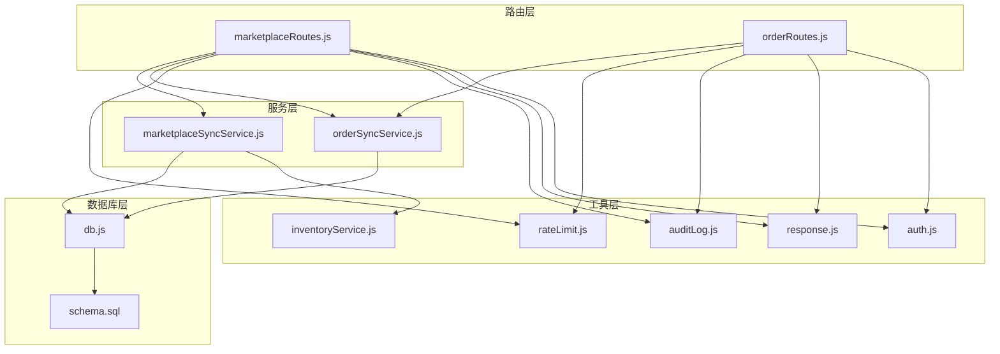
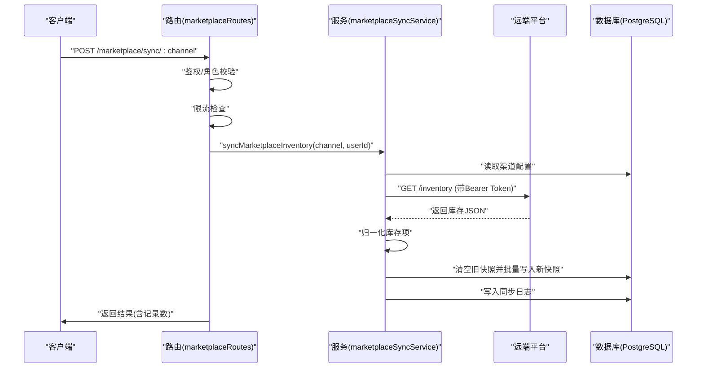
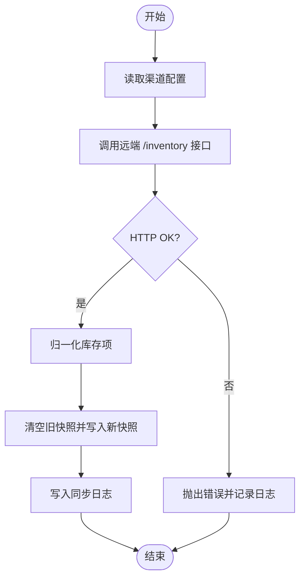
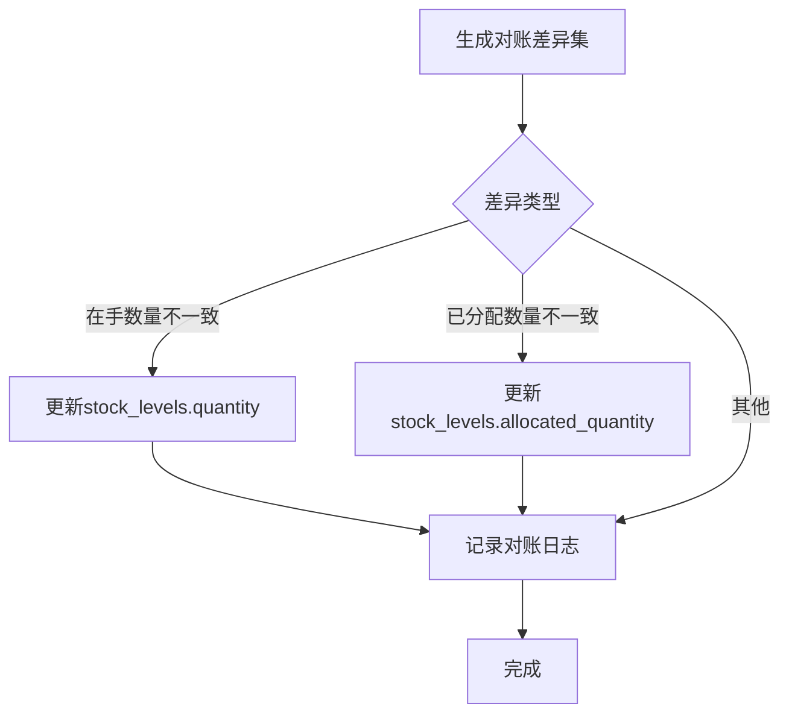
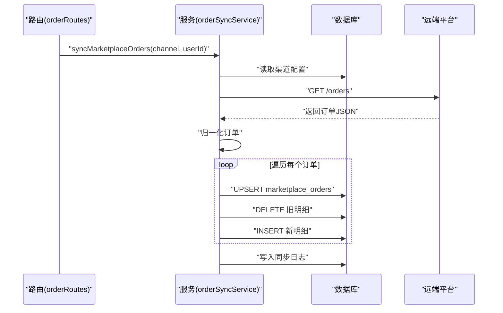
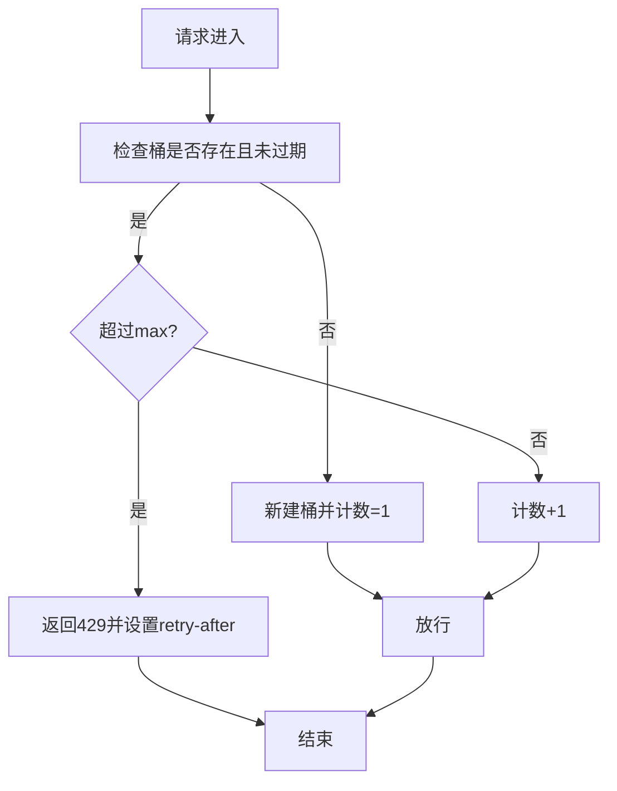
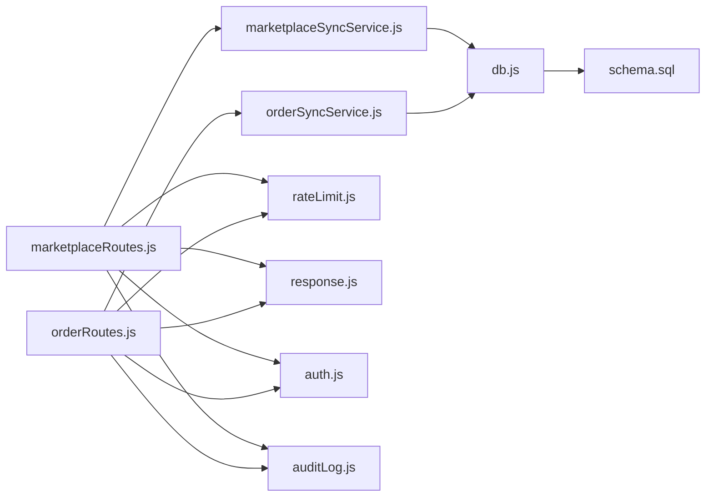
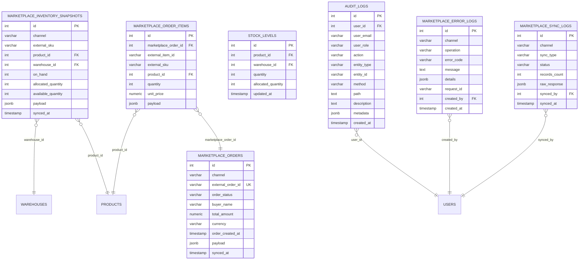

# 数据同步机制

<cite>
**本文引用的文件**
- [marketplaceSyncService.js](file://server/src/services/marketplaceSyncService.js)
- [orderSyncService.js](file://server/src/services/orderSyncService.js)
- [marketplaceRoutes.js](file://server/src/routes/marketplaceRoutes.js)
- [orderRoutes.js](file://server/src/routes/orderRoutes.js)
- [db.js](file://server/src/config/db.js)
- [schema.sql](file://server/database/schema.sql)
- [rateLimit.js](file://server/src/middleware/rateLimit.js)
- [auditLog.js](file://server/src/utils/auditLog.js)
- [auth.js](file://server/src/middleware/auth.js)
- [response.js](file://server/src/middleware/response.js)
- [inventoryService.js](file://server/src/utils/inventoryService.js)
</cite>

## 目录
1. [引言](#引言)
2. [项目结构](#项目结构)
3. [核心组件](#核心组件)
4. [架构总览](#架构总览)
5. [详细组件分析](#详细组件分析)
6. [依赖关系分析](#依赖关系分析)
7. [性能考量](#性能考量)
8. [故障排查指南](#故障排查指南)
9. [结论](#结论)
10. [附录](#附录)

## 引言
本文件面向电商平台数据同步机制，围绕商品数据、库存数据与订单数据的同步流程进行系统化说明。重点涵盖以下方面：
- 同步策略：全量快照与增量对账（基于快照表）的组合方式
- 增量与全量：如何通过“快照表”实现近似增量对账，并在失败时回退至全量覆盖
- 频率控制：基于令牌桶的限流中间件
- 并发处理：单次同步接口的串行化与数据库层冲突处理
- 冲突解决：基于唯一键的UPSERT与字段级更新
- 状态跟踪：统一的日志表记录与审计追踪
- 错误重试：错误日志与可操作的重试路径
- 数据一致性：幂等写入、JSONB存储与索引优化
- 性能优化：批量写入、索引与查询优化建议
- 批量处理与异步任务调度：当前实现为同步接口，建议的异步扩展方案

## 项目结构
后端采用 Express + PostgreSQL 架构，数据同步相关的核心代码集中在以下模块：
- 路由层：负责鉴权、限流、请求封装与响应包装
- 服务层：封装与各平台（Shopee/Lazada/TikTok）的对接逻辑
- 数据库层：统一连接池、模式定义与索引
- 工具层：审计日志、库存通用方法、分页与响应包装

图表来源
- [marketplaceRoutes.js:1-641](file://server/src/routes/marketplaceRoutes.js#L1-L641)
- [orderRoutes.js:1-113](file://server/src/routes/orderRoutes.js#L1-L113)
- [marketplaceSyncService.js:1-146](file://server/src/services/marketplaceSyncService.js#L1-L146)
- [orderSyncService.js:1-119](file://server/src/services/orderSyncService.js#L1-L119)
- [rateLimit.js:1-40](file://server/src/middleware/rateLimit.js#L1-L40)
- [auditLog.js:1-38](file://server/src/utils/auditLog.js#L1-L38)
- [response.js:1-61](file://server/src/middleware/response.js#L1-L61)
- [auth.js:1-46](file://server/src/middleware/auth.js#L1-L46)
- [db.js:1-25](file://server/src/config/db.js#L1-L25)
- [schema.sql:1-447](file://server/database/schema.sql#L1-L447)

章节来源
- [marketplaceRoutes.js:1-641](file://server/src/routes/marketplaceRoutes.js#L1-L641)
- [orderRoutes.js:1-113](file://server/src/routes/orderRoutes.js#L1-L113)
- [marketplaceSyncService.js:1-146](file://server/src/services/marketplaceSyncService.js#L1-L146)
- [orderSyncService.js:1-119](file://server/src/services/orderSyncService.js#L1-L119)
- [db.js:1-25](file://server/src/config/db.js#L1-L25)
- [schema.sql:1-447](file://server/database/schema.sql#L1-L447)

## 核心组件
- 市场渠道配置与库存快照服务
  - 从数据库或环境变量读取渠道配置，拉取远端库存并归一化，写入快照表，便于后续对账与回溯
- 订单同步服务
  - 拉取远端订单，归一化后写入订单与订单明细表；使用ON CONFLICT实现幂等更新
- 路由与中间件
  - 鉴权、角色授权、限流、统一响应包装、审计日志
- 数据库与模式
  - 统一连接池、索引与JSONB字段，支撑日志、错误、快照与订单数据的高并发写入

章节来源
- [marketplaceSyncService.js:1-146](file://server/src/services/marketplaceSyncService.js#L1-L146)
- [orderSyncService.js:1-119](file://server/src/services/orderSyncService.js#L1-L119)
- [marketplaceRoutes.js:1-641](file://server/src/routes/marketplaceRoutes.js#L1-L641)
- [orderRoutes.js:1-113](file://server/src/routes/orderRoutes.js#L1-L113)
- [db.js:1-25](file://server/src/config/db.js#L1-L25)
- [schema.sql:137-235](file://server/database/schema.sql#L137-L235)

## 架构总览
下图展示一次“库存同步”的端到端流程，包括鉴权、限流、调用远端接口、入库与日志记录。

图表来源
- [marketplaceRoutes.js:144-202](file://server/src/routes/marketplaceRoutes.js#L144-L202)
- [marketplaceSyncService.js:100-140](file://server/src/services/marketplaceSyncService.js#L100-L140)
- [db.js:21-25](file://server/src/config/db.js#L21-L25)

## 详细组件分析

### 商品数据同步（库存快照）
- 渠道配置优先从数据库表读取，若未配置则回退到环境变量
- 归一化逻辑兼容多平台字段差异，计算在手、已分配、可用数量
- 快照表用于全量覆盖式同步，便于后续与本地库存对账
- 成功后写入同步日志，失败时同样记录失败日志

图表来源
- [marketplaceSyncService.js:100-140](file://server/src/services/marketplaceSyncService.js#L100-L140)

章节来源
- [marketplaceSyncService.js:1-146](file://server/src/services/marketplaceSyncService.js#L1-L146)
- [marketplaceRoutes.js:144-202](file://server/src/routes/marketplaceRoutes.js#L144-L202)

### 库存数据同步（对账与一致性）
- 本地库存以“快照表”形式落库，作为对账依据
- 对账流程建议：对比快照与本地stock_levels，生成差异并执行补差
- 通用库存方法提供确保行存在、读取与更新库存的封装，便于对账脚本复用

图表来源
- [inventoryService.js:1-45](file://server/src/utils/inventoryService.js#L1-L45)
- [schema.sql:125-133](file://server/database/schema.sql#L125-L133)

章节来源
- [inventoryService.js:1-45](file://server/src/utils/inventoryService.js#L1-L45)
- [schema.sql:125-133](file://server/database/schema.sql#L125-L133)

### 订单数据同步（幂等写入与明细）
- 订单与明细分别写入marketplace_orders与marketplace_order_items
- 使用ON CONFLICT (channel, external_order_id) DO UPDATE实现幂等更新
- 明细先删除再插入，确保与远端最新状态一致

图表来源
- [orderRoutes.js:13-29](file://server/src/routes/orderRoutes.js#L13-L29)
- [orderSyncService.js:19-114](file://server/src/services/orderSyncService.js#L19-L114)

章节来源
- [orderSyncService.js:1-119](file://server/src/services/orderSyncService.js#L1-L119)
- [orderRoutes.js:1-113](file://server/src/routes/orderRoutes.js#L1-L113)

### 同步策略：全量快照与增量对账
- 当前实现为“全量快照”：每次同步会清空旧快照并写入新快照
- 增量对账建议：基于快照表与本地stock_levels的差异计算，仅更新变化部分
- 失败回退：若对账失败，可重新触发全量快照覆盖，确保最终一致

章节来源
- [marketplaceSyncService.js:60-98](file://server/src/services/marketplaceSyncService.js#L60-L98)
- [schema.sql:148-159](file://server/database/schema.sql#L148-L159)

### 频率控制与并发处理
- 限流中间件基于内存桶，按IP+命名空间统计请求
- 不同业务场景设置不同窗口与上限，如市场同步与OAuth
- 路由层对同步接口应用限流，避免瞬时高峰导致下游压力

图表来源
- [rateLimit.js:9-35](file://server/src/middleware/rateLimit.js#L9-L35)
- [marketplaceRoutes.js:11-12](file://server/src/routes/marketplaceRoutes.js#L11-L12)
- [orderRoutes.js:9-9](file://server/src/routes/orderRoutes.js#L9-L9)

章节来源
- [rateLimit.js:1-40](file://server/src/middleware/rateLimit.js#L1-L40)
- [marketplaceRoutes.js:11-12](file://server/src/routes/marketplaceRoutes.js#L11-L12)
- [orderRoutes.js:9-9](file://server/src/routes/orderRoutes.js#L9-L9)

### 冲突解决与幂等性
- 订单同步：按(channel, external_order_id)唯一键UPSERT，字段级更新
- 库存快照：先DELETE后INSERT，实现全量覆盖
- 审计与错误：统一写入审计日志与错误日志，便于追踪与重试

章节来源
- [orderSyncService.js:42-70](file://server/src/services/orderSyncService.js#L42-L70)
- [marketplaceSyncService.js:60-98](file://server/src/services/marketplaceSyncService.js#L60-L98)
- [auditLog.js:1-38](file://server/src/utils/auditLog.js#L1-L38)

### 状态跟踪、错误重试与一致性
- 同步日志：记录通道、类型、状态、记录数与原始响应
- 错误日志：记录通道、操作、错误码、消息与详情
- 审计日志：记录用户、动作、实体、元数据与时间
- 重试建议：根据错误日志定位问题（如认证失败、网络异常），修复后重新触发同步

章节来源
- [marketplaceRoutes.js:173-200](file://server/src/routes/marketplaceRoutes.js#L173-L200)
- [orderRoutes.js:20-29](file://server/src/routes/orderRoutes.js#L20-L29)
- [schema.sql:137-194](file://server/database/schema.sql#L137-L194)

## 依赖关系分析
- 路由依赖服务与中间件；服务依赖数据库与工具；数据库依赖模式定义
- 中间件贯穿请求生命周期：鉴权、限流、响应包装、审计
- 服务层与数据库交互频繁，需关注索引与查询性能

图表来源
- [marketplaceRoutes.js:1-641](file://server/src/routes/marketplaceRoutes.js#L1-L641)
- [orderRoutes.js:1-113](file://server/src/routes/orderRoutes.js#L1-L113)
- [marketplaceSyncService.js:1-146](file://server/src/services/marketplaceSyncService.js#L1-L146)
- [orderSyncService.js:1-119](file://server/src/services/orderSyncService.js#L1-L119)
- [rateLimit.js:1-40](file://server/src/middleware/rateLimit.js#L1-L40)
- [response.js:1-61](file://server/src/middleware/response.js#L1-L61)
- [auth.js:1-46](file://server/src/middleware/auth.js#L1-L46)
- [auditLog.js:1-38](file://server/src/utils/auditLog.js#L1-L38)
- [db.js:1-25](file://server/src/config/db.js#L1-L25)
- [schema.sql:1-447](file://server/database/schema.sql#L1-L447)

章节来源
- [marketplaceRoutes.js:1-641](file://server/src/routes/marketplaceRoutes.js#L1-L641)
- [orderRoutes.js:1-113](file://server/src/routes/orderRoutes.js#L1-L113)
- [db.js:1-25](file://server/src/config/db.js#L1-L25)
- [schema.sql:1-447](file://server/database/schema.sql#L1-L447)

## 性能考量
- 连接池与SSL：根据连接字符串与环境自动启用SSL，提升生产环境安全性
- 索引优化：对快照、订单、错误日志、审计日志等高频查询列建立索引
- 批量写入：快照写入采用逐条INSERT，建议在数据量增大时考虑批量写入
- 查询优化：日志与概览接口使用LIMIT与分页，避免全表扫描
- 建议的异步扩展：当前同步接口为阻塞式，建议引入队列与后台作业，实现异步调度与重试

章节来源
- [db.js:1-25](file://server/src/config/db.js#L1-L25)
- [schema.sql:419-447](file://server/database/schema.sql#L419-L447)
- [marketplaceRoutes.js:484-554](file://server/src/routes/marketplaceRoutes.js#L484-L554)

## 故障排查指南
- 认证失败：检查JWT是否有效、用户是否激活
- 限流触发：观察429响应与retry-after头，降低请求频率
- 连接测试：使用“连接测试”接口验证远端端点与凭据
- 日志定位：查看同步日志、错误日志与审计日志，结合requestId定位问题
- 重试路径：修复配置或网络后，重新触发同步；必要时回滚至全量快照

章节来源
- [auth.js:5-29](file://server/src/middleware/auth.js#L5-L29)
- [rateLimit.js:23-29](file://server/src/middleware/rateLimit.js#L23-L29)
- [marketplaceRoutes.js:377-435](file://server/src/routes/marketplaceRoutes.js#L377-L435)
- [marketplaceRoutes.js:437-455](file://server/src/routes/marketplaceRoutes.js#L437-L455)
- [marketplaceRoutes.js:556-593](file://server/src/routes/marketplaceRoutes.js#L556-L593)

## 结论
该系统通过“全量快照+幂等UPSERT”的组合实现了与多平台的稳定同步，并以统一的日志与审计体系保障了可观测性。建议在现有基础上引入异步任务与增量对账，进一步提升吞吐与稳定性。

## 附录
- 数据模型（简化）
  - marketplace_inventory_snapshots：快照表，支持全量覆盖与对账
  - marketplace_orders / marketplace_order_items：订单与明细，幂等UPSERT
  - marketplace_sync_logs / marketplace_error_logs / audit_logs：状态、错误与审计
  - stock_levels：本地库存，配合快照进行对账

图表来源
- [schema.sql:137-235](file://server/database/schema.sql#L137-L235)