# 电商集成路由

<cite>
**本文档引用的文件**
- [marketplaceRoutes.js](file://server/src/routes/marketplaceRoutes.js)
- [marketplaceSyncService.js](file://server/src/services/marketplaceSyncService.js)
- [orderRoutes.js](file://server/src/routes/orderRoutes.js)
- [orderSyncService.js](file://server/src/services/orderSyncService.js)
- [authRoutes.js](file://server/src/routes/authRoutes.js)
- [auth.js](file://server/src/middleware/auth.js)
- [rateLimit.js](file://server/src/middleware/rateLimit.js)
- [auditLog.js](file://server/src/utils/auditLog.js)
- [schema.sql](file://server/database/schema.sql)
- [app.js](file://server/src/app.js)
- [package.json](file://server/package.json)
- [MarketplaceCenterPage.vue](file://web/src/pages/MarketplaceCenterPage.vue)
- [MarketplaceOAuthCallbackPage.vue](file://web/src/pages/MarketplaceOAuthCallbackPage.vue)
</cite>

## 目录
1. [简介](#简介)
2. [项目结构](#项目结构)
3. [核心组件](#核心组件)
4. [架构概览](#架构概览)
5. [详细组件分析](#详细组件分析)
6. [依赖关系分析](#依赖关系分析)
7. [性能考虑](#性能考虑)
8. [故障排除指南](#故障排除指南)
9. [结论](#结论)

## 简介

电商集成路由模块是一个完整的电商平台连接、授权和数据同步解决方案，支持 Shopee、Lazada 和 TikTok Shop 三大主流电商平台。该模块提供了从 OAuth 认证到商品同步、库存同步和订单同步的完整 API 接口，以及完善的错误处理和审计日志功能。

该系统采用 Express.js 构建，使用 PostgreSQL 作为数据存储，实现了企业级的电商集成能力，包括实时库存同步、订单数据同步、物流跟踪和售后服务管理等功能。

## 项目结构

电商集成路由模块采用分层架构设计，主要分为以下几个层次：

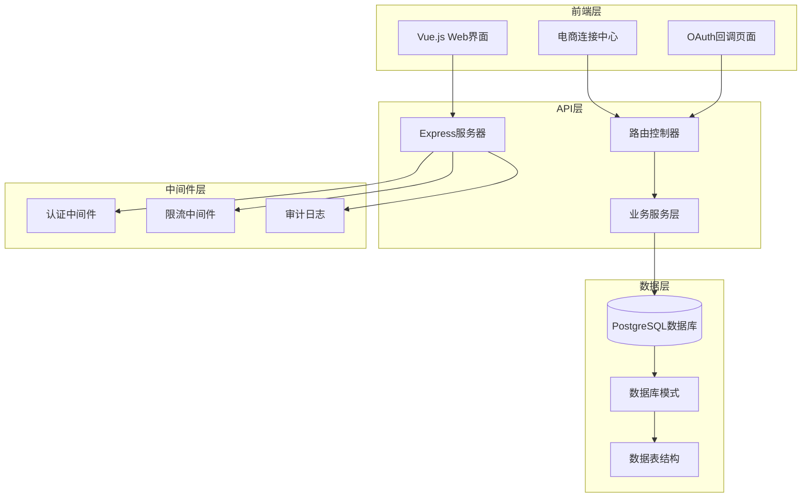

**图表来源**
- [app.js:1-67](file://server/src/app.js#L1-L67)
- [schema.sql:1-447](file://server/database/schema.sql#L1-L447)

**章节来源**
- [app.js:1-67](file://server/src/app.js#L1-L67)
- [package.json:1-31](file://server/package.json#L1-L31)

## 核心组件

### 路由控制器

系统的核心路由控制器位于 `server/src/routes/` 目录下，主要包括：

- **marketplaceRoutes.js**: 电商连接和同步路由
- **orderRoutes.js**: 订单管理路由  
- **authRoutes.js**: 用户认证路由
- **shippingRoutes.js**: 物流配送路由

每个路由控制器都实现了统一的错误处理和响应格式化机制。

### 业务服务层

业务逻辑封装在 `server/src/services/` 目录下的服务文件中：

- **marketplaceSyncService.js**: 电商数据同步服务
- **orderSyncService.js**: 订单同步服务
- **inventoryService.js**: 库存管理服务

这些服务提供了平台无关的数据处理和转换逻辑。

### 数据模型

系统使用 PostgreSQL 作为数据存储，定义了完整的数据模型：

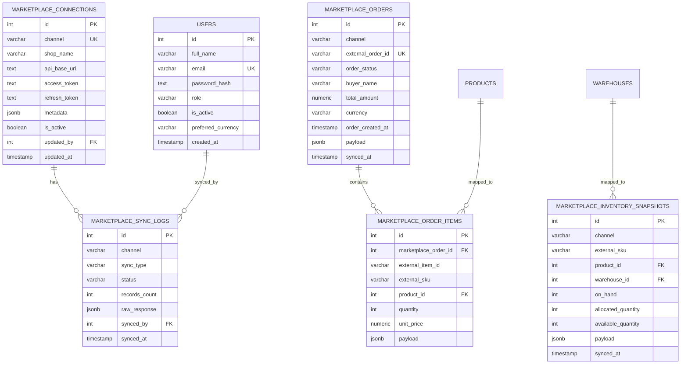

**图表来源**
- [schema.sql:137-235](file://server/database/schema.sql#L137-L235)

**章节来源**
- [schema.sql:137-235](file://server/database/schema.sql#L137-L235)

## 架构概览

电商集成路由模块采用现代化的企业级架构设计，实现了高可用性和可扩展性：

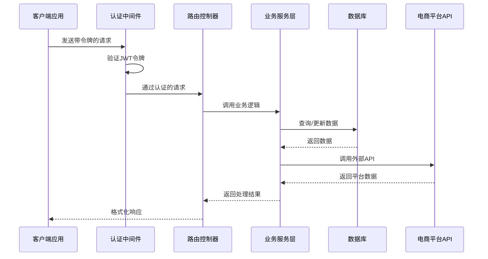

**图表来源**
- [auth.js:1-46](file://server/src/middleware/auth.js#L1-L46)
- [marketplaceRoutes.js:1-641](file://server/src/routes/marketplaceRoutes.js#L1-L641)
- [orderRoutes.js:1-113](file://server/src/routes/orderRoutes.js#L1-L113)

### 平台集成架构

系统支持三个主要电商平台，每个平台都有独立的配置和同步机制：

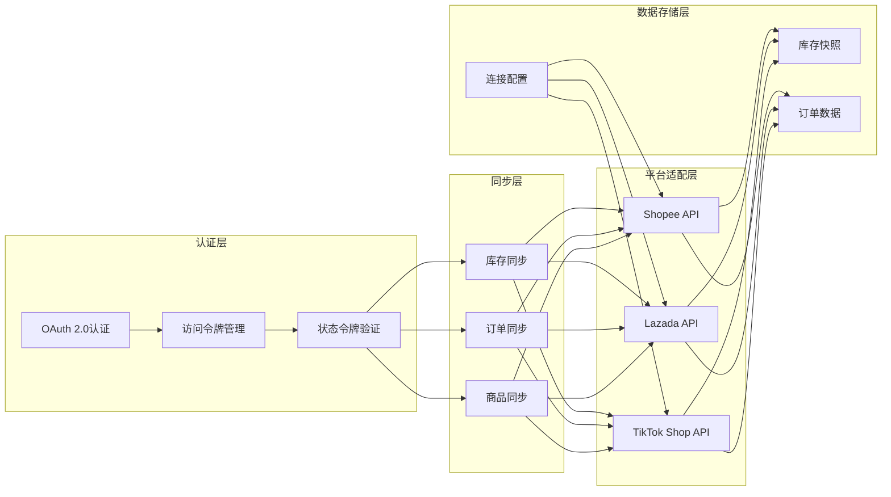

**图表来源**
- [marketplaceSyncService.js:1-146](file://server/src/services/marketplaceSyncService.js#L1-L146)
- [orderSyncService.js:1-119](file://server/src/services/orderSyncService.js#L1-L119)

## 详细组件分析

### 认证与授权系统

系统实现了基于 JWT 的认证机制和基于角色的访问控制：

#### JWT 认证流程

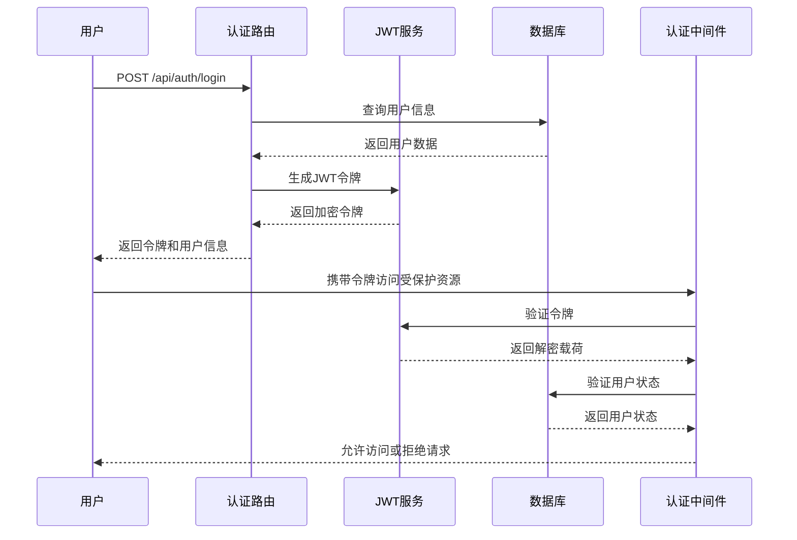

**图表来源**
- [authRoutes.js:1-72](file://server/src/routes/authRoutes.js#L1-L72)
- [auth.js:1-46](file://server/src/middleware/auth.js#L1-L46)

#### 角色权限控制

系统支持三种用户角色：
- **ADMIN**: 系统管理员，拥有最高权限
- **MANAGER**: 库存管理员，可以管理库存和订单
- **STAFF**: 普通员工，只能查看数据

**章节来源**
- [authRoutes.js:1-72](file://server/src/routes/authRoutes.js#L1-L72)
- [auth.js:1-46](file://server/src/middleware/auth.js#L1-L46)

### 电商连接管理

电商连接管理是整个系统的核心功能，负责维护与各个电商平台的连接状态。

#### 连接配置管理

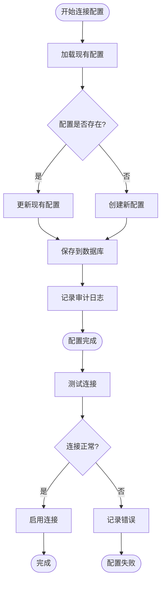

**图表来源**
- [marketplaceRoutes.js:72-142](file://server/src/routes/marketplaceRoutes.js#L72-L142)

#### 支持的电商平台

系统目前支持以下三个电商平台：

| 平台 | 通道标识 | API端点 | 认证方式 |
|------|----------|---------|----------|
| Shopee | `shopee` | `/inventory` | OAuth 2.0 |
| Lazada | `lazada` | `/inventory` | OAuth 2.0 |
| TikTok | `tiktok` | `/inventory` | OAuth 2.0 |

**章节来源**
- [marketplaceRoutes.js:16-18](file://server/src/routes/marketplaceRoutes.js#L16-L18)
- [marketplaceSyncService.js:3-16](file://server/src/services/marketplaceSyncService.js#L3-L16)

### OAuth 认证流程

OAuth 2.0 认证流程确保了与电商平台的安全连接：

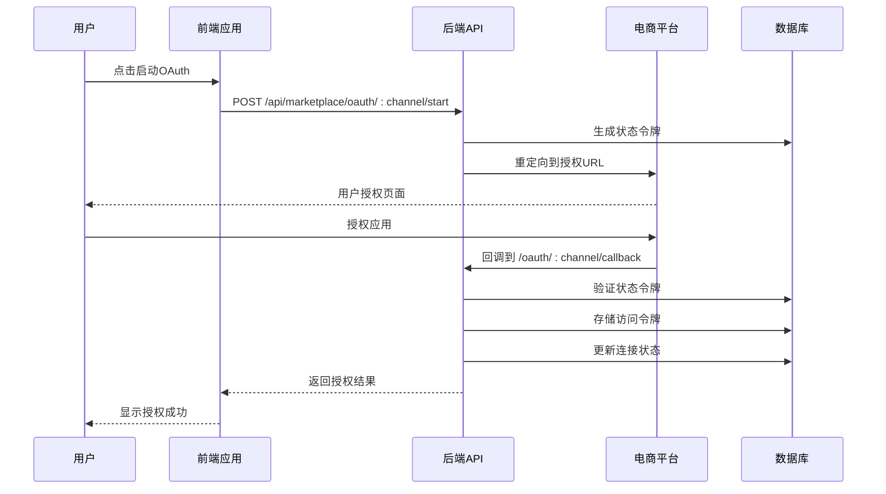

**图表来源**
- [marketplaceRoutes.js:204-375](file://server/src/routes/marketplaceRoutes.js#L204-L375)

#### OAuth 状态管理

系统使用专门的状态令牌来确保 OAuth 流程的安全性：

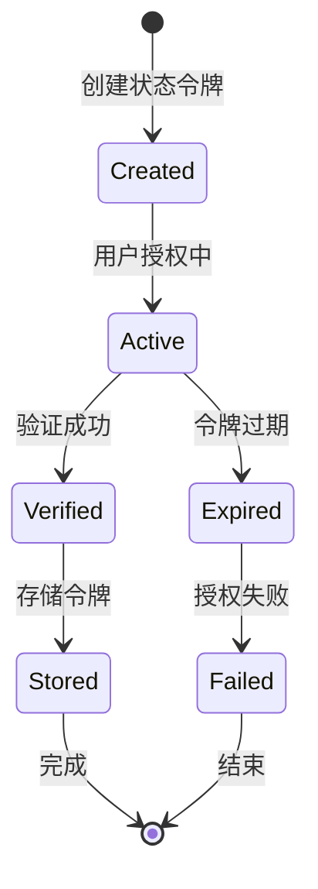

**图表来源**
- [marketplaceRoutes.js:217-241](file://server/src/routes/marketplaceRoutes.js#L217-L241)

**章节来源**
- [marketplaceRoutes.js:204-375](file://server/src/routes/marketplaceRoutes.js#L204-L375)

### 库存同步机制

库存同步功能实现了与电商平台的商品库存数据实时同步：

#### 库存同步流程

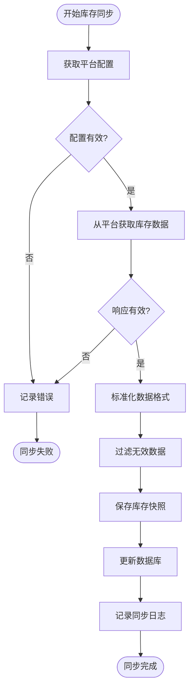

**图表来源**
- [marketplaceSyncService.js:100-140](file://server/src/services/marketplaceSyncService.js#L100-L140)

#### 数据标准化策略

系统实现了灵活的数据标准化机制，支持不同平台的数据格式差异：

| 字段 | Shopee | Lazada | TikTok | 标准化字段 |
|------|--------|--------|--------|------------|
| SKU | `sku` | `externalSku` | `externalSku` | `externalSku` |
| 数量 | `onHand` | `on_hand` | `quantity` | `onHandQuantity` |
| 已分配 | `allocated` | `order_allocated` | `allocated` | `allocatedQuantity` |
| 可用数量 | `available` | `warehouse_available` | `available` | `availableQuantity` |

**章节来源**
- [marketplaceSyncService.js:39-58](file://server/src/services/marketplaceSyncService.js#L39-L58)

### 订单同步机制

订单同步功能实现了与电商平台的订单数据双向同步：

#### 订单同步流程

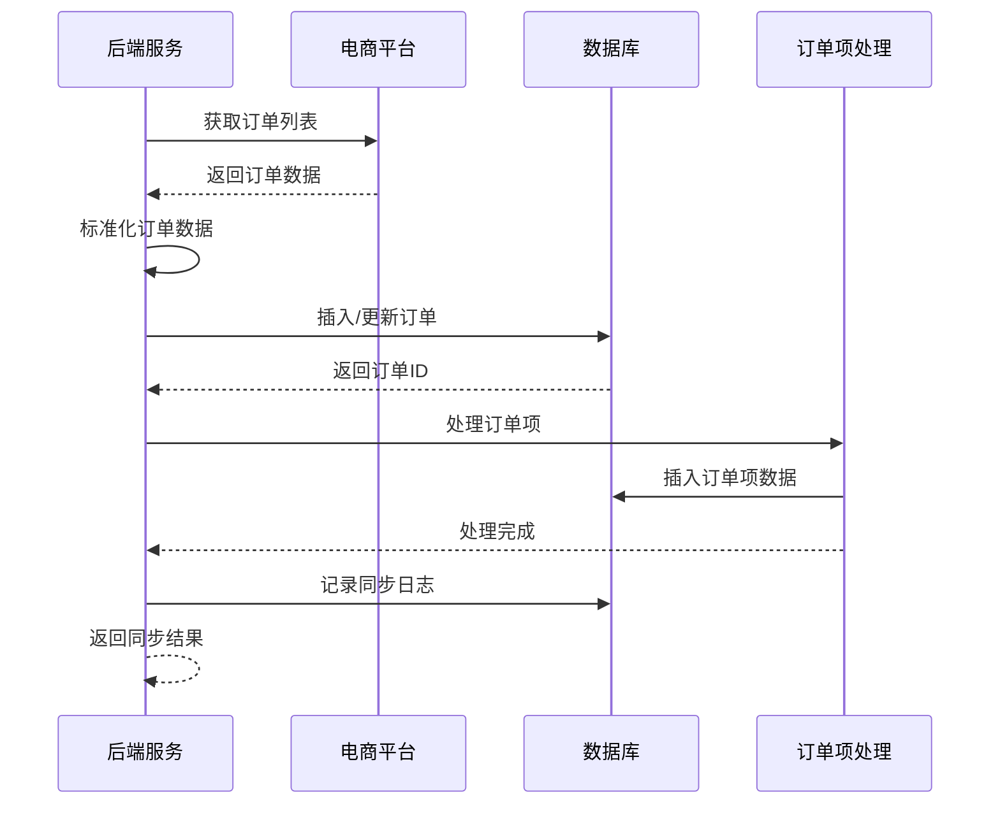

**图表来源**
- [orderSyncService.js:19-114](file://server/src/services/orderSyncService.js#L19-L114)

#### 订单状态映射

系统支持订单状态的标准化映射：

| 平台状态 | Shopee | Lazada | TikTok | 标准化状态 |
|----------|--------|--------|--------|------------|
| 待付款 | `PENDING` | `PENDING` | `PENDING` | `PENDING` |
| 已支付 | `READY_TO_SHIP` | `PAID` | `READY_TO_SHIP` | `CONFIRMED` |
| 已发货 | `SHIPPED` | `SHIPPED` | `SHIPPED` | `SHIPPED` |
| 已完成 | `COMPLETED` | `COMPLETED` | `COMPLETED` | `COMPLETED` |
| 已取消 | `CANCELLED` | `CANCELLED` | `CANCELLED` | `CANCELLED` |

**章节来源**
- [orderSyncService.js:4-17](file://server/src/services/orderSyncService.js#L4-L17)

### 错误处理与审计日志

系统实现了完善的错误处理和审计日志机制：

#### 错误处理架构

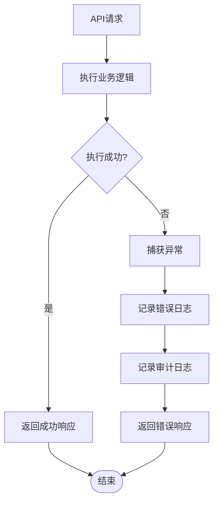

**图表来源**
- [marketplaceRoutes.js:172-200](file://server/src/routes/marketplaceRoutes.js#L172-L200)

#### 审计日志记录

系统记录所有重要的操作事件：

| 操作类型 | 记录内容 | 触发条件 |
|----------|----------|----------|
| 连接配置 | 连接创建/更新 | `MARKETPLACE_CONNECTION_UPSERT` |
| 库存同步 | 同步开始/完成 | `MARKETPLACE_INVENTORY_SYNC` |
| 订单同步 | 订单同步开始/完成 | `MARKETPLACE_ORDER_SYNC` |
| OAuth流程 | 授权开始/完成 | `MARKETPLACE_OAUTH_START`/`MARKETPLACE_OAUTH_CALLBACK` |
| 错误事件 | 平台错误记录 | `MARKETPLACE_ERROR_LOGS` |

**章节来源**
- [marketplaceRoutes.js:20-45](file://server/src/routes/marketplaceRoutes.js#L20-L45)
- [auditLog.js:1-38](file://server/src/utils/auditLog.js#L1-L38)

## 依赖关系分析

### 外部依赖

系统使用的主要外部依赖包括：

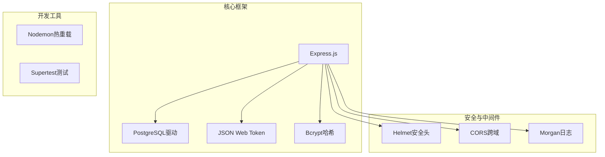

**图表来源**
- [package.json:15-29](file://server/package.json#L15-L29)

### 内部模块依赖

系统内部模块之间的依赖关系如下：

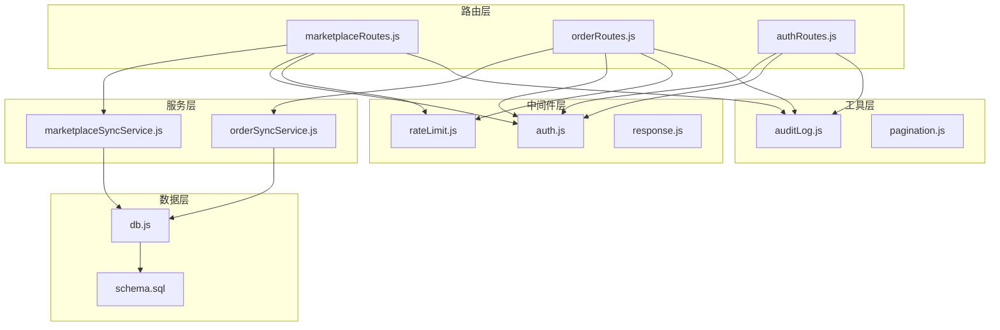

**图表来源**
- [app.js:1-67](file://server/src/app.js#L1-L67)

**章节来源**
- [package.json:15-29](file://server/package.json#L15-L29)
- [app.js:1-67](file://server/src/app.js#L1-L67)

## 性能考虑

### 限流机制

系统实现了多级别的限流机制来防止滥用和保护系统稳定性：

#### 速率限制策略

| 路由 | 限流窗口 | 最大请求数 | 用途 |
|------|----------|------------|------|
| marketplace-sync | 60秒 | 12次 | 库存同步 |
| marketplace-oauth | 60秒 | 20次 | OAuth流程 |
| auth-login | 60秒 | 10次 | 用户登录 |
| orders-sync | 60秒 | 12次 | 订单同步 |

#### 限流算法

系统使用基于内存的滑动窗口算法实现限流：

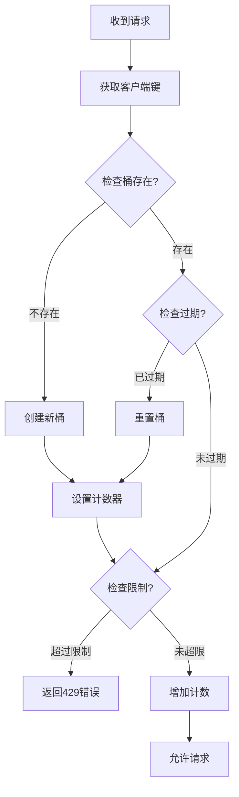

**图表来源**
- [rateLimit.js:1-40](file://server/src/middleware/rateLimit.js#L1-L40)

### 数据库优化

系统针对电商集成场景进行了专门的数据库优化：

#### 索引策略

| 表名 | 索引列 | 使用场景 |
|------|--------|----------|
| marketplace_orders | channel, order_status | 订单查询和筛选 |
| marketplace_inventory_snapshots | channel | 库存快照查询 |
| marketplace_oauth_states | channel, expires_at | OAuth状态管理 |
| marketplace_error_logs | channel, created_at | 错误日志查询 |
| audit_logs | user_id, created_at | 审计日志查询 |

#### 查询优化

系统使用批量操作和事务处理来提高数据库性能：

- 批量插入库存快照数据
- 使用事务确保数据一致性
- 异步处理大数据量操作

**章节来源**
- [rateLimit.js:1-40](file://server/src/middleware/rateLimit.js#L1-L40)
- [schema.sql:419-447](file://server/database/schema.sql#L419-L447)

## 故障排除指南

### 常见问题诊断

#### OAuth 授权失败

**症状**: OAuth回调返回错误状态

**可能原因**:
1. 状态令牌过期（默认10分钟）
2. 回调URL不匹配
3. 平台配置错误
4. 网络连接问题

**解决步骤**:
1. 检查状态令牌是否过期
2. 验证回调URL配置
3. 确认平台API凭证正确
4. 查看错误日志获取详细信息

#### 库存同步失败

**症状**: 库存数据无法同步到平台

**可能原因**:
1. API端点配置错误
2. 访问令牌失效
3. 平台API限制
4. 网络连接中断

**解决步骤**:
1. 验证API端点URL
2. 刷新访问令牌
3. 检查平台API限制
4. 查看同步日志

#### 订单同步异常

**症状**: 订单数据同步不完整或重复

**可能原因**:
1. 外部订单ID冲突
2. 数据标准化错误
3. 数据库约束冲突
4. 并发访问问题

**解决步骤**:
1. 检查外部订单ID唯一性
2. 验证数据标准化逻辑
3. 查看数据库约束错误
4. 实施并发控制

### 错误日志分析

系统提供了详细的错误日志分析功能：

#### 错误分类

| 错误类型 | 编码 | 描述 | 处理建议 |
|----------|------|------|----------|
| 连接错误 | `CONNECTION_TEST_FAILED` | 连接测试失败 | 检查网络和API凭证 |
| 同步错误 | `INVENTORY_SYNC_FAILED` | 库存同步失败 | 验证平台API响应 |
| OAuth错误 | `OAUTH_START_FAILED` | OAuth启动失败 | 检查状态令牌生成 |
| 权限错误 | `RATE_LIMITED` | 请求过于频繁 | 调整请求频率 |

#### 日志查询示例

```sql
-- 查询最近7天的错误日志
SELECT 
    channel,
    operation,
    error_code,
    message,
    created_at
FROM marketplace_error_logs 
WHERE created_at >= NOW() - INTERVAL '7 days'
ORDER BY created_at DESC;

-- 统计各平台错误数量
SELECT 
    channel,
    COUNT(*) as error_count,
    operation
FROM marketplace_error_logs 
GROUP BY channel, operation
ORDER BY channel, error_count DESC;
```

**章节来源**
- [marketplaceRoutes.js:556-593](file://server/src/routes/marketplaceRoutes.js#L556-L593)
- [schema.sql:184-194](file://server/database/schema.sql#L184-L194)

### 性能监控

系统提供了多种性能监控指标：

#### 关键性能指标

| 指标 | 描述 | 监控方法 |
|------|------|----------|
| 同步成功率 | 库存/订单同步成功比例 | 查询同步日志统计 |
| 响应时间 | API请求平均响应时间 | 应用日志分析 |
| 错误率 | 系统错误发生频率 | 错误日志统计 |
| 并发连接数 | 同时在线用户数 | 系统监控工具 |

#### 监控仪表板

前端提供了实时监控界面，显示：
- 各平台连接状态
- 最近同步时间
- 错误统计信息
- 系统健康状况

**章节来源**
- [MarketplaceCenterPage.vue:95-134](file://web/src/pages/MarketplaceCenterPage.vue#L95-L134)

## 结论

电商集成路由模块是一个功能完整、架构清晰的企业级电商集成解决方案。该模块成功实现了以下核心功能：

### 主要成就

1. **完整的平台支持**: 支持 Shopee、Lazada、TikTok 三大主流电商平台
2. **安全的认证机制**: 基于 JWT 的认证和 OAuth 2.0 授权流程
3. **高效的数据同步**: 实现库存、订单的实时同步和数据标准化
4. **完善的错误处理**: 提供详细的错误日志和审计追踪
5. **可扩展的架构**: 模块化设计便于功能扩展和维护

### 技术优势

- **现代化技术栈**: 使用 Express.js、PostgreSQL、Vue.js 等主流技术
- **企业级安全**: 包含 JWT 认证、CORS、Helmet 等安全措施
- **性能优化**: 实现限流、索引优化、批量操作等性能提升
- **可观测性**: 完善的日志记录和监控功能

### 未来发展方向

1. **平台扩展**: 支持更多电商平台的集成
2. **功能增强**: 添加物流跟踪、售后服务等功能
3. **性能优化**: 实现异步任务队列和缓存机制
4. **监控完善**: 增强实时监控和告警功能

该模块为企业提供了强大的电商集成能力，能够有效提升库存管理和订单处理效率，是现代电商运营不可或缺的技术基础设施。