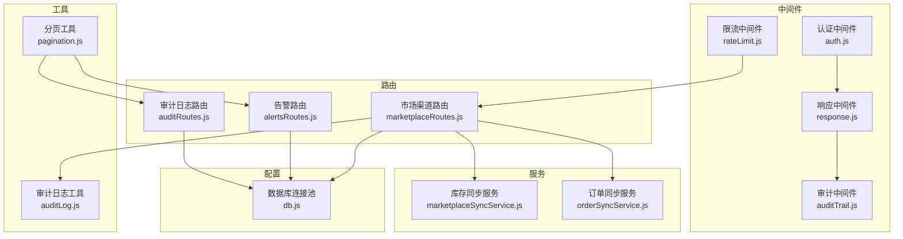
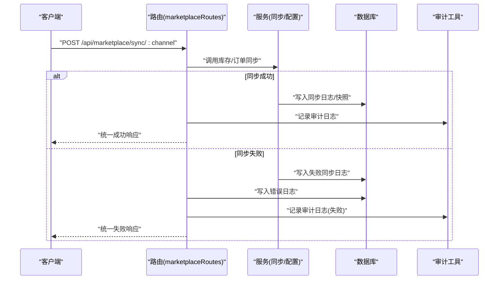
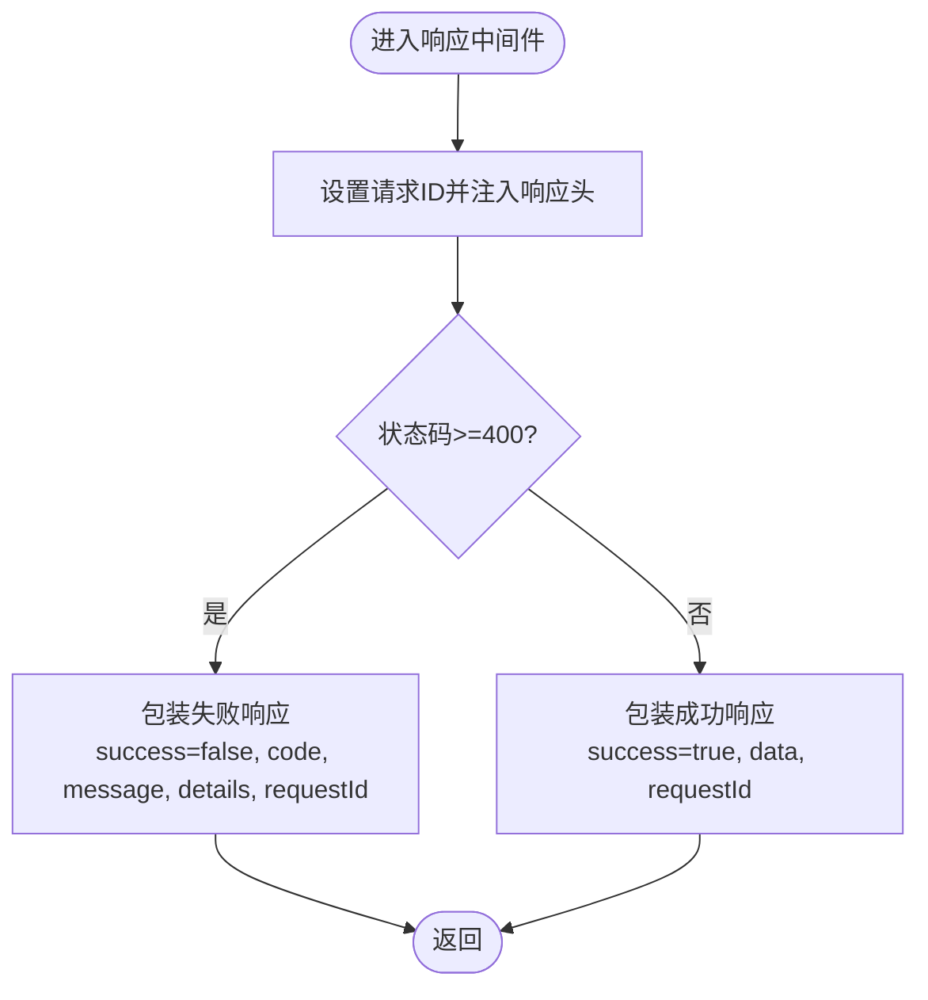
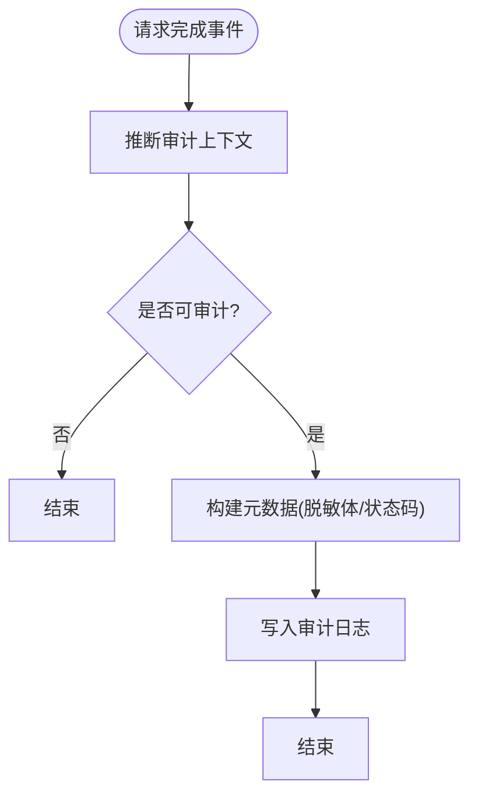
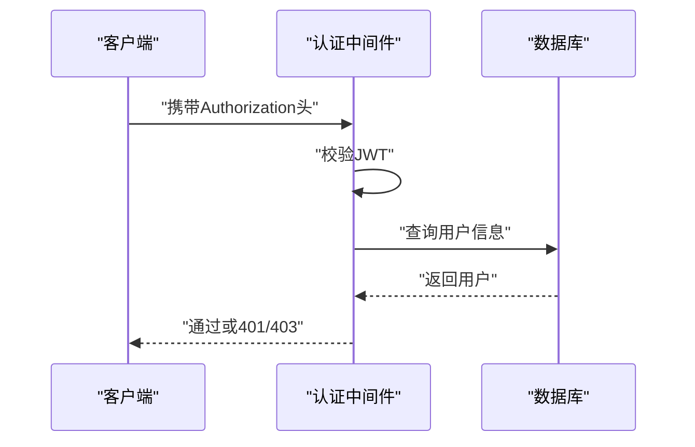
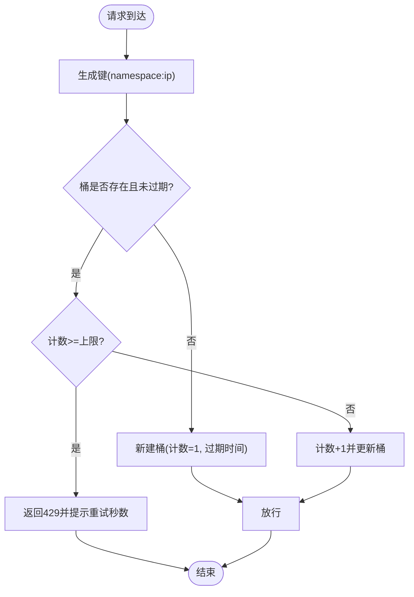
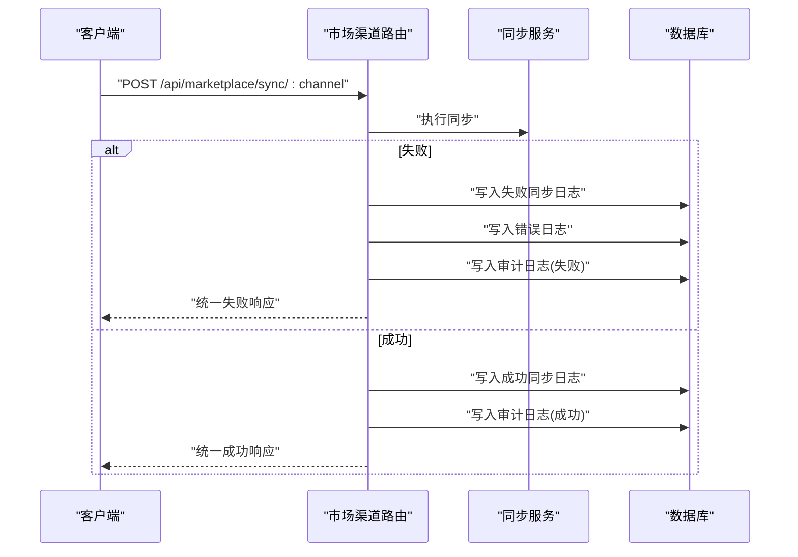
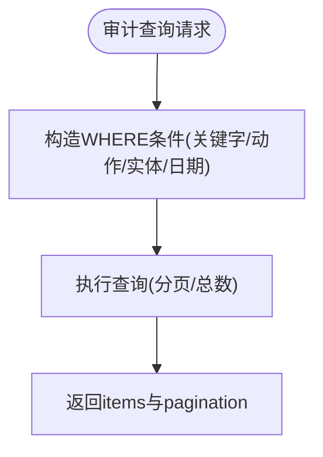
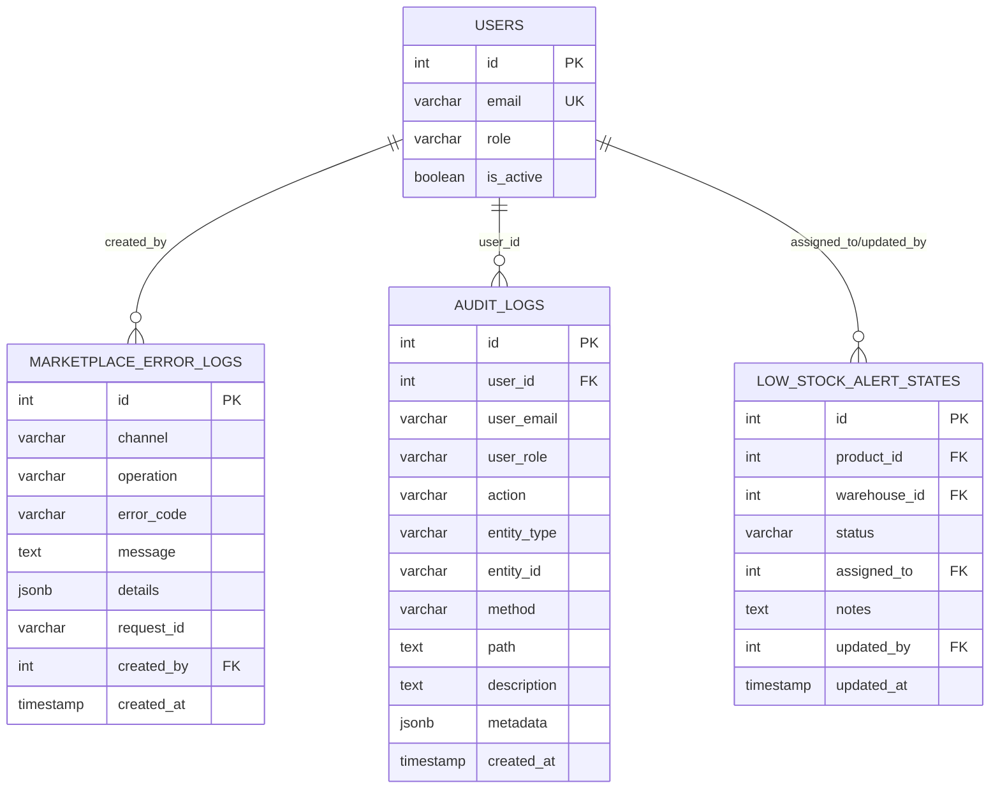
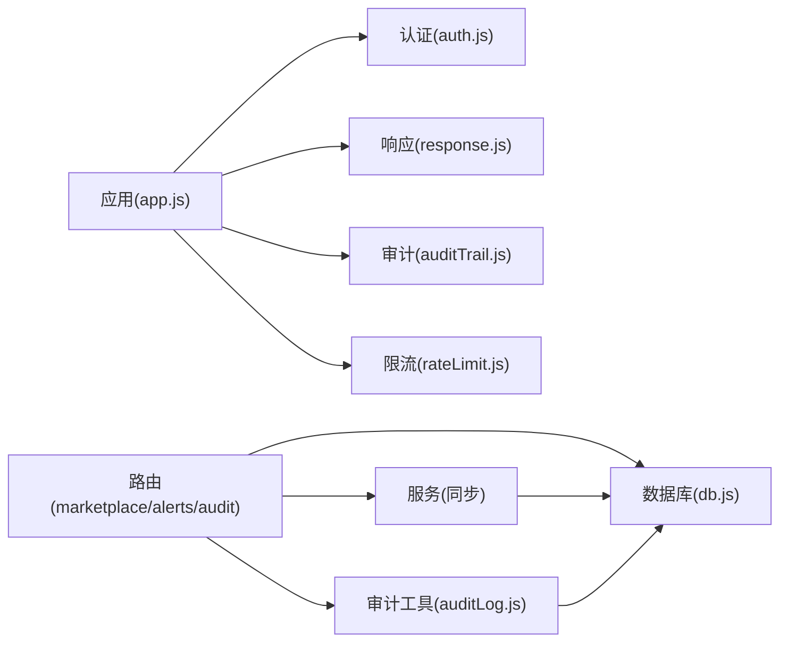

# 错误监控与日志

<cite>
**本文引用的文件**
- [server/src/app.js](file://server/src/app.js)
- [server/src/middleware/response.js](file://server/src/middleware/response.js)
- [server/src/middleware/auditTrail.js](file://server/src/middleware/auditTrail.js)
- [server/src/utils/auditLog.js](file://server/src/utils/auditLog.js)
- [server/src/middleware/auth.js](file://server/src/middleware/auth.js)
- [server/src/config/db.js](file://server/src/config/db.js)
- [server/src/services/marketplaceSyncService.js](file://server/src/services/marketplaceSyncService.js)
- [server/src/services/orderSyncService.js](file://server/src/services/orderSyncService.js)
- [server/src/routes/marketplaceRoutes.js](file://server/src/routes/marketplaceRoutes.js)
- [server/src/routes/alertsRoutes.js](file://server/src/routes/alertsRoutes.js)
- [server/src/routes/auditRoutes.js](file://server/src/routes/auditRoutes.js)
- [server/src/utils/pagination.js](file://server/src/utils/pagination.js)
- [server/src/middleware/rateLimit.js](file://server/src/middleware/rateLimit.js)
- [server/database/schema.sql](file://server/database/schema.sql)
- [server/package.json](file://server/package.json)
</cite>

## 目录
1. [简介](#简介)
2. [项目结构](#项目结构)
3. [核心组件](#核心组件)
4. [架构总览](#架构总览)
5. [详细组件分析](#详细组件分析)
6. [依赖关系分析](#依赖关系分析)
7. [性能考量](#性能考量)
8. [故障排查指南](#故障排查指南)
9. [结论](#结论)
10. [附录](#附录)

## 简介
本文件面向电商平台的错误监控与日志系统，聚焦以下目标：
- 错误日志记录、错误分类与统计
- 同步错误、连接错误与认证错误的差异化处理
- 错误日志的查询、过滤与分析能力
- 错误告警机制、错误恢复策略与故障诊断工具
- 错误监控最佳实践与运维建议

系统通过统一响应中间件、审计日志、市场渠道同步服务与专用错误表，形成“认证鉴权—请求处理—错误记录—审计追踪—查询统计”的闭环。

## 项目结构
后端采用 Express + PostgreSQL 架构，核心模块包括：
- 中间件层：认证、响应格式化、审计、限流
- 路由层：市场渠道对接、告警、审计日志、通用查询
- 服务层：市场库存/订单同步、数据归一化
- 工具层：分页、成本计算等
- 数据层：PostgreSQL 表结构与索引

图表来源
- [server/src/app.js:1-67](file://server/src/app.js#L1-L67)
- [server/src/middleware/auth.js:1-46](file://server/src/middleware/auth.js#L1-L46)
- [server/src/middleware/response.js:1-62](file://server/src/middleware/response.js#L1-L62)
- [server/src/middleware/auditTrail.js:1-84](file://server/src/middleware/auditTrail.js#L1-L84)
- [server/src/middleware/rateLimit.js:1-40](file://server/src/middleware/rateLimit.js#L1-L40)
- [server/src/routes/marketplaceRoutes.js:1-641](file://server/src/routes/marketplaceRoutes.js#L1-L641)
- [server/src/routes/alertsRoutes.js:1-290](file://server/src/routes/alertsRoutes.js#L1-L290)
- [server/src/routes/auditRoutes.js:1-110](file://server/src/routes/auditRoutes.js#L1-L110)
- [server/src/services/marketplaceSyncService.js:1-146](file://server/src/services/marketplaceSyncService.js#L1-L146)
- [server/src/services/orderSyncService.js:1-119](file://server/src/services/orderSyncService.js#L1-L119)
- [server/src/utils/auditLog.js:1-38](file://server/src/utils/auditLog.js#L1-L38)
- [server/src/utils/pagination.js:1-28](file://server/src/utils/pagination.js#L1-L28)
- [server/src/config/db.js:1-25](file://server/src/config/db.js#L1-L25)

章节来源
- [server/src/app.js:1-67](file://server/src/app.js#L1-L67)
- [server/src/config/db.js:1-25](file://server/src/config/db.js#L1-L25)

## 核心组件
- 统一响应中间件：为所有响应注入统一结构（success/code/message/details/requestId），并在错误时自动包装失败响应，屏蔽内部堆栈细节。
- 审计中间件：在请求完成后记录审计日志，包含操作者、实体类型/ID、HTTP 方法/路径、元数据（含状态码与脱敏后的请求体）。
- 认证中间件：基于 JWT 验证与用户信息注入；配合角色授权中间件限制敏感操作。
- 限流中间件：按客户端 IP 与命名空间进行速率限制，防止滥用。
- 市场渠道路由：封装库存/订单同步、OAuth 流程、连接测试、错误日志与概览统计；对异常进行统一记录与审计。
- 错误日志表：独立存储市场渠道错误，支持按渠道、操作、时间窗口查询与统计。
- 分页工具：统一分页参数与返回结构，便于前端表格复用。

章节来源
- [server/src/middleware/response.js:1-62](file://server/src/middleware/response.js#L1-L62)
- [server/src/middleware/auditTrail.js:1-84](file://server/src/middleware/auditTrail.js#L1-L84)
- [server/src/utils/auditLog.js:1-38](file://server/src/utils/auditLog.js#L1-L38)
- [server/src/middleware/auth.js:1-46](file://server/src/middleware/auth.js#L1-L46)
- [server/src/middleware/rateLimit.js:1-40](file://server/src/middleware/rateLimit.js#L1-L40)
- [server/src/routes/marketplaceRoutes.js:1-641](file://server/src/routes/marketplaceRoutes.js#L1-L641)
- [server/src/database/schema.sql:184-194](file://server/database/schema.sql#L184-L194)
- [server/src/utils/pagination.js:1-28](file://server/src/utils/pagination.js#L1-L28)

## 架构总览
系统围绕“请求—处理—记录—审计—查询”形成闭环。关键流程如下：
- 请求进入后经认证与限流，统一响应中间件负责输出结构化结果
- 成功或失败均通过审计中间件记录审计日志
- 市场渠道同步过程中出现的异常被转换为错误日志并写入专用表
- 前端通过审计与错误路由进行查询与统计

图表来源
- [server/src/routes/marketplaceRoutes.js:144-202](file://server/src/routes/marketplaceRoutes.js#L144-L202)
- [server/src/services/marketplaceSyncService.js:100-140](file://server/src/services/marketplaceSyncService.js#L100-L140)
- [server/src/services/orderSyncService.js:19-114](file://server/src/services/orderSyncService.js#L19-L114)
- [server/src/utils/auditLog.js:1-38](file://server/src/utils/auditLog.js#L1-L38)
- [server/src/config/db.js:1-25](file://server/src/config/db.js#L1-L25)

## 详细组件分析

### 统一响应中间件（responseMiddleware）
- 功能要点
  - 注入 x-request-id 并在响应中携带
  - 自动将非 2xx 的 payload 包装为失败响应结构
  - 提供 res.success/res.fail 辅助方法，确保前后端一致的响应契约
- 错误处理
  - 对 res.fail 已存在时的保护，避免重复包装
  - 未使用 res.fail 时，回退为标准 JSON 结构

图表来源
- [server/src/middleware/response.js:3-57](file://server/src/middleware/response.js#L3-L57)

章节来源
- [server/src/middleware/response.js:1-62](file://server/src/middleware/response.js#L1-L62)

### 审计中间件与审计日志工具（auditTrail + auditLog）
- 审计上下文推断
  - 登录成功场景识别
  - 其他写操作根据路径推断实体类型/ID/动作
- 审计记录内容
  - 操作者信息（用户ID/邮箱/角色）
  - 实体类型/ID、HTTP 方法/路径、描述
  - 元数据：脱敏后的请求体、响应状态码
- 异常处理
  - 写入审计日志失败仅记录控制台错误，不阻断业务

图表来源
- [server/src/middleware/auditTrail.js:47-79](file://server/src/middleware/auditTrail.js#L47-L79)
- [server/src/utils/auditLog.js:1-38](file://server/src/utils/auditLog.js#L1-L38)

章节来源
- [server/src/middleware/auditTrail.js:1-84](file://server/src/middleware/auditTrail.js#L1-L84)
- [server/src/utils/auditLog.js:1-38](file://server/src/utils/auditLog.js#L1-L38)

### 认证与角色授权（auth）
- 认证流程
  - Bearer Token 校验，解析用户信息并注入 req.user
  - 用户可用性检查（激活状态）
- 授权流程
  - 角色白名单校验，拒绝无权限访问

图表来源
- [server/src/middleware/auth.js:5-29](file://server/src/middleware/auth.js#L5-L29)

章节来源
- [server/src/middleware/auth.js:1-46](file://server/src/middleware/auth.js#L1-L46)

### 限流中间件（rateLimit）
- 以命名空间区分不同路由的限流策略
- 基于客户端 IP 与时间窗口计数，超过阈值返回 429 并提示重试秒数

图表来源
- [server/src/middleware/rateLimit.js:9-35](file://server/src/middleware/rateLimit.js#L9-L35)

章节来源
- [server/src/middleware/rateLimit.js:1-40](file://server/src/middleware/rateLimit.js#L1-L40)

### 市场渠道路由与错误日志（marketplaceRoutes）
- 支持渠道：Shopee/Lazada/TikTok
- 关键能力
  - 连接配置维护与测试
  - OAuth 启动/回调（含状态校验与过期控制）
  - 库存/订单同步（成功写入同步日志，失败写入错误日志并审计）
  - 错误日志查询与概览统计（最近7天错误计数）
- 错误分类
  - 连接错误：连接测试失败、通道配置缺失
  - 同步错误：库存/订单同步失败
  - 认证错误：OAuth 回调错误、无效状态、过期状态
- 错误记录字段
  - 渠道、操作、错误码、消息、详情(JSONB)、请求ID、操作人

图表来源
- [server/src/routes/marketplaceRoutes.js:144-202](file://server/src/routes/marketplaceRoutes.js#L144-L202)
- [server/src/services/marketplaceSyncService.js:100-140](file://server/src/services/marketplaceSyncService.js#L100-L140)
- [server/src/services/orderSyncService.js:19-114](file://server/src/services/orderSyncService.js#L19-L114)

章节来源
- [server/src/routes/marketplaceRoutes.js:1-641](file://server/src/routes/marketplaceRoutes.js#L1-L641)
- [server/src/database/schema.sql:184-194](file://server/database/schema.sql#L184-L194)

### 告警路由与审计日志查询（alertsRoutes + auditRoutes）
- 告警路由
  - 低库存告警列表查询（支持搜索、仓库筛选、状态筛选、分页）
  - 告警状态更新与批量更新（含角色校验）
  - 审计上下文注入用于记录变更
- 审计日志路由
  - 支持按关键字、动作、实体类型、时间范围查询
  - 支持全量导出与分页

图表来源
- [server/src/routes/auditRoutes.js:15-107](file://server/src/routes/auditRoutes.js#L15-L107)
- [server/src/routes/alertsRoutes.js:80-197](file://server/src/routes/alertsRoutes.js#L80-L197)

章节来源
- [server/src/routes/alertsRoutes.js:1-290](file://server/src/routes/alertsRoutes.js#L1-L290)
- [server/src/routes/auditRoutes.js:1-110](file://server/src/routes/auditRoutes.js#L1-L110)

### 数据模型与索引（schema）
- 错误日志表 marketplace_error_logs：按渠道、创建时间建立索引，支持高效查询
- 审计日志表 audit_logs：按用户、创建时间建立索引，支持审计检索
- 同步日志表 marketplace_sync_logs：记录每次同步结果，便于回溯
- 低库存告警表 low_stock_alert_states：支持状态与分配人员查询

图表来源
- [server/database/schema.sql:184-194](file://server/database/schema.sql#L184-L194)
- [server/database/schema.sql:275-288](file://server/database/schema.sql#L275-L288)
- [server/database/schema.sql:290-300](file://server/database/schema.sql#L290-L300)

章节来源
- [server/database/schema.sql:1-447](file://server/database/schema.sql#L1-L447)

## 依赖关系分析
- 组件耦合
  - 路由依赖中间件（认证/响应/审计/限流）、服务与数据库
  - 服务依赖数据库与外部渠道接口
  - 审计工具被路由与服务复用
- 外部依赖
  - Express、JWT、PostgreSQL、Morgan、Helmet、CORS
- 潜在循环依赖
  - 当前结构清晰，未见循环导入

图表来源
- [server/src/app.js:1-67](file://server/src/app.js#L1-L67)
- [server/src/middleware/auth.js:1-46](file://server/src/middleware/auth.js#L1-L46)
- [server/src/middleware/response.js:1-62](file://server/src/middleware/response.js#L1-L62)
- [server/src/middleware/auditTrail.js:1-84](file://server/src/middleware/auditTrail.js#L1-L84)
- [server/src/middleware/rateLimit.js:1-40](file://server/src/middleware/rateLimit.js#L1-L40)
- [server/src/routes/marketplaceRoutes.js:1-641](file://server/src/routes/marketplaceRoutes.js#L1-L641)
- [server/src/routes/alertsRoutes.js:1-290](file://server/src/routes/alertsRoutes.js#L1-L290)
- [server/src/routes/auditRoutes.js:1-110](file://server/src/routes/auditRoutes.js#L1-L110)
- [server/src/services/marketplaceSyncService.js:1-146](file://server/src/services/marketplaceSyncService.js#L1-L146)
- [server/src/services/orderSyncService.js:1-119](file://server/src/services/orderSyncService.js#L1-L119)
- [server/src/utils/auditLog.js:1-38](file://server/src/utils/auditLog.js#L1-L38)
- [server/src/config/db.js:1-25](file://server/src/config/db.js#L1-L25)

章节来源
- [server/src/app.js:1-67](file://server/src/app.js#L1-L67)
- [server/src/package.json:15-29](file://server/package.json#L15-L29)

## 性能考量
- 查询优化
  - 使用索引覆盖常见查询条件（渠道、创建时间、实体类型、状态）
  - 分页参数统一，避免超大偏移
- 写入优化
  - 批量写入/去重插入（如库存快照、订单项）
  - 审计与错误日志写入采用异步，不影响主流程
- 连接与超时
  - 数据库连接池与 SSL 判定，合理设置连接超时
- 限流策略
  - 不同路由命名空间独立限流，避免相互影响

章节来源
- [server/database/schema.sql:419-446](file://server/database/schema.sql#L419-L446)
- [server/src/config/db.js:13-19](file://server/src/config/db.js#L13-L19)
- [server/src/utils/pagination.js:2-12](file://server/src/utils/pagination.js#L2-L12)
- [server/src/middleware/rateLimit.js:9-35](file://server/src/middleware/rateLimit.js#L9-L35)

## 故障排查指南
- 常见问题定位
  - 认证失败：检查 Authorization 头、JWT 是否过期、用户是否激活
  - 限流触发：查看响应头 retry-after，调整客户端重试策略
  - 审计缺失：确认 finish 事件是否触发，审计工具异常是否被吞掉
  - 错误日志为空：确认查询条件（渠道/时间范围），检查索引是否生效
- 诊断步骤
  - 通过审计日志路由按时间/动作/实体检索
  - 通过错误日志路由按渠道/操作/错误码过滤
  - 查看同步日志与快照，核对最近一次成功/失败记录
- 恢复策略
  - 对于连接错误：重新配置渠道连接，执行连接测试
  - 对于同步错误：重试单次同步，必要时人工介入修正数据
  - 对于认证错误：检查 OAuth 状态有效性与过期时间

章节来源
- [server/src/middleware/auth.js:5-29](file://server/src/middleware/auth.js#L5-L29)
- [server/src/middleware/rateLimit.js:23-29](file://server/src/middleware/rateLimit.js#L23-L29)
- [server/src/middleware/auditTrail.js:73-76](file://server/src/middleware/auditTrail.js#L73-L76)
- [server/src/routes/marketplaceRoutes.js:556-593](file://server/src/routes/marketplaceRoutes.js#L556-L593)
- [server/src/routes/auditRoutes.js:15-107](file://server/src/routes/auditRoutes.js#L15-L107)

## 结论
本系统通过统一响应、审计与错误日志三件套，实现了对电商市场渠道同步的可观测性与可追溯性。结合限流与角色授权，既保障了安全性也提升了稳定性。建议持续完善告警规则、扩展错误分类维度，并定期审查索引与查询计划以维持高并发下的性能表现。

## 附录
- 最佳实践
  - 统一使用 res.success/res.fail 输出结构化响应
  - 对敏感字段在审计元数据中进行脱敏
  - 为关键路由配置独立限流策略
  - 定期清理旧审计与错误日志，控制表规模
- 运维建议
  - 监控错误日志增长趋势与渠道失败率
  - 建立自动化告警（如7天内错误数阈值）
  - 对连接测试与同步任务进行周期性巡检
  - 保留历史快照以便回溯与对账