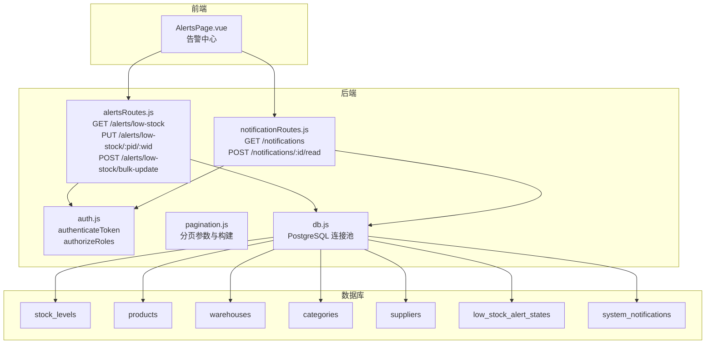
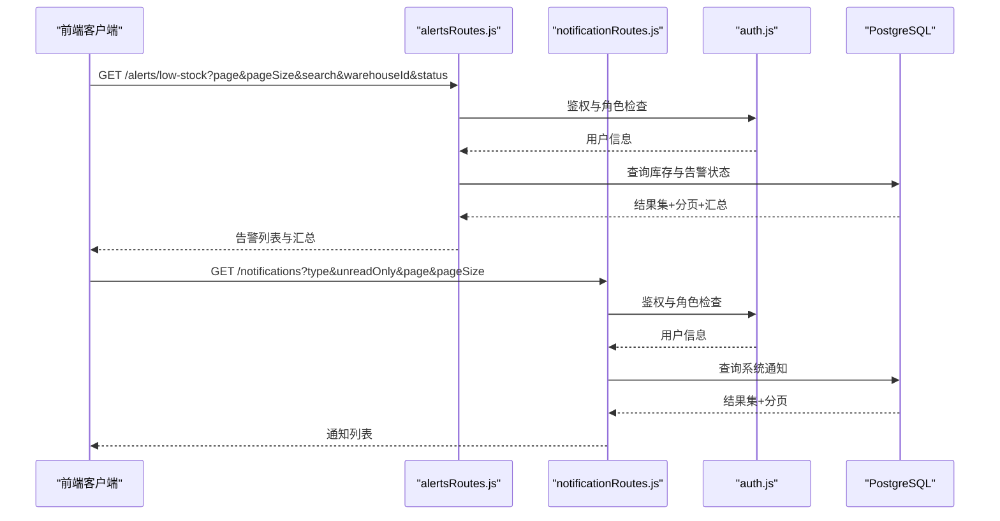
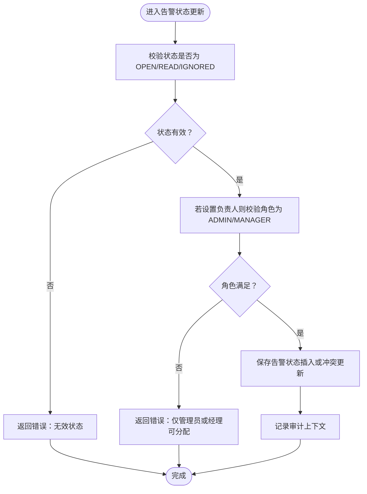
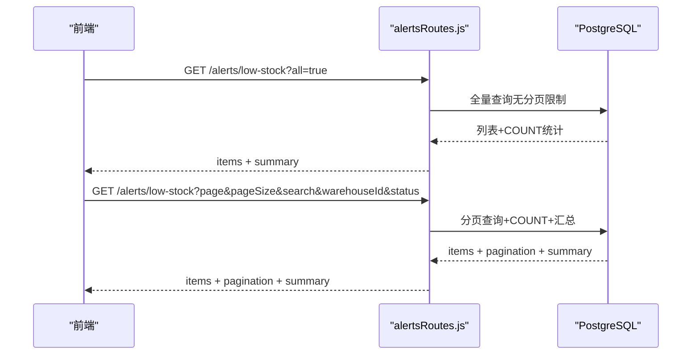
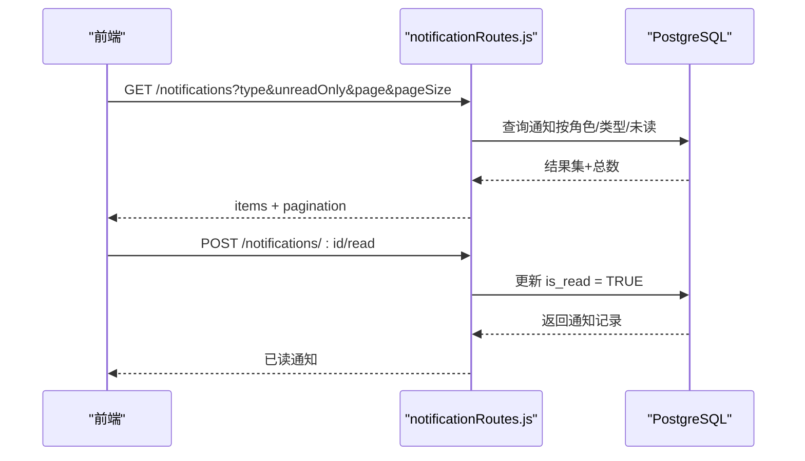
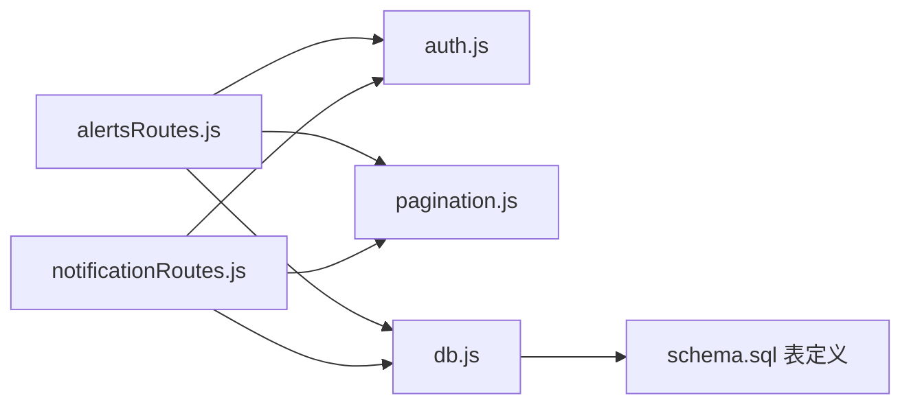

# 告警通知管理

<cite>
**本文引用的文件**
- [alertsRoutes.js](file://server/src/routes/alertsRoutes.js)
- [notificationRoutes.js](file://server/src/routes/notificationRoutes.js)
- [auth.js](file://server/src/middleware/auth.js)
- [pagination.js](file://server/src/utils/pagination.js)
- [schema.sql](file://server/database/schema.sql)
- [AlertsPage.vue](file://web/src/pages/AlertsPage.vue)
- [db.js](file://server/src/config/db.js)
- [POSTMAN_BACKEND_GUIDE.md](file://POSTMAN_BACKEND_GUIDE.md)
- [integration.test.js](file://server/test/integration.test.js)
</cite>

## 目录
1. [简介](#简介)
2. [项目结构](#项目结构)
3. [核心组件](#核心组件)
4. [架构总览](#架构总览)
5. [详细组件分析](#详细组件分析)
6. [依赖关系分析](#依赖关系分析)
7. [性能考量](#性能考量)
8. [故障排除指南](#故障排除指南)
9. [结论](#结论)
10. [附录](#附录)

## 简介
本文件面向“告警通知管理”功能，聚焦低库存告警的触发机制、状态管理与分配流程，详述告警状态（OPEN、READ、IGNORED）的含义与转换规则；说明批量与单个更新的 API 接口、参数校验与权限控制；解释告警查询的搜索条件、分页机制与汇总统计；并提供通知配置、通知渠道与消息模板管理建议，以及最佳实践与故障排除指南。

## 项目结构
告警通知管理涉及后端路由、中间件、数据库模式与前端页面四个层面：
- 后端路由层：告警查询与更新、通知查询与标记已读
- 中间件层：鉴权与角色授权
- 数据库层：库存、产品、仓库、低库存告警状态、系统通知等表
- 前端页面：告警中心、通知中心与批量操作界面

图表来源
- [alertsRoutes.js:1-290](file://server/src/routes/alertsRoutes.js#L1-L290)
- [notificationRoutes.js:1-86](file://server/src/routes/notificationRoutes.js#L1-L86)
- [auth.js:1-46](file://server/src/middleware/auth.js#L1-L46)
- [pagination.js:1-28](file://server/src/utils/pagination.js#L1-L28)
- [db.js:1-25](file://server/src/config/db.js#L1-L25)
- [schema.sql:125-388](file://server/database/schema.sql#L125-L388)

章节来源
- [alertsRoutes.js:1-290](file://server/src/routes/alertsRoutes.js#L1-L290)
- [notificationRoutes.js:1-86](file://server/src/routes/notificationRoutes.js#L1-L86)
- [auth.js:1-46](file://server/src/middleware/auth.js#L1-L46)
- [pagination.js:1-28](file://server/src/utils/pagination.js#L1-L28)
- [schema.sql:125-388](file://server/database/schema.sql#L125-L388)

## 核心组件
- 低库存告警查询与状态管理
  - 查询接口：支持按产品名/SKU/仓库/品类模糊搜索、按仓库过滤、按状态过滤（OPEN/READ/IGNORED），支持分页与一次性加载全部数据
  - 状态管理：单个更新与批量更新，支持设置状态、负责人与备注
- 通知中心
  - 查询系统通知，支持类型过滤与仅未读过滤
  - 标记通知为已读，并记录审计日志
- 权限控制
  - 所有告警与通知接口均需携带 Bearer Token
  - 仅管理员或经理可进行告警负责人分配
- 分页与汇总
  - 统一分页参数与分页结构
  - 提供告警总数、缺货数、受影响商品数等汇总统计

章节来源
- [alertsRoutes.js:80-197](file://server/src/routes/alertsRoutes.js#L80-L197)
- [alertsRoutes.js:199-287](file://server/src/routes/alertsRoutes.js#L199-L287)
- [notificationRoutes.js:15-83](file://server/src/routes/notificationRoutes.js#L15-L83)
- [auth.js:5-29](file://server/src/middleware/auth.js#L5-L29)
- [pagination.js:2-22](file://server/src/utils/pagination.js#L2-L22)

## 架构总览
告警通知管理采用前后端分离架构：前端通过 API 获取告警列表与通知，后端基于 PostgreSQL 提供数据持久化与查询能力，中间件负责鉴权与角色授权。

图表来源
- [alertsRoutes.js:80-197](file://server/src/routes/alertsRoutes.js#L80-L197)
- [notificationRoutes.js:15-54](file://server/src/routes/notificationRoutes.js#L15-L54)
- [auth.js:5-29](file://server/src/middleware/auth.js#L5-L29)
- [db.js:13-24](file://server/src/config/db.js#L13-L24)

## 详细组件分析

### 低库存告警触发机制与状态管理
- 触发条件
  - 当某产品在某仓库的实时库存小于等于其“补货线（reorder_level）”时，即触发低库存告警
  - 查询接口通过联结 stock_levels、products、warehouses 等表，结合模糊搜索与过滤条件生成告警集合
- 状态管理
  - 状态枚举：OPEN（待处理）、READ（已阅）、IGNORED（忽略）
  - 单个更新：PUT /alerts/low-stock/:productId/:warehouseId
  - 批量更新：POST /alerts/low-stock/bulk-update，支持为每条记录覆盖状态/负责人/备注
- 分配流程
  - 仅管理员或经理可分配负责人（assigned_to）
  - 更新时同时记录 updated_by 与 updated_at，便于审计追踪

图表来源
- [alertsRoutes.js:199-232](file://server/src/routes/alertsRoutes.js#L199-L232)
- [alertsRoutes.js:234-287](file://server/src/routes/alertsRoutes.js#L234-L287)
- [auth.js:32-40](file://server/src/middleware/auth.js#L32-L40)

章节来源
- [alertsRoutes.js:42-78](file://server/src/routes/alertsRoutes.js#L42-L78)
- [alertsRoutes.js:14-40](file://server/src/routes/alertsRoutes.js#L14-L40)
- [alertsRoutes.js:199-232](file://server/src/routes/alertsRoutes.js#L199-L232)
- [alertsRoutes.js:234-287](file://server/src/routes/alertsRoutes.js#L234-L287)
- [schema.sql:290-300](file://server/database/schema.sql#L290-L300)

### 告警查询与汇总统计
- 查询条件
  - 搜索：支持产品名称、SKU、仓库名称、品类名称的模糊匹配
  - 仓库过滤：按仓库 ID 过滤
  - 状态过滤：all 或指定 OPEN/READ/IGNORED
  - 加载策略：支持 all=true 一次性返回全部数据，否则分页查询
- 分页机制
  - 统一分页参数：page（默认1，最小1）、pageSize（默认10，范围1~100）
  - 统一分页结构：total、page、pageSize、totalPages
- 汇总统计
  - 总告警数、缺货数（库存为0）、受影响商品数（去重）

图表来源
- [alertsRoutes.js:80-197](file://server/src/routes/alertsRoutes.js#L80-L197)
- [pagination.js:2-22](file://server/src/utils/pagination.js#L2-L22)

章节来源
- [alertsRoutes.js:80-197](file://server/src/routes/alertsRoutes.js#L80-L197)
- [pagination.js:2-22](file://server/src/utils/pagination.js#L2-L22)

### 通知查询与标记已读
- 通知查询
  - 支持按通知类型过滤与仅未读过滤
  - 分页查询，返回 items 与 pagination
- 标记已读
  - POST /notifications/:id/read 将通知标记为已读
  - 若通知不存在，返回 404
  - 写入审计日志

图表来源
- [notificationRoutes.js:15-54](file://server/src/routes/notificationRoutes.js#L15-L54)
- [notificationRoutes.js:56-83](file://server/src/routes/notificationRoutes.js#L56-L83)

章节来源
- [notificationRoutes.js:15-83](file://server/src/routes/notificationRoutes.js#L15-L83)

### 权限控制与审计
- 鉴权中间件
  - 所有告警与通知接口均使用 authenticateToken
  - 通知接口进一步使用 authorizeRoles('ADMIN','MANAGER','STAFF')
- 审计上下文
  - 告警批量更新与单个更新、通知标记已读均记录审计上下文（动作、实体类型、实体ID、描述）

章节来源
- [auth.js:5-29](file://server/src/middleware/auth.js#L5-L29)
- [auth.js:32-40](file://server/src/middleware/auth.js#L32-L40)
- [alertsRoutes.js:221-228](file://server/src/routes/alertsRoutes.js#L221-L228)
- [alertsRoutes.js:274-279](file://server/src/routes/alertsRoutes.js#L274-L279)
- [notificationRoutes.js:72-77](file://server/src/routes/notificationRoutes.js#L72-L77)

### 前端交互与批量操作
- 前端页面
  - AlertsPage.vue 提供告警中心与通知中心
  - 支持筛选（搜索、仓库、状态）、分页、批量选择与批量更新
  - 支持“仅当前筛选结果全选”与“撤销批量操作”
- 批量操作
  - 通过 POST /alerts/low-stock/bulk-update 发送 items 数组
  - 支持统一设置状态/负责人/备注，或为单项单独覆盖

章节来源
- [AlertsPage.vue:113-135](file://web/src/pages/AlertsPage.vue#L113-L135)
- [AlertsPage.vue:171-182](file://web/src/pages/AlertsPage.vue#L171-L182)
- [AlertsPage.vue:275-307](file://web/src/pages/AlertsPage.vue#L275-L307)

## 依赖关系分析
- 组件耦合
  - alertsRoutes 与 notificationRoutes 均依赖鉴权中间件与分页工具
  - 查询接口依赖数据库连接池与 schema 中的多张表
- 外部依赖
  - PostgreSQL 连接池（Pool）
  - JWT 鉴权
- 可能的循环依赖
  - 未见路由之间直接相互依赖，整体结构清晰

图表来源
- [alertsRoutes.js:1-9](file://server/src/routes/alertsRoutes.js#L1-L9)
- [notificationRoutes.js:1-9](file://server/src/routes/notificationRoutes.js#L1-L9)
- [auth.js:1-9](file://server/src/middleware/auth.js#L1-L9)
- [pagination.js:1-9](file://server/src/utils/pagination.js#L1-L9)
- [db.js:1-9](file://server/src/config/db.js#L1-L9)
- [schema.sql:125-388](file://server/database/schema.sql#L125-L388)

章节来源
- [alertsRoutes.js:1-9](file://server/src/routes/alertsRoutes.js#L1-L9)
- [notificationRoutes.js:1-9](file://server/src/routes/notificationRoutes.js#L1-L9)
- [db.js:13-24](file://server/src/config/db.js#L13-L24)
- [schema.sql:125-388](file://server/database/schema.sql#L125-L388)

## 性能考量
- 查询优化
  - 使用索引：低库存状态表按 status 建有索引；库存表按 product_id、warehouse_id 建有索引；通知表按创建时间与类型建有索引
  - 分页与一次性加载：分页查询避免大结果集传输；全量加载仅在 all=true 且前端明确需要时使用
- 并发与一致性
  - 告警状态更新使用 ON CONFLICT (product_id, warehouse_id) DO UPDATE，确保并发安全
- 建议
  - 对高频搜索字段（如产品名、SKU、仓库名）保持索引
  - 控制 pageSize 上限，避免超大分页
  - 对通知查询增加类型与未读过滤，减少扫描范围

章节来源
- [schema.sql:415-442](file://server/database/schema.sql#L415-L442)
- [alertsRoutes.js:27-37](file://server/src/routes/alertsRoutes.js#L27-L37)
- [pagination.js:4-5](file://server/src/utils/pagination.js#L4-L5)

## 故障排除指南
- 常见错误与排查
  - 401 未认证：确认 Authorization 头中携带有效的 Bearer Token
  - 403 权限不足：负责人分配仅允许 ADMIN/MANAGER，确认当前用户角色
  - 400 参数错误：状态必须为 OPEN/READ/IGNORED；批量更新 items 必须为数组且非空
  - 404 通知不存在：确认通知 ID 是否正确
- 审计与回溯
  - 所有关键操作均写入审计日志，可通过审计日志定位操作人、时间与实体
- 测试参考
  - 集成测试覆盖了通知查询与成本变更通知生成，可作为接口行为参考

章节来源
- [alertsRoutes.js:203-209](file://server/src/routes/alertsRoutes.js#L203-L209)
- [alertsRoutes.js:238-254](file://server/src/routes/alertsRoutes.js#L238-L254)
- [notificationRoutes.js:68-70](file://server/src/routes/notificationRoutes.js#L68-L70)
- [integration.test.js:147-152](file://server/test/integration.test.js#L147-L152)

## 结论
告警通知管理以低库存为核心，围绕“触发—查询—状态管理—分配—通知—审计”的完整闭环设计。后端通过严格的参数校验与权限控制保障安全性，前端提供灵活的筛选、分页与批量操作体验。数据库层面通过索引与分页策略提升性能。建议在生产环境中持续监控告警与通知的查询性能，并根据业务增长动态调整索引与分页策略。

## 附录

### API 接口定义与示例

- 获取低库存告警列表
  - 方法与路径：GET /alerts/low-stock
  - 查询参数：
    - search：搜索关键词（产品名/SKU/仓库/品类）
    - warehouseId：仓库 ID（可选）
    - status：all 或 OPEN/READ/IGNORED
    - page/pageSize：分页参数
    - all：true 时一次性返回全部数据
  - 返回：
    - items：告警项列表
    - pagination：分页信息
    - summary：汇总统计（总告警数、缺货数、受影响商品数）

- 单个更新低库存告警状态
  - 方法与路径：PUT /alerts/low-stock/:productId/:warehouseId
  - 请求体：
    - status：OPEN/READ/IGNORED
    - assignedTo：负责人用户 ID（仅 ADMIN/MANAGER 可设置）
    - notes：备注
  - 返回：更新后的告警状态记录

- 批量更新低库存告警状态
  - 方法与路径：POST /alerts/low-stock/bulk-update
  - 请求体：
    - items：数组，每项包含 productId、warehouseId，可选 status/assignedTo/notes
    - status/assignedTo/notes：统一默认值（若单项未提供则使用此处值）
  - 返回：更新成功的数量

- 获取系统通知列表
  - 方法与路径：GET /notifications
  - 查询参数：
    - type：通知类型（可选）
    - unreadOnly：仅未读（true/false）
    - page/pageSize：分页参数
  - 返回：
    - items：通知列表
    - pagination：分页信息

- 标记通知为已读
  - 方法与路径：POST /notifications/:id/read
  - 返回：已读通知记录

章节来源
- [POSTMAN_BACKEND_GUIDE.md:235-270](file://POSTMAN_BACKEND_GUIDE.md#L235-L270)
- [alertsRoutes.js:80-197](file://server/src/routes/alertsRoutes.js#L80-L197)
- [alertsRoutes.js:199-287](file://server/src/routes/alertsRoutes.js#L199-L287)
- [notificationRoutes.js:15-83](file://server/src/routes/notificationRoutes.js#L15-L83)

### 告警状态与转换规则
- OPEN：初始状态，库存低于补货线时自动产生
- READ：已阅状态，通常由处理人员查看后设置
- IGNORED：忽略状态，用于标记短期内无需处理的告警

章节来源
- [schema.sql:294-294](file://server/database/schema.sql#L294-L294)
- [alertsRoutes.js:201-201](file://server/src/routes/alertsRoutes.js#L201-L201)

### 通知配置、渠道与模板管理建议
- 通知类型
  - PRICE_CHANGE：成本价格变动通知
- 存储结构
  - system_notifications 表包含类型、标题、消息、目标角色、是否已读等字段
- 渠道与模板
  - 建议在系统设置中维护通知模板与渠道配置（例如邮件/站内信），并按通知类型与目标角色进行渲染与投递
  - 模板变量可包含产品名、仓库名、当前库存、补货线、负责人等上下文信息

章节来源
- [schema.sql:378-388](file://server/database/schema.sql#L378-L388)
- [POSTMAN_BACKEND_GUIDE.md:147-152](file://POSTMAN_BACKEND_GUIDE.md#L147-L152)

### 最佳实践
- 前端
  - 使用“仅当前筛选结果全选”与“撤销批量操作”，降低误操作风险
  - 合理设置 pageSize，避免一次性加载过多数据
- 后端
  - 严格校验状态与角色，确保负责人分配的安全性
  - 对高频查询建立并维护索引
  - 使用审计日志追踪所有关键操作
- 运维
  - 监控告警与通知接口的响应时间与错误率
  - 定期清理过期通知与归档历史审计日志