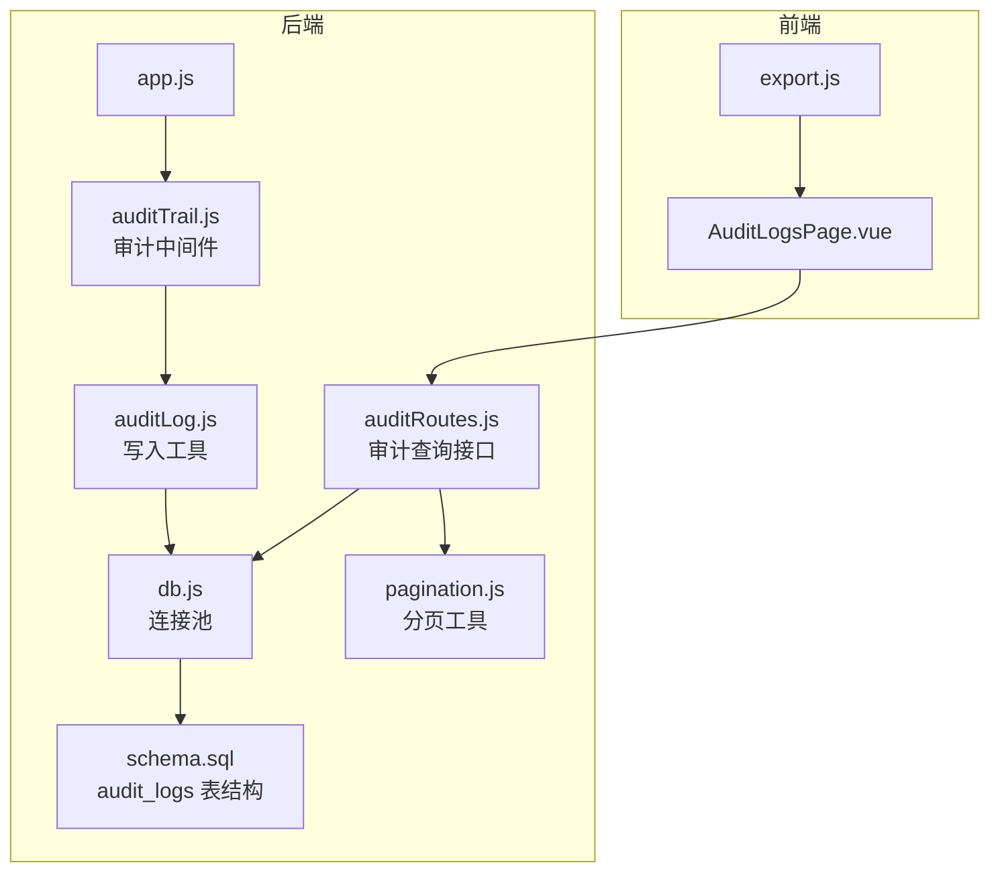
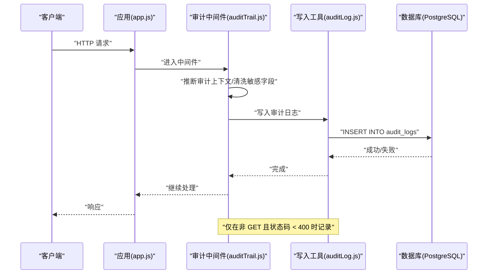
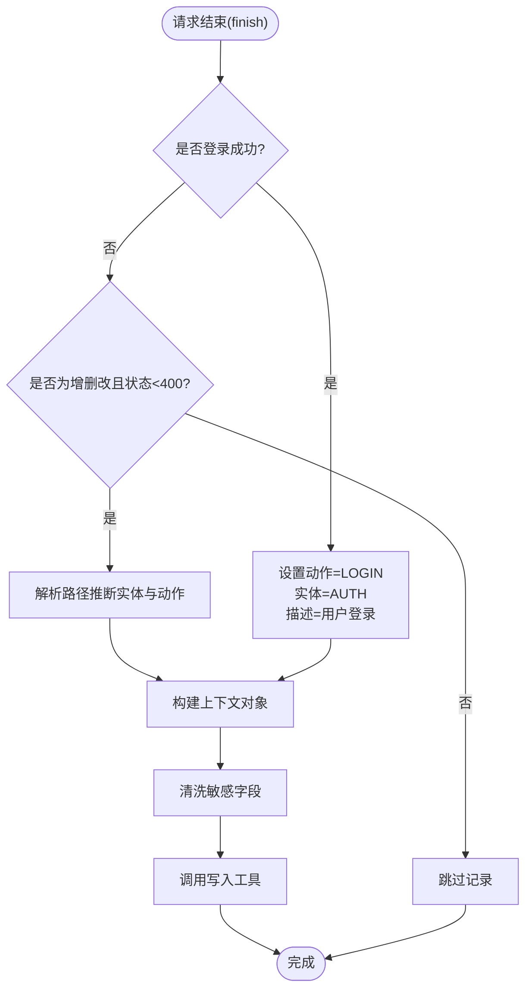
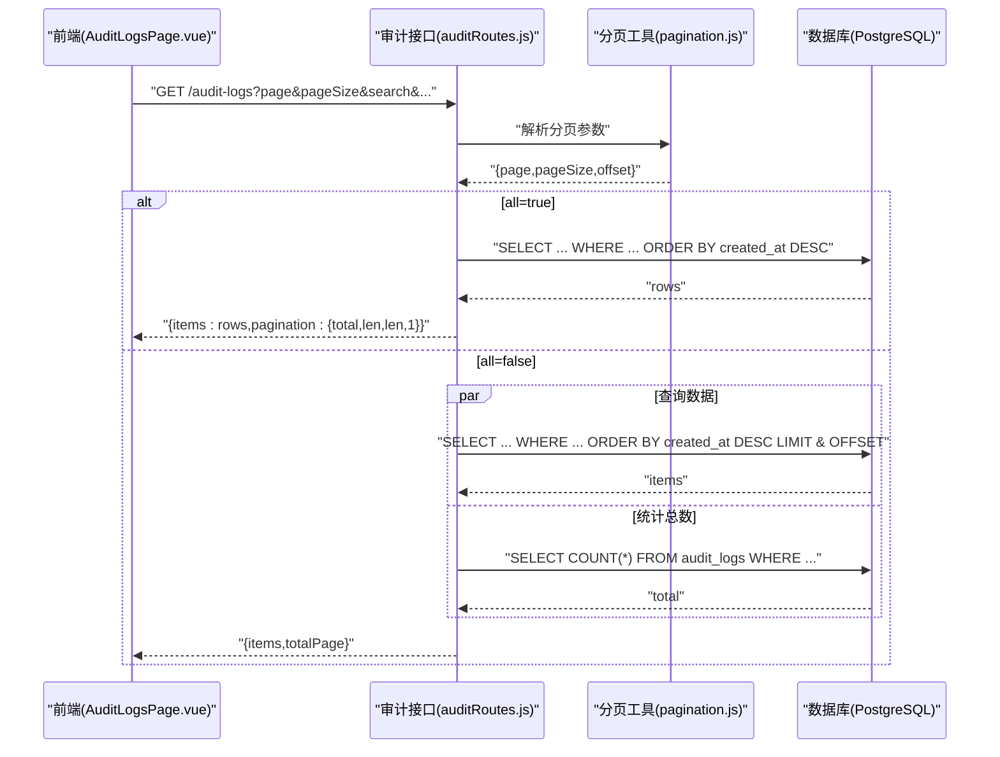
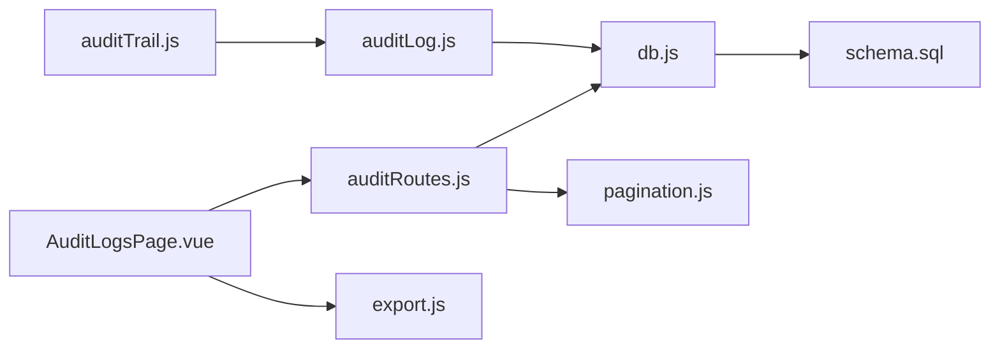

# 审计日志管理

<cite>
**本文引用的文件**
- [auditTrail.js](file://server/src/middleware/auditTrail.js)
- [auditLog.js](file://server/src/utils/auditLog.js)
- [auditRoutes.js](file://server/src/routes/auditRoutes.js)
- [AuditLogsPage.vue](file://web/src/pages/AuditLogsPage.vue)
- [export.js](file://web/src/utils/export.js)
- [db.js](file://server/src/config/db.js)
- [schema.sql](file://server/database/schema.sql)
- [pagination.js](file://server/src/utils/pagination.js)
- [app.js](file://server/src/app.js)
- [alertsRoutes.js](file://server/src/routes/alertsRoutes.js)
- [stockCountRoutes.js](file://server/src/routes/stockCountRoutes.js)
</cite>

## 目录
1. [简介](#简介)
2. [项目结构](#项目结构)
3. [核心组件](#核心组件)
4. [架构总览](#架构总览)
5. [详细组件分析](#详细组件分析)
6. [依赖关系分析](#依赖关系分析)
7. [性能考虑](#性能考虑)
8. [故障排查指南](#故障排查指南)
9. [结论](#结论)
10. [附录](#附录)

## 简介
本文件面向审计日志管理功能，系统化阐述操作审计的记录机制、审计上下文的构建与存储格式；解释审计日志的查询条件、过滤规则与分页功能；明确审计事件类型定义、级别分类与描述格式；说明审计日志的导出能力（CSV/JSON/PDF）及其安全注意事项；给出审计策略配置、保留期限与合规性建议；并提供性能优化与监控指标建议。

## 项目结构
审计系统由后端中间件自动采集、数据库持久化、查询接口与前端展示三部分组成，并通过统一的分页与权限控制保障可用性与安全性。

**图表来源**
- [app.js:28-34](file://server/src/app.js#L28-L34)
- [auditTrail.js:47-79](file://server/src/middleware/auditTrail.js#L47-L79)
- [auditLog.js:1-33](file://server/src/utils/auditLog.js#L1-L33)
- [auditRoutes.js:15-107](file://server/src/routes/auditRoutes.js#L15-L107)
- [pagination.js:1-28](file://server/src/utils/pagination.js#L1-L28)
- [db.js:13-24](file://server/src/config/db.js#L13-L24)
- [schema.sql:275-288](file://server/database/schema.sql#L275-L288)

**章节来源**
- [app.js:28-34](file://server/src/app.js#L28-L34)
- [auditTrail.js:47-79](file://server/src/middleware/auditTrail.js#L47-L79)
- [auditLog.js:1-33](file://server/src/utils/auditLog.js#L1-L33)
- [auditRoutes.js:15-107](file://server/src/routes/auditRoutes.js#L15-L107)
- [pagination.js:1-28](file://server/src/utils/pagination.js#L1-L28)
- [db.js:13-24](file://server/src/config/db.js#L13-L24)
- [schema.sql:275-288](file://server/database/schema.sql#L275-L288)

## 核心组件
- 审计中间件：在请求完成后根据方法、路径与状态码推断审计上下文，清洗敏感字段，异步写入审计日志。
- 写入工具：将审计载荷转换为 SQL 参数，插入 audit_logs 表，metadata 字段以 JSONB 存储。
- 查询接口：支持多维过滤（关键词、动作、实体类型、日期范围）、分页与全量导出开关。
- 前端页面：提供筛选器、分页条、导出按钮与本地过滤预设，支持展开查看 metadata 明细。
- 数据库表：audit_logs 包含用户标识、动作、实体、路径、描述、元数据与时间戳等字段，并建立索引提升查询性能。

**章节来源**
- [auditTrail.js:14-79](file://server/src/middleware/auditTrail.js#L14-L79)
- [auditLog.js:1-33](file://server/src/utils/auditLog.js#L1-L33)
- [auditRoutes.js:15-107](file://server/src/routes/auditRoutes.js#L15-L107)
- [AuditLogsPage.vue:19-48](file://web/src/pages/AuditLogsPage.vue#L19-L48)
- [schema.sql:275-288](file://server/database/schema.sql#L275-L288)

## 架构总览
审计流程从请求进入开始，中间件在响应完成时触发写入；查询接口负责检索与分页；前端负责交互与导出。

**图表来源**
- [app.js:34](file://server/src/app.js#L34)
- [auditTrail.js:47-79](file://server/src/middleware/auditTrail.js#L47-L79)
- [auditLog.js:1-33](file://server/src/utils/auditLog.js#L1-L33)

## 详细组件分析

### 审计中间件与上下文推断
- 上下文推断规则：
  - 登录成功（POST /api/auth/login 且状态码 < 400）标记为 LOGIN 动作。
  - 非增删改或状态码 ≥ 400 不记录。
  - 其余请求基于路径推断 entity_type 与 action 后缀，拼接为“实体_动作”形式。
- 敏感字段清洗：对请求体中的 password 字段进行脱敏。
- 写入时机：使用 finish 事件在响应完成后异步写入，避免阻塞请求链路。
- 写入内容：包含用户标识、角色、动作、实体类型、实体 ID、方法、原始路径、描述与 metadata（含状态码与清洗后的请求体）。

**图表来源**
- [auditTrail.js:14-79](file://server/src/middleware/auditTrail.js#L14-L79)

**章节来源**
- [auditTrail.js:14-79](file://server/src/middleware/auditTrail.js#L14-L79)

### 审计日志写入工具
- 将 metadata 转为 JSON 字符串后以 JSONB 形式入库，便于后续查询与扩展。
- 使用连接池执行插入，保证并发下的稳定性。
- 异常捕获并记录到控制台，不影响主业务流程。

**章节来源**
- [auditLog.js:1-33](file://server/src/utils/auditLog.js#L1-L33)
- [db.js:13-24](file://server/src/config/db.js#L13-L24)

### 审计日志查询接口
- 权限：需认证并通过 ADMIN/MANAGER 角色校验。
- 查询参数：
  - search：模糊匹配用户邮箱、动作、实体类型、路径、描述。
  - action：精确匹配动作（all 表示不限制）。
  - entityType：精确匹配实体类型（all 表示不限制）。
  - startDate/endDate：按创建日期范围过滤。
  - all：布尔值，true 时返回全部数据（不分页），false 时返回分页数据。
  - 分页：page/pageSize 由分页工具统一解析，限制最大每页 100。
- 返回结构：items + pagination（total、page、pageSize、totalPages）。
- 并发查询：当 all=false 时，同时执行数据查询与 COUNT 统计，提升分页体验。

**图表来源**
- [auditRoutes.js:15-107](file://server/src/routes/auditRoutes.js#L15-L107)
- [pagination.js:1-28](file://server/src/utils/pagination.js#L1-28)

**章节来源**
- [auditRoutes.js:15-107](file://server/src/routes/auditRoutes.js#L15-L107)
- [pagination.js:1-28](file://server/src/utils/pagination.js#L1-L28)

### 前端审计日志页面
- 筛选器：支持关键词、动作、实体类型、起止日期；提供本地过滤预设（保存在 localStorage）。
- 展示：列表显示时间、用户、角色、动作、实体、方法、路径与描述；可展开查看 metadata 的 JSON 明细。
- 导出：支持导出全部数据为 CSV/JSON/PDF；导出前会拉取 all=true 的完整数据集。
- 分页：使用统一的分页条组件，切换页码重新加载。

**章节来源**
- [AuditLogsPage.vue:19-48](file://web/src/pages/AuditLogsPage.vue#L19-L48)
- [AuditLogsPage.vue:54-84](file://web/src/pages/AuditLogsPage.vue#L54-L84)
- [AuditLogsPage.vue:106-154](file://web/src/pages/AuditLogsPage.vue#L106-L154)
- [export.js:1-91](file://web/src/utils/export.js#L1-L91)

### 审计事件类型定义与描述格式
- 动作枚举（来源于前端选项与各路由设置）：
  - LOGIN：登录成功
  - STOCK_COUNT_*：库存盘点相关（创建、保存、完成、应用）
  - ALERT_*：告警状态更新与批量更新
- 实体类型枚举（来源于前端选项）：
  - AUTH、USERS、CATEGORIES、WAREHOUSES、PRODUCTS、INVENTORY、STOCK_COUNT、ALERT 等
- 描述格式：
  - 中间件默认描述为“方法 路径”，可在具体路由中覆盖为更语义化的描述（如“Updated low stock alert...”、“Created stock count #...”）。

**章节来源**
- [AuditLogsPage.vue:38-39](file://web/src/pages/AuditLogsPage.vue#L38-L39)
- [auditTrail.js:40-44](file://server/src/middleware/auditTrail.js#L40-L44)
- [alertsRoutes.js:221-226](file://server/src/routes/alertsRoutes.js#L221-L226)
- [alertsRoutes.js:274-279](file://server/src/routes/alertsRoutes.js#L274-L279)
- [stockCountRoutes.js:151-156](file://server/src/routes/stockCountRoutes.js#L151-L156)
- [stockCountRoutes.js:258-263](file://server/src/routes/stockCountRoutes.js#L258-L263)
- [stockCountRoutes.js:311-316](file://server/src/routes/stockCountRoutes.js#L311-L316)

### 审计日志存储格式
- 表结构要点：
  - 主键 id、外键 user_id（可空）、user_email、user_role。
  - 动作 action、实体类型 entity_type、实体 id entity_id。
  - 方法 method、原始路径 path、描述 description。
  - metadata 以 JSONB 存储，包含状态码与清洗后的请求体。
  - 创建时间 created_at。
- 索引：
  - user_id、created_at（降序）等索引用于加速查询。

**章节来源**
- [schema.sql:275-288](file://server/database/schema.sql#L275-L288)
- [schema.sql:431-432](file://server/database/schema.sql#L431-L432)

### 导出功能、数据格式与安全要求
- 数据格式：
  - CSV：以 UTF-8 BOM 编码输出，列标题与单元格内容转义处理。
  - JSON：标准 JSON 文件，保留原始字段。
  - PDF：使用 jsPDF + autoTable 生成横向 A4 报表，包含标题与表头。
- 导出流程：
  - 前端调用 /audit-logs?all=true 获取全量数据，再交由导出工具生成文件。
- 安全要求：
  - 仅 ADMIN/MANAGER 可访问审计日志查询接口。
  - 导出数据包含敏感字段（如请求体）可能包含密码等，应在合规范围内使用并限制访问。
  - 生产环境建议启用 SSL 连接与最小权限原则。

**章节来源**
- [auditRoutes.js:8-9](file://server/src/routes/auditRoutes.js#L8-L9)
- [AuditLogsPage.vue:106-154](file://web/src/pages/AuditLogsPage.vue#L106-L154)
- [export.js:1-91](file://web/src/utils/export.js#L1-L91)
- [db.js:13-19](file://server/src/config/db.js#L13-L19)

## 依赖关系分析
- 中间件依赖：
  - 审计中间件依赖数据库连接池与写入工具。
  - 写入工具依赖连接池与 SQL 模板。
- 接口依赖：
  - 审计查询接口依赖分页工具、数据库查询与统一错误处理。
- 前端依赖：
  - 页面依赖 API 服务、导出工具与本地存储。
- 数据库依赖：
  - audit_logs 表结构与索引直接影响查询性能与可维护性。

**图表来源**
- [auditTrail.js:1-2](file://server/src/middleware/auditTrail.js#L1-L2)
- [auditLog.js:1-33](file://server/src/utils/auditLog.js#L1-L33)
- [auditRoutes.js:2-4](file://server/src/routes/auditRoutes.js#L2-L4)
- [pagination.js:1-28](file://server/src/utils/pagination.js#L1-L28)
- [db.js:13-24](file://server/src/config/db.js#L13-L24)
- [schema.sql:275-288](file://server/database/schema.sql#L275-L288)

**章节来源**
- [auditTrail.js:1-2](file://server/src/middleware/auditTrail.js#L1-L2)
- [auditLog.js:1-33](file://server/src/utils/auditLog.js#L1-L33)
- [auditRoutes.js:2-4](file://server/src/routes/auditRoutes.js#L2-L4)
- [pagination.js:1-28](file://server/src/utils/pagination.js#L1-L28)
- [db.js:13-24](file://server/src/config/db.js#L13-L24)
- [schema.sql:275-288](file://server/database/schema.sql#L275-L288)

## 性能考虑
- 查询性能
  - 已有针对 user_id 与 created_at 的索引，建议在高频查询维度（如 action、entity_type、path）上评估是否需要补充索引。
  - 对于大体量数据，建议结合分区表或归档策略减少热数据扫描。
- 写入性能
  - 写入采用异步方式，避免阻塞响应；若日志量极大，可考虑批量写入或异步队列。
- 分页与全量导出
  - 分页场景使用并发查询数据与统计，提升用户体验；全量导出会拉取所有数据，应谨慎使用并限制访问频率。
- 数据库连接
  - 连接池已启用超时配置，生产环境建议结合负载与延迟监控调整连接数与超时阈值。

[本节为通用性能建议，不直接分析具体文件]

## 故障排查指南
- 无法写入审计日志
  - 检查数据库连接字符串与 SSL 配置；确认连接池可用。
  - 查看中间件异常捕获日志，定位写入失败原因。
- 查询无结果或结果异常
  - 核对查询参数（search、action、entityType、startDate/endDate）是否正确。
  - 确认分页参数范围与 all=true/false 的预期差异。
- 导出失败
  - 确认已具备 ADMIN/MANAGER 权限。
  - 检查浏览器弹窗拦截与网络异常；关注前端错误提示。
- 前端筛选预设丢失
  - 检查浏览器本地存储权限与容量；必要时清理无效数据。

**章节来源**
- [db.js:13-19](file://server/src/config/db.js#L13-L19)
- [auditTrail.js:73-75](file://server/src/middleware/auditTrail.js#L73-L75)
- [auditRoutes.js:104-106](file://server/src/routes/auditRoutes.js#L104-L106)
- [AuditLogsPage.vue:68-72](file://web/src/pages/AuditLogsPage.vue#L68-L72)

## 结论
该审计系统通过中间件自动采集、数据库 JSONB 存储与前后端协同，实现了对关键业务操作的可追溯性。通过完善的查询过滤、分页与导出能力，满足日常审计与合规需求。建议在高并发与海量数据场景下进一步完善索引、分区与异步写入策略，并加强访问控制与数据安全治理。

[本节为总结性内容，不直接分析具体文件]

## 附录

### 审计事件类型与实体映射参考
- LOGIN：AUTH
- STOCK_COUNT_CREATE/SAVE/COMPLETE/APPLY：STOCK_COUNT
- ALERT_UPDATE/BULK_UPDATE：ALERT

**章节来源**
- [AuditLogsPage.vue:38-39](file://web/src/pages/AuditLogsPage.vue#L38-L39)
- [alertsRoutes.js:221-226](file://server/src/routes/alertsRoutes.js#L221-L226)
- [alertsRoutes.js:274-279](file://server/src/routes/alertsRoutes.js#L274-L279)
- [stockCountRoutes.js:151-156](file://server/src/routes/stockCountRoutes.js#L151-L156)
- [stockCountRoutes.js:258-263](file://server/src/routes/stockCountRoutes.js#L258-L263)
- [stockCountRoutes.js:311-316](file://server/src/routes/stockCountRoutes.js#L311-L316)

### 审计策略配置与合规建议
- 访问控制：仅 ADMIN/MANAGER 可查询审计日志。
- 保留期限：建议结合法规要求设定自动归档与删除策略（例如 90 天至 180 天），并定期备份。
- 数据最小化：导出前审慎评估敏感字段暴露范围，必要时在导出前进行二次脱敏。
- 监控指标：关注审计写入延迟、查询响应时间、导出耗时与失败率，结合数据库慢查询日志优化。

[本节为通用合规建议，不直接分析具体文件]