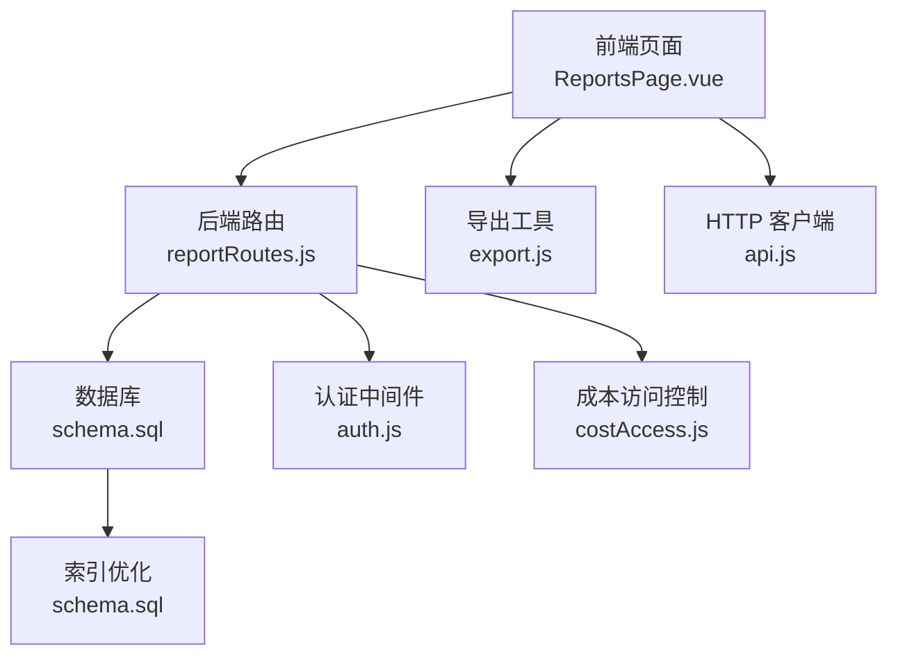
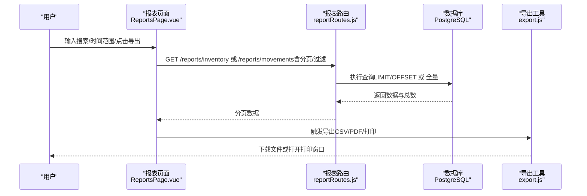
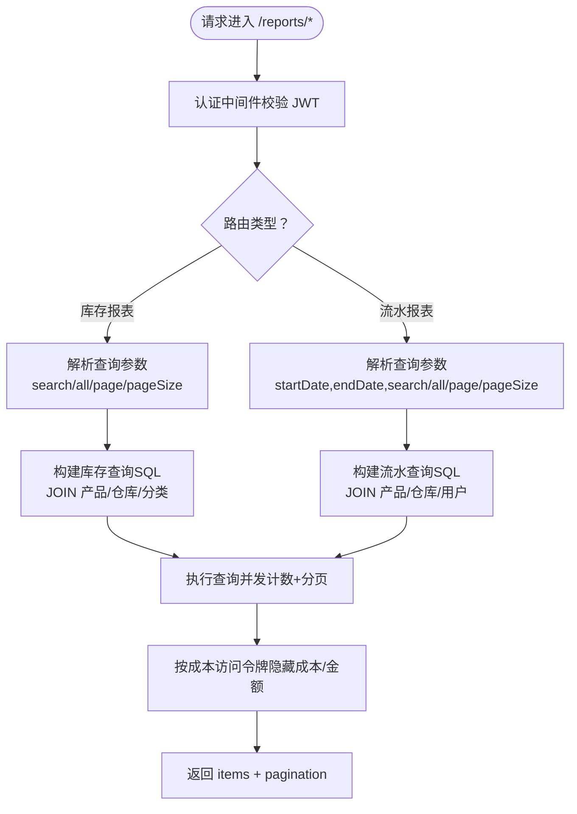
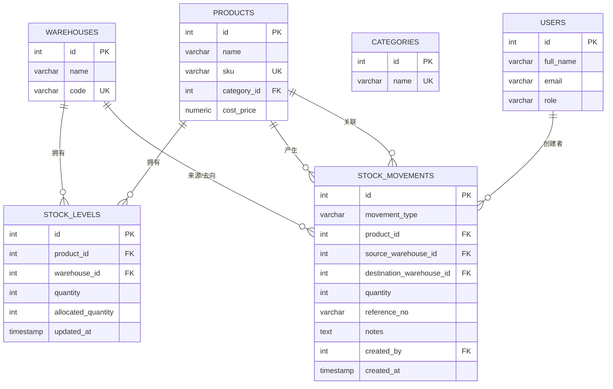
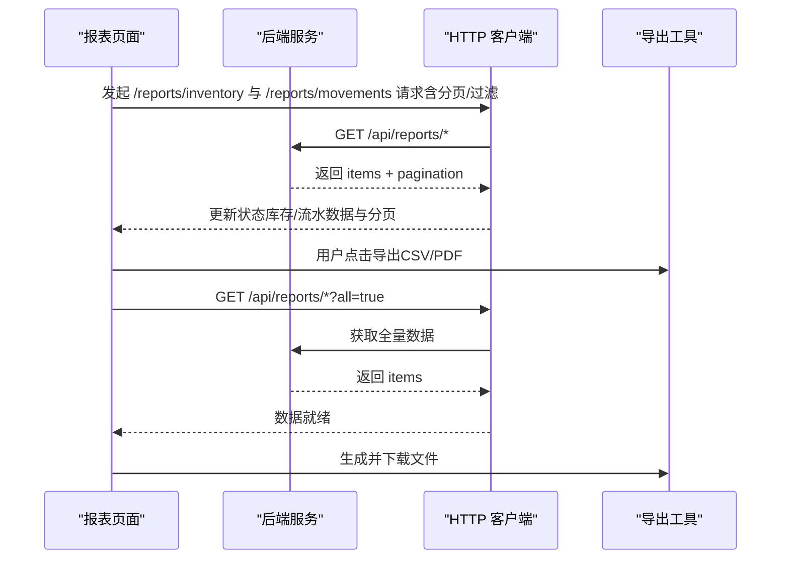
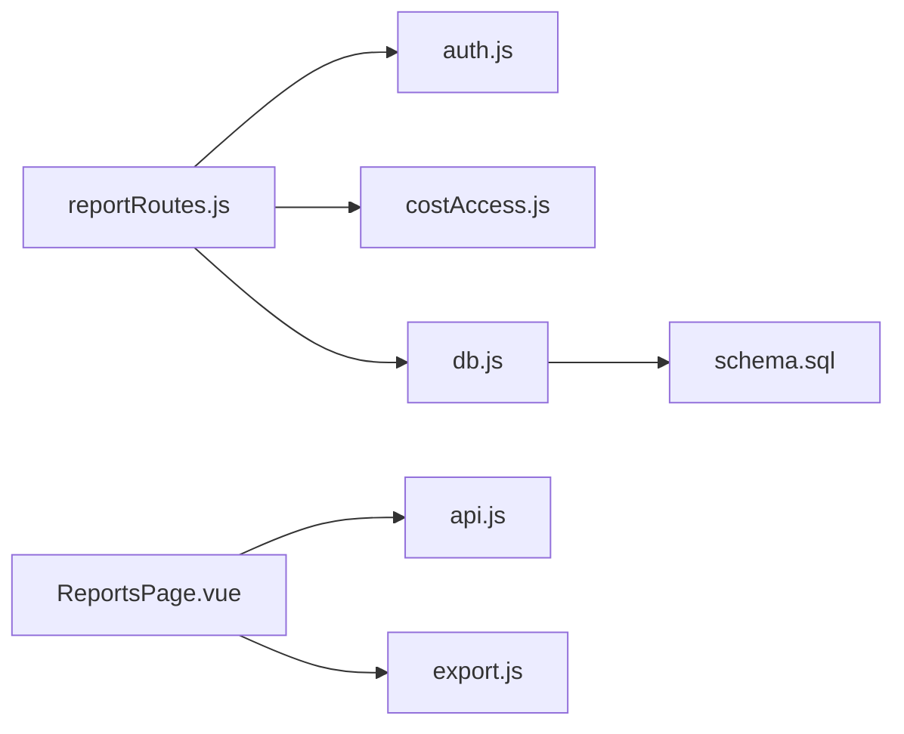

# 报表分析管理

<cite>
**本文引用的文件**
- [server/src/routes/reportRoutes.js](file://server/src/routes/reportRoutes.js)
- [web/src/pages/ReportsPage.vue](file://web/src/pages/ReportsPage.vue)
- [web/src/utils/export.js](file://web/src/utils/export.js)
- [server/src/config/db.js](file://server/src/config/db.js)
- [server/database/schema.sql](file://server/database/schema.sql)
- [server/src/utils/costAccess.js](file://server/src/utils/costAccess.js)
- [server/src/middleware/auth.js](file://server/src/middleware/auth.js)
- [web/src/services/api.js](file://web/src/services/api.js)
- [web/src/stores/locale.js](file://web/src/stores/locale.js)
</cite>

## 目录
1. [简介](#简介)
2. [项目结构](#项目结构)
3. [核心组件](#核心组件)
4. [架构总览](#架构总览)
5. [详细组件分析](#详细组件分析)
6. [依赖关系分析](#依赖关系分析)
7. [性能考虑](#性能考虑)
8. [故障排查指南](#故障排查指南)
9. [结论](#结论)
10. [附录](#附录)

## 简介
本文件面向“报表分析管理”功能，系统性说明库存报表、流水报表（移动）两类核心报表的数据来源、计算逻辑与展示方式；阐述查询参数配置、时间范围选择与筛选条件；解释前端图表与交互、报表导出（CSV/PDF/打印）的技术实现；并给出性能优化、缓存策略与数据刷新机制建议。当前系统已具备基础报表查询、分页与导出能力，并通过数据库索引与并发查询提升性能。

## 项目结构
报表分析功能由前端页面、API 路由、数据库模式与工具模块协同完成：
- 前端：报表页面负责参数输入、分页、表格展示与导出触发
- 后端：报表路由提供库存与流水报表接口，支持分页与全量导出
- 数据库：库存与流水相关表定义了数据模型与索引
- 工具：导出工具、成本访问控制、认证中间件、数据库连接池

**图示来源**
- [server/src/routes/reportRoutes.js:1-252](file://server/src/routes/reportRoutes.js#L1-L252)
- [web/src/pages/ReportsPage.vue:1-384](file://web/src/pages/ReportsPage.vue#L1-L384)
- [web/src/utils/export.js:1-91](file://web/src/utils/export.js#L1-L91)
- [server/database/schema.sql:125-248](file://server/database/schema.sql#L125-L248)
- [server/src/middleware/auth.js:1-46](file://server/src/middleware/auth.js#L1-L46)
- [server/src/utils/costAccess.js:1-32](file://server/src/utils/costAccess.js#L1-L32)
- [web/src/services/api.js:1-45](file://web/src/services/api.js#L1-L45)

**章节来源**
- [server/src/routes/reportRoutes.js:1-252](file://server/src/routes/reportRoutes.js#L1-L252)
- [web/src/pages/ReportsPage.vue:1-384](file://web/src/pages/ReportsPage.vue#L1-L384)
- [web/src/utils/export.js:1-91](file://web/src/utils/export.js#L1-L91)
- [server/database/schema.sql:125-248](file://server/database/schema.sql#L125-L248)
- [server/src/middleware/auth.js:1-46](file://server/src/middleware/auth.js#L1-L46)
- [server/src/utils/costAccess.js:1-32](file://server/src/utils/costAccess.js#L1-L32)
- [web/src/services/api.js:1-45](file://web/src/services/api.js#L1-L45)

## 核心组件
- 报表路由层：提供库存报表与流水报表接口，支持分页与全量导出
- 前端报表页面：参数表单、分页条、表格展示、导出按钮与加载状态提示
- 导出工具：CSV/PDF/打印输出
- 认证与成本访问：基于 JWT 的用户认证与成本字段可见性控制
- 数据库：库存与流水表及索引

**章节来源**
- [server/src/routes/reportRoutes.js:16-127](file://server/src/routes/reportRoutes.js#L16-L127)
- [server/src/routes/reportRoutes.js:129-249](file://server/src/routes/reportRoutes.js#L129-L249)
- [web/src/pages/ReportsPage.vue:62-183](file://web/src/pages/ReportsPage.vue#L62-L183)
- [web/src/utils/export.js:1-91](file://web/src/utils/export.js#L1-L91)
- [server/src/middleware/auth.js:5-29](file://server/src/middleware/auth.js#L5-L29)
- [server/src/utils/costAccess.js:25-27](file://server/src/utils/costAccess.js#L25-L27)
- [server/database/schema.sql:125-248](file://server/database/schema.sql#L125-L248)

## 架构总览
报表分析采用前后端分离架构：前端发起查询请求，后端根据参数构建 SQL 查询，返回分页数据；导出时前端请求“全量”数据并本地生成文件。

**图示来源**
- [web/src/pages/ReportsPage.vue:62-183](file://web/src/pages/ReportsPage.vue#L62-L183)
- [server/src/routes/reportRoutes.js:16-127](file://server/src/routes/reportRoutes.js#L16-L127)
- [server/src/routes/reportRoutes.js:129-249](file://server/src/routes/reportRoutes.js#L129-L249)
- [web/src/utils/export.js:1-91](file://web/src/utils/export.js#L1-L91)

## 详细组件分析

### 报表路由与查询参数
- 认证中间件：所有报表接口均需携带有效 JWT
- 库存报表
  - 支持搜索（产品名/SKU/条码/仓库/分类），分页与全量导出
  - 成本价格与库存金额在具备成本访问令牌时才返回
- 流水报表
  - 支持时间范围（起止日期）、关键词搜索（产品/单号/类型/仓库/操作人），分页与全量导出

**图示来源**
- [server/src/routes/reportRoutes.js:9-127](file://server/src/routes/reportRoutes.js#L9-L127)
- [server/src/routes/reportRoutes.js:129-249](file://server/src/routes/reportRoutes.js#L129-L249)
- [server/src/middleware/auth.js:5-29](file://server/src/middleware/auth.js#L5-L29)
- [server/src/utils/costAccess.js:25-27](file://server/src/utils/costAccess.js#L25-L27)

**章节来源**
- [server/src/routes/reportRoutes.js:16-127](file://server/src/routes/reportRoutes.js#L16-L127)
- [server/src/routes/reportRoutes.js:129-249](file://server/src/routes/reportRoutes.js#L129-L249)
- [server/src/middleware/auth.js:5-29](file://server/src/middleware/auth.js#L5-L29)
- [server/src/utils/costAccess.js:25-27](file://server/src/utils/costAccess.js#L25-L27)

### 数据模型与索引
- 库存报表涉及的核心表：products、warehouses、stock_levels、categories
- 流水报表涉及的核心表：stock_movements、products、warehouses、users
- 关键索引：stock_movements.created_at、stock_levels.product_id/warehouse_id 等，用于排序与过滤性能

**图示来源**
- [server/database/schema.sql:32-54](file://server/database/schema.sql#L32-L54)
- [server/database/schema.sql:125-133](file://server/database/schema.sql#L125-L133)
- [server/database/schema.sql:237-248](file://server/database/schema.sql#L237-L248)
- [server/database/schema.sql:415-418](file://server/database/schema.sql#L415-L418)

**章节来源**
- [server/database/schema.sql:32-54](file://server/database/schema.sql#L32-L54)
- [server/database/schema.sql:125-133](file://server/database/schema.sql#L125-L133)
- [server/database/schema.sql:237-248](file://server/database/schema.sql#L237-L248)
- [server/database/schema.sql:415-418](file://server/database/schema.sql#L415-L418)

### 前端展示与交互
- 参数配置：搜索关键词、起止日期、分页大小
- 展示方式：桌面端表格、移动端卡片列表；库存报表对成本与金额进行条件隐藏
- 导出功能：CSV/PDF/打印，导出时请求“全量”数据并本地生成文件
- 加载与错误提示：统一 loading 与错误消息显示

**图示来源**
- [web/src/pages/ReportsPage.vue:62-183](file://web/src/pages/ReportsPage.vue#L62-L183)
- [web/src/utils/export.js:1-91](file://web/src/utils/export.js#L1-L91)
- [web/src/services/api.js:8-24](file://web/src/services/api.js#L8-L24)

**章节来源**
- [web/src/pages/ReportsPage.vue:15-31](file://web/src/pages/ReportsPage.vue#L15-L31)
- [web/src/pages/ReportsPage.vue:33-52](file://web/src/pages/ReportsPage.vue#L33-L52)
- [web/src/pages/ReportsPage.vue:62-183](file://web/src/pages/ReportsPage.vue#L62-L183)
- [web/src/utils/export.js:1-91](file://web/src/utils/export.js#L1-L91)
- [web/src/services/api.js:8-24](file://web/src/services/api.js#L8-L24)

### 报表计算逻辑
- 库存报表
  - 可用数量 = 在库数量 - 占用数量（非负）
  - 库存金额 = 可用数量 × 成本单价（仅具备成本访问权限时）
- 流水报表
  - 时间范围过滤：created_at ≥ 开始时间 且 ≤ 结束时间
  - 多字段模糊匹配：产品名/SKU/单号/类型/仓库/操作人

**章节来源**
- [server/src/routes/reportRoutes.js:34-37](file://server/src/routes/reportRoutes.js#L34-L37)
- [server/src/routes/reportRoutes.js:157-168](file://server/src/routes/reportRoutes.js#L157-L168)

### 报表导出技术实现
- CSV：本地拼接 CSV 内容并触发下载
- PDF：动态加载 jsPDF 与 autoTable，生成横向 A4 表格并保存
- 打印：打开新窗口渲染 HTML 并调用浏览器打印

**章节来源**
- [web/src/utils/export.js:1-91](file://web/src/utils/export.js#L1-L91)

## 依赖关系分析
- 报表路由依赖认证中间件与成本访问控制
- 查询依赖数据库连接池与索引
- 前端依赖 HTTP 客户端拦截器自动注入鉴权头与语言头

**图示来源**
- [server/src/routes/reportRoutes.js:1-7](file://server/src/routes/reportRoutes.js#L1-L7)
- [server/src/middleware/auth.js:1-46](file://server/src/middleware/auth.js#L1-L46)
- [server/src/utils/costAccess.js:1-32](file://server/src/utils/costAccess.js#L1-L32)
- [server/src/config/db.js:1-25](file://server/src/config/db.js#L1-L25)
- [web/src/pages/ReportsPage.vue:1-8](file://web/src/pages/ReportsPage.vue#L1-L8)
- [web/src/services/api.js:1-45](file://web/src/services/api.js#L1-L45)
- [web/src/utils/export.js:1-91](file://web/src/utils/export.js#L1-L91)
- [server/database/schema.sql:125-248](file://server/database/schema.sql#L125-L248)

**章节来源**
- [server/src/routes/reportRoutes.js:1-7](file://server/src/routes/reportRoutes.js#L1-L7)
- [server/src/middleware/auth.js:1-46](file://server/src/middleware/auth.js#L1-L46)
- [server/src/utils/costAccess.js:1-32](file://server/src/utils/costAccess.js#L1-L32)
- [server/src/config/db.js:1-25](file://server/src/config/db.js#L1-L25)
- [web/src/pages/ReportsPage.vue:1-8](file://web/src/pages/ReportsPage.vue#L1-L8)
- [web/src/services/api.js:1-45](file://web/src/services/api.js#L1-L45)
- [web/src/utils/export.js:1-91](file://web/src/utils/export.js#L1-L91)
- [server/database/schema.sql:125-248](file://server/database/schema.sql#L125-L248)

## 性能考虑
- 查询优化
  - 使用 LIMIT/OFFSET 实现分页，避免一次性传输大量数据
  - 并发执行“数据查询 + 计数查询”，减少往返次数
  - 利用数据库索引（如 stock_movements.created_at、stock_levels.product_id/warehouse_id）加速过滤与排序
- 导出优化
  - 导出时使用 all=true 拉取全量数据，前端本地生成文件，避免后端大文件流式输出
- 缓存策略
  - 对高频查询（如库存快照）可在应用层引入短期缓存（如 Redis），设置合理 TTL 并与变更事件同步失效
- 数据刷新机制
  - 对外部平台库存（如 marketplace_inventory_snapshots）可通过定时任务或事件驱动刷新，确保报表数据时效性

[本节为通用性能建议，不直接分析具体文件，故无“章节来源”]

## 故障排查指南
- 认证失败
  - 确认请求头是否包含有效的 Bearer Token
  - 检查用户是否存在且处于激活状态
- 成本字段为空
  - 确认已携带 x-cost-access-token 并满足 ADMIN/MANAGER 角色要求
- 查询异常
  - 检查时间范围参数格式与时区
  - 确认搜索关键词与数据库字段匹配（产品名/SKU/条码/仓库/分类/单号/类型/操作人）
- 导出失败
  - 确认网络稳定，全量数据拉取成功
  - 检查浏览器弹窗/下载权限

**章节来源**
- [server/src/middleware/auth.js:9-28](file://server/src/middleware/auth.js#L9-L28)
- [server/src/utils/costAccess.js:5-27](file://server/src/utils/costAccess.js#L5-L27)
- [web/src/services/api.js:8-24](file://web/src/services/api.js#L8-L24)

## 结论
当前系统已实现库存报表与流水报表的基础查询、分页与导出能力，前端通过并发请求与本地导出提升了交互体验。后续可在成本字段访问控制、报表缓存与外部库存同步方面进一步增强，以满足更复杂的业务场景与性能需求。

## 附录
- 报表类型与关键字段
  - 库存报表：产品名、SKU、仓库、在库、占用、可用、补货线、库存金额（受成本访问控制）
  - 流水报表：类型、产品、来源、去向、数量、操作人、时间
- 查询参数
  - 库存报表：search、page、pageSize、all
  - 流水报表：startDate、endDate、search、page、pageSize、all
- 导出格式
  - CSV、PDF、打印

[本节为汇总信息，不直接分析具体文件，故无“章节来源”]