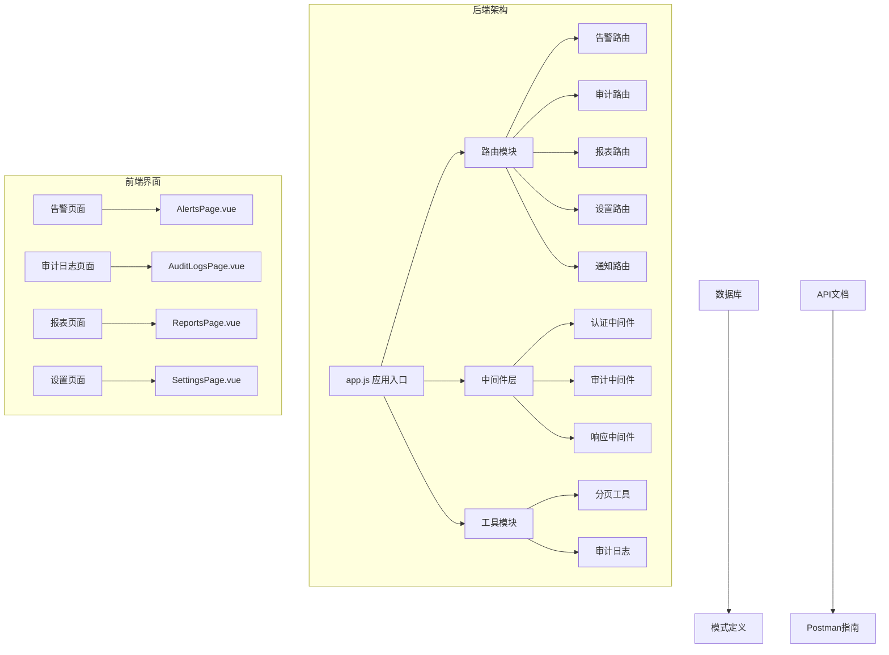
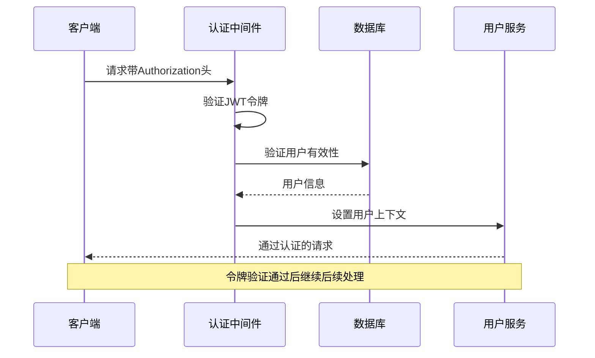
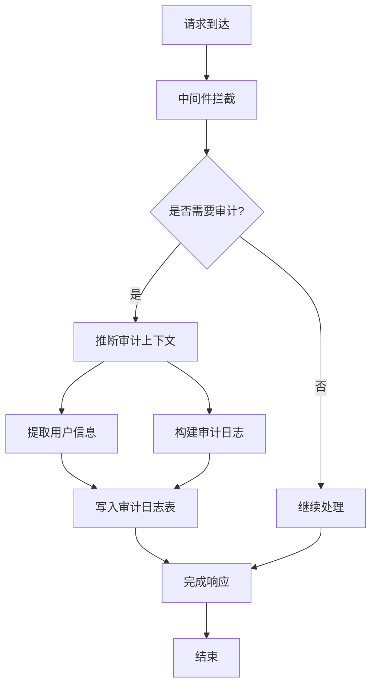
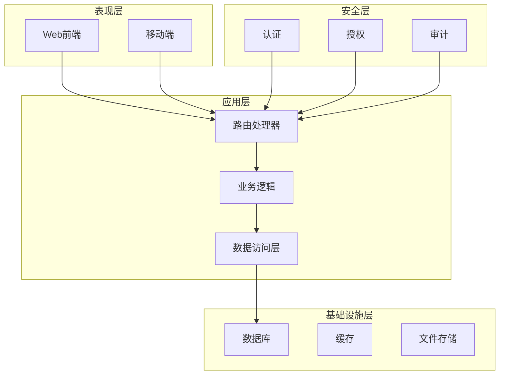
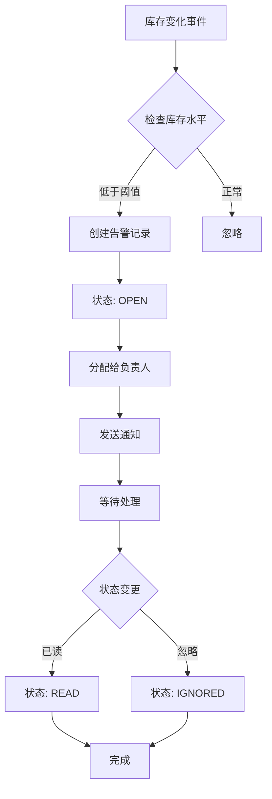
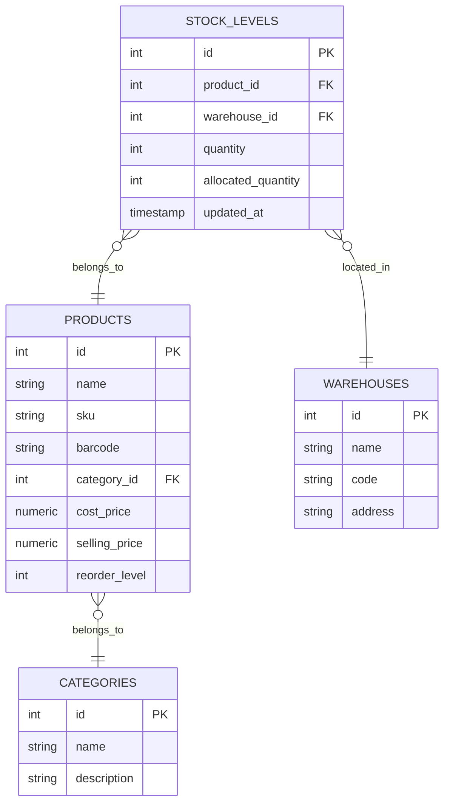
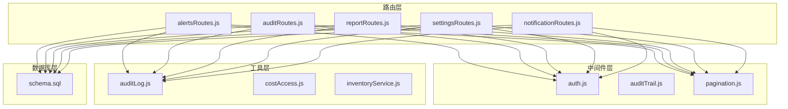

# 系统管理路由

<cite>
**本文档引用的文件**
- [alertsRoutes.js](file://server/src/routes/alertsRoutes.js)
- [auditRoutes.js](file://server/src/routes/auditRoutes.js)
- [reportRoutes.js](file://server/src/routes/reportRoutes.js)
- [settingsRoutes.js](file://server/src/routes/settingsRoutes.js)
- [notificationRoutes.js](file://server/src/routes/notificationRoutes.js)
- [auditTrail.js](file://server/src/middleware/auditTrail.js)
- [auth.js](file://server/src/middleware/auth.js)
- [pagination.js](file://server/src/utils/pagination.js)
- [auditLog.js](file://server/src/utils/auditLog.js)
- [schema.sql](file://server/database/schema.sql)
- [AlertsPage.vue](file://web/src/pages/AlertsPage.vue)
- [AuditLogsPage.vue](file://web/src/pages/AuditLogsPage.vue)
- [ReportsPage.vue](file://web/src/pages/ReportsPage.vue)
- [SettingsPage.vue](file://web/src/pages/SettingsPage.vue)
- [POSTMAN_BACKEND_GUIDE.md](file://POSTMAN_BACKEND_GUIDE.md)
- [app.js](file://server/src/app.js)
- [package.json](file://server/package.json)
</cite>

## 目录
1. [简介](#简介)
2. [项目结构](#项目结构)
3. [核心组件](#核心组件)
4. [架构概览](#架构概览)
5. [详细组件分析](#详细组件分析)
6. [依赖关系分析](#依赖关系分析)
7. [性能考虑](#性能考虑)
8. [故障排除指南](#故障排除指南)
9. [结论](#结论)

## 简介

系统管理路由模块是库存管理系统的核心管理功能集合，负责提供告警通知、审计日志、报表分析和系统设置等关键管理能力。该模块采用RESTful API设计，结合前后端分离架构，为用户提供完整的系统管理体验。

本模块主要包含四个核心子系统：
- **告警通知系统**：实时监控库存状态，生成低库存告警和价格变动通知
- **审计日志系统**：完整记录用户操作行为，支持查询、筛选和导出
- **报表分析系统**：提供库存报表和流水报表，支持多种维度分析
- **系统设置系统**：管理用户偏好和系统策略配置

## 项目结构

系统管理路由模块采用模块化设计，按照功能领域进行组织：

**图表来源**
- [app.js:1-67](file://server/src/app.js#L1-L67)
- [alertsRoutes.js:1-290](file://server/src/routes/alertsRoutes.js#L1-L290)
- [auditRoutes.js:1-110](file://server/src/routes/auditRoutes.js#L1-L110)
- [reportRoutes.js:1-252](file://server/src/routes/reportRoutes.js#L1-L252)
- [settingsRoutes.js:1-144](file://server/src/routes/settingsRoutes.js#L1-L144)

**章节来源**
- [app.js:1-67](file://server/src/app.js#L1-L67)
- [package.json:1-31](file://server/package.json#L1-L31)

## 核心组件

### 认证与授权中间件

系统采用基于JWT的认证机制，确保API调用的安全性：

**图表来源**
- [auth.js:1-46](file://server/src/middleware/auth.js#L1-L46)

### 审计追踪中间件

系统实现了完整的审计追踪机制，自动记录所有管理操作：

**图表来源**
- [auditTrail.js:1-84](file://server/src/middleware/auditTrail.js#L1-L84)
- [auditLog.js:1-38](file://server/src/utils/auditLog.js#L1-L38)

**章节来源**
- [auth.js:1-46](file://server/src/middleware/auth.js#L1-L46)
- [auditTrail.js:1-84](file://server/src/middleware/auditTrail.js#L1-L84)
- [auditLog.js:1-38](file://server/src/utils/auditLog.js#L1-L38)

## 架构概览

系统采用分层架构设计，确保各组件职责清晰、耦合度低：

**图表来源**
- [app.js:26-55](file://server/src/app.js#L26-L55)
- [schema.sql:275-396](file://server/database/schema.sql#L275-L396)

## 详细组件分析

### 告警通知系统

告警通知系统负责实时监控库存状态并生成相应的告警通知：

#### 实时告警触发机制

系统通过低库存阈值监控实现告警触发：

**图表来源**
- [alertsRoutes.js:14-40](file://server/src/routes/alertsRoutes.js#L14-L40)
- [schema.sql:290-300](file://server/database/schema.sql#L290-L300)

#### 通知渠道配置

系统支持多种通知渠道配置，包括：

- **系统内通知**：通过`system_notifications`表管理
- **邮件通知**：可扩展的邮件发送机制
- **短信通知**：集成第三方短信服务
- **推送通知**：移动端推送支持

#### 消息模板管理

告警消息采用模板化管理，支持动态内容替换：

| 模板变量 | 描述 | 示例 |
|---------|------|------|
| `{productName}` | 商品名称 | "激光切割机X1" |
| `{currentStock}` | 当前库存 | "5" |
| `{reorderLevel}` | 补货线 | "10" |
| `{shortage}` | 缺货数量 | "5" |
| `{warehouse}` | 仓库名称 | "深圳仓" |

**章节来源**
- [alertsRoutes.js:80-287](file://server/src/routes/alertsRoutes.js#L80-L287)
- [schema.sql:290-300](file://server/database/schema.sql#L290-L300)

### 审计日志系统

审计日志系统提供完整的操作追踪能力：

#### 记录格式

审计日志采用统一的数据结构：

| 字段名 | 类型 | 描述 | 示例 |
|--------|------|------|------|
| `user_id` | INTEGER | 操作用户ID | 1 |
| `user_email` | VARCHAR | 用户邮箱 | "admin@inventory.local" |
| `user_role` | VARCHAR | 用户角色 | "ADMIN" |
| `action` | VARCHAR | 操作类型 | "ALERT_UPDATE" |
| `entity_type` | VARCHAR | 实体类型 | "ALERT" |
| `entity_id` | VARCHAR | 实体ID | "1:2" |
| `method` | VARCHAR | HTTP方法 | "PUT" |
| `path` | TEXT | 请求路径 | "/api/alerts/low-stock/1/2" |
| `description` | TEXT | 操作描述 | "Updated low stock alert" |
| `metadata` | JSONB | 扩展元数据 | 包含请求体和状态码 |

#### 查询条件

支持多维度查询过滤：

- **关键词搜索**：支持用户邮箱、操作类型、实体类型、路径等字段模糊匹配
- **时间范围**：支持开始日期和结束日期过滤
- **操作类型**：支持特定操作类型的过滤
- **实体类型**：支持特定实体类型的过滤

#### 导出功能

审计日志支持多种格式导出：

- **CSV格式**：便于Excel处理
- **JSON格式**：保持原始结构
- **PDF格式**：适合归档和打印

**章节来源**
- [auditRoutes.js:15-107](file://server/src/routes/auditRoutes.js#L15-L107)
- [auditTrail.js:14-79](file://server/src/middleware/auditTrail.js#L14-L79)
- [schema.sql:275-288](file://server/database/schema.sql#L275-L288)

### 报表分析系统

报表分析系统提供全面的库存和业务分析能力：

#### 库存报表

库存报表支持多维度分析：

**图表来源**
- [reportRoutes.js:16-127](file://server/src/routes/reportRoutes.js#L16-L127)
- [schema.sql:125-133](file://server/database/schema.sql#L125-L133)

#### 流水报表

流水报表跟踪所有库存变动：

| 报表类型 | 数据源 | 计算逻辑 | 展示方式 |
|----------|--------|----------|----------|
| 库存报表 | `stock_levels` + `products` + `warehouses` | 可用数量 = 实际库存 - 已分配数量 库存金额 = 可用数量 × 成本价 | 表格 + 图表 |
| 流水报表 | `stock_movements` + 相关关联表 | 按时间倒序排列，支持类型过滤 | 时间轴 + 详情列表 |

#### 数据源和计算逻辑

- **库存报表**：从`stock_levels`表获取实际库存，通过`products`表获取成本价，计算库存价值
- **流水报表**：从`stock_movements`表获取所有库存变动，关联相关实体信息

**章节来源**
- [reportRoutes.js:15-249](file://server/src/routes/reportRoutes.js#L15-L249)
- [schema.sql:237-248](file://server/database/schema.sql#L237-L248)

### 系统设置系统

系统设置系统提供灵活的配置管理能力：

#### 配置项管理

| 配置项 | 类型 | 默认值 | 描述 |
|--------|------|--------|------|
| `PRICE_CHANGE_ALERT_THRESHOLD_PERCENT` | 数字 | 10 | 价格变动阈值（%） |
| `PRICE_CHANGE_NOTIFICATIONS_ENABLED` | 布尔 | true | 是否启用价格变动通知 |
| `PRICE_CHANGE_NOTIFY_ROLES` | 数组 | ["ADMIN","MANAGER"] | 接收通知的角色 |

#### 权限管理

系统采用基于角色的权限控制：

- **ADMIN**：完全访问权限
- **MANAGER**：部分管理权限
- **STAFF**：只读权限

#### 监控指标API

系统提供健康检查和监控指标接口：

- **健康检查**：`GET /api/health`
- **系统统计**：`GET /api/dashboard/summary`

**章节来源**
- [settingsRoutes.js:37-141](file://server/src/routes/settingsRoutes.js#L37-L141)
- [schema.sql:390-396](file://server/database/schema.sql#L390-L396)

## 依赖关系分析

系统模块间的依赖关系如下：

**图表来源**
- [alertsRoutes.js:1-6](file://server/src/routes/alertsRoutes.js#L1-L6)
- [auditRoutes.js:1-6](file://server/src/routes/auditRoutes.js#L1-L6)
- [reportRoutes.js:1-6](file://server/src/routes/reportRoutes.js#L1-L6)
- [settingsRoutes.js:1-6](file://server/src/routes/settingsRoutes.js#L1-L6)
- [notificationRoutes.js:1-6](file://server/src/routes/notificationRoutes.js#L1-L6)

**章节来源**
- [alertsRoutes.js:1-290](file://server/src/routes/alertsRoutes.js#L1-L290)
- [auditRoutes.js:1-110](file://server/src/routes/auditRoutes.js#L1-L110)
- [reportRoutes.js:1-252](file://server/src/routes/reportRoutes.js#L1-L252)
- [settingsRoutes.js:1-144](file://server/src/routes/settingsRoutes.js#L1-L144)
- [notificationRoutes.js:1-86](file://server/src/routes/notificationRoutes.js#L1-L86)

## 性能考虑

### 分页优化

系统采用统一的分页策略，限制单次查询的数据量：

- **默认每页大小**：10条记录
- **最大每页大小**：100条记录
- **偏移量计算**：`(page - 1) × pageSize`

### 查询优化

- **索引优化**：为常用查询字段建立索引
- **联合查询**：使用JOIN减少查询次数
- **延迟加载**：按需加载相关数据

### 缓存策略

- **审计日志缓存**：近期活跃数据缓存
- **配置信息缓存**：系统配置定期缓存
- **用户权限缓存**：权限信息短期缓存

## 故障排除指南

### 常见问题及解决方案

#### 认证失败

**症状**：返回401状态码
**原因**：
- 令牌过期或无效
- 用户不存在或被禁用
- 缺少Authorization头

**解决方案**：
1. 重新登录获取新令牌
2. 检查用户状态
3. 确认请求头格式正确

#### 权限不足

**症状**：返回403状态码
**原因**：用户角色不满足访问要求

**解决方案**：
1. 检查用户角色权限
2. 联系管理员提升权限
3. 使用具有足够权限的账户

#### 数据查询异常

**症状**：查询返回空结果或错误
**原因**：
- 查询参数不正确
- 数据库连接问题
- 权限不足

**解决方案**：
1. 验证查询参数
2. 检查数据库连接
3. 确认数据访问权限

**章节来源**
- [auth.js:5-29](file://server/src/middleware/auth.js#L5-L29)
- [auditTrail.js:47-79](file://server/src/middleware/auditTrail.js#L47-L79)

## 结论

系统管理路由模块通过模块化设计和完善的中间件体系，提供了完整的系统管理能力。模块具有以下特点：

- **安全性**：基于JWT的认证机制和基于角色的授权控制
- **可追溯性**：完整的审计日志记录和查询功能
- **可扩展性**：模块化的架构设计支持功能扩展
- **易用性**：统一的API设计和丰富的前端界面

该模块为库存管理系统的日常运营提供了强有力的技术支撑，能够满足企业级应用的需求。