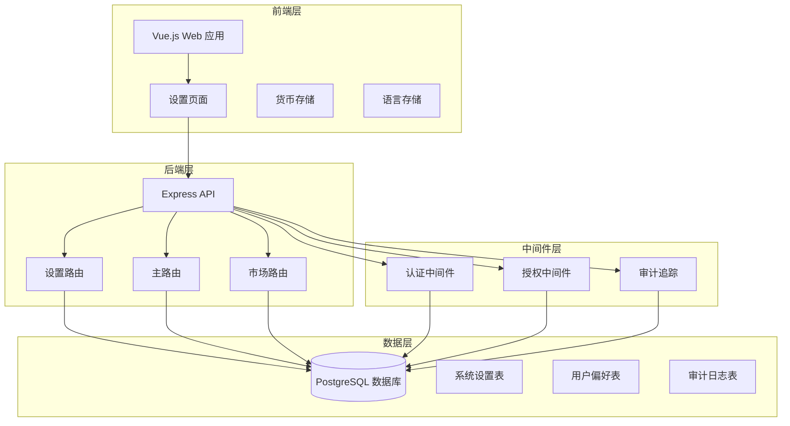
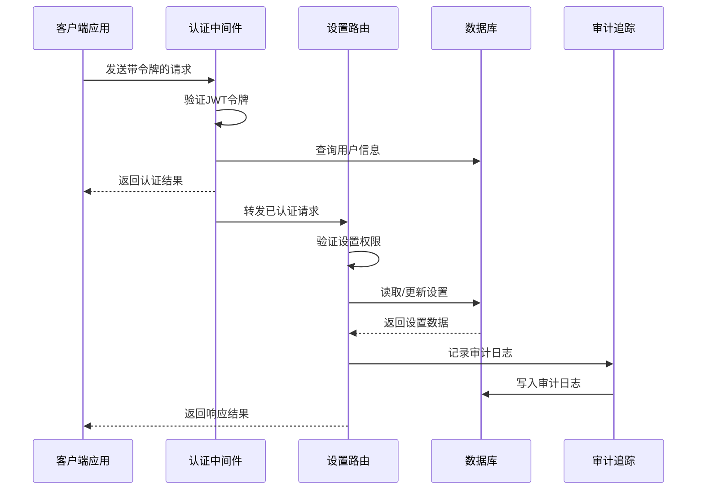
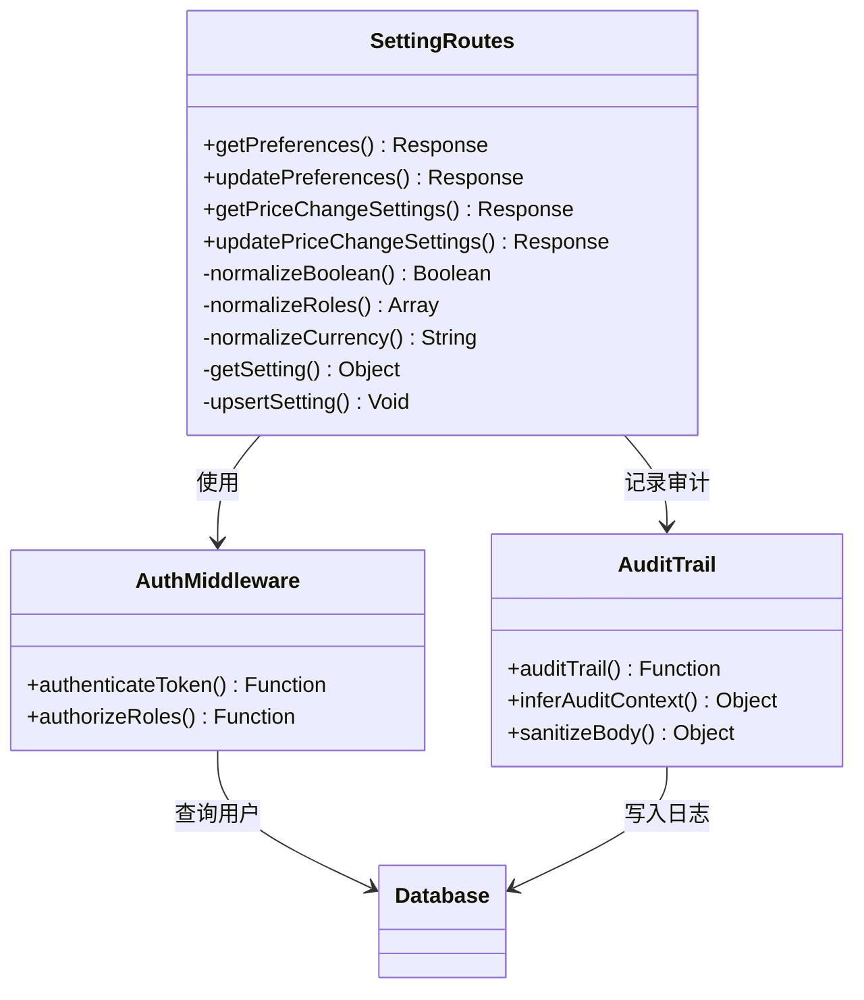
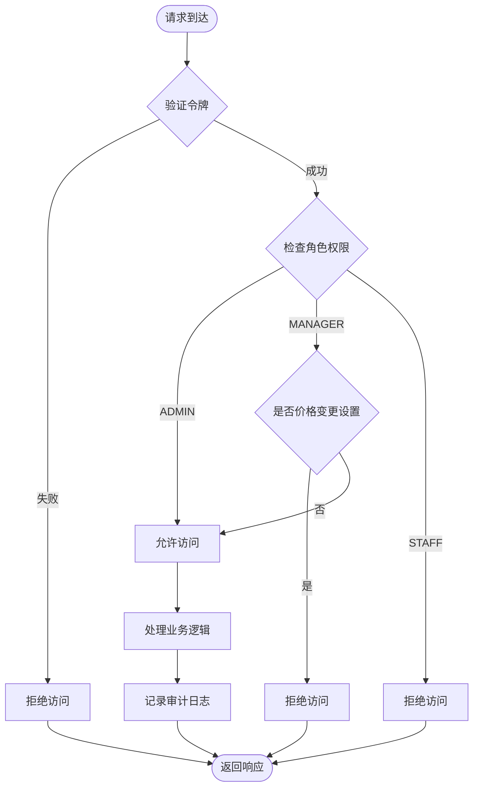
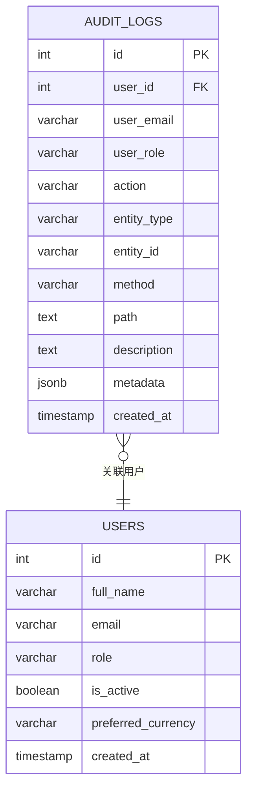
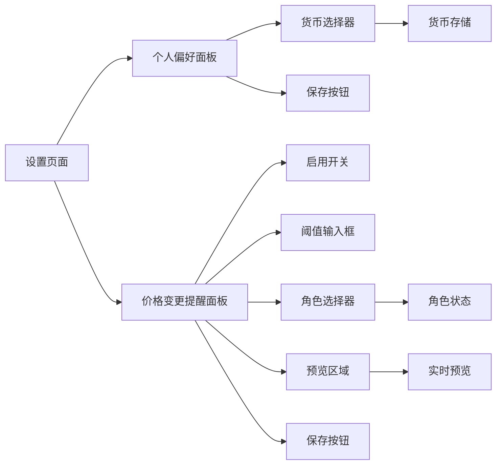
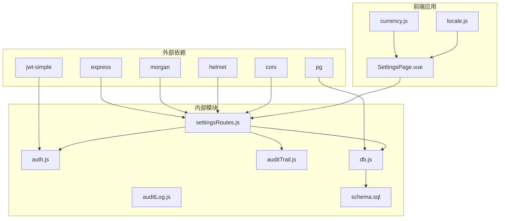

# 系统设置管理

<cite>
**本文档引用的文件**
- [settingsRoutes.js](file://server/src/routes/settingsRoutes.js)
- [auth.js](file://server/src/middleware/auth.js)
- [auditTrail.js](file://server/src/middleware/auditTrail.js)
- [auditLog.js](file://server/src/utils/auditLog.js)
- [schema.sql](file://server/database/schema.sql)
- [app.js](file://server/src/app.js)
- [SettingsPage.vue](file://web/src/pages/SettingsPage.vue)
- [currency.js](file://web/src/stores/currency.js)
- [locale.js](file://web/src/stores/locale.js)
- [marketplaceRoutes.js](file://server/src/routes/marketplaceRoutes.js)
- [marketplaceSyncService.js](file://server/src/services/marketplaceSyncService.js)
- [masterRoutes.js](file://server/src/routes/masterRoutes.js)
- [wrangler.jsonc](file://web/wrangler.jsonc)
</cite>

## 目录
1. [简介](#简介)
2. [项目结构](#项目结构)
3. [核心组件](#核心组件)
4. [架构概览](#架构概览)
5. [详细组件分析](#详细组件分析)
6. [依赖关系分析](#依赖关系分析)
7. [性能考虑](#性能考虑)
8. [故障排除指南](#故障排除指南)
9. [结论](#结论)
10. [附录](#附录)

## 简介

系统设置管理是库存管理系统的核心功能模块，负责管理系统的配置参数、用户偏好设置、权限控制和仓库配置等关键设置。该模块提供了完整的设置管理生命周期，包括设置项的分类、验证规则、权限控制、持久化存储和审计追踪。

系统设置管理功能涵盖了多个维度的配置管理：

- **用户偏好设置**：个人货币偏好、界面语言设置
- **系统策略设置**：价格变动提醒阈值、通知策略
- **权限控制设置**：基于角色的访问控制
- **仓库配置设置**：仓储管理参数
- **市场连接设置**：第三方平台集成配置

## 项目结构

系统设置管理功能在前后端采用分层架构设计，确保了良好的可维护性和扩展性。

**图表来源**
- [app.js:26-56](file://server/src/app.js#L26-L56)
- [settingsRoutes.js:1-144](file://server/src/routes/settingsRoutes.js#L1-L144)
- [schema.sql:390-396](file://server/database/schema.sql#L390-L396)

**章节来源**
- [app.js:1-67](file://server/src/app.js#L1-L67)
- [schema.sql:1-447](file://server/database/schema.sql#L1-L447)

## 核心组件

系统设置管理由多个核心组件协同工作，每个组件都有明确的职责分工：

### 设置路由组件
设置路由组件负责处理所有设置相关的HTTP请求，包括用户偏好设置和系统策略设置的CRUD操作。

### 认证与授权中间件
认证中间件负责验证用户身份，授权中间件根据用户角色控制访问权限，确保只有具备相应权限的用户才能修改系统设置。

### 审计追踪组件
审计追踪组件记录所有重要的设置变更操作，包括操作时间、操作人、操作类型和详细的操作内容，为系统安全和合规提供保障。

### 数据存储组件
系统设置数据存储在专用的数据库表中，支持灵活的键值对存储方式，便于扩展新的设置项。

**章节来源**
- [settingsRoutes.js:1-144](file://server/src/routes/settingsRoutes.js#L1-L144)
- [auth.js:1-46](file://server/src/middleware/auth.js#L1-L46)
- [auditTrail.js:1-84](file://server/src/middleware/auditTrail.js#L1-L84)
- [schema.sql:390-396](file://server/database/schema.sql#L390-L396)

## 架构概览

系统设置管理采用RESTful API架构，结合前后端分离的设计模式，实现了高效的设置管理功能。

**图表来源**
- [auth.js:5-29](file://server/src/middleware/auth.js#L5-L29)
- [settingsRoutes.js:7-141](file://server/src/routes/settingsRoutes.js#L7-L141)
- [auditTrail.js:47-79](file://server/src/middleware/auditTrail.js#L47-L79)

系统架构的关键特点：

1. **分层设计**：清晰的前后端分离，中间件层提供横切关注点
2. **权限控制**：基于角色的细粒度权限管理
3. **审计追踪**：完整的操作日志记录机制
4. **数据持久化**：可靠的数据库存储方案

## 详细组件分析

### 设置路由组件分析

设置路由组件是系统设置管理的核心，负责处理所有设置相关的业务逻辑。

#### 设置项分类与默认值

系统设置主要分为以下几类：

**用户偏好设置**
- 货币偏好：默认值为MYR，支持MYR和USD两种货币
- 界面语言：通过前端存储管理，支持中英文切换

**系统策略设置**
- 价格变动提醒阈值：默认10%，范围0-1000%
- 通知策略：默认启用，针对ADMIN和MANAGER角色
- 仓库配置：支持多仓库管理

**图表来源**
- [settingsRoutes.js:9-52](file://server/src/routes/settingsRoutes.js#L9-L52)
- [auth.js:32-40](file://server/src/middleware/auth.js#L32-L40)
- [auditTrail.js:14-45](file://server/src/middleware/auditTrail.js#L14-L45)

#### 设置验证规则

系统设置了严格的验证规则确保数据完整性：

**数值验证**
- 阈值百分比必须在0-1000范围内
- 支持小数点后两位精度

**枚举验证**
- 货币类型必须为MYR或USD
- 角色类型必须为ADMIN、MANAGER或STAFF

**必填验证**
- 通知启用时必须至少指定一个角色
- 用户偏好更新需要有效的货币代码

**章节来源**
- [settingsRoutes.js:108-141](file://server/src/routes/settingsRoutes.js#L108-L141)

### 权限控制机制

系统采用基于角色的权限控制（RBAC）机制，确保设置操作的安全性。

**图表来源**
- [auth.js:32-40](file://server/src/middleware/auth.js#L32-L40)
- [settingsRoutes.js:85-106](file://server/src/routes/settingsRoutes.js#L85-L106)

权限控制的关键特性：

1. **角色分级**：ADMIN拥有最高权限，MANAGER次之，STAFF权限最少
2. **功能隔离**：不同设置功能对角色有不同的要求
3. **动态验证**：运行时验证用户权限，确保安全性

**章节来源**
- [auth.js:32-40](file://server/src/middleware/auth.js#L32-L40)
- [settingsRoutes.js:85-106](file://server/src/routes/settingsRoutes.js#L85-L106)

### 审计追踪系统

系统实现了完整的审计追踪机制，记录所有重要的设置变更操作。

#### 审计日志结构

**图表来源**
- [auditTrail.js:57-72](file://server/src/middleware/auditTrail.js#L57-L72)
- [auditLog.js:1-33](file://server/src/utils/auditLog.js#L1-L33)

审计追踪的关键功能：

1. **自动上下文推断**：根据URL路径自动识别操作类型
2. **敏感信息过滤**：自动过滤密码等敏感字段
3. **统一格式化**：标准化所有审计日志格式
4. **异步写入**：不影响主业务流程的性能

**章节来源**
- [auditTrail.js:14-79](file://server/src/middleware/auditTrail.js#L14-L79)
- [auditLog.js:1-38](file://server/src/utils/auditLog.js#L1-L38)

### 前端设置界面

前端设置界面提供了直观的用户交互体验，支持实时预览和即时保存。

#### 设置界面组件结构

**图表来源**
- [SettingsPage.vue:15-104](file://web/src/pages/SettingsPage.vue#L15-L104)

前端界面的关键特性：

1. **响应式设计**：适配不同屏幕尺寸
2. **实时验证**：输入时进行客户端验证
3. **状态同步**：设置变更立即反映到应用状态
4. **错误处理**：友好的错误提示和恢复机制

**章节来源**
- [SettingsPage.vue:1-259](file://web/src/pages/SettingsPage.vue#L1-L259)
- [currency.js:1-21](file://web/src/stores/currency.js#L1-L21)
- [locale.js:1-38](file://web/src/stores/locale.js#L1-L38)

## 依赖关系分析

系统设置管理模块的依赖关系体现了清晰的分层架构设计。

**图表来源**
- [app.js:1-67](file://server/src/app.js#L1-L67)
- [settingsRoutes.js:1-7](file://server/src/routes/settingsRoutes.js#L1-L7)
- [schema.sql:390-396](file://server/database/schema.sql#L390-L396)

### 核心依赖关系

1. **认证依赖**：设置路由依赖认证中间件进行用户身份验证
2. **数据库依赖**：所有设置操作都依赖数据库连接进行数据持久化
3. **审计依赖**：设置路由依赖审计中间件记录操作日志
4. **前端依赖**：前端设置页面依赖后端API提供数据和服务

### 循环依赖检测

经过分析，系统设置管理模块没有发现循环依赖问题：

- 路由层不依赖控制器层
- 中间件层独立于业务逻辑
- 数据访问层与业务逻辑分离
- 前后端通过API接口通信

**章节来源**
- [app.js:1-67](file://server/src/app.js#L1-L67)
- [settingsRoutes.js:1-144](file://server/src/routes/settingsRoutes.js#L1-L144)

## 性能考虑

系统设置管理模块在设计时充分考虑了性能优化，采用了多种策略确保系统的高效运行。

### 缓存策略

系统采用多层次缓存策略：

1. **内存缓存**：热门设置项缓存在内存中，减少数据库查询
2. **浏览器缓存**：前端设置界面利用浏览器缓存提升用户体验
3. **数据库索引**：为常用查询字段建立索引，优化查询性能

### 异步处理

对于耗时的操作，系统采用异步处理机制：

- 审计日志写入采用异步方式，不影响主业务流程
- 批量设置更新使用Promise.all并行处理
- 大数据量的设置查询采用分页机制

### 连接池管理

数据库连接采用连接池管理：

- 合理配置连接池大小，平衡资源使用和性能
- 自动连接复用，减少连接建立开销
- 连接超时和重试机制，提高系统稳定性

## 故障排除指南

系统设置管理模块提供了完善的错误处理和故障排除机制。

### 常见错误类型

**认证相关错误**
- 令牌过期或无效：重新登录获取新令牌
- 用户被禁用：联系管理员恢复账户
- 令牌缺失：检查前端是否正确携带Authorization头

**权限相关错误**
- 权限不足：确认用户角色是否具备相应权限
- 功能限制：某些设置只能由特定角色访问
- 会话失效：重新登录后重试操作

**数据验证错误**
- 数值范围错误：检查输入值是否在允许范围内
- 枚举值错误：确认选择的值是否在允许集合中
- 必填字段缺失：检查所有必需字段是否已填写

### 调试工具

系统提供了多种调试工具帮助定位问题：

**审计日志分析**
- 查看完整的操作历史记录
- 分析操作时间和用户信息
- 追踪设置变更的影响范围

**API调试**
- 使用Postman测试API端点
- 检查请求和响应格式
- 分析错误响应信息

**前端调试**
- 浏览器开发者工具
- 网络请求监控
- 控制台错误输出

**章节来源**
- [auditTrail.js:74-75](file://server/src/middleware/auditTrail.js#L74-L75)
- [settingsRoutes.js:60-82](file://server/src/routes/settingsRoutes.js#L60-L82)

## 结论

系统设置管理模块通过合理的架构设计和严格的实现规范，为库存管理系统提供了强大而灵活的配置管理能力。模块具有以下显著优势：

1. **安全性**：完善的认证授权机制确保设置操作的安全性
2. **可维护性**：清晰的分层架构便于代码维护和功能扩展
3. **可观测性**：完整的审计追踪提供全面的操作监控
4. **用户体验**：直观的前端界面和实时反馈提升用户满意度
5. **性能**：优化的缓存策略和异步处理保证系统响应速度

该模块为系统的稳定运行和持续发展奠定了坚实的基础，能够满足企业级库存管理的各种配置需求。

## 附录

### 设置项完整列表

| 设置键 | 类型 | 默认值 | 描述 | 权限级别 |
|--------|------|--------|------|----------|
| PRICE_CHANGE_ALERT_THRESHOLD_PERCENT | 数值 | 10 | 价格变动提醒阈值(%) | ADMIN |
| PRICE_CHANGE_NOTIFICATIONS_ENABLED | 布尔 | true | 是否启用价格变动通知 | ADMIN |
| PRICE_CHANGE_NOTIFY_ROLES | 枚举数组 | ['ADMIN','MANAGER'] | 接收通知的角色 | ADMIN |

### API端点定义

| 方法 | 路径 | 权限 | 功能描述 |
|------|------|------|----------|
| GET | /api/settings/preferences | 所有用户 | 获取用户偏好设置 |
| PUT | /api/settings/preferences | 所有用户 | 更新用户偏好设置 |
| GET | /api/settings/price-change | ADMIN | 获取价格变动提醒设置 |
| PUT | /api/settings/price-change | ADMIN | 更新价格变动提醒设置 |

### 配置备份建议

1. **定期备份**：建议每周进行一次完整的数据库备份
2. **版本控制**：重要设置变更应记录在版本控制系统中
3. **增量备份**：对频繁变更的设置项进行增量备份
4. **异地备份**：重要数据应进行异地备份存储