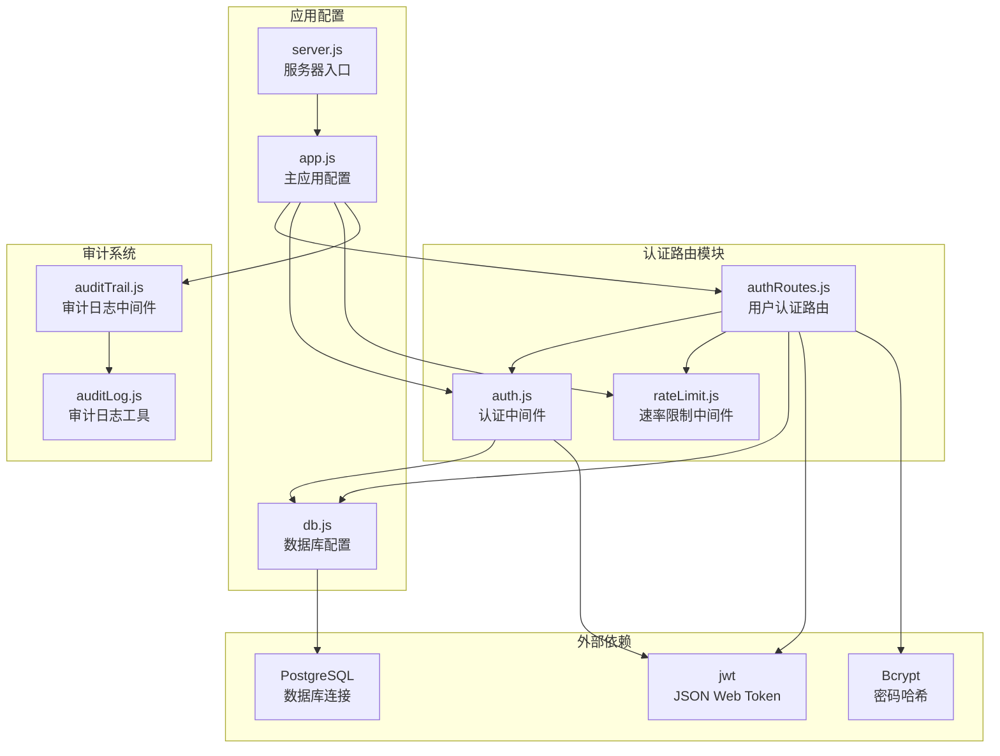
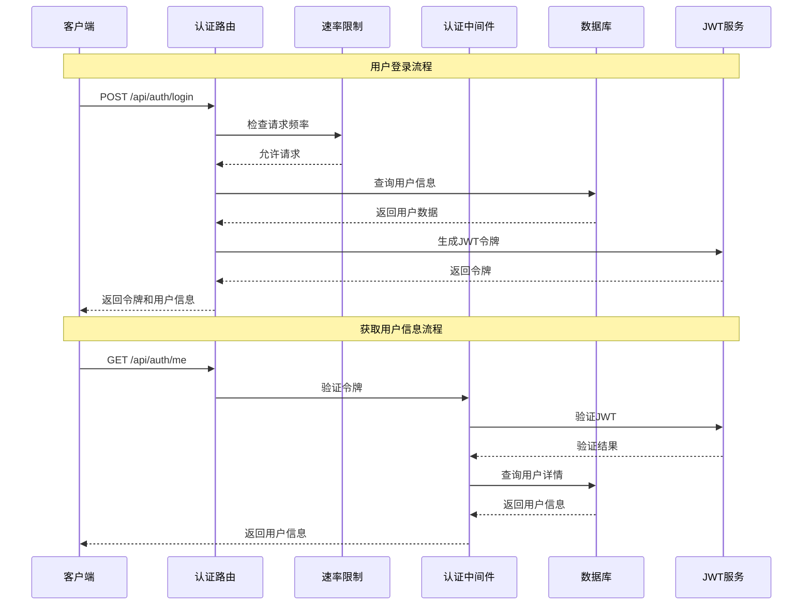
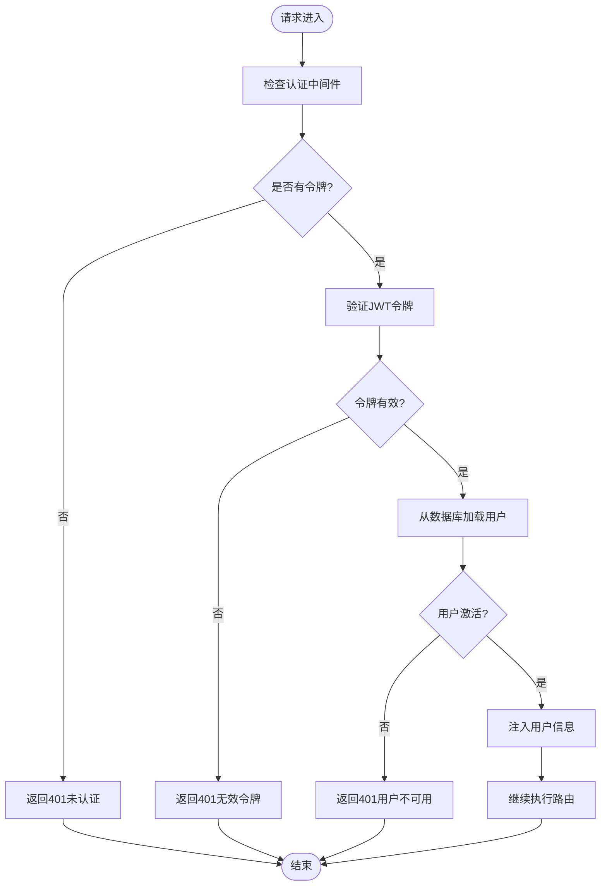
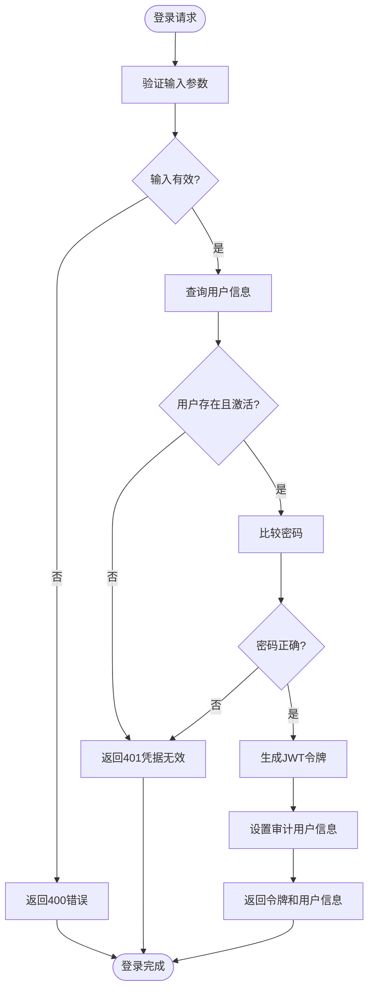
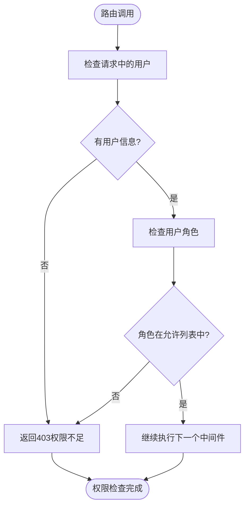
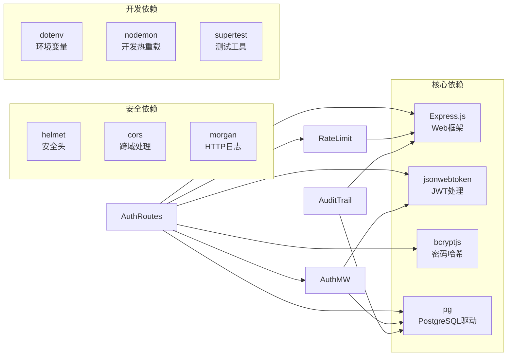
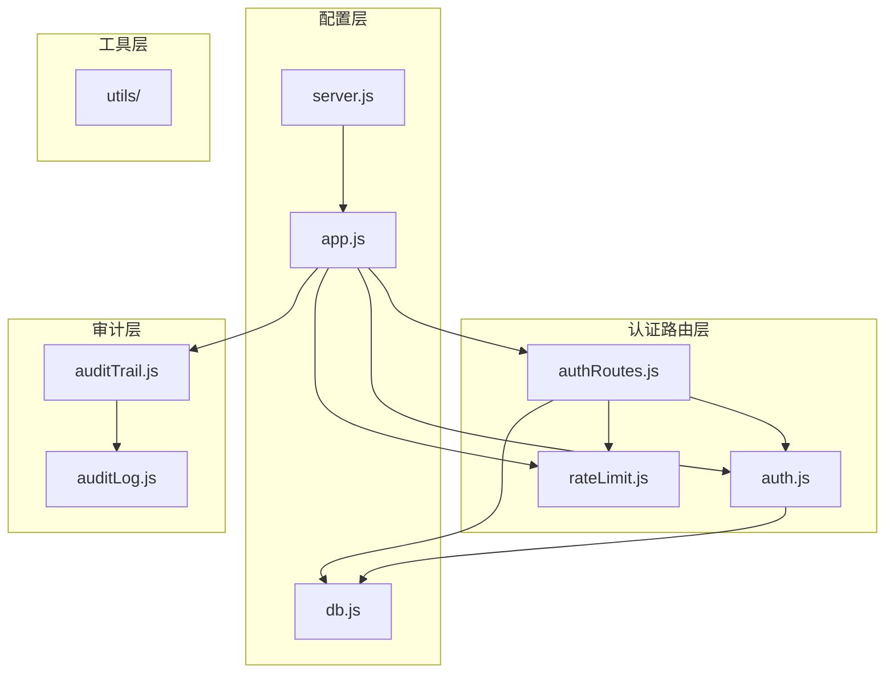

# 认证路由

<cite>
**本文档引用的文件**
- [authRoutes.js](file://server/src/routes/authRoutes.js)
- [auth.js](file://server/src/middleware/auth.js)
- [rateLimit.js](file://server/src/middleware/rateLimit.js)
- [app.js](file://server/src/app.js)
- [db.js](file://server/src/config/db.js)
- [auditTrail.js](file://server/src/middleware/auditTrail.js)
- [auditLog.js](file://server/src/utils/auditLog.js)
- [server.js](file://server/src/server.js)
- [package.json](file://server/package.json)
</cite>

## 目录
1. [简介](#简介)
2. [项目结构](#项目结构)
3. [核心组件](#核心组件)
4. [架构概览](#架构概览)
5. [详细组件分析](#详细组件分析)
6. [依赖关系分析](#依赖关系分析)
7. [性能考虑](#性能考虑)
8. [故障排除指南](#故障排除指南)
9. [结论](#结论)

## 简介

认证路由模块是库存管理系统的核心安全组件，负责处理用户身份验证、授权和会话管理。该模块实现了完整的JWT（JSON Web Token）认证机制，包括用户登录、令牌验证、权限控制和速率限制等功能。系统采用现代化的安全实践，确保用户数据的安全性和系统的稳定性。

## 项目结构

认证路由模块位于服务器端代码的特定目录结构中，与中间件、配置和工具函数协同工作：

**图表来源**
- [authRoutes.js:1-72](file://server/src/routes/authRoutes.js#L1-L72)
- [auth.js:1-46](file://server/src/middleware/auth.js#L1-L46)
- [rateLimit.js:1-40](file://server/src/middleware/rateLimit.js#L1-L40)
- [app.js:1-67](file://server/src/app.js#L1-L67)

**章节来源**
- [authRoutes.js:1-72](file://server/src/routes/authRoutes.js#L1-L72)
- [auth.js:1-46](file://server/src/middleware/auth.js#L1-L46)
- [rateLimit.js:1-40](file://server/src/middleware/rateLimit.js#L1-L40)
- [app.js:1-67](file://server/src/app.js#L1-L67)

## 核心组件

### 认证路由控制器

认证路由模块提供了两个核心路由：
- **POST /api/auth/login** - 用户登录接口，处理用户名密码验证并生成JWT令牌
- **GET /api/auth/me** - 获取当前登录用户信息接口，需要有效的认证令牌

### 认证中间件

认证中间件负责：
- 验证JWT令牌的有效性
- 从令牌中提取用户信息
- 将用户对象注入到请求上下文中
- 实现基于角色的权限控制

### 速率限制中间件

速率限制中间件提供：
- 基于IP地址的请求频率控制
- 可配置的时间窗口和最大请求数
- 自定义的错误响应格式

**章节来源**
- [authRoutes.js:16-69](file://server/src/routes/authRoutes.js#L16-L69)
- [auth.js:4-29](file://server/src/middleware/auth.js#L4-L29)
- [rateLimit.js:9-35](file://server/src/middleware/rateLimit.js#L9-L35)

## 架构概览

认证系统的整体架构采用分层设计，确保了清晰的关注点分离和良好的可维护性：

**图表来源**
- [authRoutes.js:17-69](file://server/src/routes/authRoutes.js#L17-L69)
- [auth.js:5-29](file://server/src/middleware/auth.js#L5-L29)

### 数据流图

**图表来源**
- [auth.js:5-29](file://server/src/middleware/auth.js#L5-L29)

## 详细组件分析

### 认证路由实现

#### 登录路由 (POST /api/auth/login)

登录路由实现了完整的用户身份验证流程：

**图表来源**
- [authRoutes.js:17-64](file://server/src/routes/authRoutes.js#L17-L64)

#### 用户信息路由 (GET /api/auth/me)

用户信息路由提供了令牌验证后的用户信息获取功能：

**章节来源**
- [authRoutes.js:17-64](file://server/src/routes/authRoutes.js#L17-L64)
- [authRoutes.js:67-69](file://server/src/routes/authRoutes.js#L67-L69)

### JWT令牌机制

#### 令牌生成

系统使用JWT作为认证令牌，具有以下特性：
- **有效期**：8小时（8h）
- **签名算法**：使用环境变量中的JWT_SECRET密钥
- **载荷内容**：包含用户ID和角色信息

#### 令牌验证

令牌验证过程包括多个安全检查：
- **格式验证**：检查Authorization头部格式
- **签名验证**：使用相同的密钥验证令牌完整性
- **过期时间检查**：自动检测令牌是否过期
- **用户状态验证**：确认用户仍然激活

**章节来源**
- [authRoutes.js:41-43](file://server/src/routes/authRoutes.js#L41-L43)
- [auth.js:13-28](file://server/src/middleware/auth.js#L13-L28)

### 速率限制实现

#### 速率限制器设计

系统实现了基于内存的速率限制器，具有以下特点：
- **命名空间隔离**：不同的路由可以有不同的限制策略
- **IP地址识别**：支持通过X-Forwarded-For头识别真实客户端IP
- **滑动窗口算法**：实现精确的时间窗口控制
- **动态配置**：支持运行时配置窗口大小和最大请求数

#### 登录速率限制配置

登录路由使用专门的速率限制器：
- **命名空间**：auth-login
- **时间窗口**：60秒
- **最大请求数**：10次
- **触发条件**：超过限制时返回429状态码

**章节来源**
- [rateLimit.js:9-35](file://server/src/middleware/rateLimit.js#L9-L35)
- [authRoutes.js:10-14](file://server/src/routes/authRoutes.js#L10-L14)

### 权限控制机制

#### 角色基础访问控制

系统实现了基于角色的权限控制：
- **authorizeRoles中间件**：根据指定的角色列表进行权限检查
- **内置角色**：系统支持不同级别的用户角色
- **权限继承**：更高级别的角色自动拥有较低级别角色的权限

#### 中间件执行流程

**图表来源**
- [auth.js:32-40](file://server/src/middleware/auth.js#L32-L40)

**章节来源**
- [auth.js:31-40](file://server/src/middleware/auth.js#L31-L40)

### 审计日志集成

#### 自动审计功能

系统集成了自动审计日志记录功能：
- **登录审计**：自动记录成功的用户登录事件
- **敏感信息过滤**：自动过滤密码等敏感字段
- **上下文推断**：智能推断操作类型和实体信息
- **异步记录**：不影响主要业务流程的性能

#### 审计日志内容

审计日志包含以下关键信息：
- **用户标识**：用户ID、邮箱、角色
- **操作信息**：操作类型、实体类型、实体ID
- **请求详情**：HTTP方法、路径、状态码
- **元数据**：请求体摘要、响应时间等

**章节来源**
- [auditTrail.js:14-45](file://server/src/middleware/auditTrail.js#L14-L45)
- [auditTrail.js:47-79](file://server/src/middleware/auditTrail.js#L47-L79)
- [auditLog.js:1-33](file://server/src/utils/auditLog.js#L1-L33)

## 依赖关系分析

### 外部依赖

认证系统依赖以下关键外部库：

**图表来源**
- [package.json:15-25](file://server/package.json#L15-L25)

### 内部依赖关系

**图表来源**
- [app.js:9-25](file://server/src/app.js#L9-L25)
- [server.js:1-28](file://server/src/server.js#L1-L28)

**章节来源**
- [package.json:15-25](file://server/package.json#L15-L25)
- [app.js:9-25](file://server/src/app.js#L9-L25)

## 性能考虑

### 缓存策略

系统采用了多层缓存策略来优化性能：
- **令牌缓存**：JWT令牌在内存中缓存，减少重复验证开销
- **用户信息缓存**：最近使用的用户信息在内存中缓存
- **数据库连接池**：使用连接池管理数据库连接，提高连接复用率

### 内存管理

速率限制器使用Map数据结构存储请求统计信息：
- **内存占用**：每个客户端IP占用固定内存空间
- **过期清理**：自动清理过期的请求统计信息
- **内存限制**：建议在生产环境中监控内存使用情况

### 数据库优化

- **索引优化**：用户表的email字段应建立唯一索引
- **查询优化**：使用参数化查询防止SQL注入
- **连接超时**：配置合理的数据库连接超时时间

## 故障排除指南

### 常见问题诊断

#### 认证失败问题

**问题现象**：用户无法登录或令牌验证失败
**可能原因**：
- JWT_SECRET环境变量配置错误
- 令牌过期或格式不正确
- 用户账户被禁用
- 密码哈希不匹配

**解决方案**：
1. 检查JWT_SECRET环境变量是否正确配置
2. 验证令牌格式是否符合Bearer模式
3. 确认用户账户状态为激活
4. 重新生成密码哈希

#### 速率限制问题

**问题现象**：用户频繁登录被限制
**可能原因**：
- 速率限制配置过于严格
- 客户端IP地址识别错误
- 速率限制器内存泄漏

**解决方案**：
1. 调整登录速率限制配置
2. 检查代理服务器的X-Forwarded-For头
3. 监控内存使用情况

#### 审计日志问题

**问题现象**：审计日志记录异常
**可能原因**：
- 数据库连接失败
- 审计日志表结构不正确
- 异步写入失败

**解决方案**：
1. 检查数据库连接配置
2. 验证audit_logs表结构
3. 查看服务器错误日志

**章节来源**
- [auth.js:9-28](file://server/src/middleware/auth.js#L9-L28)
- [rateLimit.js:23-29](file://server/src/middleware/rateLimit.js#L23-L29)
- [auditTrail.js:73-75](file://server/src/middleware/auditTrail.js#L73-L75)

### 错误处理机制

系统实现了多层次的错误处理：
- **路由级错误处理**：捕获路由中的异常并转换为标准格式
- **中间件级错误处理**：在认证和速率限制中间件中处理错误
- **全局错误处理**：统一处理未捕获的异常

**章节来源**
- [app.js:57-64](file://server/src/app.js#L57-L64)

## 结论

认证路由模块是一个设计精良、安全性高的用户身份验证系统。它采用了现代的JWT认证机制，结合了速率限制、审计日志和权限控制等多种安全措施。系统具有良好的可扩展性，支持自定义的权限策略和审计规则。

### 主要优势

1. **安全性**：采用JWT令牌、密码哈希和多层验证机制
2. **可扩展性**：模块化设计支持功能扩展和定制
3. **可观测性**：完整的审计日志和错误处理机制
4. **性能**：内存缓存和连接池优化提升性能

### 最佳实践建议

1. **环境配置**：确保JWT_SECRET密钥的安全存储和定期轮换
2. **监控告警**：建立认证相关的监控和告警机制
3. **定期审计**：定期审查认证日志和权限配置
4. **安全更新**：及时更新依赖包以修复安全漏洞

该认证系统为库存管理系统的安全运行提供了坚实的基础，建议在生产环境中配合其他安全措施共同使用，如HTTPS加密传输、防火墙配置等。