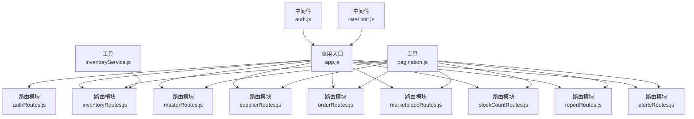
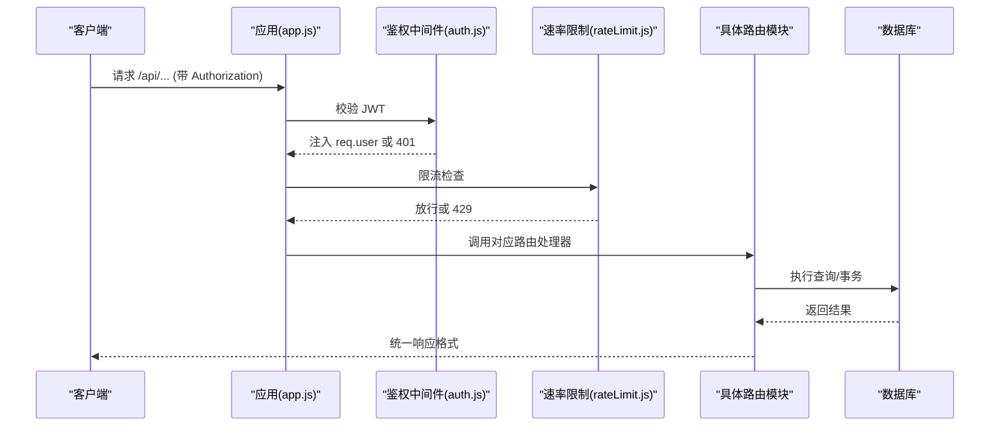
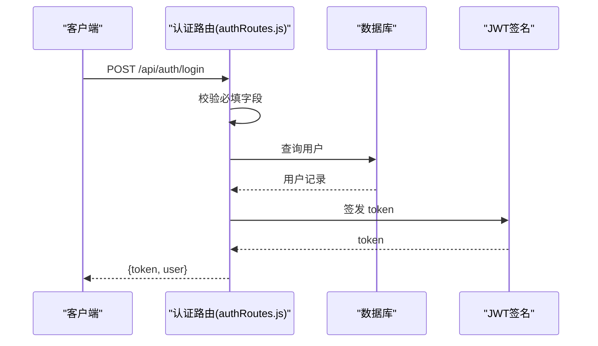
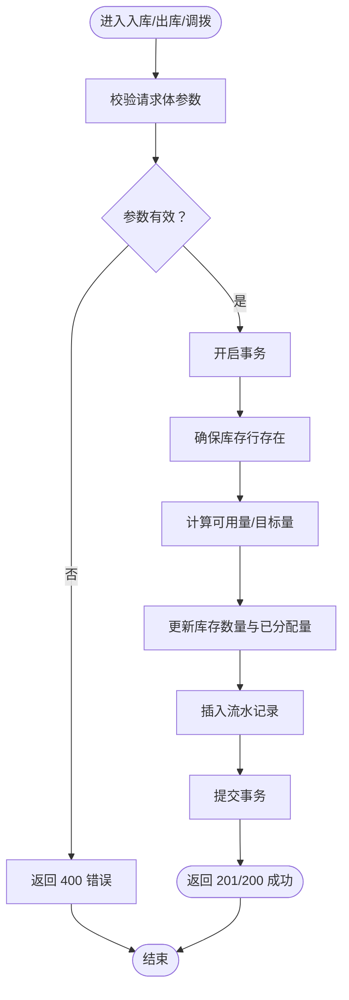
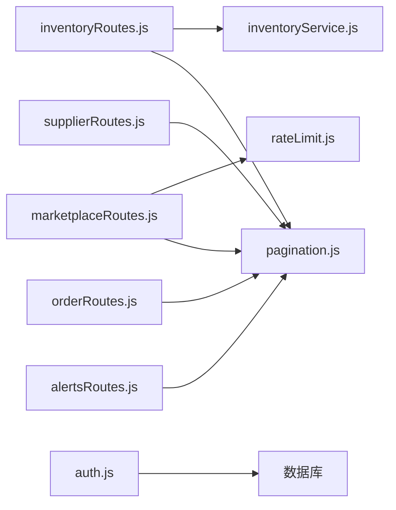

# 路由系统

<cite>
**本文引用的文件**
- [app.js](file://server/src/app.js)
- [authRoutes.js](file://server/src/routes/authRoutes.js)
- [inventoryRoutes.js](file://server/src/routes/inventoryRoutes.js)
- [masterRoutes.js](file://server/src/routes/masterRoutes.js)
- [supplierRoutes.js](file://server/src/routes/supplierRoutes.js)
- [orderRoutes.js](file://server/src/routes/orderRoutes.js)
- [marketplaceRoutes.js](file://server/src/routes/marketplaceRoutes.js)
- [stockCountRoutes.js](file://server/src/routes/stockCountRoutes.js)
- [reportRoutes.js](file://server/src/routes/reportRoutes.js)
- [alertsRoutes.js](file://server/src/routes/alertsRoutes.js)
- [auth.js](file://server/src/middleware/auth.js)
- [rateLimit.js](file://server/src/middleware/rateLimit.js)
- [pagination.js](file://server/src/utils/pagination.js)
- [inventoryService.js](file://server/src/utils/inventoryService.js)
</cite>

## 目录
1. [简介](#简介)
2. [项目结构](#项目结构)
3. [核心组件](#核心组件)
4. [架构总览](#架构总览)
5. [详细组件分析](#详细组件分析)
6. [依赖关系分析](#依赖关系分析)
7. [性能考量](#性能考量)
8. [故障排查指南](#故障排查指南)
9. [结论](#结论)
10. [附录](#附录)

## 简介
本文件面向库存管理系统的路由系统，系统采用 Express 框架与模块化路由设计，遵循 RESTful API 设计原则，统一使用 /api 前缀进行版本化路由组织。路由模块按业务域划分（认证、库存、主数据、供应商、订单与市场对接、盘点、报表、告警等），并通过中间件实现鉴权、速率限制、审计日志与统一响应格式。本文档从设计原则、URL 结构、HTTP 方法映射、参数处理、查询解析、请求体验证、安全与访问控制、性能优化与错误处理等方面进行全面阐述。

## 项目结构
- 后端应用通过 app.js 统一注册中间件与路由模块，并在根路径 / 下挂载 /api 子路由，实现版本化与模块化管理。
- 路由模块按功能域拆分至 server/src/routes 目录，每个模块独立导出路由器实例。
- 中间件位于 server/src/middleware，包括鉴权、速率限制、审计与统一响应格式。
- 工具函数位于 server/src/utils，如分页、库存服务封装等。

**图表来源**
- [app.js:36-56](file://server/src/app.js#L36-L56)
- [authRoutes.js:8](file://server/src/routes/authRoutes.js#L8)
- [inventoryRoutes.js:8](file://server/src/routes/inventoryRoutes.js#L8)
- [masterRoutes.js:9](file://server/src/routes/masterRoutes.js#L9)
- [supplierRoutes.js:6](file://server/src/routes/supplierRoutes.js#L6)
- [orderRoutes.js:8](file://server/src/routes/orderRoutes.js#L8)
- [marketplaceRoutes.js:10](file://server/src/routes/marketplaceRoutes.js#L10)
- [stockCountRoutes.js:6](file://server/src/routes/stockCountRoutes.js#L6)
- [reportRoutes.js:7](file://server/src/routes/reportRoutes.js#L7)
- [alertsRoutes.js:6](file://server/src/routes/alertsRoutes.js#L6)
- [auth.js:5-29](file://server/src/middleware/auth.js#L5-L29)
- [rateLimit.js:9-35](file://server/src/middleware/rateLimit.js#L9-L35)
- [pagination.js:2-27](file://server/src/utils/pagination.js#L2-L27)
- [inventoryService.js:1-45](file://server/src/utils/inventoryService.js#L1-L45)

**章节来源**
- [app.js:28-56](file://server/src/app.js#L28-L56)

## 核心组件
- 鉴权中间件 authenticateToken：从 Authorization 头提取 Bearer Token，校验 JWT 并回查用户状态，失败返回 401。
- 角色授权中间件 authorizeRoles：基于用户角色进行访问控制，未授权返回 403。
- 速率限制中间件 createRateLimiter：基于客户端 IP 与命名空间的滑动窗口限流，超过阈值返回 429。
- 统一分页工具 getPaginationParams/buildPagination：标准化分页参数与返回结构，避免重复逻辑。
- 库存服务封装 inventoryService：统一封装库存行确保、查询与更新，保证事务一致性。

**章节来源**
- [auth.js:5-40](file://server/src/middleware/auth.js#L5-L40)
- [rateLimit.js:9-35](file://server/src/middleware/rateLimit.js#L9-L35)
- [pagination.js:2-27](file://server/src/utils/pagination.js#L2-L27)
- [inventoryService.js:1-45](file://server/src/utils/inventoryService.js#L1-L45)

## 架构总览
- 版本化路由：所有业务路由均以 /api 前缀挂载，便于未来版本演进与多版本共存。
- 模块化组织：按领域拆分路由模块，职责清晰，便于维护与扩展。
- 安全与审计：全局中间件统一注入安全头、CORS、日志、统一响应与审计日志。
- 统一错误处理：兜底中间件捕获异常，避免堆栈泄露，返回结构化错误。

**图表来源**
- [app.js:28-64](file://server/src/app.js#L28-L64)
- [auth.js:5-29](file://server/src/middleware/auth.js#L5-L29)
- [rateLimit.js:9-35](file://server/src/middleware/rateLimit.js#L9-L35)

**章节来源**
- [app.js:28-64](file://server/src/app.js#L28-L64)

## 详细组件分析

### 认证路由模块（/api/auth）
- 设计原则
  - 使用 Bearer Token 进行无状态鉴权；登录接口返回 token 与用户信息；刷新接口用于恢复登录态。
  - 登录接口使用速率限制，防止暴力破解。
- URL 结构与 HTTP 方法
  - POST /api/auth/login：登录，返回 token 与用户信息。
  - GET /api/auth/me：获取当前用户信息。
- 参数处理与请求体验证
  - 登录接口要求 email 与 password，缺失则返回 400。
  - 鉴权中间件从 Authorization 头解析 Bearer Token。
- 错误处理
  - 无效或过期 token 返回 401；内部错误返回 500。

**图表来源**
- [authRoutes.js:17-64](file://server/src/routes/authRoutes.js#L17-L64)

**章节来源**
- [authRoutes.js:10-69](file://server/src/routes/authRoutes.js#L10-L69)

### 库存路由模块（/api/inventory）
- 设计原则
  - 全局启用 authenticateToken；部分操作启用 authorizeRoles 进行角色控制。
  - 提供库存总览、流水查询、入库/出库/调拨、库存分配等能力。
  - 使用事务与库存服务封装，保证数据一致性。
- URL 结构与 HTTP 方法
  - GET /api/inventory：库存总览（支持搜索、分类、仓库、低库存筛选、分页）。
  - GET /api/inventory/transactions：最近流水（支持搜索、类型筛选、分页）。
  - POST /api/inventory/stock-in：入库（ADMIN/MANAGER/STAFF）。
  - POST /api/inventory/stock-out：出库（ADMIN/MANAGER/STAFF）。
  - POST /api/inventory/transfer：调拨（ADMIN/MANAGER）。
  - POST /api/inventory/allocate：库存分配/释放（ADMIN/MANAGER/STAFF）。
- 参数处理与请求体验证
  - 入库/出库/调拨需提供 productId、quantity 等；调拨需提供源仓与目的仓。
  - 分配模式仅允许 reserve/release；数量必须为正数。
- 错误处理
  - 库存不足、参数非法、事务回滚等场景返回 400；内部错误返回 500。

**图表来源**
- [inventoryRoutes.js:229-415](file://server/src/routes/inventoryRoutes.js#L229-L415)
- [inventoryService.js:1-45](file://server/src/utils/inventoryService.js#L1-L45)

**章节来源**
- [inventoryRoutes.js:10-492](file://server/src/routes/inventoryRoutes.js#L10-L492)

### 主数据路由模块（/api）
- 设计原则
  - 全局启用 authenticateToken；部分接口启用 authorizeRoles。
  - 提供用户、分类、仓库等主数据的增删改查与分页搜索。
  - 内置成本访问令牌机制，支持敏感字段的条件性可见性。
- URL 结构与 HTTP 方法
  - 用户管理：GET/POST/PUT/DELETE /api/users
  - 分类管理：GET/POST/PUT/DELETE /api/categories
  - 仓库管理：GET /api/warehouses
- 参数处理与请求体验证
  - 用户新增/更新需提供必要字段；密码更新时进行哈希处理。
  - 分类/仓库接口支持搜索、启用状态筛选与分页。
- 错误处理
  - 未找到资源返回 404；内部错误返回 500。

**章节来源**
- [masterRoutes.js:12-800](file://server/src/routes/masterRoutes.js#L12-L800)

### 供应商路由模块（/api/suppliers）
- 设计原则
  - 全局启用 authenticateToken；部分接口启用 authorizeRoles。
  - 支持供应商列表、详情、更新、启停与删除，以及按状态与排序筛选。
- URL 结构与 HTTP 方法
  - GET /api/suppliers：供应商列表（支持搜索、状态、排序、分页）。
  - POST /api/suppliers：创建供应商。
  - GET /api/suppliers/:id：供应商详情（含关联产品与近期采购）。
  - PUT /api/suppliers/:id：更新供应商。
  - PATCH /api/suppliers/:id/status：更新状态。
  - DELETE /api/suppliers/:id：删除供应商。
- 参数处理与请求体验证
  - 创建/更新需提供公司名称等关键字段；状态字段默认启用。
- 错误处理
  - 未找到返回 404；内部错误返回 500。

**章节来源**
- [supplierRoutes.js:8-370](file://server/src/routes/supplierRoutes.js#L8-L370)

### 订单路由模块（/api/orders）
- 设计原则
  - 全局启用 authenticateToken；同步与查询接口分别启用 authorizeRoles。
  - 支持多平台订单同步（Shopee/Lazada/TikTok），并提供订单列表与详情。
- URL 结构与 HTTP 方法
  - POST /api/orders/sync/:channel：同步指定渠道订单。
  - GET /api/orders：订单列表（支持渠道、状态、搜索、分页）。
  - GET /api/orders/:id：订单详情（含明细）。
- 参数处理与请求体验证
  - 渠道参数仅支持 shopee/lazada/tiktok；状态统一转为大写。
- 错误处理
  - 不支持渠道返回 400；内部错误返回 500。

**章节来源**
- [orderRoutes.js:9-113](file://server/src/routes/orderRoutes.js#L9-L113)

### 市场对接路由模块（/api/marketplace）
- 设计原则
  - 全局启用 authenticateToken；连接、同步、OAuth、测试连接、日志与概览等接口分别启用 authorizeRoles。
  - 对接多平台（Shopee/Lazada/TikTok），提供连接配置、库存/订单同步、OAuth 流程与错误日志。
- URL 结构与 HTTP 方法
  - GET /api/marketplace/connections：连接列表。
  - PUT /api/marketplace/connections/:channel：更新连接配置。
  - POST /api/marketplace/sync/:channel：同步库存。
  - POST /api/marketplace/oauth/:channel/start：启动 OAuth。
  - GET /api/marketplace/oauth/:channel/callback：处理 OAuth 回调。
  - POST /api/marketplace/connections/:channel/test：测试连接。
  - GET /api/marketplace/sync-logs：同步日志。
  - GET /api/marketplace/snapshots：快照列表。
  - GET /api/marketplace/status/overview：状态概览。
  - GET /api/marketplace/errors：错误日志（分页）。
  - POST /api/marketplace/orders/sync/:channel：同步订单。
- 参数处理与请求体验证
  - 渠道参数校验；OAuth 需要 redirectUri；测试连接需要配置完整。
- 错误处理
  - 不支持渠道、状态过期、连接失败等返回结构化错误码与 4xx/5xx。

**章节来源**
- [marketplaceRoutes.js:10-641](file://server/src/routes/marketplaceRoutes.js#L10-L641)

### 盘点路由模块（/api/stock-counts）
- 设计原则
  - 全局启用 authenticateToken；部分接口启用 authorizeRoles。
  - 支持创建、编辑、完成、应用盘点流程，涉及事务与库存调整。
- URL 结构与 HTTP 方法
  - GET /api/stock-counts：盘点列表（支持搜索、状态、分页）。
  - POST /api/stock-counts：创建盘点（批量生成待盘项）。
  - GET /api/stock-counts/:id：盘点详情。
  - PUT /api/stock-counts/:id/items：保存盘点项（编辑已盘数量）。
  - POST /api/stock-counts/:id/complete：完成盘点。
  - POST /api/stock-counts/:id/apply：应用盘点（调整库存并生成流水）。
- 参数处理与请求体验证
  - 创建需提供仓库 ID；编辑仅允许 OPEN 状态；应用仅允许 COMPLETED 状态。
- 错误处理
  - 状态不合法、未找到资源、事务回滚等返回 4xx/5xx。

**章节来源**
- [stockCountRoutes.js:6-434](file://server/src/routes/stockCountRoutes.js#L6-L434)

### 报表路由模块（/api/reports）
- 设计原则
  - 全局启用 authenticateToken；支持库存报表与流水报表。
  - 提供搜索、分页与导出能力（all=true 拉取全量）。
- URL 结构与 HTTP 方法
  - GET /api/reports/inventory：库存报表（支持搜索、分页、导出）。
  - GET /api/reports/movements：流水报表（支持时间范围、搜索、分页）。
- 参数处理与请求体验证
  - 时间范围参数可为空；搜索支持多字段模糊匹配。
- 错误处理
  - 内部错误返回 500。

**章节来源**
- [reportRoutes.js:7-252](file://server/src/routes/reportRoutes.js#L7-L252)

### 告警路由模块（/api/alerts）
- 设计原则
  - 全局启用 authenticateToken；提供低库存告警列表与状态/指派更新。
- URL 结构与 HTTP 方法
  - GET /api/alerts/low-stock：低库存告警（支持搜索、仓库、状态、分页）。
  - PUT /api/alerts/low-stock/:productId/:warehouseId：更新单条告警状态/指派/备注。
  - POST /api/alerts/low-stock/bulk-update：批量更新告警状态/指派/备注。
- 参数处理与请求体验证
  - 状态仅允许 OPEN/READ/IGNORED；指派仅管理员/经理可操作。
- 错误处理
  - 内部错误返回 500。

**章节来源**
- [alertsRoutes.js:6-290](file://server/src/routes/alertsRoutes.js#L6-L290)

## 依赖关系分析
- 路由模块依赖关系
  - inventoryRoutes 依赖 inventoryService 与分页工具。
  - marketplaceRoutes 依赖速率限制中间件与服务层。
  - 各路由模块均依赖鉴权中间件与分页工具。
- 中间件耦合
  - 鉴权中间件与数据库交互，负责用户状态校验。
  - 速率限制中间件与请求头中的真实 IP 关联，实现细粒度限流。
- 潜在循环依赖
  - 路由模块之间无直接相互 require，避免循环依赖风险。

**图表来源**
- [inventoryRoutes.js:2-6](file://server/src/routes/inventoryRoutes.js#L2-L6)
- [inventoryService.js:1-45](file://server/src/utils/inventoryService.js#L1-L45)
- [pagination.js:2-27](file://server/src/utils/pagination.js#L2-L27)
- [marketplaceRoutes.js:6-12](file://server/src/routes/marketplaceRoutes.js#L6-L12)
- [rateLimit.js:9-35](file://server/src/middleware/rateLimit.js#L9-L35)
- [supplierRoutes.js:3-4](file://server/src/routes/supplierRoutes.js#L3-L4)
- [orderRoutes.js:5-6](file://server/src/routes/orderRoutes.js#L5-L6)
- [alertsRoutes.js:4](file://server/src/routes/alertsRoutes.js#L4)

**章节来源**
- [inventoryRoutes.js:2-6](file://server/src/routes/inventoryRoutes.js#L2-L6)
- [marketplaceRoutes.js:6-12](file://server/src/routes/marketplaceRoutes.js#L6-L12)
- [pagination.js:2-27](file://server/src/utils/pagination.js#L2-L27)
- [auth.js:5-29](file://server/src/middleware/auth.js#L5-L29)
- [rateLimit.js:9-35](file://server/src/middleware/rateLimit.js#L9-L35)

## 性能考量
- 分页与搜索
  - 统一分页参数与返回结构，避免前端无限加载；搜索采用 ILIKE 与多字段匹配，建议在高频字段建立索引。
- 并行查询
  - 多处使用 Promise.all 并行查询（如库存列表、报表、告警、盘点详情等），显著降低 RT。
- 事务与锁
  - 入库/出库/调拨与盘点应用均使用事务与行级锁，保证并发一致性。
- 速率限制
  - 针对同步与 OAuth 接口设置独立命名空间的限流桶，避免突发流量影响稳定性。
- 缓存与预计算
  - 建议对高频报表与概览数据增加缓存层（如 Redis）与定时预计算任务，减少热查询压力。

[本节为通用性能建议，无需特定文件引用]

## 故障排查指南
- 鉴权失败
  - 症状：401 Authentication token is required / Invalid or expired token / User is not available。
  - 排查：确认 Authorization 头格式为 Bearer <token>，检查 JWT_SECRET 是否正确，确认用户是否激活。
- 权限不足
  - 症状：403 You do not have permission to do this action。
  - 排查：确认用户角色是否满足接口所需角色（ADMIN/MANAGER/STAFF）。
- 速率限制触发
  - 症状：429 Too many requests. Please retry later。
  - 排查：检查 x-forwarded-for 与客户端 IP，确认命名空间与窗口大小配置。
- 参数校验失败
  - 症状：400 缺少必填字段或参数非法。
  - 排查：对照各接口的请求体与查询参数要求，确保字段类型与取值范围正确。
- 事务回滚
  - 症状：库存/盘点相关接口返回 400。
  - 排查：检查可用量、状态流转、仓库一致性与并发冲突。

**章节来源**
- [auth.js:5-29](file://server/src/middleware/auth.js#L5-L29)
- [rateLimit.js:9-35](file://server/src/middleware/rateLimit.js#L9-L35)
- [inventoryRoutes.js:229-415](file://server/src/routes/inventoryRoutes.js#L229-L415)
- [stockCountRoutes.js:273-431](file://server/src/routes/stockCountRoutes.js#L273-L431)

## 结论
本路由系统遵循 RESTful 设计与模块化组织，结合鉴权、速率限制与统一响应，形成安全、稳定且易维护的 API 层。通过分页、并行查询与事务控制，兼顾性能与一致性。建议后续引入 API 文档自动生成（如 Swagger）、缓存与异步队列，进一步提升可扩展性与用户体验。

[本节为总结性内容，无需特定文件引用]

## 附录
- 版本化与前缀
  - 所有业务路由统一挂载于 /api 前缀，便于未来版本演进与多版本并存。
- 命名约定
  - 路由文件采用名词复数形式（如 inventoryRoutes.js），接口动词与资源组合清晰（如 GET /inventory, POST /stock-in）。
- 安全最佳实践
  - 强制使用 Bearer Token；对敏感接口启用 authorizeRoles；统一错误输出，避免泄露内部信息。
- API 文档生成建议
  - 基于现有注释与路由定义，可集成工具自动生成 OpenAPI/Swagger 文档，便于前后端协作与自动化测试。

[本节为通用建议，无需特定文件引用]