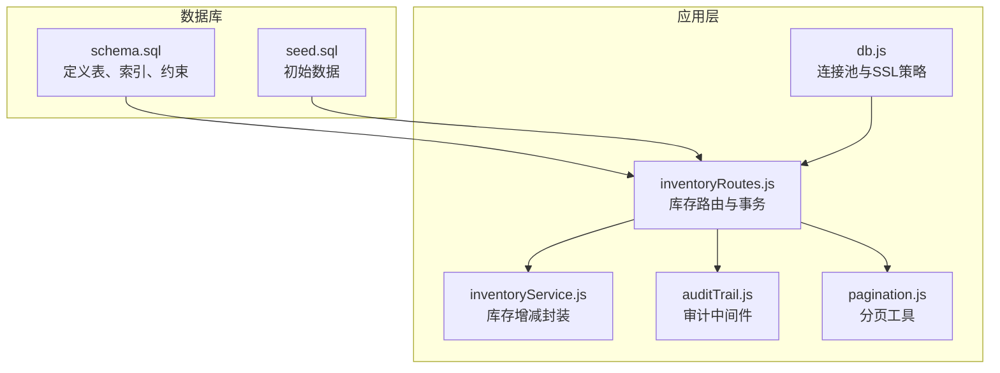
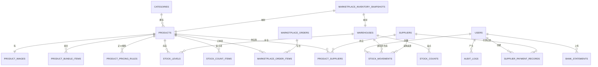
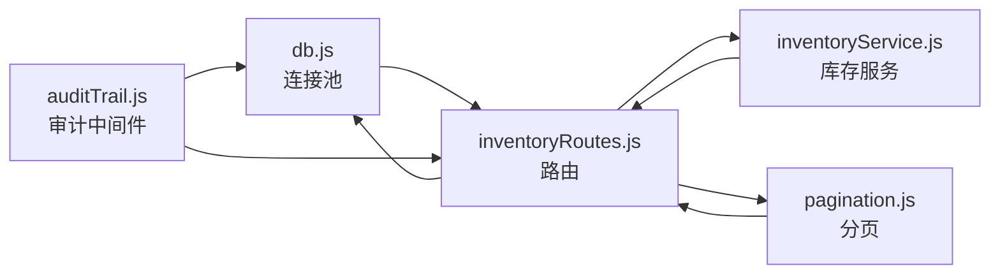

# 数据库架构

<cite>
**本文引用的文件**
- [schema.sql](file://server/database/schema.sql)
- [seed.sql](file://server/database/seed.sql)
- [db.js](file://server/src/config/db.js)
- [inventoryRoutes.js](file://server/src/routes/inventoryRoutes.js)
- [inventoryService.js](file://server/src/utils/inventoryService.js)
- [auditTrail.js](file://server/src/middleware/auditTrail.js)
- [auth.js](file://server/src/middleware/auth.js)
- [pagination.js](file://server/src/utils/pagination.js)
- [docker-compose.yml](file://docker-compose.yml)
- [DEPLOY_FREE.md](file://DEPLOY_FREE.md)
</cite>

## 目录
1. [简介](#简介)
2. [项目结构](#项目结构)
3. [核心组件](#核心组件)
4. [架构总览](#架构总览)
5. [详细组件分析](#详细组件分析)
6. [依赖分析](#依赖分析)
7. [性能考虑](#性能考虑)
8. [故障排查指南](#故障排查指南)
9. [结论](#结论)
10. [附录](#附录)

## 简介
本文件面向库存管理系统的数据库架构，基于仓库中的 PostgreSQL 结构与应用层使用模式，系统性梳理表结构、关系模型、索引策略、数据完整性约束、外键关系与业务规则，并给出性能优化、分区设计建议、数据迁移与备份恢复策略以及事务处理与并发控制的实现细节。文档同时结合实际代码路径，帮助开发者与运维人员快速理解与维护数据库层。

## 项目结构
数据库相关的核心文件位于 server/database 目录，配合应用层路由与服务工具，形成“DDL + DML + 中间件审计”的完整闭环：
- DDL：定义所有核心表、索引与约束
- DML：初始化种子数据
- 应用层：通过连接池执行查询、事务与审计日志

图表来源
- [schema.sql:1-447](file://server/database/schema.sql#L1-L447)
- [seed.sql:1-114](file://server/database/seed.sql#L1-L114)
- [db.js:1-25](file://server/src/config/db.js#L1-L25)
- [inventoryRoutes.js:1-493](file://server/src/routes/inventoryRoutes.js#L1-L493)
- [inventoryService.js:1-45](file://server/src/utils/inventoryService.js#L1-L45)
- [auditTrail.js:1-84](file://server/src/middleware/auditTrail.js#L1-L84)
- [pagination.js:1-28](file://server/src/utils/pagination.js#L1-L28)

章节来源
- [schema.sql:1-447](file://server/database/schema.sql#L1-L447)
- [seed.sql:1-114](file://server/database/seed.sql#L1-L114)
- [db.js:1-25](file://server/src/config/db.js#L1-L25)
- [inventoryRoutes.js:1-493](file://server/src/routes/inventoryRoutes.js#L1-L493)
- [inventoryService.js:1-45](file://server/src/utils/inventoryService.js#L1-L45)
- [auditTrail.js:1-84](file://server/src/middleware/auditTrail.js#L1-L84)
- [pagination.js:1-28](file://server/src/utils/pagination.js#L1-L28)

## 核心组件
- 用户与权限：users 表承载认证与授权基础；中间件负责鉴权与角色授权。
- 商品与分类：products 与 categories；商品扩展字段与定价规则独立表化。
- 仓库与库存：warehouses 与 stock_levels；库存变动统一记录在 stock_movements。
- 供应链与成本：suppliers、product_suppliers、supplier_payment_records、product_cost_price_histories。
- 市场渠道：marketplace_* 系列表，支持多平台同步与订单处理。
- 审计与通知：audit_logs、system_notifications、system_settings。
- 银行对账：bank_statements。

章节来源
- [schema.sql:2-318](file://server/database/schema.sql#L2-L318)
- [schema.sql:320-396](file://server/database/schema.sql#L320-L396)
- [schema.sql:398-447](file://server/database/schema.sql#L398-L447)

## 架构总览
数据库采用“集中式关系模型”，围绕库存主事实表 stock_levels 与多类维度表（产品、仓库、用户、供应商、市场渠道）建立强关联。应用层通过连接池执行查询与事务，确保高并发下的数据一致性与可审计性。

图表来源
- [schema.sql:2-318](file://server/database/schema.sql#L2-L318)
- [schema.sql:320-396](file://server/database/schema.sql#L320-L396)
- [schema.sql:398-447](file://server/database/schema.sql#L398-L447)

## 详细组件分析

### 用户与权限
- users 表：主键自增 id，唯一邮箱，角色枚举（ADMIN/MANAGER/STAFF），激活状态与默认货币，时间戳。
- 中间件：authenticateToken 校验 JWT 并加载用户信息；authorizeRoles 控制端点访问。
- 审计：auditTrail 在请求完成后写入 audit_logs，包含用户、动作、实体、方法、路径与元数据。

章节来源
- [schema.sql:2-11](file://server/database/schema.sql#L2-L11)
- [auth.js:1-46](file://server/src/middleware/auth.js#L1-L46)
- [auditTrail.js:14-84](file://server/src/middleware/auditTrail.js#L14-L84)

### 商品与分类
- categories：名称唯一，描述与时间戳。
- products：名称、SKU、条码唯一，单位、成本价、售价、建议价、重购点、激活状态与时间戳；外键指向分类。
- 扩展字段：product_code、sku_type、image_data、usage_guide、pros、cons、markup_percentage、suggested_price。
- 产品图片：product_images 多图与排序、主图标记。
- 组合商品：product_bundle_items 记录组合与子项数量。
- 定价规则：product_pricing_rules 支持按渠道或默认规则，含排序与时间戳。

章节来源
- [schema.sql:15-78](file://server/database/schema.sql#L15-L78)
- [schema.sql:99-124](file://server/database/schema.sql#L99-L124)

### 仓库与库存
- warehouses：名称、编码唯一、地址、负责人、激活状态与时间戳。
- stock_levels：产品-仓库唯一组合，库存数量与已分配数量，更新时间。
- stock_movements：库存流水，支持入库(IN)、出库(OUT)、调拨(TRANSFER)，记录来源/目的仓库、数量、参考号、备注、创建人与时间。
- 库存操作封装：ensureStockRow、getStockQuantity、updateStock，统一在事务中执行。

章节来源
- [schema.sql:22-30](file://server/database/schema.sql#L22-L30)
- [schema.sql:125-133](file://server/database/schema.sql#L125-L133)
- [schema.sql:237-248](file://server/database/schema.sql#L237-L248)
- [inventoryService.js:1-45](file://server/src/utils/inventoryService.js#L1-L45)

### 供应链与成本
- suppliers：名称、公司名、联系人、电话、邮箱、地址、付款条件、前置天数、备注、激活状态与时间戳。
- product_suppliers：产品-供应商多对多，主供应商标记。
- supplier_payment_records：供应商月度付款记录，唯一约束（供应商+月份+年份）。
- product_cost_price_histories：成本价变更历史，记录变更原因与经手人。

章节来源
- [schema.sql:302-318](file://server/database/schema.sql#L302-L318)
- [schema.sql:348-356](file://server/database/schema.sql#L348-L356)
- [schema.sql:357-376](file://server/database/schema.sql#L357-L376)

### 市场渠道与订单
- marketplace_connections：渠道唯一标识、店铺名、API基础地址、令牌与元数据、激活状态与更新人。
- marketplace_oauth_states：OAuth状态令牌、过期时间与创建人。
- marketplace_error_logs：错误日志，含渠道、操作、错误码、消息与详情。
- marketplace_orders：外部订单唯一约束（渠道+外部订单号），状态、买家名、金额、币种、时间戳。
- marketplace_order_items：订单项，映射外部SKU与内部产品。
- marketplace_inventory_snapshots：库存快照，含可用量与负载。
- marketplace_sync_logs：同步日志，含记录数与响应。

章节来源
- [schema.sql:161-194](file://server/database/schema.sql#L161-L194)
- [schema.sql:196-235](file://server/database/schema.sql#L196-L235)
- [schema.sql:148-159](file://server/database/schema.sql#L148-L159)
- [schema.sql:137-146](file://server/database/schema.sql#L137-L146)

### 审计与通知
- audit_logs：用户、角色、动作、实体、方法、路径、描述与JSON元数据。
- system_notifications：系统通知，含类型、标题、消息、目标角色、已读状态与创建人。
- system_settings：系统设置键值对，唯一键，更新人与时间戳。

章节来源
- [schema.sql:275-288](file://server/database/schema.sql#L275-L288)
- [schema.sql:378-388](file://server/database/schema.sql#L378-L388)
- [schema.sql:390-396](file://server/database/schema.sql#L390-L396)

### 银行对账
- bank_statements：上传人、对账月份、原始文件名、存储路径、MIME类型、文件大小与时间戳；唯一约束（上传人+月份）。

章节来源
- [schema.sql:398-408](file://server/database/schema.sql#L398-L408)

### 事务与并发控制
- 连接池：使用 pg 的 Pool，支持超时与SSL策略。
- 路由事务：库存出入库与调拨在单个连接内开启事务，失败回滚，成功提交。
- 并发保护：stock_levels 的产品-仓库唯一索引，库存更新使用原子更新语句，避免竞态。
- 审计：请求完成后再写审计日志，不影响业务事务。

章节来源
- [db.js:13-24](file://server/src/config/db.js#L13-L24)
- [inventoryRoutes.js:238-403](file://server/src/routes/inventoryRoutes.js#L238-L403)
- [inventoryService.js:29-38](file://server/src/utils/inventoryService.js#L29-L38)

## 依赖分析
- 应用层依赖数据库连接池与路由层，路由层依赖库存服务工具与分页工具。
- 审计中间件依赖数据库连接池与审计日志工具。
- 路由层对库存表与维度表存在大量 JOIN 查询，索引覆盖常见过滤字段。

图表来源
- [db.js:1-25](file://server/src/config/db.js#L1-L25)
- [inventoryRoutes.js:1-493](file://server/src/routes/inventoryRoutes.js#L1-L493)
- [inventoryService.js:1-45](file://server/src/utils/inventoryService.js#L1-L45)
- [pagination.js:1-28](file://server/src/utils/pagination.js#L1-L28)
- [auditTrail.js:1-84](file://server/src/middleware/auditTrail.js#L1-L84)

章节来源
- [db.js:1-25](file://server/src/config/db.js#L1-L25)
- [inventoryRoutes.js:1-493](file://server/src/routes/inventoryRoutes.js#L1-L493)
- [inventoryService.js:1-45](file://server/src/utils/inventoryService.js#L1-L45)
- [pagination.js:1-28](file://server/src/utils/pagination.js#L1-L28)
- [auditTrail.js:1-84](file://server/src/middleware/auditTrail.js#L1-L84)

## 性能考虑
- 索引策略
  - stock_levels：product_id、warehouse_id 唯一索引，支持按产品与仓库快速定位。
  - stock_movements：按产品与创建时间倒序索引，支撑最近流水查询。
  - marketplace_*：按渠道、状态、时间戳建立索引，优化订单与错误日志检索。
  - 其他常用过滤字段：categories.name、suppliers.name/is_active、product_suppliers.is_primary 等。
- 分页与查询
  - inventory 路由使用 LIMIT/OFFSET 分页，配合 COUNT 查询统计总数，避免一次性加载全量数据。
  - 搜索采用 ILIKE 模糊匹配，建议在高基数场景下评估 GIN/GIST 或全文索引。
- 事务与锁
  - 单连接事务确保库存更新原子性；stock_levels 唯一约束避免并发插入重复行。
  - 建议在高并发写入场景下评估行级锁与死锁规避策略。
- 连接池与SSL
  - 连接池配置了连接超时；生产环境自动启用SSL，保障传输安全。
- 可选优化
  - 对高频查询字段建立复合索引（如 stock_levels 上的 (warehouse_id, product_id)）。
  - 对时间序列数据（如 audit_logs、marketplace_error_logs）考虑按时间分区或归档。

章节来源
- [schema.sql:410-447](file://server/database/schema.sql#L410-L447)
- [inventoryRoutes.js:17-151](file://server/src/routes/inventoryRoutes.js#L17-L151)
- [pagination.js:1-28](file://server/src/utils/pagination.js#L1-L28)
- [db.js:13-24](file://server/src/config/db.js#L13-L24)

## 故障排查指南
- 连接问题
  - 生产环境未启用SSL：检查 DATABASE_URL 是否包含 sslmode=require；确认连接池是否启用SSL。
  - 连接超时：调整 PG_CONNECT_TIMEOUT_MS 环境变量。
- 权限与认证
  - 401 未授权：确认 JWT_SECRET 稳定且未被频繁更换；核对用户状态 is_active。
  - 403 权限不足：确认用户角色满足端点授权要求。
- 事务与数据不一致
  - 库存不足：检查可用库存计算（on_hand - allocated）与事务提交顺序。
  - 并发写入：确认 stock_levels 唯一约束与原子更新语句生效。
- 审计日志
  - 写入失败：检查 audit_logs 表结构与写入流程；确认中间件在 finish 事件后执行。
- 初始化与迁移
  - 新环境首次启动：执行 schema.sql 与 seed.sql；验证 users 数量与示例数据。
  - 多版本演进：新增列时使用 IF NOT EXISTS；迁移脚本需幂等。

章节来源
- [db.js:3-11](file://server/src/config/db.js#L3-L11)
- [auth.js:5-29](file://server/src/middleware/auth.js#L5-L29)
- [inventoryRoutes.js:238-403](file://server/src/routes/inventoryRoutes.js#L238-L403)
- [auditTrail.js:47-79](file://server/src/middleware/auditTrail.js#L47-L79)
- [DEPLOY_FREE.md:108-126](file://DEPLOY_FREE.md#L108-L126)

## 结论
该数据库架构以库存为核心事实表，围绕产品、仓库、用户、供应商与市场渠道构建清晰的维度模型，辅以完善的索引与事务机制，满足多角色、多仓库、多平台的库存管理需求。通过连接池、中间件审计与分页策略，系统在性能与可观测性之间取得平衡。建议在高并发与大数据量场景下进一步完善索引与分区策略，并持续进行数据迁移与备份演练。

## 附录

### 数据迁移方案
- 新环境初始化
  - 使用 schema.sql 创建表结构；使用 seed.sql 插入初始数据。
- 版本演进
  - 新增列使用 IF NOT EXISTS；对已有数据进行默认值填充与迁移。
  - 保持 SQL 脚本幂等，避免重复执行导致异常。
- 外部平台
  - marketplace_* 表用于对接第三方平台，迁移时注意唯一键与时间戳字段。

章节来源
- [schema.sql:56-124](file://server/database/schema.sql#L56-L124)
- [seed.sql:1-114](file://server/database/seed.sql#L1-L114)
- [DEPLOY_FREE.md:108-126](file://DEPLOY_FREE.md#L108-L126)

### 备份与恢复策略
- 备份
  - 使用标准 PostgreSQL 备份工具定期导出数据与结构。
  - 对重要表（如 audit_logs、bank_statements）进行周期性归档。
- 恢复
  - 在新环境中先执行 schema.sql，再执行 seed.sql 或增量数据导入。
  - 验证关键查询与报表数据一致性。

章节来源
- [DEPLOY_FREE.md:108-126](file://DEPLOY_FREE.md#L108-L126)

### 数据安全措施
- 传输安全
  - 生产环境强制启用SSL；连接字符串包含 sslmode=require。
- 认证与授权
  - JWT 令牌校验与角色授权；审计日志记录敏感操作。
- 敏感信息
  - 审计日志对密码字段进行脱敏处理。

章节来源
- [db.js:3-11](file://server/src/config/db.js#L3-L11)
- [auditTrail.js:4-12](file://server/src/middleware/auditTrail.js#L4-L12)
- [auth.js:14-28](file://server/src/middleware/auth.js#L14-L28)

### 事务处理与并发控制
- 事务边界
  - 库存出入库与调拨在单连接内 BEGIN/COMMIT/ROLLBACK。
- 并发控制
  - 唯一索引防止重复行；原子更新减少竞争条件。
- 审计与一致性
  - 业务事务完成后写入审计日志，保证可追溯性。

章节来源
- [inventoryRoutes.js:238-403](file://server/src/routes/inventoryRoutes.js#L238-L403)
- [inventoryService.js:29-38](file://server/src/utils/inventoryService.js#L29-L38)
- [auditTrail.js:47-79](file://server/src/middleware/auditTrail.js#L47-L79)