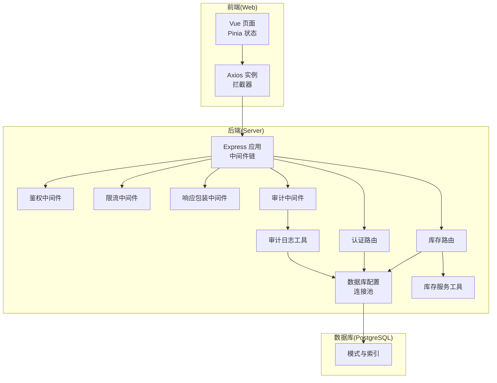
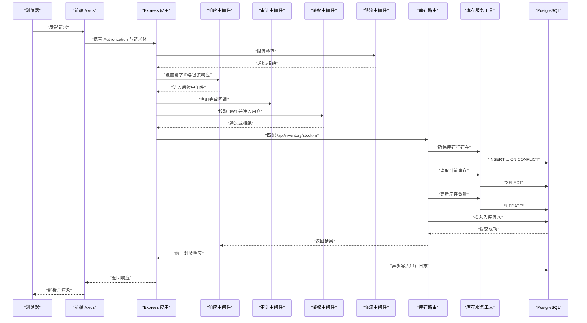
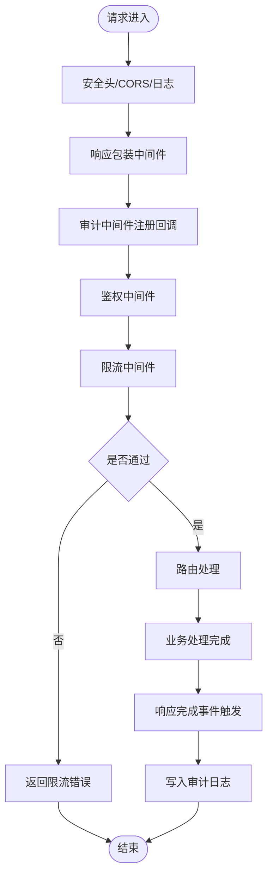
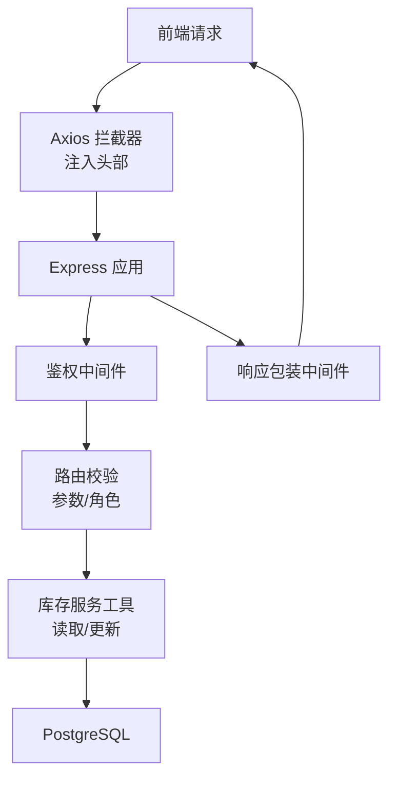
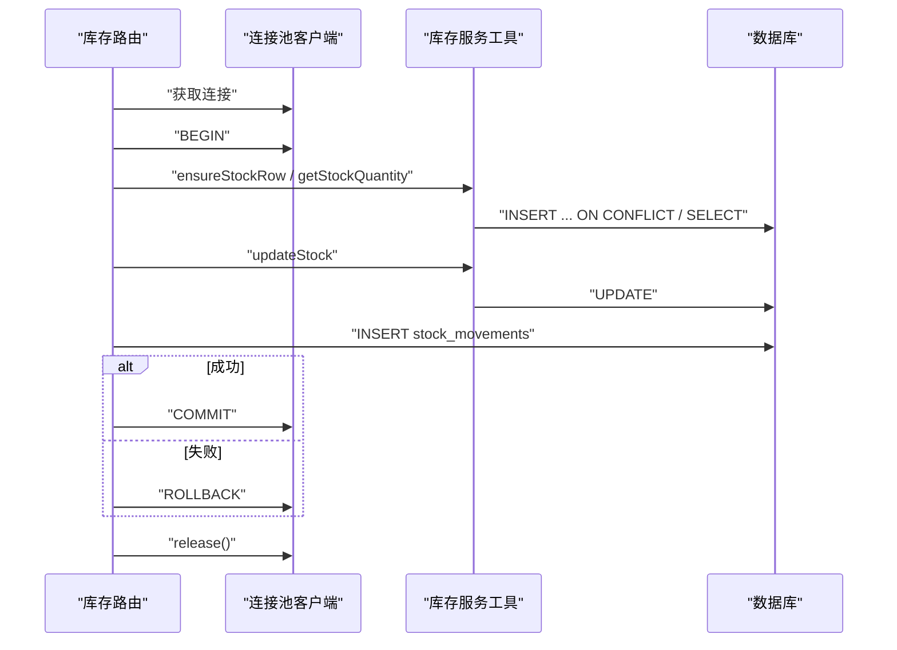
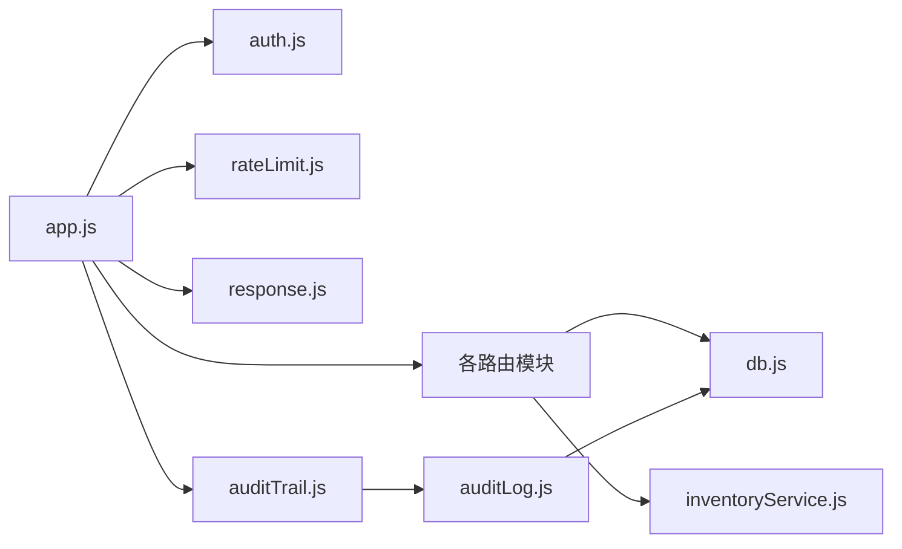
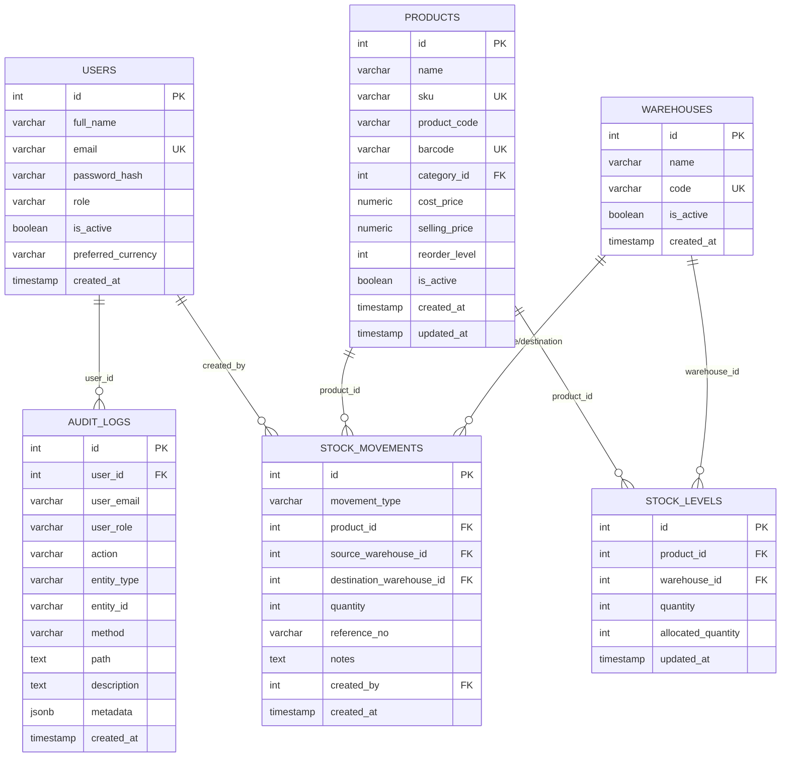

# 数据流架构

<cite>
**本文引用的文件**
- [server/src/app.js](file://server/src/app.js)
- [server/src/server.js](file://server/src/server.js)
- [server/src/config/db.js](file://server/src/config/db.js)
- [server/src/middleware/auth.js](file://server/src/middleware/auth.js)
- [server/src/middleware/auditTrail.js](file://server/src/middleware/auditTrail.js)
- [server/src/middleware/response.js](file://server/src/middleware/response.js)
- [server/src/middleware/rateLimit.js](file://server/src/middleware/rateLimit.js)
- [server/src/utils/auditLog.js](file://server/src/utils/auditLog.js)
- [server/src/utils/inventoryService.js](file://server/src/utils/inventoryService.js)
- [server/src/routes/inventoryRoutes.js](file://server/src/routes/inventoryRoutes.js)
- [server/src/routes/authRoutes.js](file://server/src/routes/authRoutes.js)
- [web/src/services/api.js](file://web/src/services/api.js)
- [web/src/stores/auth.js](file://web/src/stores/auth.js)
- [server/database/schema.sql](file://server/database/schema.sql)
</cite>

## 目录
1. [简介](#简介)
2. [项目结构](#项目结构)
3. [核心组件](#核心组件)
4. [架构总览](#架构总览)
5. [详细组件分析](#详细组件分析)
6. [依赖关系分析](#依赖关系分析)
7. [性能考量](#性能考量)
8. [故障排查指南](#故障排查指南)
9. [结论](#结论)
10. [附录](#附录)

## 简介
本文件面向“从用户界面到数据库”的完整数据流与处理流程，系统性阐述中间件链式处理（安全、审计、响应）、数据验证与转换、事务与一致性、缓存与同步策略，并提供数据流与时序图以帮助非技术读者理解。同时覆盖数据安全与隐私保护、备份与恢复策略建议。

## 项目结构
后端基于 Express，采用模块化路由与中间件；前端使用 Vue + Pinia + Axios，通过统一 API 适配器与后端交互。数据库为 PostgreSQL，使用连接池与索引优化查询性能。

图表来源
- [server/src/app.js:25-62](file://server/src/app.js#L25-L62)
- [server/src/server.js:13-25](file://server/src/server.js#L13-L25)
- [server/src/config/db.js:15-19](file://server/src/config/db.js#L15-L19)
- [server/src/middleware/auth.js:5-29](file://server/src/middleware/auth.js#L5-L29)
- [server/src/middleware/rateLimit.js:9-35](file://server/src/middleware/rateLimit.js#L9-L35)
- [server/src/middleware/response.js:3-57](file://server/src/middleware/response.js#L3-L57)
- [server/src/middleware/auditTrail.js:47-79](file://server/src/middleware/auditTrail.js#L47-L79)
- [server/src/utils/auditLog.js:1-33](file://server/src/utils/auditLog.js#L1-L33)
- [server/src/utils/inventoryService.js:2-38](file://server/src/utils/inventoryService.js#L2-L38)
- [server/src/routes/inventoryRoutes.js:230-403](file://server/src/routes/inventoryRoutes.js#L230-L403)
- [server/src/routes/authRoutes.js:17-64](file://server/src/routes/authRoutes.js#L17-L64)
- [web/src/services/api.js:3-44](file://web/src/services/api.js#L3-L44)
- [web/src/stores/auth.js:44-78](file://web/src/stores/auth.js#L44-L78)
- [server/database/schema.sql:125-288](file://server/database/schema.sql#L125-L288)

章节来源
- [server/src/app.js:25-62](file://server/src/app.js#L25-L62)
- [server/src/server.js:13-25](file://server/src/server.js#L13-L25)
- [server/src/config/db.js:15-19](file://server/src/config/db.js#L15-L19)
- [server/database/schema.sql:125-288](file://server/database/schema.sql#L125-L288)

## 核心组件
- 中间件链
  - 安全中间件：Helmet、CORS、JSON 解析、日志、响应包装、审计、鉴权、限流。
  - 鉴权中间件：校验 JWT 并注入用户信息；基于角色授权。
  - 审计中间件：在请求完成后记录操作上下文与元数据。
  - 响应中间件：统一封装成功/失败响应格式，附加请求 ID。
  - 限流中间件：基于内存桶的滑动窗口限流。
- 路由层
  - 认证路由：登录、获取当前用户。
  - 库存路由：库存查询、交易流水、入库/出库/调拨等。
- 工具层
  - 库存服务：确保库存行存在、读取与更新库存数量。
  - 审计日志：写入审计表。
- 数据库
  - 连接池与 SSL 选择、超时配置；大量索引优化查询。
- 前端
  - Axios 统一实例，自动注入 Authorization 与成本访问令牌；统一封装响应与错误。

章节来源
- [server/src/middleware/auth.js:5-29](file://server/src/middleware/auth.js#L5-L29)
- [server/src/middleware/auditTrail.js:47-79](file://server/src/middleware/auditTrail.js#L47-L79)
- [server/src/middleware/response.js:3-57](file://server/src/middleware/response.js#L3-L57)
- [server/src/middleware/rateLimit.js:9-35](file://server/src/middleware/rateLimit.js#L9-L35)
- [server/src/utils/inventoryService.js:2-38](file://server/src/utils/inventoryService.js#L2-L38)
- [server/src/utils/auditLog.js:1-33](file://server/src/utils/auditLog.js#L1-L33)
- [server/src/routes/inventoryRoutes.js:230-403](file://server/src/routes/inventoryRoutes.js#L230-L403)
- [server/src/routes/authRoutes.js:17-64](file://server/src/routes/authRoutes.js#L17-L64)
- [web/src/services/api.js:3-44](file://web/src/services/api.js#L3-L44)
- [server/src/config/db.js:15-19](file://server/src/config/db.js#L15-L19)

## 架构总览
下图展示一次“库存入库”请求从浏览器到数据库的完整数据流，包括中间件处理、业务逻辑与事务提交。

图表来源
- [server/src/app.js:27-33](file://server/src/app.js#L27-L33)
- [server/src/middleware/response.js:3-57](file://server/src/middleware/response.js#L3-L57)
- [server/src/middleware/auditTrail.js:47-79](file://server/src/middleware/auditTrail.js#L47-L79)
- [server/src/middleware/auth.js:5-29](file://server/src/middleware/auth.js#L5-L29)
- [server/src/middleware/rateLimit.js:9-35](file://server/src/middleware/rateLimit.js#L9-L35)
- [server/src/utils/inventoryService.js:2-38](file://server/src/utils/inventoryService.js#L2-L38)
- [server/src/routes/inventoryRoutes.js:230-403](file://server/src/routes/inventoryRoutes.js#L230-L403)
- [server/src/utils/auditLog.js:1-33](file://server/src/utils/auditLog.js#L1-L33)
- [web/src/services/api.js:3-44](file://web/src/services/api.js#L3-L44)

## 详细组件分析

### 中间件链式处理机制
- 安全与基础中间件
  - 安全头、跨域、日志、JSON 解析、响应包装、审计、鉴权、限流。
- 鉴权中间件
  - 提取 Bearer Token，验证签名与用户有效性，注入 req.user。
- 审计中间件
  - 在响应完成时推断动作类型与实体，脱敏敏感字段，写入审计日志。
- 响应中间件
  - 统一 success/fail 结构，自动注入请求 ID，便于追踪。
- 限流中间件
  - 内存桶实现滑动窗口，按客户端 IP 与命名空间统计。

图表来源
- [server/src/app.js:27-33](file://server/src/app.js#L27-L33)
- [server/src/middleware/response.js:3-57](file://server/src/middleware/response.js#L3-L57)
- [server/src/middleware/auditTrail.js:47-79](file://server/src/middleware/auditTrail.js#L47-L79)
- [server/src/middleware/auth.js:5-29](file://server/src/middleware/auth.js#L5-L29)
- [server/src/middleware/rateLimit.js:9-35](file://server/src/middleware/rateLimit.js#L9-L35)

章节来源
- [server/src/app.js:27-33](file://server/src/app.js#L27-L33)
- [server/src/middleware/auth.js:5-29](file://server/src/middleware/auth.js#L5-L29)
- [server/src/middleware/auditTrail.js:47-79](file://server/src/middleware/auditTrail.js#L47-L79)
- [server/src/middleware/response.js:3-57](file://server/src/middleware/response.js#L3-L57)
- [server/src/middleware/rateLimit.js:9-35](file://server/src/middleware/rateLimit.js#L9-L35)

### 数据验证与转换流程
- 前端
  - Axios 自动注入 Authorization 与成本访问令牌；统一封装响应与错误。
- 后端
  - 路由层进行参数与业务规则校验（如正数数量、仓库存在性）。
  - 工具层封装库存读写，确保并发安全与一致性。
  - 审计中间件对请求体进行脱敏处理，避免敏感信息落库。

图表来源
- [web/src/services/api.js:8-24](file://web/src/services/api.js#L8-L24)
- [server/src/middleware/auth.js:5-29](file://server/src/middleware/auth.js#L5-L29)
- [server/src/routes/inventoryRoutes.js:230-403](file://server/src/routes/inventoryRoutes.js#L230-L403)
- [server/src/utils/inventoryService.js:2-38](file://server/src/utils/inventoryService.js#L2-L38)
- [server/src/middleware/response.js:3-57](file://server/src/middleware/response.js#L3-L57)

章节来源
- [web/src/services/api.js:8-24](file://web/src/services/api.js#L8-L24)
- [server/src/middleware/auth.js:5-29](file://server/src/middleware/auth.js#L5-L29)
- [server/src/routes/inventoryRoutes.js:230-403](file://server/src/routes/inventoryRoutes.js#L230-L403)
- [server/src/utils/inventoryService.js:2-38](file://server/src/utils/inventoryService.js#L2-L38)
- [server/src/middleware/response.js:3-57](file://server/src/middleware/response.js#L3-L57)

### 事务处理与数据一致性
- 入库/出库/调拨均使用显式事务：
  - 开启事务 -> 校验与计算 -> 更新库存 -> 插入流水 -> 提交。
  - 异常时回滚，确保数据一致性。
- 库存服务工具保证同一产品在同仓的原子更新，避免并发问题。

图表来源
- [server/src/routes/inventoryRoutes.js:230-403](file://server/src/routes/inventoryRoutes.js#L230-L403)
- [server/src/utils/inventoryService.js:2-38](file://server/src/utils/inventoryService.js#L2-L38)

章节来源
- [server/src/routes/inventoryRoutes.js:230-403](file://server/src/routes/inventoryRoutes.js#L230-L403)
- [server/src/utils/inventoryService.js:2-38](file://server/src/utils/inventoryService.js#L2-L38)

### 缓存策略与数据同步
- 当前未发现显式的应用层缓存实现（Redis/Memcached），系统通过数据库索引与分页查询保障性能。
- 建议
  - 对热点查询（如库存汇总、产品详情）引入只读副本与本地缓存。
  - 对外部平台（市场渠道）采用“拉取+幂等写入+差异比对”的同步策略，结合审计日志追踪异常。

[本节为通用建议，不直接分析具体文件]

### 数据安全与隐私保护
- 传输安全：生产环境自动启用 SSL；连接字符串含 sslmode 时强制加密。
- 认证与授权：JWT 校验与角色授权；登录接口限流。
- 敏感信息脱敏：审计中间件对密码字段进行脱敏；响应统一结构，避免泄露内部错误细节。
- 前端存储：令牌与用户信息本地持久化，注意 HTTPS 与安全存储策略。

章节来源
- [server/src/config/db.js:3-11](file://server/src/config/db.js#L3-L11)
- [server/src/middleware/auth.js:5-29](file://server/src/middleware/auth.js#L5-L29)
- [server/src/middleware/rateLimit.js:9-35](file://server/src/middleware/rateLimit.js#L9-L35)
- [server/src/middleware/auditTrail.js:4-12](file://server/src/middleware/auditTrail.js#L4-L12)
- [server/src/middleware/response.js:3-57](file://server/src/middleware/response.js#L3-L57)
- [web/src/stores/auth.js:28-41](file://web/src/stores/auth.js#L28-L41)

### 数据备份与恢复策略
- 建议
  - 使用数据库原生命令或托管服务定期导出快照。
  - 将备份归档至安全位置，周期性验证恢复流程。
  - 对审计日志与关键业务表进行重点保护。

[本节为通用建议，不直接分析具体文件]

## 依赖关系分析
- 组件耦合
  - 路由依赖中间件与工具层；工具层依赖数据库配置。
  - 审计中间件依赖审计日志工具与数据库连接池。
- 外部依赖
  - Express、PostgreSQL 连接池、JWT、Bcrypt、Morgan、Helmet、CORS。
- 可能的循环依赖
  - 未见明显循环导入；中间件与路由解耦良好。

图表来源
- [server/src/app.js:7-23](file://server/src/app.js#L7-L23)
- [server/src/middleware/auth.js:1-46](file://server/src/middleware/auth.js#L1-L46)
- [server/src/middleware/rateLimit.js:1-40](file://server/src/middleware/rateLimit.js#L1-L40)
- [server/src/middleware/response.js:1-62](file://server/src/middleware/response.js#L1-L62)
- [server/src/middleware/auditTrail.js:1-84](file://server/src/middleware/auditTrail.js#L1-L84)
- [server/src/utils/inventoryService.js:1-45](file://server/src/utils/inventoryService.js#L1-L45)
- [server/src/utils/auditLog.js:1-38](file://server/src/utils/auditLog.js#L1-L38)
- [server/src/config/db.js:1-25](file://server/src/config/db.js#L1-L25)

章节来源
- [server/src/app.js:7-23](file://server/src/app.js#L7-L23)
- [server/src/middleware/auth.js:1-46](file://server/src/middleware/auth.js#L1-L46)
- [server/src/middleware/rateLimit.js:1-40](file://server/src/middleware/rateLimit.js#L1-L40)
- [server/src/middleware/response.js:1-62](file://server/src/middleware/response.js#L1-L62)
- [server/src/middleware/auditTrail.js:1-84](file://server/src/middleware/auditTrail.js#L1-L84)
- [server/src/utils/inventoryService.js:1-45](file://server/src/utils/inventoryService.js#L1-L45)
- [server/src/utils/auditLog.js:1-38](file://server/src/utils/auditLog.js#L1-L38)
- [server/src/config/db.js:1-25](file://server/src/config/db.js#L1-L25)

## 性能考量
- 查询性能
  - 大量索引覆盖高频查询列（如产品、仓库、库存、审计日志、订单等）。
  - 分页查询与条件过滤减少单次返回数据量。
- 连接与超时
  - 连接池与连接超时配置，启动时健康检查数据库连通性。
- 事务与锁
  - 显式事务与原子更新降低并发冲突概率；避免长事务占用资源。
- 前端体验
  - Axios 统一拦截器减少重复逻辑；Pinia 状态持久化提升刷新体验。

章节来源
- [server/database/schema.sql:385-419](file://server/database/schema.sql#L385-L419)
- [server/src/server.js:18-24](file://server/src/server.js#L18-L24)
- [server/src/config/db.js:15-19](file://server/src/config/db.js#L15-L19)
- [server/src/routes/inventoryRoutes.js:76-139](file://server/src/routes/inventoryRoutes.js#L76-L139)

## 故障排查指南
- 健康检查
  - 通过健康端点确认服务可用；数据库启动超时会主动关闭服务。
- 错误处理
  - 全局错误中间件统一兜底，避免堆栈泄露；响应中间件保证错误结构一致。
- 审计定位
  - 审计日志包含方法、路径、状态码与请求体摘要，结合请求 ID 快速定位问题。
- 常见问题
  - 401 未授权：检查 Authorization 头与 JWT 有效期。
  - 403 权限不足：检查用户角色与路由授权。
  - 429 请求过多：检查限流配置与客户端重试策略。
  - 事务失败：查看库存校验与并发更新逻辑。

章节来源
- [server/src/server.js:13-25](file://server/src/server.js#L13-L25)
- [server/src/app.js:55-62](file://server/src/app.js#L55-L62)
- [server/src/middleware/auditTrail.js:47-79](file://server/src/middleware/auditTrail.js#L47-L79)
- [server/src/middleware/rateLimit.js:23-29](file://server/src/middleware/rateLimit.js#L23-L29)
- [server/src/middleware/auth.js:9-28](file://server/src/middleware/auth.js#L9-L28)

## 结论
本系统通过清晰的中间件链、严格的鉴权与审计、统一的响应包装与事务处理，实现了从前端到数据库的稳定数据流。配合完善的索引与分页策略，满足大规模库存场景下的性能需求。建议在现有基础上引入应用层缓存与外部平台同步策略，并完善备份与恢复方案，进一步提升可靠性与可维护性。

## 附录
- 数据模型概览（库存相关）

图表来源
- [server/database/schema.sql:2-11](file://server/database/schema.sql#L2-L11)
- [server/database/schema.sql:32-54](file://server/database/schema.sql#L32-L54)
- [server/database/schema.sql:22-30](file://server/database/schema.sql#L22-L30)
- [server/database/schema.sql:125-133](file://server/database/schema.sql#L125-L133)
- [server/database/schema.sql:237-248](file://server/database/schema.sql#L237-L248)
- [server/database/schema.sql:275-288](file://server/database/schema.sql#L275-L288)