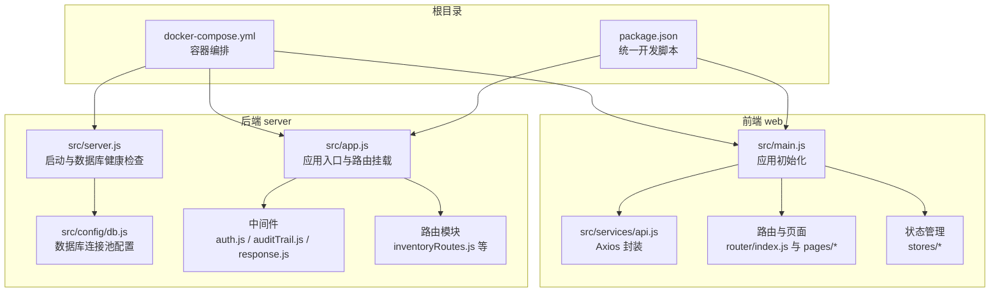
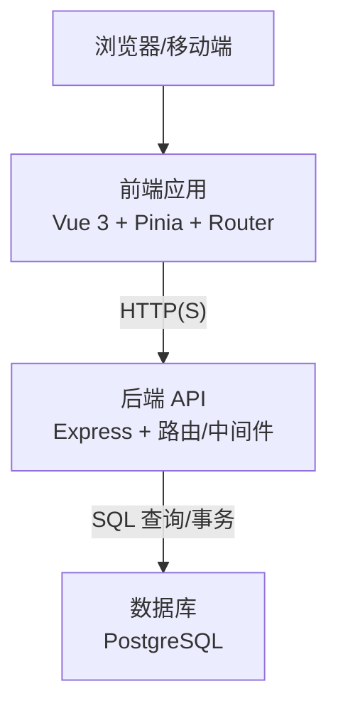
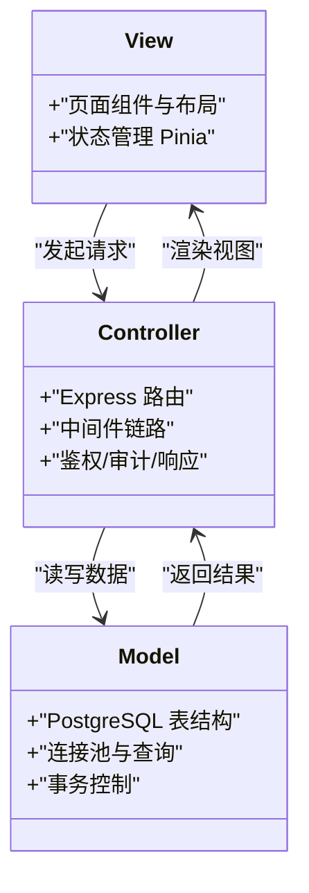
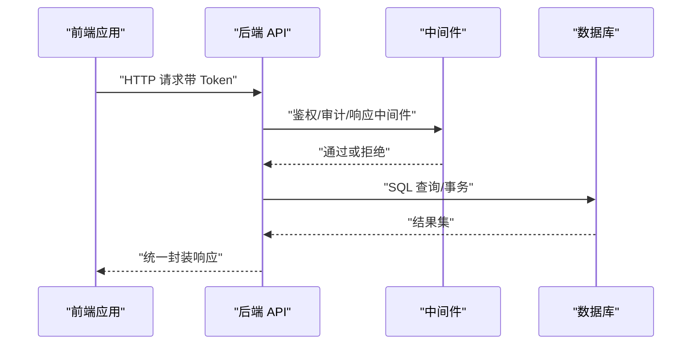
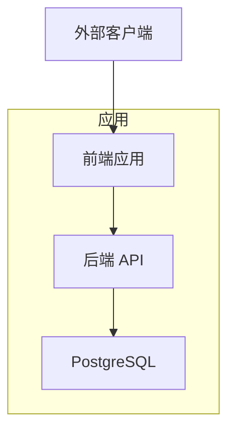
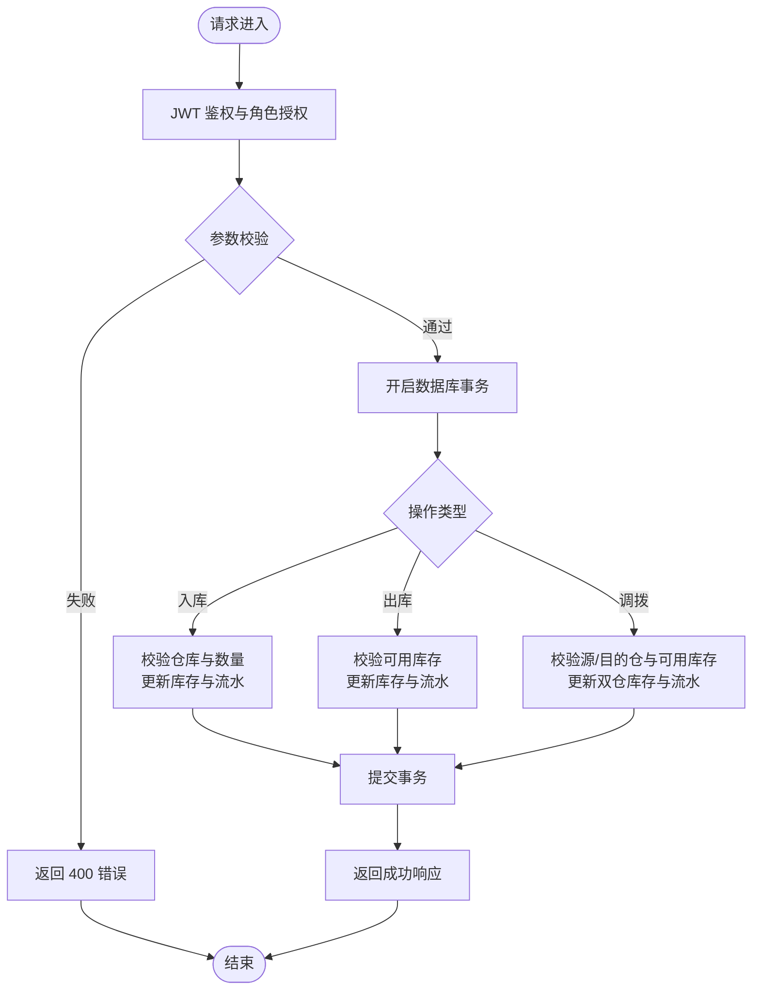
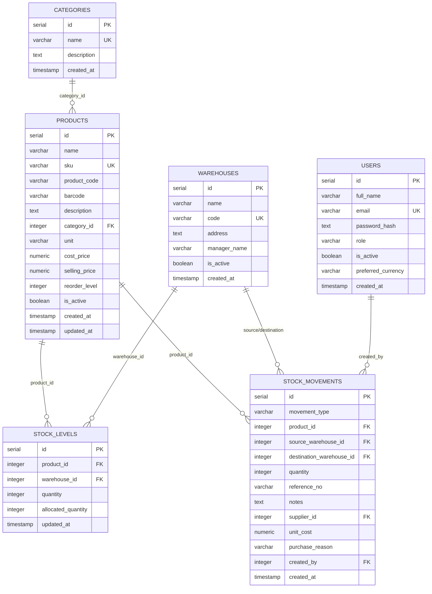
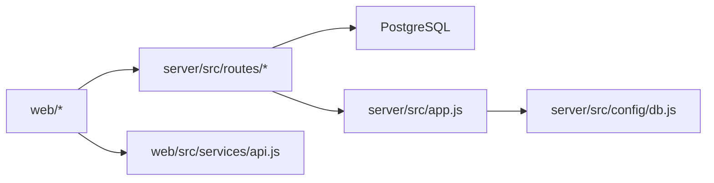

# 整体架构设计

<cite>
**本文引用的文件**
- [README.md](file://README.md)
- [package.json](file://package.json)
- [docker-compose.yml](file://docker-compose.yml)
- [server/package.json](file://server/package.json)
- [web/package.json](file://web/package.json)
- [server/src/app.js](file://server/src/app.js)
- [server/src/server.js](file://server/src/server.js)
- [server/src/config/db.js](file://server/src/config/db.js)
- [server/src/middleware/auth.js](file://server/src/middleware/auth.js)
- [server/src/routes/inventoryRoutes.js](file://server/src/routes/inventoryRoutes.js)
- [web/src/main.js](file://web/src/main.js)
- [web/src/services/api.js](file://web/src/services/api.js)
- [server/Dockerfile](file://server/Dockerfile)
- [web/Dockerfile](file://web/Dockerfile)
- [server/database/schema.sql](file://server/database/schema.sql)
</cite>

## 目录
1. [引言](#引言)
2. [项目结构](#项目结构)
3. [核心组件](#核心组件)
4. [架构总览](#架构总览)
5. [详细组件分析](#详细组件分析)
6. [依赖分析](#依赖分析)
7. [性能考量](#性能考量)
8. [故障排查指南](#故障排查指南)
9. [结论](#结论)
10. [附录](#附录)

## 引言
本项目是一个基于 Vue 3 + Express + PostgreSQL 的全栈库存管理系统。系统采用前后端分离架构，前端使用 Vue 3 + Pinia + Vue Router 构建管理后台界面，后端使用 Express 提供 REST API，数据持久化通过 PostgreSQL 实现。系统支持多仓库库存管理、出入库与调拨流程、仪表盘与报表、低库存预警、审计日志、市场渠道同步等核心功能。

## 项目结构
项目采用多包结构，根目录提供统一开发脚本与编排文件，前后端分别独立构建与部署：
- 根目录：统一开发脚本与容器编排
- server：Express 后端 API、数据库迁移与种子脚本、中间件与路由
- web：Vue 3 前端应用、状态管理、路由与服务封装
- docker-compose：本地一键拉起数据库、后端 API、前端 Nginx 静态站点

图表来源
- [package.json:1-20](file://package.json#L1-L20)
- [docker-compose.yml:1-57](file://docker-compose.yml#L1-L57)
- [server/src/app.js:1-65](file://server/src/app.js#L1-L65)
- [server/src/server.js:1-28](file://server/src/server.js#L1-L28)
- [server/src/config/db.js:1-25](file://server/src/config/db.js#L1-L25)
- [server/src/middleware/auth.js:1-46](file://server/src/middleware/auth.js#L1-L46)
- [server/src/routes/inventoryRoutes.js:1-493](file://server/src/routes/inventoryRoutes.js#L1-L493)
- [web/src/main.js:1-14](file://web/src/main.js#L1-L14)
- [web/src/services/api.js:1-45](file://web/src/services/api.js#L1-L45)

章节来源
- [README.md:22-29](file://README.md#L22-L29)
- [package.json:6-12](file://package.json#L6-L12)
- [docker-compose.yml:1-57](file://docker-compose.yml#L1-L57)

## 核心组件
- 应用入口与路由挂载：后端通过集中式 app.js 挂载多个路由模块，并统一处理安全头、跨域、日志与审计；前端通过 main.js 初始化应用、状态管理与路由。
- 中间件体系：认证中间件负责 JWT 校验与用户上下文注入；响应中间件统一封装返回格式；审计中间件记录关键操作。
- 路由与业务：以库存路由为例，提供库存总览、交易流水、出入库与调拨、库存分配等接口，内部使用数据库事务保证一致性。
- 数据库连接：通过连接池配置支持 SSL、超时与环境变量控制，确保生产与本地一致的连接策略。
- 前后端通信：前端通过 Axios 封装统一设置基础 URL、携带 Token、成本访问令牌与语言头，并对响应进行统一封装与错误透传。

章节来源
- [server/src/app.js:25-54](file://server/src/app.js#L25-L54)
- [server/src/middleware/auth.js:5-29](file://server/src/middleware/auth.js#L5-L29)
- [server/src/routes/inventoryRoutes.js:10-151](file://server/src/routes/inventoryRoutes.js#L10-L151)
- [server/src/config/db.js:13-24](file://server/src/config/db.js#L13-L24)
- [web/src/services/api.js:3-42](file://web/src/services/api.js#L3-L42)

## 架构总览
系统采用经典的三层架构与微服务风格的组件划分：
- 表现层（Web）：Vue 3 单页应用，负责用户交互、状态管理与 API 调用。
- 业务层（API）：Express 路由与控制器，处理鉴权、参数校验、业务规则与事务控制。
- 数据层（DB）：PostgreSQL 存储用户、产品、仓库、库存与交易流水等核心数据。

图表来源
- [web/src/services/api.js:3-5](file://web/src/services/api.js#L3-L5)
- [server/src/app.js:39-53](file://server/src/app.js#L39-L53)
- [server/src/config/db.js:15-24](file://server/src/config/db.js#L15-L24)

## 详细组件分析

### MVC 架构模式在项目中的实现
- 视图层（V）：Vue 页面组件与布局组件，负责渲染与用户交互；状态通过 Pinia 管理。
- 控制器（C）：Express 路由作为控制器，接收请求、调用业务逻辑、返回响应。
- 模型层（M）：数据库表结构与查询封装，通过连接池与事务保障一致性。

图表来源
- [web/src/main.js:7-13](file://web/src/main.js#L7-L13)
- [server/src/app.js:27-33](file://server/src/app.js#L27-L33)
- [server/src/config/db.js:15-24](file://server/src/config/db.js#L15-L24)

章节来源
- [web/src/main.js:7-13](file://web/src/main.js#L7-L13)
- [server/src/app.js:27-33](file://server/src/app.js#L27-L33)
- [server/src/config/db.js:15-24](file://server/src/config/db.js#L15-L24)

### 微服务风格组件交互
尽管为单体仓库，系统仍体现微服务风格的职责划分：
- API 网关：本项目未单独部署独立网关，前端通过统一基础 URL 调用后端 API。
- 业务逻辑层：Express 路由与控制器承担业务编排与规则校验。
- 数据访问层：数据库连接池与查询封装，提供事务与一致性保障。
- 持久化层：PostgreSQL 表结构清晰，涵盖用户、产品、仓库、库存与交易流水。

图表来源
- [web/src/services/api.js:8-24](file://web/src/services/api.js#L8-L24)
- [server/src/app.js:27-33](file://server/src/app.js#L27-L33)
- [server/src/config/db.js:15-24](file://server/src/config/db.js#L15-L24)

章节来源
- [web/src/services/api.js:8-24](file://web/src/services/api.js#L8-L24)
- [server/src/app.js:27-33](file://server/src/app.js#L27-L33)
- [server/src/config/db.js:15-24](file://server/src/config/db.js#L15-L24)

### 技术栈选择与权衡
- Vue 3 + Express + PostgreSQL 组合的优势：
  - 前后端分离清晰，便于团队协作与独立演进。
  - Vue 生态成熟，组件化与状态管理适合中后台管理场景。
  - Express 轻量灵活，配合中间件可快速实现安全与审计。
  - PostgreSQL 功能完备，支持复杂查询、事务与 JSONB 扩展字段。
- 权衡点：
  - 本项目为单体仓库与单实例部署，若未来扩展为多服务，需引入独立网关、服务注册与发现、消息队列等基础设施。
  - 当前未启用独立网关，统一通过后端路由与中间件实现鉴权与审计，简化了部署但弱化了网关能力。

章节来源
- [web/package.json:12-22](file://web/package.json#L12-L22)
- [server/package.json:15-25](file://server/package.json#L15-L25)
- [README.md:3](file://README.md#L3)

### 系统边界与组件关系
系统边界以内存态的“应用”为核心，向外辐射前端、后端与数据库三部分：
- 外部边界：浏览器/移动端客户端
- 内部边界：前端应用、后端 API、数据库

图表来源
- [web/src/services/api.js:3-5](file://web/src/services/api.js#L3-L5)
- [server/src/app.js:39-53](file://server/src/app.js#L39-L53)
- [server/src/config/db.js:15-24](file://server/src/config/db.js#L15-L24)

章节来源
- [web/src/services/api.js:3-5](file://web/src/services/api.js#L3-L5)
- [server/src/app.js:39-53](file://server/src/app.js#L39-L53)
- [server/src/config/db.js:15-24](file://server/src/config/db.js#L15-L24)

### 关键流程：库存出入库与调拨
库存模块通过路由封装统一的业务流程，包含鉴权、参数校验、事务与回滚、库存更新与流水记录。

图表来源
- [server/src/middleware/auth.js:5-29](file://server/src/middleware/auth.js#L5-L29)
- [server/src/routes/inventoryRoutes.js:229-403](file://server/src/routes/inventoryRoutes.js#L229-L403)

章节来源
- [server/src/middleware/auth.js:5-29](file://server/src/middleware/auth.js#L5-L29)
- [server/src/routes/inventoryRoutes.js:229-403](file://server/src/routes/inventoryRoutes.js#L229-L403)

### 数据模型概览
核心实体围绕用户、产品、仓库、库存与交易流水展开，满足多仓库、多 SKU、出入库与调拨的业务需求。

图表来源
- [server/database/schema.sql:1-200](file://server/database/schema.sql#L1-L200)

章节来源
- [server/database/schema.sql:1-200](file://server/database/schema.sql#L1-L200)

## 依赖分析
- 前后端依赖解耦：前端通过 Axios 与后端 API 通信，不直接依赖后端实现细节；后端路由模块按功能拆分，降低耦合度。
- 运行时依赖：后端依赖 Express、pg、helmet、cors、morgan、bcryptjs、jsonwebtoken 等；前端依赖 Vue、Vue Router、Pinia、Chart.js、Axios 等。
- 容器化依赖：docker-compose 统一编排数据库、后端 API 与前端静态站点，确保环境一致性。

图表来源
- [web/src/services/api.js:3-5](file://web/src/services/api.js#L3-L5)
- [server/src/app.js:39-53](file://server/src/app.js#L39-L53)
- [server/src/config/db.js:15-24](file://server/src/config/db.js#L15-L24)

章节来源
- [web/src/services/api.js:3-5](file://web/src/services/api.js#L3-L5)
- [server/src/app.js:39-53](file://server/src/app.js#L39-L53)
- [server/src/config/db.js:15-24](file://server/src/config/db.js#L15-L24)

## 性能考量
- 分页与搜索：库存总览与交易流水均支持分页与多字段模糊搜索，避免一次性加载大量数据。
- 并发查询：库存总览在不分页时使用并发查询计算列表与总数，减少往返时间。
- 事务与一致性：出入库与调拨使用数据库事务，确保库存与流水的一致性。
- 连接池与超时：数据库连接池支持超时与 SSL 配置，适配本地与生产环境。
- 前端缓存与懒加载：建议在前端对高频接口增加缓存与懒加载策略，进一步优化用户体验。

章节来源
- [server/src/routes/inventoryRoutes.js:16-151](file://server/src/routes/inventoryRoutes.js#L16-L151)
- [server/src/routes/inventoryRoutes.js:76-139](file://server/src/routes/inventoryRoutes.js#L76-L139)
- [server/src/config/db.js:15-19](file://server/src/config/db.js#L15-L19)

## 故障排查指南
- 健康检查：前端启动后访问登录页，若提示“后端服务正常，可直接登录”，说明前后端连通。
- 数据库连接：后端启动时进行数据库健康检查，若失败会输出错误并退出进程。
- 认证失败：检查前端是否正确携带 Bearer Token，后端 JWT 校验失败会返回 401。
- 事务回滚：库存相关操作失败会触发回滚，检查输入参数与可用库存是否充足。

章节来源
- [README.md:66-71](file://README.md#L66-L71)
- [server/src/server.js:18-24](file://server/src/server.js#L18-L24)
- [server/src/middleware/auth.js:9-28](file://server/src/middleware/auth.js#L9-L28)
- [server/src/routes/inventoryRoutes.js:397-402](file://server/src/routes/inventoryRoutes.js#L397-L402)

## 结论
本项目以 Vue 3 + Express + PostgreSQL 为基础，构建了清晰的前后端分离架构与模块化的后端路由体系。通过中间件实现统一的安全与审计，通过数据库事务保障库存业务一致性。系统具备良好的扩展性与可维护性，适合在现有基础上引入独立网关、服务治理与可观测性方案，以支撑更大规模的业务发展。

## 附录
- 开发与部署：根目录提供统一开发脚本与 docker-compose 编排，支持一键启动数据库、后端 API 与前端静态站点。
- 前后端通信：前端通过 Axios 统一设置基础 URL、Token、成本访问令牌与语言头，后端中间件统一处理响应格式与错误透传。

章节来源
- [package.json:6-12](file://package.json#L6-L12)
- [docker-compose.yml:1-57](file://docker-compose.yml#L1-L57)
- [web/src/services/api.js:8-24](file://web/src/services/api.js#L8-L24)
- [server/src/app.js:55-62](file://server/src/app.js#L55-L62)