# 系统架构

<cite>
**本文引用的文件**
- [README.md](file://README.md)
- [package.json](file://package.json)
- [docker-compose.yml](file://docker-compose.yml)
- [server/package.json](file://server/package.json)
- [web/package.json](file://web/package.json)
- [server/src/app.js](file://server/src/app.js)
- [server/src/server.js](file://server/src/server.js)
- [server/src/config/db.js](file://server/src/config/db.js)
- [server/src/middleware/auth.js](file://server/src/middleware/auth.js)
- [server/src/middleware/rateLimit.js](file://server/src/middleware/rateLimit.js)
- [server/src/utils/auditLog.js](file://server/src/utils/auditLog.js)
- [web/src/main.js](file://web/src/main.js)
- [web/src/App.vue](file://web/src/App.vue)
- [web/src/router/index.js](file://web/src/router/index.js)
- [web/src/services/api.js](file://web/src/services/api.js)
- [server/Dockerfile](file://server/Dockerfile)
- [web/Dockerfile](file://web/Dockerfile)
- [server/database/schema.sql](file://server/database/schema.sql)
</cite>

## 目录
1. [引言](#引言)
2. [项目结构](#项目结构)
3. [核心组件](#核心组件)
4. [架构总览](#架构总览)
5. [详细组件分析](#详细组件分析)
6. [依赖关系分析](#依赖关系分析)
7. [性能考量](#性能考量)
8. [故障排查指南](#故障排查指南)
9. [结论](#结论)
10. [附录](#附录)

## 引言
本系统是一个前后端分离的库存管理系统，采用 Vue 3 前端与 Express 后端配合 PostgreSQL 数据库的全栈架构。系统支持多仓库库存、商品与供应商管理、订单与对账、市场渠道同步、低库存告警、仪表盘与报表等核心功能。系统通过 JWT 实现认证与基于角色的访问控制（RBAC），并通过统一响应中间件、审计日志与限流中间件保障运行稳定性与安全性。

## 项目结构
项目采用根级脚本统一开发与构建，子目录 server 提供 Express API 与数据库初始化脚本，web 提供 Vue 3 前端应用与 Nginx 部署配置。Docker Compose 将数据库、后端 API 与前端静态资源编排为本地开发环境。

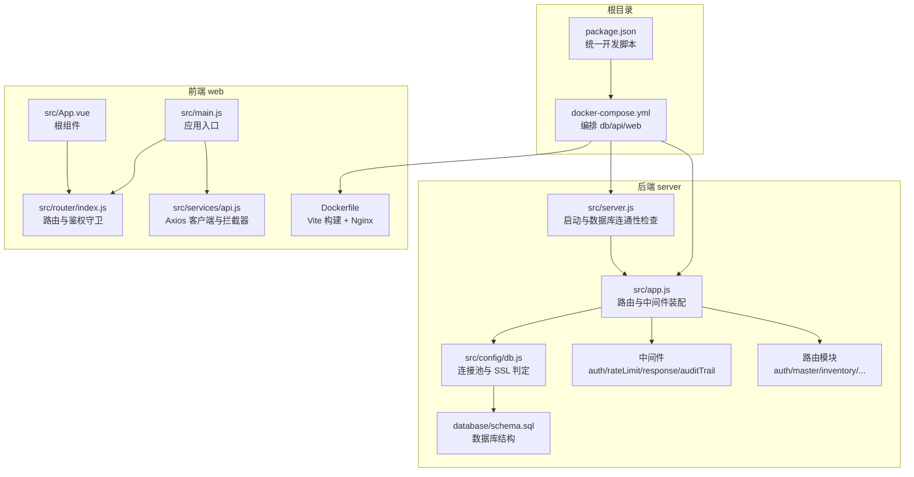

**图表来源**
- [package.json:1-20](file://package.json#L1-L20)
- [docker-compose.yml:1-57](file://docker-compose.yml#L1-L57)
- [server/src/app.js:1-67](file://server/src/app.js#L1-L67)
- [server/src/server.js:1-28](file://server/src/server.js#L1-L28)
- [server/src/config/db.js:1-25](file://server/src/config/db.js#L1-L25)
- [web/src/main.js:1-14](file://web/src/main.js#L1-L14)
- [web/src/App.vue:1-9](file://web/src/App.vue#L1-L9)
- [web/src/router/index.js:1-209](file://web/src/router/index.js#L1-L209)
- [web/src/services/api.js:1-45](file://web/src/services/api.js#L1-L45)
- [server/database/schema.sql:1-200](file://server/database/schema.sql#L1-L200)

**章节来源**
- [README.md:22-29](file://README.md#L22-L29)
- [package.json:6-12](file://package.json#L6-L12)
- [docker-compose.yml:1-57](file://docker-compose.yml#L1-L57)

## 核心组件
- 后端 Express 应用
  - 中间件层：安全头、CORS、日志、统一响应包装、审计日志、JWT 鉴权与 RBAC 授权、速率限制。
  - 路由层：按业务域划分的 RESTful 路由集合，覆盖认证、主数据、库存、仪表盘、报表、告警、审计、盘点、市场渠道、订单、物流、供应商、通知、设置、银行流水等。
  - 数据访问：基于 pg 连接池，支持根据连接字符串与环境变量动态启用 SSL；启动阶段进行数据库连通性超时保护。
- 前端 Vue 3 应用
  - 应用入口：注册 Pinia 状态管理与 Vue Router。
  - 路由：声明式懒加载路由与基于元信息的鉴权守卫（登录态、角色）。
  - 服务层：Axios 客户端封装，自动注入令牌、成本通道令牌与本地化头部，统一封装响应与错误处理。
- 数据库
  - PostgreSQL 16，初始结构与种子数据通过 Docker 入口脚本自动执行，包含用户、分类、仓库、商品、库存、市场渠道相关表等。

**章节来源**
- [server/src/app.js:28-56](file://server/src/app.js#L28-L56)
- [server/src/middleware/auth.js:1-46](file://server/src/middleware/auth.js#L1-L46)
- [server/src/middleware/rateLimit.js:1-40](file://server/src/middleware/rateLimit.js#L1-L40)
- [server/src/config/db.js:13-24](file://server/src/config/db.js#L13-L24)
- [web/src/main.js:7-13](file://web/src/main.js#L7-L13)
- [web/src/router/index.js:187-206](file://web/src/router/index.js#L187-L206)
- [web/src/services/api.js:3-44](file://web/src/services/api.js#L3-L44)
- [server/database/schema.sql:1-200](file://server/database/schema.sql#L1-L200)

## 架构总览
系统采用典型的前后端分离架构：前端 Vue 3 通过 Axios 与后端 Express API 通信；后端以中间件与路由组织业务逻辑，使用 PostgreSQL 存储数据。Docker Compose 将数据库、后端 API 与前端静态资源容器化，便于本地开发与部署。

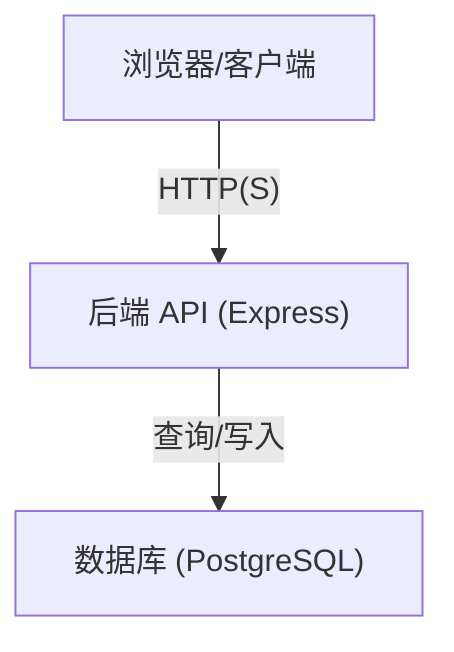

**图表来源**
- [web/src/services/api.js:1-45](file://web/src/services/api.js#L1-L45)
- [server/src/app.js:36-55](file://server/src/app.js#L36-L55)
- [server/src/config/db.js:15-24](file://server/src/config/db.js#L15-L24)

## 详细组件分析

### 后端应用与路由装配
- 中间件顺序与职责
  - 安全与通用：Helmet、CORS、JSON 解析、日志、统一响应包装、审计日志。
  - 路由前：鉴权中间件在各业务路由前执行，确保受保护接口具备有效 JWT 与可用用户。
  - 错误兜底：统一错误处理器，避免内部堆栈泄露。
- 路由分发
  - 以 /api 前缀分发至各业务域路由，便于扩展与维护。
- 健康检查
  - 提供 /api/health 快速验证后端可用性。

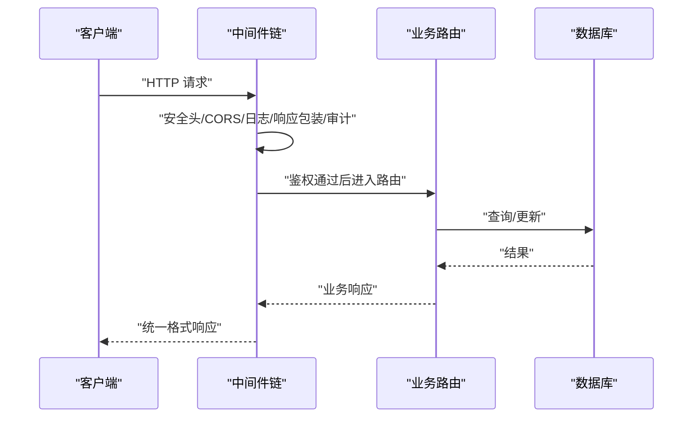

**图表来源**
- [server/src/app.js:28-64](file://server/src/app.js#L28-L64)
- [server/src/middleware/auth.js:5-29](file://server/src/middleware/auth.js#L5-L29)

**章节来源**
- [server/src/app.js:28-64](file://server/src/app.js#L28-L64)

### 认证与授权（JWT + RBAC）
- JWT 验证
  - 从 Authorization 头解析 Bearer Token，使用密钥验证并回查用户信息，校验用户是否激活。
- 角色授权
  - 基于用户角色的访问控制，路由元信息中声明所需角色，未满足则返回 403。
- 前端集成
  - Axios 请求拦截器自动附加 Authorization 头；登录成功后存储令牌与用户信息，路由守卫读取本地存储进行跳转控制。

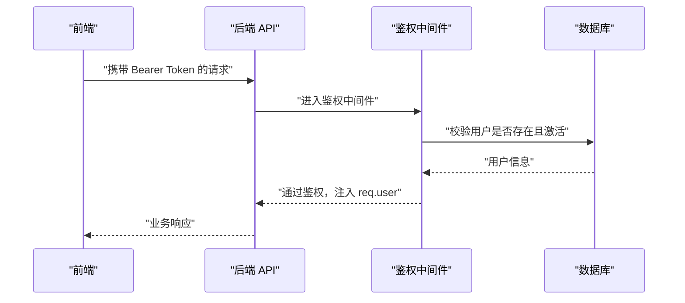

**图表来源**
- [server/src/middleware/auth.js:5-29](file://server/src/middleware/auth.js#L5-L29)
- [web/src/services/api.js:8-24](file://web/src/services/api.js#L8-L24)
- [web/src/router/index.js:188-205](file://web/src/router/index.js#L188-L205)

**章节来源**
- [server/src/middleware/auth.js:1-46](file://server/src/middleware/auth.js#L1-L46)
- [web/src/services/api.js:1-45](file://web/src/services/api.js#L1-L45)
- [web/src/router/index.js:187-206](file://web/src/router/index.js#L187-L206)

### 速率限制（防刷与保护）
- 基于内存桶的滑动窗口限流，支持自定义时间窗与最大请求数。
- 对超过阈值的请求返回统一错误格式与 Retry-After 头，便于客户端退避重试。

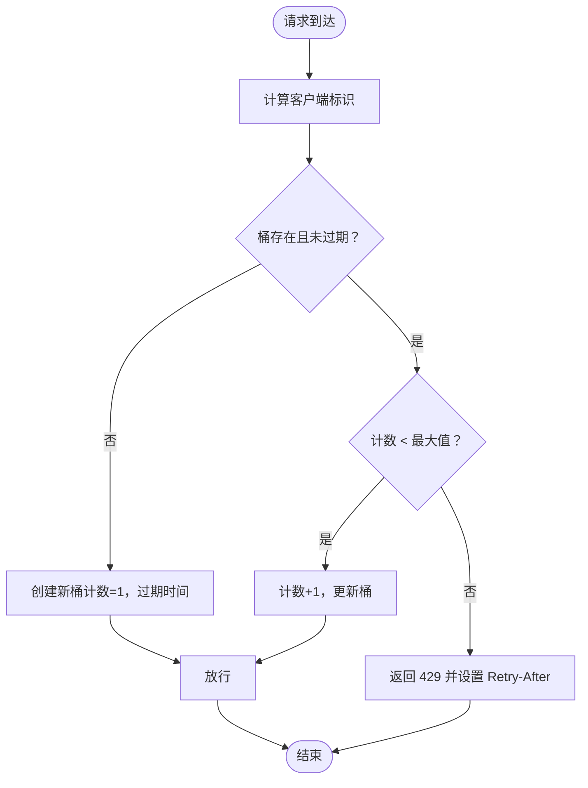

**图表来源**
- [server/src/middleware/rateLimit.js:9-35](file://server/src/middleware/rateLimit.js#L9-L35)

**章节来源**
- [server/src/middleware/rateLimit.js:1-40](file://server/src/middleware/rateLimit.js#L1-L40)

### 审计日志（操作追踪）
- 在关键业务流程中写入审计日志，记录用户、实体类型、方法、路径、描述与元数据。
- 通过统一工具函数持久化到数据库，便于合规与问题追溯。

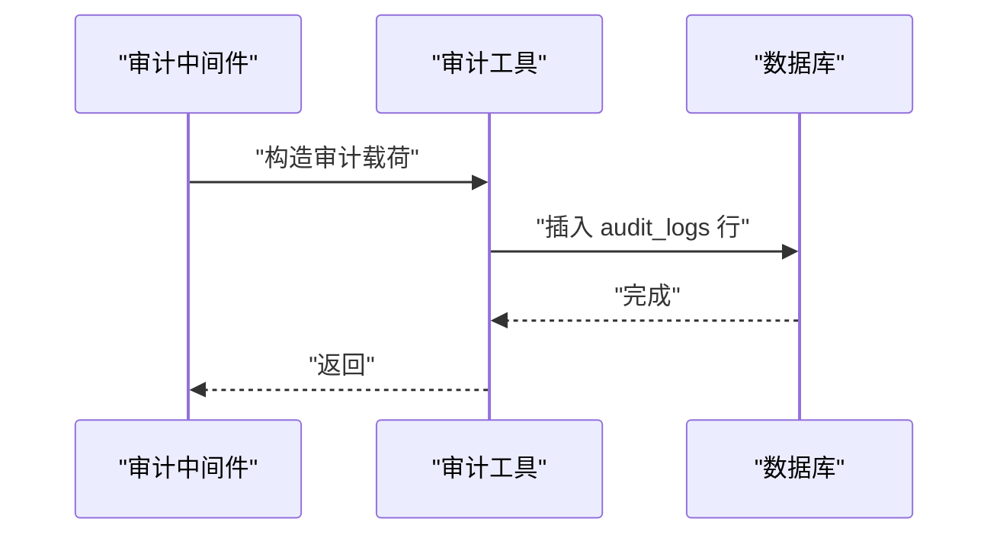

**图表来源**
- [server/src/utils/auditLog.js:1-38](file://server/src/utils/auditLog.js#L1-L38)

**章节来源**
- [server/src/utils/auditLog.js:1-38](file://server/src/utils/auditLog.js#L1-L38)

### 前端应用与路由守卫
- 应用入口注册 Pinia 与路由，全局挂载 Toast 中心组件。
- 路由守卫基于元信息判断是否需要登录、是否仅访客可访问、以及角色权限，未满足则重定向至登录或仪表盘。
- Axios 客户端默认注入令牌、成本通道令牌与本地化头部，统一封装响应与错误消息。

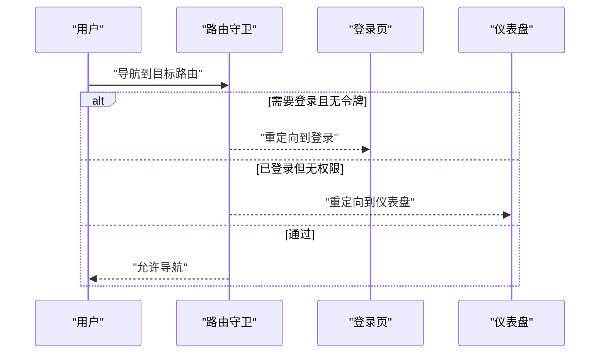

**图表来源**
- [web/src/router/index.js:188-205](file://web/src/router/index.js#L188-L205)
- [web/src/App.vue:1-9](file://web/src/App.vue#L1-L9)
- [web/src/main.js:7-13](file://web/src/main.js#L7-L13)

**章节来源**
- [web/src/router/index.js:1-209](file://web/src/router/index.js#L1-L209)
- [web/src/services/api.js:1-45](file://web/src/services/api.js#L1-L45)
- [web/src/App.vue:1-9](file://web/src/App.vue#L1-L9)

### 数据库与连接策略
- 连接池
  - 使用 pg.Pool，支持根据连接字符串与环境变量动态启用 SSL；设置连接超时。
- 初始化
  - Docker 入口脚本自动执行 schema.sql 与 seed.sql，确保开发环境快速就绪。
- 结构概览
  - 用户、分类、仓库、商品、库存、市场渠道连接与同步相关表等。

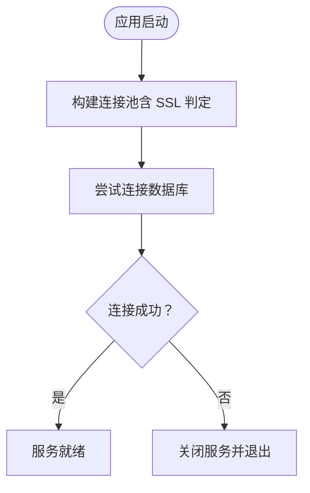

**图表来源**
- [server/src/config/db.js:13-24](file://server/src/config/db.js#L13-L24)
- [server/src/server.js:13-25](file://server/src/server.js#L13-L25)

**章节来源**
- [server/src/config/db.js:1-25](file://server/src/config/db.js#L1-L25)
- [server/src/server.js:1-28](file://server/src/server.js#L1-L28)
- [server/database/schema.sql:1-200](file://server/database/schema.sql#L1-L200)

## 依赖关系分析
- 技术栈与版本要点
  - 后端：Node.js 20、Express、pg、helmet、cors、morgan、bcryptjs、jsonwebtoken、multer。
  - 前端：Vue 3、Vue Router、Pinia、Axios、Chart.js、jsPDF、TailwindCSS、Vite、Wrangler（Cloudflare Workers 预览）。
- 关键依赖关系
  - 前端 Axios 依赖后端 /api 前缀接口；后端路由以 /api 开头统一管理。
  - 后端中间件依赖数据库连接池；路由依赖鉴权与审计工具。
  - Dockerfile 分别构建后端与前端镜像，Compose 编排三服务。

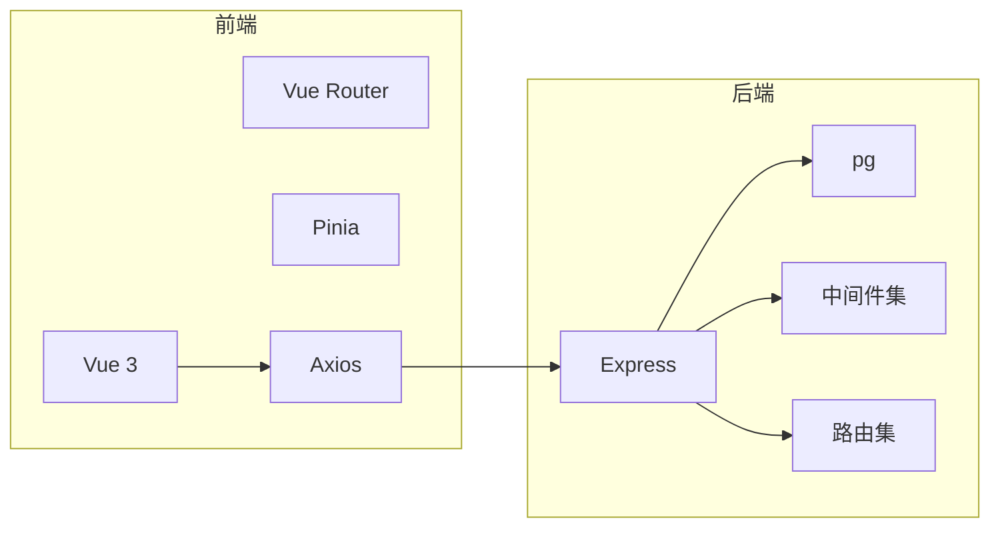

**图表来源**
- [web/package.json:12-32](file://web/package.json#L12-L32)
- [server/package.json:15-29](file://server/package.json#L15-L29)
- [server/src/app.js:9-25](file://server/src/app.js#L9-L25)
- [server/src/config/db.js:1-24](file://server/src/config/db.js#L1-L24)

**章节来源**
- [web/package.json:1-34](file://web/package.json#L1-L34)
- [server/package.json:1-31](file://server/package.json#L1-L31)
- [server/src/app.js:1-67](file://server/src/app.js#L1-L67)

## 性能考量
- 连接池与超时
  - 后端启动阶段对数据库连接设置超时，避免长时间阻塞导致进程无法启动。
- 传输与解析
  - 后端 JSON 解析设置上限，防止异常体积请求造成内存压力。
- 前端构建
  - 前端使用 Vite 构建，Nginx 提供静态资源服务，适合高并发访问。
- 可扩展建议
  - 引入连接池参数调优、数据库索引优化、缓存层（如 Redis）用于热点数据与会话存储。
  - 前端按需加载与路由懒加载已实现，可进一步拆分包与启用压缩。
  - 后端引入更细粒度的限流策略与熔断降级，结合可观测性指标。

[本节为通用指导，无需列出章节来源]

## 故障排查指南
- 健康检查
  - 后端健康端点：访问 /api/health 确认服务可用。
- 启动失败
  - 若数据库连接超时，检查连接字符串、网络与容器健康状态。
- 登录与权限
  - 前端路由守卫会根据本地存储的令牌与角色进行跳转；若提示无权限，检查用户角色与路由元信息。
- 错误响应
  - 后端统一错误中间件会将错误包装为统一格式；前端 Axios 拦截器会将后端错误消息透传到界面提示。

**章节来源**
- [server/src/app.js:36-38](file://server/src/app.js#L36-L38)
- [server/src/server.js:18-24](file://server/src/server.js#L18-L24)
- [web/src/router/index.js:188-205](file://web/src/router/index.js#L188-L205)
- [web/src/services/api.js:36-42](file://web/src/services/api.js#L36-L42)

## 结论
该库存管理系统以清晰的前后端分离架构为基础，后端通过中间件与路由实现安全、可审计与可扩展的 API 层，前端以 Vue 3 与现代工具链提供良好的用户体验。Docker Compose 与数据库初始化脚本降低了本地开发门槛。建议在生产环境中完善监控、缓存与限流策略，并持续优化数据库索引与查询性能。

[本节为总结性内容，无需列出章节来源]

## 附录

### 系统上下文图
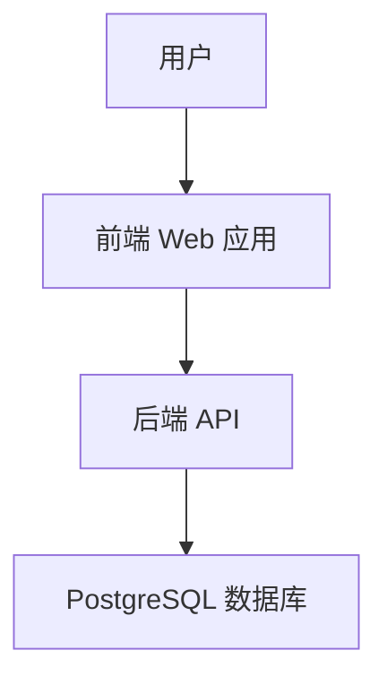

**图表来源**
- [web/src/services/api.js:1-45](file://web/src/services/api.js#L1-L45)
- [server/src/app.js:36-55](file://server/src/app.js#L36-L55)
- [server/src/config/db.js:15-24](file://server/src/config/db.js#L15-L24)

### 组件分解图（后端）
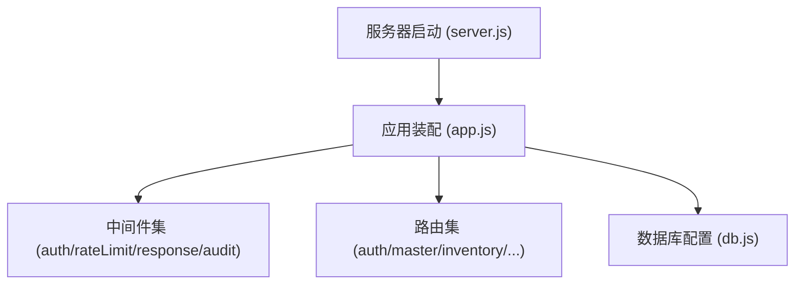

**图表来源**
- [server/src/app.js:1-67](file://server/src/app.js#L1-L67)
- [server/src/server.js:1-28](file://server/src/server.js#L1-L28)
- [server/src/config/db.js:1-25](file://server/src/config/db.js#L1-L25)

### 组件分解图（前端）
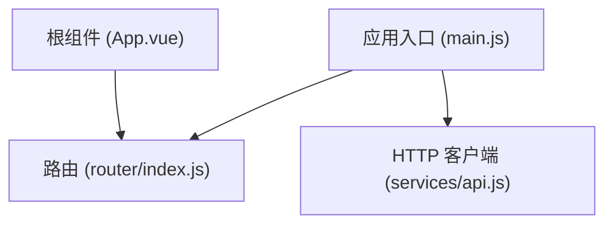

**图表来源**
- [web/src/main.js:1-14](file://web/src/main.js#L1-L14)
- [web/src/router/index.js:1-209](file://web/src/router/index.js#L1-L209)
- [web/src/services/api.js:1-45](file://web/src/services/api.js#L1-L45)
- [web/src/App.vue:1-9](file://web/src/App.vue#L1-L9)

### 基础设施与部署拓扑
- 本地开发
  - 使用 docker-compose 启动 db、api、web 三服务；前端通过 8080 端口访问，后端健康检查端点为 4000 端口。
- 容器镜像
  - 后端：基于 node:20-alpine，生产安装去 dev 依赖。
  - 前端：Vite 构建产物复制至 Nginx 镜像，提供静态服务。
- 数据库初始化
  - 容器启动时自动执行 schema.sql 与 seed.sql。

**章节来源**
- [docker-compose.yml:1-57](file://docker-compose.yml#L1-L57)
- [server/Dockerfile:1-13](file://server/Dockerfile#L1-L13)
- [web/Dockerfile:1-19](file://web/Dockerfile#L1-L19)
- [README.md:73-105](file://README.md#L73-L105)

### 横切关注点
- 安全性
  - Helmet 设置安全头；CORS 放通；JWT 鉴权；RBAC 授权；速率限制。
- 监控与可观测性
  - 建议引入日志聚合、指标采集与告警；后端已内置 Morgan 日志。
- 灾难恢复
  - 建议对数据库进行定期备份与恢复演练；容器编排便于快速重建。

**章节来源**
- [server/src/app.js:28-34](file://server/src/app.js#L28-L34)
- [server/src/middleware/rateLimit.js:1-40](file://server/src/middleware/rateLimit.js#L1-L40)
- [server/src/middleware/auth.js:1-46](file://server/src/middleware/auth.js#L1-L46)