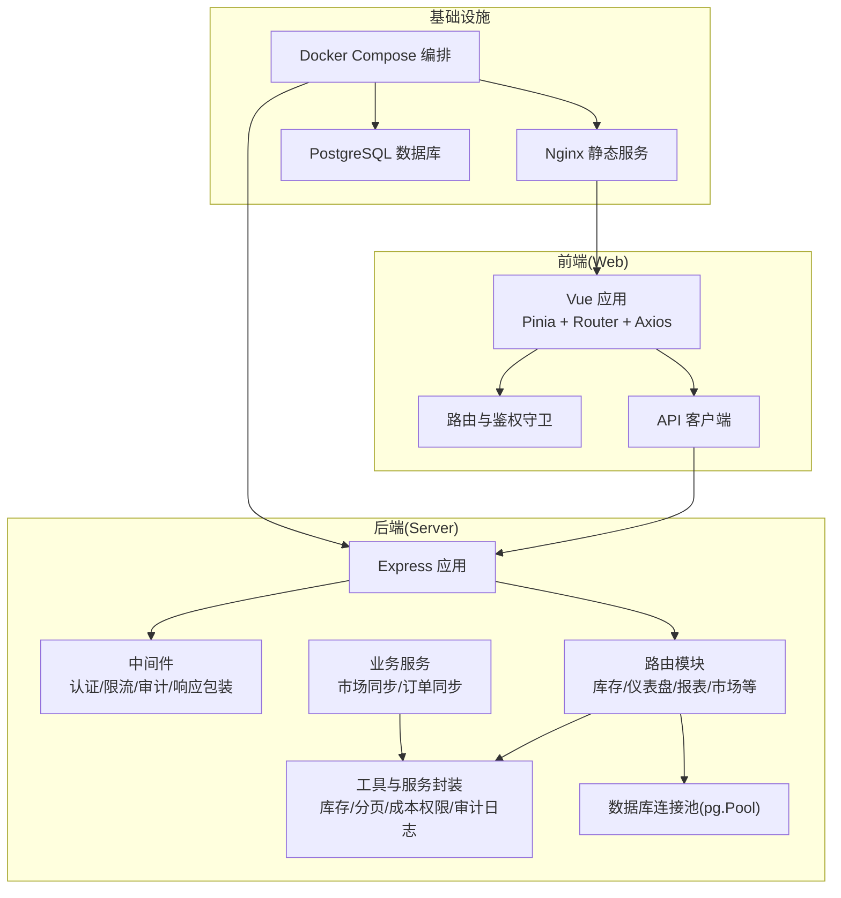
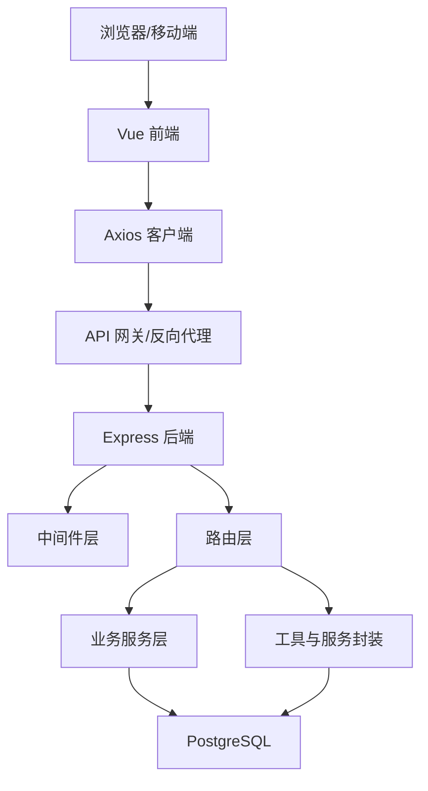
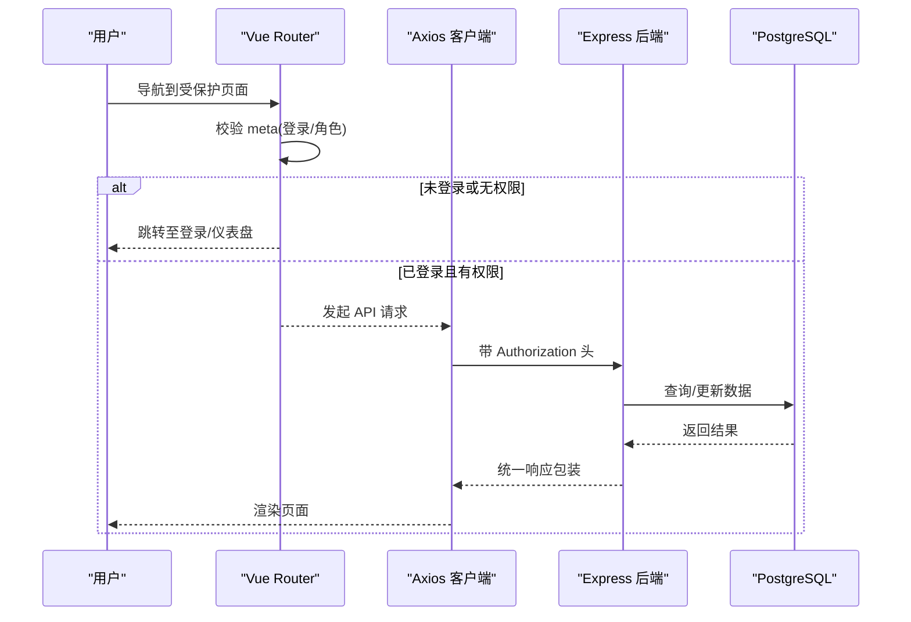
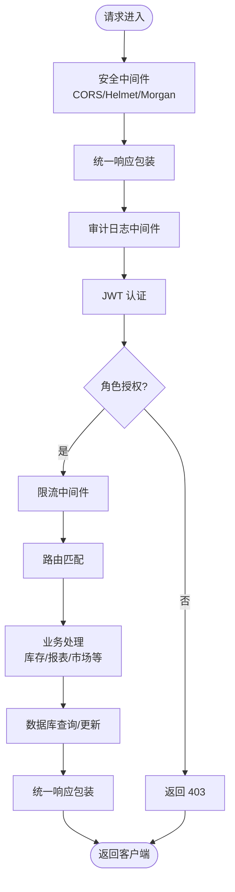
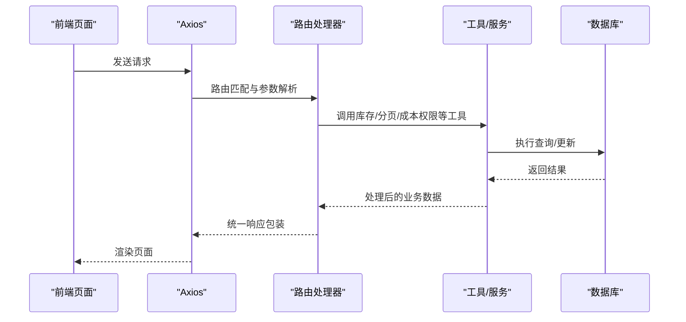
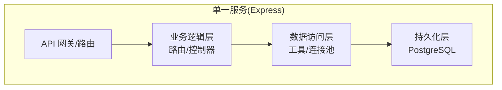
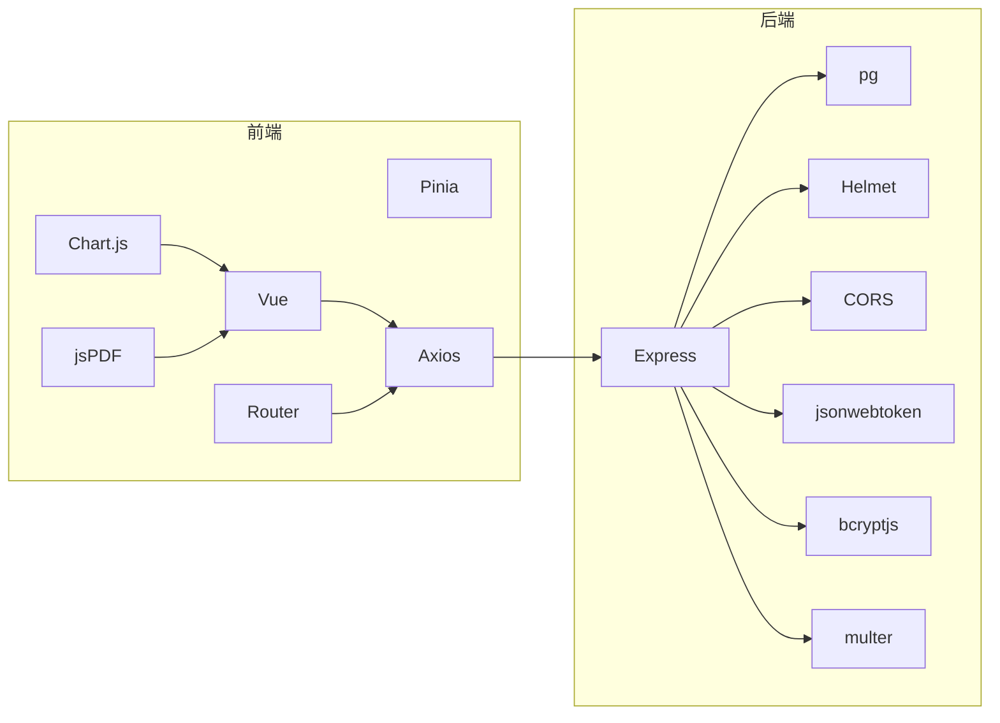

# 系统架构

<cite>
**本文引用的文件**
- [README.md](file://README.md)
- [docker-compose.yml](file://docker-compose.yml)
- [server/package.json](file://server/package.json)
- [web/package.json](file://web/package.json)
- [server/src/app.js](file://server/src/app.js)
- [server/src/server.js](file://server/src/server.js)
- [server/src/config/db.js](file://server/src/config/db.js)
- [server/src/middleware/auth.js](file://server/src/middleware/auth.js)
- [server/src/middleware/rateLimit.js](file://server/src/middleware/rateLimit.js)
- [server/src/middleware/auditTrail.js](file://server/src/middleware/auditTrail.js)
- [server/src/middleware/response.js](file://server/src/middleware/response.js)
- [server/src/routes/inventoryRoutes.js](file://server/src/routes/inventoryRoutes.js)
- [server/src/utils/inventoryService.js](file://server/src/utils/inventoryService.js)
- [server/src/utils/pagination.js](file://server/src/utils/pagination.js)
- [server/src/utils/costAccess.js](file://server/src/utils/costAccess.js)
- [server/src/utils/auditLog.js](file://server/src/utils/auditLog.js)
- [server/src/services/marketplaceSyncService.js](file://server/src/services/marketplaceSyncService.js)
- [server/src/services/orderSyncService.js](file://server/src/services/orderSyncService.js)
- [server/database/schema.sql](file://server/database/schema.sql)
- [server/database/seed.sql](file://server/database/seed.sql)
- [server/Dockerfile](file://server/Dockerfile)
- [web/Dockerfile](file://web/Dockerfile)
- [web/src/main.js](file://web/src/main.js)
- [web/src/router/index.js](file://web/src/router/index.js)
- [web/src/services/api.js](file://web/src/services/api.js)
- [web/nginx.conf](file://web/nginx.conf)
- [web/vite.config.js](file://web/vite.config.js)
- [web/tailwind.config.js](file://web/tailwind.config.js)
- [web/wrangler.jsonc](file://web/wrangler.jsonc)
- [web/wrangler.toml](file://web/wrangler.toml)
- [web/worker.js](file://web/worker.js)
</cite>

## 目录
1. [引言](#引言)
2. [项目结构](#项目结构)
3. [核心组件](#核心组件)
4. [架构总览](#架构总览)
5. [详细组件分析](#详细组件分析)
6. [依赖分析](#依赖分析)
7. [性能考量](#性能考量)
8. [故障排查指南](#故障排查指南)
9. [结论](#结论)
10. [附录](#附录)

## 引言
本系统是一个前后端分离的库存管理系统，采用 Vue 3 前端与 Express 后端配合 PostgreSQL 数据库的架构。系统提供产品、分类、仓库、库存、出入库流水、报表、告警、审计日志、市场同步等核心能力，并通过 JWT 实现认证与基于角色的访问控制（RBAC）。系统支持本地开发与容器化部署，包含 Docker Compose 编排、Nginx 静态资源服务以及 Cloudflare Workers 的边缘部署配置。

## 项目结构
系统由三个主要部分组成：
- server：Express API 服务，负责业务逻辑、路由、中间件、数据库连接池与安全策略。
- web：Vue 3 前端应用，使用 Pinia 状态管理、Vue Router 路由、Tailwind CSS 样式，Axios 进行 API 通信。
- docker-compose：编排数据库、后端 API、前端静态站点，提供一键启动与健康检查。

图表来源
- [server/src/app.js:1-65](file://server/src/app.js#L1-L65)
- [server/src/server.js:1-28](file://server/src/server.js#L1-L28)
- [server/src/config/db.js:1-25](file://server/src/config/db.js#L1-L25)
- [web/src/main.js:1-14](file://web/src/main.js#L1-L14)
- [web/src/router/index.js:1-202](file://web/src/router/index.js#L1-L202)
- [web/src/services/api.js:1-45](file://web/src/services/api.js#L1-L45)
- [docker-compose.yml:1-57](file://docker-compose.yml#L1-L57)

章节来源
- [README.md:22-29](file://README.md#L22-L29)
- [docker-compose.yml:1-57](file://docker-compose.yml#L1-L57)

## 核心组件
- 前端应用（Vue 3）
  - 使用 Pinia 管理全局状态，Vue Router 提供页面导航与鉴权守卫，Axios 封装统一请求拦截器与响应处理。
  - 通过环境变量 VITE_API_URL 指向后端 API，默认代理到 /api。
- 后端应用（Express）
  - 中间件链路：安全头、CORS、日志、JSON 解析、统一响应包装、审计日志、认证与限流。
  - 路由模块按功能域划分，如库存、仪表盘、报表、市场、订单、通知、设置等。
  - 数据库连接池使用 pg.Pool，支持 SSL 与超时配置。
- 数据库（PostgreSQL）
  - 包含用户、分类、仓库、产品、库存、流水、市场同步、订单、审计日志等表结构。
- 部署与运行
  - Docker Compose 启动 db、api、web；Nginx 提供静态资源；Cloudflare Workers 支持边缘部署。

章节来源
- [web/src/main.js:1-14](file://web/src/main.js#L1-L14)
- [web/src/router/index.js:1-202](file://web/src/router/index.js#L1-L202)
- [web/src/services/api.js:1-45](file://web/src/services/api.js#L1-L45)
- [server/src/app.js:1-65](file://server/src/app.js#L1-L65)
- [server/src/config/db.js:1-25](file://server/src/config/db.js#L1-L25)
- [server/database/schema.sql:1-200](file://server/database/schema.sql#L1-L200)

## 架构总览
系统采用前后端分离架构，前端通过 Axios 与后端 API 通信，后端以 Express 提供 REST 风格接口，数据库为 PostgreSQL。中间件层提供认证、授权、限流、审计与统一响应包装，路由层按业务域组织，工具层封装通用逻辑（库存、分页、成本权限、审计日志）。

图表来源
- [web/src/services/api.js:1-45](file://web/src/services/api.js#L1-L45)
- [server/src/app.js:1-65](file://server/src/app.js#L1-L65)
- [server/src/config/db.js:1-25](file://server/src/config/db.js#L1-L25)

## 详细组件分析

### 前端组件分析（Vue 3 + Pinia + Router + Axios）
- 应用入口与全局注册
  - 创建应用实例，统一挂载 Pinia 与 Router，便于页面共享状态与导航。
- 路由与鉴权
  - 基于 meta 字段定义是否需要登录、是否仅访客可进入、角色白名单。
  - 前置守卫从本地存储读取 token 与用户信息，进行跳转控制。
- API 客户端
  - 自动注入 Authorization 与成本访问令牌、语言等头部。
  - 统一响应处理：当后端返回 success=true 时提取 data，否则透传错误消息。

图表来源
- [web/src/router/index.js:180-199](file://web/src/router/index.js#L180-L199)
- [web/src/services/api.js:8-42](file://web/src/services/api.js#L8-L42)
- [server/src/app.js:39-53](file://server/src/app.js#L39-L53)

章节来源
- [web/src/main.js:1-14](file://web/src/main.js#L1-L14)
- [web/src/router/index.js:1-202](file://web/src/router/index.js#L1-L202)
- [web/src/services/api.js:1-45](file://web/src/services/api.js#L1-L45)

### 后端组件分析（Express + 中间件 + 路由 + 工具）
- 应用初始化与中间件
  - 安全头、CORS、日志、JSON 解析、统一响应包装、审计日志中间件按顺序加载。
  - 健康检查 /api/health 用于容器编排健康探测。
- 认证与授权
  - JWT 校验，失败返回 401；用户不存在或非激活状态同样拒绝。
  - 角色授权中间件，按需限制访问。
- 限流
  - 基于内存桶的滑动窗口限流，支持命名空间与窗口大小配置。
- 审计日志
  - 对 POST/PUT/PATCH/DELETE 且 2xx 的请求记录操作上下文、用户信息与请求体摘要。
- 路由与业务
  - 库存路由示例：支持分页、搜索、筛选、低库存过滤；同时提供全量加载与分页查询两种模式。
  - 工具函数封装库存行确保、查询与更新，保证多处调用的一致性。
- 数据库连接
  - pg.Pool 连接池，根据连接字符串与环境变量决定是否启用 SSL 与连接超时。

图表来源
- [server/src/app.js:27-62](file://server/src/app.js#L27-L62)
- [server/src/middleware/auth.js:1-46](file://server/src/middleware/auth.js#L1-L46)
- [server/src/middleware/rateLimit.js:1-40](file://server/src/middleware/rateLimit.js#L1-L40)
- [server/src/middleware/auditTrail.js:1-84](file://server/src/middleware/auditTrail.js#L1-L84)
- [server/src/routes/inventoryRoutes.js:1-200](file://server/src/routes/inventoryRoutes.js#L1-L200)
- [server/src/utils/inventoryService.js:1-45](file://server/src/utils/inventoryService.js#L1-L45)

章节来源
- [server/src/app.js:1-65](file://server/src/app.js#L1-L65)
- [server/src/middleware/auth.js:1-46](file://server/src/middleware/auth.js#L1-L46)
- [server/src/middleware/rateLimit.js:1-40](file://server/src/middleware/rateLimit.js#L1-L40)
- [server/src/middleware/auditTrail.js:1-84](file://server/src/middleware/auditTrail.js#L1-L84)
- [server/src/routes/inventoryRoutes.js:1-200](file://server/src/routes/inventoryRoutes.js#L1-L200)
- [server/src/utils/inventoryService.js:1-45](file://server/src/utils/inventoryService.js#L1-L45)
- [server/src/config/db.js:1-25](file://server/src/config/db.js#L1-L25)

### 数据流架构（从前端到数据库）
- 用户在前端页面发起操作（如查看库存、提交出入库、导出报表）。
- Axios 客户端自动附加认证与成本访问令牌，发送到后端路由。
- 路由层调用业务服务与工具函数，必要时开启数据库事务或并发查询。
- 工具函数封装库存变更逻辑，确保一致性与可维护性。
- 数据库执行 SQL 并返回结果，后端统一包装响应，前端解析并渲染。

图表来源
- [web/src/services/api.js:1-45](file://web/src/services/api.js#L1-L45)
- [server/src/routes/inventoryRoutes.js:1-200](file://server/src/routes/inventoryRoutes.js#L1-L200)
- [server/src/utils/inventoryService.js:1-45](file://server/src/utils/inventoryService.js#L1-L45)
- [server/src/utils/pagination.js](file://server/src/utils/pagination.js)
- [server/src/utils/costAccess.js](file://server/src/utils/costAccess.js)
- [server/src/utils/auditLog.js](file://server/src/utils/auditLog.js)

章节来源
- [web/src/services/api.js:1-45](file://web/src/services/api.js#L1-L45)
- [server/src/routes/inventoryRoutes.js:1-200](file://server/src/routes/inventoryRoutes.js#L1-L200)
- [server/src/utils/inventoryService.js:1-45](file://server/src/utils/inventoryService.js#L1-L45)

### 微服务架构组件映射
当前系统为单体后端（Express），未见独立的 API 网关与多服务拆分。可将现有后端视为“单一服务”，其内部职责如下：
- API 网关（现有 Express）：集中处理认证、限流、审计、统一响应与路由转发。
- 业务逻辑层：路由与控制器，封装各领域业务规则（库存、报表、市场同步）。
- 数据访问层：工具函数与数据库连接池，提供一致的查询/更新能力。
- 持久化层：PostgreSQL 表结构覆盖用户、产品、仓库、库存、流水、审计等。

图表来源
- [server/src/app.js:1-65](file://server/src/app.js#L1-L65)
- [server/src/routes/inventoryRoutes.js:1-200](file://server/src/routes/inventoryRoutes.js#L1-L200)
- [server/src/utils/inventoryService.js:1-45](file://server/src/utils/inventoryService.js#L1-L45)
- [server/src/config/db.js:1-25](file://server/src/config/db.js#L1-L25)
- [server/database/schema.sql:1-200](file://server/database/schema.sql#L1-L200)

章节来源
- [server/src/app.js:1-65](file://server/src/app.js#L1-L65)
- [server/src/config/db.js:1-25](file://server/src/config/db.js#L1-L25)
- [server/database/schema.sql:1-200](file://server/database/schema.sql#L1-L200)

### 技术决策与权衡
- 前端：Vue 3 + Pinia + Router + Axios，轻量高效，生态成熟，适合中后台管理场景。
- 后端：Express + pg，简单易用，开发效率高，适合中小型团队快速迭代。
- 数据库：PostgreSQL，事务强一致、扩展性好，满足库存与审计日志需求。
- 安全：Helmet、CORS、JWT、审计日志、限流，形成多层防护。
- 部署：Docker Compose + Nginx，便于本地开发与生产部署；Cloudflare Workers 提供边缘部署选项。

章节来源
- [web/package.json:1-34](file://web/package.json#L1-L34)
- [server/package.json:1-31](file://server/package.json#L1-L31)
- [server/src/app.js:27-33](file://server/src/app.js#L27-L33)
- [server/src/middleware/auth.js:1-46](file://server/src/middleware/auth.js#L1-L46)
- [server/src/middleware/rateLimit.js:1-40](file://server/src/middleware/rateLimit.js#L1-L40)
- [server/src/middleware/auditTrail.js:1-84](file://server/src/middleware/auditTrail.js#L1-L84)
- [server/src/config/db.js:1-25](file://server/src/config/db.js#L1-L25)

## 依赖分析
- 前端依赖
  - 核心：Vue 3、Pinia、Vue Router、Axios。
  - 可视化与导出：Chart.js、jsPDF、jsPDF-AutoTable。
  - 开发：Vite、Tailwind CSS、Wrangler。
- 后端依赖
  - Web：Express、CORS、Helmet、Morgan。
  - 安全：bcryptjs、jsonwebtoken。
  - 数据库：pg。
  - 文件上传：multer。
- 第三方集成
  - 市场同步服务：预留对接多个平台的同步服务与日志表结构。

图表来源
- [web/package.json:12-32](file://web/package.json#L12-L32)
- [server/package.json:15-29](file://server/package.json#L15-L29)

章节来源
- [web/package.json:1-34](file://web/package.json#L1-L34)
- [server/package.json:1-31](file://server/package.json#L1-L31)

## 性能考量
- 分页与搜索：库存列表支持分页与多字段模糊搜索，避免一次性传输大量数据。
- 并发查询：库存列表在全量模式下使用 Promise.all 并发查询数据与总数，减少往返时间。
- 连接池与超时：pg.Pool 提供连接复用与超时控制，生产环境建议启用 SSL 并合理设置超时。
- 前端缓存与懒加载：路由采用动态导入，减少首屏体积；可结合浏览器缓存与服务端缓存进一步优化。
- 日志与审计：审计日志在成功写入后继续处理，不影响主流程；建议在高并发场景下评估异步写入策略。

章节来源
- [server/src/routes/inventoryRoutes.js:76-147](file://server/src/routes/inventoryRoutes.js#L76-L147)
- [server/src/utils/pagination.js](file://server/src/utils/pagination.js)
- [server/src/config/db.js:15-19](file://server/src/config/db.js#L15-L19)
- [server/src/middleware/auditTrail.js:47-76](file://server/src/middleware/auditTrail.js#L47-L76)

## 故障排查指南
- 健康检查
  - 前端：访问 /login 页面，若提示“后端服务正常，可直接登录”，表示后端已就绪。
  - 后端：访问 /api/health，应返回状态为 ok。
- 数据库连接
  - 启动时进行数据库连通性检查，超时则终止进程并输出错误信息。
  - 生产环境建议启用 SSL 并设置合理的连接超时。
- 认证失败
  - 检查 Authorization 头是否携带 Bearer Token；确认 JWT_SECRET 是否正确；核对用户状态。
- 限流触发
  - 查看响应头 retry-after 或统一错误响应中的重试秒数，等待冷却后重试。
- 审计日志
  - 成功写入后继续处理，若出现异常会记录日志，可在日志中定位问题。

章节来源
- [README.md:66-71](file://README.md#L66-L71)
- [server/src/server.js:13-25](file://server/src/server.js#L13-L25)
- [server/src/config/db.js:3-11](file://server/src/config/db.js#L3-L11)
- [server/src/middleware/auth.js:9-28](file://server/src/middleware/auth.js#L9-L28)
- [server/src/middleware/rateLimit.js:23-29](file://server/src/middleware/rateLimit.js#L23-L29)
- [server/src/middleware/auditTrail.js:73-75](file://server/src/middleware/auditTrail.js#L73-L75)

## 结论
该库存管理系统以 Vue 3 + Express + PostgreSQL 为核心，构建了清晰的前后端分离架构。通过中间件层实现安全、限流与审计，路由层按业务域组织，工具层封装通用逻辑，保障了系统的可维护性与扩展性。结合 Docker Compose 与 Nginx，实现了便捷的本地开发与生产部署。未来可根据业务增长演进为多服务微架构，但当前单体后端已能满足中小规模场景的需求。

## 附录
- 基础设施与部署
  - Docker Compose 编排：db、api、web 三服务，包含健康检查与初始化脚本挂载。
  - Nginx：提供静态资源服务与反向代理。
  - Cloudflare Workers：支持边缘部署与 Worker 脚本。
- 数据模型概览（核心实体）
  - 用户、分类、仓库、产品、库存、流水、市场同步、订单、审计日志等。
- 版本与兼容性
  - Node.js：后端使用 Node 20；前端使用 Node 20。
  - Vue 3、Express、PostgreSQL 16，均采用稳定版本。

章节来源
- [docker-compose.yml:1-57](file://docker-compose.yml#L1-L57)
- [server/Dockerfile:1-13](file://server/Dockerfile#L1-L13)
- [web/Dockerfile:1-19](file://web/Dockerfile#L1-L19)
- [web/nginx.conf](file://web/nginx.conf)
- [web/wrangler.jsonc](file://web/wrangler.jsonc)
- [web/wrangler.toml](file://web/wrangler.toml)
- [web/worker.js](file://web/worker.js)
- [server/database/schema.sql:1-200](file://server/database/schema.sql#L1-L200)