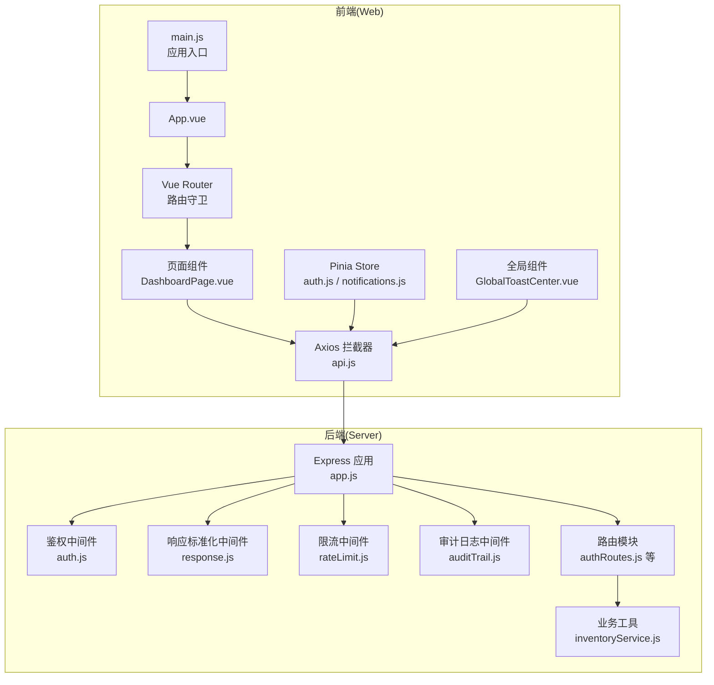
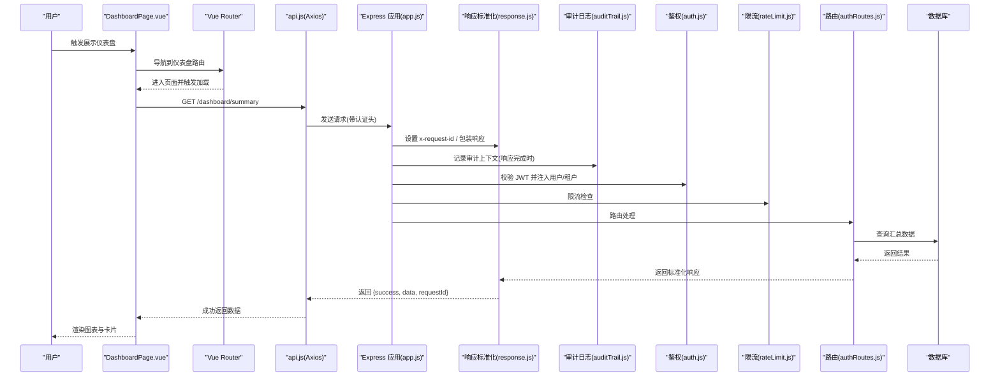
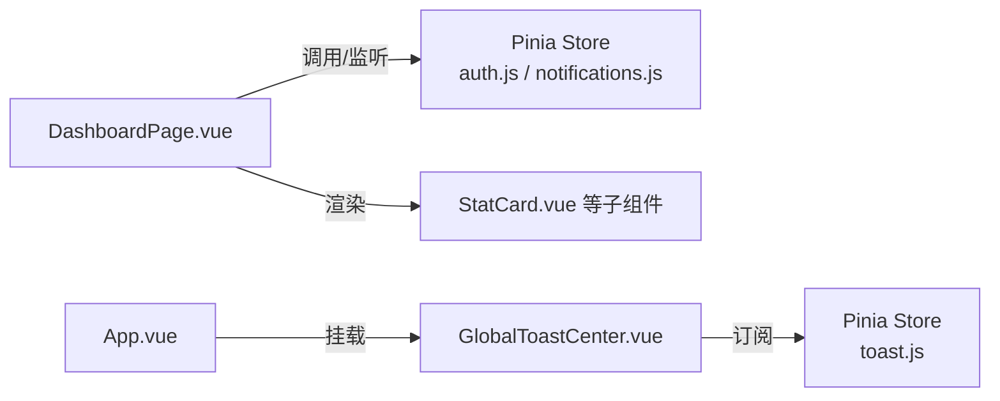
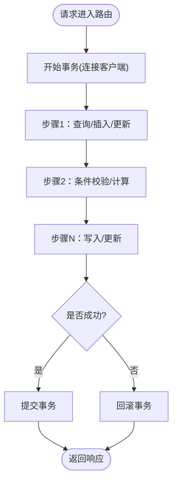
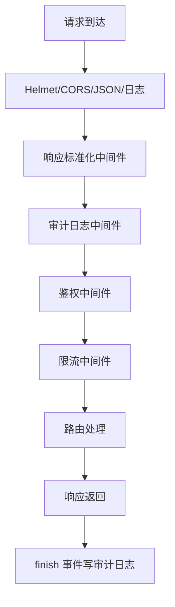
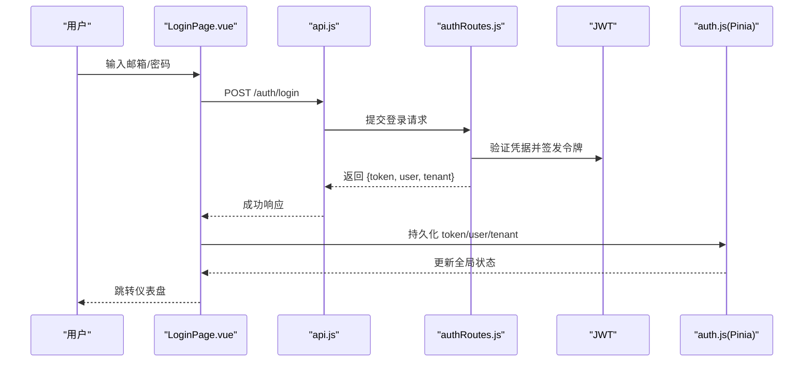
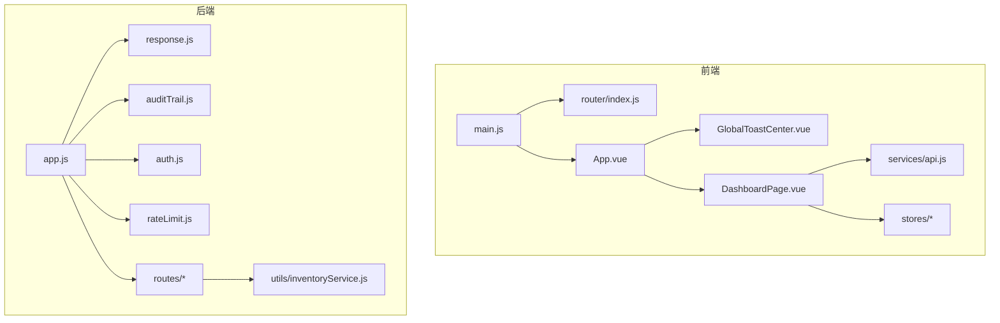

# 组件交互模式

<cite>
**本文引用的文件**
- [server/src/app.js](file://server/src/app.js)
- [server/src/middleware/auth.js](file://server/src/middleware/auth.js)
- [server/src/middleware/response.js](file://server/src/middleware/response.js)
- [server/src/middleware/rateLimit.js](file://server/src/middleware/rateLimit.js)
- [server/src/middleware/auditTrail.js](file://server/src/middleware/auditTrail.js)
- [server/src/routes/authRoutes.js](file://server/src/routes/authRoutes.js)
- [server/src/utils/inventoryService.js](file://server/src/utils/inventoryService.js)
- [web/src/main.js](file://web/src/main.js)
- [web/src/router/index.js](file://web/src/router/index.js)
- [web/src/services/api.js](file://web/src/services/api.js)
- [web/src/stores/auth.js](file://web/src/stores/auth.js)
- [web/src/stores/notifications.js](file://web/src/stores/notifications.js)
- [web/src/components/GlobalToastCenter.vue](file://web/src/components/GlobalToastCenter.vue)
- [web/src/App.vue](file://web/src/App.vue)
- [web/src/pages/DashboardPage.vue](file://web/src/pages/DashboardPage.vue)
</cite>

## 目录
1. [引言](#引言)
2. [项目结构](#项目结构)
3. [核心组件](#核心组件)
4. [架构总览](#架构总览)
5. [详细组件分析](#详细组件分析)
6. [依赖分析](#依赖分析)
7. [性能考虑](#性能考虑)
8. [故障排查指南](#故障排查指南)
9. [结论](#结论)
10. [附录](#附录)

## 引言
本文件聚焦“组件交互模式”，系统性梳理前后端组件之间的通信机制与协作方式，涵盖：
- 前端组件间通信：父子、兄弟、跨层级通信
- 后端服务协作：业务层与数据访问层交互
- 中间件在请求处理链中的作用与顺序
- 事件驱动与观察者模式的应用场景
- 典型用户操作的组件协作序列图
- 组件解耦、模块化、复用与扩展的最佳实践

## 项目结构
系统采用前后端分离架构：
- 前端基于 Vue 3 + Pinia + Vue Router，通过 Axios 发起 API 请求
- 后端基于 Express，采用中间件链式处理请求，路由模块化组织业务域
- 数据库访问通过集中配置与连接池实现，工具函数封装通用业务逻辑

图表来源
- [server/src/app.js:1-91](file://server/src/app.js#L1-L91)
- [server/src/middleware/auth.js:1-87](file://server/src/middleware/auth.js#L1-L87)
- [server/src/middleware/response.js:1-62](file://server/src/middleware/response.js#L1-L62)
- [server/src/middleware/rateLimit.js:1-40](file://server/src/middleware/rateLimit.js#L1-L40)
- [server/src/middleware/auditTrail.js:1-86](file://server/src/middleware/auditTrail.js#L1-L86)
- [server/src/routes/authRoutes.js:1-180](file://server/src/routes/authRoutes.js#L1-L180)
- [server/src/utils/inventoryService.js:1-46](file://server/src/utils/inventoryService.js#L1-L46)
- [web/src/main.js:1-14](file://web/src/main.js#L1-L14)
- [web/src/router/index.js:1-209](file://web/src/router/index.js#L1-L209)
- [web/src/services/api.js:1-45](file://web/src/services/api.js#L1-L45)
- [web/src/stores/auth.js:1-120](file://web/src/stores/auth.js#L1-L120)
- [web/src/stores/notifications.js:1-52](file://web/src/stores/notifications.js#L1-L52)
- [web/src/components/GlobalToastCenter.vue:1-41](file://web/src/components/GlobalToastCenter.vue#L1-L41)
- [web/src/App.vue:1-9](file://web/src/App.vue#L1-L9)

章节来源
- [server/src/app.js:1-91](file://server/src/app.js#L1-L91)
- [web/src/main.js:1-14](file://web/src/main.js#L1-L14)

## 核心组件
- 前端应用入口与状态管理
  - 应用入口负责挂载路由与状态管理，确保页面共享状态与导航能力
  - 路由守卫基于本地存储判断登录态与角色权限，实现页面级鉴权
  - API 拦截器统一注入认证令牌与国际化语言头，统一封装响应体结构
  - Pinia Store 将用户、通知等横切关注点集中管理，便于跨组件共享
- 后端应用与中间件链
  - Express 应用集中配置安全头、CORS、日志、响应标准化与审计日志
  - 鉴权中间件解析 JWT 并注入用户与租户上下文
  - 限流中间件按客户端 IP 与命名空间进行速率控制
  - 审计中间件在响应完成后记录审计日志，包含实体类型、动作与元数据
  - 路由模块按业务域划分，结合工具函数实现事务与数据一致性

章节来源
- [web/src/main.js:1-14](file://web/src/main.js#L1-L14)
- [web/src/router/index.js:187-206](file://web/src/router/index.js#L187-L206)
- [web/src/services/api.js:7-42](file://web/src/services/api.js#L7-L42)
- [web/src/stores/auth.js:19-119](file://web/src/stores/auth.js#L19-L119)
- [server/src/app.js:47-88](file://server/src/app.js#L47-L88)
- [server/src/middleware/auth.js:4-80](file://server/src/middleware/auth.js#L4-L80)
- [server/src/middleware/rateLimit.js:9-35](file://server/src/middleware/rateLimit.js#L9-L35)
- [server/src/middleware/auditTrail.js:47-81](file://server/src/middleware/auditTrail.js#L47-L81)

## 架构总览
从前端到后端的典型请求链路如下：

图表来源
- [web/src/pages/DashboardPage.vue:310-344](file://web/src/pages/DashboardPage.vue#L310-L344)
- [web/src/router/index.js:187-206](file://web/src/router/index.js#L187-L206)
- [web/src/services/api.js:7-42](file://web/src/services/api.js#L7-L42)
- [server/src/app.js:47-88](file://server/src/app.js#L47-L88)
- [server/src/middleware/response.js:3-57](file://server/src/middleware/response.js#L3-L57)
- [server/src/middleware/auditTrail.js:47-81](file://server/src/middleware/auditTrail.js#L47-L81)
- [server/src/middleware/auth.js:4-80](file://server/src/middleware/auth.js#L4-L80)
- [server/src/middleware/rateLimit.js:9-35](file://server/src/middleware/rateLimit.js#L9-L35)
- [server/src/routes/authRoutes.js:22-98](file://server/src/routes/authRoutes.js#L22-L98)

## 详细组件分析

### 前端组件间通信模式
- 父子组件通信
  - 页面组件通过 Pinia Store 获取与更新全局状态，实现与子组件的数据传递
  - 示例：仪表盘页面使用统计卡片组件渲染数据，数据来自 Store 与 API 请求
- 兄弟组件通信
  - 通过全局 Toast 中心组件与 Pinia Store 实现跨组件的消息与状态同步
  - 示例：全局 Toast 组件订阅 Toast Store，实现跨页面提示
- 跨层级组件通信
  - 通过路由守卫与状态管理实现跨页面的鉴权与数据恢复
  - 示例：路由守卫检查登录态与角色，Store 持久化用户信息，页面刷新后恢复

图表来源
- [web/src/pages/DashboardPage.vue:310-344](file://web/src/pages/DashboardPage.vue#L310-L344)
- [web/src/stores/auth.js:19-119](file://web/src/stores/auth.js#L19-L119)
- [web/src/stores/notifications.js:1-52](file://web/src/stores/notifications.js#L1-L52)
- [web/src/components/GlobalToastCenter.vue:1-41](file://web/src/components/GlobalToastCenter.vue#L1-L41)
- [web/src/App.vue:1-9](file://web/src/App.vue#L1-L9)

章节来源
- [web/src/pages/DashboardPage.vue:310-344](file://web/src/pages/DashboardPage.vue#L310-L344)
- [web/src/components/GlobalToastCenter.vue:1-41](file://web/src/components/GlobalToastCenter.vue#L1-L41)
- [web/src/App.vue:1-9](file://web/src/App.vue#L1-L9)

### 后端服务协作方式
- 业务逻辑层与数据访问层
  - 业务逻辑集中在路由模块，数据访问通过统一查询方法与连接池实现
  - 事务控制在路由层使用连接客户端包裹，保证多步写入的一致性
  - 通用库存操作封装在工具函数中，避免重复事务代码，按租户隔离

图表来源
- [server/src/routes/authRoutes.js:121-171](file://server/src/routes/authRoutes.js#L121-L171)
- [server/src/utils/inventoryService.js:3-39](file://server/src/utils/inventoryService.js#L3-L39)

章节来源
- [server/src/routes/authRoutes.js:121-171](file://server/src/routes/authRoutes.js#L121-L171)
- [server/src/utils/inventoryService.js:3-39](file://server/src/utils/inventoryService.js#L3-L39)

### 中间件执行顺序与职责
- 执行顺序
  - 安全与基础：Helmet、CORS、JSON 解析、日志
  - 响应标准化：统一包装响应体与 requestId
  - 审计日志：在响应完成后记录审计事件
  - 鉴权与限流：按需注入用户上下文与速率限制
- 职责边界
  - 响应标准化：保证前后端一致的响应格式
  - 审计日志：记录用户行为与系统操作，便于合规与追踪
  - 鉴权：校验 JWT、角色授权与租户上下文
  - 限流：保护接口免受滥用

图表来源
- [server/src/app.js:47-88](file://server/src/app.js#L47-L88)
- [server/src/middleware/response.js:3-57](file://server/src/middleware/response.js#L3-L57)
- [server/src/middleware/auditTrail.js:47-81](file://server/src/middleware/auditTrail.js#L47-L81)
- [server/src/middleware/auth.js:4-80](file://server/src/middleware/auth.js#L4-L80)
- [server/src/middleware/rateLimit.js:9-35](file://server/src/middleware/rateLimit.js#L9-L35)

章节来源
- [server/src/app.js:47-88](file://server/src/app.js#L47-L88)

### 典型用户操作：登录流程

图表来源
- [web/src/services/api.js:7-42](file://web/src/services/api.js#L7-L42)
- [server/src/routes/authRoutes.js:22-98](file://server/src/routes/authRoutes.js#L22-L98)
- [web/src/stores/auth.js:53-82](file://web/src/stores/auth.js#L53-L82)

章节来源
- [server/src/routes/authRoutes.js:22-98](file://server/src/routes/authRoutes.js#L22-L98)
- [web/src/stores/auth.js:53-82](file://web/src/stores/auth.js#L53-L82)

### 事件驱动与观察者模式
- 观察者模式
  - 全局 Toast 组件订阅 Toast Store，实现跨页面的通知展示
  - 通知 Store 订阅后端通知列表，实现未读数与消息同步
- 事件驱动
  - 路由守卫在导航前触发鉴权与权限检查，属于前端侧的事件驱动
  - 审计中间件在响应完成时触发写审计日志，属于事件驱动的异步处理

章节来源
- [web/src/components/GlobalToastCenter.vue:1-41](file://web/src/components/GlobalToastCenter.vue#L1-L41)
- [web/src/stores/notifications.js:13-31](file://web/src/stores/notifications.js#L13-L31)
- [web/src/router/index.js:187-206](file://web/src/router/index.js#L187-L206)
- [server/src/middleware/auditTrail.js:47-81](file://server/src/middleware/auditTrail.js#L47-L81)

## 依赖分析
- 前端依赖
  - main.js 依赖 Vue、Pinia、Router；App.vue 依赖全局 Toast 组件
  - 页面组件依赖路由、API 服务与 Pinia Store
  - API 服务依赖 Axios 与本地存储
- 后端依赖
  - app.js 依赖各中间件与路由模块
  - 路由模块依赖数据库查询与连接池
  - 工具函数封装通用业务逻辑，被路由模块复用

图表来源
- [web/src/main.js:1-14](file://web/src/main.js#L1-L14)
- [web/src/router/index.js:1-209](file://web/src/router/index.js#L1-L209)
- [web/src/App.vue:1-9](file://web/src/App.vue#L1-L9)
- [web/src/components/GlobalToastCenter.vue:1-41](file://web/src/components/GlobalToastCenter.vue#L1-L41)
- [web/src/pages/DashboardPage.vue:1-800](file://web/src/pages/DashboardPage.vue#L1-L800)
- [web/src/services/api.js:1-45](file://web/src/services/api.js#L1-L45)
- [server/src/app.js:1-91](file://server/src/app.js#L1-L91)
- [server/src/middleware/response.js:1-62](file://server/src/middleware/response.js#L1-L62)
- [server/src/middleware/auditTrail.js:1-86](file://server/src/middleware/auditTrail.js#L1-L86)
- [server/src/middleware/auth.js:1-87](file://server/src/middleware/auth.js#L1-L87)
- [server/src/middleware/rateLimit.js:1-40](file://server/src/middleware/rateLimit.js#L1-L40)
- [server/src/utils/inventoryService.js:1-46](file://server/src/utils/inventoryService.js#L1-L46)

章节来源
- [web/src/main.js:1-14](file://web/src/main.js#L1-L14)
- [server/src/app.js:1-91](file://server/src/app.js#L1-L91)

## 性能考虑
- 前端
  - 使用 Pinia 替代 Vuex，减少样板代码与提升开发体验
  - Axios 拦截器统一处理认证与响应体转换，降低页面复杂度
  - 页面组件按需加载与懒加载路由，减少首屏体积
- 后端
  - 响应标准化中间件统一包装，便于前端缓存与错误处理
  - 审计日志在 finish 事件写入，避免阻塞主处理流程
  - 限流中间件按命名空间与客户端 IP 控制请求频率，保护接口

## 故障排查指南
- 前端
  - 若登录失败，检查 API 拦截器是否正确注入 Authorization 头
  - 若页面无法加载，检查路由守卫是否正确重定向至登录页
  - 若通知未显示，检查 Toast Store 是否被正确订阅与更新
- 后端
  - 若响应格式异常，检查响应标准化中间件是否生效
  - 若审计日志缺失，检查审计中间件是否在 finish 事件中写入
  - 若鉴权失败，检查 JWT 是否过期或租户上下文是否匹配

章节来源
- [web/src/services/api.js:7-42](file://web/src/services/api.js#L7-L42)
- [web/src/router/index.js:187-206](file://web/src/router/index.js#L187-L206)
- [web/src/stores/notifications.js:13-31](file://web/src/stores/notifications.js#L13-L31)
- [server/src/middleware/response.js:3-57](file://server/src/middleware/response.js#L3-L57)
- [server/src/middleware/auditTrail.js:47-81](file://server/src/middleware/auditTrail.js#L47-L81)
- [server/src/middleware/auth.js:4-80](file://server/src/middleware/auth.js#L4-L80)

## 结论
本系统通过清晰的前后端分层与中间件链，实现了高内聚、低耦合的组件交互模式。前端以 Pinia 与路由为核心，后端以中间件与路由模块为骨架，配合工具函数实现业务复用。建议持续优化：
- 前端：进一步拆分页面组件，增强可测试性与可维护性
- 后端：细化中间件职责，引入更细粒度的错误码与日志级别

## 附录
- 最佳实践
  - 前端：组件职责单一、状态集中管理、事件通过 Store 传播
  - 后端：中间件职责单一、路由模块按领域划分、工具函数抽象通用逻辑
- 复用与扩展
  - 前端：将通用 UI 组件抽取为独立包，Store 与 API 抽象为可插拔模块
  - 后端：中间件可插拔组合，路由模块可按功能域热加载