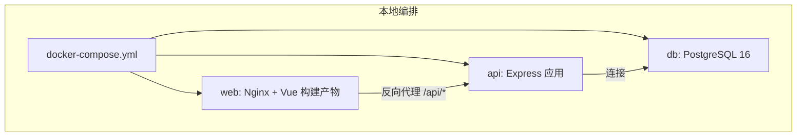
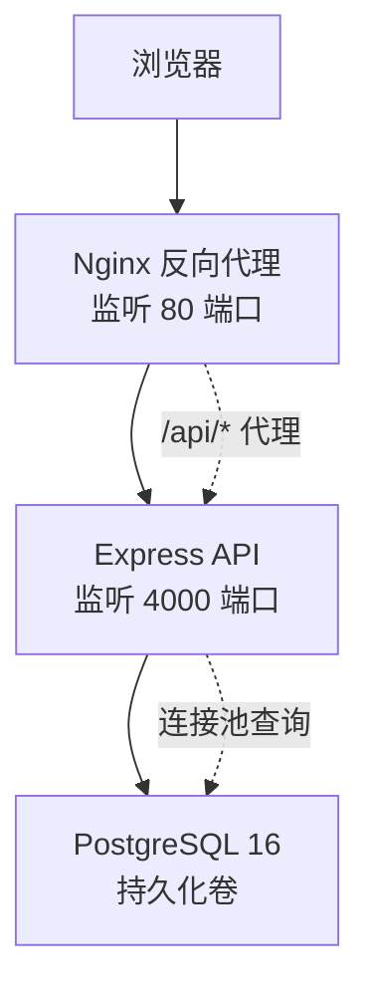
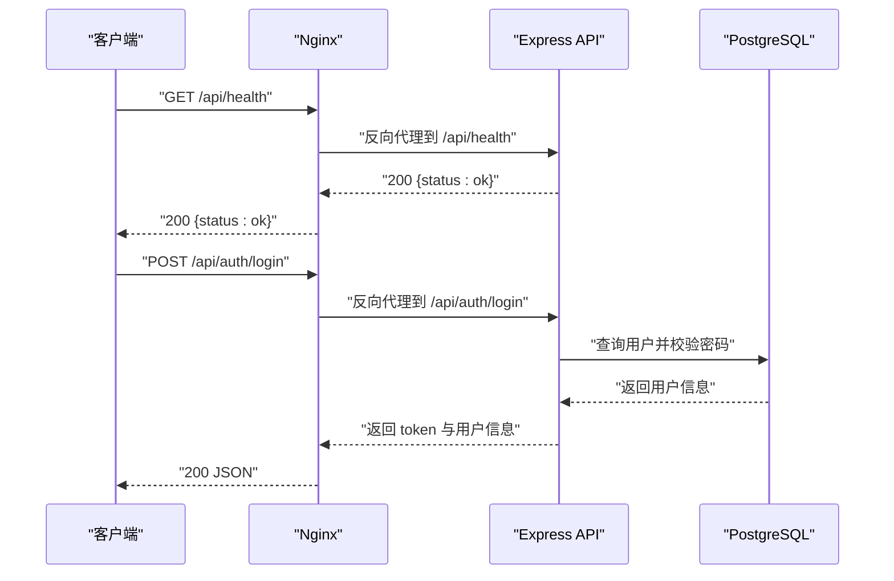
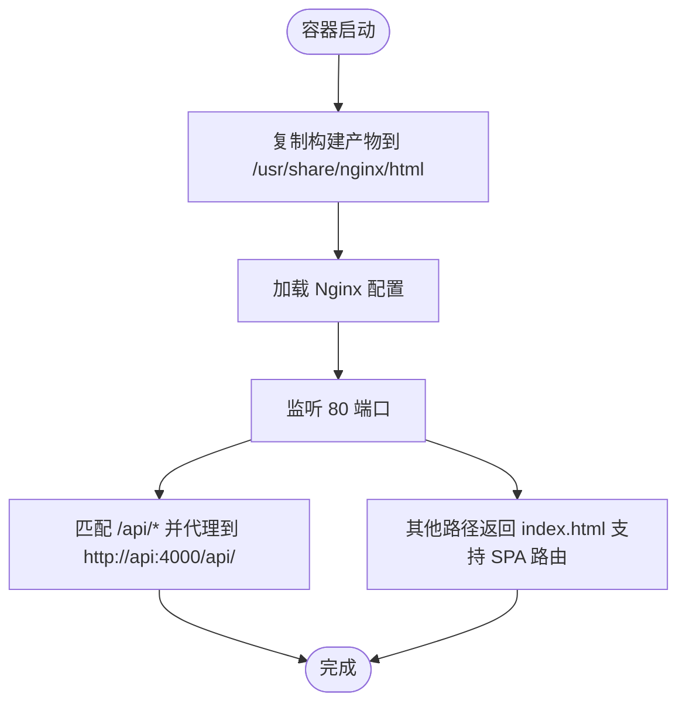
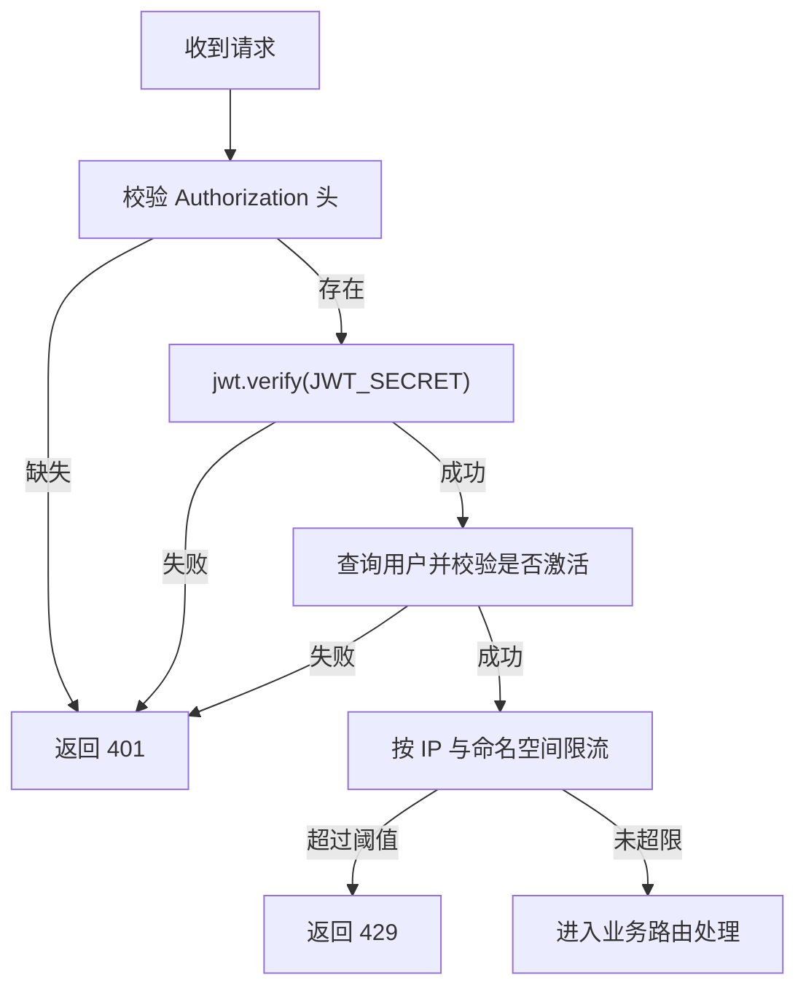
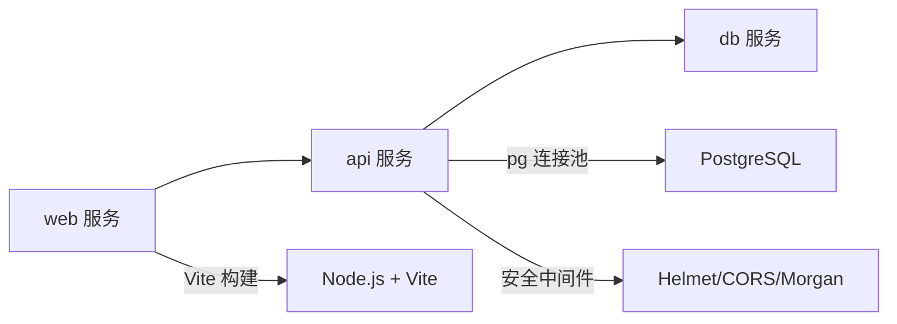

# 部署架构

<cite>
**本文引用的文件**
- [docker-compose.yml](file://docker-compose.yml)
- [server/Dockerfile](file://server/Dockerfile)
- [web/Dockerfile](file://web/Dockerfile)
- [DEPLOY_FREE.md](file://DEPLOY_FREE.md)
- [README.md](file://README.md)
- [server/package.json](file://server/package.json)
- [web/package.json](file://web/package.json)
- [server/src/config/db.js](file://server/src/config/db.js)
- [web/nginx.conf](file://web/nginx.conf)
- [server/src/app.js](file://server/src/app.js)
- [server/src/routes/authRoutes.js](file://server/src/routes/authRoutes.js)
- [server/src/middleware/auth.js](file://server/src/middleware/auth.js)
- [server/src/middleware/rateLimit.js](file://server/src/middleware/rateLimit.js)
- [server/src/utils/inventoryService.js](file://server/src/utils/inventoryService.js)
</cite>

## 目录
1. [简介](#简介)
2. [项目结构](#项目结构)
3. [核心组件](#核心组件)
4. [架构总览](#架构总览)
5. [详细组件分析](#详细组件分析)
6. [依赖关系分析](#依赖关系分析)
7. [性能考虑](#性能考虑)
8. [故障排查指南](#故障排查指南)
9. [结论](#结论)
10. [附录](#附录)

## 简介
本文件面向库存管理系统的部署架构，围绕基于 Docker 的容器化方案展开，覆盖多容器编排、服务发现、前后端分离部署、反向代理与负载均衡、环境变量与密钥管理、配置文件组织、CI/CD 设计与自动化部署/回滚策略、监控告警与日志聚合、性能指标采集，以及高可用、故障转移与灾难恢复的实现建议。文档同时结合仓库中的 docker-compose 编排、前后端 Dockerfile、Nginx 反向代理配置、数据库连接与安全中间件等实际代码进行说明。

## 项目结构
系统采用前后端分离的双仓库结构：
- 后端 server：基于 Node.js + Express，使用 PostgreSQL 存储；通过 docker-compose 提供本地一键编排。
- 前端 web：基于 Vue 3 + Vite 构建，使用 Nginx 提供静态资源与反向代理；通过 docker-compose 提供本地一键编排。
- 数据库 db：PostgreSQL 16，初始化脚本随容器启动自动执行。

图表来源
- [docker-compose.yml:1-57](file://docker-compose.yml#L1-L57)
- [web/nginx.conf:1-21](file://web/nginx.conf#L1-L21)
- [server/src/app.js:36-55](file://server/src/app.js#L36-L55)

章节来源
- [README.md:73-105](file://README.md#L73-L105)
- [docker-compose.yml:1-57](file://docker-compose.yml#L1-L57)

## 核心组件
- 数据库服务（db）
  - 使用官方镜像，持久化卷存储数据，启动时自动执行 schema.sql 与 seed.sql。
  - 健康检查通过 pg_isready 进行探测。
- 后端服务（api）
  - 基于 Node.js 20 Alpine，生产安装仅 devDependencies，暴露 4000 端口。
  - 通过环境变量 DATABASE_URL 指定数据库连接串，支持 SSL 模式自动判断。
  - 提供统一的 /api/health 健康检查端点。
- 前端服务（web）
  - 多阶段构建：第一阶段使用 Node 打包，第二阶段使用 Nginx 提供静态资源。
  - 通过 Nginx 将 /api/* 路由代理至后端 API 容器。
  - 暴露 80 端口，docker-compose 映射到宿主机 8080 端口。

章节来源
- [docker-compose.yml:2-20](file://docker-compose.yml#L2-L20)
- [docker-compose.yml:22-43](file://docker-compose.yml#L22-L43)
- [docker-compose.yml:44-54](file://docker-compose.yml#L44-L54)
- [server/Dockerfile:1-13](file://server/Dockerfile#L1-L13)
- [web/Dockerfile:1-19](file://web/Dockerfile#L1-L19)
- [server/src/config/db.js:1-25](file://server/src/config/db.js#L1-L25)
- [server/src/app.js:36-38](file://server/src/app.js#L36-L38)
- [web/nginx.conf:8-15](file://web/nginx.conf#L8-L15)

## 架构总览
下图展示容器化部署下的典型交互流程：浏览器访问前端站点，静态资源由 Nginx 提供；API 请求通过 Nginx 反向代理转发至后端 Express；后端通过连接池访问 PostgreSQL。

图表来源
- [web/nginx.conf:1-21](file://web/nginx.conf#L1-L21)
- [server/src/app.js:36-55](file://server/src/app.js#L36-L55)
- [server/src/config/db.js:15-19](file://server/src/config/db.js#L15-L19)
- [docker-compose.yml:2-20](file://docker-compose.yml#L2-L20)

## 详细组件分析

### 数据库服务（db）
- 镜像与持久化：使用官方 postgres:16-alpine，数据卷映射到 inventory_db_data。
- 初始化：通过 /docker-entrypoint-initdb.d 注入 schema.sql 与 seed.sql，确保首次启动即具备表结构与种子数据。
- 健康检查：以 pg_isready 检测数据库可用性，配置了较短的检测间隔与超时，提升编排稳定性。
- 环境变量：设置数据库名、用户名与密码，便于后端通过 DATABASE_URL 连接。

章节来源
- [docker-compose.yml:2-20](file://docker-compose.yml#L2-L20)

### 后端服务（api）
- 容器镜像构建：基于 node:20-alpine，生产安装仅 devDependencies，减少镜像体积。
- 端口与依赖：暴露 4000 端口，依赖 db 容器健康就绪后启动。
- 环境变量：PORT、DATABASE_URL、JWT_SECRET、第三方平台同步相关变量。
- 安全与中间件：启用 Helmet、CORS、Morgan 日志、统一响应包装与审计日志中间件。
- 路由组织：集中注册认证、仪表盘、报表、库存、市场对接、订单、物流、供应商、通知、设置、银行对账、供应商付款等路由。
- 健康检查：提供 /api/health 快速自检。

图表来源
- [web/nginx.conf:8-15](file://web/nginx.conf#L8-L15)
- [server/src/app.js:36-55](file://server/src/app.js#L36-L55)
- [server/src/routes/authRoutes.js:17-64](file://server/src/routes/authRoutes.js#L17-L64)
- [server/src/config/db.js:15-19](file://server/src/config/db.js#L15-L19)

章节来源
- [server/Dockerfile:1-13](file://server/Dockerfile#L1-L13)
- [docker-compose.yml:22-43](file://docker-compose.yml#L22-L43)
- [server/src/app.js:26-67](file://server/src/app.js#L26-L67)
- [server/src/routes/authRoutes.js:1-72](file://server/src/routes/authRoutes.js#L1-L72)

### 前端服务（web）
- 多阶段构建：第一阶段安装依赖并打包，第二阶段使用 Nginx 提供静态资源。
- 反向代理：将 /api/* 路由代理到后端 API（容器内解析为 api:4000）。
- 端口映射：容器内 80 端口映射到宿主机 8080 端口，便于本地访问。

图表来源
- [web/Dockerfile:11-18](file://web/Dockerfile#L11-L18)
- [web/nginx.conf:1-21](file://web/nginx.conf#L1-L21)

章节来源
- [web/Dockerfile:1-19](file://web/Dockerfile#L1-L19)
- [web/nginx.conf:1-21](file://web/nginx.conf#L1-L21)
- [docker-compose.yml:44-54](file://docker-compose.yml#L44-L54)

### 安全与限流中间件
- JWT 认证：从 Authorization 头提取 Bearer Token，验证失败返回 401。
- 角色授权：authorizeRoles 实现基于角色的访问控制。
- 登录限流：基于内存桶的滑动窗口限流，防止暴力破解。
- 数据库 SSL：根据连接串或环境变量自动启用 SSL，生产环境默认开启。

图表来源
- [server/src/middleware/auth.js:5-29](file://server/src/middleware/auth.js#L5-L29)
- [server/src/middleware/rateLimit.js:9-35](file://server/src/middleware/rateLimit.js#L9-L35)
- [server/src/config/db.js:3-11](file://server/src/config/db.js#L3-L11)

章节来源
- [server/src/middleware/auth.js:1-46](file://server/src/middleware/auth.js#L1-L46)
- [server/src/middleware/rateLimit.js:1-40](file://server/src/middleware/rateLimit.js#L1-L40)
- [server/src/config/db.js:1-25](file://server/src/config/db.js#L1-L25)

### 数据库连接与 SSL 策略
- 连接串来源：从 DATABASE_URL 环境变量读取。
- SSL 自动判断：当连接串包含 sslmode=require 或 ssl=true，或 PGSSLMODE=required，或 NODE_ENV=production 时启用 SSL。
- 连接超时：支持通过 PG_CONNECT_TIMEOUT_MS 设置连接超时时间。

章节来源
- [server/src/config/db.js:3-19](file://server/src/config/db.js#L3-L19)

### 库存服务工具（事务一致性封装）
- 确保存在库存记录：插入 stock_levels 行，避免并发场景下缺失记录。
- 查询与更新：提供查询在手/已分配数量与原子更新方法，便于在事务中调用。

章节来源
- [server/src/utils/inventoryService.js:1-45](file://server/src/utils/inventoryService.js#L1-L45)

## 依赖关系分析
- 服务耦合
  - web 依赖 api 的 /api/* 路由；api 依赖 db 的 PostgreSQL 服务。
  - docker-compose 使用 depends_on 与健康检查保证启动顺序与可用性。
- 外部依赖
  - 前端构建依赖 Node.js 与 Vite；运行时依赖 Nginx。
  - 后端依赖 Node.js、Express、pg 连接池、bcrypt、helmet、cors、morgan 等。
- 环境变量与密钥
  - DATABASE_URL、JWT_SECRET、第三方平台同步端点与令牌等敏感信息通过环境变量注入。
  - 生产环境建议使用平台提供的密钥管理服务或编排平台的 Secret 管理。

图表来源
- [docker-compose.yml:1-57](file://docker-compose.yml#L1-L57)
- [server/package.json:15-29](file://server/package.json#L15-L29)
- [web/package.json:12-32](file://web/package.json#L12-L32)

章节来源
- [docker-compose.yml:1-57](file://docker-compose.yml#L1-L57)
- [server/package.json:1-31](file://server/package.json#L1-L31)
- [web/package.json:1-34](file://web/package.json#L1-L34)

## 性能考虑
- 连接池与超时：合理设置连接超时与并发限制，避免慢查询拖垮连接池。
- 健康检查与重启策略：数据库健康检查参数需平衡启动时间与稳定性。
- 前端缓存与静态资源：Nginx 提供静态资源缓存与 gzip 压缩，减少带宽与延迟。
- 限流与安全：登录限流与安全头可降低恶意请求与攻击面。
- 数据库优化：索引、分区与只读副本（在更高可用方案中引入）可提升查询性能。

## 故障排查指南
- 健康检查失败
  - 检查 /api/health 是否返回 200；若失败，查看后端日志与数据库连接串。
- 401 未授权
  - 确认 JWT_SECRET 未变更；如变更将导致旧令牌失效，需重新登录。
- 404 路由不存在
  - 确认后端已包含对应路由模块并正确挂载。
- 500 数据库错误
  - 确认 schema.sql 与 seed.sql 已执行；检查连接串与 SSL 配置。
- 冷启动缓慢（免费平台）
  - Render/Cloudflare Pages 等免费层存在冷启动延迟，属于预期现象。

章节来源
- [DEPLOY_FREE.md:261-293](file://DEPLOY_FREE.md#L261-L293)
- [server/src/app.js:36-38](file://server/src/app.js#L36-L38)
- [server/src/routes/authRoutes.js:41-43](file://server/src/routes/authRoutes.js#L41-L43)

## 结论
本部署架构以 Docker 为核心，通过 docker-compose 实现数据库、后端与前端的一键编排；Nginx 作为反向代理承担静态资源与 API 转发职责；后端采用安全中间件与限流策略保障稳定与安全。结合免费平台（Render + Neon + Cloudflare Pages）的部署指南，可在测试环境中快速落地。对于生产环境，建议引入外部密钥管理、监控告警、日志聚合与性能指标采集，并设计高可用、故障转移与灾难恢复策略。

## 附录

### 环境变量与密钥管理
- 数据库连接
  - DATABASE_URL：PostgreSQL 连接串，生产环境建议强制 SSL。
- 后端服务
  - PORT：监听端口，默认 4000。
  - JWT_SECRET：JWT 密钥，需保持稳定，避免频繁轮换。
  - 第三方平台同步：如 SHOPEE_*、LAZADA_*、TIKTOK_* 等，按需配置。
- 前端构建
  - VITE_API_URL：指向后端 API 的基础地址。

章节来源
- [docker-compose.yml:28-37](file://docker-compose.yml#L28-L37)
- [DEPLOY_FREE.md:71-82](file://DEPLOY_FREE.md#L71-L82)
- [DEPLOY_FREE.md:165-176](file://DEPLOY_FREE.md#L165-L176)

### 配置文件组织
- 后端
  - 数据库连接：server/src/config/db.js，负责连接串解析与 SSL 判断。
  - 应用入口：server/src/app.js，集中注册中间件与路由。
- 前端
  - Nginx 配置：web/nginx.conf，定义 /api/* 代理规则与 SPA 回退。
- 编排
  - docker-compose.yml：定义服务、网络、卷与健康检查。

章节来源
- [server/src/config/db.js:1-25](file://server/src/config/db.js#L1-L25)
- [server/src/app.js:1-67](file://server/src/app.js#L1-L67)
- [web/nginx.conf:1-21](file://web/nginx.conf#L1-L21)
- [docker-compose.yml:1-57](file://docker-compose.yml#L1-L57)

### CI/CD 流水线设计与自动化部署
- 推荐步骤
  - 代码提交触发构建：分别构建后端与前端镜像。
  - 镜像推送：推送到私有或公共镜像仓库。
  - 编排部署：拉取最新镜像并启动容器；或使用平台的 Git 集成自动部署。
  - 健康检查：等待 db 与 api 健康后再对外提供服务。
  - 回滚策略：通过版本标签与滚动回滚，必要时回退到上一个稳定版本。
- 平台示例
  - Render：Web Service 自动拉取代码并执行构建命令与启动命令。
  - Cloudflare Pages：Git 连接后自动构建与部署。
  - Neon：PostgreSQL 作为服务提供连接串。

章节来源
- [DEPLOY_FREE.md:45-105](file://DEPLOY_FREE.md#L45-L105)
- [DEPLOY_FREE.md:129-177](file://DEPLOY_FREE.md#L129-L177)
- [server/package.json:6-8](file://server/package.json#L6-L8)
- [web/package.json:6-10](file://web/package.json#L6-L10)

### 监控告警、日志聚合与性能指标
- 监控与告警
  - 使用平台自带监控（Render/Cloudflare Pages/Neon）或外部 APM（如 New Relic、DataDog）。
  - 关注 API 响应时间、错误率、数据库连接池使用率。
- 日志聚合
  - 后端使用 Morgan 输出访问日志；容器日志可接入平台日志服务或集中式日志（如 ELK/CloudWatch）。
- 性能指标
  - 指标包括：QPS、P95/P99 延迟、数据库查询耗时、连接池占用、容器 CPU/内存使用。

### 高可用、故障转移与灾难恢复
- 高可用
  - 多实例部署：后端与前端均部署至少两个实例，配合负载均衡。
  - 数据库高可用：使用托管 PostgreSQL 的高可用实例或主从复制。
- 故障转移
  - 健康检查失败自动摘除节点；外部 LB 或平台路由将流量切换至健康实例。
- 灾难恢复
  - 定期备份数据库；建立恢复演练流程；确保 schema/seed 脚本可重复执行。
  - 配置蓝绿/金丝雀发布，降低回滚风险。