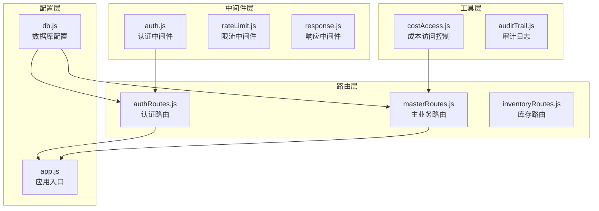
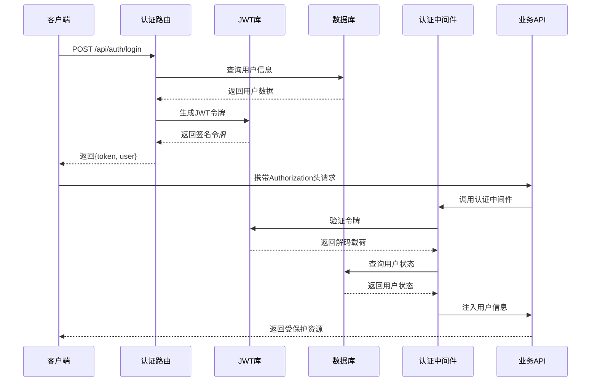
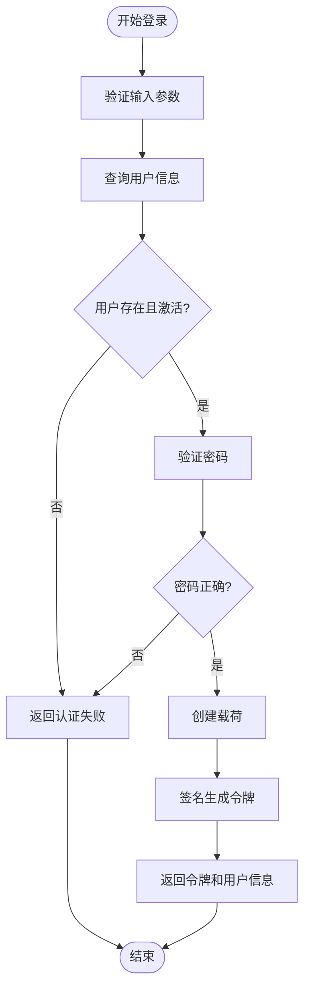
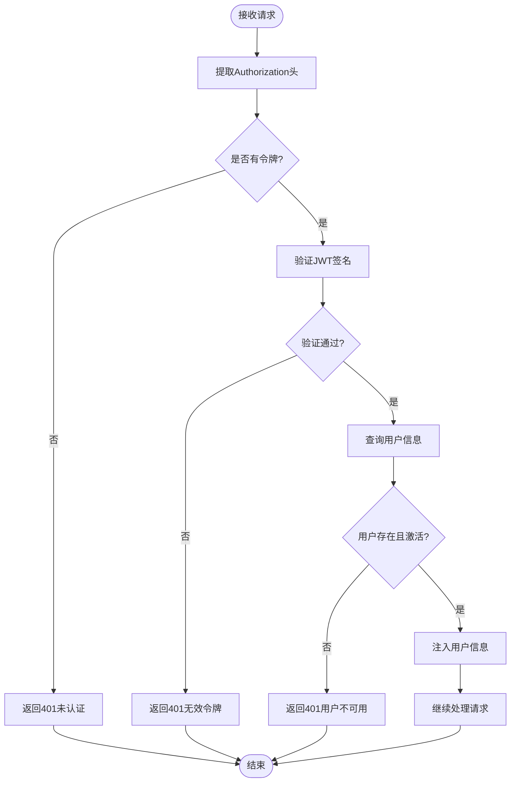
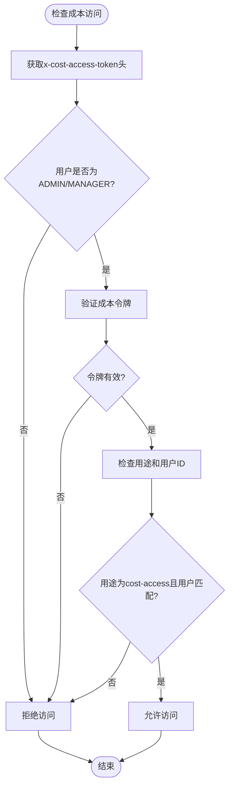
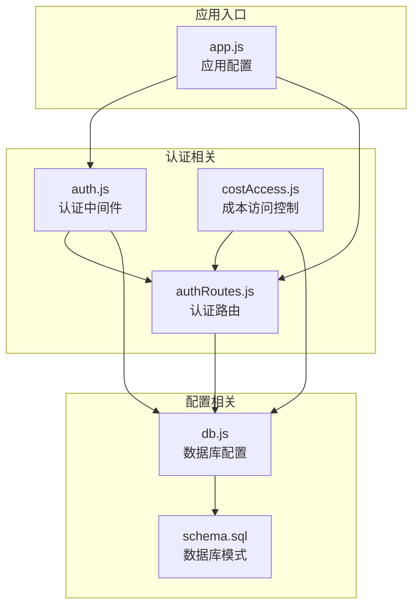

# JWT令牌机制

<cite>
**本文档引用的文件**
- [auth.js](file://server/src/middleware/auth.js)
- [authRoutes.js](file://server/src/routes/authRoutes.js)
- [masterRoutes.js](file://server/src/routes/masterRoutes.js)
- [costAccess.js](file://server/src/utils/costAccess.js)
- [app.js](file://server/src/app.js)
- [db.js](file://server/src/config/db.js)
- [schema.sql](file://server/database/schema.sql)
- [package.json](file://server/package.json)
</cite>

## 目录
1. [简介](#简介)
2. [项目结构](#项目结构)
3. [核心组件](#核心组件)
4. [架构概览](#架构概览)
5. [详细组件分析](#详细组件分析)
6. [依赖关系分析](#依赖关系分析)
7. [性能考虑](#性能考虑)
8. [故障排除指南](#故障排除指南)
9. [结论](#结论)

## 简介

本文件详细阐述了库存管理系统的JWT（JSON Web Token）令牌机制。JWT是一种开放标准（RFC 7519），用于在网络应用间安全地传输声明（claims）。在本系统中，JWT被用于用户身份验证和授权，确保API调用的安全性。

系统采用对称加密算法（HS256）进行令牌签名和验证，使用环境变量中的密钥进行签名生成和验证。令牌包含用户标识、角色等必要信息，并设置8小时的有效期。

## 项目结构

系统中JWT相关的核心文件分布如下：



**图表来源**
- [auth.js:1-46](file://server/src/middleware/auth.js#L1-L46)
- [authRoutes.js:1-72](file://server/src/routes/authRoutes.js#L1-L72)
- [masterRoutes.js:1-1513](file://server/src/routes/masterRoutes.js#L1-L1513)

**章节来源**
- [auth.js:1-46](file://server/src/middleware/auth.js#L1-L46)
- [authRoutes.js:1-72](file://server/src/routes/authRoutes.js#L1-L72)
- [app.js:1-67](file://server/src/app.js#L1-L67)

## 核心组件

### 认证中间件

认证中间件是JWT机制的核心组件，负责令牌的提取、验证和用户信息注入。

主要功能：
- 从Authorization头部提取Bearer令牌
- 验证令牌签名和有效性
- 查询用户信息并注入到请求对象
- 处理认证失败的情况

### 认证路由

处理用户登录和令牌生成的核心路由模块。

主要功能：
- 验证用户凭据
- 生成JWT令牌
- 返回用户信息和令牌
- 实施登录频率限制

### 成本访问控制

专门用于产品成本价格访问控制的JWT机制。

主要功能：
- 验证专门的成本访问令牌
- 检查用户角色和权限
- 控制敏感数据的可见性

**章节来源**
- [auth.js:4-29](file://server/src/middleware/auth.js#L4-L29)
- [authRoutes.js:17-64](file://server/src/routes/authRoutes.js#L17-L64)
- [costAccess.js:1-32](file://server/src/utils/costAccess.js#L1-L32)

## 架构概览

系统采用分层架构设计，JWT机制贯穿整个认证授权流程：



**图表来源**
- [authRoutes.js:17-64](file://server/src/routes/authRoutes.js#L17-L64)
- [auth.js:5-29](file://server/src/middleware/auth.js#L5-L29)

## 详细组件分析

### JWT令牌结构

系统使用的JWT令牌包含以下声明：

| 声明键 | 类型 | 描述 | 示例值 |
|--------|------|------|--------|
| userId | Integer | 用户唯一标识 | 123 |
| role | String | 用户角色 | ADMIN |
| exp | Integer | 过期时间戳 | 1700000000 |
| iat | Integer | 签发时间 | 1699996400 |

令牌类型分为两种：

1. **标准认证令牌**：用于一般的身份验证
2. **成本访问令牌**：专门用于产品成本价格访问控制

### 令牌生成流程



**图表来源**
- [authRoutes.js:17-64](file://server/src/routes/authRoutes.js#L17-L64)

### 令牌验证机制



**图表来源**
- [auth.js:5-29](file://server/src/middleware/auth.js#L5-L29)

### 成本访问令牌机制

系统实现了专门的成本访问控制机制：



**图表来源**
- [costAccess.js:5-23](file://server/src/utils/costAccess.js#L5-L23)

**章节来源**
- [auth.js:1-46](file://server/src/middleware/auth.js#L1-L46)
- [authRoutes.js:1-72](file://server/src/routes/authRoutes.js#L1-L72)
- [costAccess.js:1-32](file://server/src/utils/costAccess.js#L1-L32)

## 依赖关系分析

### 外部依赖

系统使用以下关键依赖来实现JWT功能：

```mermaid
graph LR
subgraph "JWT相关依赖"
A[jsonwebtoken@9.0.3<br/>JWT库]
B[bcryptjs@3.0.3<br/>密码哈希]
end
subgraph "核心应用"
C[express@5.2.1<br/>Web框架]
D[pg@8.20.0<br/>PostgreSQL驱动]
end
subgraph "安全和工具"
E[helmet@8.1.0<br/>安全头]
F[cors@2.8.6<br/>跨域]
G[morgan@1.10.1<br/>HTTP日志]
end
A --> C
B --> C
D --> C
E --> C
F --> C
G --> C
```

**图表来源**
- [package.json:15-25](file://server/package.json#L15-L25)

### 内部组件依赖



**图表来源**
- [auth.js:1-46](file://server/src/middleware/auth.js#L1-L46)
- [authRoutes.js:1-72](file://server/src/routes/authRoutes.js#L1-L72)
- [costAccess.js:1-32](file://server/src/utils/costAccess.js#L1-L32)
- [db.js:1-25](file://server/src/config/db.js#L1-L25)

**章节来源**
- [package.json:1-31](file://server/package.json#L1-L31)
- [app.js:1-67](file://server/src/app.js#L1-L67)

## 性能考虑

### 令牌大小优化

系统JWT令牌设计简洁，仅包含必要的声明：
- `userId`: 用户唯一标识符
- `role`: 用户角色信息
- `exp`: 过期时间戳

这种设计确保了令牌体积小、传输效率高。

### 缓存策略

系统通过以下方式优化性能：
- 直接从数据库查询用户状态，避免额外的缓存层
- 使用轻量级的JWT验证逻辑
- 合理的数据库索引设计支持快速用户查询

### 安全存储建议

虽然JWT存储在客户端，但系统提供了以下安全建议：

1. **HttpOnly Cookie存储**：推荐将令牌存储在HttpOnly Cookie中，防止XSS攻击
2. **Secure属性**：在HTTPS环境下设置Secure标志
3. **SameSite属性**：设置适当的SameSite策略防止CSRF攻击
4. **短生命周期**：使用较短的令牌有效期配合刷新令牌机制

## 故障排除指南

### 常见问题及解决方案

#### 1. 401 未认证错误

**可能原因**：
- 请求未包含Authorization头
- Bearer令牌格式不正确
- 令牌已过期或被篡改

**解决方法**：
- 确保请求头格式为：`Authorization: Bearer YOUR_TOKEN`
- 检查令牌有效期
- 验证JWT_SECRET环境变量配置

#### 2. 401 无效令牌错误

**可能原因**：
- JWT_SECRET密钥不匹配
- 令牌被修改
- 签名验证失败

**解决方法**：
- 确认服务器端和客户端使用相同的密钥
- 检查环境变量配置
- 验证令牌完整性

#### 3. 用户不可用错误

**可能原因**：
- 用户账户被禁用
- 用户记录不存在
- 数据库连接问题

**解决方法**：
- 检查用户状态字段
- 验证数据库连接
- 确认用户表结构

#### 4. 成本访问被拒绝

**可能原因**：
- 用户角色不是ADMIN或MANAGER
- 成本访问令牌无效
- 令牌用途或用户ID不匹配

**解决方法**：
- 验证用户角色权限
- 检查成本访问令牌格式
- 确认令牌载荷内容

**章节来源**
- [auth.js:9-28](file://server/src/middleware/auth.js#L9-L28)
- [authRoutes.js:31-39](file://server/src/routes/authRoutes.js#L31-L39)
- [costAccess.js:8-22](file://server/src/utils/costAccess.js#L8-L22)

## 结论

本系统的JWT令牌机制设计简洁而实用，通过合理的架构分层和严格的安全控制，实现了高效的身份验证和授权功能。主要特点包括：

1. **安全性**：使用对称加密算法，密钥集中管理
2. **可扩展性**：支持角色基础的访问控制
3. **灵活性**：提供专门的成本访问控制机制
4. **易维护性**：清晰的代码结构和完善的错误处理

系统在实际部署中应重点关注环境变量的安全配置和令牌的适当存储策略，以确保整体安全性和用户体验。