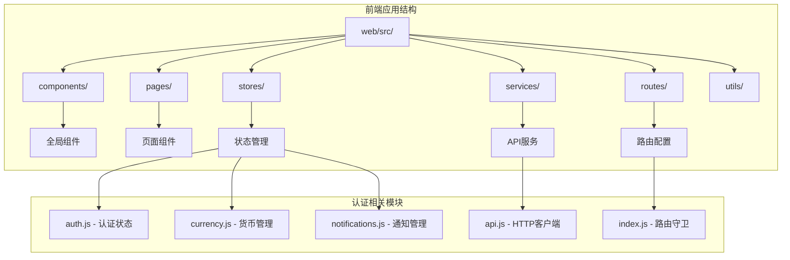
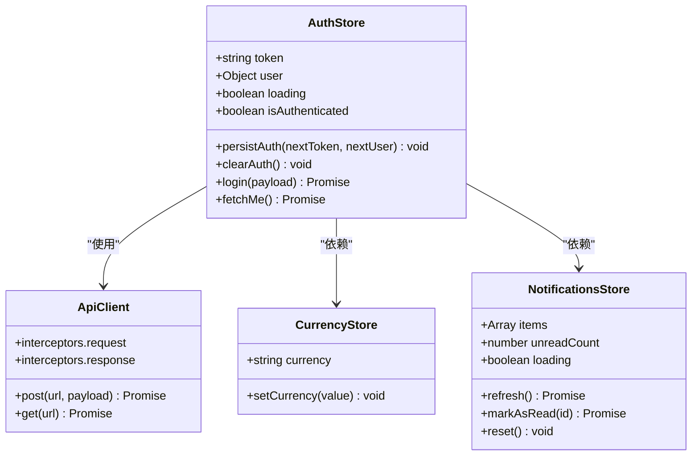
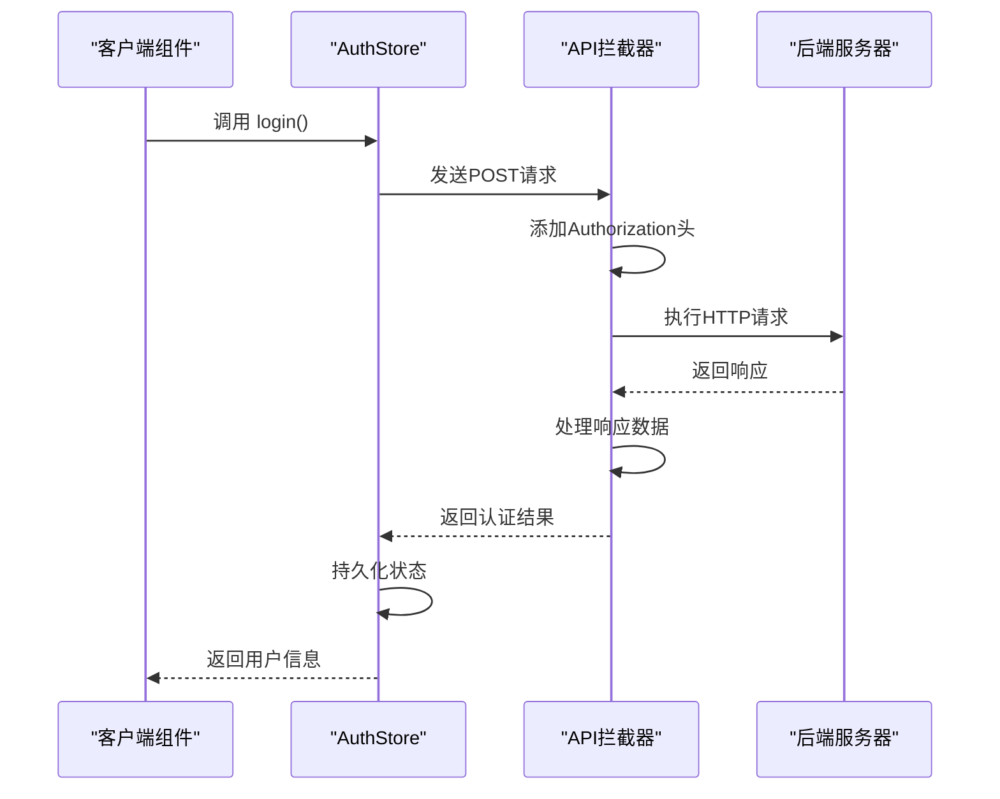
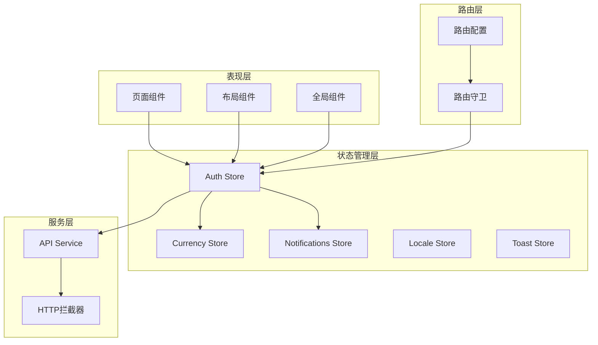
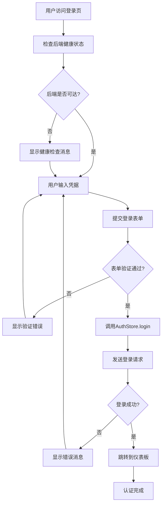
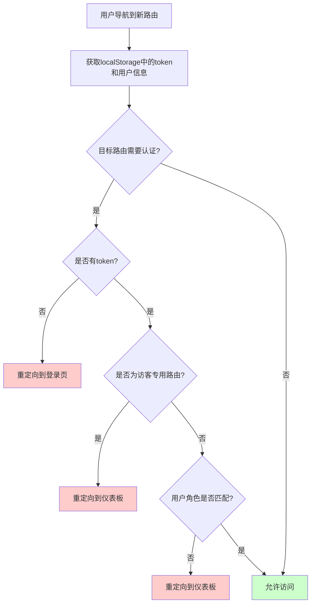
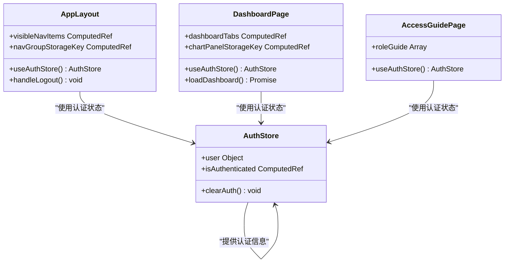
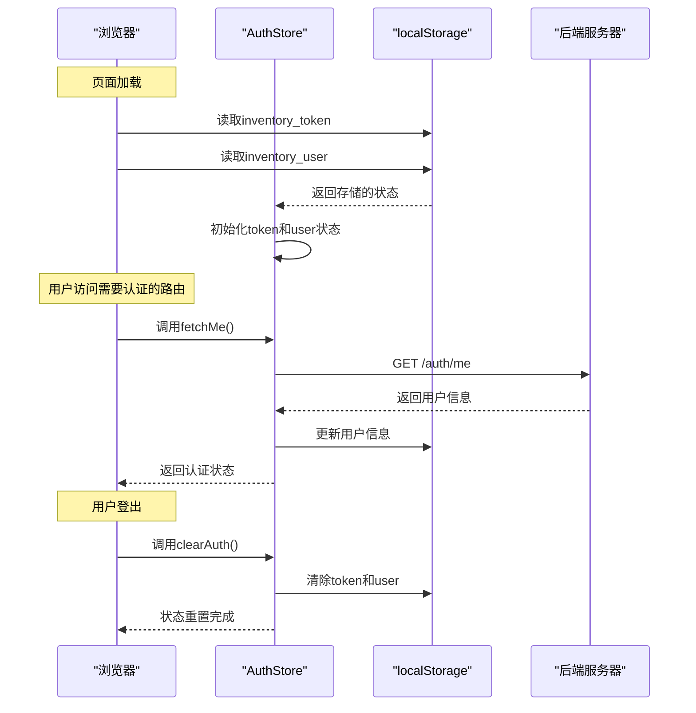
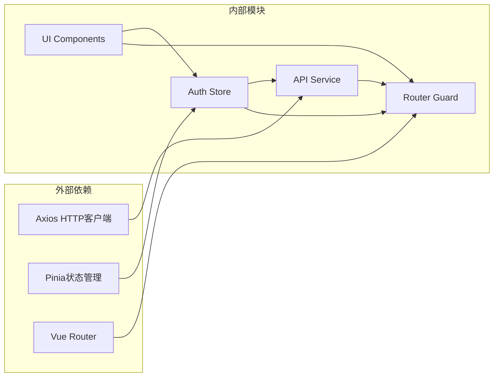

# 前端认证状态管理

<cite>
**本文档引用的文件**
- [web/src/stores/auth.js](file://web/src/stores/auth.js)
- [web/src/pages/LoginPage.vue](file://web/src/pages/LoginPage.vue)
- [web/src/router/index.js](file://web/src/router/index.js)
- [web/src/services/api.js](file://web/src/services/api.js)
- [web/src/main.js](file://web/src/main.js)
- [web/src/layouts/AppLayout.vue](file://web/src/layouts/AppLayout.vue)
- [web/src/pages/DashboardPage.vue](file://web/src/pages/DashboardPage.vue)
- [web/src/pages/AccessGuidePage.vue](file://web/src/pages/AccessGuidePage.vue)
- [web/src/components/GlobalToastCenter.vue](file://web/src/components/GlobalToastCenter.vue)
- [web/src/stores/currency.js](file://web/src/stores/currency.js)
- [web/src/stores/notifications.js](file://web/src/stores/notifications.js)
- [web/src/stores/locale.js](file://web/src/stores/locale.js)
- [web/src/stores/toast.js](file://web/src/stores/toast.js)
</cite>

## 目录
1. [简介](#简介)
2. [项目结构](#项目结构)
3. [核心组件](#核心组件)
4. [架构概览](#架构概览)
5. [详细组件分析](#详细组件分析)
6. [依赖关系分析](#依赖关系分析)
7. [性能考虑](#性能考虑)
8. [故障排除指南](#故障排除指南)
9. [结论](#结论)

## 简介

本项目是一个基于 Vue 3 + Pinia 的库存管理系统，采用前后端分离架构。前端认证状态管理系统通过 Pinia 状态管理实现用户认证、权限控制和状态持久化。系统提供了完整的认证流程，包括登录状态维护、令牌管理、路由守卫权限控制，以及组件级别的认证状态使用。

## 项目结构

前端项目采用模块化组织方式，主要目录结构如下：

**图表来源**
- [web/src/main.js:1-14](file://web/src/main.js#L1-L14)
- [web/src/stores/auth.js:1-90](file://web/src/stores/auth.js#L1-L90)

**章节来源**
- [web/src/main.js:1-14](file://web/src/main.js#L1-L14)
- [web/src/stores/auth.js:1-90](file://web/src/stores/auth.js#L1-L90)

## 核心组件

### 认证状态管理器 (Auth Store)

认证状态管理器是整个认证系统的核心，基于 Pinia 实现状态持久化和集中管理。

**图表来源**
- [web/src/stores/auth.js:19-89](file://web/src/stores/auth.js#L19-L89)
- [web/src/services/api.js:1-45](file://web/src/services/api.js#L1-L45)

认证状态管理器的主要特性：

1. **状态持久化**: 使用 localStorage 存储 token 和用户信息
2. **自动恢复**: 页面刷新时自动恢复认证状态
3. **统一管理**: 集中管理登录、登出、用户信息获取等操作
4. **状态计算**: 提供 isAuthenticated 计算属性

**章节来源**
- [web/src/stores/auth.js:19-89](file://web/src/stores/auth.js#L19-L89)

### API 服务层

API 服务层封装了 HTTP 请求，实现了统一的请求拦截和响应处理。

**图表来源**
- [web/src/services/api.js:8-24](file://web/src/services/api.js#L8-L24)
- [web/src/stores/auth.js:44-58](file://web/src/stores/auth.js#L44-L58)

**章节来源**
- [web/src/services/api.js:1-45](file://web/src/services/api.js#L1-L45)

## 架构概览

系统采用分层架构设计，确保认证状态管理的清晰性和可维护性：

**图表来源**
- [web/src/main.js:9-11](file://web/src/main.js#L9-L11)
- [web/src/router/index.js:187-206](file://web/src/router/index.js#L187-L206)

## 详细组件分析

### 登录页面实现

登录页面实现了完整的用户认证流程，包括表单验证、API 调用和错误处理。

**图表来源**
- [web/src/pages/LoginPage.vue:41-50](file://web/src/pages/LoginPage.vue#L41-L50)
- [web/src/pages/LoginPage.vue:29-39](file://web/src/pages/LoginPage.vue#L29-L39)

登录页面的关键实现特点：

1. **健康检查**: 启动时自动检查后端服务可用性
2. **测试账户**: 提供预设的测试账户便于快速测试
3. **错误处理**: 统一处理登录失败的错误消息
4. **加载状态**: 显示登录过程中的加载状态

**章节来源**
- [web/src/pages/LoginPage.vue:1-136](file://web/src/pages/LoginPage.vue#L1-L136)

### 路由守卫权限控制

路由守卫实现了多层次的权限控制机制，确保用户只能访问授权的页面。

**图表来源**
- [web/src/router/index.js:188-206](file://web/src/router/index.js#L188-L206)

路由守卫的权限控制规则：

1. **登录重定向**: 访问需要认证的路由但未登录时重定向到登录页
2. **访客保护**: 已登录用户访问登录页时重定向到仪表板
3. **角色验证**: 检查用户角色是否满足目标路由的权限要求
4. **默认行为**: 不满足上述条件时允许访问（通常为公共路由）

**章节来源**
- [web/src/router/index.js:29-180](file://web/src/router/index.js#L29-L180)

### 组件级别认证状态使用

多个组件通过 Pinia 认证状态实现条件渲染和权限控制：

**图表来源**
- [web/src/layouts/AppLayout.vue:6-28](file://web/src/layouts/AppLayout.vue#L6-L28)
- [web/src/pages/DashboardPage.vue:22-41](file://web/src/pages/DashboardPage.vue#L22-L41)
- [web/src/pages/AccessGuidePage.vue:2-9](file://web/src/pages/AccessGuidePage.vue#L2-L9)

组件级别的认证状态使用示例：

1. **导航权限**: 根据用户角色动态显示菜单项
2. **条件渲染**: 根据认证状态显示不同的内容
3. **权限控制**: 基于角色限制特定功能的访问
4. **用户信息展示**: 在界面中显示当前用户的名称和角色

**章节来源**
- [web/src/layouts/AppLayout.vue:182-184](file://web/src/layouts/AppLayout.vue#L182-L184)
- [web/src/pages/DashboardPage.vue:152-162](file://web/src/pages/DashboardPage.vue#L152-L162)
- [web/src/pages/AccessGuidePage.vue:26-64](file://web/src/pages/AccessGuidePage.vue#L26-L64)

### 状态持久化与自动登录

系统实现了完整的状态持久化机制，支持自动登录和会话恢复：

**图表来源**
- [web/src/stores/auth.js:20-41](file://web/src/stores/auth.js#L20-L41)
- [web/src/stores/auth.js:60-78](file://web/src/stores/auth.js#L60-L78)

状态持久化的实现细节：

1. **初始化恢复**: 应用启动时从 localStorage 恢复认证状态
2. **实时同步**: 认证状态变更时同步更新 localStorage
3. **自动刷新**: 访问受保护路由时自动验证用户身份
4. **安全清理**: 登出时清除所有认证相关信息

**章节来源**
- [web/src/stores/auth.js:28-41](file://web/src/stores/auth.js#L28-L41)

## 依赖关系分析

认证系统的依赖关系清晰明确，遵循单一职责原则：

**图表来源**
- [web/src/main.js:2-4](file://web/src/main.js#L2-L4)
- [web/src/services/api.js:1](file://web/src/services/api.js#L1)

依赖关系特点：

1. **松耦合设计**: 各模块之间依赖关系清晰，便于维护和测试
2. **单一职责**: 每个模块专注于特定的功能领域
3. **可扩展性**: 新增功能时不需要修改现有代码结构
4. **可测试性**: 模块间依赖关系简单，便于单元测试

**章节来源**
- [web/src/main.js:1-14](file://web/src/main.js#L1-L14)
- [web/src/services/api.js:1-45](file://web/src/services/api.js#L1-L45)

## 性能考虑

认证系统的性能优化策略：

1. **懒加载路由**: 路由组件采用动态导入，减少初始包大小
2. **状态缓存**: 使用 localStorage 缓存认证状态，避免重复登录
3. **请求去重**: API 服务层统一处理请求拦截，避免重复代码
4. **计算属性优化**: 使用 Vue 计算属性避免不必要的重新计算
5. **条件渲染**: 基于认证状态的条件渲染减少 DOM 操作

## 故障排除指南

### 常见问题及解决方案

**登录失败**
- 检查网络连接和后端服务状态
- 验证用户名和密码格式
- 查看浏览器控制台的错误信息

**页面无法访问**
- 确认是否已登录
- 检查用户角色权限
- 清除浏览器缓存后重试

**状态不同步**
- 检查 localStorage 是否正常工作
- 确认浏览器是否禁用了本地存储
- 重启应用后重试

**章节来源**
- [web/src/pages/LoginPage.vue:47-49](file://web/src/pages/LoginPage.vue#L47-L49)
- [web/src/router/index.js:193-203](file://web/src/router/index.js#L193-L203)

## 结论

本认证状态管理系统通过 Pinia 实现了完整的用户认证流程，具有以下优势：

1. **状态持久化**: 完整的 localStorage 支持确保用户体验连续性
2. **权限控制**: 多层次的路由守卫提供细粒度的权限管理
3. **组件集成**: 认证状态在各个组件中自然集成，使用简单
4. **可维护性**: 清晰的模块划分和依赖关系便于长期维护
5. **扩展性**: 基于 Pinia 的架构支持功能扩展和定制

系统实现了自动登录、登出流程和错误处理的完整闭环，为用户提供流畅的认证体验。通过合理的架构设计和最佳实践，该系统具备良好的性能表现和可维护性。