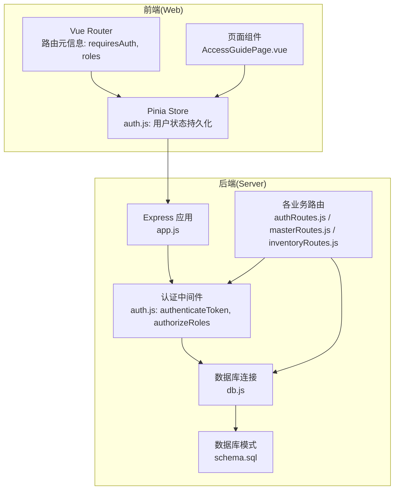
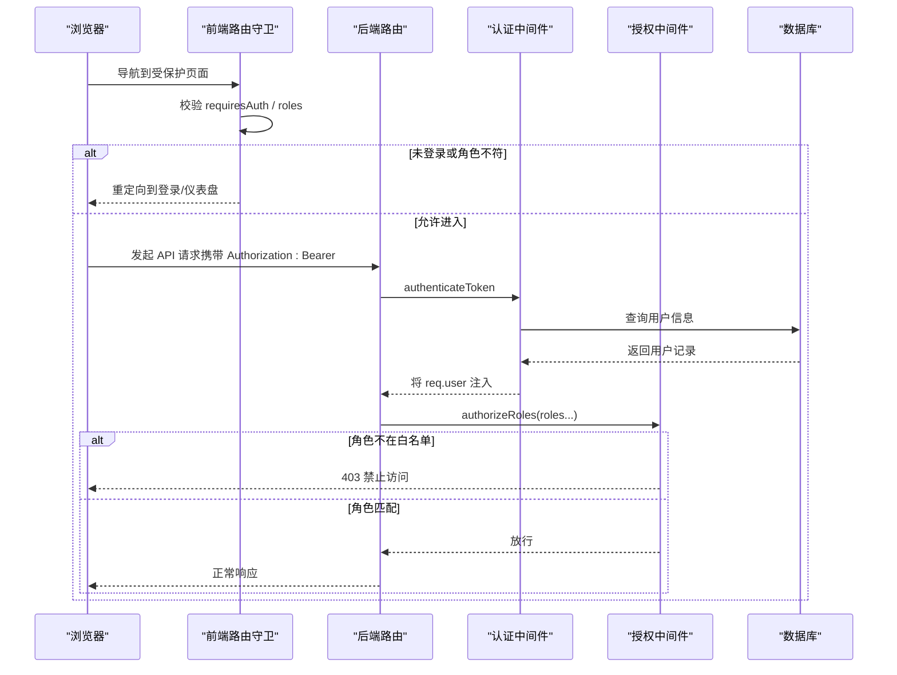
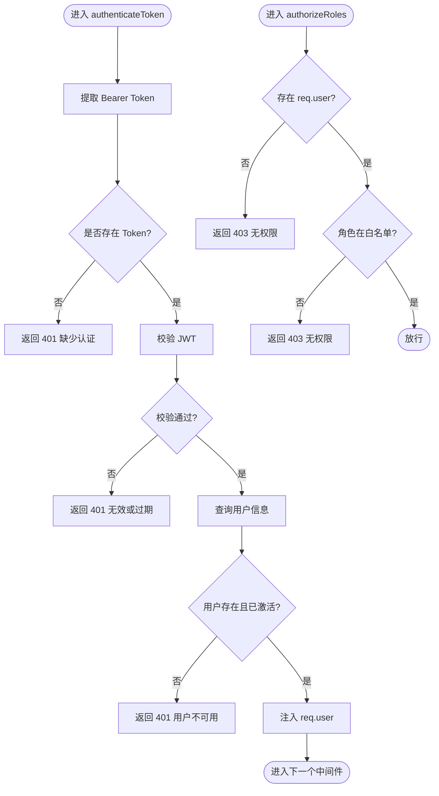
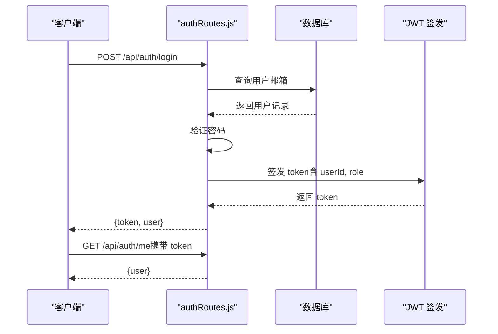
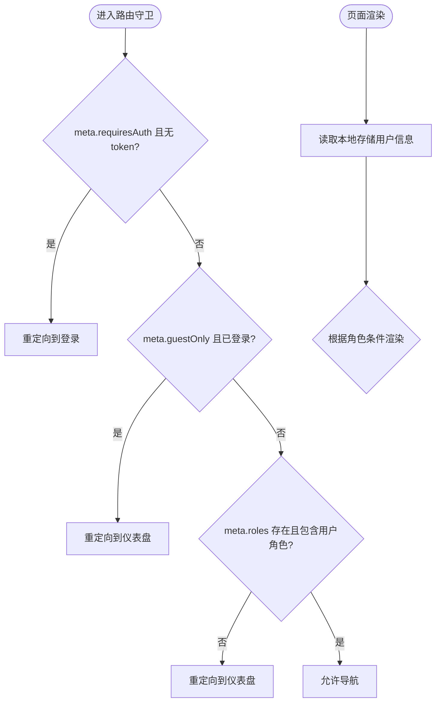
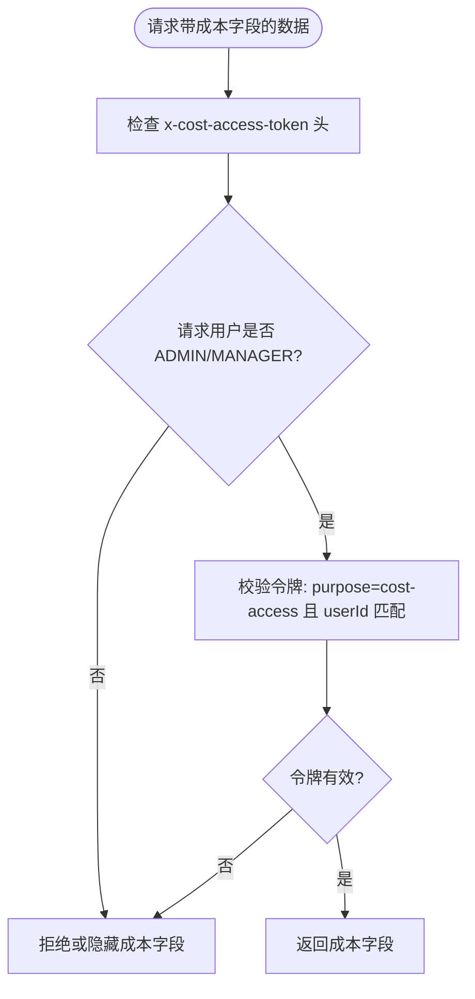
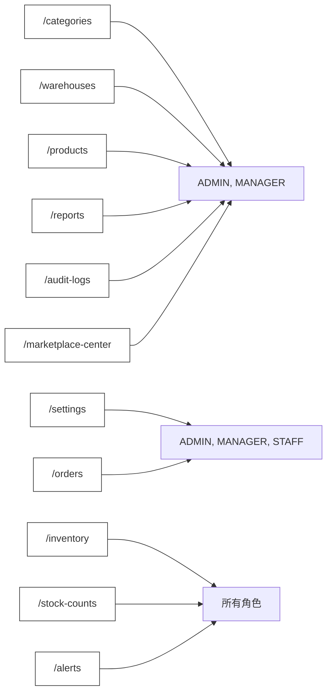
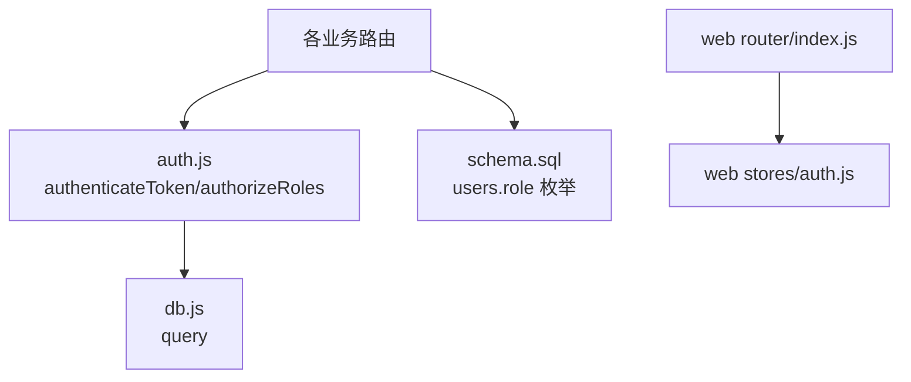

# 基于角色的权限控制

<cite>
**本文引用的文件**
- [server/src/middleware/auth.js](file://server/src/middleware/auth.js)
- [server/src/routes/authRoutes.js](file://server/src/routes/authRoutes.js)
- [server/src/app.js](file://server/src/app.js)
- [server/src/config/db.js](file://server/src/config/db.js)
- [server/src/utils/costAccess.js](file://server/src/utils/costAccess.js)
- [server/src/routes/masterRoutes.js](file://server/src/routes/masterRoutes.js)
- [server/src/routes/inventoryRoutes.js](file://server/src/routes/inventoryRoutes.js)
- [web/src/router/index.js](file://web/src/router/index.js)
- [web/src/stores/auth.js](file://web/src/stores/auth.js)
- [web/src/constants/accessGuide.js](file://web/src/constants/accessGuide.js)
- [web/src/pages/AccessGuidePage.vue](file://web/src/pages/AccessGuidePage.vue)
- [server/database/schema.sql](file://server/database/schema.sql)
</cite>

## 目录
1. [简介](#简介)
2. [项目结构](#项目结构)
3. [核心组件](#核心组件)
4. [架构总览](#架构总览)
5. [详细组件分析](#详细组件分析)
6. [依赖分析](#依赖分析)
7. [性能考虑](#性能考虑)
8. [故障排查指南](#故障排查指南)
9. [结论](#结论)
10. [附录](#附录)

## 简介
本文件系统性阐述基于角色的访问控制（RBAC）模型在库存管理系统中的设计与实现，覆盖以下要点：
- RBAC 模型核心：用户、角色、权限三者关系；角色继承与授权边界。
- 角色定义与权限范围：管理员（ADMIN）、经理（MANAGER）、员工（STAFF）及其具体权限。
- 后端权限验证中间件：JWT 校验与 authorizeRoles 角色授权的实现原理与调用流程。
- 前端权限控制：路由守卫与 UI 条件渲染策略。
- 权限配置最佳实践与扩展指南。

## 项目结构
系统采用前后端分离架构：
- 后端基于 Express，使用中间件链路进行认证与审计，路由层按模块划分，每个路由根据业务需要应用认证与角色授权。
- 前端基于 Vue + Pinia + Vue Router，通过路由元信息声明角色要求，并在页面中以条件渲染展示权限相关 UI。



**图表来源**
- [server/src/app.js:1-67](file://server/src/app.js#L1-L67)
- [server/src/middleware/auth.js:1-46](file://server/src/middleware/auth.js#L1-L46)
- [server/src/config/db.js:1-25](file://server/src/config/db.js#L1-L25)
- [server/src/routes/authRoutes.js:1-72](file://server/src/routes/authRoutes.js#L1-L72)
- [server/src/routes/masterRoutes.js:1-800](file://server/src/routes/masterRoutes.js#L1-L800)
- [server/src/routes/inventoryRoutes.js:1-493](file://server/src/routes/inventoryRoutes.js#L1-L493)
- [web/src/router/index.js:1-209](file://web/src/router/index.js#L1-L209)
- [web/src/stores/auth.js:1-90](file://web/src/stores/auth.js#L1-L90)
- [web/src/pages/AccessGuidePage.vue:1-68](file://web/src/pages/AccessGuidePage.vue#L1-L68)
- [server/database/schema.sql:1-447](file://server/database/schema.sql#L1-L447)

**章节来源**
- [server/src/app.js:1-67](file://server/src/app.js#L1-L67)
- [web/src/router/index.js:1-209](file://web/src/router/index.js#L1-L209)

## 核心组件
- 认证中间件 authenticateToken：从请求头解析 Bearer Token，校验 JWT 并查询用户信息，将用户对象挂载到 req.user。
- 授权中间件 authorizeRoles：基于 req.user.role 进行白名单式角色校验，未通过则返回 403。
- 路由层：在路由级别组合 authenticateToken 与 authorizeRoles，形成“先认证、后授权”的控制点。
- 前端路由守卫：在导航前检查登录态与角色，不符合要求则重定向至登录或仪表盘。
- 成本访问令牌：通过专用 header 传递成本访问令牌，仅 ADMIN/MANAGER 可申请与使用，用于敏感字段的有条件显示。

**章节来源**
- [server/src/middleware/auth.js:1-46](file://server/src/middleware/auth.js#L1-L46)
- [server/src/routes/masterRoutes.js:1-800](file://server/src/routes/masterRoutes.js#L1-L800)
- [server/src/routes/inventoryRoutes.js:1-493](file://server/src/routes/inventoryRoutes.js#L1-L493)
- [web/src/router/index.js:187-206](file://web/src/router/index.js#L187-L206)
- [server/src/utils/costAccess.js:1-32](file://server/src/utils/costAccess.js#L1-L32)

## 架构总览
RBAC 在本系统中的运行时流程如下：



**图表来源**
- [server/src/middleware/auth.js:5-29](file://server/src/middleware/auth.js#L5-L29)
- [server/src/middleware/auth.js:32-40](file://server/src/middleware/auth.js#L32-L40)
- [server/src/routes/authRoutes.js:17-69](file://server/src/routes/authRoutes.js#L17-L69)
- [server/src/config/db.js:13-24](file://server/src/config/db.js#L13-L24)

## 详细组件分析

### 角色与权限模型
- 角色枚举：ADMIN、MANAGER、STAFF。
- 数据约束：用户表的 role 字段限定为上述枚举值之一。
- 权限范围：通过“路由元信息 roles”与“后端 authorizeRoles 白名单”共同实现。

```mermaid
erDiagram
USERS {
int id PK
varchar full_name
varchar email UK
text password_hash
varchar role CK
boolean is_active
varchar preferred_currency
timestamp created_at
}
```

**图表来源**
- [server/database/schema.sql:2-11](file://server/database/schema.sql#L2-L11)

**章节来源**
- [server/database/schema.sql:2-11](file://server/database/schema.sql#L2-L11)
- [web/src/router/index.js:29-180](file://web/src/router/index.js#L29-L180)

### 后端权限验证中间件
- authenticateToken
  - 从 Authorization 头提取 Bearer Token。
  - 使用密钥校验 JWT，失败返回 401。
  - 查询用户并校验是否激活，否则 401。
  - 成功后将用户信息注入 req.user。
- authorizeRoles
  - 以“白名单”方式判断 req.user.role 是否包含在允许的角色集合中。
  - 不在白名单则 403，否则放行。



**图表来源**
- [server/src/middleware/auth.js:5-29](file://server/src/middleware/auth.js#L5-L29)
- [server/src/middleware/auth.js:32-40](file://server/src/middleware/auth.js#L32-L40)

**章节来源**
- [server/src/middleware/auth.js:1-46](file://server/src/middleware/auth.js#L1-L46)

### 登录与用户信息接口
- 登录接口：校验邮箱与密码，生成带角色的 JWT，返回 token 与用户信息。
- 获取当前用户接口：通过 authenticateToken 校验后返回用户信息。



**图表来源**
- [server/src/routes/authRoutes.js:17-69](file://server/src/routes/authRoutes.js#L17-L69)
- [server/src/middleware/auth.js:5-29](file://server/src/middleware/auth.js#L5-L29)

**章节来源**
- [server/src/routes/authRoutes.js:1-72](file://server/src/routes/authRoutes.js#L1-L72)

### 前端权限控制
- 路由守卫
  - 根据路由元信息 meta.requiresAuth 与 meta.roles 决定是否允许访问。
  - 从本地存储读取 token 与用户信息，未登录重定向到登录页，角色不匹配重定向到仪表盘。
- 页面级权限
  - 通过 Pinia store 中的 user.role 控制 UI 条件渲染。
  - 权限说明页根据当前角色高亮展示对应角色的权限清单。



**图表来源**
- [web/src/router/index.js:187-206](file://web/src/router/index.js#L187-L206)
- [web/src/stores/auth.js:20-41](file://web/src/stores/auth.js#L20-L41)
- [web/src/pages/AccessGuidePage.vue:27-64](file://web/src/pages/AccessGuidePage.vue#L27-L64)

**章节来源**
- [web/src/router/index.js:1-209](file://web/src/router/index.js#L1-L209)
- [web/src/stores/auth.js:1-90](file://web/src/stores/auth.js#L1-L90)
- [web/src/pages/AccessGuidePage.vue:1-68](file://web/src/pages/AccessGuidePage.vue#L1-L68)

### 成本访问令牌（敏感字段显示控制）
- 仅 ADMIN/MANAGER 可申请成本访问令牌，令牌需满足目的为“cost-access”且与当前用户绑定。
- 后端在查询产品等接口时，依据是否具备成本访问令牌决定是否返回成本字段。



**图表来源**
- [server/src/utils/costAccess.js:5-27](file://server/src/utils/costAccess.js#L5-L27)
- [server/src/routes/inventoryRoutes.js:23-73](file://server/src/routes/inventoryRoutes.js#L23-L73)

**章节来源**
- [server/src/utils/costAccess.js:1-32](file://server/src/utils/costAccess.js#L1-L32)
- [server/src/routes/inventoryRoutes.js:1-493](file://server/src/routes/inventoryRoutes.js#L1-L493)

### 路由与角色映射示例
- 管理员专属：用户管理、报表、审计日志、市场平台中心等。
- 经理专属：主数据管理、库存执行、盘点应用等。
- 员工专属：库存执行、盘点录入、部分查看权限等。



**图表来源**
- [web/src/router/index.js:46-142](file://web/src/router/index.js#L46-L142)

**章节来源**
- [web/src/router/index.js:1-209](file://web/src/router/index.js#L1-L209)

## 依赖分析
- 中间件依赖
  - authenticateToken 依赖数据库查询与 JWT 校验。
  - authorizeRoles 依赖 req.user.role。
- 路由依赖
  - 各业务路由在需要时引入 authenticateToken 与 authorizeRoles。
- 前端依赖
  - 路由守卫依赖本地存储的 token 与用户信息。
  - 页面组件依赖 Pinia store 的用户状态。



**图表来源**
- [server/src/middleware/auth.js:1-46](file://server/src/middleware/auth.js#L1-L46)
- [server/src/config/db.js:13-24](file://server/src/config/db.js#L13-L24)
- [server/src/routes/masterRoutes.js:1-800](file://server/src/routes/masterRoutes.js#L1-L800)
- [web/src/router/index.js:1-209](file://web/src/router/index.js#L1-L209)
- [web/src/stores/auth.js:1-90](file://web/src/stores/auth.js#L1-L90)
- [server/database/schema.sql:2-11](file://server/database/schema.sql#L2-L11)

**章节来源**
- [server/src/middleware/auth.js:1-46](file://server/src/middleware/auth.js#L1-L46)
- [server/src/config/db.js:1-25](file://server/src/config/db.js#L1-L25)
- [server/src/routes/masterRoutes.js:1-800](file://server/src/routes/masterRoutes.js#L1-L800)
- [web/src/router/index.js:1-209](file://web/src/router/index.js#L1-L209)
- [web/src/stores/auth.js:1-90](file://web/src/stores/auth.js#L1-L90)
- [server/database/schema.sql:1-447](file://server/database/schema.sql#L1-L447)

## 性能考虑
- 路由层统一中间件链：减少重复逻辑，提高一致性与可维护性。
- 数据库连接池：通过连接池与超时参数优化数据库访问性能。
- 分页与索引：大量数据场景下优先使用分页与索引，降低查询开销。
- 前端懒加载：路由组件按需加载，减少初始包体。

[本节为通用建议，无需特定文件引用]

## 故障排查指南
- 401 未认证
  - 检查请求头 Authorization 是否为 Bearer Token。
  - 检查 JWT 是否过期或被篡改。
  - 检查用户是否存在且处于激活状态。
- 403 禁止访问
  - 检查路由是否正确挂载 authorizeRoles。
  - 检查用户角色是否在路由允许的白名单内。
- 成本字段缺失
  - 确认 ADMIN/MANAGER 已申请成本访问令牌。
  - 确认请求头携带正确的 x-cost-access-token 且与当前用户匹配。
- 审计日志
  - 后端通过审计中间件记录关键操作，可在审计日志页面查看。

**章节来源**
- [server/src/middleware/auth.js:5-29](file://server/src/middleware/auth.js#L5-L29)
- [server/src/middleware/auth.js:32-40](file://server/src/middleware/auth.js#L32-L40)
- [server/src/utils/costAccess.js:5-27](file://server/src/utils/costAccess.js#L5-L27)
- [server/src/middleware/auditTrail.js:14-79](file://server/src/middleware/auditTrail.js#L14-L79)

## 结论
本系统以“先认证、后授权”的中间件模式实现 RBAC，结合前端路由守卫与 UI 条件渲染，形成完整的权限控制闭环。通过明确的角色枚举与路由元信息，系统实现了清晰的权限边界与良好的可扩展性。成本访问令牌进一步细化了敏感数据的访问控制。建议在后续迭代中持续完善审计与告警机制，并保持角色与权限清单的文档化与可视化。

[本节为总结，无需特定文件引用]

## 附录

### 角色与权限速览
- 管理员（ADMIN）
  - 系统设置、主数据治理、用户管理、库存调整审批、报表与审计日志查看。
- 经理（MANAGER）
  - 日常仓储运营、库存监控、调拨与盘点执行、部分用户与审计日志查看。
- 员工（STAFF）
  - 一线出入库与盘点录入、基础查看权限、受限导出与审批能力。

**章节来源**
- [web/src/constants/accessGuide.js:1-75](file://web/src/constants/accessGuide.js#L1-L75)
- [web/src/pages/AccessGuidePage.vue:26-64](file://web/src/pages/AccessGuidePage.vue#L26-L64)

### 后端路由与角色对照
- 管理员专属：用户管理、报表、审计日志、市场平台中心。
- 经理专属：主数据管理、库存执行、盘点应用。
- 员工专属：库存执行、盘点录入、部分查看。

**章节来源**
- [web/src/router/index.js:46-142](file://web/src/router/index.js#L46-L142)