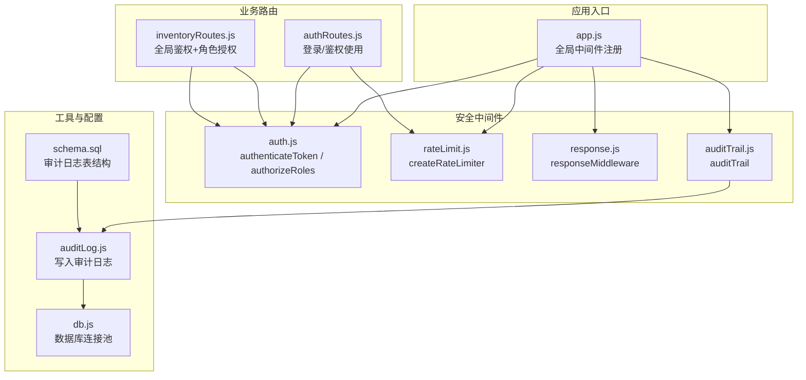
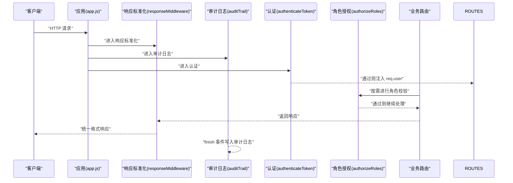
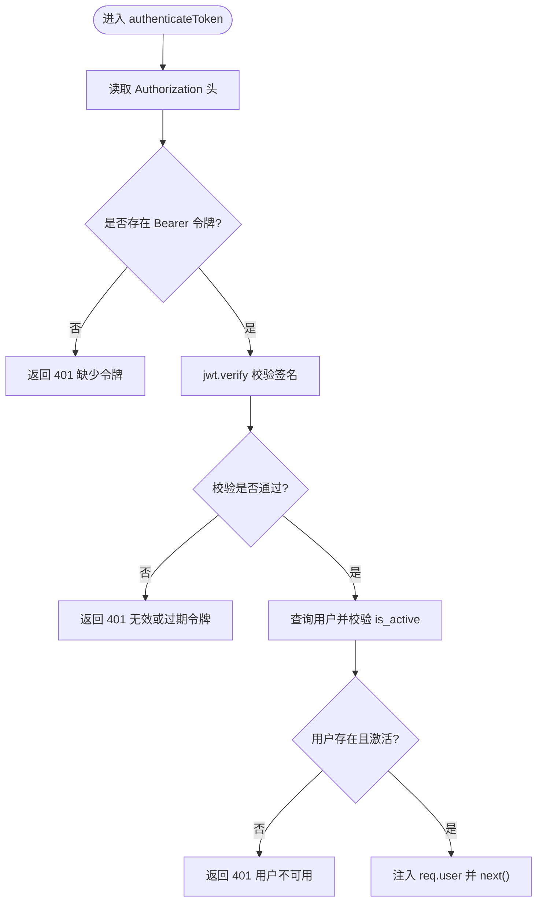
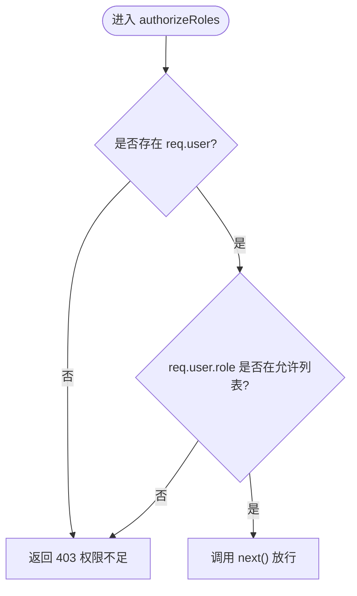
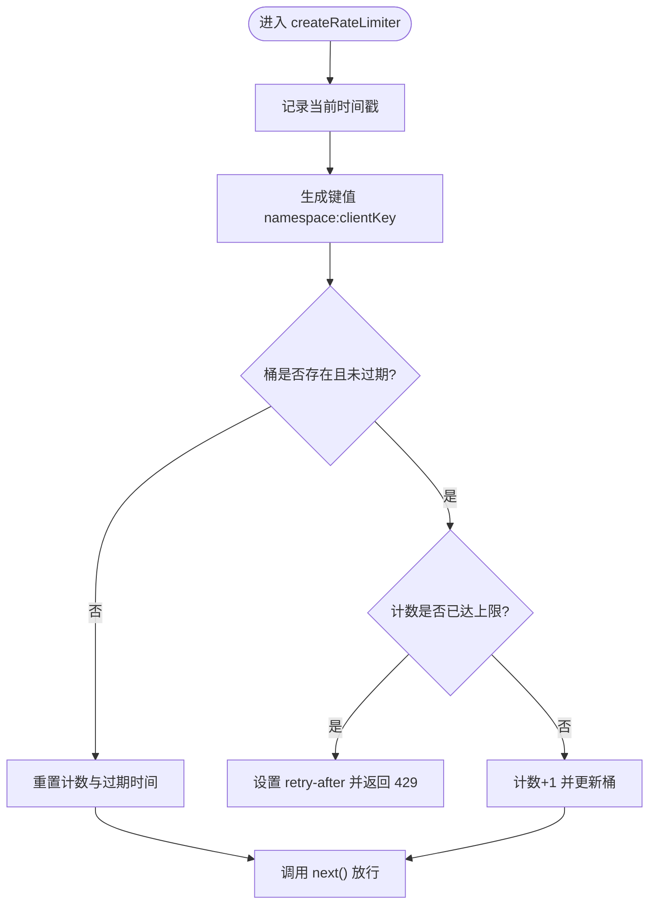
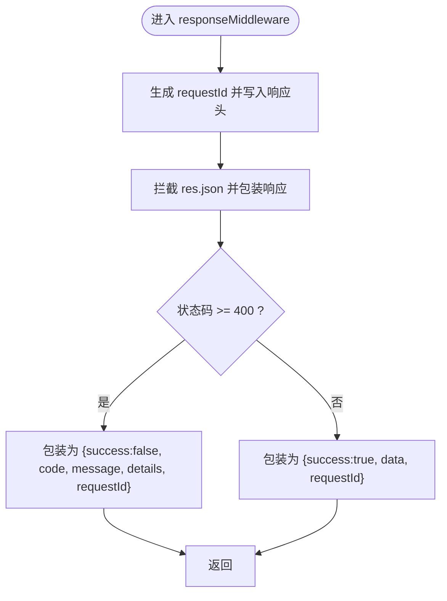
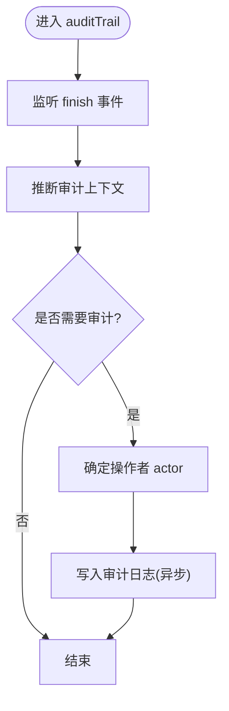
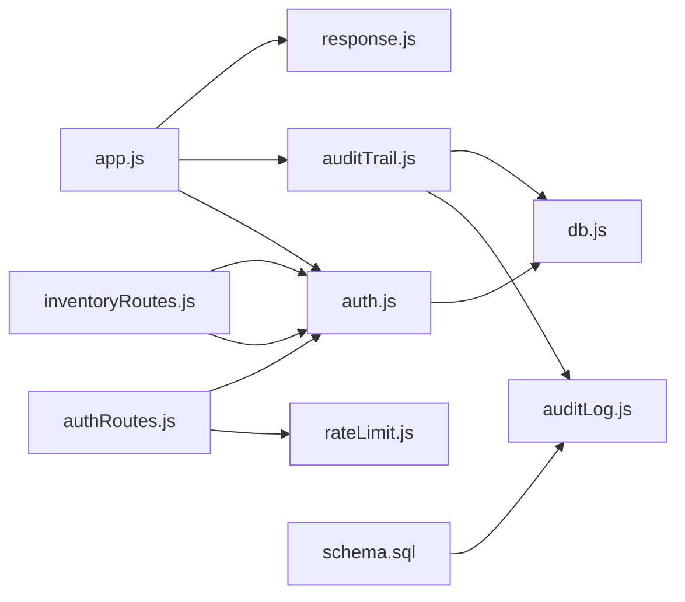

# 安全中间件

<cite>
**本文引用的文件**
- [server/src/middleware/auth.js](file://server/src/middleware/auth.js)
- [server/src/middleware/rateLimit.js](file://server/src/middleware/rateLimit.js)
- [server/src/middleware/response.js](file://server/src/middleware/response.js)
- [server/src/middleware/auditTrail.js](file://server/src/middleware/auditTrail.js)
- [server/src/app.js](file://server/src/app.js)
- [server/src/routes/authRoutes.js](file://server/src/routes/authRoutes.js)
- [server/src/routes/inventoryRoutes.js](file://server/src/routes/inventoryRoutes.js)
- [server/src/utils/auditLog.js](file://server/src/utils/auditLog.js)
- [server/src/config/db.js](file://server/src/config/db.js)
- [server/test/middleware.test.js](file://server/test/middleware.test.js)
- [server/package.json](file://server/package.json)
- [server/database/schema.sql](file://server/database/schema.sql)
</cite>

## 目录
1. [简介](#简介)
2. [项目结构](#项目结构)
3. [核心组件](#核心组件)
4. [架构总览](#架构总览)
5. [详细组件分析](#详细组件分析)
6. [依赖关系分析](#依赖关系分析)
7. [性能考量](#性能考量)
8. [故障排查指南](#故障排查指南)
9. [结论](#结论)
10. [附录](#附录)

## 简介
本文件面向安全中间件系统，聚焦以下能力与实现细节：
- 认证中间件 authenticateToken 的请求头解析、令牌验证与用户信息注入流程
- 角色授权中间件 authorizeRoles 的权限控制机制
- 速率限制中间件 createRateLimiter 的限流策略与响应标准化
- 响应标准化中间件 responseMiddleware 的统一输出格式与辅助方法
- 审计日志中间件 auditTrail 的上下文推断与持久化
- 中间件的配置项、自定义扩展点、执行顺序、错误处理与性能优化建议
- 具体使用示例与集成指南（基于现有路由与测试）

## 项目结构
安全中间件位于 server/src/middleware 目录，配合 app.js 全局注册，并在各路由模块中按需使用。

图表来源
- [server/src/app.js:28-34](file://server/src/app.js#L28-L34)
- [server/src/middleware/auth.js:42-45](file://server/src/middleware/auth.js#L42-L45)
- [server/src/middleware/rateLimit.js:37-39](file://server/src/middleware/rateLimit.js#L37-L39)
- [server/src/middleware/response.js:59-61](file://server/src/middleware/response.js#L59-L61)
- [server/src/middleware/auditTrail.js:81-83](file://server/src/middleware/auditTrail.js#L81-L83)
- [server/src/routes/authRoutes.js:5-6](file://server/src/routes/authRoutes.js#L5-L6)
- [server/src/routes/inventoryRoutes.js:3](file://server/src/routes/inventoryRoutes.js#L3-L4)
- [server/src/utils/auditLog.js:1-38](file://server/src/utils/auditLog.js#L1-L38)
- [server/src/config/db.js:13-24](file://server/src/config/db.js#L13-L24)
- [server/database/schema.sql:275-288](file://server/database/schema.sql#L275-L288)

章节来源
- [server/src/app.js:28-34](file://server/src/app.js#L28-L34)
- [server/src/middleware/auth.js:42-45](file://server/src/middleware/auth.js#L42-L45)
- [server/src/middleware/rateLimit.js:37-39](file://server/src/middleware/rateLimit.js#L37-L39)
- [server/src/middleware/response.js:59-61](file://server/src/middleware/response.js#L59-L61)
- [server/src/middleware/auditTrail.js:81-83](file://server/src/middleware/auditTrail.js#L81-L83)

## 核心组件
- 认证中间件 authenticateToken：从 Authorization 请求头提取 Bearer 令牌，使用 JWT_SECRET 验证签名，查询用户并注入 req.user；失败返回 401
- 角色授权中间件 authorizeRoles：基于 req.user.role 进行白名单校验，未通过返回 403
- 速率限制中间件 createRateLimiter：基于内存 Map 的滑动窗口计数器，支持命名空间隔离与自定义窗口与上限
- 响应标准化中间件 responseMiddleware：统一包装响应体，自动注入 requestId，提供 success/fail 辅助方法
- 审计日志中间件 auditTrail：在响应完成时推断操作上下文并写入审计日志

章节来源
- [server/src/middleware/auth.js:5-29](file://server/src/middleware/auth.js#L5-L29)
- [server/src/middleware/auth.js:32-40](file://server/src/middleware/auth.js#L32-L40)
- [server/src/middleware/rateLimit.js:9-35](file://server/src/middleware/rateLimit.js#L9-L35)
- [server/src/middleware/response.js:3-57](file://server/src/middleware/response.js#L3-L57)
- [server/src/middleware/auditTrail.js:47-79](file://server/src/middleware/auditTrail.js#L47-L79)

## 架构总览
下图展示请求在安全中间件中的流转与职责分工：

图表来源
- [server/src/app.js:28-34](file://server/src/app.js#L28-L34)
- [server/src/middleware/response.js:3-57](file://server/src/middleware/response.js#L3-L57)
- [server/src/middleware/auditTrail.js:47-79](file://server/src/middleware/auditTrail.js#L47-L79)
- [server/src/middleware/auth.js:5-29](file://server/src/middleware/auth.js#L5-L29)
- [server/src/middleware/auth.js:32-40](file://server/src/middleware/auth.js#L32-L40)

## 详细组件分析

### 认证中间件 authenticateToken
- 请求头解析：从 Authorization 头提取 Bearer 令牌，若缺失直接 401
- 令牌验证：使用环境变量 JWT_SECRET 对 JWT 进行签名校验
- 用户信息注入：查询用户并校验是否激活，成功后将用户信息注入 req.user
- 错误处理：令牌缺失、无效或过期、用户不存在或未激活均返回 401

图表来源
- [server/src/middleware/auth.js:5-29](file://server/src/middleware/auth.js#L5-L29)

章节来源
- [server/src/middleware/auth.js:5-29](file://server/src/middleware/auth.js#L5-L29)

### 角色授权中间件 authorizeRoles
- 接收一个或多个允许的角色集合
- 比较 req.user.role 是否在允许集合内
- 未通过则 403，否则放行

图表来源
- [server/src/middleware/auth.js:32-40](file://server/src/middleware/auth.js#L32-L40)

章节来源
- [server/src/middleware/auth.js:32-40](file://server/src/middleware/auth.js#L32-L40)

### 速率限制中间件 createRateLimiter
- 客户端标识：优先取 x-forwarded-for，其次 req.ip，最终回退为 unknown
- 滑动窗口：以 namespace:clientKey 为维度维护计数与过期时间
- 限流策略：超过 max 即 429，设置 retry-after 头；若 res.fail 存在则使用统一错误格式
- 自定义参数：windowMs（窗口毫秒）、max（最大请求数）、namespace（命名空间）

图表来源
- [server/src/middleware/rateLimit.js:9-35](file://server/src/middleware/rateLimit.js#L9-L35)

章节来源
- [server/src/middleware/rateLimit.js:9-35](file://server/src/middleware/rateLimit.js#L9-L35)

### 响应标准化中间件 responseMiddleware
- 注入 requestId：为每个请求生成 UUID 并写入响应头与响应体
- 统一包装：非 success 字段的对象将被包装为 {success, data|code,message,details,requestId}
- 辅助方法：res.success(data, code?) 与 res.fail(code, message, details?, statusCode?)
- 错误兜底：状态码 >= 400 时自动填充标准错误字段

图表来源
- [server/src/middleware/response.js:3-57](file://server/src/middleware/response.js#L3-L57)

章节来源
- [server/src/middleware/response.js:3-57](file://server/src/middleware/response.js#L3-L57)

### 审计日志中间件 auditTrail
- 上下文推断：根据原始路径与方法推断 action/entityType/entityId，特殊处理登录成功场景
- 数据采集：收集用户信息（auditUser > user），请求体脱敏（password 红色标记），状态码与元数据
- 写入持久化：finish 事件触发后异步写入 audit_logs 表，异常仅记录日志不中断请求

图表来源
- [server/src/middleware/auditTrail.js:47-79](file://server/src/middleware/auditTrail.js#L47-L79)
- [server/src/utils/auditLog.js:1-38](file://server/src/utils/auditLog.js#L1-L38)
- [server/database/schema.sql:275-288](file://server/database/schema.sql#L275-L288)

章节来源
- [server/src/middleware/auditTrail.js:47-79](file://server/src/middleware/auditTrail.js#L47-L79)
- [server/src/utils/auditLog.js:1-38](file://server/src/utils/auditLog.js#L1-L38)
- [server/database/schema.sql:275-288](file://server/database/schema.sql#L275-L288)

## 依赖关系分析
- app.js 将响应标准化与审计日志置于认证之前，确保所有请求均具备统一响应与审计能力
- 认证与角色授权在路由层按需使用，inventoryRoutes 对全量接口启用 authenticateToken，并在关键操作使用 authorizeRoles
- 速率限制在 authRoutes 中对登录接口单独配置，避免暴力破解风险
- 审计日志依赖数据库连接池与审计日志表结构

图表来源
- [server/src/app.js:28-34](file://server/src/app.js#L28-L34)
- [server/src/middleware/auth.js:1-2](file://server/src/middleware/auth.js#L1-L2)
- [server/src/middleware/auditTrail.js:1-2](file://server/src/middleware/auditTrail.js#L1-L2)
- [server/src/utils/auditLog.js:1-38](file://server/src/utils/auditLog.js#L1-L38)
- [server/src/config/db.js:13-24](file://server/src/config/db.js#L13-L24)
- [server/database/schema.sql:275-288](file://server/database/schema.sql#L275-L288)

章节来源
- [server/src/app.js:28-34](file://server/src/app.js#L28-L34)
- [server/src/middleware/auth.js:1-2](file://server/src/middleware/auth.js#L1-L2)
- [server/src/middleware/auditTrail.js:1-2](file://server/src/middleware/auditTrail.js#L1-L2)
- [server/src/utils/auditLog.js:1-38](file://server/src/utils/auditLog.js#L1-L38)
- [server/src/config/db.js:13-24](file://server/src/config/db.js#L13-L24)
- [server/database/schema.sql:275-288](file://server/database/schema.sql#L275-L288)

## 性能考量
- 认证与授权：使用数据库查询用户信息，建议在网关或缓存层引入用户信息缓存，减少数据库压力
- 速率限制：当前实现基于内存 Map，多实例部署需替换为共享存储（如 Redis）以保证全局一致性
- 审计日志：finish 事件异步写入，避免阻塞主请求链路；但大量写入仍可能影响数据库性能，建议结合索引与归档策略
- 响应标准化：仅包装响应体与注入头，开销极低，无需额外优化

## 故障排查指南
- 认证失败（401）
  - 检查请求头 Authorization 是否为 Bearer 令牌
  - 确认 JWT_SECRET 环境变量正确
  - 核实用户存在且 is_active 为真
- 权限不足（403）
  - 确认 req.user.role 是否在 authorizeRoles 的允许列表
- 速率受限（429）
  - 检查命名空间与窗口配置是否合理
  - 查看响应头 retry-after 获取重试等待秒数
- 统一错误格式
  - 使用 res.fail(code, message, details?, statusCode?) 或返回 {success:false,...} 结构
  - 使用 res.success(data, statusCode?) 返回成功响应
- 审计日志未记录
  - 确认 finish 事件是否触发
  - 检查数据库连接与审计日志表结构

章节来源
- [server/src/middleware/auth.js:5-29](file://server/src/middleware/auth.js#L5-L29)
- [server/src/middleware/auth.js:32-40](file://server/src/middleware/auth.js#L32-L40)
- [server/src/middleware/rateLimit.js:23-29](file://server/src/middleware/rateLimit.js#L23-L29)
- [server/src/middleware/response.js:36-54](file://server/src/middleware/response.js#L36-L54)
- [server/src/middleware/auditTrail.js:47-79](file://server/src/middleware/auditTrail.js#L47-L79)
- [server/test/middleware.test.js:9-50](file://server/test/middleware.test.js#L9-L50)

## 结论
本安全中间件体系通过“认证-授权-限流-响应标准化-审计日志”的组合，提供了完整的请求安全保障与可观测性。认证与授权在路由层灵活组合，速率限制针对高风险接口独立配置，响应标准化统一了前后端交互格式，审计日志贯穿请求生命周期。建议在生产环境中引入共享缓存与限流存储，并持续监控审计日志与数据库写入性能。

## 附录

### 执行顺序与集成要点
- app.js 中间件顺序（从上至下）：helmet/cors/json/morgan → responseMiddleware → auditTrail → 各路由
- 认证与授权：在需要保护的路由前挂载 authenticateToken，再按需挂载 authorizeRoles
- 速率限制：对登录等敏感接口单独配置，避免影响正常流量
- 审计日志：依赖 finish 事件写入，无需手动调用

章节来源
- [server/src/app.js:28-34](file://server/src/app.js#L28-L34)
- [server/src/routes/authRoutes.js:10-14](file://server/src/routes/authRoutes.js#L10-L14)
- [server/src/routes/inventoryRoutes.js:10](file://server/src/routes/inventoryRoutes.js#L10)
- [server/src/routes/inventoryRoutes.js:405-415](file://server/src/routes/inventoryRoutes.js#L405-L415)

### 配置选项与自定义方法
- authenticateToken
  - 环境变量：JWT_SECRET
  - 可扩展：更换签名算法、增加黑名单校验、引入刷新令牌
- authorizeRoles
  - 参数：角色数组（如 ADMIN/MANAGER/STAFF）
  - 可扩展：支持动态权限矩阵、继承角色
- createRateLimiter
  - 参数：windowMs、max、namespace
  - 可扩展：替换内存 Map 为 Redis 分布式存储
- responseMiddleware
  - 可扩展：统一错误码映射、国际化消息
- auditTrail
  - 可扩展：排除特定路径、自定义脱敏规则

章节来源
- [server/src/middleware/auth.js:14](file://server/src/middleware/auth.js#L14)
- [server/src/middleware/auth.js:32-40](file://server/src/middleware/auth.js#L32-L40)
- [server/src/middleware/rateLimit.js:9](file://server/src/middleware/rateLimit.js#L9)
- [server/src/middleware/response.js:36-54](file://server/src/middleware/response.js#L36-L54)
- [server/src/middleware/auditTrail.js:4-12](file://server/src/middleware/auditTrail.js#L4-L12)

### 使用示例与集成指南
- 在路由中启用认证与角色授权
  - 全局启用认证：inventoryRoutes 路由使用 router.use(authenticateToken)
  - 局部启用角色授权：库存出入库与调拨接口使用 authorizeRoles('ADMIN','MANAGER','STAFF')
- 登录接口限流
  - authRoutes 中对 POST /api/auth/login 应用 loginRateLimit
- 测试验证
  - middleware.test.js 包含响应标准化与限流测试用例

章节来源
- [server/src/routes/inventoryRoutes.js:10](file://server/src/routes/inventoryRoutes.js#L10)
- [server/src/routes/inventoryRoutes.js:405-415](file://server/src/routes/inventoryRoutes.js#L405-L415)
- [server/src/routes/authRoutes.js:10-14](file://server/src/routes/authRoutes.js#L10-L14)
- [server/test/middleware.test.js:9-50](file://server/test/middleware.test.js#L9-L50)