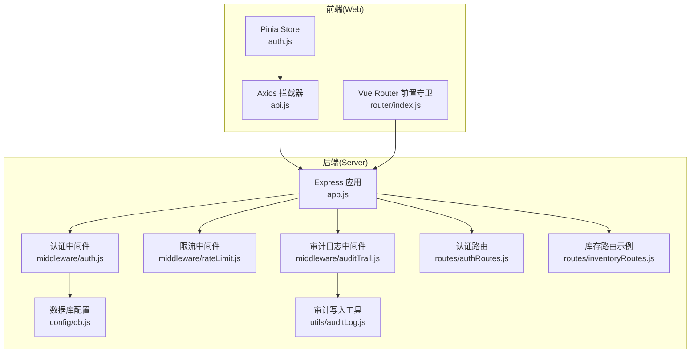
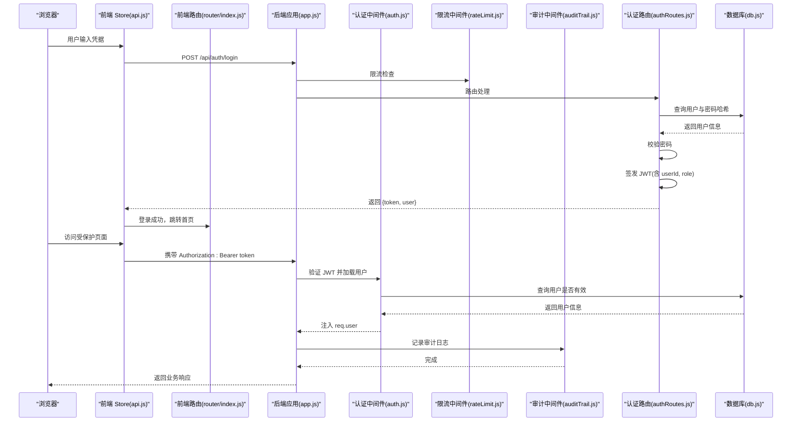
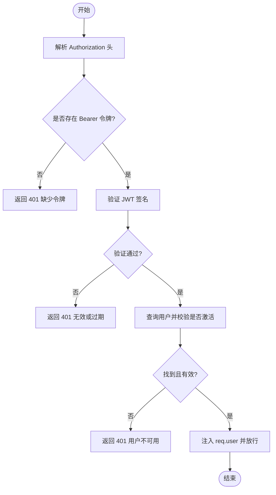
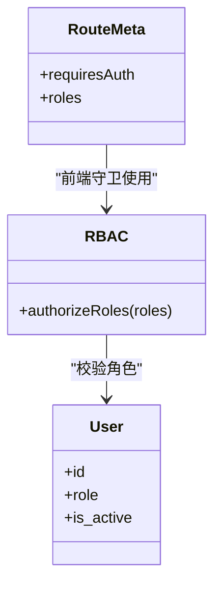
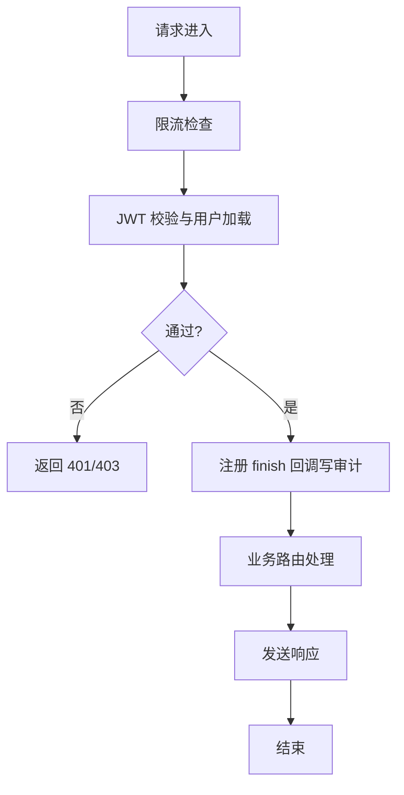
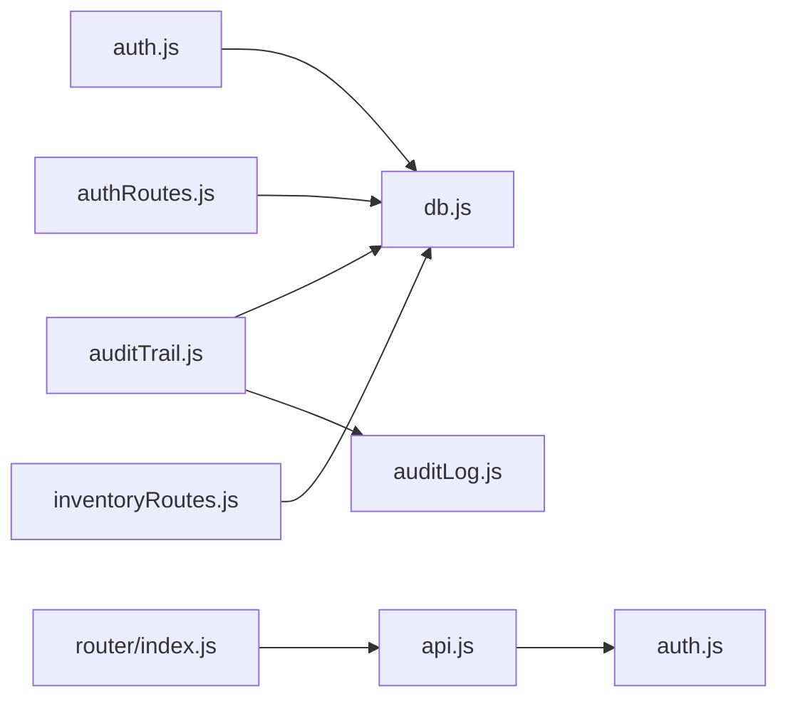

# 认证与授权

<cite>
**本文引用的文件**
- [server/src/middleware/auth.js](file://server/src/middleware/auth.js)
- [server/src/routes/authRoutes.js](file://server/src/routes/authRoutes.js)
- [server/src/app.js](file://server/src/app.js)
- [server/src/middleware/rateLimit.js](file://server/src/middleware/rateLimit.js)
- [server/src/middleware/auditTrail.js](file://server/src/middleware/auditTrail.js)
- [server/src/utils/auditLog.js](file://server/src/utils/auditLog.js)
- [web/src/stores/auth.js](file://web/src/stores/auth.js)
- [web/src/services/api.js](file://web/src/services/api.js)
- [web/src/router/index.js](file://web/src/router/index.js)
- [web/src/constants/accessGuide.js](file://web/src/constants/accessGuide.js)
- [server/database/schema.sql](file://server/database/schema.sql)
- [server/src/config/db.js](file://server/src/config/db.js)
- [server/src/routes/inventoryRoutes.js](file://server/src/routes/inventoryRoutes.js)
</cite>

## 目录
1. [简介](#简介)
2. [项目结构](#项目结构)
3. [核心组件](#核心组件)
4. [架构总览](#架构总览)
5. [详细组件分析](#详细组件分析)
6. [依赖关系分析](#依赖关系分析)
7. [性能考量](#性能考量)
8. [故障排除指南](#故障排除指南)
9. [结论](#结论)
10. [附录](#附录)

## 简介
本文件面向库存管理系统的认证与授权体系，围绕以下目标展开：
- 深入解释基于 JWT 的令牌机制：生成、验证与刷新流程
- 详解基于角色的访问控制（RBAC）：管理员（ADMIN）、经理（MANAGER）、员工（STAFF）的权限边界与访问限制
- 描述安全中间件的工作原理：请求拦截、权限验证与错误处理
- 提供在路由、控制器与前端组件中的使用示例路径
- 总结安全最佳实践、常见问题与排障建议

## 项目结构
后端采用 Express + Postgres 架构，安全相关能力集中在中间件与路由层；前端通过 Pinia Store 与 Axios 拦截器实现会话持久化与请求注入。

图示来源
- [server/src/app.js:1-67](file://server/src/app.js#L1-L67)
- [server/src/middleware/auth.js:1-46](file://server/src/middleware/auth.js#L1-L46)
- [server/src/middleware/rateLimit.js:1-40](file://server/src/middleware/rateLimit.js#L1-L40)
- [server/src/middleware/auditTrail.js:1-84](file://server/src/middleware/auditTrail.js#L1-L84)
- [server/src/routes/authRoutes.js:1-72](file://server/src/routes/authRoutes.js#L1-L72)
- [server/src/routes/inventoryRoutes.js:1-200](file://server/src/routes/inventoryRoutes.js#L1-L200)
- [server/src/config/db.js:1-25](file://server/src/config/db.js#L1-L25)
- [server/src/utils/auditLog.js:1-38](file://server/src/utils/auditLog.js#L1-L38)
- [web/src/stores/auth.js:1-90](file://web/src/stores/auth.js#L1-L90)
- [web/src/services/api.js:1-45](file://web/src/services/api.js#L1-L45)
- [web/src/router/index.js:187-208](file://web/src/router/index.js#L187-L208)

章节来源
- [server/src/app.js:1-67](file://server/src/app.js#L1-L67)
- [web/src/router/index.js:187-208](file://web/src/router/index.js#L187-L208)

## 核心组件
- JWT 中间件：负责从请求头解析并校验令牌，加载用户上下文
- 角色授权中间件：基于用户角色进行访问控制
- 认证路由：登录签发令牌、刷新用户态
- 限流中间件：防暴力破解与滥用
- 审计日志中间件：记录关键操作与失败事件
- 前端认证 Store：本地持久化令牌与用户信息
- Axios 请求拦截器：自动注入 Authorization 头

章节来源
- [server/src/middleware/auth.js:1-46](file://server/src/middleware/auth.js#L1-L46)
- [server/src/routes/authRoutes.js:1-72](file://server/src/routes/authRoutes.js#L1-L72)
- [server/src/middleware/rateLimit.js:1-40](file://server/src/middleware/rateLimit.js#L1-L40)
- [server/src/middleware/auditTrail.js:1-84](file://server/src/middleware/auditTrail.js#L1-L84)
- [web/src/stores/auth.js:1-90](file://web/src/stores/auth.js#L1-L90)
- [web/src/services/api.js:1-45](file://web/src/services/api.js#L1-L45)

## 架构总览
下图展示了从浏览器到后端的完整认证与授权链路，以及令牌在各层的流转方式。

图示来源
- [server/src/app.js:1-67](file://server/src/app.js#L1-L67)
- [server/src/middleware/auth.js:1-46](file://server/src/middleware/auth.js#L1-L46)
- [server/src/middleware/rateLimit.js:1-40](file://server/src/middleware/rateLimit.js#L1-L40)
- [server/src/middleware/auditTrail.js:1-84](file://server/src/middleware/auditTrail.js#L1-L84)
- [server/src/routes/authRoutes.js:1-72](file://server/src/routes/authRoutes.js#L1-L72)
- [server/src/config/db.js:1-25](file://server/src/config/db.js#L1-L25)
- [web/src/services/api.js:1-45](file://web/src/services/api.js#L1-L45)
- [web/src/router/index.js:187-208](file://web/src/router/index.js#L187-L208)

## 详细组件分析

### JWT 令牌机制
- 令牌生成
  - 登录成功后，后端使用用户 ID 与角色签发 JWT，设置过期时间
  - 参考路径：[server/src/routes/authRoutes.js:41-43](file://server/src/routes/authRoutes.js#L41-L43)
- 令牌验证
  - 中间件从 Authorization 头提取 Bearer 令牌，使用密钥验证签名
  - 成功后查询用户并注入到请求对象，同时校验用户是否激活
  - 参考路径：[server/src/middleware/auth.js:5-29](file://server/src/middleware/auth.js#L5-L29)
- 令牌刷新
  - 前端通过“获取当前用户”接口恢复登录态，无需重新登录
  - 参考路径：[server/src/routes/authRoutes.js:67-69](file://server/src/routes/authRoutes.js#L67-L69)

图示来源
- [server/src/middleware/auth.js:5-29](file://server/src/middleware/auth.js#L5-L29)

章节来源
- [server/src/routes/authRoutes.js:41-43](file://server/src/routes/authRoutes.js#L41-L43)
- [server/src/middleware/auth.js:5-29](file://server/src/middleware/auth.js#L5-L29)
- [server/src/routes/authRoutes.js:67-69](file://server/src/routes/authRoutes.js#L67-L69)

### 基于角色的访问控制（RBAC）
- 角色定义
  - 数据库中用户表的 role 字段限定为 ADMIN、MANAGER、STAFF
  - 参考路径：[server/database/schema.sql:2-11](file://server/database/schema.sql#L2-L11)
- 授权中间件
  - authorizeRoles(...) 将角色数组注入到路由处理前，仅允许匹配角色访问
  - 参考路径：[server/src/middleware/auth.js:32-40](file://server/src/middleware/auth.js#L32-L40)
- 前端角色守卫
  - 路由 meta.roles 控制页面可见性；若用户角色不在允许集合则重定向至仪表盘
  - 参考路径：[web/src/router/index.js:187-208](file://web/src/router/index.js#L187-L208)
- 权限概览（节选）
  - 管理员：可访问所有页面与告警，管理主数据、盘点审批、报表与审计
  - 经理：日常运营、库存监控、调拨与盘点执行
  - 员工：一线收发货与盘点录入，不可管理主数据与导出报表
  - 参考路径：[web/src/constants/accessGuide.js:1-74](file://web/src/constants/accessGuide.js#L1-L74)

图示来源
- [server/src/middleware/auth.js:32-40](file://server/src/middleware/auth.js#L32-L40)
- [web/src/router/index.js:187-208](file://web/src/router/index.js#L187-L208)
- [server/database/schema.sql:2-11](file://server/database/schema.sql#L2-L11)

章节来源
- [server/src/middleware/auth.js:32-40](file://server/src/middleware/auth.js#L32-L40)
- [web/src/router/index.js:187-208](file://web/src/router/index.js#L187-L208)
- [web/src/constants/accessGuide.js:1-74](file://web/src/constants/accessGuide.js#L1-L74)
- [server/database/schema.sql:2-11](file://server/database/schema.sql#L2-L11)

### 安全中间件工作原理
- 认证中间件
  - 解析 Bearer 令牌、验证签名、加载用户并校验有效性
  - 参考路径：[server/src/middleware/auth.js:5-29](file://server/src/middleware/auth.js#L5-L29)
- 限流中间件
  - 基于客户端 IP 与命名空间的滑动窗口限流，超过阈值返回 429
  - 参考路径：[server/src/middleware/rateLimit.js:9-35](file://server/src/middleware/rateLimit.js#L9-L35)
- 审计中间件
  - 在响应完成后记录操作行为、实体类型、方法、路径与元数据
  - 参考路径：[server/src/middleware/auditTrail.js:47-79](file://server/src/middleware/auditTrail.js#L47-L79)
- 审计写入工具
  - 将审计记录写入 audit_logs 表，包含 JSONB 元数据
  - 参考路径：[server/src/utils/auditLog.js:1-38](file://server/src/utils/auditLog.js#L1-L38)

图示来源
- [server/src/middleware/rateLimit.js:9-35](file://server/src/middleware/rateLimit.js#L9-L35)
- [server/src/middleware/auth.js:5-29](file://server/src/middleware/auth.js#L5-L29)
- [server/src/middleware/auditTrail.js:47-79](file://server/src/middleware/auditTrail.js#L47-L79)
- [server/src/utils/auditLog.js:1-38](file://server/src/utils/auditLog.js#L1-L38)

章节来源
- [server/src/middleware/auth.js:5-29](file://server/src/middleware/auth.js#L5-L29)
- [server/src/middleware/rateLimit.js:9-35](file://server/src/middleware/rateLimit.js#L9-L35)
- [server/src/middleware/auditTrail.js:47-79](file://server/src/middleware/auditTrail.js#L47-L79)
- [server/src/utils/auditLog.js:1-38](file://server/src/utils/auditLog.js#L1-L38)

### 前端集成与使用示例
- 登录与会话持久化
  - Store 登录成功后保存 token 与用户信息到 localStorage，并设置首选货币与通知
  - 参考路径：[web/src/stores/auth.js:44-58](file://web/src/stores/auth.js#L44-L58)
- 请求拦截与自动注入
  - Axios 拦截器自动在请求头添加 Authorization: Bearer token
  - 参考路径：[web/src/services/api.js:8-24](file://web/src/services/api.js#L8-L24)
- 页面访问控制
  - 路由 meta.requiresAuth 与 meta.roles 控制页面访问；无 token 或角色不符则重定向
  - 参考路径：[web/src/router/index.js:187-208](file://web/src/router/index.js#L187-L208)

章节来源
- [web/src/stores/auth.js:44-58](file://web/src/stores/auth.js#L44-L58)
- [web/src/services/api.js:8-24](file://web/src/services/api.js#L8-L24)
- [web/src/router/index.js:187-208](file://web/src/router/index.js#L187-L208)

### 后端路由中的使用范式
- 全局认证
  - 路由组可统一挂载 authenticateToken，确保后续处理均具备用户上下文
  - 示例参考：[server/src/routes/inventoryRoutes.js:10](file://server/src/routes/inventoryRoutes.js#L10)
- 角色授权
  - 使用 authorizeRoles(...) 限定特定操作的可访问角色
  - 示例参考：[server/src/routes/inventoryRoutes.js:3](file://server/src/routes/inventoryRoutes.js#L3)
- 登录与刷新
  - 登录接口签发令牌；/auth/me 用于刷新用户态
  - 示例参考：[server/src/routes/authRoutes.js:17-69](file://server/src/routes/authRoutes.js#L17-L69)

章节来源
- [server/src/routes/inventoryRoutes.js:3](file://server/src/routes/inventoryRoutes.js#L3)
- [server/src/routes/inventoryRoutes.js:10](file://server/src/routes/inventoryRoutes.js#L10)
- [server/src/routes/authRoutes.js:17-69](file://server/src/routes/authRoutes.js#L17-L69)

## 依赖关系分析
- 组件耦合
  - 认证中间件依赖数据库查询以加载用户上下文
  - 审计中间件依赖数据库连接池与审计写入工具
  - 前端 Store 依赖 Axios 拦截器与本地存储
- 外部依赖
  - jsonwebtoken 用于签发与验证 JWT
  - bcryptjs 用于密码哈希比对
  - pg 与连接池用于数据库访问
  - helmet、cors、morgan 提升安全与可观测性

图示来源
- [server/src/middleware/auth.js:1-46](file://server/src/middleware/auth.js#L1-L46)
- [server/src/middleware/auditTrail.js:1-84](file://server/src/middleware/auditTrail.js#L1-L84)
- [server/src/utils/auditLog.js:1-38](file://server/src/utils/auditLog.js#L1-L38)
- [server/src/config/db.js:1-25](file://server/src/config/db.js#L1-L25)
- [server/src/routes/authRoutes.js:1-72](file://server/src/routes/authRoutes.js#L1-L72)
- [server/src/routes/inventoryRoutes.js:1-200](file://server/src/routes/inventoryRoutes.js#L1-L200)
- [web/src/services/api.js:1-45](file://web/src/services/api.js#L1-L45)
- [web/src/stores/auth.js:1-90](file://web/src/stores/auth.js#L1-L90)
- [web/src/router/index.js:187-208](file://web/src/router/index.js#L187-L208)

章节来源
- [server/src/middleware/auth.js:1-46](file://server/src/middleware/auth.js#L1-L46)
- [server/src/middleware/auditTrail.js:1-84](file://server/src/middleware/auditTrail.js#L1-L84)
- [server/src/utils/auditLog.js:1-38](file://server/src/utils/auditLog.js#L1-L38)
- [server/src/config/db.js:1-25](file://server/src/config/db.js#L1-L25)
- [server/src/routes/authRoutes.js:1-72](file://server/src/routes/authRoutes.js#L1-L72)
- [server/src/routes/inventoryRoutes.js:1-200](file://server/src/routes/inventoryRoutes.js#L1-L200)
- [web/src/services/api.js:1-45](file://web/src/services/api.js#L1-L45)
- [web/src/stores/auth.js:1-90](file://web/src/stores/auth.js#L1-L90)
- [web/src/router/index.js:187-208](file://web/src/router/index.js#L187-L208)

## 性能考量
- 令牌有效期
  - 登录签发的令牌有效期为 8 小时，建议结合刷新策略与最小权限原则降低长期暴露风险
  - 参考路径：[server/src/routes/authRoutes.js:41-43](file://server/src/routes/authRoutes.js#L41-L43)
- 限流策略
  - 登录接口默认每分钟最多 10 次尝试，防止暴力破解
  - 可根据部署环境调整窗口与最大请求数
  - 参考路径：[server/src/middleware/rateLimit.js:9-35](file://server/src/middleware/rateLimit.js#L9-L35)
- 审计日志写入
  - 审计写入为异步回调，避免阻塞主处理流程；建议在高并发场景下评估数据库写入压力
  - 参考路径：[server/src/middleware/auditTrail.js:47-79](file://server/src/middleware/auditTrail.js#L47-L79)

## 故障排除指南
- 401 未认证
  - 可能原因：缺少 Authorization 头、令牌缺失、签名无效或已过期
  - 建议排查：确认前端是否正确注入 Bearer 令牌；核对后端 JWT 密钥与过期时间
  - 参考路径：[server/src/middleware/auth.js:9-11](file://server/src/middleware/auth.js#L9-L11), [server/src/middleware/auth.js:26-28](file://server/src/middleware/auth.js#L26-L28)
- 403 禁止访问
  - 可能原因：用户角色不在允许范围内
  - 建议排查：核对路由 meta.roles 与用户角色；检查数据库用户表 role 字段
  - 参考路径：[server/src/middleware/auth.js:34-36](file://server/src/middleware/auth.js#L34-L36), [server/database/schema.sql:7](file://server/database/schema.sql#L7)
- 429 请求过多
  - 可能原因：触发限流
  - 建议排查：检查 x-forwarded-for 与客户端真实 IP；调整限流参数
  - 参考路径：[server/src/middleware/rateLimit.js:23-29](file://server/src/middleware/rateLimit.js#L23-L29)
- 审计日志未记录
  - 可能原因：非变更类请求或响应状态码异常
  - 建议排查：确认请求方法与路径；检查审计上下文推断逻辑
  - 参考路径：[server/src/middleware/auditTrail.js:14-44](file://server/src/middleware/auditTrail.js#L14-L44)
- 登录成功但页面仍提示未登录
  - 可能原因：前端未正确保存 token 或 localStorage 异常
  - 建议排查：检查 Store 登录流程与本地存储；确认 Axios 拦截器已注入 Authorization
  - 参考路径：[web/src/stores/auth.js:28-33](file://web/src/stores/auth.js#L28-L33), [web/src/services/api.js:13-15](file://web/src/services/api.js#L13-L15)

章节来源
- [server/src/middleware/auth.js:9-11](file://server/src/middleware/auth.js#L9-L11)
- [server/src/middleware/auth.js:26-28](file://server/src/middleware/auth.js#L26-L28)
- [server/src/middleware/auth.js:34-36](file://server/src/middleware/auth.js#L34-L36)
- [server/src/middleware/rateLimit.js:23-29](file://server/src/middleware/rateLimit.js#L23-L29)
- [server/src/middleware/auditTrail.js:14-44](file://server/src/middleware/auditTrail.js#L14-L44)
- [web/src/stores/auth.js:28-33](file://web/src/stores/auth.js#L28-L33)
- [web/src/services/api.js:13-15](file://web/src/services/api.js#L13-L15)

## 结论
本系统通过 JWT 令牌、限流与审计三道防线实现基础安全，配合前端路由守卫与后端授权中间件形成前后端协同的 RBAC 体系。建议在生产环境中进一步强化密钥管理、引入刷新令牌轮换、增强审计粒度与告警联动，并定期进行安全审计与渗透测试。

## 附录
- 数据库用户表结构（节选）
  - 包含角色字段与激活状态，支撑 RBAC 与会话有效性校验
  - 参考路径：[server/database/schema.sql:2-11](file://server/database/schema.sql#L2-L11)
- 审计日志表结构（节选）
  - 记录操作者、实体类型、方法、路径与元数据，便于追溯
  - 参考路径：[server/database/schema.sql:275-288](file://server/database/schema.sql#L275-L288)