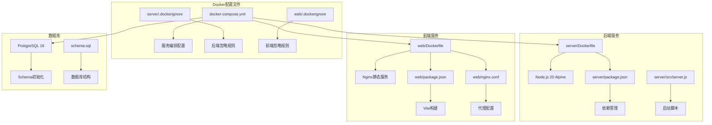
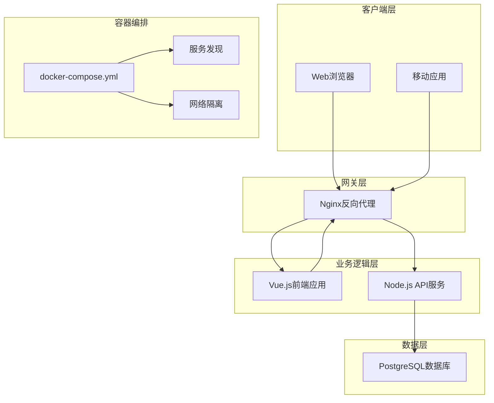
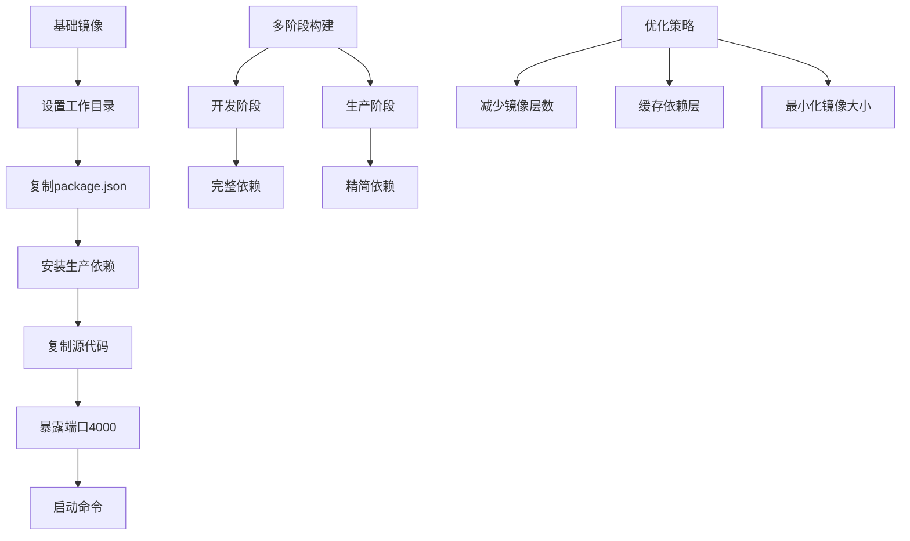
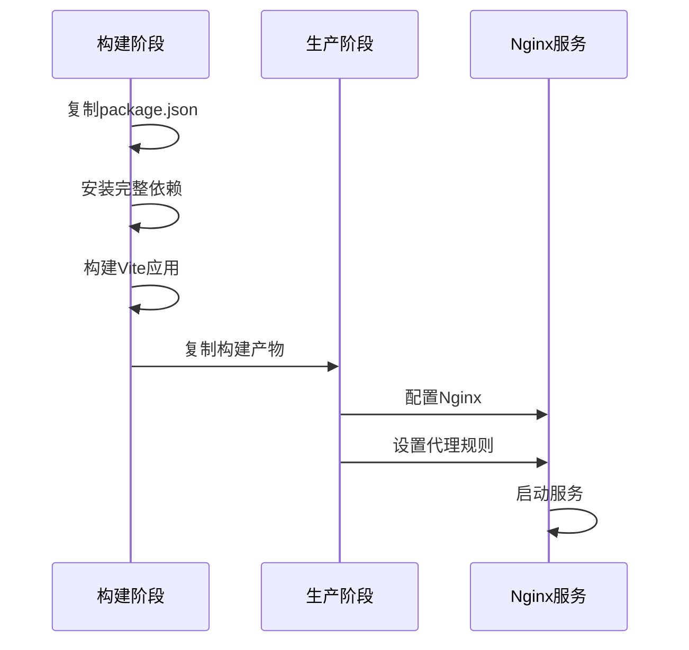
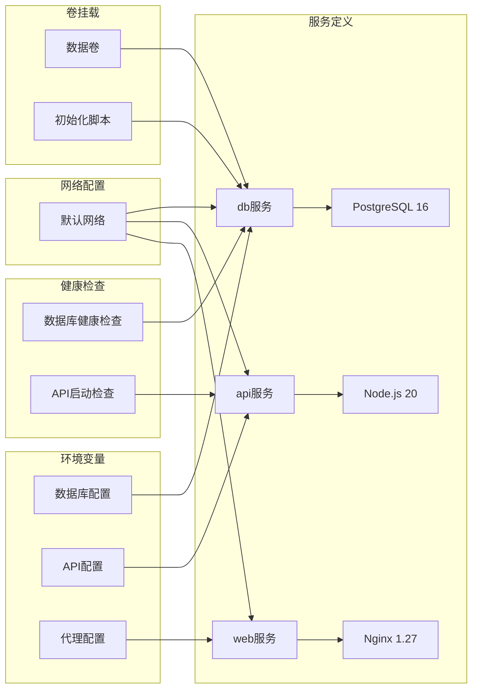
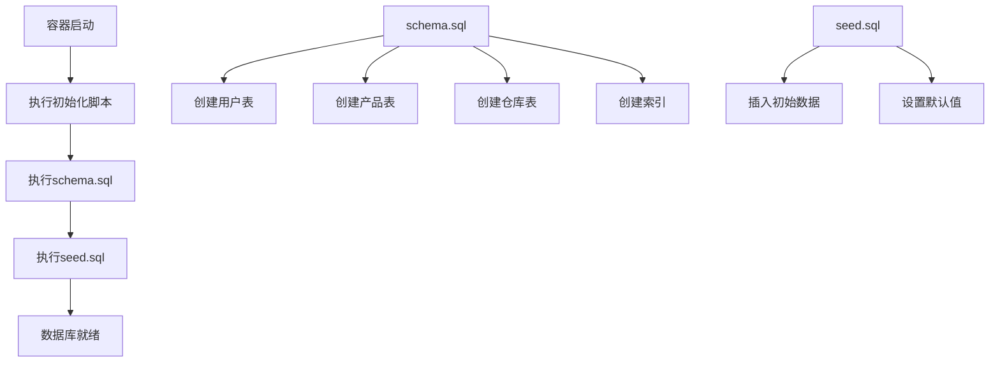
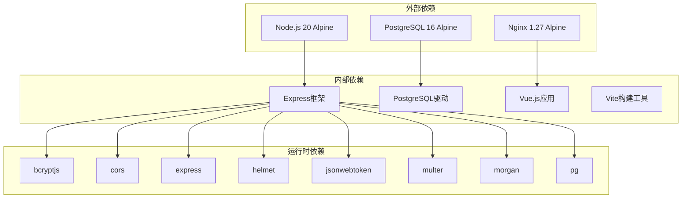

# Docker容器化部署

<cite>
**本文档引用的文件**
- [server/.dockerignore](file://server/.dockerignore)
- [web/.dockerignore](file://web/.dockerignore)
- [server/Dockerfile](file://server/Dockerfile)
- [web/Dockerfile](file://web/Dockerfile)
- [docker-compose.yml](file://docker-compose.yml)
- [server/package.json](file://server/package.json)
- [web/package.json](file://web/package.json)
- [web/nginx.conf](file://web/nginx.conf)
- [server/src/server.js](file://server/src/server.js)
- [server/src/config/db.js](file://server/src/config/db.js)
- [server/database/schema.sql](file://server/database/schema.sql)
</cite>

## 目录
1. [简介](#简介)
2. [项目结构](#项目结构)
3. [核心组件](#核心组件)
4. [架构概览](#架构概览)
5. [详细组件分析](#详细组件分析)
6. [依赖关系分析](#依赖关系分析)
7. [性能考虑](#性能考虑)
8. [故障排除指南](#故障排除指南)
9. [结论](#结论)
10. [附录](#附录)

## 简介

本项目是一个基于Vue.js的库存管理系统，采用Docker容器化部署方案。该系统包含三个主要组件：PostgreSQL数据库、Node.js后端API服务和Vue.js前端应用。通过Docker Compose实现容器编排，提供完整的开发和生产环境部署解决方案。

系统的核心功能包括：
- 库存管理（产品、仓库、批次管理）
- 市场渠道同步（Shopee、Lazada、TikTok）
- 供应链管理（供应商、采购、入库出库）
- 报表统计和审计日志
- 用户权限管理和多角色支持

## 项目结构

项目的Docker相关文件分布如下：



**图表来源**
- [docker-compose.yml:1-57](file://docker-compose.yml#L1-L57)
- [server/Dockerfile:1-13](file://server/Dockerfile#L1-L13)
- [web/Dockerfile:1-19](file://web/Dockerfile#L1-L19)

**章节来源**
- [docker-compose.yml:1-57](file://docker-compose.yml#L1-L57)
- [server/.dockerignore:1-4](file://server/.dockerignore#L1-L4)
- [web/.dockerignore:1-4](file://web/.dockerignore#L1-L4)

## 核心组件

### 数据库服务 (PostgreSQL)

数据库服务使用PostgreSQL 16 Alpine镜像，提供以下特性：
- **数据持久化**：通过命名卷 `inventory_db_data` 实现数据持久化
- **自动初始化**：通过挂载SQL文件自动创建数据库结构和初始数据
- **健康检查**：使用 `pg_isready` 进行数据库连接健康检查
- **安全配置**：默认用户名密码配置，支持生产环境重写

### 后端API服务 (Node.js)

后端服务基于Node.js 20 Alpine镜像，采用多阶段构建：
- **开发阶段**：安装完整依赖用于开发
- **生产阶段**：仅安装生产依赖，减小镜像体积
- **启动方式**：使用 `npm start` 启动Express应用
- **端口暴露**：监听4000端口

### 前端服务 (Nginx)

前端服务采用Nginx 1.27 Alpine镜像：
- **静态文件服务**：提供Vue.js构建后的静态文件
- **API代理**：将 `/api/` 请求转发到后端API服务
- **单页应用支持**：配置 `try_files` 支持Vue Router
- **端口暴露**：监听80端口

**章节来源**
- [server/Dockerfile:1-13](file://server/Dockerfile#L1-L13)
- [web/Dockerfile:1-19](file://web/Dockerfile#L1-L19)
- [docker-compose.yml:22-53](file://docker-compose.yml#L22-L53)

## 架构概览

系统采用微服务架构，通过Docker Compose实现容器编排：



**图表来源**
- [docker-compose.yml:1-57](file://docker-compose.yml#L1-L57)
- [web/nginx.conf:8-15](file://web/nginx.conf#L8-L15)

### 容器间通信

容器间通信通过Docker网络实现：
- **服务名称解析**：前端通过 `api` 主机名访问后端API
- **端口映射**：数据库映射5432端口，API映射4000端口，前端映射8080端口
- **环境变量传递**：数据库连接字符串通过环境变量传递
- **依赖关系**：API服务等待数据库健康检查通过后再启动

**章节来源**
- [docker-compose.yml:40-42](file://docker-compose.yml#L40-L42)
- [web/nginx.conf:9](file://web/nginx.conf#L9)

## 详细组件分析

### 后端Dockerfile分析

后端Dockerfile采用简洁高效的构建策略：



**图表来源**
- [server/Dockerfile:1-13](file://server/Dockerfile#L1-L13)

关键特性：
- **Node.js 20 Alpine**：轻量级运行时环境
- **生产依赖优化**：使用 `npm ci --omit=dev` 减少镜像大小
- **工作目录**：设置 `/app` 为工作目录
- **启动命令**：使用 `npm start` 启动服务

**章节来源**
- [server/Dockerfile:1-13](file://server/Dockerfile#L1-L13)
- [server/package.json:6-10](file://server/package.json#L6-L10)

### 前端Dockerfile分析

前端Dockerfile采用多阶段构建策略：



**图表来源**
- [web/Dockerfile:1-19](file://web/Dockerfile#L1-L19)

构建流程：
- **第一阶段**：Node.js 20 Alpine构建Vite应用
- **第二阶段**：从Nginx镜像开始，复制构建产物
- **Nginx配置**：代理 `/api/` 到后端API服务
- **静态文件**：提供Vue.js构建后的静态资源

**章节来源**
- [web/Dockerfile:1-19](file://web/Dockerfile#L1-L19)
- [web/nginx.conf:1-21](file://web/nginx.conf#L1-L21)

### Docker Compose配置分析

Compose文件定义了完整的微服务架构：



**图表来源**
- [docker-compose.yml:1-57](file://docker-compose.yml#L1-L57)

关键配置：
- **服务依赖**：API等待数据库健康检查通过
- **端口映射**：开发环境端口映射便于调试
- **数据持久化**：命名卷确保数据持久化
- **初始化脚本**：自动执行数据库初始化

**章节来源**
- [docker-compose.yml:1-57](file://docker-compose.yml#L1-L57)

### 数据库初始化流程

数据库通过挂载SQL文件实现自动化初始化：



**图表来源**
- [docker-compose.yml:14-15](file://docker-compose.yml#L14-L15)
- [server/database/schema.sql:1-420](file://server/database/schema.sql#L1-L420)

**章节来源**
- [docker-compose.yml:14-15](file://docker-compose.yml#L14-L15)
- [server/database/schema.sql:1-420](file://server/database/schema.sql#L1-L420)

## 依赖关系分析

### 组件依赖图



**图表来源**
- [server/package.json:15-25](file://server/package.json#L15-L25)
- [web/package.json:12-23](file://web/package.json#L12-L23)

### 环境变量配置

系统使用多种环境变量进行配置管理：

| 服务 | 变量名 | 默认值 | 用途 |
|------|--------|--------|------|
| 数据库 | POSTGRES_DB | inventory_system | 数据库名称 |
| 数据库 | POSTGRES_USER | postgres | 用户名 |
| 数据库 | POSTGRES_PASSWORD | postgres | 密码 |
| API | PORT | 4000 | API端口 |
| API | DATABASE_URL | postgresql://... | 数据库连接字符串 |
| API | JWT_SECRET | change_this_to_a_secure_secret | JWT密钥 |
| API | SHOPEE_* | 空字符串 | Shopee集成配置 |
| API | LAZADA_* | 空字符串 | Lazada集成配置 |
| API | TIKTOK_* | 空字符串 | TikTok集成配置 |

**章节来源**
- [docker-compose.yml:28-37](file://docker-compose.yml#L28-L37)
- [server/src/config/db.js:13-19](file://server/src/config/db.js#L13-L19)

## 性能考虑

### 镜像优化策略

1. **多阶段构建**：前端使用两阶段构建减少最终镜像大小
2. **Alpine基础镜像**：使用轻量级Alpine Linux减少镜像体积
3. **生产依赖优化**：后端仅安装生产所需依赖
4. **缓存策略**：合理安排Dockerfile指令顺序利用层缓存

### 启动性能优化

1. **数据库连接超时**：API启动时进行数据库连接测试
2. **健康检查**：数据库使用 `pg_isready` 进行快速健康检查
3. **服务依赖**：API等待数据库健康后再启动
4. **连接池配置**：PostgreSQL连接池参数优化

### 资源使用建议

1. **内存限制**：为各服务设置合理的内存限制
2. **CPU配额**：根据负载情况调整CPU配额
3. **存储优化**：定期清理不必要的日志文件
4. **网络优化**：使用Docker网络优化容器间通信

## 故障排除指南

### 常见启动问题

**数据库无法连接**
- 检查数据库服务是否正常运行
- 验证 `DATABASE_URL` 环境变量配置
- 确认端口5432未被占用
- 查看数据库初始化脚本执行结果

**API服务启动失败**
- 检查Node.js依赖安装是否成功
- 验证数据库连接字符串格式
- 查看启动超时配置是否合理
- 检查JWT密钥配置

**前端代理问题**
- 确认Nginx代理配置正确
- 验证API服务可达性
- 检查CORS配置
- 查看浏览器开发者工具网络面板

### 调试技巧

1. **查看容器日志**：使用 `docker compose logs [service]`
2. **进入容器调试**：使用 `docker compose exec [service] /bin/sh`
3. **网络连通性测试**：使用 `docker compose exec [service] ping [host]`
4. **数据库查询测试**：使用 `docker compose exec db psql -U postgres`

### 性能监控

1. **资源使用监控**：使用 `docker stats` 查看资源使用情况
2. **日志分析**：定期检查应用日志中的错误信息
3. **数据库性能**：监控慢查询和连接数
4. **网络延迟**：测试容器间通信延迟

**章节来源**
- [server/src/server.js:13-25](file://server/src/server.js#L13-L25)
- [docker-compose.yml:16-20](file://docker-compose.yml#L16-L20)

## 结论

本项目的Docker容器化部署方案提供了完整的开发和生产环境解决方案。通过合理的架构设计和配置优化，实现了：

1. **模块化架构**：清晰的服务边界和职责分离
2. **高效构建**：多阶段构建减少镜像大小和构建时间
3. **可靠部署**：健康检查和服务依赖确保系统稳定性
4. **易于维护**：标准化的配置和环境变量管理

建议在生产环境中进一步完善的方面：
- 添加更详细的日志配置
- 实现更严格的环境变量验证
- 配置更完善的监控和告警系统
- 考虑使用更高级的负载均衡和反向代理配置

## 附录

### 部署命令参考

**本地开发环境**
```bash
# 启动所有服务
docker compose up -d

# 查看服务状态
docker compose ps

# 查看日志
docker compose logs -f

# 停止服务
docker compose down
```

**生产环境部署**
```bash
# 构建镜像
docker compose build

# 启动服务
docker compose up -d

# 执行数据库迁移
docker compose exec db psql -U postgres -d inventory_system -f /docker-entrypoint-initdb.d/01-schema.sql
```

### 最佳实践清单

1. **镜像管理**
   - 使用固定版本标签而非latest
   - 定期更新基础镜像
   - 清理无用镜像和构建缓存

2. **配置管理**
   - 区分开发、测试、生产环境配置
   - 使用环境变量而非硬编码配置
   - 敏感信息使用Docker secrets

3. **安全考虑**
   - 定期扫描镜像安全漏洞
   - 使用只读文件系统
   - 限制容器权限

4. **监控运维**
   - 配置健康检查
   - 设置资源限制
   - 实施日志轮转