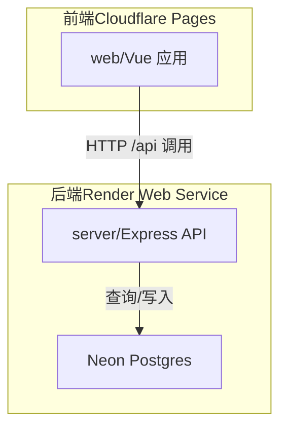
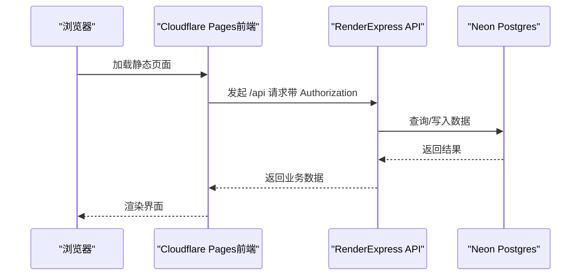
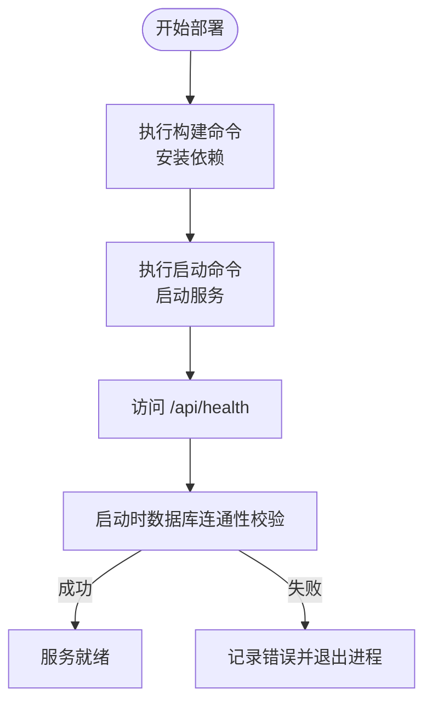
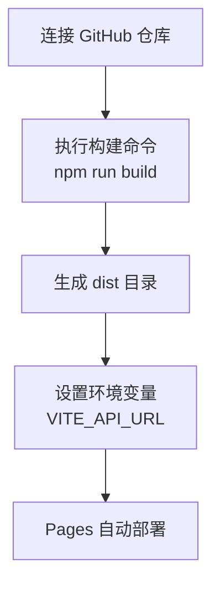
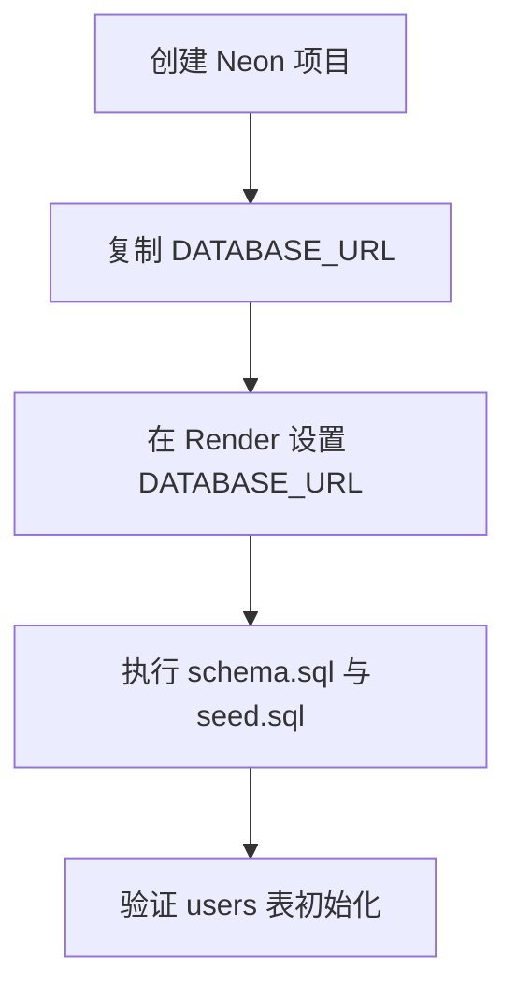
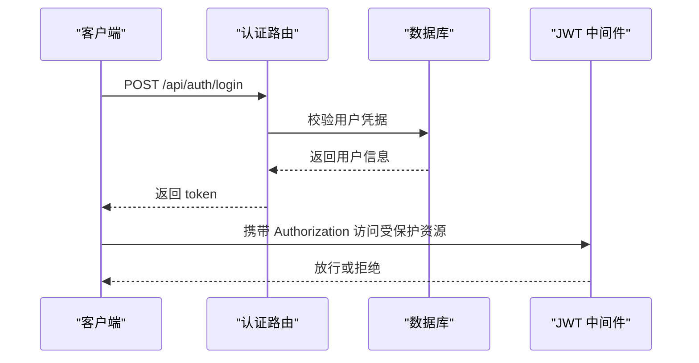
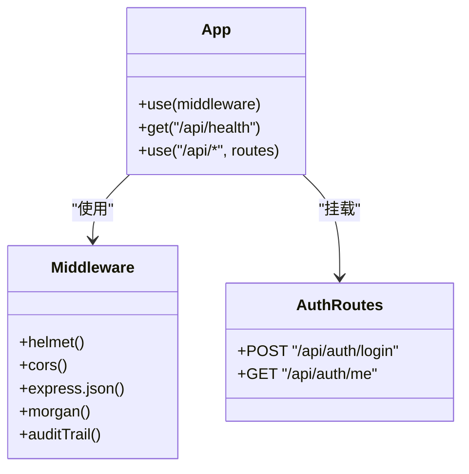
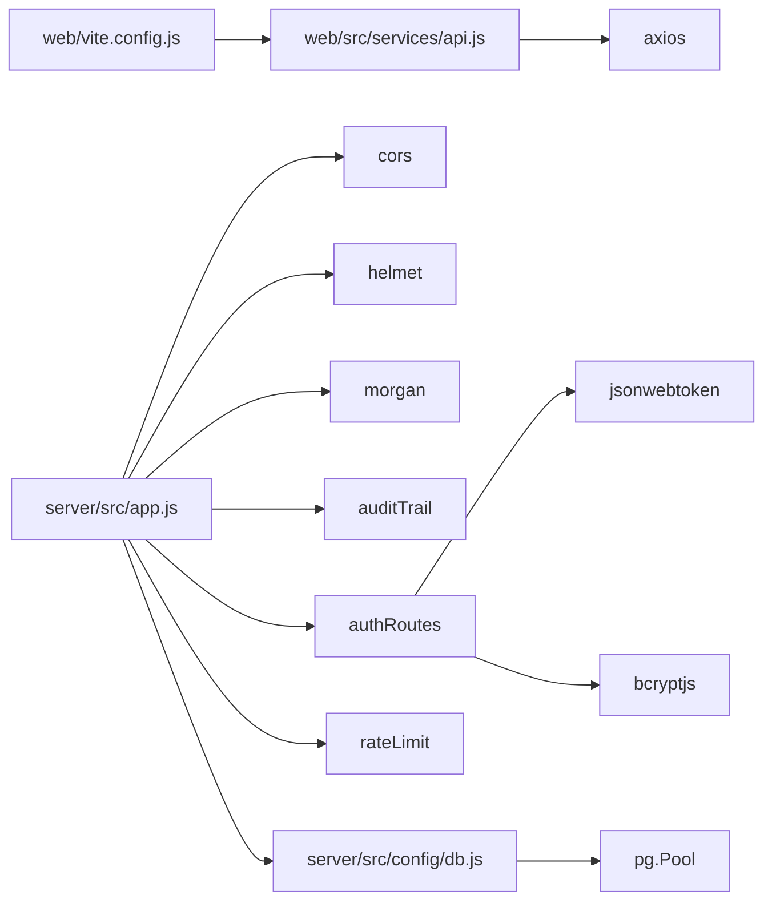

# 云平台部署

<cite>
**本文引用的文件**
- [DEPLOY_FREE.md](file://DEPLOY_FREE.md)
- [README.md](file://README.md)
- [server/package.json](file://server/package.json)
- [web/package.json](file://web/package.json)
- [server/src/app.js](file://server/src/app.js)
- [server/src/server.js](file://server/src/server.js)
- [server/src/config/db.js](file://server/src/config/db.js)
- [server/src/routes/authRoutes.js](file://server/src/routes/authRoutes.js)
- [server/src/middleware/auth.js](file://server/src/middleware/auth.js)
- [server/src/middleware/rateLimit.js](file://server/src/middleware/rateLimit.js)
- [web/vite.config.js](file://web/vite.config.js)
- [web/src/services/api.js](file://web/src/services/api.js)
- [server/database/schema.sql](file://server/database/schema.sql)
- [server/database/seed.sql](file://server/database/seed.sql)
- [server/Dockerfile](file://server/Dockerfile)
- [web/Dockerfile](file://web/Dockerfile)
</cite>

## 目录
1. [简介](#简介)
2. [项目结构](#项目结构)
3. [核心组件](#核心组件)
4. [架构总览](#架构总览)
5. [详细组件分析](#详细组件分析)
6. [依赖关系分析](#依赖关系分析)
7. [性能考虑](#性能考虑)
8. [故障排查指南](#故障排查指南)
9. [结论](#结论)
10. [附录](#附录)

## 简介
本指南面向希望在云平台上进行免费部署的团队或个人，基于仓库中的后端 Express API 与前端 Vue 应用，推荐使用 Render + Cloudflare Pages + Neon 的组合，实现快速上线与低成本运维。文档覆盖从数据库创建、后端 API 部署、前端静态站点部署，到环境变量配置、健康检查、CORS 与 HTTPS 设置、以及常见问题排查的全流程。

## 项目结构
项目采用前后端分离架构：
- 后端：Express 应用位于 server/，提供 REST API，使用 PostgreSQL 存储数据。
- 前端：Vue 3 应用位于 web/，通过 Vite 构建为静态资源，托管于 Cloudflare Pages。
- 数据库：PostgreSQL，推荐使用 Neon 提供的 Serverless Postgres。

图表来源
- [server/src/app.js:1-65](file://server/src/app.js#L1-L65)
- [web/vite.config.js:1-46](file://web/vite.config.js#L1-L46)

章节来源
- [README.md:22-29](file://README.md#L22-L29)
- [server/package.json:1-31](file://server/package.json#L1-L31)
- [web/package.json:1-34](file://web/package.json#L1-L34)

## 核心组件
- 后端 API（Express）
  - 路由集中注册，统一中间件处理安全头、跨域、日志与审计。
  - 健康检查端点用于部署后自检。
- 数据库（Neon Postgres）
  - 使用连接池，支持按连接字符串自动启用 SSL；提供启动时数据库连通性校验。
- 前端（Vue + Vite）
  - 本地开发代理至后端端口；生产环境通过环境变量注入 API 地址。
- 部署工具链
  - Render：Node 运行时，按根目录与构建命令部署。
  - Cloudflare Pages：Git 连接，自动构建与预览。
  - Dockerfile：本地或容器化部署参考。

章节来源
- [server/src/app.js:25-54](file://server/src/app.js#L25-L54)
- [server/src/server.js:13-25](file://server/src/server.js#L13-L25)
- [server/src/config/db.js:13-19](file://server/src/config/db.js#L13-L19)
- [web/vite.config.js:6-16](file://web/vite.config.js#L6-L16)
- [web/src/services/api.js:3-5](file://web/src/services/api.js#L3-L5)

## 架构总览
下图展示从浏览器到后端 API，再到数据库的整体调用路径与部署位置：

图表来源
- [web/src/services/api.js:8-24](file://web/src/services/api.js#L8-L24)
- [server/src/app.js:35-53](file://server/src/app.js#L35-L53)
- [server/src/config/db.js:15-19](file://server/src/config/db.js#L15-L19)

## 详细组件分析

### 后端 API 部署（Render Web Service）
- 服务类型与运行时
  - 服务类型：Web Service
  - 运行时：Node
  - 根目录：server
  - 构建命令：安装依赖
  - 启动命令：启动服务
- 环境变量
  - 必填：PORT、DATABASE_URL、JWT_SECRET、NODE_ENV
  - 可选：第三方平台同步相关环境变量
- 健康检查
  - 访问 /api/health 验证服务可用性
- 数据库连接
  - Render 上需确保 DATABASE_URL 包含 sslmode=require
  - 启动时进行数据库连通性校验，失败则退出进程

图表来源
- [DEPLOY_FREE.md:45-105](file://DEPLOY_FREE.md#L45-L105)
- [server/src/server.js:13-25](file://server/src/server.js#L13-L25)
- [server/src/config/db.js:15-19](file://server/src/config/db.js#L15-L19)

章节来源
- [DEPLOY_FREE.md:45-105](file://DEPLOY_FREE.md#L45-L105)
- [server/src/server.js:13-25](file://server/src/server.js#L13-L25)
- [server/src/config/db.js:15-19](file://server/src/config/db.js#L15-L19)

### 前端应用部署（Cloudflare Pages）
- 项目创建与连接
  - 在 Cloudflare 仪表盘创建 Pages 项目，连接当前仓库
  - 生产分支：main
  - 框架预设：Vue 或 None 均可
- 构建配置
  - 根目录：web
  - 构建命令：安装依赖并打包
  - 输出目录：dist
- 环境变量
  - VITE_API_URL：指向 Render API 的 /api 前缀地址
  - 生产与预览环境均需设置
- 注意事项
  - 若误用 Workers/Wrangler，应仅上传 dist 目录，避免上传 node_modules

图表来源
- [DEPLOY_FREE.md:129-177](file://DEPLOY_FREE.md#L129-L177)
- [web/package.json:6-11](file://web/package.json#L6-L11)
- [web/Dockerfile:1-19](file://web/Dockerfile#L1-L19)

章节来源
- [DEPLOY_FREE.md:129-177](file://DEPLOY_FREE.md#L129-L177)
- [web/package.json:6-11](file://web/package.json#L6-L11)

### 数据库（Neon Postgres）
- 创建与连接
  - 在 Neon 控制台创建项目，复制 DATABASE_URL
  - 保持 sslmode=require，避免明文传输
- 初始化
  - 首次部署后执行 schema.sql 与 seed.sql
  - 验证 users 表是否初始化成功
- 安全建议
  - 不要将真实 DATABASE_URL 提交至版本库
  - 如泄露，立即轮换密码

图表来源
- [DEPLOY_FREE.md:27-126](file://DEPLOY_FREE.md#L27-L126)
- [server/database/schema.sql:1-200](file://server/database/schema.sql#L1-L200)
- [server/database/seed.sql:1-114](file://server/database/seed.sql#L1-L114)

章节来源
- [DEPLOY_FREE.md:27-126](file://DEPLOY_FREE.md#L27-L126)
- [server/database/schema.sql:1-200](file://server/database/schema.sql#L1-L200)
- [server/database/seed.sql:1-114](file://server/database/seed.sql#L1-L114)

### 认证与授权（JWT）
- 登录流程
  - 前端提交邮箱与密码，后端验证并签发 JWT
  - 前端将 token 存入本地存储并在后续请求中携带
- 授权中间件
  - 校验 token 并加载用户信息，支持基于角色的访问控制
- 关键注意
  - JWT_SECRET 必须稳定，变更会导致所有旧 token 失效

图表来源
- [server/src/routes/authRoutes.js:17-64](file://server/src/routes/authRoutes.js#L17-L64)
- [server/src/middleware/auth.js:5-29](file://server/src/middleware/auth.js#L5-L29)

章节来源
- [server/src/routes/authRoutes.js:17-64](file://server/src/routes/authRoutes.js#L17-L64)
- [server/src/middleware/auth.js:5-29](file://server/src/middleware/auth.js#L5-L29)

### 路由与中间件概览
- 路由注册集中在 app.js，统一挂载基础中间件（安全头、跨域、日志、审计）
- 错误兜底中间件避免向客户端暴露内部错误细节
- 健康检查端点 /api/health 便于部署后快速验证

图表来源
- [server/src/app.js:25-65](file://server/src/app.js#L25-L65)
- [server/src/routes/authRoutes.js:8-72](file://server/src/routes/authRoutes.js#L8-L72)

章节来源
- [server/src/app.js:25-65](file://server/src/app.js#L25-L65)
- [server/src/routes/authRoutes.js:8-72](file://server/src/routes/authRoutes.js#L8-L72)

## 依赖关系分析
- 前端依赖 axios 与 @cloudflare/vite-plugin，通过 import.meta.env.VITE_API_URL 注入 API 地址
- 后端依赖 pg 连接池，根据连接字符串自动启用 SSL；启动时进行数据库连通性校验
- 速率限制中间件基于内存桶统计请求频率，防止暴力破解与滥用

图表来源
- [web/vite.config.js:4-7](file://web/vite.config.js#L4-L7)
- [web/src/services/api.js:1-45](file://web/src/services/api.js#L1-L45)
- [server/src/app.js:4-33](file://server/src/app.js#L4-L33)
- [server/src/middleware/rateLimit.js:9-35](file://server/src/middleware/rateLimit.js#L9-L35)
- [server/src/config/db.js:15-19](file://server/src/config/db.js#L15-L19)

章节来源
- [web/vite.config.js:4-7](file://web/vite.config.js#L4-L7)
- [web/src/services/api.js:1-45](file://web/src/services/api.js#L1-L45)
- [server/src/app.js:4-33](file://server/src/app.js#L4-L33)
- [server/src/middleware/rateLimit.js:9-35](file://server/src/middleware/rateLimit.js#L9-L35)
- [server/src/config/db.js:15-19](file://server/src/config/db.js#L15-L19)

## 性能考虑
- 冷启动
  - Render 免费层首次请求可能较慢，属于正常现象
- 数据库连接
  - 确保 DATABASE_URL 含 sslmode=require；必要时调整连接超时参数
- 前端构建
  - 使用 Vite 的分包策略减少首屏体积，提升加载速度

## 故障排查指南
- 401 未授权
  - 可能原因：JWT_SECRET 变更导致旧 token 失效
  - 处理：重新登录，保持 JWT_SECRET 稳定
- 404 /api/suppliers 或 /api/settings
  - 可能原因：部署失败或路由未正确挂载
  - 处理：检查 Render 最新部署状态，确认 app.js 中路由挂载
- 500 设置/供应商接口报错
  - 可能原因：数据库模式未初始化
  - 处理：重新执行 schema.sql
- 首次请求缓慢
  - 可能原因：Render 免费层冷启动
  - 处理：属正常现象，后续请求将更快
- 数据库连接失败
  - 可能原因：DATABASE_URL 缺少 sslmode=require 或连接串格式错误
  - 处理：核对 Neon 控制台提供的连接串，确保包含 sslmode=require

章节来源
- [DEPLOY_FREE.md:261-286](file://DEPLOY_FREE.md#L261-L286)
- [server/src/server.js:18-24](file://server/src/server.js#L18-L24)
- [server/src/config/db.js:3-11](file://server/src/config/db.js#L3-L11)

## 结论
通过 Render + Cloudflare Pages + Neon 的组合，可以以极低成本完成库存管理系统的免费部署。建议在部署前准备好数据库、后端与前端的环境变量，完成一次性的数据库初始化，并在部署完成后进行健康检查与功能验证。遇到问题时，优先检查 JWT_SECRET 稳定性、数据库连接串与路由挂载情况。

## 附录

### 部署检查清单
- 数据库
  - 在 Neon 创建项目并复制 DATABASE_URL
  - 在 Render 设置 DATABASE_URL（包含 sslmode=require）
  - 执行 schema.sql 与 seed.sql
- 后端 API（Render）
  - 选择 Web Service，连接 GitHub，设置根目录为 server
  - 设置构建命令与启动命令
  - 添加环境变量：PORT、DATABASE_URL、JWT_SECRET、NODE_ENV
  - 访问 /api/health 验证服务
- 前端（Cloudflare Pages）
  - 创建 Pages 项目，连接仓库，设置根目录为 web
  - 设置构建命令与输出目录
  - 设置环境变量 VITE_API_URL 指向 Render API 的 /api
- 验证
  - 使用默认测试账号登录，验证仪表盘、供应商、设置等页面
- 安全加固（可选）
  - 更改默认种子密码
  - 根据需要限制 CORS
  - 仅在必要时轮换 JWT_SECRET（会强制用户重新登录）

章节来源
- [DEPLOY_FREE.md:16-293](file://DEPLOY_FREE.md#L16-L293)