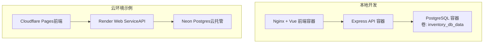
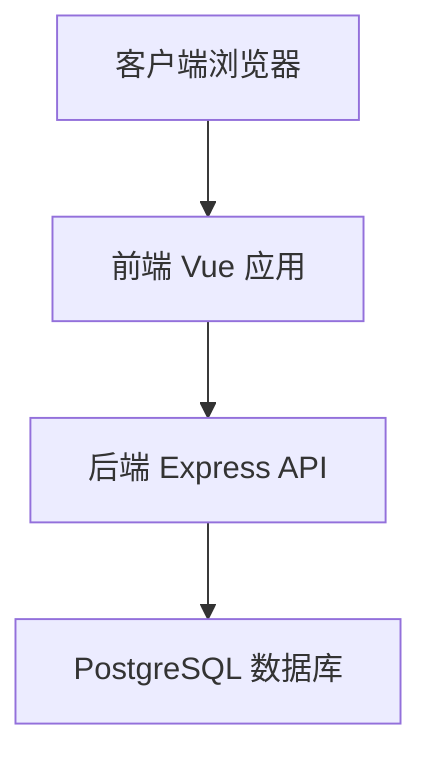
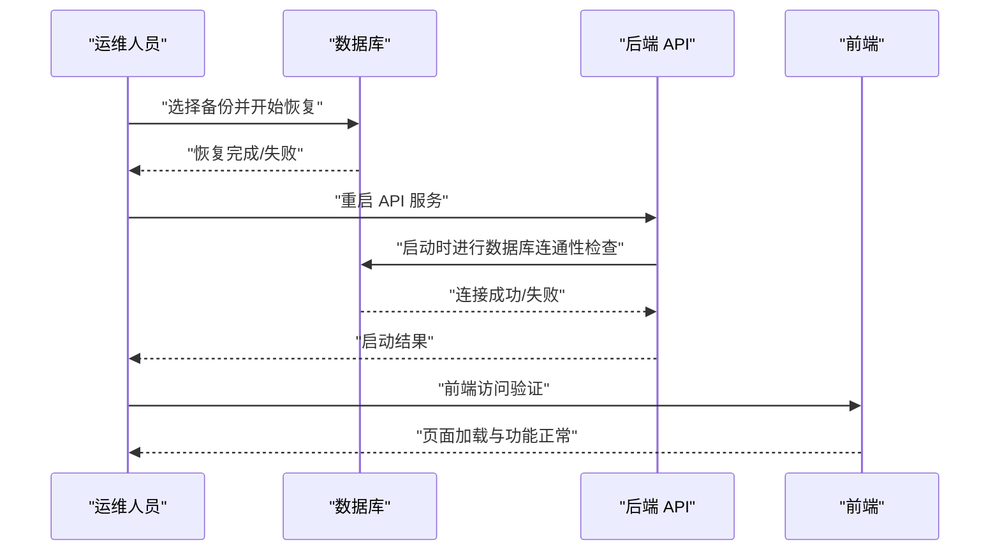
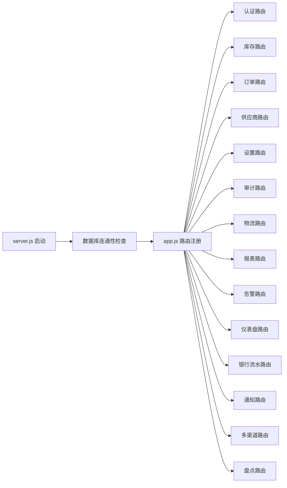

# 备份恢复

<cite>
**本文引用的文件**
- [README.md](file://README.md)
- [DEPLOY_FREE.md](file://DEPLOY_FREE.md)
- [docker-compose.yml](file://docker-compose.yml)
- [server/src/config/db.js](file://server/src/config/db.js)
- [server/src/server.js](file://server/src/server.js)
- [server/src/app.js](file://server/src/app.js)
- [server/package.json](file://server/package.json)
- [server/database/schema.sql](file://server/database/schema.sql)
- [server/database/seed.sql](file://server/database/seed.sql)
- [server/database/migrations/001_add_multi_tenant.sql](file://server/database/migrations/001_add_multi_tenant.sql)
- [server/database/migrations/002_fix_unique_constraints.sql](file://server/database/migrations/002_fix_unique_constraints.sql)
</cite>

## 目录
1. [简介](#简介)
2. [项目结构](#项目结构)
3. [核心组件](#核心组件)
4. [架构总览](#架构总览)
5. [详细组件分析](#详细组件分析)
6. [依赖关系分析](#依赖关系分析)
7. [性能考量](#性能考量)
8. [故障排查指南](#故障排查指南)
9. [结论](#结论)
10. [附录](#附录)

## 简介
本文件面向库存管理系统，提供一套完整的数据备份与灾难恢复策略，覆盖数据库备份的重要性、备份计划与增量策略、备份存储位置选择（本地/云/异地）、备份验证与测试流程、灾难恢复流程与恢复操作指南、备份自动化脚本与调度建议，以及备份恢复演练方法。目标是在系统故障、数据损坏或业务中断情况下，快速、可靠地恢复服务与数据，保障业务连续性。

## 项目结构
系统由三部分组成：数据库（PostgreSQL）、后端 API（Express）与前端（Vue）。数据库通过卷挂载持久化，后端通过连接字符串读取数据库凭据；部署支持本地 Docker Compose 与云端平台（示例使用 Render + Neon）。

图示来源
- [docker-compose.yml:1-57](file://docker-compose.yml#L1-L57)
- [DEPLOY_FREE.md:10-12](file://DEPLOY_FREE.md#L10-L12)
- [DEPLOY_FREE.md:45-105](file://DEPLOY_FREE.md#L45-L105)

章节来源
- [README.md:22-105](file://README.md#L22-L105)
- [docker-compose.yml:1-57](file://docker-compose.yml#L1-L57)
- [DEPLOY_FREE.md:10-12](file://DEPLOY_FREE.md#L10-L12)

## 核心组件
- 数据库层：PostgreSQL，使用卷进行数据持久化；支持本地 Docker 卷与云托管（Neon）两种形态。
- 应用层：Express API，负责业务逻辑与数据库交互；启动时进行数据库连通性校验。
- 前端层：Vue 应用，通过 API 提供库存管理界面。
- 配置与连接：后端通过连接字符串读取数据库信息，自动根据连接串与环境变量决定是否启用 SSL、超时等参数。

章节来源
- [server/src/config/db.js:1-29](file://server/src/config/db.js#L1-L29)
- [server/src/server.js:1-28](file://server/src/server.js#L1-L28)
- [server/src/app.js:1-91](file://server/src/app.js#L1-L91)
- [docker-compose.yml:12-15](file://docker-compose.yml#L12-L15)
- [DEPLOY_FREE.md:32-36](file://DEPLOY_FREE.md#L32-L36)

## 架构总览
系统采用三层架构：前端、后端、数据库。数据库可运行于本地 Docker 卷或云托管（Neon），API 通过连接字符串与数据库通信，并在启动阶段进行健康检查以确保数据库可用。

图示来源
- [server/src/app.js:64-79](file://server/src/app.js#L64-L79)
- [server/src/config/db.js:17-23](file://server/src/config/db.js#L17-L23)
- [server/src/server.js:13-25](file://server/src/server.js#L13-L25)

## 详细组件分析

### 数据库备份策略
- 备份类型
  - 全量备份：周期性生成完整数据库快照，作为基准点。
  - 增量备份：基于 WAL 日志或时间点恢复（PITR），缩短 RPO/RTO。
- 备份频率
  - 生产环境建议：每日全量 + 每小时增量（或每 15 分钟增量），结合归档日志。
  - 测试/演示环境：每日全量即可。
- 备份窗口与停机
  - 使用在线备份工具（如物理备份或逻辑备份）尽量避免停机；对需要锁表的场景安排低峰时段。
- 备份保留与轮转
  - 保留最近 N 个全量与 M 个增量，定期清理过期备份，控制成本与存储空间。
- 备份加密与传输
  - 本地与云存储均应启用传输与静态加密；对异地备份进行加密与完整性校验。
- 备份验证与测试
  - 定期进行还原演练（还原到临时实例），验证备份集的可恢复性与一致性。

章节来源
- [server/database/schema.sql:1-447](file://server/database/schema.sql#L1-L447)
- [server/database/seed.sql:1-114](file://server/database/seed.sql#L1-L114)
- [server/database/migrations/001_add_multi_tenant.sql:1-100](file://server/database/migrations/001_add_multi_tenant.sql#L1-L100)
- [server/database/migrations/002_fix_unique_constraints.sql:1-44](file://server/database/migrations/002_fix_unique_constraints.sql#L1-L44)

### 备份存储位置与异地策略
- 本地存储
  - 适合小规模或开发测试环境；需配合 RAID、UPS 与定期外拷贝。
- 云存储
  - 推荐使用对象存储（如 S3、Cloudflare R2、Azure Blob）存放备份文件；便于自动化与长期保留。
- 异地备份
  - 将备份复制到不同地理区域或不同云厂商，降低区域性灾难风险。
- 存储分层
  - 热备：近期全量与频繁增量，用于快速恢复。
  - 冷备：长期归档，按需恢复。

章节来源
- [DEPLOY_FREE.md:10-12](file://DEPLOY_FREE.md#L10-L12)
- [docker-compose.yml:12-15](file://docker-compose.yml#L12-L15)

### 备份验证与测试流程
- 验证清单
  - 备份文件完整性校验（哈希/签名）。
  - 备份链路可用性测试（下载/解压/导入）。
  - 时间点恢复（PITR）验证，确保能恢复到指定时间。
- 测试步骤
  - 在隔离环境中还原备份，运行关键查询与报表，核对数据一致性。
  - 执行恢复演练（模拟故障），记录恢复时间与问题点，持续优化流程。
- 文档与审计
  - 记录每次验证与演练结果，形成可追溯的审计日志。

章节来源
- [server/src/server.js:18-24](file://server/src/server.js#L18-L24)
- [server/src/app.js:60-62](file://server/src/app.js#L60-L62)

### 灾难恢复流程
- 故障识别
  - 数据库不可达、连接超时、健康检查失败、关键表损坏等。
- 触发条件
  - 自动告警（数据库/应用健康检查）或人工巡检发现异常。
- 恢复优先级
  - 业务影响最小化：优先恢复核心表（产品、库存、订单、用户）。
- 恢复步骤
  - 评估故障范围与数据丢失程度，选择最近可用备份。
  - 在隔离环境验证备份有效性后，进行生产恢复。
  - 恢复完成后进行功能与数据一致性验证。
- 业务连续性
  - 通过异地多活或热备节点，缩短 RTO；通过多副本与自动切换机制提升可用性。

章节来源
- [server/src/server.js:6-11](file://server/src/server.js#L6-L11)
- [server/src/server.js:18-24](file://server/src/server.js#L18-L24)
- [server/src/config/db.js:3-15](file://server/src/config/db.js#L3-L15)

### 恢复操作指南
- 数据库恢复
  - 本地 Docker：停止服务，替换或恢复卷内数据，重启服务。
  - 云托管（Neon）：通过云控制台或 CLI 执行恢复操作，或使用 PITR。
- 应用重启
  - 后端服务启动前进行数据库连通性检查；若失败则终止启动，避免雪崩。
- 数据一致性检查
  - 执行关键查询（如用户数、商品数、库存总量）与报表核对。
  - 对比审计日志与关键业务指标，确保无数据偏差。

图示来源
- [server/src/server.js:13-25](file://server/src/server.js#L13-L25)
- [server/src/app.js:60-62](file://server/src/app.js#L60-L62)

章节来源
- [docker-compose.yml:12-15](file://docker-compose.yml#L12-L15)
- [DEPLOY_FREE.md:108-126](file://DEPLOY_FREE.md#L108-L126)
- [server/src/server.js:18-24](file://server/src/server.js#L18-L24)

### 备份自动化脚本与调度
- 脚本建议
  - 全量备份：使用逻辑导出（如自定义 SQL 或 pg_dump）或物理备份工具。
  - 增量备份：开启 WAL 归档，结合时间点恢复（PITR）。
  - 传输与加密：备份完成后压缩并加密，上传至对象存储。
- 调度策略
  - Cron/定时任务：每日全量 + 小时级增量；或按业务低峰时段执行。
  - 云平台：利用云厂商的备份服务与自动化任务。
- 监控与告警
  - 备份任务执行状态监控、失败告警、存储配额预警。
- 可靠性增强
  - 多副本与多地域备份；定期进行恢复演练与交叉验证。

章节来源
- [server/package.json:6-10](file://server/package.json#L6-L10)
- [server/src/config/db.js:17-23](file://server/src/config/db.js#L17-L23)

### 备份恢复测试与演练
- 测试内容
  - 完整备份链路测试（导出 -> 传输 -> 存储 -> 下载 -> 还原）。
  - 时间点恢复（PITR）测试，验证能否恢复到指定时间。
  - 数据一致性核对（关键表计数、抽样数据对比）。
- 演练频率
  - 至少每季度进行一次完整演练；重大变更前后增加演练。
- 演练记录
  - 记录演练过程、耗时、问题与改进项，持续优化恢复方案。

章节来源
- [server/src/server.js:18-24](file://server/src/server.js#L18-L24)
- [server/src/app.js:60-62](file://server/src/app.js#L60-L62)

## 依赖关系分析
- 后端依赖数据库连接池；启动时进行数据库连通性检查，失败则拒绝启动。
- 健康检查接口用于外部探测服务可用性。
- Docker Compose 将数据库初始化脚本挂载到容器，实现首次启动自动建模与种子数据注入。

图示来源
- [server/src/app.js:64-79](file://server/src/app.js#L64-L79)
- [server/src/server.js:13-25](file://server/src/server.js#L13-L25)

章节来源
- [server/src/app.js:1-91](file://server/src/app.js#L1-L91)
- [server/src/server.js:1-28](file://server/src/server.js#L1-L28)
- [docker-compose.yml:14-15](file://docker-compose.yml#L14-L15)

## 性能考量
- 备份性能
  - 选择合适的并发度与压缩级别；避免在业务高峰期执行全量备份。
  - 使用并行导出与增量备份，缩短备份窗口。
- 恢复性能
  - 预热与并行还原；在隔离环境提前验证恢复速度。
- 连接与超时
  - 合理设置数据库连接超时与 SSL 参数，确保启动阶段的连通性检查稳定。

章节来源
- [server/src/config/db.js:3-15](file://server/src/config/db.js#L3-L15)
- [server/src/config/db.js:22-23](file://server/src/config/db.js#L22-L23)

## 故障排查指南
- 启动失败（数据库连接超时）
  - 检查连接字符串、网络连通性、SSL 设置与超时配置。
  - 查看健康检查日志，确认数据库服务状态。
- 健康检查失败
  - 确认数据库已初始化（schema/seed/migrations）。
  - 核对环境变量与容器依赖顺序。
- 云环境（Neon）
  - 确保连接串包含 SSL 要求参数；检查密钥与权限。
- 数据不一致
  - 执行一致性校验查询；必要时回滚到上一个可用备份。

章节来源
- [server/src/server.js:6-11](file://server/src/server.js#L6-L11)
- [server/src/server.js:18-24](file://server/src/server.js#L18-L24)
- [server/src/config/db.js:3-15](file://server/src/config/db.js#L3-L15)
- [DEPLOY_FREE.md:84-91](file://DEPLOY_FREE.md#L84-L91)
- [README.md:108-105](file://README.md#L104-L105)

## 结论
通过制定全量与增量备份策略、合理选择存储位置（本地/云/异地）、建立严格的备份验证与测试流程、明确灾难恢复步骤与自动化调度，库存管理系统可以在面对数据库故障、数据损坏与业务中断时，实现快速、可靠的恢复，保障业务连续性。建议将备份恢复纳入日常运维与变更流程，持续优化恢复时间与数据一致性。

## 附录
- 关键文件路径与用途
  - [server/src/config/db.js]：数据库连接池与 SSL/超时配置
  - [server/src/server.js]：启动时数据库连通性检查
  - [server/src/app.js]：健康检查接口与路由注册
  - [docker-compose.yml]：本地数据库卷与初始化脚本挂载
  - [server/database/schema.sql]：数据库结构定义
  - [server/database/seed.sql]：种子数据
  - [server/database/migrations/001_add_multi_tenant.sql]：多租户改造与唯一约束调整
  - [server/database/migrations/002_fix_unique_constraints.sql]：唯一约束补丁
  - [DEPLOY_FREE.md]：云部署与数据库初始化说明
  - [README.md]：项目结构与本地启动说明

章节来源
- [server/src/config/db.js:1-29](file://server/src/config/db.js#L1-L29)
- [server/src/server.js:1-28](file://server/src/server.js#L1-L28)
- [server/src/app.js:1-91](file://server/src/app.js#L1-L91)
- [docker-compose.yml:1-57](file://docker-compose.yml#L1-L57)
- [server/database/schema.sql:1-447](file://server/database/schema.sql#L1-L447)
- [server/database/seed.sql:1-114](file://server/database/seed.sql#L1-L114)
- [server/database/migrations/001_add_multi_tenant.sql:1-100](file://server/database/migrations/001_add_multi_tenant.sql#L1-L100)
- [server/database/migrations/002_fix_unique_constraints.sql:1-44](file://server/database/migrations/002_fix_unique_constraints.sql#L1-L44)
- [DEPLOY_FREE.md:108-126](file://DEPLOY_FREE.md#L108-L126)
- [README.md:31-105](file://README.md#L31-L105)