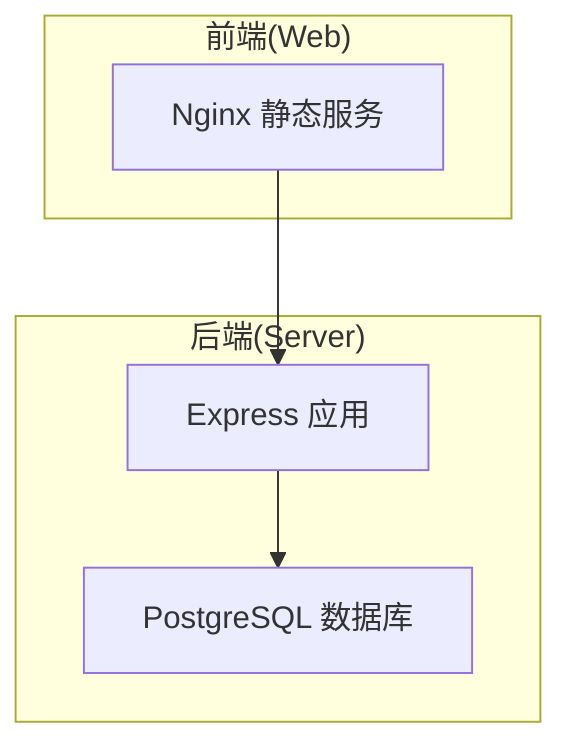
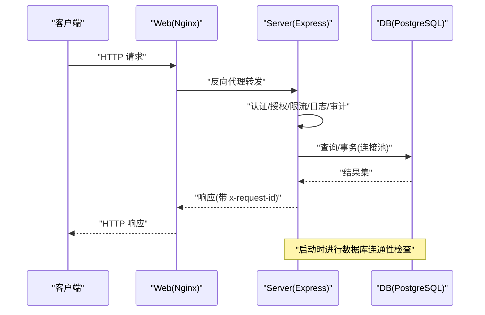
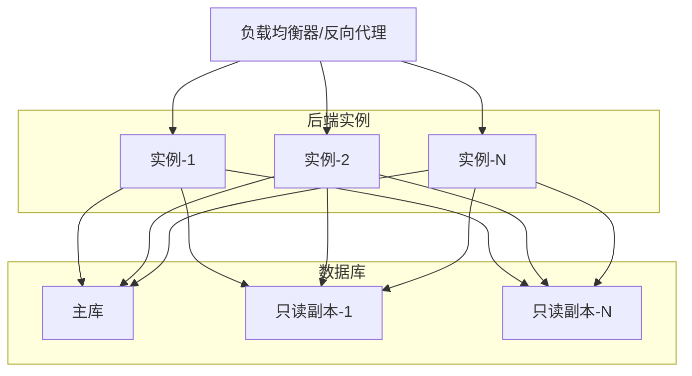
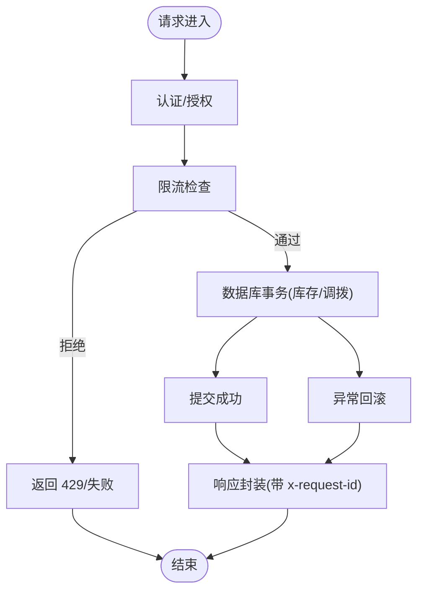
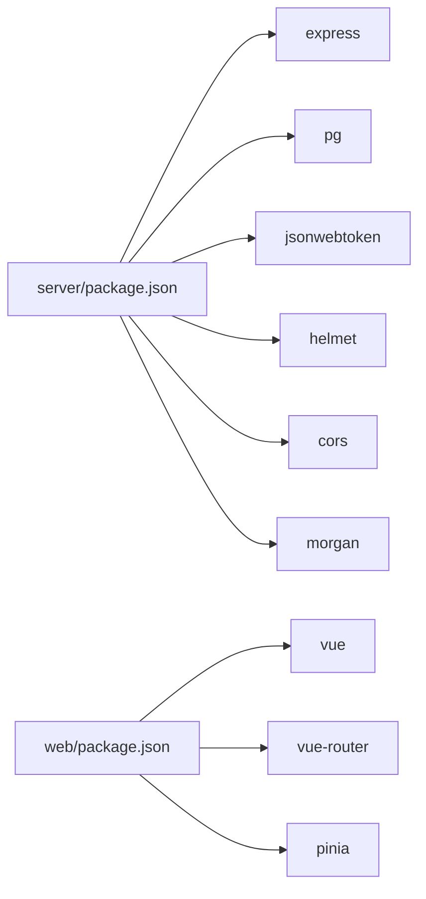
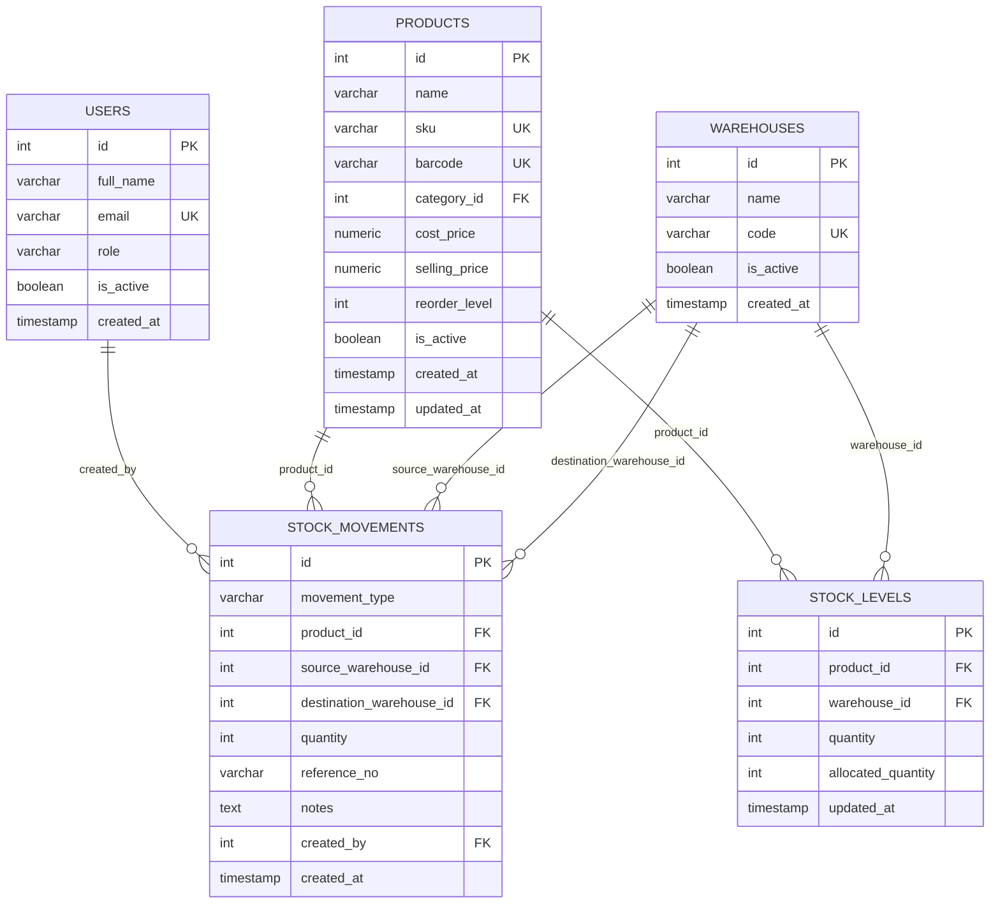

# 扩展策略

<cite>
**本文引用的文件**
- [server/src/app.js](file://server/src/app.js)
- [server/src/server.js](file://server/src/server.js)
- [server/src/config/db.js](file://server/src/config/db.js)
- [server/src/routes/inventoryRoutes.js](file://server/src/routes/inventoryRoutes.js)
- [server/src/utils/inventoryService.js](file://server/src/utils/inventoryService.js)
- [server/src/middleware/rateLimit.js](file://server/src/middleware/rateLimit.js)
- [server/src/middleware/auth.js](file://server/src/middleware/auth.js)
- [server/src/middleware/response.js](file://server/src/middleware/response.js)
- [server/src/utils/pagination.js](file://server/src/utils/pagination.js)
- [server/database/schema.sql](file://server/database/schema.sql)
- [server/database/seed.sql](file://server/database/seed.sql)
- [docker-compose.yml](file://docker-compose.yml)
- [server/Dockerfile](file://server/Dockerfile)
- [web/Dockerfile](file://web/Dockerfile)
- [server/package.json](file://server/package.json)
- [web/package.json](file://web/package.json)
</cite>

## 目录
1. [引言](#引言)
2. [项目结构](#项目结构)
3. [核心组件](#核心组件)
4. [架构总览](#架构总览)
5. [详细组件分析](#详细组件分析)
6. [依赖关系分析](#依赖关系分析)
7. [性能考量](#性能考量)
8. [故障排查指南](#故障排查指南)
9. [结论](#结论)
10. [附录](#附录)

## 引言
本文件面向库存管理系统，提供一套可落地的扩展策略文档，覆盖水平扩展（多实例、负载均衡、读写分离）、垂直扩展（硬件与容器资源扩容、数据库优化）、容器编排（Kubernetes 部署与自动扩缩容）、数据库扩展（主从复制、分片与缓存层）、性能基准测试方法、成本优化策略，以及扩展过程中的数据一致性与服务可用性保障措施。同时给出扩展前准备与风险评估建议，确保平滑过渡。

## 项目结构
系统采用前后端分离架构：
- 后端基于 Express，使用 PostgreSQL 作为持久化存储；通过连接池与超时控制保障启动与运行稳定性。
- 前端为 Vue 单页应用，构建后由 Nginx 提供静态托管。
- 使用 Docker Compose 进行本地开发与演示部署，便于后续迁移到 Kubernetes。

图表来源
- [docker-compose.yml:1-57](file://docker-compose.yml#L1-L57)
- [server/src/app.js:26-80](file://server/src/app.js#L26-L80)
- [server/src/config/db.js:17-28](file://server/src/config/db.js#L17-L28)

章节来源
- [docker-compose.yml:1-57](file://docker-compose.yml#L1-L57)
- [server/src/app.js:1-91](file://server/src/app.js#L1-L91)
- [server/src/config/db.js:1-29](file://server/src/config/db.js#L1-L29)

## 核心组件
- 应用入口与中间件：统一安全头、CORS、日志、审计、响应包装与兜底错误处理。
- 认证与授权：JWT 校验、租户上下文注入、角色授权。
- 限流中间件：基于内存桶的简单限流，便于在扩展前保护系统。
- 数据库连接：PostgreSQL 连接池与 SSL 控制、启动超时检测。
- 库存路由与事务：库存增减与调拨均在单事务内执行，保证一致性。
- 分页与成本访问：统一分页参数与成本字段可见性控制。

章节来源
- [server/src/app.js:26-88](file://server/src/app.js#L26-L88)
- [server/src/middleware/auth.js:5-61](file://server/src/middleware/auth.js#L5-L61)
- [server/src/middleware/rateLimit.js:9-35](file://server/src/middleware/rateLimit.js#L9-L35)
- [server/src/config/db.js:17-28](file://server/src/config/db.js#L17-L28)
- [server/src/routes/inventoryRoutes.js:237-437](file://server/src/routes/inventoryRoutes.js#L237-L437)
- [server/src/utils/inventoryService.js:1-46](file://server/src/utils/inventoryService.js#L1-L46)
- [server/src/utils/pagination.js:1-28](file://server/src/utils/pagination.js#L1-L28)

## 架构总览
下图展示从客户端到后端 API，再到数据库的典型请求链路，以及健康检查与启动流程。

图表来源
- [server/src/server.js:13-25](file://server/src/server.js#L13-L25)
- [server/src/app.js:47-58](file://server/src/app.js#L47-L58)
- [server/src/config/db.js:17-28](file://server/src/config/db.js#L17-L28)

## 详细组件分析

### 水平扩展：多实例、负载均衡与读写分离
- 多实例部署
  - 后端以无状态方式提供 API，可在多副本之间横向扩展。
  - 建议将应用容器镜像推送到镜像仓库，并在编排平台（如 Kubernetes）中以 Deployment 管理副本数。
- 负载均衡
  - 前端 Nginx 或反向代理作为入口，将流量分发至多个后端实例。
  - 健康检查可基于后端提供的健康端点。
- 读写分离
  - 将只读查询（如库存列表、交易流水）路由到只读副本，写操作（库存增减、调拨）路由到主库。
  - 可通过数据库连接字符串或中间件路由实现读写分流；注意事务内读写一致性。

图表来源
- [server/src/app.js:60-62](file://server/src/app.js#L60-L62)
- [server/src/config/db.js:17-28](file://server/src/config/db.js#L17-L28)

章节来源
- [server/src/app.js:60-62](file://server/src/app.js#L60-L62)
- [server/src/config/db.js:17-28](file://server/src/config/db.js#L17-L28)

### 垂直扩展：硬件与容器资源、数据库优化
- 硬件资源增加
  - CPU/内存：根据峰值 QPS 与平均响应时间评估；结合容器资源限制与请求（requests/limits）进行调整。
- 容器资源配置
  - 为后端与数据库设置合理的 requests/limits；开启水平自动扩缩容（HPA）以应对突发流量。
- 数据库性能优化
  - 索引优化：对高频过滤与排序列建立索引（如库存移动时间、订单状态等）。
  - 连接池参数：根据并发与慢查询情况调整最大连接数、空闲连接与超时。
  - 查询优化：使用 EXPLAIN 分析慢查询，拆分复杂联表查询，必要时引入物化视图或汇总表。

章节来源
- [server/database/schema.sql:410-447](file://server/database/schema.sql#L410-L447)
- [server/src/config/db.js:17-28](file://server/src/config/db.js#L17-L28)

### 容器编排：Kubernetes 部署、自动扩缩容与资源调度
- 集群部署
  - 后端：Deployment + Service；前端：Deployment + Service/Nginx Ingress。
  - 数据库：StatefulSet + PVC；使用初始化容器加载 schema/seed。
- 自动扩缩容
  - HPA：基于 CPU/内存或自定义指标（QPS、队列长度、响应时间）触发扩缩容。
  - VPA：动态调整 requests/limits，提升资源利用率。
- 资源调度
  - PodDisruptionBudget 保障最小可用副本；亲和性与反亲和性避免热点集中。
  - 将数据库与应用置于同一节点或同可用区，降低网络延迟。

章节来源
- [docker-compose.yml:1-57](file://docker-compose.yml#L1-L57)
- [server/Dockerfile:1-13](file://server/Dockerfile#L1-L13)
- [web/Dockerfile:1-19](file://web/Dockerfile#L1-L19)

### 数据库扩展：主从复制、分片与缓存层
- 主从复制
  - 读写分离基础上，使用主从复制提升读扩展能力；写入主库，读取从库。
  - 注意 GTID/时间戳同步与延迟监控，避免“过期读”。
- 分片
  - 按租户 ID 或仓库 ID 进行水平分片，减少单表规模与锁竞争。
  - 分片键选择需结合查询模式，避免跨分片聚合。
- 缓存层
  - Redis/Memcached 缓存热点数据（如产品信息、价格规则、低库存告警状态）。
  - 写穿/回写策略：写主库时更新缓存；读多写少场景可采用读缓存命中率优化。

章节来源
- [server/database/schema.sql:125-133](file://server/database/schema.sql#L125-L133)
- [server/src/routes/inventoryRoutes.js:18-156](file://server/src/routes/inventoryRoutes.js#L18-L156)

### 性能基准测试：方法与工具
- 基准测试目标
  - 确定单实例吞吐上限（TPS/QPS）、95/99 延迟阈值、CPU/内存/IO 使用率拐点。
- 测试方法
  - 场景设计：登录、库存列表、库存增减、调拨、报表导出等。
  - 工具选择：k6/JMeter/Locust；压测平台（如 K6 Cloud）便于规模化。
  - 指标采集：系统指标（CPU/内存/IO）、应用指标（QPS/延迟/错误率）、数据库指标（连接数/慢查询/锁等待）。
- 扩展阈值
  - 观察指标首次出现瓶颈的阈值，结合成本与 SLA 设定扩展触发条件。

章节来源
- [server/src/middleware/rateLimit.js:9-35](file://server/src/middleware/rateLimit.js#L9-L35)
- [server/src/utils/pagination.js:1-28](file://server/src/utils/pagination.js#L1-L28)

### 成本优化：资源利用率、按需与预留
- 资源利用率监控
  - 持续监控 CPU/内存/IO 利用率与 P95 延迟，识别资源浪费与瓶颈。
- 按需付费
  - 将非关键任务迁移至 Spot/ECS Fargate/Azure Spot，降低计算成本。
- 预留实例
  - 对核心数据库与关键后端实例使用预留/节省计划，平衡成本与弹性。
- 缓存与异步
  - 引入缓存与消息队列（如 Kafka/RabbitMQ）削峰填谷，降低瞬时资源峰值。

章节来源
- [server/src/config/db.js:17-28](file://server/src/config/db.js#L17-L28)

### 数据一致性与服务可用性保障
- 数据一致性
  - 关键业务（库存增减/调拨）使用数据库事务，确保原子性与一致性。
  - 通过幂等设计（如唯一约束、去重逻辑）避免重复写入。
- 服务可用性
  - 健康检查：后端提供健康端点；数据库健康检查通过连通性探测。
  - 限流与熔断：在高并发场景启用限流与降级策略，避免级联故障。
  - 多副本与滚动升级：配合 PDB 与就绪探针，确保升级期间服务不中断。

图表来源
- [server/src/middleware/auth.js:5-61](file://server/src/middleware/auth.js#L5-L61)
- [server/src/middleware/rateLimit.js:9-35](file://server/src/middleware/rateLimit.js#L9-L35)
- [server/src/routes/inventoryRoutes.js:237-437](file://server/src/routes/inventoryRoutes.js#L237-L437)
- [server/src/middleware/response.js:36-54](file://server/src/middleware/response.js#L36-L54)

章节来源
- [server/src/routes/inventoryRoutes.js:237-437](file://server/src/routes/inventoryRoutes.js#L237-L437)
- [server/src/middleware/response.js:36-54](file://server/src/middleware/response.js#L36-L54)

### 扩展前准备与风险评估
- 准备工作
  - 明确扩展目标（吞吐/延迟/成本），制定基线与阈值。
  - 完成数据库索引与查询优化，清理冗余数据。
  - 建立监控告警（SLO/SLI），完善日志与追踪（x-request-id）。
- 风险评估
  - 水平扩展：副本间状态不一致、会话粘性问题；需验证限流与缓存策略。
  - 垂直扩展：资源争用导致抖动；需设置合理的 requests/limits 与 HPA。
  - 数据库扩展：主从延迟、分片路由错误；需加强一致性与可观测性。
- 过渡策略
  - 渐进式扩容：先加副本/副本数，再引入缓存与只读副本，最后分片。
  - 回滚预案：版本化配置与金丝雀发布，保留快速回退路径。

章节来源
- [server/src/app.js:47-58](file://server/src/app.js#L47-L58)
- [server/src/server.js:13-25](file://server/src/server.js#L13-L25)

## 依赖关系分析
- 后端依赖
  - Express 提供 Web 框架；pg 提供连接池；helmet/cors/morgan 提升安全性与可观测性。
  - 中间件链：认证 → 授权 → 限流 → 日志/审计 → 响应包装 → 路由。
- 数据库依赖
  - schema 定义了核心表与索引；seed 提供初始数据；inventory 路由与事务依赖这些表结构。

图表来源
- [server/package.json:15-29](file://server/package.json#L15-L29)
- [web/package.json:12-33](file://web/package.json#L12-L33)

章节来源
- [server/package.json:15-29](file://server/package.json#L15-L29)
- [web/package.json:12-33](file://web/package.json#L12-L33)

## 性能考量
- 启动与连接
  - 启动阶段进行数据库连通性检查，超时即终止进程，避免僵尸进程。
- 查询与事务
  - 列表与流水接口采用分页与并行查询，降低单次请求耗时。
  - 库存变更在单事务内完成，确保强一致。
- 中间件与响应
  - 统一响应包装与请求 ID，便于定位问题与统计指标。

章节来源
- [server/src/server.js:13-25](file://server/src/server.js#L13-L25)
- [server/src/utils/pagination.js:1-28](file://server/src/utils/pagination.js#L1-L28)
- [server/src/middleware/response.js:36-54](file://server/src/middleware/response.js#L36-L54)

## 故障排查指南
- 健康检查
  - 使用健康端点确认服务存活；结合数据库健康检查判断依赖可用性。
- 错误处理
  - 统一错误响应格式，包含请求 ID，便于前端与运维定位。
- 限流与熔断
  - 当达到限流阈值时，返回明确的重试时机提示；必要时降级非关键功能。
- 日志与审计
  - 开启 Morgan 日志；审计中间件记录关键操作；结合 x-request-id 追踪请求链路。

章节来源
- [server/src/app.js:60-62](file://server/src/app.js#L60-L62)
- [server/src/middleware/response.js:36-54](file://server/src/middleware/response.js#L36-L54)
- [server/src/middleware/rateLimit.js:9-35](file://server/src/middleware/rateLimit.js#L9-L35)
- [server/src/middleware/auditTrail.js](file://server/src/middleware/auditTrail.js)

## 结论
通过水平扩展（多实例+负载均衡+读写分离）、垂直扩展（资源扩容+数据库优化）、容器编排（K8s+HPA/VPA）、数据库扩展（主从+分片+缓存）与完善的性能基准测试，可有效支撑业务增长。同时，借助统一响应、健康检查、限流与审计等机制，保障扩展过程中的数据一致性和服务可用性，并通过成本优化策略实现资源高效利用。

## 附录
- 数据模型概览（库存相关）

图表来源
- [server/database/schema.sql:22-248](file://server/database/schema.sql#L22-L248)

章节来源
- [server/database/schema.sql:22-248](file://server/database/schema.sql#L22-L248)
- [server/database/seed.sql:1-114](file://server/database/seed.sql#L1-L114)