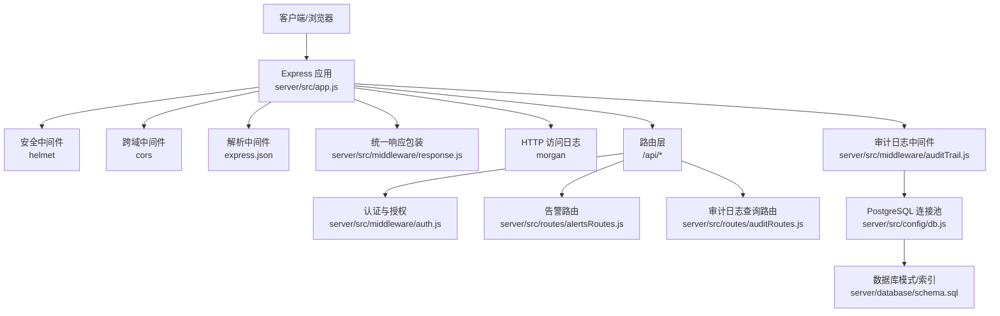
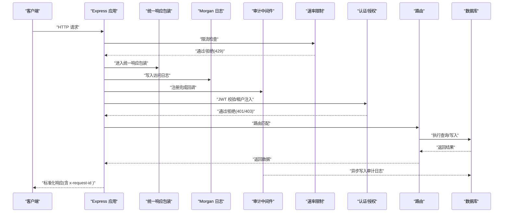
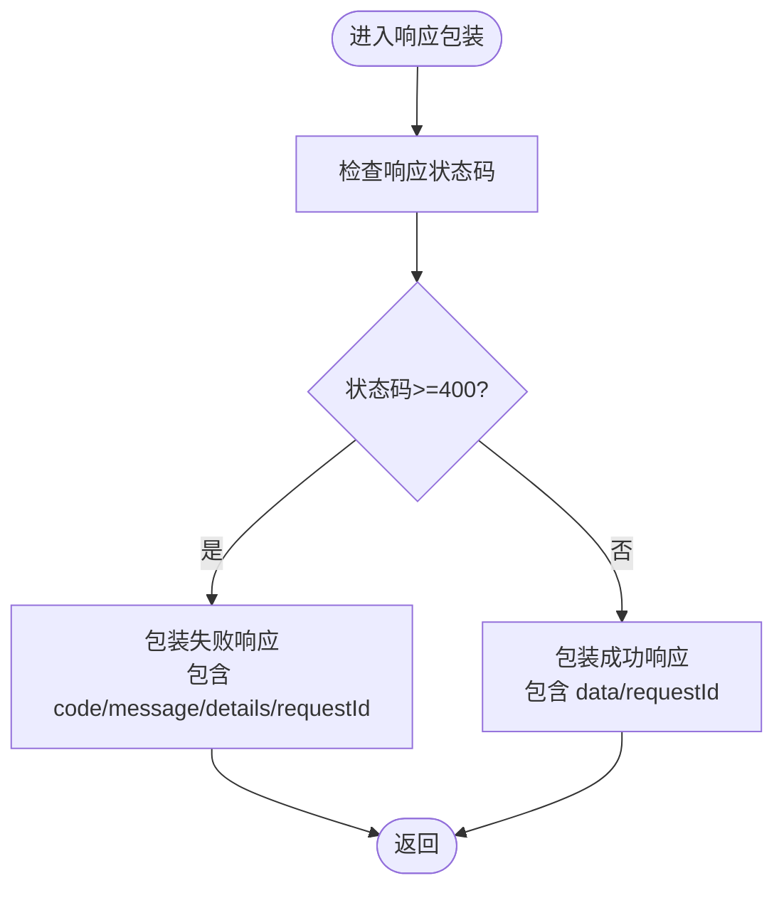
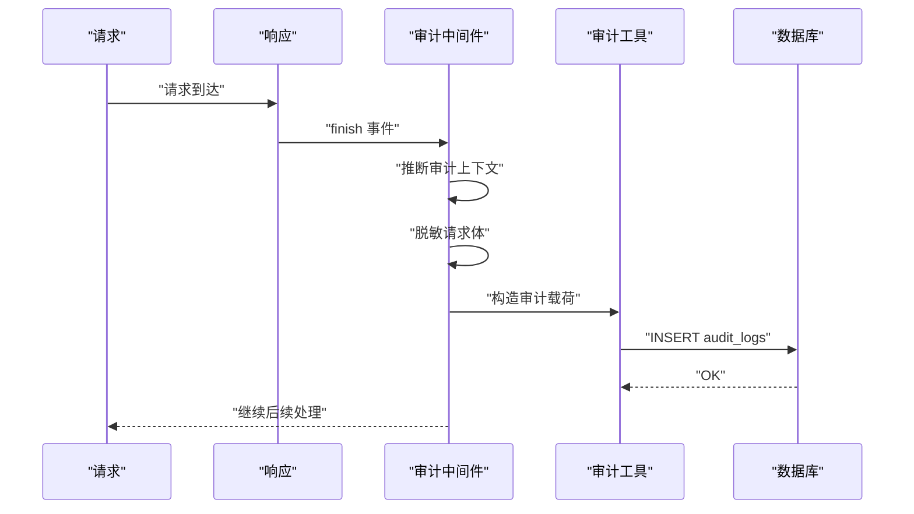
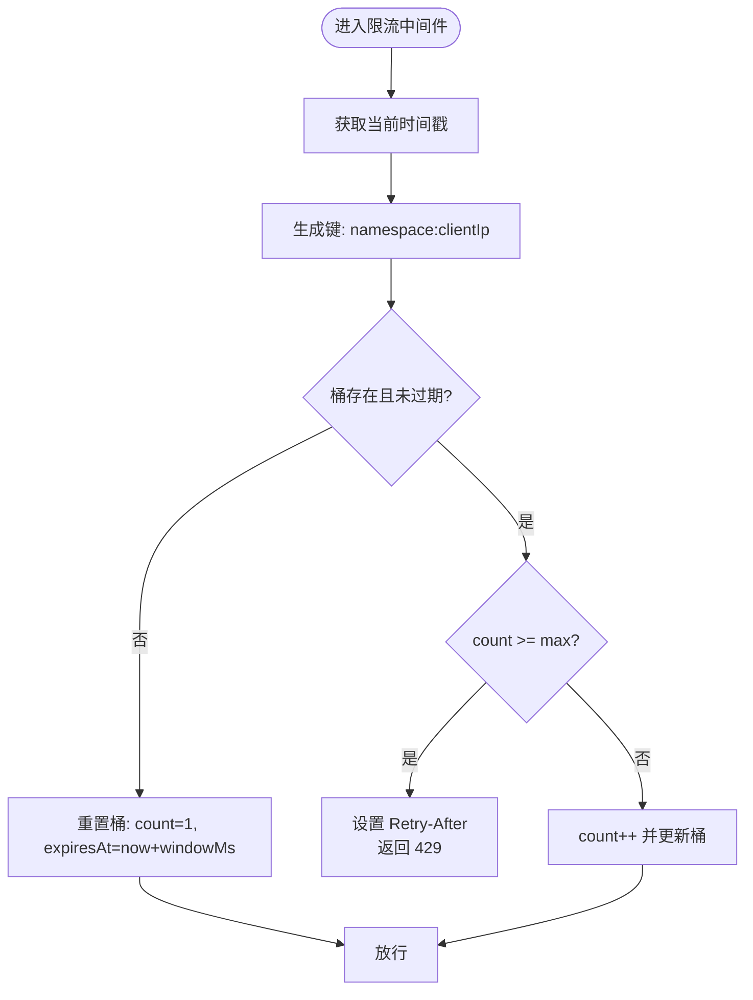
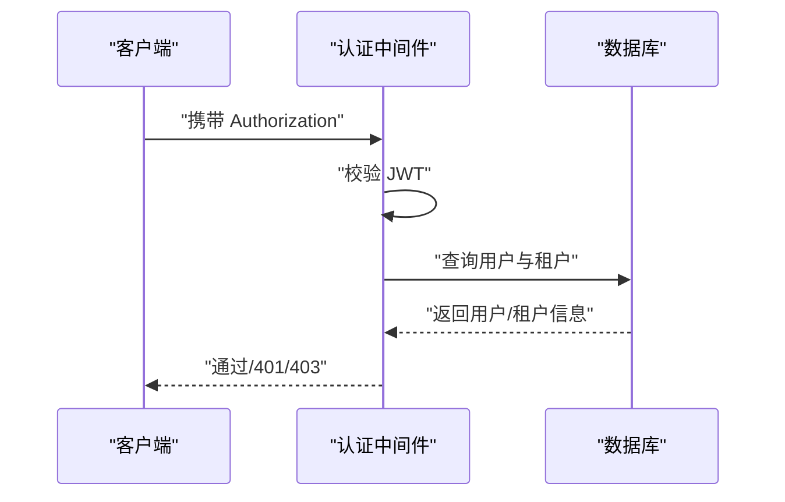
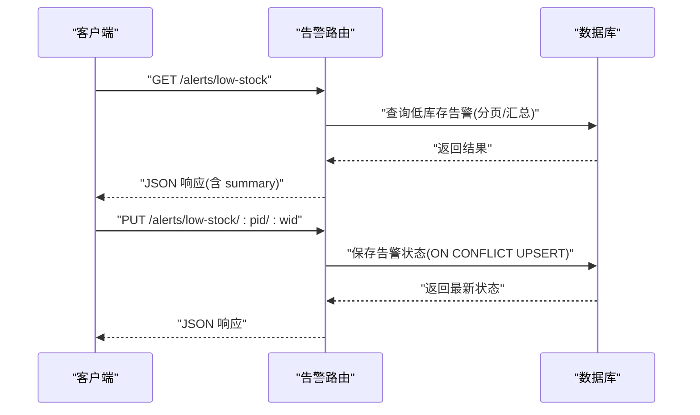
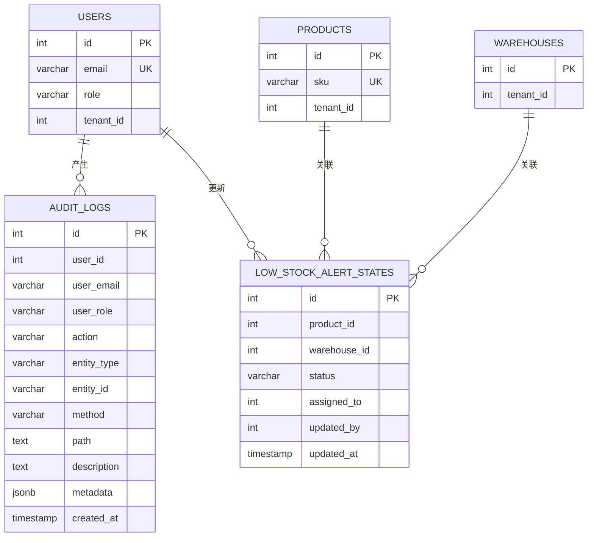
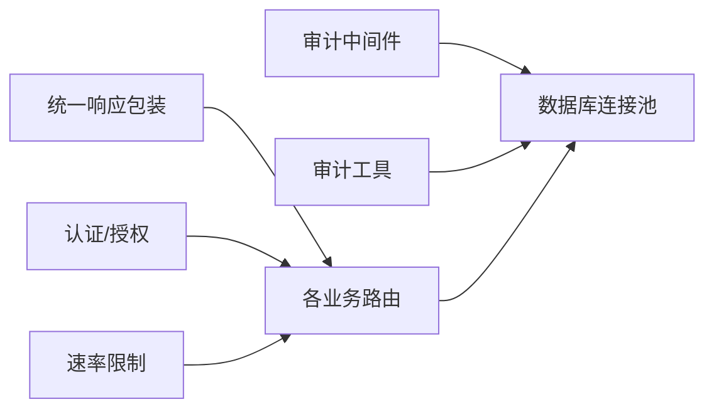

# 监控告警

<cite>
**本文引用的文件**
- [server/src/app.js](file://server/src/app.js)
- [server/src/middleware/response.js](file://server/src/middleware/response.js)
- [server/src/middleware/rateLimit.js](file://server/src/middleware/rateLimit.js)
- [server/src/middleware/auditTrail.js](file://server/src/middleware/auditTrail.js)
- [server/src/utils/auditLog.js](file://server/src/utils/auditLog.js)
- [server/src/routes/auditRoutes.js](file://server/src/routes/auditRoutes.js)
- [server/src/routes/alertsRoutes.js](file://server/src/routes/alertsRoutes.js)
- [server/src/config/db.js](file://server/src/config/db.js)
- [server/database/schema.sql](file://server/database/schema.sql)
- [server/src/middleware/auth.js](file://server/src/middleware/auth.js)
- [server/test/middleware.test.js](file://server/test/middleware.test.js)
- [server/package.json](file://server/package.json)
</cite>

## 目录
1. [简介](#简介)
2. [项目结构](#项目结构)
3. [核心组件](#核心组件)
4. [架构总览](#架构总览)
5. [详细组件分析](#详细组件分析)
6. [依赖关系分析](#依赖关系分析)
7. [性能考量](#性能考量)
8. [故障排查指南](#故障排查指南)
9. [结论](#结论)
10. [附录](#附录)

## 简介
本文件面向库存管理系统，系统性阐述应用层面的监控与告警机制，覆盖请求监控、错误追踪、性能指标采集、审计日志体系、速率限制中间件、日志聚合与分析最佳实践、关键性能指标（KPI）定义与监控，以及告警规则配置与通知渠道建议。文档同时给出与 Prometheus/Grafana 或云平台监控服务的集成思路，帮助团队建立可运维、可观测、可预警的生产级监控体系。

## 项目结构
后端基于 Express，采用中间件驱动的请求处理链路；审计日志通过中间件在请求完成后异步落库；速率限制中间件按客户端 IP 与命名空间进行限流；统一响应包装中间件为所有接口输出标准化结构并附带请求 ID；认证中间件负责鉴权与租户上下文注入。

图表来源
- [server/src/app.js:47-58](file://server/src/app.js#L47-L58)
- [server/src/middleware/response.js:1-62](file://server/src/middleware/response.js#L1-L62)
- [server/src/middleware/auditTrail.js:1-86](file://server/src/middleware/auditTrail.js#L1-L86)
- [server/src/config/db.js:17-23](file://server/src/config/db.js#L17-L23)
- [server/database/schema.sql:275-288](file://server/database/schema.sql#L275-L288)

章节来源
- [server/src/app.js:26-91](file://server/src/app.js#L26-L91)
- [server/src/middleware/response.js:1-62](file://server/src/middleware/response.js#L1-L62)
- [server/src/middleware/auditTrail.js:1-86](file://server/src/middleware/auditTrail.js#L1-L86)
- [server/src/config/db.js:17-23](file://server/src/config/db.js#L17-L23)
- [server/database/schema.sql:275-288](file://server/database/schema.sql#L275-L288)

## 核心组件
- 统一响应包装中间件：为所有接口输出统一结构，自动注入请求 ID，便于端到端追踪。
- 审计日志中间件：在请求完成后根据方法与路径推断审计上下文，清洗敏感字段，异步写入审计表。
- 速率限制中间件：基于内存桶（Map）实现滑动窗口限流，支持命名空间与窗口大小配置。
- 认证与授权中间件：JWT 校验、租户上下文注入、角色授权。
- 数据库连接池：根据环境变量动态决定 SSL 与超时，提供 query 封装。
- 审计日志查询路由：支持分页、筛选、全文检索与汇总统计。
- 告警路由：低库存告警状态维护、批量更新、汇总统计。

章节来源
- [server/src/middleware/response.js:1-62](file://server/src/middleware/response.js#L1-L62)
- [server/src/middleware/auditTrail.js:1-86](file://server/src/middleware/auditTrail.js#L1-L86)
- [server/src/middleware/rateLimit.js:1-40](file://server/src/middleware/rateLimit.js#L1-L40)
- [server/src/middleware/auth.js:1-87](file://server/src/middleware/auth.js#L1-L87)
- [server/src/config/db.js:17-23](file://server/src/config/db.js#L17-L23)
- [server/src/routes/auditRoutes.js:16-110](file://server/src/routes/auditRoutes.js#L16-L110)
- [server/src/routes/alertsRoutes.js:87-205](file://server/src/routes/alertsRoutes.js#L87-L205)

## 架构总览
下图展示从客户端到数据库的关键调用链，以及审计日志与速率限制在链路中的位置。

图表来源
- [server/src/app.js:47-58](file://server/src/app.js#L47-L58)
- [server/src/middleware/response.js:1-62](file://server/src/middleware/response.js#L1-L62)
- [server/src/middleware/auditTrail.js:47-81](file://server/src/middleware/auditTrail.js#L47-L81)
- [server/src/middleware/rateLimit.js:9-35](file://server/src/middleware/rateLimit.js#L9-L35)
- [server/src/middleware/auth.js:5-61](file://server/src/middleware/auth.js#L5-L61)
- [server/src/config/db.js:25-28](file://server/src/config/db.js#L25-L28)

## 详细组件分析

### 统一响应包装中间件
- 功能要点
  - 注入请求 ID 到响应头与响应体，便于全链路追踪。
  - 自动将非标准对象包装为 { success, code, message, details, requestId } 结构，错误码与状态码保持一致。
  - 提供 res.success/res.fail 辅助方法，简化控制器代码。
- 性能与可靠性
  - 仅对 4xx/5xx 场景进行失败包装，减少不必要的 JSON 序列化开销。
  - 与兜底错误中间件配合，确保异常不泄露堆栈。

图表来源
- [server/src/middleware/response.js:9-34](file://server/src/middleware/response.js#L9-L34)

章节来源
- [server/src/middleware/response.js:1-62](file://server/src/middleware/response.js#L1-L62)

### 审计日志中间件与审计日志工具
- 审计上下文推断
  - 登录成功场景自动识别为 LOGIN 类型。
  - 对于 POST/PUT/PATCH/DELETE 且状态码 < 400 的请求，根据路径推断实体类型与动作后缀。
- 敏感信息脱敏
  - 对请求体中的 password 字段进行脱敏处理。
- 异步写入
  - 使用连接池异步写入 audit_logs 表，失败仅记录日志，不影响主流程。
- 审计查询路由
  - 支持按用户邮箱、动作、实体类型、时间范围等条件过滤。
  - 支持分页与全量导出模式，提供汇总统计。

图表来源
- [server/src/middleware/auditTrail.js:47-81](file://server/src/middleware/auditTrail.js#L47-L81)
- [server/src/utils/auditLog.js:1-35](file://server/src/utils/auditLog.js#L1-L35)
- [server/src/routes/auditRoutes.js:16-110](file://server/src/routes/auditRoutes.js#L16-L110)
- [server/database/schema.sql:275-288](file://server/database/schema.sql#L275-L288)

章节来源
- [server/src/middleware/auditTrail.js:1-86](file://server/src/middleware/auditTrail.js#L1-L86)
- [server/src/utils/auditLog.js:1-40](file://server/src/utils/auditLog.js#L1-L40)
- [server/src/routes/auditRoutes.js:16-110](file://server/src/routes/auditRoutes.js#L16-L110)
- [server/database/schema.sql:275-288](file://server/database/schema.sql#L275-L288)

### 速率限制中间件
- 实现机制
  - 基于 Map 的内存桶，键为 namespace:clientIp，记录 { count, expiresAt }。
  - 滑动窗口：若桶不存在或已过期则重置计数与过期时间；否则累加计数。
  - 达到上限时设置 Retry-After 头并返回 429（优先使用 res.fail，否则回退为 JSON）。
- 配置参数
  - windowMs：时间窗口（毫秒）
  - max：窗口内最大请求数
  - namespace：命名空间，用于区分不同接口或场景
- 测试验证
  - 单元测试覆盖了通过、重复通过与被限流后的行为。

图表来源
- [server/src/middleware/rateLimit.js:9-35](file://server/src/middleware/rateLimit.js#L9-L35)

章节来源
- [server/src/middleware/rateLimit.js:1-40](file://server/src/middleware/rateLimit.js#L1-L40)
- [server/test/middleware.test.js:37-50](file://server/test/middleware.test.js#L37-L50)

### 认证与授权中间件
- JWT 校验：从 Authorization 头提取 Bearer Token，解码并查询用户与租户信息。
- 租户上下文：将用户与租户信息挂载到 req，用于后续路由的租户隔离与权限控制。
- 角色授权：authorizeRoles 可限定特定角色访问。

图表来源
- [server/src/middleware/auth.js:5-61](file://server/src/middleware/auth.js#L5-L61)

章节来源
- [server/src/middleware/auth.js:1-87](file://server/src/middleware/auth.js#L1-L87)

### 告警路由与状态管理
- 低库存告警查询：支持按产品/仓库/状态/关键词筛选，提供分页与汇总统计。
- 告警状态更新：单个与批量更新，支持状态枚举与指派校验。
- 审计上下文：在更新时设置审计上下文，触发审计日志写入。

图表来源
- [server/src/routes/alertsRoutes.js:87-205](file://server/src/routes/alertsRoutes.js#L87-L205)
- [server/src/routes/alertsRoutes.js:207-251](file://server/src/routes/alertsRoutes.js#L207-L251)
- [server/src/routes/alertsRoutes.js:253-308](file://server/src/routes/alertsRoutes.js#L253-L308)

章节来源
- [server/src/routes/alertsRoutes.js:15-42](file://server/src/routes/alertsRoutes.js#L15-L42)
- [server/src/routes/alertsRoutes.js:87-205](file://server/src/routes/alertsRoutes.js#L87-L205)
- [server/src/routes/alertsRoutes.js:207-251](file://server/src/routes/alertsRoutes.js#L207-L251)
- [server/src/routes/alertsRoutes.js:253-308](file://server/src/routes/alertsRoutes.js#L253-L308)

### 数据库连接与模式
- 连接池：根据 DATABASE_URL 动态决定 SSL 与超时，提供 query 封装。
- 审计日志表：包含用户、动作、实体、路径、描述与 JSONB 元数据。
- 索引：为审计日志、低库存告警状态等高频查询建立索引。

图表来源
- [server/src/config/db.js:17-23](file://server/src/config/db.js#L17-L23)
- [server/database/schema.sql:275-288](file://server/database/schema.sql#L275-L288)
- [server/database/schema.sql:290-300](file://server/database/schema.sql#L290-L300)

章节来源
- [server/src/config/db.js:17-23](file://server/src/config/db.js#L17-L23)
- [server/database/schema.sql:275-288](file://server/database/schema.sql#L275-L288)
- [server/database/schema.sql:290-300](file://server/database/schema.sql#L290-L300)

## 依赖关系分析
- 中间件耦合
  - 审计中间件依赖数据库连接池与审计工具。
  - 统一响应包装中间件被所有路由共享，保证输出一致性。
  - 速率限制中间件独立，可按需挂载到特定路由或全局。
- 路由与中间件
  - 所有 /api/* 路由均受认证中间件保护，部分审计类路由进一步受角色授权保护。
- 数据访问
  - 审计日志与告警状态均通过连接池执行 SQL，审计日志使用 JSONB 存储元数据，利于扩展。

图表来源
- [server/src/middleware/response.js:1-62](file://server/src/middleware/response.js#L1-L62)
- [server/src/middleware/auditTrail.js:1-86](file://server/src/middleware/auditTrail.js#L1-L86)
- [server/src/middleware/rateLimit.js:1-40](file://server/src/middleware/rateLimit.js#L1-L40)
- [server/src/middleware/auth.js:1-87](file://server/src/middleware/auth.js#L1-L87)
- [server/src/config/db.js:17-23](file://server/src/config/db.js#L17-L23)

章节来源
- [server/src/middleware/response.js:1-62](file://server/src/middleware/response.js#L1-L62)
- [server/src/middleware/auditTrail.js:1-86](file://server/src/middleware/auditTrail.js#L1-L86)
- [server/src/middleware/rateLimit.js:1-40](file://server/src/middleware/rateLimit.js#L1-L40)
- [server/src/middleware/auth.js:1-87](file://server/src/middleware/auth.js#L1-L87)
- [server/src/config/db.js:17-23](file://server/src/config/db.js#L17-L23)

## 性能考量
- 限流策略
  - 建议对登录接口单独设置更严格的命名空间与窗口，避免暴力破解。
  - 对静态资源与健康检查接口可绕过限流或放宽阈值。
- 审计日志
  - 异步写入避免阻塞主请求路径；建议对高并发场景增加数据库连接池大小与索引优化。
  - 审计元数据使用 JSONB，便于扩展但需关注存储与查询成本。
- 日志与追踪
  - 使用统一响应包装的请求 ID，结合速率限制与审计日志，可快速定位慢请求与异常来源。
- 数据库
  - 为审计日志与告警状态建立合适索引，避免全表扫描。

[本节为通用性能建议，不直接分析具体文件]

## 故障排查指南
- 速率限制导致 429
  - 检查命名空间与窗口是否合理，确认客户端是否正确传递 X-Forwarded-For。
  - 参考单元测试用例验证限流行为。
- 审计日志缺失
  - 确认 finish 事件是否触发，检查数据库连接与写入异常日志。
  - 核对审计上下文推断逻辑（仅对 2xx 且为写操作才记录）。
- 统一响应包装异常
  - 确认 res.fail 是否可用，检查自定义响应方法是否被覆盖。
- 认证失败
  - 核对 Authorization 头格式、JWT 密钥与租户上下文一致性。

章节来源
- [server/test/middleware.test.js:37-50](file://server/test/middleware.test.js#L37-L50)
- [server/src/middleware/auditTrail.js:47-81](file://server/src/middleware/auditTrail.js#L47-L81)
- [server/src/middleware/response.js:45-54](file://server/src/middleware/response.js#L45-L54)
- [server/src/middleware/auth.js:5-61](file://server/src/middleware/auth.js#L5-L61)

## 结论
本系统通过统一响应包装、审计日志中间件、速率限制中间件与认证授权中间件，构建了基础的可观测与安全能力。结合数据库模式与路由设计，能够支撑低库存告警与审计日志查询等核心业务监控需求。建议在此基础上引入外部监控与告警平台，完善 KPI 指标采集、可视化与自动化告警。

[本节为总结性内容，不直接分析具体文件]

## 附录

### 关键性能指标（KPI）定义与监控建议
- 响应时间
  - P50/P90/P95 延迟，按路由、方法、状态码分组。
  - 建议使用 Prometheus histogram 指标与 Grafana 面板。
- 错误率
  - 4xx/5xx 比例，按路由与错误码细分。
- 吞吐量
  - QPS，按路由与状态码分组。
- 资源利用率
  - CPU、内存、数据库连接池使用率、慢查询比例。
- 审计与安全
  - 登录失败次数、异常操作占比、审计日志写入延迟。

[本节为通用指标建议，不直接分析具体文件]

### 告警规则配置建议
- 阈值设置
  - 响应时间：P95 超过 2s 持续 5 分钟。
  - 错误率：接口错误率超过 1%，持续 3 分钟。
  - 吞吐量：QPS 低于基线的 30%，持续 5 分钟。
  - 数据库：连接池空闲率低于 10%，慢查询占比超过 5%。
- 通知渠道
  - 邮件、Slack、PagerDuty（生产级）。
- 升级策略
  - 一级告警：15 分钟未恢复自动升级至二级。
  - 二级告警：30 分钟未恢复自动升级至三级并电话通知。

[本节为通用告警建议，不直接分析具体文件]

### 监控工具选择与集成方案
- Prometheus + Grafana
  - 使用 Express 应用内置指标导出（如进程指标），结合自定义指标埋点。
  - Grafana 可视化 KPI、告警面板与审计仪表盘。
- 云平台监控服务
  - AWS CloudWatch、GCP Cloud Monitoring、Azure Monitor。
  - 通过日志组/指标集与告警规则对接通知通道。
- 日志聚合与分析
  - 使用 OpenTelemetry/Fluent Bit/Vector 收集访问日志与审计日志。
  - 结合 Elasticsearch/BigQuery/Lakehouse 做长期归档与查询优化。
  - 查询优化建议：按天分区、选择性过滤、物化常用聚合。

[本节为通用工具建议，不直接分析具体文件]