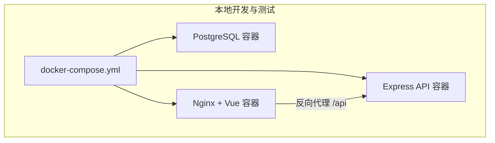
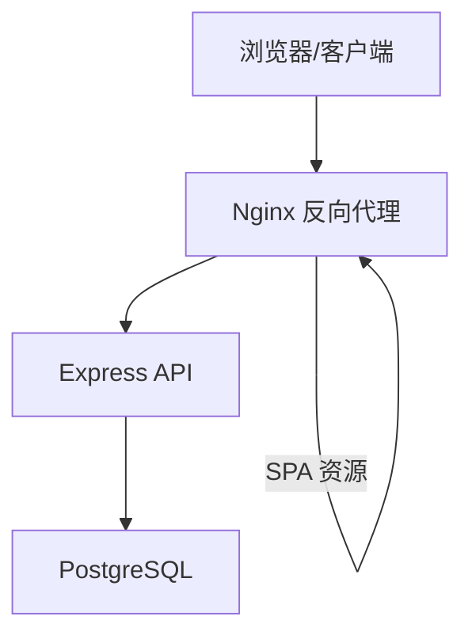
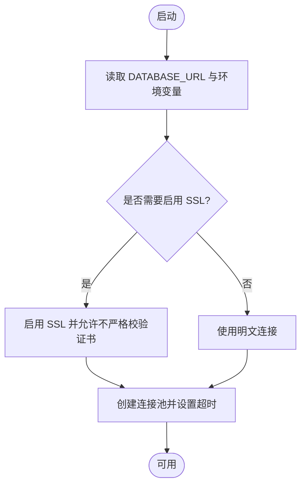
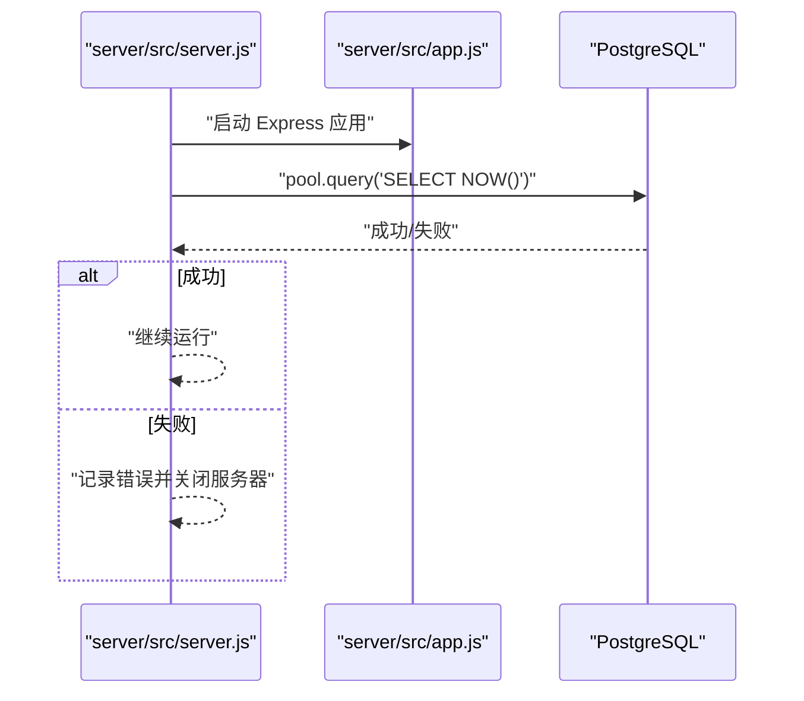
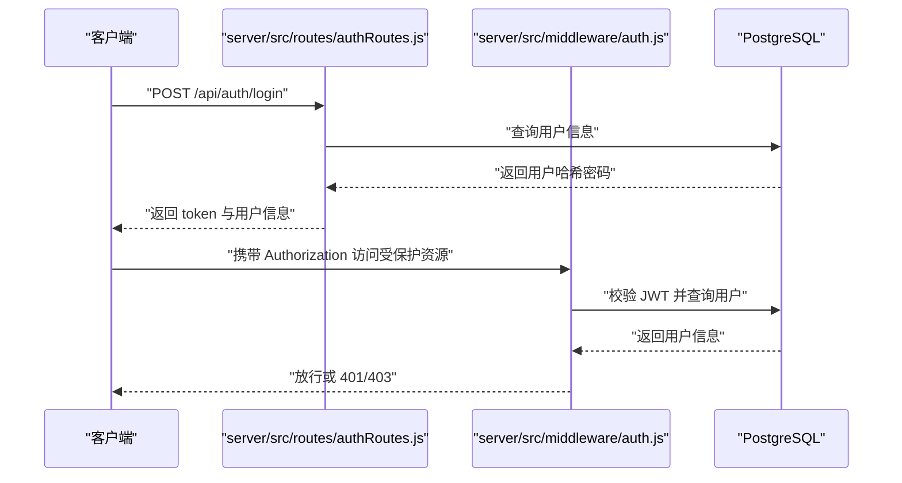
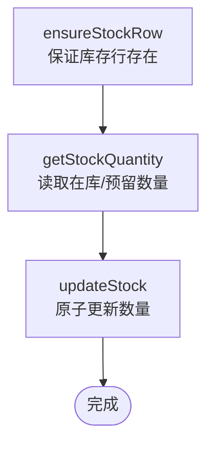
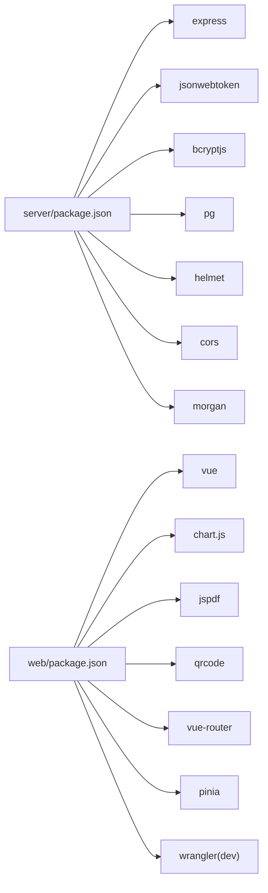

# 部署运维

<cite>
**本文引用的文件**
- [docker-compose.yml](file://docker-compose.yml)
- [server/Dockerfile](file://server/Dockerfile)
- [web/Dockerfile](file://web/Dockerfile)
- [DEPLOY_FREE.md](file://DEPLOY_FREE.md)
- [README.md](file://README.md)
- [server/package.json](file://server/package.json)
- [web/package.json](file://web/package.json)
- [server/src/config/db.js](file://server/src/config/db.js)
- [server/src/server.js](file://server/src/server.js)
- [server/src/app.js](file://server/src/app.js)
- [server/src/routes/authRoutes.js](file://server/src/routes/authRoutes.js)
- [server/src/middleware/auth.js](file://server/src/middleware/auth.js)
- [server/src/utils/inventoryService.js](file://server/src/utils/inventoryService.js)
- [web/vite.config.js](file://web/vite.config.js)
- [web/nginx.conf](file://web/nginx.conf)
</cite>

## 目录
1. [简介](#简介)
2. [项目结构](#项目结构)
3. [核心组件](#核心组件)
4. [架构总览](#架构总览)
5. [详细组件分析](#详细组件分析)
6. [依赖关系分析](#依赖关系分析)
7. [性能考量](#性能考量)
8. [故障排除指南](#故障排除指南)
9. [结论](#结论)
10. [附录](#附录)

## 简介
本部署运维文档面向库存管理系统，覆盖本地与云端部署、容器化与编排、生产环境配置、CI/CD 流水线、监控与告警、备份与恢复、扩展与扩容、故障排除与应急响应、运维最佳实践以及云平台部署与成本优化建议。系统采用前后端分离架构：后端为 Node.js + Express 的 API 服务，使用 PostgreSQL 存储；前端为 Vue 3 应用，通过 Nginx 提供静态资源与反向代理。

## 项目结构
- 后端服务（server）：Express 应用，提供认证、主数据、库存、报表、审计、同步等 API。
- 前端服务（web）：Vue 3 应用，打包后由 Nginx 提供静态托管，并代理 /api 请求至后端。
- 容器编排：docker-compose 将数据库、API、Web 服务组合运行，含健康检查与初始化脚本挂载。
- 部署指南：提供免费云平台（Render + Cloudflare Pages + Neon）的部署步骤与注意事项。

图表来源
- [docker-compose.yml:1-57](file://docker-compose.yml#L1-L57)
- [web/nginx.conf:8-15](file://web/nginx.conf#L8-L15)

章节来源
- [README.md:22-105](file://README.md#L22-L105)
- [docker-compose.yml:1-57](file://docker-compose.yml#L1-L57)

## 核心组件
- 数据库层：PostgreSQL，使用连接池与 SSL 模式选择逻辑，支持本地直连与生产环境强制 SSL。
- API 层：Express 应用，内置安全中间件（CORS、Helmet、Morgan），统一错误处理，健康检查端点，多路由模块化组织。
- 前端层：Vue 3 应用，Vite 构建，Cloudflare 插件适配，开发时通过代理转发 /api 到后端。
- 反向代理：Nginx 将前端静态资源与 /api 请求分别处理，实现 SPA 路由与后端 API 代理。

章节来源
- [server/src/config/db.js:1-25](file://server/src/config/db.js#L1-L25)
- [server/src/app.js:1-65](file://server/src/app.js#L1-L65)
- [web/vite.config.js:1-46](file://web/vite.config.js#L1-L46)
- [web/nginx.conf:1-21](file://web/nginx.conf#L1-L21)

## 架构总览
系统采用三层架构：前端（Vue）、后端（Express）、数据库（PostgreSQL）。容器化部署通过 docker-compose 编排，数据库在首次启动时自动执行 schema.sql 与 seed.sql 初始化脚本；前端通过 Nginx 反向代理将 /api 请求转发至后端 API。

图表来源
- [web/nginx.conf:8-15](file://web/nginx.conf#L8-L15)
- [server/src/app.js:35-37](file://server/src/app.js#L35-L37)
- [server/src/config/db.js:13-19](file://server/src/config/db.js#L13-L19)

## 详细组件分析

### 数据库连接与 SSL 策略
- 连接字符串解析与 SSL 选择逻辑：根据连接串内容、环境变量与 NODE_ENV 自动启用 SSL，确保生产环境安全连接。
- 连接超时与拒绝未授权证书：通过连接池参数设置超时与 SSL 行为，提升启动稳定性与安全性。

图表来源
- [server/src/config/db.js:3-11](file://server/src/config/db.js#L3-L11)
- [server/src/config/db.js:15-19](file://server/src/config/db.js#L15-L19)

章节来源
- [server/src/config/db.js:1-25](file://server/src/config/db.js#L1-L25)

### 启动与健康检查
- 启动阶段：API 启动监听端口，并在超时时间内尝试查询数据库以确保连接可用；失败则优雅关闭进程并退出。
- 健康检查：提供 /api/health 快速检测服务状态。
- docker-compose 健康检查：数据库容器使用 pg_isready 周期性探测。

图表来源
- [server/src/server.js:13-25](file://server/src/server.js#L13-L25)
- [server/src/app.js:35-37](file://server/src/app.js#L35-L37)

章节来源
- [server/src/server.js:1-28](file://server/src/server.js#L1-L28)
- [server/src/app.js:35-37](file://server/src/app.js#L35-L37)
- [docker-compose.yml:16-20](file://docker-compose.yml#L16-L20)

### 认证与权限控制
- 登录接口：邮箱+密码校验，生成短期 JWT，带审计日志。
- 中间件：校验 Bearer Token，解析用户信息并注入到请求上下文；基于角色的授权中间件用于菜单级权限控制。

图表来源
- [server/src/routes/authRoutes.js:17-64](file://server/src/routes/authRoutes.js#L17-L64)
- [server/src/middleware/auth.js:5-29](file://server/src/middleware/auth.js#L5-L29)

章节来源
- [server/src/routes/authRoutes.js:1-72](file://server/src/routes/authRoutes.js#L1-L72)
- [server/src/middleware/auth.js:1-46](file://server/src/middleware/auth.js#L1-L46)

### 库存服务工具
- 统一库存增减逻辑封装：确保库存行存在、读取现有数量、原子更新，减少重复事务代码与并发风险。

图表来源
- [server/src/utils/inventoryService.js:2-38](file://server/src/utils/inventoryService.js#L2-L38)

章节来源
- [server/src/utils/inventoryService.js:1-45](file://server/src/utils/inventoryService.js#L1-L45)

### 前端构建与代理
- 开发代理：Vite 本地开发服务器将 /api 请求代理到后端 4000 端口。
- 生产构建：Vite 手动分包策略优化图表、PDF、扫描器与核心框架包，降低首屏体积。
- Cloudflare 插件：适配 Pages/Wrangler 环境，便于云端部署。

章节来源
- [web/vite.config.js:8-16](file://web/vite.config.js#L8-L16)
- [web/vite.config.js:20-42](file://web/vite.config.js#L20-L42)
- [web/package.json:24-32](file://web/package.json#L24-L32)

### 反向代理与静态资源
- Nginx 将 SPA 路由回退到 index.html，同时将 /api 前缀代理到后端 API，保留必要的头部信息。

章节来源
- [web/nginx.conf:8-15](file://web/nginx.conf#L8-L15)

## 依赖关系分析
- 后端依赖：Express、CORS、Helmet、Morgan、jsonwebtoken、bcryptjs、pg、multer 等。
- 前端依赖：Vue 3、Chart.js、jsPDF、QRCode、Pinia、Vue Router 等；开发依赖包含 Vite、TailwindCSS、Wrangler 等。
- 容器镜像：后端基于 node:20-alpine，前端多阶段构建（构建阶段 node:20-alpine，运行阶段 nginx:1.27-alpine）。

图表来源
- [server/package.json:15-29](file://server/package.json#L15-L29)
- [web/package.json:12-32](file://web/package.json#L12-L32)

章节来源
- [server/package.json:1-31](file://server/package.json#L1-L31)
- [web/package.json:1-34](file://web/package.json#L1-L34)

## 性能考量
- 连接池与超时：合理设置连接超时与 SSL 行为，避免冷启动与数据库不可达导致的启动失败。
- 分包策略：前端按功能模块拆分代码块，减少首屏加载体积，提升交互速度。
- 代理与缓存：Nginx 提供静态资源服务与反向代理，结合 CDN 可进一步优化静态资源访问。
- 数据库索引与查询：对高频查询字段建立索引，避免全表扫描；批量操作使用事务与批量插入。

## 故障排除指南
- 401 未授权：检查 JWT_SECRET 是否稳定，变更会导致所有令牌失效需重新登录。
- 404 接口不存在：确认 API 版本与路由注册，核对 server/src/app.js 中路由挂载。
- 500 设置/供应商错误：确认数据库 schema 已执行，必要时重新运行 schema.sql。
- 首次请求缓慢：免费平台可能存在冷启动延迟，属于正常现象。
- 数据库连接失败：检查 DATABASE_URL、SSL 参数与网络连通性；确认生产环境强制 SSL。

章节来源
- [DEPLOY_FREE.md:261-286](file://DEPLOY_FREE.md#L261-L286)
- [server/src/server.js:18-24](file://server/src/server.js#L18-L24)
- [server/src/config/db.js:13-19](file://server/src/config/db.js#L13-L19)

## 结论
本系统提供了完整的本地与云端部署方案，具备良好的容器化与编排能力。通过明确的环境变量、健康检查与初始化脚本，可快速在本地与云平台上完成部署。建议在生产环境中完善监控、日志与备份策略，并结合 CI/CD 实现自动化发布与回滚。

## 附录

### 一、Docker 容器化与编排
- 镜像构建
  - 后端镜像：基于 node:20-alpine，安装生产依赖并复制源码，暴露 4000 端口。
  - 前端镜像：多阶段构建，先在 node:20-alpine 中安装依赖与打包，再将 dist 目录复制到 nginx:1.27-alpine，暴露 80 端口。
- 容器编排
  - 使用 docker-compose 启动 db、api、web 三个服务，db 挂载 schema.sql 与 seed.sql 作为初始化脚本，设置健康检查与依赖顺序。
  - 前端 Nginx 通过反向代理将 /api 请求转发至后端 API。

章节来源
- [server/Dockerfile:1-13](file://server/Dockerfile#L1-L13)
- [web/Dockerfile:1-19](file://web/Dockerfile#L1-L19)
- [docker-compose.yml:1-57](file://docker-compose.yml#L1-L57)
- [web/nginx.conf:8-15](file://web/nginx.conf#L8-L15)

### 二、生产环境部署策略
- 环境配置
  - 数据库：使用生产数据库（如 Render + Neon），确保连接串包含 sslmode=require。
  - API：设置 PORT、DATABASE_URL、JWT_SECRET、NODE_ENV 等环境变量，保持 JWT_SECRET 稳定。
  - 前端：设置 VITE_API_URL 指向后端 API 域名。
- SSL 与域名
  - 生产环境强制启用 SSL；Cloudflare Pages 可通过自定义域名与 SSL 证书提供 HTTPS。
- 初始化数据库
  - 首次部署后执行 schema.sql 与 seed.sql，验证用户表等关键表是否存在。

章节来源
- [DEPLOY_FREE.md:27-126](file://DEPLOY_FREE.md#L27-L126)
- [server/src/config/db.js:3-11](file://server/src/config/db.js#L3-L11)

### 三、CI/CD 流水线与自动化部署
- 建议流水线步骤
  - 代码检出 → 单元测试 → 构建后端镜像 → 构建前端镜像 → 推送镜像 → 编排部署 → 健康检查 → 回滚策略。
  - 触发条件：分支保护、PR 合并、标签发布。
- 云平台集成
  - Render：自动拉取仓库，按 server 根目录构建与启动。
  - Cloudflare Pages：自动拉取仓库，按 web 根目录构建与部署。
  - 注意：避免将 node_modules 打包进 Pages 资产，仅上传构建产物 dist。

章节来源
- [DEPLOY_FREE.md:129-224](file://DEPLOY_FREE.md#L129-L224)
- [web/package.json:6-10](file://web/package.json#L6-L10)

### 四、监控与告警
- 应用监控
  - 健康检查：定期调用 /api/health，失败即告警。
  - 日志：开启 Morgan 记录请求日志，结合后端错误中间件统一处理。
- 日志收集
  - Render 与 Cloudflare Pages 提供日志查看与导出，建议接入集中式日志系统（如 ELK 或云厂商日志服务）。
- 性能指标
  - 关键指标：请求量、响应时间、错误率、数据库连接数、CPU/内存使用率。

章节来源
- [server/src/app.js:35-37](file://server/src/app.js#L35-L37)
- [server/src/app.js:55-62](file://server/src/app.js#L55-L62)

### 五、备份与恢复
- 数据库备份
  - 定期导出数据库（如使用 pg_dump），存储至安全位置（对象存储或本地归档）。
  - 验证备份完整性与可恢复性。
- 文件备份
  - 前端静态资源位于 Nginx 容器内，建议将构建产物与配置文件纳入版本控制或单独备份。
- 恢复流程
  - 从最近可用备份恢复数据库，重新执行 schema.sql 与 seed.sql（如需），重启服务并验证。

章节来源
- [README.md:33-47](file://README.md#L33-L47)

### 六、扩展与扩容
- 水平扩展
  - API：多副本部署，配合负载均衡；数据库使用高可用实例。
  - 前端：多副本 Nginx，结合 CDN 加速静态资源。
- 垂直扩展
  - 提升 CPU/内存规格，优化数据库连接池大小与查询性能。
- 无状态设计
  - API 无会话粘性需求，便于横向扩展。

### 七、故障排除与应急响应
- 常见问题定位
  - 401：检查 JWT_SECRET 是否一致；核对前端登录流程。
  - 404：核对路由注册与 API 版本。
  - 500：核对数据库 schema 是否执行；查看后端错误日志。
  - 冷启动慢：免费平台特性，建议升级实例或引入预热机制。
- 应急回滚
  - 保留最近一次成功构建镜像，出现问题立即回滚至上一个稳定版本。

章节来源
- [DEPLOY_FREE.md:261-286](file://DEPLOY_FREE.md#L261-L286)

### 八、运维最佳实践
- 环境隔离：开发、测试、生产使用独立数据库与密钥。
- 密钥管理：使用平台提供的密钥管理服务，定期轮换。
- 安全加固：启用 Helmet、CORS 白名单、速率限制、最小权限原则。
- 可观测性：统一日志、指标与链路追踪，建立告警阈值与通知渠道。
- 备份策略：定期备份与演练恢复，确保 RPO/RTO 满足业务要求。

### 九、云平台部署指南与成本优化
- 推荐组合（免费试用期）
  - 数据库：Neon Postgres（免费额度）
  - API：Render Web Service（免费额度）
  - 前端：Cloudflare Pages（免费额度）
- 成本优化建议
  - 选择就近区域，减少网络延迟。
  - 使用 CDN 缓存静态资源，降低带宽成本。
  - 控制并发与实例规格，按流量弹性伸缩。
  - 清理不必要的日志与临时文件，降低存储成本。

章节来源
- [DEPLOY_FREE.md:8-14](file://DEPLOY_FREE.md#L8-L14)
- [DEPLOY_FREE.md:288-293](file://DEPLOY_FREE.md#L288-L293)