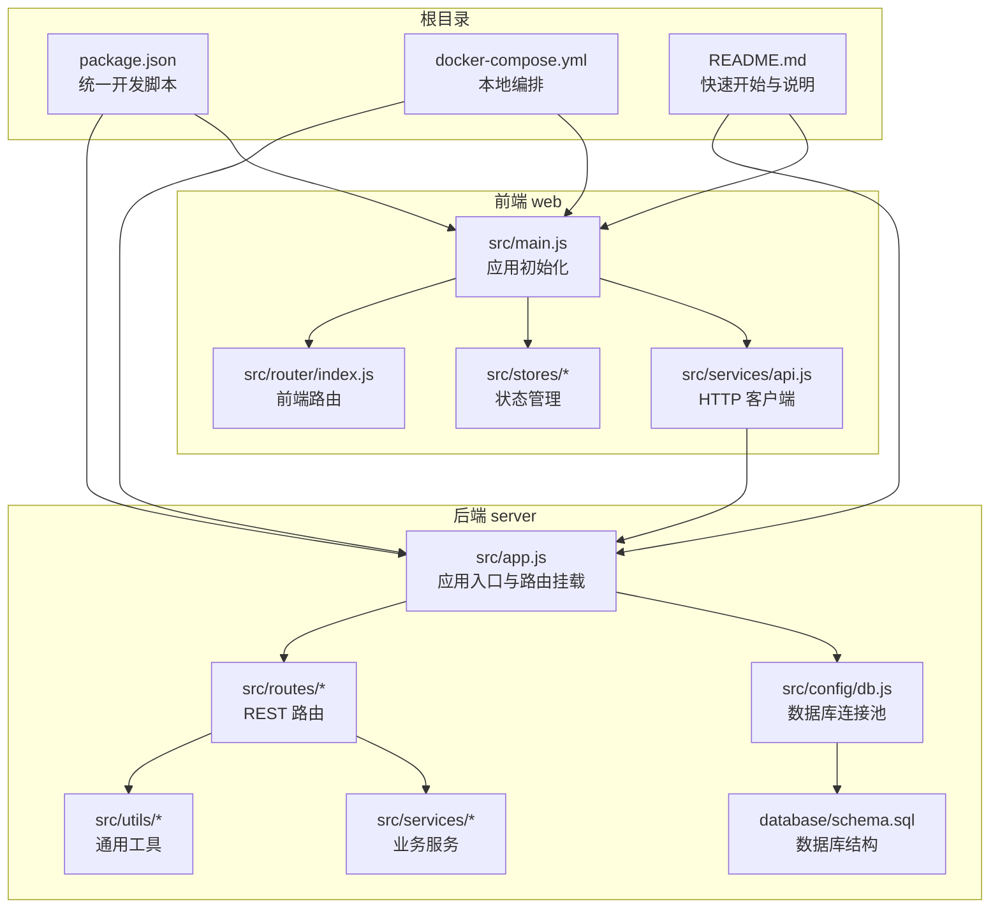
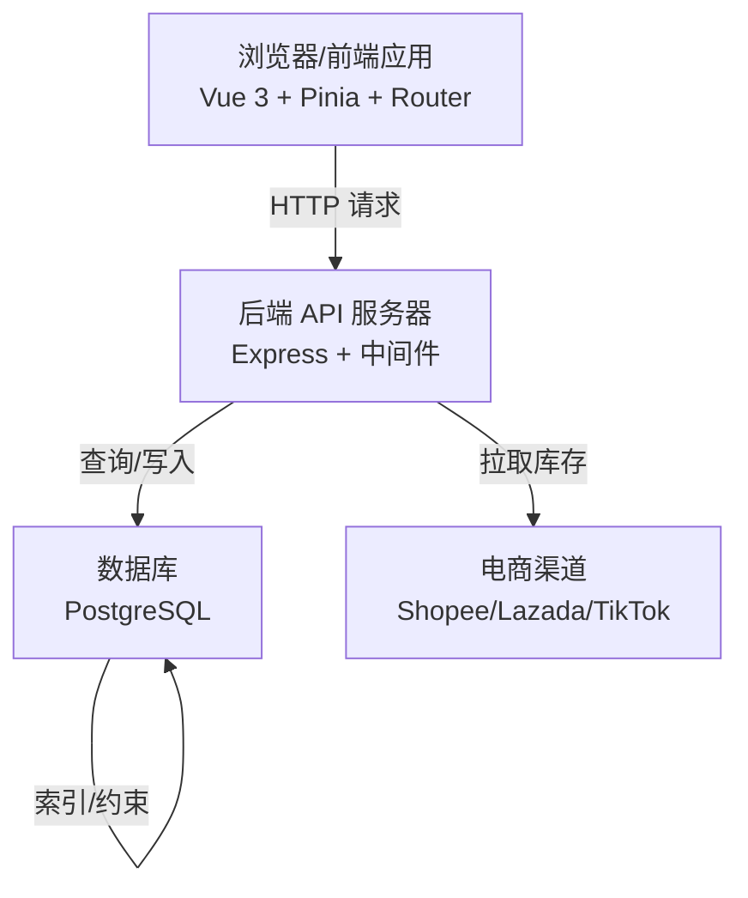
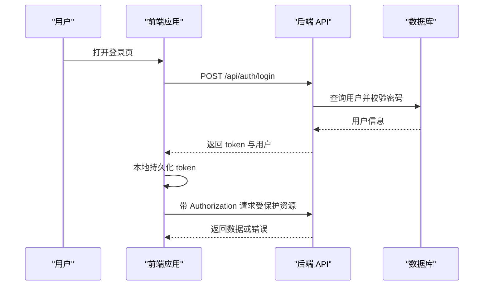
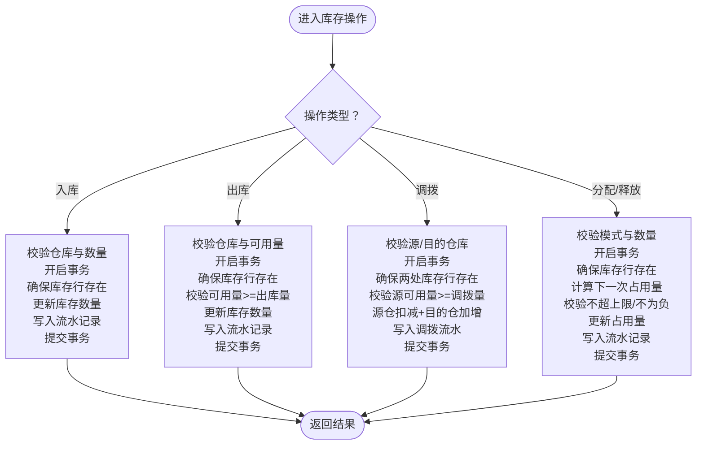
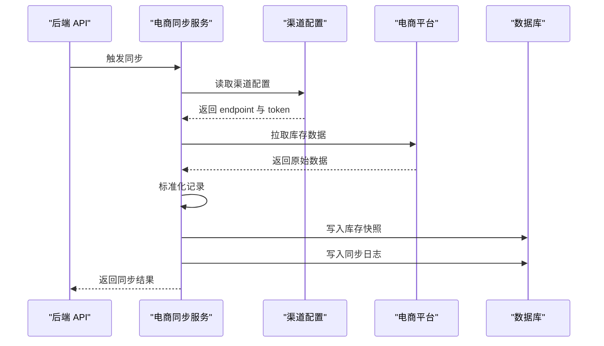
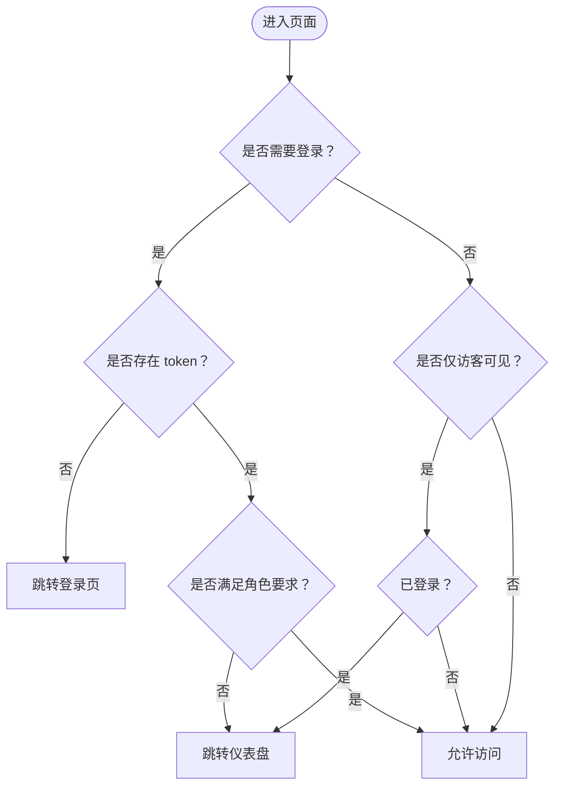
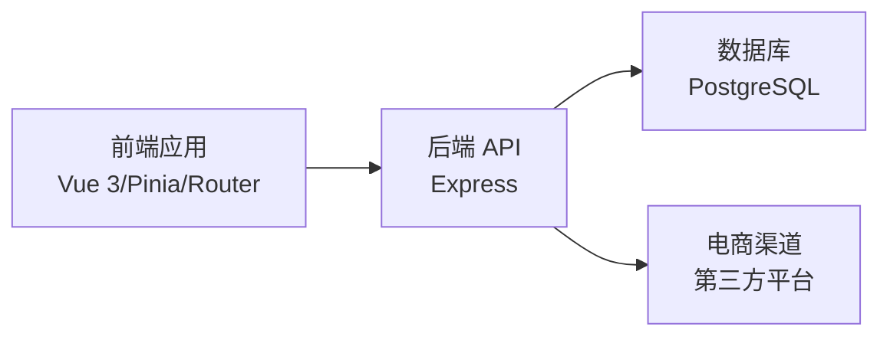
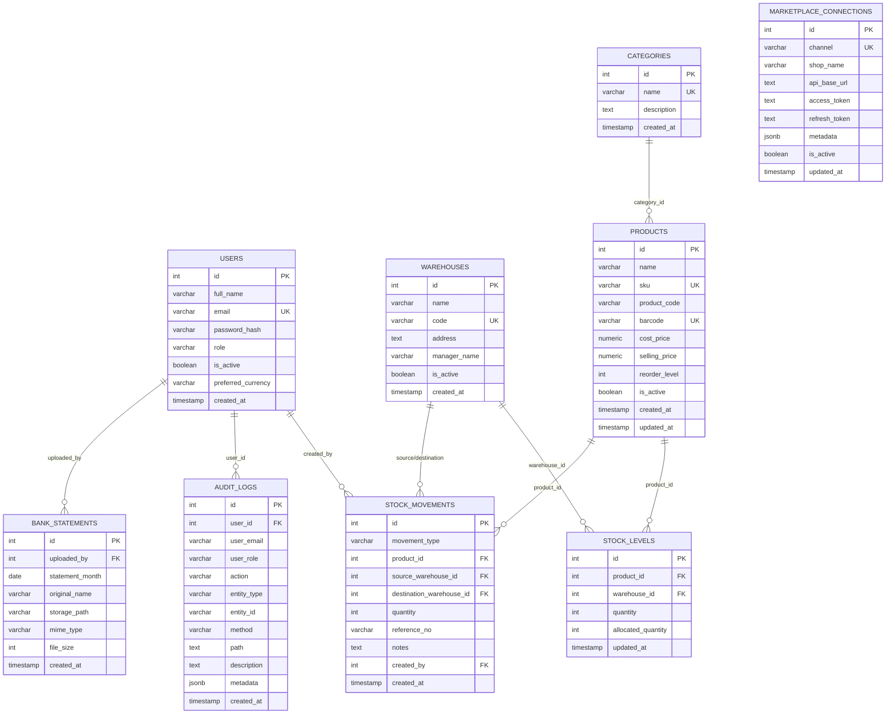

# 项目概述

<cite>
**本文引用的文件**
- [README.md](file://README.md)
- [package.json](file://package.json)
- [server/package.json](file://server/package.json)
- [web/package.json](file://web/package.json)
- [server/src/app.js](file://server/src/app.js)
- [server/src/config/db.js](file://server/src/config/db.js)
- [server/database/schema.sql](file://server/database/schema.sql)
- [server/src/routes/inventoryRoutes.js](file://server/src/routes/inventoryRoutes.js)
- [server/src/routes/authRoutes.js](file://server/src/routes/authRoutes.js)
- [server/src/utils/inventoryService.js](file://server/src/utils/inventoryService.js)
- [server/src/services/marketplaceSyncService.js](file://server/src/services/marketplaceSyncService.js)
- [web/src/router/index.js](file://web/src/router/index.js)
- [web/src/stores/auth.js](file://web/src/stores/auth.js)
- [web/src/services/api.js](file://web/src/services/api.js)
- [web/src/main.js](file://web/src/main.js)
- [docker-compose.yml](file://docker-compose.yml)
- [DEPLOY_FREE.md](file://DEPLOY_FREE.md)
- [POSTMAN_BACKEND_GUIDE.md](file://POSTMAN_BACKEND_GUIDE.md)
</cite>

## 目录
1. [引言](#引言)
2. [项目结构](#项目结构)
3. [核心组件](#核心组件)
4. [架构总览](#架构总览)
5. [详细组件分析](#详细组件分析)
6. [依赖分析](#依赖分析)
7. [性能考虑](#性能考虑)
8. [故障排查指南](#故障排查指南)
9. [结论](#结论)
10. [附录](#附录)

## 引言
本库存管理系统是一个全栈解决方案，采用 Vue 3 + Tailwind CSS 前端、Node.js + Express 后端、PostgreSQL 数据库的技术组合，服务于多仓库、多角色权限、实时库存追踪、电商渠道对接与对账等核心业务场景。系统提供库存总览、出入库与调拨、低库存预警、盘点、报表与审计日志等功能，支持通过 API 进行电商库存同步与订单处理。

系统业务价值体现在：
- 多仓库精细化库存管理：按仓库维度记录在库、占用与可用数量，支持库存调拨与分配。
- 电商集成：内置多平台（如 Shopee/Lazada/TikTok）库存同步与订单对接能力，便于统一管理线上销售库存。
- 实时库存追踪：通过流水记录与快照，实现库存变动的可追溯与可视化。
- 安全与合规：基于 JWT 的认证授权、审计日志、速率限制与响应中间件，保障系统安全与稳定性。

## 项目结构
项目采用前后端分离的双包结构，根目录提供统一开发脚本与编排文件，前后端分别独立运行与部署。

图表来源
- [package.json:1-20](file://package.json#L1-L20)
- [server/src/app.js:1-65](file://server/src/app.js#L1-L65)
- [server/src/config/db.js:1-25](file://server/src/config/db.js#L1-L25)
- [server/database/schema.sql:1-420](file://server/database/schema.sql#L1-L420)
- [web/src/main.js:1-14](file://web/src/main.js#L1-L14)
- [web/src/router/index.js:1-202](file://web/src/router/index.js#L1-L202)
- [web/src/services/api.js:1-45](file://web/src/services/api.js#L1-L45)
- [docker-compose.yml:1-57](file://docker-compose.yml#L1-L57)

章节来源
- [README.md:22-29](file://README.md#L22-L29)
- [package.json:6-12](file://package.json#L6-L12)
- [docker-compose.yml:1-57](file://docker-compose.yml#L1-L57)

## 核心组件
- 应用入口与路由挂载
  - 后端应用入口集中注册安全中间件、CORS、日志、审计与统一响应格式，并按模块挂载各路由前缀。
  - 前端应用入口统一挂载 Pinia 状态管理与路由，保证全局共享状态与导航能力。
- 数据库层
  - 使用 PostgreSQL 作为主数据存储，提供用户、分类、仓库、产品、库存、流水、盘点、审计日志、电商对接等完整模型。
  - 通过连接池与 SSL 自适应策略，确保生产环境安全与稳定。
- 路由与控制器
  - 后端按领域划分路由模块，如库存、仪表盘、报表、告警、审计、电商、订单、仓储等，统一鉴权与错误处理。
- 业务服务
  - 库存服务封装库存行确保、查询与更新，保证并发与一致性。
  - 电商同步服务负责从外部渠道拉取库存快照并落库，支持多平台配置与标准化处理。
- 前端状态与网络
  - 前端通过 Pinia 管理认证与通知状态；Axios 封装统一请求拦截器，自动注入认证与成本访问令牌，统一对响应进行解包与错误提示。

章节来源
- [server/src/app.js:25-54](file://server/src/app.js#L25-L54)
- [web/src/main.js:7-13](file://web/src/main.js#L7-L13)
- [server/src/config/db.js:13-24](file://server/src/config/db.js#L13-L24)
- [server/src/utils/inventoryService.js:1-45](file://server/src/utils/inventoryService.js#L1-L45)
- [server/src/services/marketplaceSyncService.js:18-140](file://server/src/services/marketplaceSyncService.js#L18-L140)
- [web/src/stores/auth.js:19-89](file://web/src/stores/auth.js#L19-L89)
- [web/src/services/api.js:3-42](file://web/src/services/api.js#L3-L42)

## 架构总览
系统采用前后端分离架构，后端提供 REST API，前端通过 Axios 发起请求并维护认证状态。数据库通过连接池统一接入，电商渠道通过同步服务定期抓取库存快照。

图表来源
- [web/src/services/api.js:3-42](file://web/src/services/api.js#L3-L42)
- [server/src/app.js:25-54](file://server/src/app.js#L25-L54)
- [server/src/config/db.js:13-24](file://server/src/config/db.js#L13-L24)
- [server/src/services/marketplaceSyncService.js:100-140](file://server/src/services/marketplaceSyncService.js#L100-L140)

## 详细组件分析

### 认证与授权流程
系统采用 JWT 令牌进行认证，登录成功后返回 token 与用户信息；前端持久化 token 并在每次请求中携带；后端中间件校验令牌并注入用户上下文；部分路由结合角色进行访问控制。

图表来源
- [server/src/routes/authRoutes.js:17-64](file://server/src/routes/authRoutes.js#L17-L64)
- [web/src/stores/auth.js:44-78](file://web/src/stores/auth.js#L44-L78)
- [web/src/services/api.js:8-24](file://web/src/services/api.js#L8-L24)

章节来源
- [server/src/routes/authRoutes.js:10-14](file://server/src/routes/authRoutes.js#L10-L14)
- [web/src/router/index.js:181-199](file://web/src/router/index.js#L181-L199)

### 库存操作与事务一致性
库存模块支持入库、出库、调拨与分配/释放占用，所有变更均在数据库事务内完成，确保库存数据一致性与可追溯性。

图表来源
- [server/src/routes/inventoryRoutes.js:229-415](file://server/src/routes/inventoryRoutes.js#L229-L415)
- [server/src/utils/inventoryService.js:2-38](file://server/src/utils/inventoryService.js#L2-L38)

章节来源
- [server/src/routes/inventoryRoutes.js:17-151](file://server/src/routes/inventoryRoutes.js#L17-L151)
- [server/src/utils/inventoryService.js:29-38](file://server/src/utils/inventoryService.js#L29-L38)

### 电商库存同步流程
系统支持从多个电商平台拉取库存快照，标准化后写入库存快照表，并记录同步日志。

图表来源
- [server/src/services/marketplaceSyncService.js:100-140](file://server/src/services/marketplaceSyncService.js#L100-L140)
- [server/src/services/marketplaceSyncService.js:18-37](file://server/src/services/marketplaceSyncService.js#L18-L37)

章节来源
- [server/src/services/marketplaceSyncService.js:39-98](file://server/src/services/marketplaceSyncService.js#L39-L98)

### 前端路由与权限守卫
前端通过路由元信息声明是否需要登录、是否仅访客可看以及角色白名单；全局前置守卫根据本地存储的 token 与用户角色进行跳转控制。

图表来源
- [web/src/router/index.js:28-173](file://web/src/router/index.js#L28-L173)
- [web/src/router/index.js:181-199](file://web/src/router/index.js#L181-L199)

章节来源
- [web/src/router/index.js:181-199](file://web/src/router/index.js#L181-L199)

## 依赖分析
- 技术栈选择与优势
  - Vue 3 + Pinia + Vue Router：现代化前端框架，组件化与状态管理清晰，适合构建交互丰富的管理界面。
  - Node.js + Express：轻量、生态丰富，适合快速搭建 REST API，配合中间件实现安全与审计。
  - PostgreSQL：成熟的关系型数据库，支持复杂查询、索引与事务，适合库存与多维报表场景。
  - Axios：简洁的 HTTP 客户端，统一拦截器便于认证与错误处理。
- 组件耦合与职责
  - 前端通过 API 服务与后端解耦，路由与状态管理模块相对独立，便于扩展与测试。
  - 后端路由模块职责单一，业务逻辑集中在服务与工具模块，降低控制器复杂度。
  - 数据库层通过连接池与索引策略支撑高并发查询与写入。

图表来源
- [web/src/services/api.js:3-42](file://web/src/services/api.js#L3-L42)
- [server/src/app.js:25-54](file://server/src/app.js#L25-L54)
- [server/src/config/db.js:13-24](file://server/src/config/db.js#L13-L24)
- [server/src/services/marketplaceSyncService.js:100-140](file://server/src/services/marketplaceSyncService.js#L100-L140)

章节来源
- [server/package.json:15-25](file://server/package.json#L15-L25)
- [web/package.json:12-23](file://web/package.json#L12-L23)

## 性能考虑
- 分页与搜索：库存与流水列表支持分页与多字段模糊搜索，避免一次性加载大量数据。
- 索引优化：数据库为高频查询字段建立索引，如产品类别、仓库、库存时间、审计日志时间等。
- 事务与锁：库存操作在事务内完成，减少并发冲突；库存占用与可用量计算在服务层统一处理。
- 前端懒加载：路由采用动态导入，减少首屏体积与加载时间。
- 缓存与 CDN：建议在生产环境通过反向代理或 CDN 提升静态资源与 API 响应速度（部署指南提供参考）。

## 故障排查指南
- 登录问题
  - 确认后端健康：访问健康检查接口验证后端是否正常。
  - 确认前端已启动并指向正确的后端地址。
  - 使用测试账户登录，核对数据库初始化是否完成。
- 数据库连接
  - 检查连接串、SSL 设置与超时配置；生产环境默认启用 SSL。
  - 使用 docker-compose 启动时，确认数据库卷与初始化脚本已正确挂载。
- 电商同步
  - 确认渠道 endpoint 与 token 已正确配置；检查同步日志与错误日志。
- 前端请求
  - 检查请求拦截器是否正确注入 Authorization 与成本访问令牌；查看响应拦截器的错误提示。

章节来源
- [README.md:66-71](file://README.md#L66-L71)
- [server/src/config/db.js:3-11](file://server/src/config/db.js#L3-L11)
- [server/src/services/marketplaceSyncService.js:100-140](file://server/src/services/marketplaceSyncService.js#L100-L140)
- [web/src/services/api.js:8-24](file://web/src/services/api.js#L8-L24)

## 结论
本项目以清晰的前后端分层、完善的数据库模型与模块化的路由设计，构建了覆盖多仓库、多角色、电商集成与实时库存追踪的库存管理方案。通过统一的认证授权、审计与错误处理机制，系统在易用性与安全性之间取得平衡，适合中小到中大型企业的日常运营与扩展需求。

## 附录

### 快速开始
- 本地开发
  - 创建数据库并执行 schema 与 seed。
  - 在后端复制环境文件并配置连接串。
  - 启动后端与前端，或使用统一脚本同时启动。
- Docker 本地部署
  - 使用 docker-compose 启动数据库、API 与前端容器，访问对应端口。
- 测试账户
  - 使用提供的测试邮箱与密码登录，体验不同角色权限。

章节来源
- [README.md:31-54](file://README.md#L31-L54)
- [README.md:55-64](file://README.md#L55-L64)
- [docker-compose.yml:1-57](file://docker-compose.yml#L1-L57)

### 系统要求与安装前置条件
- 系统要求
  - Node.js 与 npm（后端与前端）
  - PostgreSQL 16（本地或云数据库）
  - 可选：Docker（本地编排）
- 安装步骤
  - 安装依赖：后端与前端分别安装依赖。
  - 初始化数据库：执行 schema 与 seed。
  - 配置环境变量：数据库连接串、JWT 密钥、电商渠道配置等。
  - 启动服务：本地开发或 Docker 编排。

章节来源
- [server/package.json:6-10](file://server/package.json#L6-L10)
- [web/package.json:6-11](file://web/package.json#L6-L11)
- [README.md:33-47](file://README.md#L33-L47)

### 数据模型概览
系统核心实体包括用户、分类、仓库、产品、库存、库存流水、盘点、审计日志、电商连接与订单、银行对账等，通过外键与唯一约束保证数据完整性。

图表来源
- [server/database/schema.sql:2-420](file://server/database/schema.sql#L2-L420)

### Postman 使用指南
- 基础配置：设置 base_url、token 与成本访问令牌。
- 快速测试：登录获取 token，调用商品与库存相关接口验证成本脱敏与解锁。
- 常用接口：认证、主数据、库存、仪表盘、报表、告警、审计、盘点等模块的端点与参数。

章节来源
- [POSTMAN_BACKEND_GUIDE.md:3-24](file://POSTMAN_BACKEND_GUIDE.md#L3-L24)
- [POSTMAN_BACKEND_GUIDE.md:28-41](file://POSTMAN_BACKEND_GUIDE.md#L28-L41)
- [POSTMAN_BACKEND_GUIDE.md:162-211](file://POSTMAN_BACKEND_GUIDE.md#L162-L211)

### 部署参考
- 本地编排：使用 docker-compose 启动数据库、API 与前端容器。
- 免费部署：提供 Render + Cloudflare Pages + Neon 的部署路径与注意事项。

章节来源
- [docker-compose.yml:1-57](file://docker-compose.yml#L1-L57)
- [DEPLOY_FREE.md:1-293](file://DEPLOY_FREE.md#L1-L293)