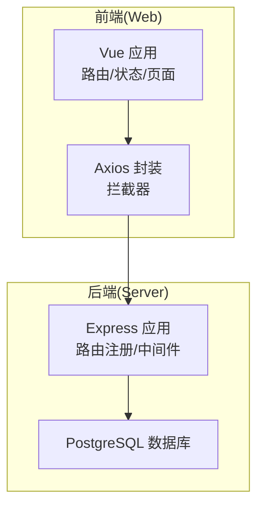
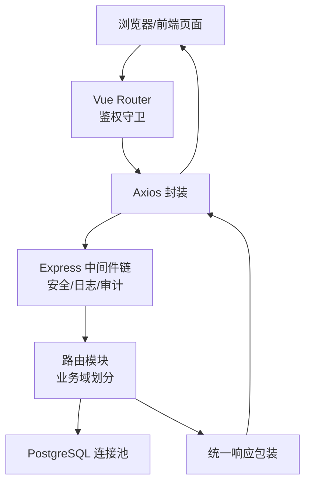
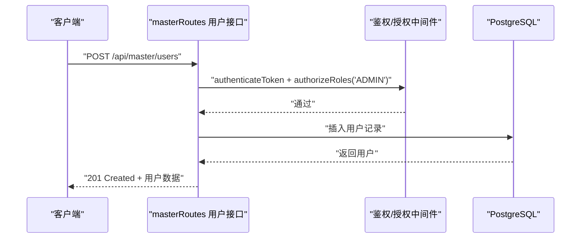
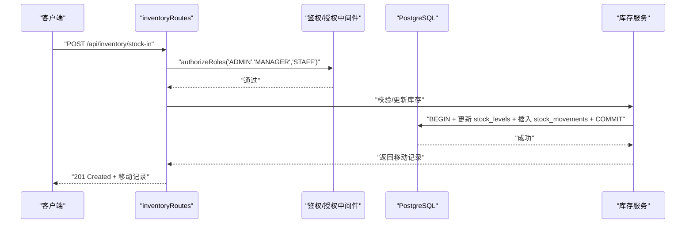
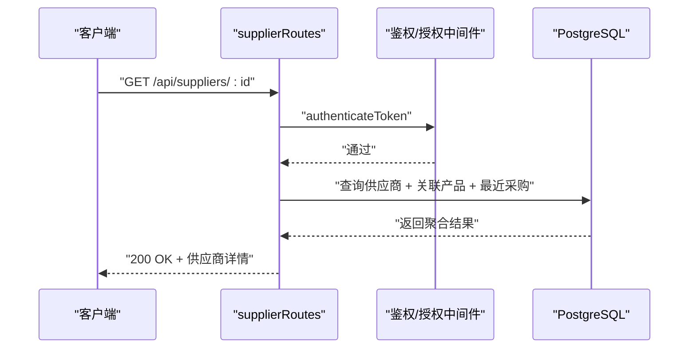
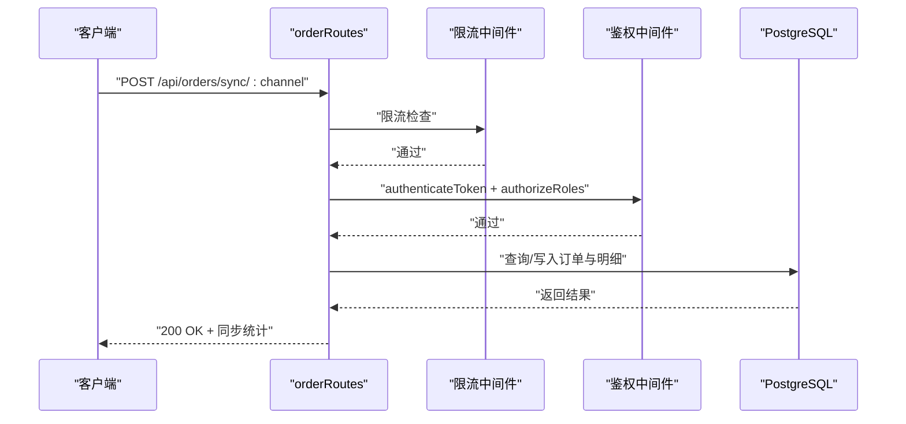
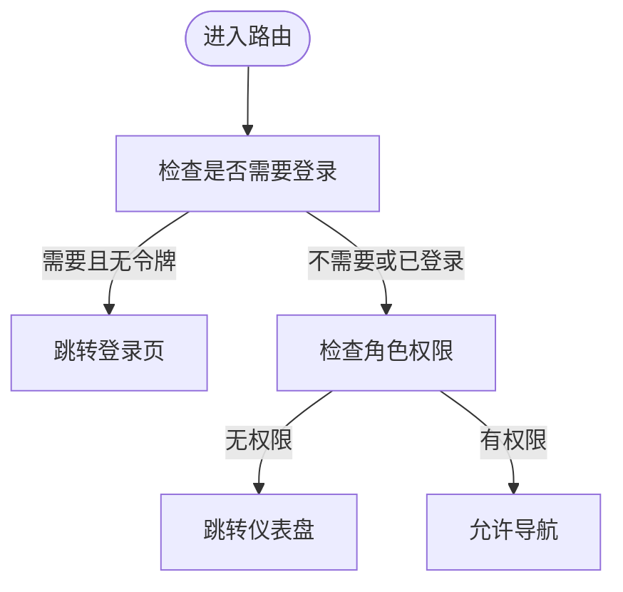
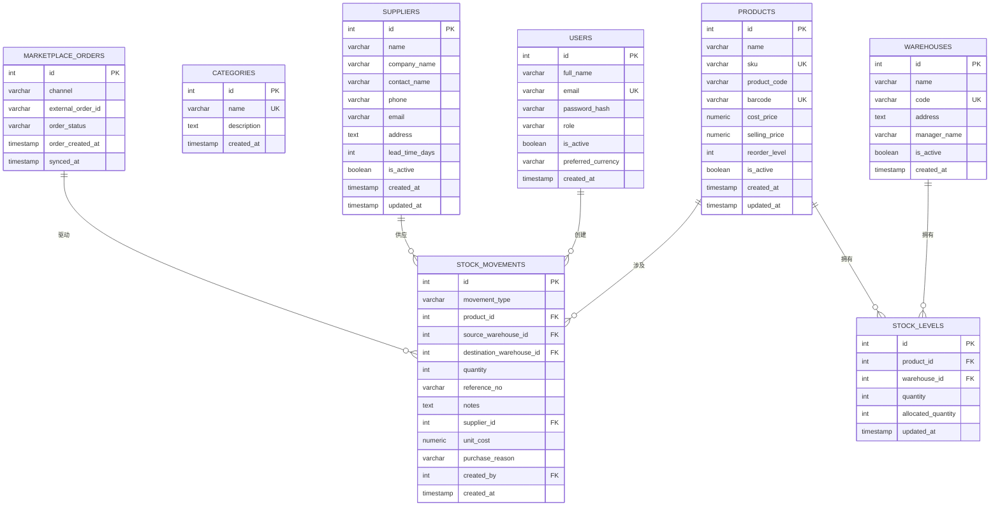
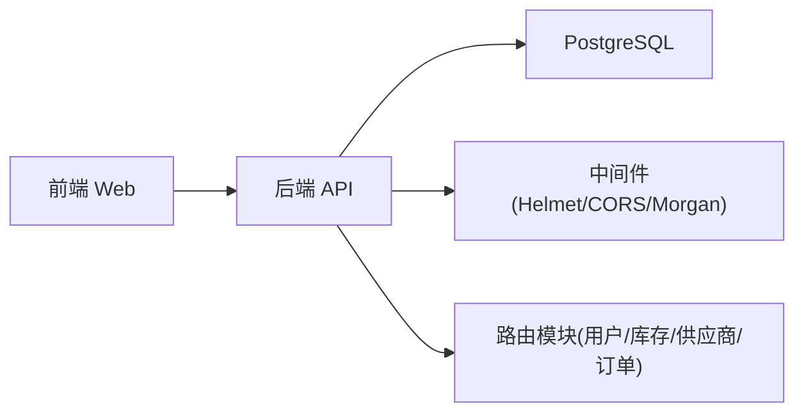

# 项目概述

<cite>
**本文引用的文件**
- [README.md](file://README.md)
- [server/src/app.js](file://server/src/app.js)
- [server/src/server.js](file://server/src/server.js)
- [server/src/config/db.js](file://server/src/config/db.js)
- [server/src/routes/masterRoutes.js](file://server/src/routes/masterRoutes.js)
- [server/src/routes/inventoryRoutes.js](file://server/src/routes/inventoryRoutes.js)
- [server/src/routes/supplierRoutes.js](file://server/src/routes/supplierRoutes.js)
- [server/src/routes/orderRoutes.js](file://server/src/routes/orderRoutes.js)
- [server/database/schema.sql](file://server/database/schema.sql)
- [web/src/router/index.js](file://web/src/router/index.js)
- [web/src/services/api.js](file://web/src/services/api.js)
- [web/src/main.js](file://web/src/main.js)
- [web/src/App.vue](file://web/src/App.vue)
- [server/package.json](file://server/package.json)
- [web/package.json](file://web/package.json)
</cite>

## 目录
1. [引言](#引言)
2. [项目结构](#项目结构)
3. [核心组件](#核心组件)
4. [架构总览](#架构总览)
5. [详细组件分析](#详细组件分析)
6. [依赖分析](#依赖分析)
7. [性能考虑](#性能考虑)
8. [故障排查指南](#故障排查指南)
9. [结论](#结论)
10. [附录](#附录)

## 引言
本项目是一个基于现代技术栈构建的库存管理系统，采用前后端分离架构，后端使用 Node.js + Express + PostgreSQL，前端使用 Vue 3 + Pinia + Vue Router + Tailwind CSS，提供从用户管理到库存、供应链、电商集成、报表分析的完整能力。系统强调可扩展性与安全性，通过 JWT 认证、基于角色的访问控制（RBAC）、审计日志与统一响应中间件，确保在多角色协作下的安全与可控。

系统特性包括：
- 用户管理与权限控制（ADMIN、MANAGER、STAFF）
- 商品、分类、仓库管理
- 多仓库存跟踪、出入库与调拨流程
- 条形码扫描与低库存预警中心
- 仪表盘与报表导出（CSV/PDF）
- 电商订单同步与库存联动
- 审计日志与统一错误处理

## 项目结构
项目采用前后端分离的双仓库结构：
- server：Express API 服务 + PostgreSQL 数据库脚本
- web：Vue 3 前端应用 + 路由与状态管理

图表来源
- [server/src/app.js:1-67](file://server/src/app.js#L1-L67)
- [web/src/services/api.js:1-45](file://web/src/services/api.js#L1-L45)

章节来源
- [README.md:22-29](file://README.md#L22-L29)
- [server/src/app.js:1-67](file://server/src/app.js#L1-L67)
- [web/src/router/index.js:1-209](file://web/src/router/index.js#L1-L209)

## 核心组件
- 应用入口与路由
  - 后端：Express 应用集中注册路由与中间件，统一健康检查与错误处理。
  - 前端：Vue 应用初始化 Pinia、Router，并挂载全局 Toast 中心。
- 数据访问层
  - 后端：基于 pg 的连接池封装，支持 SSL 连接与超时配置。
- 路由与业务模块
  - 后端：按领域拆分路由模块（用户/商品/库存/供应商/订单/报表/设置等）。
- 前端服务与拦截器
  - Axios 封装统一注入认证与成本访问令牌，统一封装响应结构与错误提示。

章节来源
- [server/src/server.js:1-28](file://server/src/server.js#L1-L28)
- [server/src/config/db.js:1-25](file://server/src/config/db.js#L1-L25)
- [web/src/main.js:1-14](file://web/src/main.js#L1-L14)
- [web/src/App.vue:1-9](file://web/src/App.vue#L1-L9)
- [web/src/services/api.js:1-45](file://web/src/services/api.js#L1-L45)

## 架构总览
系统采用前后端分离与模块化路由的架构设计：
- 前端通过 Axios 发起 REST 请求，自动携带 Authorization 与成本访问令牌。
- 后端通过中间件链路处理安全头、CORS、日志、审计与统一响应包装。
- 数据库采用 PostgreSQL，通过连接池管理并发与连接超时。
- 路由按功能域划分，便于扩展与维护。

图表来源
- [web/src/router/index.js:182-209](file://web/src/router/index.js#L182-L209)
- [web/src/services/api.js:1-45](file://web/src/services/api.js#L1-L45)
- [server/src/app.js:28-64](file://server/src/app.js#L28-L64)
- [server/src/config/db.js:15-24](file://server/src/config/db.js#L15-L24)

章节来源
- [server/src/app.js:28-64](file://server/src/app.js#L28-L64)
- [server/src/server.js:13-25](file://server/src/server.js#L13-L25)
- [server/src/config/db.js:3-11](file://server/src/config/db.js#L3-L11)

## 详细组件分析

### 用户管理与权限控制
- 功能要点
  - 支持用户列表（搜索、分页）、创建（仅 ADMIN）、更新（仅 ADMIN）、删除（禁止删除自身）。
  - 成本价格访问控制：通过自定义头部传递成本访问令牌，实现敏感字段的条件可见。
- 关键流程
  - 鉴权中间件 + 角色授权中间件保护路由。
  - 成本访问令牌校验与成本字段掩码策略。

图表来源
- [server/src/routes/masterRoutes.js:563-585](file://server/src/routes/masterRoutes.js#L563-L585)

章节来源
- [server/src/routes/masterRoutes.js:492-661](file://server/src/routes/masterRoutes.js#L492-L661)

### 库存管理与事务处理
- 功能要点
  - 库存总览（搜索、分类/仓库筛选、低库存过滤、分页）。
  - 出入库与调拨事务，支持事务回滚与可用库存校验。
  - 库存分配/释放（预留/释放订单占用）。
- 关键流程
  - 事务型库存更新，确保一致性。
  - 统一分页与搜索参数处理。

图表来源
- [server/src/routes/inventoryRoutes.js:229-403](file://server/src/routes/inventoryRoutes.js#L229-L403)

章节来源
- [server/src/routes/inventoryRoutes.js:16-151](file://server/src/routes/inventoryRoutes.js#L16-L151)

### 供应商与采购管理
- 功能要点
  - 供应商列表（搜索、状态筛选、排序）、详情聚合（关联产品、最近采购）。
  - 创建/更新/状态变更/删除，带审计上下文。
- 关键流程
  - 多表联查聚合供应商详情。
  - 批量查询优化（Promise.all）。

图表来源
- [server/src/routes/supplierRoutes.js:171-232](file://server/src/routes/supplierRoutes.js#L171-L232)

章节来源
- [server/src/routes/supplierRoutes.js:23-92](file://server/src/routes/supplierRoutes.js#L23-L92)

### 电商订单同步与展示
- 功能要点
  - 支持 Shopee/Lazada/TikTok 订单同步，带限流保护。
  - 订单列表（渠道、状态、搜索）、详情（订单项与商品信息）。
- 关键流程
  - 限流中间件保护同步频率。
  - 多表联查返回订单与明细。

图表来源
- [server/src/routes/orderRoutes.js:13-29](file://server/src/routes/orderRoutes.js#L13-L29)

章节来源
- [server/src/routes/orderRoutes.js:31-110](file://server/src/routes/orderRoutes.js#L31-L110)

### 前端路由与鉴权
- 功能要点
  - 基于 meta 字段的鉴权与角色控制（requiresAuth、roles、guestOnly）。
  - 登录页与仪表盘页路由，以及各类业务页面路由。
- 关键流程
  - 导航前置守卫读取本地存储中的用户与令牌，进行跳转控制。

图表来源
- [web/src/router/index.js:188-206](file://web/src/router/index.js#L188-L206)

章节来源
- [web/src/router/index.js:29-180](file://web/src/router/index.js#L29-L180)

### 数据模型概览（核心表）
系统围绕用户、商品、仓库、库存、移动、供应商、订单等核心实体建立关系，支撑库存流转与供应链协同。

图表来源
- [server/database/schema.sql:1-200](file://server/database/schema.sql#L1-L200)

章节来源
- [server/database/schema.sql:1-200](file://server/database/schema.sql#L1-L200)

## 依赖分析
- 技术栈选择理由
  - 前端：Vue 3 提供响应式与组合式 API；Pinia 简化状态管理；Tailwind CSS 快速样式；Vite 提升开发体验。
  - 后端：Express 轻量稳定；pg 连接池高效管理连接；Helmet/CORS/Morgan 提升安全与可观测性。
  - 数据库：PostgreSQL 支持复杂关系与 JSONB 存储，满足电商与库存的高扩展需求。
- 模块耦合
  - 前端通过 Axios 与后端路由解耦；后端路由模块按领域拆分，降低耦合度。
  - 中间件层统一处理安全与审计，避免重复逻辑。

图表来源
- [server/src/app.js:28-56](file://server/src/app.js#L28-L56)
- [server/package.json:15-29](file://server/package.json#L15-L29)
- [web/package.json:12-32](file://web/package.json#L12-L32)

章节来源
- [server/package.json:15-29](file://server/package.json#L15-L29)
- [web/package.json:12-32](file://web/package.json#L12-L32)

## 性能考虑
- 查询性能
  - 列表接口统一支持分页与搜索，避免一次性加载大量数据。
  - 使用 Promise.all 并行查询，减少往返时间。
- 数据库连接
  - 连接池与超时配置，避免长事务与连接泄漏。
- 前端体验
  - 路由懒加载与状态集中管理，降低首屏压力。
- 电商同步
  - 限流中间件限制同步频率，避免第三方平台限流风险。

## 故障排查指南
- 启动顺序与连通性
  - 确认数据库已启动并执行 schema/seed；后端健康检查地址用于验证服务可用性。
- 登录与鉴权
  - 若登录页提示“后端服务正常”，说明前后端连通；若失败，检查令牌与成本访问令牌是否正确注入。
- 错误处理
  - 后端统一兜底错误，避免堆栈泄露；前端拦截器将后端错误消息透传到用户界面。

章节来源
- [README.md:66-71](file://README.md#L66-L71)
- [server/src/app.js:57-64](file://server/src/app.js#L57-L64)
- [web/src/services/api.js:36-42](file://web/src/services/api.js#L36-L42)

## 结论
本项目以清晰的前后端分离架构、模块化的后端路由与完善的数据库模型为基础，提供了覆盖库存、供应链与电商集成的完整解决方案。通过统一的安全中间件、审计日志与成本访问控制，系统在保证安全性的同时兼顾易用性与可扩展性。建议在生产环境中结合容器编排与监控体系进一步完善可观测性与弹性。

## 附录
- 快速开始与环境准备
  - 创建数据库并执行 schema/seed；启动后端与前端；或使用 docker-compose 一键部署。
- 测试账户
  - 提供多角色测试账号，便于快速验证权限与流程。

章节来源
- [README.md:31-65](file://README.md#L31-L65)